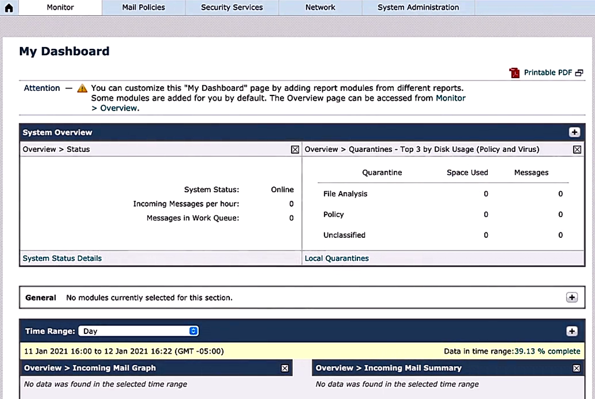
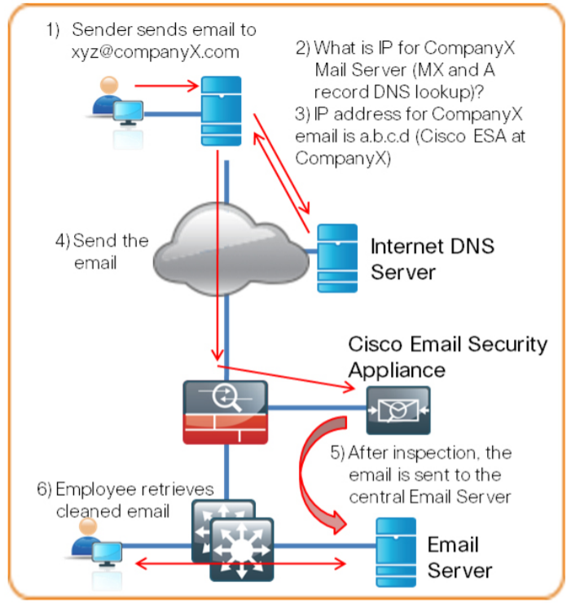

# Spam filtering

Trainer: Charles Judd

- Cisco Email Security Appliance (ESA)
  - placed btw edge device and mail server
  - ESA acting as a mail transfer agent
  - public AX records for the domain pointing to the ESA public IP address

    

      &nbsp;&nbsp;
      
    

- Typical ESA mail flow
  - external sender emails 'support@kwtrain.com'
  - sender's emails server performs MX record search
  - hostname of Cisco ESA is returned (e.g., 'mail.kwtrain.com')
  - sender's server also queries DNS server fro the IP address associated w/ 'mail.kwtrain.com'
  - sender's mail server opens SMTP connection w/ Cisco ESA
  - ESA helps incoming mail against policies and delivers to internal email server, if acceptable
  - internal user's email client will retrieve message from internal mail server using POP or IMAP

- Typical ESA mail flow
  - external sender emails 'support@kwtrain.com'
  - sender's emails server performs MX record search
  - hostname of Cisco ESA is returned (e.g., 'mail.kwtrain.com')
  - sender's server also queries DNS server fro the IP address associated w/ 'mail.kwtrain.com'
  - sender's mail server opens SMTP connection w/ Cisco ESA
  - ESA helps incoming mail against policies and delivers to internal email server, if acceptable
  - internal user's email client will retrieve message from internal mail server using POP or IMAP

- Demo: enable spam filtering on ESA
  - ESA dashboard > tabs - Monitor, Mail Policies, Security Services, Network, System Administration
  - Security Service tab > Anti-Spam > IronPort Anti-Spam>/span>
  - IronPort Anti-Spam > IronPort Anti-Spam Overview: disabled globally > 'Enable' button
  - IronPort Anti-Spam: Success - IronPort Anti-Spam scanning is not available ... > sections - IronPort Anti-Spam Overview, Rules Updates
  - IronPort Anti-Spam Overview: IronPort Anti-Spam Scanning = Enable, Messsage Scanning Threshold = 1M or less, Timeout for Scanning Single Message = 60 sec > 'Edit Global Setting...' button
  - Edit IronPort Anti-Spam Global Settings > sections - IronPort Anti-Spam Global Settings: Messages Scanning Thresholds, Timeout for Scanning Single Message, Scanning Profile
    - Message Scanning Thresholds: Always scan messags smaller than '1M' Maximum, Never scan messages larger than '2M' Maximum
    - Timeout for Scanning Single Message: '60' seconds
    - Scanning Profile: [(`*`) Normal | Aggressive | Regional (China)]

- Demo: config incoming mail policy
  - Mail Policies tab > Email Security Manager > Incoming Mail Policies
  - Incoming Mail Policies: sections - Find Polices, Policies > Policies: Polices Name, Anti-Spam, Anti-Virus, Advanced Malware Protection, Graymail, Content Filters, Outbreak Filters, Advance Phising Protection, Delete
  - Policies: Policy Name = Default Policy, Anti-Spam = Disabled, Anti-Virus = Not Available, ... > 'Disable' link
  - Mail Policies: Anti-Spam > AntiSpam Settings: Policy = Default; Enable Anti-Spam Scanning for This Policy = Disabled; areas - Positively-Identified Settings, Suspected Spam Settings, Spam Thresholds
    - Enable Anti-Spam Scanning for this Policy = Use IronPort Anti-Spam service
    - Positively-Identified Settings: Apply This Action to Message = Deliver | Drop | Bounce --> missing quarantine option, enable quarantine service
    - Positively-Identified Settings (quarantine option shown): Apply This Action to Message = Deliver | Drop | (`*`)Spam Quarantine | Bounce
    - Suspected Spam Settings: Enable Suspected Spam Settings = No | (`*`)Yes; Apply This Action to Message = Deliver; Add Text to Subject = Prepend '[SUSPECTED SPAM]'
  - same action applyied to outgoing mail policy: Mail Policies tab > Email Security Manager > Outgoing Mail Policies

- Demo: enable quarantine service 
  - Monitor tab > System Capacity > Spam Quarantine
  - Spam Quarantine: Spam Quarantine (disabled) > 'Enable' button
  - Edit Spam Quarantine: sections - Spam Quarantine Setting, Edit-User Quarantine Access, Spam Notification
    - Spam Quarantine Settings: Quarantine Size = When storage full, automatically delete oldest message first; Schedule Delete After = 14 days; Notify Cisco Upon Message Release = Send a copy of released messages to Cisco for analysis (recommended) [but turn off now]; Span Quarantine Appearance = Use Current Logo
    - Edit-User Quarantine Access: Enable Edit-User Quarantine Access = On; End-User Authentication = None | Mailbox(IMAP/POP) | (`*`)LDAP; Hide Message Bodies: Do not display message bodies to end-users until message is released = Off
    - Spam Notification: Enable Spam Notification = On > display many options to set depending on requirements (just to show options)
      - enable spam summary spam email digest
      - alert users about any messags quarantined
      - common practice, otherwise user probably missing important messages
      - easing admin load off the email admin, email released by users themselves
    - 'Submit' button > Span Quarantine: Success - Settings are saved. ... > show current status of Spam Quarantine
  - NB: LDAP Query needed to be configured if LDAP Authentication enabled

