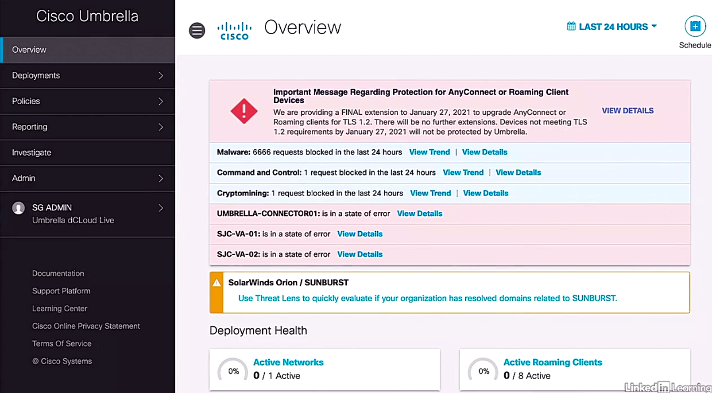

# Cisco umbrella overview

Trainer: Charels Judd

- Cisco Umbrella dashboard - Overview
  - Deployment Health: Active NetworksActive Roaming Clients, Active Appliances, Active Network Tunnels
  - Network Breakdown: Total Requests, Total Blocks, Security Blocks
  - Firewall Breakdown: Total Firewall Sessions, Total Firewall Blocks
  - Security Categories: Malware Blocks, Phising Blocks, Commands & Control Blocks, Cryptomining Blocks
  - App Discovery and Control (last 90 days)
  - Flagged Apps
  - Security Requests: All Types, Computers, Users, Roaming Computers

  <figure style="margin: 0.5em; display: flex; justify-content: center; align-items: center;">
    
  </figure>

- Cisco Umbrella dashboard - Deployments
  - Core Identities: Networks, Network Devices, Roaming Computers, Mobile Devices, Chromebook Users, Network Tunnels, Users and Groups
    - Roaming Computers > Roaming Client Download icon to download > Download Roaming Client: Cisco Umbrella Roaming Client, AnConnect Umbrella Roaming Security Module
  - Configurations: Domain Management, Sites and Active Directory, Internal Networks, Root Certificate, SAML Configuration, Service Account Exceptions

- Cisco Umbrella dashbopard - Reporting
  - Core Reports: Security Overviews, Security Activity, Activity Search, App Discovery, Threats
    - Security Activity: Time, Event Type, Response > expand to see more details
    - Activity Search: info about a security event or about an identity, 'View Full Details' to see details
  - Additional Reports: Total Requests, Activity CVolume, Top Destinations, Top Categories, Top Identities
  - Management: Exported Reports

- Cisco Umbrella dashboard - Investigate
  - Investigate > Search: field for hostname, URL, ASN, IP hash, or email address > Search = ... > 'INVESTIGATE' button
  - Investigate: Summary w/ 100 in scale > Ransomeware
  - details of the threats, including Timeline, DNS Resolution, WHOIS Record Data, Geographical distribution, Associated Samples, Features, Security Features, Subdomains, Co-occurrences
  - Co-occurrences: a site requested within seconds before or after a particular domain is accessed

