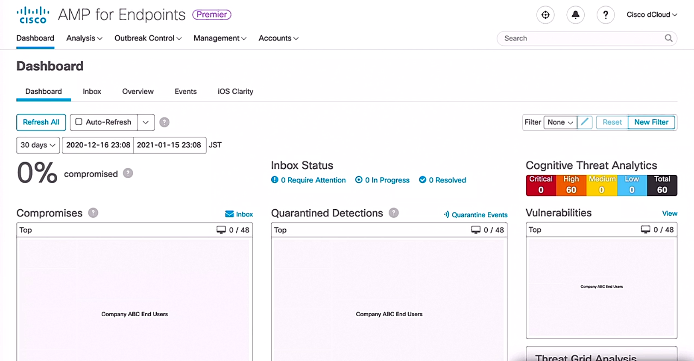
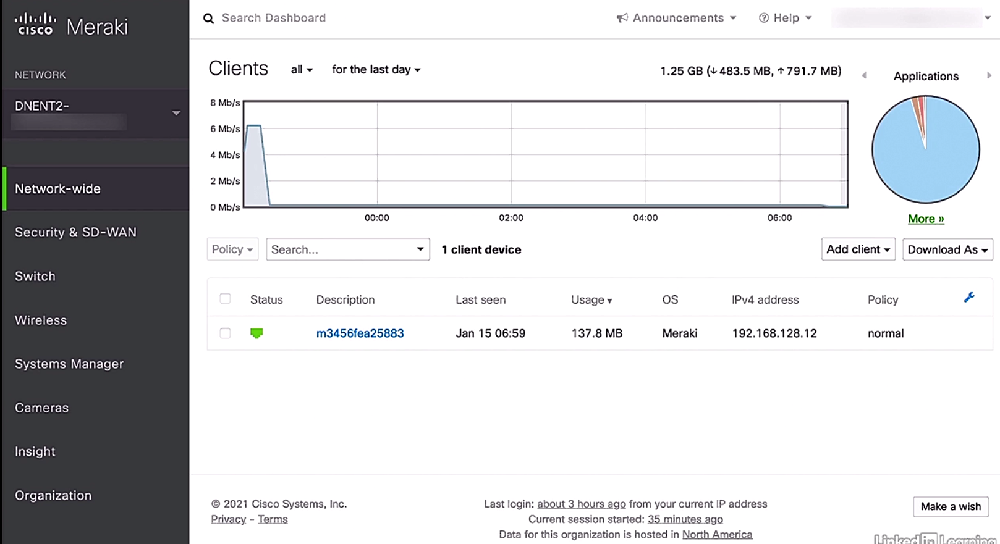

# Endpoint Protection

## Antimalware

- Cisco AMP for Endpoints - anti-malware featrue
  - tracking and securing endpoints in specific and targeted manner
  - tabs: Dashboard, Analysis, Outbreak Control, Management, Accounts
  - each endpoint controlled under AMP w/ a light weighted AMP connectors 

  <figure style="margin: 0.5em; display: flex; justify-content: center; align-items: center;">
    
  </figure>

- Types of policies
  - audit policies:
    - monitor connections
    - purpose: gathering data to tune protection better
    - recommended to use in deployment phase to find best setting for network or use in troubleshooting
  - protect policies:
    - block malicious network connections
    - recommended used in production environment

- Demo: install AMP connector
  - Management tab > Download Connector
  - Download Connector: Windows, Mac, Linux, Android

- Demo: AMP policies
  - Management tab > Policies tabs: All Products, Windows, Android, Mac, Linux, Network, iOS
  - each tab shown a list of related polices
  - 'Audit Policy for FireAMP Linus' link: Modes and Engine; Outbreak  > 'Edit' button
    - Edit Policy: Name = Audit Policy for FireAMP Linus; tabs - Mode and Engine, Exclusions, Proxy, Outbreak Control, Product Updates, Advanced Settings
    - Modes and Engine' tab > Convicton Modes: Filters Quarantine | (`*`)Audit, Network = Audit | (`*`)Disabled; Detection Engines: ClamAV = Off
  - 'Protect Policy for FireAMP Mac' link: Mode and Engine, Exclusions, Proxy, Groups > 'Edit' button
    - Edit Policy: Name = Protect Policy for FireAMP Mac; Modes and Engines = On; Conviction Modes: Files = (`*`)Quarantine | Audit, Network = (`*`)Block | Audit | Disabled; Detection Engine: ClamAV = On (offline protection)
    - Edit Policy: Name = Protect Policy for FireAMP Mac; Advanced Settings: tabs - Administrative Features, Client User Interface, File and Process Scan, Cache, ClamAV, Network, Schedule Scans
  - 'Server Policy' link: Mode and Engine, Exclusions, Proxy, Groups = Server (3); Outbreak Control - Custom Detectios - Simple, Custom Detection - Advanced, Application Control, Network > 'Edit' button
    - Edit Policy: Name = 'Server Policy': tabs - Mode and Engine, Exclusions, Proxy, Outbreak Control, Product Updates, Advanced Settings; Mode and Engine = On; Conviction Modes: Files = Quarantine, Network = Disable, Malcious Activity Protection = (`*`)Quarantine | Block | Audit | Disabled, System Process Protection = Protect | (`*`) Audit | Disable, Script Protection = Protect | (`*`) Audit | Disable, Exploit Prevention = (`*`)Block | Audit | Disabled, Behavior Protection = Protect | Audit | (`*`)Disabled; Detection Engine: TETRA = On; Recommendation Settings on the right

## Retrospective security

- Antivirus systems
  - tradition: inspecting files only at accessing or executing
  - AMP features
    - continuous analysis
    - retrospective security
  - some malware sleeps to hide and execute until download or activation
  - AMP next generation features
    - recording the activity of all file within the system
    - determining if file was formerly categorized as benign and turned into a malicious threat at later time
    - able to provide an historical view

- Demo: retrospective security under Dashboard tab
  - Dashboard tab > tabs - Dashboard, Inbox, Overview, Events, iOS Clarity
  - Dashboard tab > Inbox: any endpoints under control or requiring attentions > areas - Compromised, Significant Compromise Artifacts, Compromise Event Types
    - button element: 3 types of event categories (similar to ticketing system) - Require Attention, IN Progress, Resolved
  - Events tab: historical view of events > Filter: (New) > Event Type = All Event Type, Group = All Groups, Time Range = [Day | Week | 30 Days], Sort = Time > Loading evenets automatically
    - Select the event line to show event details: Connector Details, Comments, Error; icons - Device Trajectory, Management
    - 'Device Trajectory' icon: the path of the device taken through the network > Device Trajectory

- Demo: retrospective security under Analysis tab
  - Analysis tab > Events, Detection / Quarantine, IOS Clarity, Cognitive Incidents, Agentless Cognitive Incidents, File Analysis, Search, Threat Root Causes, Prevalence, Vulnerable Software, Reports, Indicators, SecureX Threat Hunting Incidents 
  - Analysis tab > Reports: create new custom report or edit existing report; entry fields - Report Type, Period, Title, Creator
    - 'Configure Custom Reports' button (on top right corner) to create new repports or edit existing reports) > Custom Report Configurations
    - create new report: Custom Report Configurations > 'New Custom Report' button > Report Type = Weekly | Monthly | Quarterly, Title = '...', Groups = No groups selected, Email = On > 'Save and Schedule' button
    - edit existing: Custom Report Configurations > entry - Title = DW test > 'Edit' button > Title = DW test, Groups = Triage, Email = On > 'Save and Schedule' | 'Cancel' button
  - Reports > Title = test > 'test' link > 'Tables of Contents' of the report w/ section links

## Indication of compromise (IOC)

- Indication of compromise (IOC) overview
  - data able to identify specific info related to
    - malicious files
    - behavior of the network
    - any abnormal behavior
  - defining key aspects of the endpoint policies as an indicator of IOC

- Demo: create new or edit existed IOC
  - Outbreak Control tab > Outbreak Control tab: CUSTOM DETECTION - Simple, Advanced, Android; APPLICATION CONTROL - Blocked Applications, Allowed Applications; NETWORK - IP Block & Allow Lists; ENDPOINT IOC - Scan Summary
  - Outbreak Control tab > CUSTOM DETECTION > Simple > Custom Detection - Simple: entries of custom detections
    - view existing: entry - test > 'Edit' button > side element w/ tabs - Add SHA-246, Upload File, Upload Set of SHA-256 > Add SHA-256 tab > Update Name = test; File Included -> details of the attached file shown
    - create new: Custom Detection - Simple > 'Create' button > New = cj-test > 'Save' button > top of the list shown the entry > 'Edit' button to upload file(s) or add signature for the new custom detection entry to quarantine
    - new top entry - Update Name = cj-test; tabs - Add SHA-256, Upload File, Upload Set of SHA-256
  - Outbreak Control tab > CUSTOM DETECTION > Advanced > Custom Detection - Advanced > more signature types
    - 'Create Signature Set' button > Name = cj-test > 'Save' button > entry shown on top > 'Edit' button
    - `Add Signature' button > Signature = ..., Type = Auto detect or select from drop down box
  - CUSTOM DETECTION > Android > Custom Detection - Android: dedicated section for Android w/ .apk extention files

- Demo: IP access list control to block a list of network
  - Outbreak Control tab > NETWORK - IP Block & Allow Lists > Network - IP Block & Allow Lists: tabs - All IP Lists, IP Block Lists, IP Allow List, Isolation IP Allow Lists > All IP Lists: section - IP Blacklists: IPs and CIDR Blocks = 192.168.01.0/24 & 192.168.2.0/23, Used in Groups = None, Usd in Policies = None; buttons - Replace, Export, Edit, Delete > 'Edit' button to change the settings

- Demo: viewing IOC info
  - Analysis tab > Events
  - Outbreak Control tab > ENDPOINT IOC > Endpoint IOC - Scan Summary
  - Analysis tab > Indicators > list of IOC files
    - the most right column: color buttons to indicate the security levels - Low, Medium, High, Critical
    - the info feed used by Cisco AMP to protect end points
    - expand entry to view more detail description

## Antivirus

- Antivirus in AMP
  - working w/ antivirus software
  - not interfering w/ these software
  - taking action after the antivirus software performed
  - Cisco offline antivirus solutions
    - TETRA: windows
    - ClamAV: Linux
  - AMP not protecting by default, enabled within created policies
  - AV definitions updated daily

- Demo: enable antivirus feature
  - Management tab > AV Definition Summary: tabs - TETRA 64bit, TETRA 32 bit, ClamAV Mac, ClamAV Linus-Only, ClamAV Linus-Full
  - Management tab > Policies > Info-policy entry > 'Edit' button
    - Edit Policy (Windows) > Detection Engines: TETRA = on
  - Edit Policy (Windows) > Advanced Settings > TETRA > Content Update Interval = 30 minutes, Local AMP Update Server = Off, AMP Update Server = ...

- Demo: adding extra AV protection
  - Management tab > Download Connector > 'Download' button w/ appropriate section

## Dynamic file analysis

- Dynamic file analysis in AMP
  - file presented on any endpoint under control of AMP
  - continuously watching the file
  - recording the behavior and activity associated to the file
  - any changes of file regardless good or bad
  - AMP alerts and remediate the threat

- Demo: config AMP file analysis
  - Analysis tab > File Analysis > tabs - Your Files, Global Files
  - Your Files tab: history of analyzed files, including automatic analysis and submitted files
    - expand an entry w/ submitted file (red circle w/ dots) to review the details
    - expand to view entry details: Fingerprint (SHA-256), File name = 'abc', Threat Score = 95
    - 'Report' button > File Analysis for abc: sections - Analysis Report, Behavioral Indicators, HTTP Traffic, DNS Traffic, TCP/IP Streams, Processes, Artifacts
    - Behavioral Indicators: entry list > '+' icon on select entry to view details
  - Global Files tab: list of entries including public file submitted by others and private files submitted within organization > 'Search' file, 'Submit File' button, '-' and '+' icons
    - 'Report' button on selected entry > same Analysis Report format as Your Files tab

- Demo: file trajectory
  - Analysis tab > File Analysis > Your Files > entry w/ red icon > pop out menu > File Trajectory
  - File Trajectory:
    - purpose: determine the scope of the issue and pinpoint the origin endpoint
    - expanded view of the file across the environment
    - no history
    - showing the first end point of an offending file or threat and every other end point that came in contact

## Endpoint device management

- Endpoint device management overview
  - a process used to detect, provision, update, troubleshoot, and protect devices on the network
  - any device communicating w/ our network
  - largest attach surface for an organization (~70% successful breaches)
  - attackers able to use endpoints to gain access to important internal assets

- Endpoint device management
  - policy-based solution for endpoint compliance
  - client/server model w/ centralized management
  - client software allowing for endpoint monitoring

- Endpoint device management features
  - end-to-end view of network activity
  - bandwidth management for users amd apps
  - deployment support for new devices
  - security and compliance enforcement
  - patching and updating of endpoints
  - malicious file/application removal

- Advantages of endpoint device management deployment
  - centralized antivirus software
  - web filtering
  - VPN software
  - data nad email encryption
  - patch management

## Asset inventory

- Asset inventory overview
  - the process to keep track of all corporate assets, i.e., end devices
  - time consuming task for administrator
    - who using these assets
    - when accessing
    - where located

- Solutions for asset inventory
  - Cisco AMP
  - Cisco DNA Center

  <figure style="margin: 0.5em; display: flex; justify-content: center; align-items: center;">
    
  </figure>

- Methods to discover assets in DNS Center
  - search of manually-indicated IP address range
  - leveraging discovery protocols, including CDP, LLDP

- Demo: review current discovered assets
  - credentials valid for CLI , SNMP, HTTPS, or NetComp on the devices
  - typically having an admin account on network devices valid across the network
  - Cisco DNS dashbopard > tool: 9-dot icon (top right corner) > tools - Discovery, Topology, Command Runner, License Manager, Template Editor, Wide Area Bonjour, Security Advisories, Network Telemetry > Discovery
  - Discover Dashboard - current inventory > 'View All Discoveries' area
  - Discovery page > Discovery Details: CDP Level, LLDP Level, Protocol Order, Retry Count, Timeout, IP Address/Range, IP Filter List, Preferred Management IP, CLI Credentials, SNMPv2c READ, SNMPv2c Wite, SNMPv3, HTTP(S) READ, HTTP(S) Write, NETCONF

- Demo: device info under DNS Center control
  - PROVISION tab: list of current inventory under the control of DNA Center
    - updated by polling the listed devices every 25 mins by default
    - click on an entry to review details, configuration, and interfaces > 'View 360' link
  - Device 360 > historical info chart (display device health w/ timeline), Issues, Physical Neighbor Topology, Event Viewer, Path Trace, Application Experience, Detail Information (Device Info, Interfaces, Fabric)

## Mobile device management (MDM)

- Mobile device management overview
  - unmanaged mobile devices probably causing huge security risk
  - commonly accessing highly sensitive enterprise data from a mobile devices
  - ensuring the devices up-to-date patched properly
  - able to remotely wipe these devices if it stolen or lost
  

- Cisco solution for mobile device management: Meraki
  - a unified way to manage the devices from a central location
  - enforcing security policies
  - remotely wipe a device in case

  <figure style="margin: 0.5em; display: flex; justify-content: center; align-items: center;">
    
  </figure>

- Methods to install profile on iOS end devices w/ Meraki
  - systems manager iOS app w/ QR code provided
  - manually open 'm.meraki.com' w/ a Network ID
  - automatically discover enrollment over the network

- Demo: registering devices w/ mobile device manager
  - System Manager tab > MANAGE > Add devices: tabs - IOS, Windows, Android, OS X, Chrome, Help
  - Apple push certificate status: Your path notification certificate is configured correctly. = On -> create w/ Apple ID  w/o charge
  - install the profile on each iOS device
  - System Manager > CONFIG > Genreal
  - Adminstration: areas - Network locations, User authentication settings, Enrollment settings, Access rights
    - Enrollment settings: provide a tag for the device
    - Access rights: Dashboard/macOS - Erase devices, Lock and clear device passcode, Install apps, Install profiles

- Demo: create configuration profiles
  - settings including
    - WiFi access settings
    - VPN access
    - device restrictions
    - email settings
    - etc.
  - System Manager tab > MANAGE > Settings
    - '+ Add profile' button to create new profile
    - default profiles: User profile (Apple), User profile (Chrome), Upload custom Apple profile > 'Continue' button
    - Profile Configuration: Name = Test, Removal Policy = All users to remove this profile, Scope = with All of the following tags (one of the options), Device tags = recently-added (one option) > 'Save' button
    - TEST > '+ Add settings' button to add more settings

- Demo: Misc features
  - System Manager > CONFIGURE > Geofencing: config actions based on physical location of a device
  - System Manager > CONFIGURE > Policies: config police rules, e.g., passcode lock
  - System Manager > CONFIGURE > Alert: config to receive automatic alerts when policy violated
  - System Manager > MONITOR > Devices: config to manage the devices

## Multifactor authentication (MFA)

- Multifactor Authentication (MFA) overview
  - two or more pieces of identity verification
  - control access to web apps, VPN usage, data, and more
  - requiring additional identity proof in conjunction w/ traditional login credential requirements

- Benefits of MFA
  - protection against brute force password attacks
  - protection against exposed or stolen credentials
  - access unable to be easily gained even if the username and password values are known

- Methods of MFA
  - one-time passwords (OPTs) - time-based
  - SMS verification codes
  - email verification codes

- Activating MFA feature
  - enable MFA inside the application security settings
  - setup a second verification method
  - OPT method reqires association w/ OPT application

- Example: Google account
  - enable MFA to generate a QR code
  - Google authenticator app as OPT app and choose to add an account
  - then scan the provided QR code
  - entering a 6-digit code into the account
  - code expired every 30 seconds
  - login Google account by using username and password and entering the 6-digit code

- 3 potential types as additional identity information
  - knowledge: something you know, e.g., password or pin
  - possession: something you have, e.g., badge or smartphone
  - inheritance: something you are, e.g., biometric data

- Use of MFA
  - knowledge is typically the primary identificationtype
  - MFA adds additional identification from any of the three categories (knowledge, possession, or inheritance)

- MFA vs 2FA
  - two-factor authentication (2FA): using exactly two types of identity authentication
  - multifactor authentication (MFA): able to require more than two types of identity authentication

- Reasons to use MFA
  - passowrds alone is no longer enough
  - exposed, stolen, or leaked credentials are a huge threat to our security

## Endpoint posture assessment

- End posture assessment overview
  - posture: the compliance status of a device on the network
  - probably the most important concept for end points
  - endpoints as a very large attack surface on the network
  - each organization establishing its own criteria to determine what proper posture for endpoints
  - common posture concerns
    - operating systems patch and status
    - local disk encryption
    - up-to-date antimalware protection suite in place
    - awareness of external devices, e.g., USB attached storage devices

- Cisco Identity Service Engine (ISE)
  - allowing to set up endpoint posture policies for endpoint devices
  - policies varying based on user's roles, types of devices, locations, etc.
  - endpoint associated w/ a particular posture policy unable to access network until requirements of the policy meet

- Demo: enable posture service in ISE
  - Administration tab > System > Deployment
  - Deployment: folders - Deployment, PAN Failover
  - Deployment > Deployment Nodes: entry fields - Hostname, Personas, Role(s), Services > entry - Hostname = ise > 'ise' link
  - Edit Node: subtabs - General Settings, Profiling Configuration
    - General Settings: Hostname = ise, FQDN = ise.dcloud.cisco.com, IP address = 198.18.133.27, Node Type = Identity Service Engine (ISE); Role STANDALONE:  Policy Service = On, Enable Session Services = On, Enable Profiling Service = On, Enable Passive Identity Service = On

  <figure style="margin: 0.5em; display: flex; justify-content: center; align-items: center;">
    
  </figure>

- Demo: system posture settings
  - Administration tab > System > Settings > Posture (left menu): subtabs - General Settings, Reassessments, Updates, Acceptable Use Policy > General Settings
  - Posture General Settings: Remediation Timer = 4 mins, Network Transition Delay = 3 secs, Default Posture Status = Compliant, Continuous Monitoring Intervals = 5 mins, Posture Lease: Perform posture assessment every time a user connects to the network = On
    - Remediation Timer: the amount of time for client to remediate any issue; if not $\to$ report & noncompliance status
    - Continuous Monitoring Intervals: posture monitoring
    - Posture Lease: posture assessment lease period
  - Updates subtab > Posture Updates:
    - 'save' button: enable a predefined set of posture checks and rules for antivirus and anti-spyware on the clients, used to create default posture policy
    - 'Update Now' button: manually update during initiate deployment of ISE device, and then config automatically updates
  - Acceptable Use Policy subtab > Acceptable Use Policy Configuration: View, Add, Delete, entry
    - 'Add' icon: create an acceptable use policy dislayed to users to accept network usage terms and conditions
    - 'View' icon: display after user login and successfully passed a posture assessment
  

- Demo: create policy conditions
  - Policy tab > Policy Elements > Conditions
  - allowing single and multiple posture conditions
  - Posture (left panel) w/ many posture options
    - USB Condition subtab: predefined check - checks if USB mass storage device is connected
    - Anti-Virus subtab: entry fields - Name, Description > entries - ANY_av_win_inst, ANY_av_win_def, ANY_av_mac_inst, ANY_av_mac_def

- Demo: review current client posture requirements
  - determining if a client has the appropriate posture to be allowed onto the network 
  - Policy tab > Policy Elements > Results
  - Posture (left panel) > Remediation Actions > Requirements: entries for various requirements > click on selected entry

## Endpoint patching

- Endpoint patching benefits
  - security from known vulnerabilities
  - known vulnerabilities offer a well documented and legitimate attack vector
  - ensure endpoints fall under compliance regulations

- Best practices of endpoint patching
  - accurate inventory critical for ensuring protection
  - using automated patch management tools
  - using endpoint status reporting
  - testing patches in a sandbox environmen before deployment
  - checking for unexpected or adverse consequence
  - test rollback abilities of patches
  - subscribing to vendor security feeds
  - consider using consolidated feeds, such as the National Vulnerability Database from NIST
  - pare down announcements and alerts to only those needed
  - consolidating software when possible
  - multiple versions of a software meaning more vulnerabilities
  - assigning assets to a risk category
  - understanding which systems are most critical
  - more exposed assets should get priority patching

