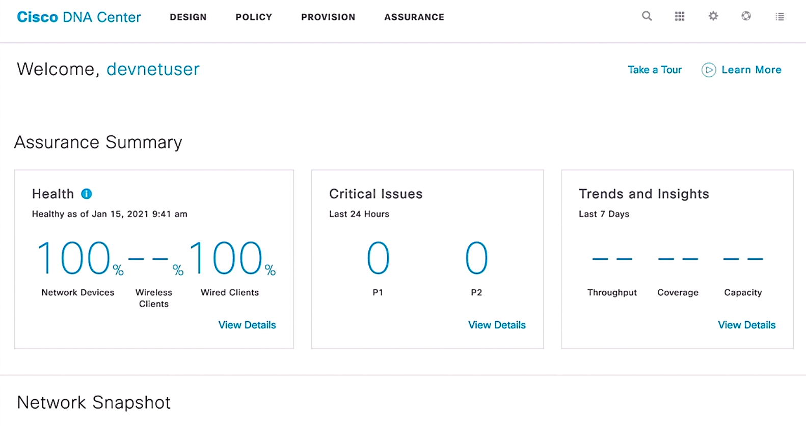

# Asset inventory

Trainer: Charles Judd

- Asset inventory overview
  - the process to keep track of all corporate assets, i.e., end devices
  - time consuming task for administrator
    - who using these assets
    - when accessing
    - where located

- Solutions for asset inventory
  - Cisco AMP
  - Cisco DNA Center

  <figure style="margin: 0.5em; display: flex; justify-content: center; align-items: center;">
    
  </figure>

- Methods to discover assets in DNS Center
  - search of manually-indicated IP address range
  - leveraging discovery protocols, including CDP, LLDP

- Demo: review current discovered assets
  - credentials valid for CLI , SNMP, HTTPS, or NetComp on the devices
  - typically having an admin account on network devices valid across the network
  - Cisco DNS dashbopard > tool: 9-dot icon > tools - Discovery, Topology, Command Runner, License Manager, Template Editor, Wide Area Bonjour, Security Advisories, Network Telemetry > Discovery
  - Discover Dashboard - current inventory > 'View All Discoveries' area
  - Discovery page > Discovery Details: CDP Level, LLDP Level, Protocol Order, Retry Count, Timeout, IP Address/Range, IP Filter List, Preferred Management IP, CLI Credentials, SNMPv2c READ, SNMPv2c Wite, SNMPv3, HTTP(S) READ, HTTP(S) Write, NETCONF

- Demo: device info under DNS Center control
  - PROVISION tab: list of current inventory under the control of DNA Center
    - updated by polling the listed devices every 25 mins by default
    - click on an entry to review details, configuration, and interfaces > 'View 360' link
  - Device 360 > historical info chart (display device health w/ timeline), Issues, Physical Neighbor Topology, Event Viewer, Path Trace, Application Experience, Detail Information (Device Info, Interfaces, Fabric)

