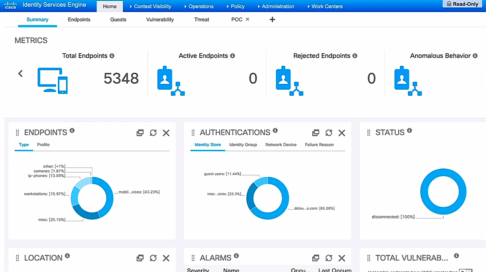

# Endpoint posture assessment

Trainer: Charles Judd

- End posture assessment overview
  - posture: the compliance status of a device on the network
  - probably the most important concept for end points
  - endpoints as a very large attack surface on the network
  - each organization establishing its own criteria to determine what proper posture for endpoints
  - common posture concerns
    - operating systems patch and status
    - local disk encryption
    - up-to-date antimalware protection suite in place
    - awareness of external devices, e.g., USB attached storage devices

- Cisco Identity Service Engine (ISE)
  - allowing to set up endpoint posture policies for endpoint devices
  - policies varying based on user's roles, types of devices, locations, etc.
  - endpoint associated w/ a particular posture policy unable to access network until requirements of the policy meet

  <figure style="margin: 0.5em; display: flex; justify-content: center; align-items: center;">
    
  </figure>

- Demo: enable posture service in ISE
  - Administration tab > System > Deployment
  - Deployment: folders - Deployment, PAN Failover
  - Deployment > Deployment Nodes: entry fields - Hostname, Personas, Role(s), Services > entry - Hostname = ise > 'ise' link
  - Edit Node: subtabs - General Settings, Profiling Configuration
    - General Settings: Hostname = ise, FQDN = ise.dcloud.cisco.com, IP address = 198.18.133.27, Node Type = Identity Service Engine (ISE); Role STANDALONE:  Policy Service = On, Enable Session Services = On, Enable Profiling Service = On, Enable Passive Identity Service = On

- Demo: system posture settings
  - Administration tab > System > Settings > Posture (left menu): subtabs - General Settings, Reassessments, Updates, Acceptable Use Policy > General Settings
  - Posture General Settings: Remediation Timer = 4 mins, Network Transition Delay = 3 secs, Default Posture Status = Compliant, Continuous Monitoring Intervals = 5 mins, Posture Lease: Perform posture assessment every time a user connects to the network = On
    - Remediation Timer: the amount of time for client to remediate any issue; if not $\to$ report & noncompliance status
    - Continuous Monitoring Intervals: posture monitoring
    - Posture Lease: posture assessment lease period
  - Updates subtab > Posture Updates:
    - 'save' button: enable a predefined set of posture checks and rules for antivirus and anti-spyware on the clients, used to create default posture policy
    - 'Update Now' button: manually update during initiate deployment of ISE device, and then config automatically updates
  - Acceptable Use Policy subtab > Acceptable Use Policy Configuration: View, Add, Delete, entry
    - 'Add' icon: create an acceptable use policy dislayed to users to accept network usage terms and conditions
    - 'View' icon: display after user login and successfully passed a posture assessment
  

- Demo: create policy conditions
  - Policy tab > Policy Elements > Conditions
  - allowing single and multiple posture conditions
  - Posture (left panel) w/ many posture options
    - USB Condition subtab: predefined check - checks if USB mass storage device is connected
    - Anti-Virus subtab: entry fields - Name, Description > entries - ANY_av_win_inst, ANY_av_win_def, ANY_av_mac_inst, ANY_av_mac_def

- Demo: review current client posture requirements
  - determining if a client has the appropriate posture to be allowed onto the network 
  - Policy tab > Policy Elements > Results
  - Posture (left panel) > Remediation Actions > Requirements: entries for various requirements > click on selected entry

