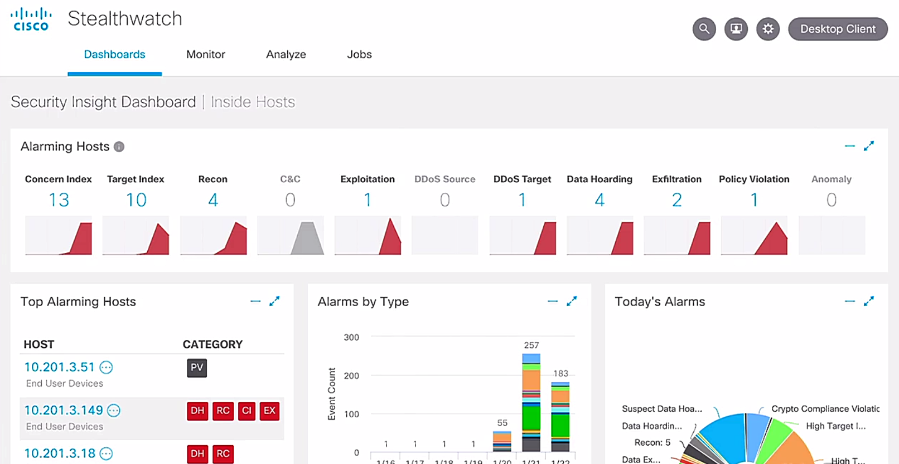
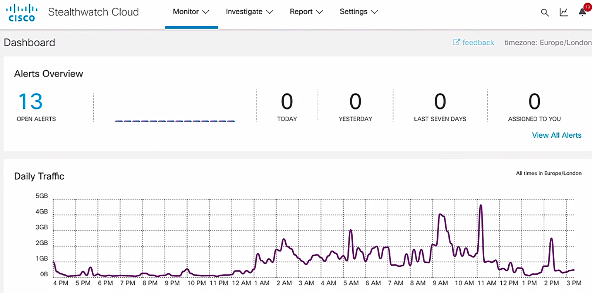

# Secure Access

## Guest services

- Guest service overview
  - providing network access in a secure manner to users outside of typical employees, such as contractors, consultants, or visitors
  - providing wired or wireless guest passes w/ limited access to these less trusted users
  - solution: Cisco ISE
  - types of guest portals: hotspot, self-registered, sponsored

- Demo: requirements for guest accounts
  - Work Centers tab > Guest Access > Settings
  - Settings (left panel): Guest Account Purge Policy, Guest Email Settings, Guest Locations and SSIDs, Guest Username Policy, Guest Password Policy, DHCP & DNS Services, Logging
  - Guest Username Policy: config username requirements for all guest username
  - Guest Password Policy: config password requirements for all guest password
  - Guest Account Purge Policy: perform an immediate purge or schedule when to delete expired accounts

- Demo: guest portals
  - Work Centers tab > Guest Access > Portal & Components: tabs - Guest Portals, Guest Types, Sponsor Groups, Sponsor Portals
  - Guest Portals: Hotsport Guest Portals, Self-Registered Portals, Sponsored Guest Portals
  - Hotspot Guest Portals:
    - allowing guests to access the Internet via access points w/o credentials to login
    - guests not requiring username and password credentials to access the net
    - Acceptable Use Policy (AUP) Page Settings: Include an AUP page = On
  - Self-Registered Portals
    - allowing user to create their own guest accounts and 
    - to be assigned username and password or able to use a social account
  - Sponsored Guest Portals
    - Sponsor ~ Admin
    - creating a temporary username and password for an authorized user
    - Guest Change Password Settings: require user to change the password during the 1st login

- Demo: Hostsport Guest Portal settings
  - Guest Portals > 'Settings' tab on top of the page -> same as 'Work Centers tab > Guest Access > Settings'
  - Settings > Guest Locations & SSIDs > areas - Guest Locations, Guest SSIDs
  - Guest Locations: Location name, Time Zone
  - Guest SSIDs: add/edit/delete SSID

- Demo: review of guest portals
  - Operations tab > Reports > Export Summary: My Reports, Reports, Scheduled Reports
  - Reports > Guests: tabs - AUP Acceptance Status, Guest Accounting, Master Guest Report, My Devices Login and Audit, Sponsor Login and Audit

- Demo: config guest portal login page
  - Work Centers tab > Guest Access > Portals & Components > Guest Portals > Self-Registered Guest Portals
  - Portals Settings and Customization: Portal Behavior and Flow Settings, Portal Page Customization
  - Portal Page Customization: allow to customize how that access portal appears to guest users, preview windows on the right

## Profiling

- Profiling w/ ISE overview
  - providing secure network access
  - able to identify each device connected to network
  - simply gathering the data about a specific end point to determin info of the device
  - many use cases
    - different policies based on device types
    - not authenticating certain devices, such as printers
  - gathering info w/ network probes
  - probes analyzing the behavior of network devices and determining the type of device in use
  - example: card type or Mac address to determine the device category
  - profiling not one-time action but a continuous process
  - able to discovery spoofing devices

- Demo: types of endpoints
  - Work Centers sections: Network Access, Guest Access, TrustSec, BYOD, Profiler, Posture, Device Adminstration, PassiveID
  - Work Centers tab > Profile > Endpoint Classification: ENDPOINTS, ENDPOINT CATEGORIES, NETWORK DEVICES

- Demo: enable ptofiling
  - Administration sections: System, Identity Management, Network Resources, Device Portal Management, pxGrid Services, Feed Service, Threat Centric NAC
  - Administration tab > System > Deployment: Deployment, PAN Fallover
  - Deployment Nodes: Hostname = ise24 > 'ise24' link
  - Edit Node: General Settings, Profiling Configuration
  - General Settings: Policy Service = On, Enabling Profiling Service = On

- Demo: config profiling
  - Administration tab > System > Deployment > Edit Node
  - Profiling Configuration: options - NETFLOW, DHCP, DHCPSPAN, HTTP, RADIUS, Network Scan (NMAP), DNS, SNMPQUERY, SNMPTRAP, Active Directory, etc

- Demo: viewing Cisco predefined profile or attribute
  - Policy tab > Policy Elements > Dictionaries: folders - System, User
  - list of predefined or customer created profile attributes

- Demo: performaing endpoint scan
  - Word Centers tab > Profiler > Manual Scans: Manual NMAP Scan, Manual NAMP Scan Results
  - Run Manual NAMP Scan: Node, Manual Scan Subnet, Scan Options = Specify scan options | Select an existing NAMP scan action
  - Scan Options: OS, SNMP Port, Common ports, Run SMB Discovery script, Skip NAMPHost Discovery, Include service version information
  - scanning subnet probably a length process
  - assigning devices into their own identity groups according to gathered info 

- Demo: creating endpoint profiling policies
  - Policy tab > Profiling: add, edit, duplicate, delete, import or export, Show
  - Show (filter) w/ attributes: Profiling Policy Name, Policy Enabled, System Type, Description
  - click on entry > Profile Policy: Name = Apple-Watch, Policy Enabled = On, Minimum Certainty Factor = 20, Exception Action = NONE, Network Scan (NMAP) Action = NONE, Parent Policy = , Assocaited CoA Type = Global Settings, Rules
  - Rules: If Condition 'Apple-Watch-Rules2-Check1' Then 'Certainty Factor Increases' '20'
  - Certainty Factor: adding values and comparing to 'Minimum Certainty Factor' (threshold) to determine the category

- Demo: viewing the type of endpoint profile w/ a device
  - Context Visibility tab > Endpoints
  - list of endpoints w/ attributes
  - attributes: MAC Address, Status, IP Address, Username, Hostname, Portal User, Locaton, Anomalous, Endpoint Profile, ...
  - able to search for a specific attribute w/ given words
  - click on entry link to dispaly more detailed info

- Demo: viewing profiling set
  - Policy tab > Policy Sets
  - list of policies > Policy Set Name = Default > view = '>' > '>' icon
  - entries: Authentication Policy, Authorization Policy - Local Exception, Authorization Policy - Global Exceptions, Authorization Policy
  - Authorization Policy > entries of policies

## BYOD policies

- Demo: config BYOD
  - Work Centers tab > BYOD > Settings: Client Provisioning, Employee Registered Devices, Retry URL
  - Employee Registered Devices: Restrict employees to '5' devices
  - Retry URL
    - a device encountering a problem dueing resistration procees $\to$ automatically try to reconnect to the Internet
    - Retry URL for onboarding = doamin name

- Demo: re-initiating onboarding process
  - registration portal supporting BYOD employee devices
  - Work Center tab > BYOD > Portals & Components: BYOD Portals, My Devices Portals, Blacklist Portal, Certificates
  - BYOD Portals: Create, Edit, Duplicate, Delete
  - BYOD Portals > 'BYOD Portal (default)' link
  - Portal Settings and Customization: Portal Behavior and Flow Settings, Portal Page Customization
  - Portal Behavior and Flow Settings: 
    - Portal Settings: HTTPS port = 8443; Allowed interfaces: if bonding is not configured on a PSN, use Gigabit Ethernet 0, If bonding is configured on a PSN, use Bond 0; Certifcate group tag = Default Portal Certificate Group; Endpoint identity group = RegisteredDevices
    - BYOD Settings: Indicate an AUP = on page; Display Device ID field during registration = On
    - Support Information Page Settings: providing info for technicans when employee w/ issues
  - Portal Page Customization: providing info for users
    - BYOD Device Information: how many devices registered for a user and whether reaching the limit
    - BYOD Installation: what installation portion shown
    - BYOD Success: access success page
    - Error: error message
  - My Devices Portals: Create, Edit, Duplicate, Delete
    - access info about the registered devices under BYOD policies and managed
    - 'My Device Portal (default)' link > Portal Settings and Customization > 'Portal Page Customization' tab
    - Manage Device: allow user to delete a device registration or report Lost or Stolen > redirected to Blacklist
  - Blacklist Portal: 'Blacklist Portal (default)' link
    - Portal Page Customization: customize blacklist page w/ rejection message for users

- Demo: reviewing blacklist
  - Work Centers tab > BYOD > Identity Groups: folders - Endpoint Identity Groups, User Identity Groups
  - Endpoint Identity Groups: Name = Blacklist > 'Blacklist' link

## 802.1X

- 802.1X overview
  - a standard for network access control
  - predominantly used in wireless networks
  - ensuring the network disconnected until authentication is completed
  - roles
    - supplicant
    - authenticator
    - authentication server
  - message flow

  

    <a href="https://www.anyroam.net/docs/tech_overview" ismap target="_blank">
      &nbsp;&nbsp;
      
    </a>
  

- Supplicant
  - supplicant software
  - native in many OS
  - sending identity credentials to the authenticator

- Authenticator
  - contolling network access
  - switch or WLC commonly
  - receiving EAP packets and re-encapsulating as RADIUS

- Authentication server
  - RADIUS server
  - validating client identity
  - responding w/ accept or deny message

- EAP methods
  - most commonly based on Transport Layer Security (TLS)
  - choosing based on security requirements and endpoint support
  - methods:
    - inner methods: tunnel within the tunneled outer methods
    - tunnel (transport) methods:
      - using an outer TLS tunnel btw supplicant and the authentication server
      - similar to an HTTPS session establishment

- EAP authentication methods - most common ones
  - EAP-MD5
    - using MD5 algorithm for hashing
    - one-way authentication where only the supplicant is validated
  - EAP-TLS
    - mutual authentication btw client and server
    - supplicant and server both assigned a digital certificate
    - most secure, but most involved administratively
  - Protected EAP (PEAP)
    - only requiring the authentication server to have a digital certificate
    - creating TLS tunnel btw client and server
    - less of an administrative burden

- Protected EAP (PEAP) inner methods
  - a tunnel established w/ TLS as the outer method
  - an inner method used to pass credentials via outer TLS tunnel
  - EAP-MSCHAPv2
    - most commonly used
    - used for communication within an MSCHAPv2 session
    - using simple username and password to communicate w/ a Radius server
    - able to authenticate using MS AD info
  - EAP-GTC
    - alternative to MSCHAPv2
    - allowing for more generic authentication using E directory, LDAP, token servers and more
  - EAP-TLS
    - a TLS tunnel running within an outer TLS tunnel
    - most secure option but rarely used due to complexity

- Outer methods
  - EAP-FAST
    - Cisco's alternative to Protected EAP (PEAP)
    - fatser rea-authentication and wireless roaming
    - Protected Access Credentials (PACs) store locally, similar to cookie
  - EAP-TTLS
    - functionally similar to Protected EAP (PEAP) but less supported
    - inner authentication methods other than EAP-based methods
    - PAP, CHAP, and MS-CHAP

- Demo: checking 802.1X in default network access settings in ISE
  - ISE as authentication server
  - Policy tab > Policy Elements > Results: tabs - Authentication, Authorization, Profiling, Posture, Client Provisioning
  - Authentication > Allowed Protocols > Allowed Protocols Services > entry - Service Name = Default Network Access > 'Default Network Access' link
  - Allowed Protocols Service List > Default Network Access: sections - Allowed Protocols
  - Allowed Protocols: Name = Default Network Access, Process Host Lookup = On, Allow PAP/ASCII = On, Allow CHAP = Off, Allow MS_CHAPv1 = Off, Allow MS-CHAPv2 = Off, Allow EAP-MD5 = On, Allow PEAP-TLS = On, Allow LEAP = Off, Allow PEAP = On
  - Policy tab > Policy Sets: fields - Status, Policy Set Name, Conditions, Allowed Protocols / Server Sequence, Hits, Actions, View, ... > entry - default > '>' icon under View > expand 'default' entry
  - entries - Authentication Policy, Authorization Ploicy - Local Exceptions, AuthorizationPolicy - Global Exceptions, Authorization Policy
  - Authentication Policy: entries - MAB, Dot1X, Default > entry - Dot1X > All_User_Stores, Option - If Auth fall = REJECT; If USer not found = REJECT; If Process fail = DROP
  - Policy Sets > Default: Allowed Protocols / Service Sequence = Default Network Access

- Demo: config authenticator in ISE
  - Administration tab > Network Resource > Network Devices: tabs - Network Devices, Default Devices, Device Security Settings
  - Network Devices > Network = rave-sw (any switch) > 'rave-sw' link
  - Network Devices: Name = rave-sw, RADIUS Authentication Settings: RADIUS UDP Settings, RADIUS DTLS Settings, General Settings
  - Context Visibility tab > Users > Username = host/WIN7PXGRID.abc.inc > 'host/WIN7PXGRID.abc.inc' link
  - Users > 'host/WIN7PXGRID.abc.inc': Endpoint MAC Address = 00:24:81:89:F9:88, IP Address = 10.10.20.14, Location of Device = Lall Locations, Endpoint Profiles = Windows7-Workstation, Identity Group = Workstation > '00:24:81:89:F9:88' link
  - 00:24:81:89:F9:88 > tabs - Applications, Attributes, Authentication, Threats, Vulnerabilities > 'Attribute' tab: General Attributes, Custom Attributes, Other Attributes
  - Other Attributes: AAA-server = ise24, AuthenticationMethod = MSCHAPv2, AuthenticationStatus = AuthenticationPassed

- Demo: viewing live Radius logs in ISE
  - Operations tab > RADIUS > Live Logs

## MAB

- MAC address bypass (MAB) overview
  - not all network device supporting 802.1x authentication, e.g., printers
  - solution: using MAB to bypass the network device but still secure ports
  - drop all frames except for the first frame
  - using the first frame to learn the MAC address
  - once learned, authenticator contacting Radius server to find the permission of the MAC address

- Demo: config MAB in ISE
  - Policy tab > Policy Sets > entry - default: View = '>' > '>' icon
  - Authentication Policy > entries - MAB, VPN, Dot1X, Default
  - MAB entry: Use = Internal Endpoints, Condition = Wired_MAB OR Wireless_MAB -> ensure switch connected to ISE w/ 802.1x

- Demo: config 802.1X
  - 802.1x required to add switch to setup Radius authentication btw the switch and Cisco ISE
  - Administration tab > Network Resources > Network Devices
  - Network Devices > entry - Name = ams-3650-1, IP/Mask = 192.18.130.1/32, Type = Switches#Frabic#3650 > 'ams-3650-1' link
  - Network Devices: RADIUS Authentication Settings - configured -> associated w/ ISE

- Demo: viewing a MAB device
  - Context Visibility tab > Endpoints > entries w/ MAC address, IP Address, etc. > entry - MAC = 00:00:0E:2F:84:8A > '00:00:0E:2F:84:8A' link
  - 00:00:0E:2F:84:8A: tabs - Applications, Attributes, Authentication, Threats, Vulnerabilities
  - Attributes: sections - General Attributes, Custom Attributes, Other Attributes
    - General Attributes: Endpoint Policy = Fuji-Device
    - Other Attributes: AAA-Server = ise, AllowedProtocolMatchedRule = MAB

- Demo: add a new device w/ MAB
  - Endpoints: icons - refresh, +, edit, delete
    - '+' icon: register a new Aac address w/ ISE
  - enable MAB on switch port for this device connected
  - enter intf config mode and config a simple command MAB
  - supplicant endpoint no able to participate 802.1X identity exchange
  - switch sending a radius message to ISE to seek permission to join the network

- Demo: viewing the MAB authentication log
  - display the real time info about authentication for our identity
  - Operations tab > RADIUS > Live Logs > fields - Time, Status, Details, Repeat..., Identity, Endpoint ID, Endpoint Profile, Authentication Policy, Authorization Policy, Authorization Profiles
  - Authentication Polices: some 'Default>>Dot1x' and 'Default>>MAB' entries shown

## WebAuth

- Web Authentication (WebAuth) overview
  - for clients w/o 802.1x supplicant software
  - able to be used as primary or fallback method of authentication
  - MAC Authentication Bypass (MAB) taking priority
  - users redirected to a web portal for credential verification
  - credentials forwarded to RADIUS server
  - only working for clients w/ web browser access

- Types of WebAuth
  - local WebAuth (LWA)
    - original WebAuth standard
    - switch or WLC redirecting to web portal
    - portal hosted on switch
    - no portal customization
    - no VLAN assignment
  - centralized WenAuth (CWA)
    - appliance such as Cisco ISE
    - VLAN assignment
    - customizable web portal
    - acceptable use policy display
    - security posture assessment

- Demo: viewing central WebAuth (CWA) config
  - Policy tab > Policy Elements > Results: tabs - Authentication, Authorization, Profiling, Posture, Client Provisioning
  - Authorization > Authorization Profiles: entry fields - Name, Profile > entry - Name = Cisco_WebAuth > 'Cisco_WebAuth' link
  - Authorization Profile: Name = Cisco_WEbAuth; Description = Default Profile used to redirect users to the CWA portal.; Common Tasks: Web Redirection (CWA, MDM, NSP, CPP) = On, ACL = ACL_WEBAUTH_REDIRECT, value = Self-Registered Guest Portal

- Demo: customizing the WebAuth portal page
  - Work Centers tab > Guess Access > Portals and Components: tabs - Guess Portal, Guest Types, Sponsor Groups, Sponsor Portals
  - Guest Portals: Hotsport Guest Portal, Self-Registered Guest Portal, Sponsored Guest Portal > 'Self-Registered Guest Portal' button
  - Portals Settings and Customization: Portal Behavior and Flow Settings, Portal Page Customization > 'Portal Page Customization' button
  - preview of portal page appearance and customization

- Demo: verifying the authentication rule
  - ensuring ISE accepts all of the MAC authentication from WLC to authenticate even user not found
  - Policy tab > Policy Sets > expand w/ View '>' icon
  - Authentication Policy: Rule Name = MAB, Conditions = Wired_MAB OR Wiredless_MAB
  - Authorization Policy: Rule Name = Wi-Fi_Redirect_to_Guest_Login, Profile = Cisco_WebAuth, Security Group = unknown

- Demo: verify WLC as network device
  - Administration tab > Network Resources > Network Devices: field 'Type' to search for wireless fabric > Profile: Service = Radius, TACACS, TrustSec, MAB, 802.1X, WebAuth; 

- Demo: verify authentication w/ logs
  - Operations tab > Live Logs > search the appropriate entry w/ criteria

## DNS tunneling

- Data exflitration
  - occuring when malware and/or a malicious actor carries out an unauthorized data transfer from a computer
  - a.k.a. data extrusion or data exportation
  - open methods
    - HTTP/HTTPS downloads & uploads
    - FTP
    - Email
    - Instant messaging
    - P2P filsharing
  - concealed methods
    - SSH
    - VPN
    - protocol tunning
    - cloud storage uploads
    - steganography
    - timing channel

- DNS Tunneling overview
  - one of data exflitration techniques
  - encoding data of other programs or protocols in DNS queries
  - data exfiltration tactic DNS protocol
  - sending non-DNS traffic over port 53
  - used to move protocol traffic over DNS, e.g. sending command and control callbacks
  - how it works

  <figure style="margin: 0.5em; display: flex; justify-content: center; align-items: center;">
    
  </figure>

  - 1\. The attacker acquires a domain, for example, evilsite.com.
  - 2\. The attacker configures the domain’s name servers to his own DNS server.
  - 3\. The attacker delegates a subdomain, such as “tun.evilsite.com” and configures his machine as the subdomain’s authoritative DNS server.
  - 4\. Any DNS request made by the victim to “{data}.tun.evilsite.com” will end up reaching the attacker’s machine.
  - 5\. The attacker’s machine encodes a response that will get routed back to the victim’s machine.
  - 6\. A **bidirectional** data transfer channel is achieved using a DNS tunneling tool.

- DNS tunneling software
  - open-source DNS tunneling utilities making this relative easy to perform
  - utility incorporated into an authoritative DNS name server (NS)

- DNS tunneling threats
  - malicious doamin registered and malicious DNS used
  - targeted system compromised w/ malware
  - malware sending DNS queries resolved to malicious domain
  - DNS request routed to the malicious server, where the tunneling software is installed
  - connection used to exfiltrate data from target network
  - exfiltration data commonly encoded as a series of 32 charactersets can broken into strings
  - strings included in the domain name lookup
  - thousands of similar requests able to export the encoded data to the malicious server

- DNS tunneling dectetion
  - tunneling utility analayzing and rebuilding the exfiltrated data being received
  - large amounts of valid DNS data on a typical network able to make discovery a challenge
  - often NGFWs and IPS unable to detect DNS tunneling
  - solution: Cisco Umbrella
    - resolving billions of DNS request per day
    - intelligence used to identify emerging DNS threats, including DNS tunneling
    - able to detect encoded DNS data
    - monitoring request volumes for any unusual DNS request spikes to a particular domain

## HTTPS

- HTTP & HTTPS threats
  - one of the data exfiltration methods
  - mainly using backdoor

- Backdoor
  - unauthorized, on-demand access to a system
  - linked to many well known attacks
  - typically created by malware installed onto a device
  - main goal: be discreet

- HTTP exfiltration
  - HTTP probably used to transmit data from the affected client to a malicious server
  - high volume of HTTP traffic seen on a typically enterprise network $\to$ hiding data exflitration
  - larger transgers going unnoticed

- HTTP exfiltration threats
  - HTTP POST requests used to send files
  - data probably encoded or compressed to minimize detection using this plain text protocols
  - web proxy devices able to detect encoding

- HTTPS exfiltration threats
  - HTTPS often preferred over HTTP
  - HTTPS data encrypted and unreadable under normal circumstances
  - requiring a device capable of TLS interception

- HTTPS extfilitration solution
  - TLS interception able to negatively impact performance and using valuable system resources
  - solution: Cisco StealWatch
    - leveraging encrypted traffic analysis
    - able to identify malware communications via passive monitoring than decrypting the traffic for examination
    - using ML algorithms to piinpoint malicious patterns inside the encrypted traffic

## Email

- Email data exfiltration overview
  - one of the most dangerous thread vectors
  - large amount of devices that average user employs to access the email, including laptop, phones, tablets, and even watches
  - a vector easily used by wither internal actors, employee w/ bad intensions, or external actors

- Email overview
  - 300 billion emails send wordwide each day
  - very popuar avenue for data exfiltration

- Email threats
  - inside threats: employees sending sensitive  data to either to their own personal email account, or another external recipient
  - outside threats
    - typically enabled by social engineering
    - phising emails able to trick users into discoloing sensitive data such as login credentials or financial info

- Email threat prevention
  - training employess to recognized phising scams
  - dta loss prevention (DLP) in Cisco Email Security Appliance (ESA)
    - able to enforce DLP
    - config on ESA allowing to identify sensitive info
    - detecting any set of data abnormal transfer, including body and attachments
  - Spam Filtering in ESA
    - precenting phising attacks from reaching user inboxes
    - dectet and prevent bulk phising email attempts

## File transfer protocols

- Common File Transfer Protocols
  - File Transfer Protocol (FTP)
  - Secure Shell (SSH)
  - Secure FTP (SFTP)
  - Secure Copy Protocol (SCP)

- File transfer protocols
  - built-in to many popular OS
  - FTP available in Windows and Linux systems
  - no additional software required for file transfer

- FTP exfiltration
  - 'blind drop' server
  - attacker creating ftp server w/ write-only permission
  - permitting anonymous uploads

- SFTP and SCP
  - encrypted protocols
  - harder to detect what type of data being transferred

- File transfer protocol issues
  - many enterprise defense mechanisms focused on keeping malicious traffic from entering a network
  - exfiltration preventon as a less common consideration
  - common usage of file transfer protocols means these are often unchecked and allowed by default

- Exfiltration considerations
  - port control and an awareness of protocols are essential
  - Solution: Cisco StealthWatch
    - leveraging Secure Network Analytics, a ML engine
    - Secure Network Analytics sued to discover threats and malicious communication
    - continuously watching user and device behavior on the network
    - determining what the normal baseline behavior is
    - behavior modeling used to detect any anomalous behavior
    - anomalous behavior triggering alarms
    - specific alarms geared towarding indentity exfiltration
    - alarm allowing to view contexture info about the host, inscluing username, Mac address, location, etc.
    - able to quarantine the exfiltration for further investigation

## ICMP

- Internet Control Message Protocol (ICMP) overview
  - common tool used for diagnosing network communication issues
  - commonly used to test reachability of a remote device
  - used in DDoS attacks, e.g. ping flood
  - every IP network device able to process ICMP messages
  - variable-sized data section

- ICMP tunneling
  - ping command sending ICMP _echo-request_
  - containing arbitrary data that is echoed back
  - attacker able to hid data inside ICMP packets, a technique called ICMP tunneling
  - ICMP trunneling able to establish communication btw an endpoint and an attacker

- ICMP tunneling detection challenges
  - ICMP often allowed through a firewall
  - not using source and destination ports $\to$ unable to use port control
  - all IP devices able to process ICMP

- ICMP exfiltration
  - blocking ICMP entirely not 100% effective
  - next-generation monitoring able to ad in detection
  - blocking ping traffic from unauthorized IP adddresses and untrusted networks
  - whitelist inly approved network monitoring components
  - solution: IPS/ITSCisco Firepower solution
    - monitoring ICMP activity w/ intrusion prevention system
    - signature checking against ICMP traffic
    - searching anything within ICMP payload
    - set ICMP rate limit 

## NTP

- Network time protocol (NTP) overview
  - time synchronization critical for management security, planning, and debugging
  - regulated under policies such as SOX and HIPAA

- NTP exfiltration
  - unprotected NTP packets dropped or modified, leading to degradation
  - NTP packet contents altered or pointed to a rough server

- NTP exfiltration protection
  - using well known UDP port 123
  - common to synchronize w/ an Internet Time Server
  - dedicated network time servers on the local network able to ensure port 123 is not public exposed

- NTP best practices
  - explicitly config a trusted time source
  - using NTP authentication
  - using ACLs to limit the availability of NTP info only to valid network clients
  - closing UDP port 123 for Internet-facing devices that does not require time synchronization

## Cisco Stealthwatch

- Cisco StealthWatch
  - a great tool to provide very deep and detailed visibility of the network
  - allowing to keep track of everything happening through network telemetry
  - tabs - Dashboards, Monitor, Analyze, Jobs

  <figure style="margin: 0.5em; display: flex; justify-content: center; align-items: center;">
    
  </figure>

- Demo: Network Security in StealthWatch dashboards
  - Security Insight Dashboard: areas - Alarming Hosts, Top Alarming Hosts, Alarms by Type, Today's Alarms, Cognitive Threat Analytics, Flow Collection Trend, Top Applications
  - Alarming Hosts: types of alarms w/ occurrence number > Recon = 4 > '4' link 
  - Inside Hosts (4): areas - Current Filters, Filter Results By, Hosts
    - Host: entries of effected hosts, fields - Host Address, Host Name, Last Active, CI, TI, RC, C&C
    - Concern Idex (CI): the host concern index has either exceeded the CI throughput or rapidly increased, essentially the reputation
  - Cognitive Threats Analytics
    - using Cisco cognitive intelligence
    - cloud-based machine learning engine
    - used to automatically identify suspicious or malicious web traffic
    - over 10 billion requests per day $\to$ ability to create a baseline of normal activity on network
    - using the dat to identify any traffic anomalies probably found
  - Flow Collection Trend
    - timeline chart w/ Flows per Second for last 24 hrs
    - StealthWatch leveraging network telemetry using NetFlow data
  - Top Applications: applications communicating on the network
  - Top Alarming Hosts: entry fields - HOST, CATEGORY
    - HOST = 10.201.3.147, CATEGORY = DH, RC, CI, EX icons, where DH = Data Hoarding, RC = Recon, CI = Concern Index, EX = Exfiltration behavior > '10.201.3.147' link
  - Host Report | 10.201.3.147: areas - Alarm Categorues, Host Summary, Traffic by Peer Host Group, Alarms by Type, Top Security Events for 10.201.3.147
    - Host Summary: Host Groups = End User Devices, Desktops, Atlanta, Sales and Marketing, ISE ANC Policy = '--'
      - ISE ANC Policy
        - allow to integrated w/ identity service to allow for adaptive network control
        - actions able to shutdown host or quarantine the host from the network
    - Traffic by Peer: diagram of connected hosts, including internal (green dots) and externals ones (blue dots)
    - Top Security Events for 10.201.3.147: entry fields - SECURITY EVENT, COUNT, CONCERN INDEX, FIRST ACTIVE, TARGET HOST, TARGET HOST CATEGORY, ACTIONS
      - entry - SECURITY EVENT = Suspect Data Hoarding > triangle to expand: DETAILS = 'Observed 733.53M bytes.  Expected 0 bytes, tolerance of 0 allows up to 50M bytes.' DESCRIPTION = 'Suspect Data Hoarding: The secure host has downloaded an unusual amount of data from one or more hosts.'
      - entry - SECURITY EVENET = Port Scan > triangle icon: TARGET HOST = 'Atlanta, Confidential Servers', DESCRIPTION = 'Port Scan: The source IP has attempted to connect to an excessive number rof ports on the target IP address.'

- Demo: capabilities of other tabs
  - Monitor tab > tabs - Hosts, Host Groups, users, Interfaces: the categories to monitor > Hosts
    - Inside Hosts > areas - Current Filters, Filter Results By, Host (entries)
  - Analyze yab >tabs - Flow Search, Saved Searches, Saved Results, Host Search, Copyright Infringement
  - Job tab > Job Management: allowing to create several saved and ongoing flow queries

## Cisco Stealthwatch cloud

- StealthWatch Cloud overview
  - dashboard tabs: Monitor, Investigate, Report, Settings
  - providing some specific security solutions to have visibility of the cloud
  - a SaaS product to monitor publicprivate infrastructure

  <figure style="margin: 0.5em; display: flex; justify-content: center; align-items: center;">
    
  </figure>

- Demo: viewing events of an abnormal issues
  - Monitor tab > Dashboard: areas - Alerts Overview, Daily Traffic, Device, Encrypted Traffic, Top Devices, Top DNS Devices, Top High Risk Countries, Observations
  - Alerts Overview > OPEN ALERTS = 13, TODAY = 0, YESTERDAY = 0, LAST SEVEN DAY = 0, ASSIGNED TO YOU = 0 > '13' link
  - Alerts: entries of alerts and associated hosts > entry - Unusual External Server 10.10.31.48 > 'Unusual External Server' link
  - Unusual External Server > areas - general info, Supporting Observations
  - general info: Status = Open, ID = 148, Description = ..., Next Stepps = ..., Updated = Jan 21, 2020 11:50:00 PM, ...
  - Supporting Observations: historical perspective of the external IP addresses > entry fields: Time, Device, External IP, New Tag, In, Out
    - entry - Time = 1/18/21 12:00AM, Device = 10.10.31.148, External IP = 204.16.138.9, New Tag = SSHServer, In = 199,644, Out = 302,792 > 'SSHServer' link
    - Session Traffic: tabs - Traffic, Traffic Chart, Connection Graph
    - Traffic tab: table of matching sessions w/ fields - Time, IP, Connected IP, Port, Connected Port, Protocol Bytes (To, From), Packets (To, From) > all entries w/ Connected Port = 22 (ssh)
  - Dashboard > Daily Traffic > 'View Session Traffic' link
    - Session Traffic: search criteria - IP, Connected IP, Port, Connected Port, Protocol, Bytes To, Bytes From, Packets To, Packets From, Start Date, Start Time
  - Dashboard > Devices > 'View Daily Endpoints' link
    - Endpoints: chart, Overview > Overview for Jan 21, 2021: entry fields - Device, Attendance, Connections
  - Dashboard > Encrypted Traffic: encryptged traffic analysis
    - chart info from encrypted traffic analytics (ETA)
    - able to identify malware communication via passive monitoring, i.e., w/o decrypting
    - integrating w/ cognitive intelligence ML engine
  - Dashboard > Top Devices: devices creating high amount of unusual traffic

- Demo: other tabs
  - Investigate tab: perform more specific target searches against specific hosts, users, and traffic flowas
  - Report tab:
    - providing info about overall activity in a visual manner
    - sections: AWS Visualization, Metering Report, Monthly Flows Report, Subnet Report, Traffic Summary, Visibility Assessment
  - Settings tab
    - sections: Alerts/Watchlists, Integrations, Entity Groups, Account Management, Subnets, Webhooks/Services, Sensors
    - Integrations > tabs: AWS, AZure, GCP, Kubernetes, Meraki, Umbrella, SecureX

## Cisco pxGrid

- Cisco Platform Exchange Grid (pxGrid) overview
  - a data sharing and threat control platform
  - integrating multiple security products
  - bi-directional exchange info w/o relying on product specific AIPs
  - systems integrated including security monitoring systems, detection systems, access management platforms, amd more items

- pxGrid API on ISE
  - using ISE as an internal certificate authority to create a pxGrid certificate
  - pxGrid
    - essentially a set of API to interact w/ multiple platforms using certificates to achieve secure communication
    - version 1.0: using C / Java SDK
    - version 2.0: using WebSocket and REST API over the STOMP messaging protocol to query and subscribe to 'topics'
  - no existing certificate infrastructure for issuing certificates $\to$ using Cisco ISE as an internbal certificate authority to create a pxGrid certificate
  - subscribing a topic: subscribing to a set of info from another security device to be shared
  - adding a particiapant
    - one more secure device sharing info btw
    - installing pxGrid certificate on the devices
    - config the device to point to the IP of the pxGrid controllers, e.g., ISE (the controller)
    - generate a new certificate of the new device, such as FirePOWER instance (the participant)
    - download the certificate from the controller and install into the participate device, i.e., FirePOWER
    - the procedure allowing user to use the certificate point to ISE and then to share btw these security appliances

- Demo: verify ISE pxGrid function
  - ISE dashboard: tabs - Home, Context Visibility, Operations, Policy, Administration, Work Centers
  - Home tab: subtabs - System, Identity Management, Network Resources, Device Portal Management, pxGrid Services, Feed Services, Threat Centric NAC
  - Home tab > System > Deployment
  - Deployment: folders - Deployment, PAN Failover > Deployment Nodes: entry fields - Hostname, Personas, Roles(s), Service
  - entry - Hostname = ise24, Personas = Administration, Monitoring, Policy, Service, pxGrid > 'ise24' link
  - Deployment Nodes List > Ise24 > Edit Node: tabs - General Settings, Profiling Configuration
  - General Information > pxGrid = On (button of the page) -> enable pxGrid controller function on ISE

- Demo: verify pxGrid
  - Administration tab > pxGrid Services: subtabs - All Clients, Web Clients, Capabilities, Live Log, Settings, Certificates, Permissions
  - Certificates subtab > Certificates  > Generate pxGrid Certificates
    - I wan to = [dropdown menu]
    - Common Name = ...
    - Certificate template = pxGrid_Certificate_Template
    - Subject Alternative Name (SAN)
    - Certificate Download Format = [dropdown menu]
    - Certificate Password = ...

## Cisco CTA and ETA

- Cognitive Threat Analytics (CTA) in StealthWatch
  - acquired the Cognitive Security Group in 2013
  - ML integrated w/ many Cisco security solutions
  - creating a normal baseline of network activity
  - ML used to identify anomalies
  - configured in LAN $\to$ identifying suspicious traffic soreteed by risk, including ta list of top alarming hosts and behaviors

- Demo: viewing CTA info in StealthWatch
  - Dashboards tab > Security Insight Dashboard: Cognitive Intelligence (buttom row)
  - element shown info of the CTA fed into StealthWatch
  - 'View Dashboard' link > Cognitive Intelligence: areas - HEALTH STATUS, REALTIME THREAT EXPOSURE, SPECIFIC BEHAVIOR, HIGHEST RISK, TOP RISK ESCALATIONS
    - knowledge of all known malicious domains and servers around the world
    - correlated to local threats w/ global campaigns
  - Cognitive Intelligence > 'TOP RISK ESCALATIONS' link > CTA areas - MALWARE, EFFECTING, OCCURRENCE; ANOMALIES AND FLOW
    - ANOMALIES AND FLOW: showing the path of malicious traffic, including any contact and any hosts in the network
    - any particular flow enable > entry - showing info on the bottom about client IP address, server IP address, timestamp, port, protocol, and more
    - SERVER IP = 140.1.... w/ 'SMC' button > Host Report (StealthWatch Management Console)
  - Cognitive Intelligence > Confirmed tab
    - page displaying detailed info of selected malicious on the right panel
    - ino including effected users, malicious traffic, including number of affecting users, occurrence, target OS, and more
  - Cognitive Intelligence > Detected tab: info about malicious under triage, investigating, remediating, resolved
    - 'Incidence Response Guide' button > window showing high level overview about how CTA assigns a risk value to an incident
    - risk value assignment based on the expected impact to the network

## Cisco AnyConnect Network Visibility Module (NVM)

- AnyConnect Network Visibility Module (NVM) overview
  - visibility on who leveraging Cisco AnyConnect to provide a secure VPN tunnel back to the enterprise network
  - collecting flow info from an endpoint connecting back to the trusted network w/ AnyConnect VPN

- Demo: enabling NVM on ISE
  - Policy tab > Results: sidetabs - Authentication, Authorization, Profiling, Posture, Client Provisioning
  - Client Provision sidetab > Resources
  - Resources: entry fields - Name, Type, Version, LastUpdate, Description
  - Resources > '+' icon  w/ Agent resources from local disk
  - Agent Resource From Local Disk
    - Category = Cisco Provided Packages, Browse = anyconnect-...-.pkg (appropriate one)
    - AnyConnect Uploaded Resources: Name = AnyConnectDesktopOSX 4.9.5042.0, Type = AnyConnectDesktopOSX, Version = 4.9.5042.0
    - 'Submit' button > 'Confirm' button for hash value of the package
  - Resources > entry - Name = AnyConnectDesktopOSX 4.9.5042.0, Type = AnyConnectDesktopOSX, Version = 4.9.5042.0, ...
  - Resources > '+' icon  w/ AnyConnect Configuration
  - AnyConnect Configuration > New AnyConnect Configuration: Select AnyConnect Package = AnyConnectDesktopOSX 4.9.5042.0
  - AnyConnect Configuration > New AnyConnect Configuration: Configuration Name = AnyConnect Configuration, ...; areas - AnyConnect Module Selection, Profile Selection
    - AnyConnect Module Selection: VPN = On, Network Visibility = On
  - NVM able to config in ASA as well

