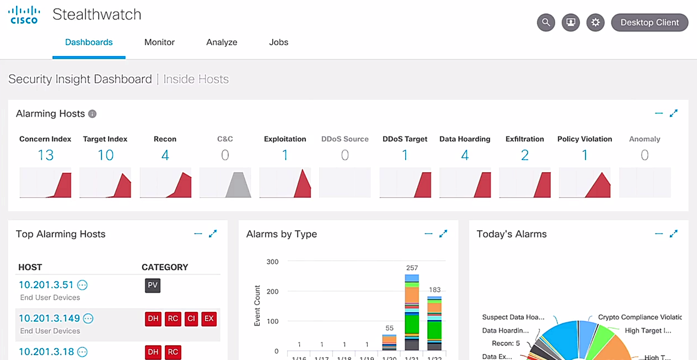

# Cisco Stealthwatch

Trainer: Charles Judd

- Cisco StealthWatch
  - a great tool to provide very deep and detailed visibility of the network
  - allowing to keep track of everything happening through network telemetry
  - tabs - Dashboards, Monitor, Analyze, Jobs

  <figure style="margin: 0.5em; display: flex; justify-content: center; align-items: center;">
    
  </figure>

- Demo: Network Security in StealthWatch dashboards
  - Security Insight Dashboard: areas - Alarming Hosts, Top Alarming Hosts, Alarms by Type, Today's Alarms, Cognitive Threat Analytics, Flow Collection Trend, Top Applications
  - Alarming Hosts: types of alarms w/ occurrence number > Recon = 4 > '4' link 
  - Inside Hosts (4): areas - Current Filters, Filter Results By, Hosts
    - Host: entries of effected hosts, fields - Host Address, Host Name, Last Active, CI, TI, RC, C&C
    - Concern Idex (CI): the host concern index has either exceeded the CI throughput or rapidly increased, essentially the reputation
  - Cognitive Threats Analytics
    - using Cisco cognitive intelligence
    - cloud-based machine learning engine
    - used to automatically identify suspicious or malicious web traffic
    - over 10 billion requests per day $\to$ ability to create a baseline of normal activity on network
    - using the dat to identify any traffic anomalies probably found
  - Flow Collection Trend
    - timeline chart w/ Flows per Second for last 24 hrs
    - StealthWatch leveraging network telemetry using NetFlow data
  - Top Applications: applications communicating on the network
  - Top Alarming Hosts: entry fields - HOST, CATEGORY
    - HOST = 10.201.3.147, CATEGORY = DH, RC, CI, EX icons, where DH = Data Hoarding, RC = Recon, CI = Concern Index, EX = Exfiltration behavior > '10.201.3.147' link
  - Host Report | 10.201.3.147: areas - Alarm Categorues, Host Summary, Traffic by Peer Host Group, Alarms by Type, Top Security Events for 10.201.3.147
    - Host Summary: Host Groups = End User Devices, Desktops, Atlanta, Sales and Marketing, ISE ANC Policy = '--'
      - ISE ANC Policy
        - allow to integrated w/ identity service to allow for adaptive network control
        - actions able to shutdown host or quarantine the host from the network
    - Traffic by Peer: diagram of connected hosts, including internal (green dots) and externals ones (blue dots)
    - Top Security Events for 10.201.3.147: entry fields - SECURITY EVENT, COUNT, CONCERN INDEX, FIRST ACTIVE, TARGET HOST, TARGET HOST CATEGORY, ACTIONS
      - entry - SECURITY EVENT = Suspect Data Hoarding > triangle to expand: DETAILS = 'Observed 733.53M bytes.  Expected 0 bytes, tolerance of 0 allows up to 50M bytes.' DESCRIPTION = 'Suspect Data Hoarding: The secure host has downloaded an unusual amount of data from one or more hosts.'
      - entry - SECURITY EVENET = Port Scan > triangle icon: TARGET HOST = 'Atlanta, Confidential Servers', DESCRIPTION = 'Port Scan: The source IP has attempted to connect to an excessive number rof ports on the target IP address.'

- Demo: capabilities of other tabs
  - Monitor tab > tabs - Hosts, Host Groups, users, Interfaces: the categories to monitor > Hosts
    - Inside Hosts > areas - Current Filters, Filter Results By, Host (entries)
  - Analyze yab >tabs - Flow Search, Saved Searches, Saved Results, Host Search, Copyright Infringement
  - Job tab > Job Management: allowing to create several saved and ongoing flow queries

