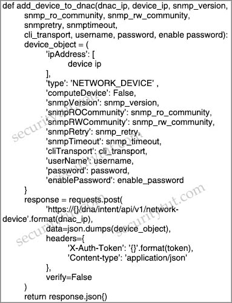
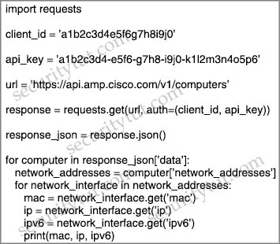
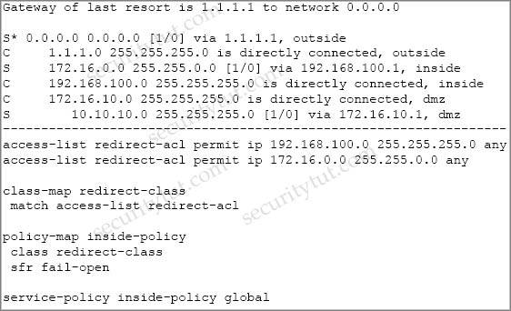

# Quiz Set 2


## 05. Python & API

- <span style="color: #008888; font-weight: bold;">Question 1</span>

  Which API is used for Content Security?

  A. NX-OS API<br>
  B. IOS XR API<br>
  C. OpenVuln API<br>
  D. AsyncOS API<br>

  Answer:<br><br> 


- <span style="color: #008888; font-weight: bold;">Question 2</span>

  Which two request of REST API are valid on the Cisco ASA Platform? (Choose two)

  A. put<br>
  B. options<br>
  C. get<br>
  D. push<br>
  E. connect<br>

  Answer:<br><br> 


- <span style="color: #008888; font-weight: bold;">Question 3</span>

  Refer to the exhibit.

  ```python
  def add_device_to_dnac(dnac_ip, device_ip, snmp_version, 
      snmp_ro_community, snmp_rw_community, snmpretry, 
      snmptimeout, cli_transport, username, password, 
      enable_password):
    device_object = {
      "ipAddress": [device_ip],
      "type": "NETWORK_DEVICE",
      "ComputeDevice": False,
      "snmpVersion": snmp_version,
      "snmpROCommunity": snm-_ro_community,
      "snmpRWCommunity": snmp_rw_community,
      "snmpRetyr": snmpretry,
      "snmpTimeout": snmptimeout,
      "cliTransport": cli_transport,
      "userName": username,
      "password": password,
      "enablePassword": enable_password
    }
    response = requests.post(
      "https://{}/dna/intent/api/v1/network-device".format(dnac_ip),
      data = json.dump(device_object),
      headers = {
        "X-Auth-Token": "{}".format(token),
        "Content-Type": 'application.json'
      },
      verify=Flase
    )
    return response.json
  ```

<!--   
  <figure style="margin: 0.5em; display: flex; justify-content: center; align-items: center;">
    
  </figure> -->

  What is the result of this Python script of the Cisco DNA Center API?

  A. adds authentication to a switch<br>
  B. adds a switch to Cisco DNA Center<br>
  C. receives information about a switch<br>

  Answer:<br><br> 


- <span style="color: #008888; font-weight: bold;">Question 4</span>

  Refer to the exhibit.

  ```python
  import requests

  client_id = 'a1b2c3d4e5f6g7h8i9j0'

  api_key = 'a1b2c3d4-e5f6-g7h8-k1l2m3n4o5q6i9j0'

  url = "https://api.amp.cisco.com/v1/computers"

  response = requests.get(url, auth=(client_id, api_key))

  response_json = response.json()

  for computer in response_json(['data]):
    network_address = computer['network_address']
    for network_interface in network_address:
      mac = network_interface.get('mac')
      ip = network_interface('ip')
      ipv6 = network_interface('ipv6')
      print(mac, ip , ipv6)
  ```

  <!-- <figure style="margin: 0.5em; display: flex; justify-content: center; align-items: center;">
    
  </figure> -->

  What does the API do when connected to a Cisco security appliance?

  A. get the process and PID information from the computers in the network<br>
  B. create an SNMP pull mechanism for managing AMP<br>
  C. gather network telemetry information from AMP for endpoints<br>
  D. gather the network interface information about the computers AMP sees<br>

  Answer:<br><br> 


## 06. Firewall & Intrusion Prevention

- <span style="color: #008888; font-weight: bold;">Question 1</span>

  Which feature requires a network discovery policy on the Cisco Firepower Next Generation Intrusion Prevention System?

  A. Security Intelligence<br>
  B. Impact Flags<br>
  C. Health Monitoring<br>
  D. URL Filtering<br>

  Answer:<br><br> 


- <span style="color: #008888; font-weight: bold;">Question 2</span>

  Which two deployment model configurations are supported for Cisco FTDv in AWS? (Choose two)

  A. Cisco FTDv configured in routed mode and managed by an FMCv installed in AWS<br>
  B. Cisco FTDv with one management interface and two traffic interfaces configured<br>
  C. Cisco FTDv configured in routed mode and managed by a physical FMC appliance on premises<br>
  D. Cisco FTDv with two management interfaces and one traffic interface configured<br>
  E. Cisco FTDv configured in routed mode and IPv6 configured<br>

  Answer:<br><br> 


- <span style="color: #008888; font-weight: bold;">Question 3</span>

  Which option is the main function of Cisco Firepower impact flags?

  A. They alert administrators when critical events occur.<br>
  B. They highlight known and suspected malicious IP addresses in reports.<br>
  C. They correlate data about intrusions and vulnerability.<br>
  D. They identify data that the ASA sends to the Firepower module.<br>

  Answer:<br><br> 


- <span style="color: #008888; font-weight: bold;">Question 4</span>

  On Cisco Firepower Management Center, which policy is used to collect health modules alerts from managed devices?

  A. health policy<br>
  B. system policy<br>
  C. correlation policy<br>
  D. access control policy<br>
  E. health awareness policy<br>

  Answer:<br><br> 


- <span style="color: #008888; font-weight: bold;">Question 5</span>

  Which license is required for Cisco Security Intelligence to work on the Cisco Next Generation Intrusion Prevention System?

  A. control<br>
  B. malware<br>
  C. URL filtering<br>
  D. protect<br>

  Answer:<br><br> 


- <span style="color: #008888; font-weight: bold;">Question 6</span>

  Which two are valid suppression types on a Cisco Next Generation Intrusion Prevention System? (Choose two)

  A. Port<br>
  B. Rule<br>
  C. Source<br>
  D. Application<br>
  E. Protocol<br>

  Answer:<br><br> 


- <span style="color: #008888; font-weight: bold;">Question 7</span>

  Which feature is configured for managed devices in the device platform settings of the Firepower Management Center?

  A. quality of service<br>
  B. time synchronization<br>
  C. network address translations<br>
  D. intrusion policy<br>

  Answer:<br><br> 


- <span style="color: #008888; font-weight: bold;">Question 8</span>

  Which information is required when adding a device to Firepower Management Center?

  A. username and password<br>
  B. encryption method<br>
  C. device serial number<br>
  D. registration key<br>

  Answer:<br><br> 


- <span style="color: #008888; font-weight: bold;">Question 9</span>

  Which two deployment modes does the Cisco ASA FirePower module support? (Choose two)

  A. transparent mode<br>
  B. routed mode<br>
  C. inline mode<br>
  D. active mode<br>
  E. passive monitor-only mode<br>

  Answer:<br><br> 


- <span style="color: #008888; font-weight: bold;">Question 10</span>

  The Cisco ASA must support TLS proxy for encrypted Cisco Unified Communications traffic. Where must the ASA be added on the Cisco UC Manager platform?

  A. Certificate Trust List<br>
  B. Endpoint Trust List<br>
  C. Enterprise Proxy Service<br>
  D. Secured Collaboration Proxy<br>

  Answer:<br><br> 


- <span style="color: #008888; font-weight: bold;">Question 11</span>

  Which statement about the configuration of Cisco ASA NetFlow v9 Secure Event Logging is true?

  A. To view bandwidth usage for NetFlow records, the QoS feature must be enabled.<br>
  B. A sysopt command can be used to enable NSEL on a specific interface.<br>
  C. NSEL can be used without a collector configured.<br>
  D. A flow-export event type must be defined under a policy.<br>

  Answer:<br><br> 


- <span style="color: #008888; font-weight: bold;">Question 12</span>

  Which feature is supported when deploying Cisco ASAv within AWS public cloud?

  A. multiple context mode<br>
  B. user deployment of Layer 3 networks<br>
  C. IPv6<br>
  D. clustering<br>

  Answer:<br><br> 


- <span style="color: #008888; font-weight: bold;">Question 13</span>

  Which statement describes a traffic profile on a Cisco Next Generation Intrusion Prevention System?

  A. It allows traffic if it does not meet the profile.<br>
  B. It defines a traffic baseline for traffic anomaly deduction.<br>
  C. It inspects hosts that meet the profile with more intrusion rules.<br>
  D. It blocks traffic if it does not meet the profile.<br>

  Answer:<br><br> 


- <span style="color: #008888; font-weight: bold;">Question 14</span>

  Which statement about IOS zone-based firewalls is true?

  A. An unassigned interface can communicate with assigned interfaces<br>
  B. Only one interface can be assigned to a zone.<br>
  C. An interface can be assigned to multiple zones.<br>
  D. An interface can be assigned only to one zone.<br>

  Answer:<br><br> 


- <span style="color: #008888; font-weight: bold;">Question 15</span>

  What is a characteristic of Cisco ASA Netflow v9 Secure Event Logging?

  A. It tracks flow-create, flow-teardown, and flow-denied events.<br>
  B. It provides stateless IP flow tracking that exports all records of a specific flow.<br>
  C. It tracks the flow continuously and provides updates every 10 seconds.<br>
  D. Its events match all traffic classes in parallel.<br>

  Answer:<br><br> 


- <span style="color: #008888; font-weight: bold;">Question 16</span>

  Which CLI command is used to register a Cisco FirePower sensor to Firepower Management Center?

  A. configure system add `<host><key>`<br>
  B. configure manager `<key>` add host<br>
  C. configure manager delete<br>
  D. configure manager add `<host><key>`<br>

  Answer:<br><br> 


- <span style="color: #008888; font-weight: bold;">Question 17</span>

  Which policy is used to capture host information on the Cisco Firepower Next Generation Intrusion Prevention System?

  A. Correlation<br>
  B. Intrusion<br>
  C. Access Control<br>
  D. Network Discovery<br>

  Answer:<br><br> 


- <span style="color: #008888; font-weight: bold;">Question 18</span>

  Which ASA deployment mode can provide separation of management on a shared appliance?

  A. DMZ multiple zone mode<br>
  B. transparent firewall mode<br>
  C. multiple context mode<br>
  D. routed mode<br>

  Answer:<br><br> 


- <span style="color: #008888; font-weight: bold;">Question 19</span>

  Refer to the exhibit. What is a result of the configuration?

  <figure style="margin: 0.5em; display: flex; justify-content: center; align-items: center;">
    
  </figure>

  A. Traffic from the DMZ network is redirected<br>
  B. Traffic from the inside network is redirected<br>
  C. All TCP traffic is redirected<br>
  D. Traffic from the inside and DMZ networks is redirected<br>

  Answer:<br><br> 


- <span style="color: #008888; font-weight: bold;">Question 20</span>

  Which policy represents a shared set of features or parameters that define the aspects of a managed device that are likely to be similar to other managed devices in a deployment?

  A. Group Policy<br>
  B. Access Control Policy<br>
  C. Device Management Policy<br>
  D. Platform Service Policy<br>

  Answer:<br><br> 


- <span style="color: #008888; font-weight: bold;">Question 21</span>

  Which two tasks allow NetFlow on a Cisco ASA 5500 Series firewall? (Choose two)

  A. Enable NetFlow Version 9.<br>
  B. Create an ACL to allow UDP traffic on port 9996.<br>
  C. Apply NetFlow Exporter to the outside interface in the inbound direction.<br>
  D. Create a class map to match interesting traffic.<br>
  E. Define a NetFlow collector by using the flow-export command.<br>

  Answer:<br><br> 


- <span style="color: #008888; font-weight: bold;">Question 22</span>

  A mall provides security services to customers with a shared appliance. The mall wants separation of management on the shared appliance. Which ASA deployment mode meets these needs?

  A. routed mode<br>
  B. transparent mode<br>
  C. multiple context mode<br>
  D. multiple zone mode<br>

  Answer:<br><br> 


- <span style="color: #008888; font-weight: bold;">Question 23</span>

  What is a characteristic of Firepower NGIPS inline deployment mode?

  A. ASA with Firepower module cannot be deployed.<br>
  B. It cannot take actions such as blocking traffic.<br>
  C. It is out-of-band from traffic.<br>
  D. It must have inline interface pairs configured.<br>

  Answer:<br><br> 


- <span style="color: #008888; font-weight: bold;">Question 24</span>

  An engineer wants to generate NetFlow records on traffic traversing the Cisco ASA. Which Cisco ASA command must be used?

  A. `flow-export destination inside 1.1.1.1 2055`<br>
  B. `ip flow monitor input`<br>
  C. `ip flow-export destination 1.1.1.1 2055`<br>
  D. `flow exporter`<br>

  Answer:<br><br> 


- <span style="color: #008888; font-weight: bold;">Question 25</span>

  How many interfaces per bridge group does an ASA bridge group deployment support?

  A. up to 2<br>
  B. up to 4<br>
  C. up to 8<br>
  D. up to 16<br>

  Answer:<br><br> 


- <span style="color: #008888; font-weight: bold;">Question 26</span>

  Which two application layer preprocessors are used by Firepower Next Generation Intrusion Prevention System? (Choose two)

  A. packet decoder<br>
  B. SIP<br>
  C. modbus<br>
  D. inline normalization<br>
  E. SSL<br>

  Answer:<br><br> 


## 07. Email & Web

[**Quick summary**](quizSol02.md#07-email--web)


- <span style="color: #008888; font-weight: bold;">Question 1</span>

  Which two features of Cisco Email Security can protect your organization against email threats? (Choose two)

  A. Time-based one-time passwords<br>
  B. Data loss prevention<br>
  C. Heuristic-based filtering<br>
  D. Geolocation-based filtering<br>
  E. NetFlow<br>

  Answer:<br><br> 


- <span style="color: #008888; font-weight: bold;">Question 2</span>

  Why would a user choose an on-premises ESA versus the CES solution?

  A. Sensitive data must remain onsite.>br>
  B. Demand is unpredictable.>br>
  C. The server team wants to outsource this service.>br>
  D. ESA is deployed inline.>br>

  Answer:<br><br> 


- <span style="color: #008888; font-weight: bold;">Question 3</span>

  Which two features are used to configure Cisco ESA with a multilayer approach to fight viruses and malware? (Choose two)

  A. Sophos engine<br>
  B. white list<br>
  C. RAT<br>
  D. outbreak filters<br>
  E. DLP<br>

  Answer:<br><br> 


- <span style="color: #008888; font-weight: bold;">Question 4</span>

  What is the purpose of the Decrypt for Application Detection feature within the WSA Decryption options?

  A. It decrypts HTTPS application traffic for unauthenticated users.<br>
  B. It alerts users when the WSA decrypts their traffic.<br>
  C. It decrypts HTTPS application traffic for authenticated users.<br>
  D. It provides enhanced HTTPS application detection for AsyncOS.<br>

  Answer:<br><br> 


- <span style="color: #008888; font-weight: bold;">Question 5</span>

  Which two statements about a Cisco WSA configured in Transparent mode are true? (Choose two)

  A. It can handle explicit HTTP requests.<br>
  B. It requires a PAC file for the client web browser.<br>
  C. It requires a proxy for the client web browser.<br>
  D. WCCP v2-enabled devices can automatically redirect traffic destined to port 80.<br>
  E. Layer 4 switches can automatically redirect traffic destined to port 80.<br>

  Answer:<br><br> 


- <span style="color: #008888; font-weight: bold;">Question 6</span>

  Which action controls the amount of URI text that is stored in Cisco WSA logs files?

  A. Configure the datasecurityconfig command<br>
  B. Configure the advancedproxyconfig command with the HTTPS subcommand<br>
  C. Configure a small log-entry size.<br>
  D. Configure a maximum packet size.<br>

  Answer:<br><br> 


- <span style="color: #008888; font-weight: bold;">Question 7</span>

  An engineer is configuring a Cisco ESA and wants to control whether to accept or reject email messages to a recipient address. Which list contains the allowed recipient addresses?

  A. SAT<br>
  B. BAT<br>
  C. HAT<br>
  D. RAT<br>

  Answer:<br><br> 


- <span style="color: #008888; font-weight: bold;">Question 8</span>

  Which two services must remain as on-premises equipment when a hybrid email solution is deployed? (Choose two)

  A. DDoS<br>
  B. antispam<br>
  C. antivirus<br>
  D. encryption<br>
  E. DLP<br>

  Answer:<br><br> 


- <span style="color: #008888; font-weight: bold;">Question 9</span>

  Which Talos reputation center allows you to track the reputation of IP addresses for email and web traffic?

  A. IP Blacklist Center<br>
  B. File Reputation Center<br>
  C. AMP Reputation Center<br>
  D. IP and Domain Reputation Center<br>

  Answer:<br><br> 


- <span style="color: #008888; font-weight: bold;">Question 10</span>

  Which proxy mode must be used on Cisco WSA to redirect TCP traffic with WCCP?

  A. transparent<br>
  B. redirection<br>
  C. forward<br>
  D. proxy gateway<br>

  Answer:<br><br> 


- <span style="color: #008888; font-weight: bold;">Question 11</span>

  After deploying a Cisco ESA on your network, you notice that some messages fail to reach their destinations. Which task can you perform to determine where each message was lost?

  A. Configure the trackingconfig command to enable message tracking.<br>
  B. Generate a system report.<br>
  C. Review the log files.<br>
  D. Perform a trace.<br>

  Answer:<br><br> 


- <span style="color: #008888; font-weight: bold;">Question 12</span>

  What is the primary benefit of deploying an ESA in hybrid mode?

  A. You can fine-tune its settings to provide the optimum balance between security and performance for your environment<br>
  B. It provides the lowest total cost of ownership by reducing the need for physical appliances<br>
  C. It provides maximum protection and control of outbound messages<br>
  D. It provides email security while supporting the transition to the cloud<br>

  Answer:<br><br> 


- <span style="color: #008888; font-weight: bold;">Question 13</span>

  What is the primary role of the Cisco Email Security Appliance?

  A. Mail Submission Agent<br>
  B. Mail Transfer Agent<br>
  C. Mail Delivery Agent<br>
  D. Mail User Agent<br>

  Answer:<br><br> 


- <span style="color: #008888; font-weight: bold;">Question 14</span>

  Which technology is used to improve web traffic performance by proxy caching?

  A. WSA<br>
  B. Firepower<br>
  C. FireSIGHT<br>
  D. ASA<br>

  Answer:<br><br> 


- <span style="color: #008888; font-weight: bold;">Question 15</span>

  In which two ways does a system administrator send web traffic transparently to the Web Security Appliance? (Choose two)

  A. configure Active Directory Group Policies to push proxy settings<br>
  B. configure policy-based routing on the network infrastructure<br>
  C. reference a Proxy Auto Config file<br>
  D. configure the proxy IP address in the web-browser settings<br>
  E. use Web Cache Communication Protocol<br>

  Answer:<br><br> 


## 08. Cloud Security

[**Cloud Quick Summary**](quizSol02.md#08-cloud-security)


- <span style="color: #008888; font-weight: bold;">Question 1</span>

  Which technology reduces data loss by identifying sensitive information stored in public computing environments?

  A. Cisco SDA<br>
  B. Cisco Firepower<br>
  C. Cisco HyperFlex<br>
  D. Cisco Cloudlock<br>

  Answer:<br><br> 


- <span style="color: #008888; font-weight: bold;">Question 2</span>

  Which deployment model is the most secure when considering risks to cloud adoption?

  A. Public Cloud<br>
  B. Hybrid Cloud<br>
  C. Community Cloud<br>
  D. Private Cloud<br>

  Answer:<br><br> 


- <span style="color: #008888; font-weight: bold;">Question 3</span>

  In which cloud services model is the tenant responsible for virtual machine OS patching?

  A. IaaS<br>
  B. UCaaS<br>
  C. PaaS<br>
  D. SaaS<br>

  Answer:<br><br> 


- <span style="color: #008888; font-weight: bold;">Question 4</span>

  Which cloud service model offers an environment for cloud consumers to develop and deploy applications without needing to manage or maintain the underlying cloud infrastructure?

  A. PaaS<br>
  B. XaaS<br>
  C. IaaS<br>
  D. SaaS<br>

  Answer:<br><br> 

- <span style="color: #008888; font-weight: bold;">Question 5</span>

  What does the Cloudlock Apps Firewall do to mitigate security concerns from an application perspective?

  A. It allows the administrator to quarantine malicious files so that the application can function, just not maliciously.<br>
  B. It discovers and controls cloud apps that are connected to a company’s corporate environment.<br>
  C. It deletes any application that does not belong in the network.<br>
  D. It sends the application information to an administrator to act on.<br>

  Answer:<br><br> B


- <span style="color: #008888; font-weight: bold;">Question 6</span>

  Which solution protects hybrid cloud deployment workloads with application visibility and segmentation?

  A. Nexus<br>
  B. Stealthwatch<br>
  C. Firepower<br>
  D. Tetration<br>

  Answer:<br><br> 


- <span style="color: #008888; font-weight: bold;">Question 7</span>

  In a PaaS model, which layer is the tenant responsible for maintaining and patching?

  A. hypervisor<br>
  B. virtual machine<br>
  C. network<br>
  D. application<br>

  Answer:<br><br> 


- <span style="color: #008888; font-weight: bold;">Question 8</span>

  On which part of the IT environment does DevSecOps focus?

  A. application development<br>
  B. wireless network<br>
  C. data center<br>
  D. perimeter network<br>

  Answer:<br><br> 


- <span style="color: #008888; font-weight: bold;">Question 9</span>

  What is the function of Cisco Cloudlock for data security?

  A. data loss prevention<br>
  B. controls malicious cloud apps<br>
  C. detects anomalies<br>
  D. user and entity behavior analytics<br>

  Answer:<br><br> 


