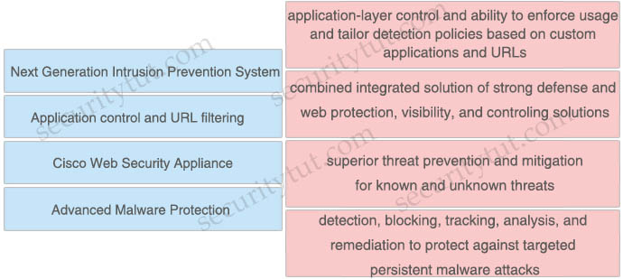

# Quiz Set 4


## 13. Malware Protection & AMP

- <span style="color: #008888; font-weight: bold;">Question 1</span>

  Which Cisco AMP file disposition valid?

  A. pristine<br>
  B. malware<br>
  C. dirty<br>
  D. non malicious<br>

  Answer: <br><br>


- <span style="color: #008888; font-weight: bold;">Question 2</span>

  When using Cisco AMP for Networks which feature copies a file to the Cisco AMP cloud for analysis?

  A. Spero analysis<br>
  B. dynamic analysis<br>
  C. sandbox analysis<br>
  D. malware analysis<br>

  Answer: <br><br>
  

- <span style="color: #008888; font-weight: bold;">Question 3</span>

  Which Cisco Advanced Malware protection for Endpoints deployment architecture is designed to keep data within a network perimeter?

  A. cloud web services<br>
  B. network AMP<br>
  C. private cloud<br>
  D. public cloud<br>

  Answer: <br><br>


- <span style="color: #008888; font-weight: bold;">Question 4</span>

  Which capability is exclusive to a Cisco AMP public cloud instance as compared to a private cloud instance?

  A. RBAC<br>
  B. ETHOS detection engine<br>
  C. SPERO detection engine<br>
  D. TETRA detection engine<br>

  Answer: <br><br>


- <span style="color: #008888; font-weight: bold;">Question 5</span>

  An engineer is configuring AMP for endpoints and wants to block certain files from executing. Which outbreak control method is used to accomplish this task?

  A. device flow correlation<br>
  B. simple detections<br>
  C. application blocking list<br>
  D. advanced custom detections<br>

  Answer: <br><br>


- <span style="color: #008888; font-weight: bold;">Question 6</span>

  Which function is the primary function of Cisco AMP threat Grid?

  A. automated email encryption<br>
  B. applying a real-time URI blacklist<br>
  C. automated malware analysis<br>
  D. monitoring network traffic<br>

  Answer: <br><br>


- <span style="color: #008888; font-weight: bold;">Question 7</span>

  What are two list types within AMP for Endpoints Outbreak Control? (Choose two)

  A. blocked ports<br>
  B. simple custom detections<br>
  C. command and control<br>
  D. allowed applications<br>
  E. URL<br>

  Answer: <br><br>


- <span style="color: #008888; font-weight: bold;">Question 8</span>

  What is a required prerequisite to enable malware file scanning for the Secure Internet Gateway?

  A. Enable IP Layer enforcement.<br>
  B. Activate the Advanced Malware Protection license<br>
  C. Activate SSL decryption.<br>
  D. Enable Intelligent Proxy.<br>

  Answer: <br><br>


## 14. AAA

- <span style="color: #008888; font-weight: bold;">Question 1</span>

  When wired 802.1X authentication is implemented, which two components are required? (Choose two)

  A. authentication server: Cisco Identity Service Engine<br>
  B. supplicant: Cisco AnyConnect ISE Posture module<br>
  C. authenticator: Cisco Catalyst switch<br>
  D. authenticator: Cisco Identity Services Engine<br>
  E. authentication server: Cisco Prime Infrastructure<br>

  Answer: <br><br>


- <span style="color: #008888; font-weight: bold;">Question 2</span>

  Refer to the exhibit. Which command was used to display this output?

  <figure style="margin: 0.5em; display: flex; justify-content: center; align-items: center;">
    
  </figure>

  A. show dot1x all<br>
  B. show dot1x<br>
  C. show dot1x all summary<br>
  D. show dot1x interface gi1/0/12<br>

  Answer: <br><br>


- <span style="color: #008888; font-weight: bold;">Question 3</span>

  Refer to the exhibit. Which statement about the authentication protocol used in the configuration is true?

  ```text
  aaa new-model
  radius-server host 10.0.0.12 key secret12
  ```

  A. The authentication request contains only a password<br>
  B. The authentication request contains only a username<br>
  C. The authentication and authorization requests are grouped in a single packet<br>
  D. There are separate authentication and authorization request packets<br>

  Answer: <br><br>


- <span style="color: #008888; font-weight: bold;">Question 4

  An engineer needs a solution for TACACS+ authentication and authorization for device administration.

  The engineer also wants to enhance wired and wireless network security by requiring users and endpoints to use 802.1X, MAB, or WebAuth. Which product meets all of these requirements?

  A. Cisco Prime Infrastructure<br>
  B. Cisco Identity Services Engine<br>
  C. Cisco Stealthwatch<br>
  D. Cisco AMP for Endpoints<br>

  Answer: <br><br>


- <span style="color: #008888; font-weight: bold;">Question 5

  Which Cisco command enables authentication, authorization, and accounting globally so that CoA is supported on the device?

  A. aaa server radius dynamic-author<br>
  B. aaa new-model<br>
  C. auth-type all<br>
  D. ip device-tracking<br>

  Answer: <br><br>


## 15. Endpoint Protection & Detection


- <span style="color: #008888; font-weight: bold;">Question 1</span>

  An MDM provides which two advantages to an organization with regards to device management? (Choose two)

  A. asset inventory management<br>
  B. allowed application management<br>
  C. Active Directory group policy management<br>
  D. network device management<br>
  E. critical device management<br>

  Answer: <br><br>


- <span style="color: #008888; font-weight: bold;">Question 2</span>

  Which Cisco product provides proactive endpoint protection and allows administrators to centrally manage the deployment?

  A. NGFW<br>
  B. AMP<br>
  C. WSA<br>
  D. ESA<br>

  Answer: <br><br>


- <span style="color: #008888; font-weight: bold;">Question 3</span>

  Which benefit does endpoint security provide the overall security posture of an organization?

  A. It streamlines the incident response process to automatically perform digital forensics on the endpoint.<br>
  B. It allows the organization to mitigate web-based attacks as long as the user is active in the domain.<br>
  C. It allows the organization to detect and respond to threats at the edge of the network.<br>
  D. It allows the organization to detect and mitigate threats that the perimeter security devices do not detect.<br>

  Answer: <br><br>


- <span style="color: #008888; font-weight: bold;">Question 4</span>

  What are the two most commonly used authentication factors in multifactor authentication? (Choose two)

  A. biometric factor<br>
  B. time factor<br>
  C. confidentiality factor<br>
  D. knowledge factor<br>
  E. encryption factor<br>

  Answer: <br><br>
  

- <span style="color: #008888; font-weight: bold;">Question 5</span>

  Which two kinds of attacks are prevented by multifactor authentication? (Choose two)

  A. phishing<br>
  B. brute force<br>
  C. man-in-the-middle<br>
  D. DDOS<br>
  E. teardrop<br>

  Answer: <br><br>B C


- <span style="color: #008888; font-weight: bold;">Question 6</span>

  What is the primary difference between an Endpoint Protection Platform and an Endpoint Detection and Response?

  A. EPP focuses on prevention, and EDR focuses on advanced threats that evade perimeter defenses.<br>
  B. EDR focuses on prevention, and EPP focuses on advanced threats that evade perimeter defenses.<br>
  C. EPP focuses on network security, and EDR focuses on device security.<br>
  D. EDR focuses on network security, and EPP focuses on device security.<br>

  Answer: <br><br>


- <span style="color: #008888; font-weight: bold;">Question 7</span>

  An engineer wants to automatically assign endpoints that have a specific OUI into a new endpoint group. Which probe must be enabled for this type of profiling to work?

  A. NetFlow<br>
  B. NMAP<br>
  C. SNMP<br>
  D. DHCP<br>

  Answer: <br><br>
  

- <span style="color: #008888; font-weight: bold;">Question 8</span>

  What are two reasons for implementing a multifactor authentication solution such as Duo Security provide to an organization? (Choose two)

  A. flexibility of different methods of 2FA such as phone callbacks, SMS passcodes, and push notifications<br>
  B. single sign-on access to on-premises and cloud applications<br>
  C. integration with 802.1x security using native Microsoft Windows supplicant<br>
  D. secure access to on-premises and cloud applications<br>
  E. identification and correction of application vulnerabilities before allowing access to resources<br>

  Answer: <br><br>


## 16. Cisco Umbrella

<span style="color: #008888; font-weight: #008888;">Cisco Umbrella Quick Summary</span>

Cisco Umbrella protects users from accessing malicious domains by proactively analyzing and blocking unsafe destinations – before a connection is ever made. Thus it can protect from phishing attacks by blocking suspicious domains when users click on the given links that an attacker sent.

When Umbrella receives a DNS request, it uses intelligence to determine if the request is safe, malicious or risky — meaning the domain contains both malicious and legitimate content. Safe and malicious requests are routed as usual or blocked, respectively. Risky requests are routed to our cloud-based proxy for deeper inspection. The Umbrella proxy uses Cisco Talos web reputation and other third-party feeds to determine if a URL is malicious.

Cisco Umbrella roaming protects your employees even when they are off the VPN.


- <span style="color: #008888; font-weight: bold;">Question 1</span>

  An engineer configured a new network identity in Cisco Umbrella but must verify that traffic is being routed through the Cisco Umbrella network. Which action tests the routing?

  A. Ensure that the client computers are pointing to the on-premises DNS servers.<br>
  B. Enable the Intelligent Proxy to validate that traffic is being routed correctly.<br>
  C. Add the public IP address that the client computers are behind to a Core Identity.<br>
  D. Browse to http://welcome.umbrella.com/ to validate that the new identity is working.<br>

  Answer: <br><br>


- <span style="color: #008888; font-weight: bold;">Question 2</span>

  Which feature within Cisco Umbrella allows for the ability to inspect secure HTTP traffic?

  A. File Analysis<br>
  B. SafeSearch<br>
  C. SSL Decryption<br>
  D. Destination Lists<br>

  Answer: <br><br>
  

- <span style="color: #008888; font-weight: bold;">Question 3</span>

  How is Cisco Umbrella configured to log only security events?

  A. per policy<br>
  B. in the Reporting settings<br>
  C. in the Security Settings section<br>
  D. per network in the Deployments section<br>

  Answer: <br><br>
  

- <span style="color: #008888; font-weight: bold;">Question 4</span>

  How does Cisco Umbrella archive logs to an enterprise owned storage?

  A. by using the Application Programming Interface to fetch the logs<br>
  B. by sending logs via syslog to an on-premises or cloud-based syslog server<br>
  C. by the system administrator downloading the logs from the Cisco Umbrella web portal<br>
  D. by being configured to send logs to a self-managed AWS S3 bucket<br>

  Answer: <br><br>
  

- <span style="color: #008888; font-weight: bold;">Question 5</span>

  When web policies are configured in Cisco Umbrella, what provides the ability to ensure that domains are blocked when they host malware, command and control, phishing, and more threats?

  A. Application Control<br>
  B. Security Category Blocking<br>
  C. Content Category Blocking<br>
  D. File Analysis<br>

  Answer: <br><br>


- <span style="color: #008888; font-weight: bold;">Question 6</span>

  Which Cisco solution does Cisco Umbrella integrate with to determine if a URL is malicious?

  A. AMP<br>
  B. AnyConnect<br>
  C. DynDNS<br>
  D. Talos<br>

  Answer: <br><br>
  

- <span style="color: #008888; font-weight: bold;">Question 7</span>

  Where are individual sites specified to be blacklisted in Cisco Umbrella?

  A. application settings<br>
  B. content categories<br>
  C. security settings<br>
  D. destination lists<br>

  Answer: <br><br>
  

- <span style="color: #008888; font-weight: bold;">Question 8</span>

  Which Cisco security solution protects remote users against phishing attacks when they are not connected to the VPN?

  A. Cisco Stealthwatch<br>
  B. Cisco Umbrella<br>
  C. Cisco Firepower<br>
  D. NGIPS<br>

  Answer: <br><br>


# Quiz Set 5


## 17. Security Products & Solutions

<span style="color: #008888; font-weight: bold;">Quick summary</span>

- StealWatch: performs security analytics by collecting network flows via NetFlow
- ESA: email security solution which protects against email threats like ransomware, business email compromise, phishing, whaling, and many other email-driven attacks
- AMP for Endpoints (AMP4E): provides malware protection on endpoints
- Umbrella: provides DNS protection by blocking malicious destinations using DNS
- Firepower Threat Defense (FTD): provides a comprehensive suite of security features such as firewall capabilities, monitoring, alerts, Intrusion Detection System (IDS) and Intrusion Prevention System (IPS).
- Cisco Cloudlock: Secure your cloud users, data, and applications with the cloud-native CASB and cloud cybersecurity platform. Cisco Cloudlock provides visibility and compliance checks, protects data against misuse and exfiltration, and provides threat protections against malware like ransomware.

**Cisco SteathWatch**

Stealthwatch is the visibility and security analytics solution that collects and analyzes network data from the existing network infrastructure. Stealthwatch analyzes industry standard NetFlow data from Cisco and other vendors Routers, Switches, Firewalls, and other network devices to detect advanced and persistent security threats such as internally spreading malware, data leakage, botnet command and control traffic and network reconnaissance.

The Cisco Identity Services Engine (ISE) solution supplements Stealthwatch NetFlowbased behavioral threat detection data with contextual information such as user identity, user authorization level, device-type, and posture. Together Stealthwatch and Cisco ISE present network security analysts with a view integrating NetFlow data and contextual information enabling the security analyst to detect and discern the potential severity of threats in a timely, efficient, and cost-effective manner.

Stealthwatch components include:
- Stealthwatch Management Console: security management system that allows network administrators to define, configure, and monitor multiple distributed Stealthwatch Flow Collectors from a single location. It uses graphical representations of network traffic, identity information, customized summary reports, and integrated security and network intelligence for comprehensive analysis.
- Flow Collector: leverages enterprise telemetry such as NetFlow, IPFIX (Internet Protocol Flow Information Export), and other types of flow data from existing infrastructure such as routers, switches, firewalls, endpoints, and other network infrastructure devices. The Flow Collector can also receive and collect telemetry from proxy data sources, which can be analyzed by the cloud-based, multilayered machine learning engine, Cognitive Intelligence, for deep visibility into both web and network traffic.
- Flow Sensor (optional): produces telemetry for segments of the switching and routing infrastructure that can’t generate NetFlow natively. It also provides visibility into the application layer data and provides additional security context to enhance the Stealthwatch security analytics. It can analyze encrypted traffic.
- UDP Director: simplifies the collection and distribution of network and security data across the enterprise. It helps reduce the processing power on network routers and switches by receiving essential network and security information from multiple locations and then forwarding it to a single data stream to one or more destinations.

<figure style="margin: 0.5em; display: flex; justify-content: center; align-items: center;">
  
</figure>

Stealthwatch offers different deployment models:
- On-premises as a hardware appliance or a virtual machine called Stealthwatch Enterprise
- Cloud-delivered as a software-as-a-service (SaaS) solution called Stealthwatch Cloud.

Cisco Stealthwatch Cloud: Available as an SaaS product offer to provide visibility and threat detection within public cloud infrastructures such as Amazon Web Services (AWS), Microsoft Azure, and Google Cloud Platform (GCP).

**Cisco Cognitive Threat Analytics** helps you quickly detect and respond to sophisticated, clandestine attacks that are already under way or are attempting to establish a presence within your environment. The solution automatically identifies and investigates suspicious or malicious web-based traffic. It identifies both potential and confirmed threats, allowing you to quickly remediate the infection and reduce the scope and damage of an attack, whether it’s a known threat campaign that has spread across multiple organizations or a unique threat you’ve never seen before.

<figure style="margin: 0.5em; display: flex; justify-content: center; align-items: center;">
  
</figure>


- <span style="color: #008888; font-weight: bold;">Question 1</span>

  How does Cisco Stealthwatch Cloud provide security for cloud environments?

  A. It delivers visibility and threat detection.<br>
  B. It prevents exfiltration of sensitive data.<br>
  C. It assigns Internet-based DNS protection for clients and servers.<br>
  D. It facilitates secure connectivity between public and private networks.<br>

  Answer: <br><br>
  

- <span style="color: #008888; font-weight: bold;">Question 2</span>

  What are two Detection and Analytics Engines of Cognitive Threat Analytics? (Choose two)

  A. data exfiltration<br>
  B. command and control communication<br>
  C. intelligent proxy<br>
  D. snort<br>
  E. URL categorization<br>

  Answer: <br><br>
  

- <span style="color: #008888; font-weight: bold;">Question 3</span>

  Which network monitoring solution uses streams and pushes operational data to provide a near real-time view of activity?

  A. SNMP<br>
  B. SMTP<br>
  C. syslog<br>
  D. model-driven telemetry<br>

  Answer: <br><br>
  

- <span style="color: #008888; font-weight: bold;">Question 4</span>

  What provides visibility and awareness into what is currently occurring on the network?

  A. CMX<br>
  B. WMI<br>
  C. Prime Infrastructure<br>
  D. Telemetry<br>

  Answer: <br><br>
  

- <span style="color: #008888; font-weight: bold;">Question 5</span>

  What can be integrated with Cisco Threat Intelligence Director to provide information about security threats, which allows the SOC to proactively automate responses to those threats?

  A. Cisco Umbrella<br>
  B. External Threat Feeds<br>
  C. Cisco Threat Grid<br>
  D. Cisco Stealthwatch<br>

  Answer: <br><br>


- <span style="color: #008888; font-weight: bold;">Question 6</span>

  Which solution combines Cisco IOS and IOS XE components to enable administrators to recognize applications, collect and send network metrics to Cisco Prime and other third-party management tools, and prioritize application traffic?

  A. Cisco Security Intelligence<br>
  B. Cisco Application Visibility and Control<br>
  C. Cisco Model Driven Telemetry<br>
  D. Cisco DNA Center<br>

  Answer: <br><br>


- <span style="color: #008888; font-weight: bold;">Question 7</span>

  Which two activities can be done using Cisco DNA Center? (Choose two)

  A. DHCP<br>
  B. Design<br>
  C. Accounting<br>
  D. DNS<br>
  E. Provision<br>

  Answer: <br><br>


- <span style="color: #008888; font-weight: bold;">Question 8</span>

  What must be used to share data between multiple security products?

  A. Cisco Rapid Threat Containment<br>
  B. Cisco Platform Exchange Grid<br>
  C. Cisco Advanced Malware Protection<br>
  D. Cisco Stealthwatch Cloud<br>

  Answer: <br><br>


- <span style="color: #008888; font-weight: bold;">Question 9</span>

  Which Cisco product is open, scalable, and built on IETF standards to allow multiple security products from Cisco and other vendors to share data and interoperate with each other?

  A. Advanced Malware Protection<br>
  B. Platform Exchange Grid<br>
  C. Multifactor Platform Integration<br>
  D. Firepower Threat Defense<br>

  Answer: <br><br>
  

- <span style="color: #008888; font-weight: bold;">Question 10</span>

  What is a feature of the open platform capabilities of Cisco DNA Center?

  A. intent-based APIs<br>
  B. automation adapters<br>
  C. domain integration<br>
  D. application adapters<br>

  Answer: <br><br>


- <span style="color: #008888; font-weight: bold;">Question 11</span>

  What is the function of the Context Directory Agent?

  A. maintains users’ group memberships<br>
  B. relays user authentication requests from Web Security Appliance to Active Directory<br>
  C. reads the Active Directory logs to map IP addresses to usernames<br>
  D. accepts user authentication requests on behalf of Web Security Appliance for user identification<br>

  Answer: <br><br>
  


## 18. Drag Drop

- <span style="color: #008888; font-weight: bold;">Question 1</span>

  Drag and drop the Firepower Next Generation Intrusion Prevention System detectors from the left onto the correct definitions on the right.

  <figure style="margin: 0.5em; display: flex; justify-content: center; align-items: center;">
    
  </figure>

  Answer:
  

- <span style="color: #008888; font-weight: bold;">Question 2</span>

  Drag and drop the capabilities from the left onto the correct technologies on the right.

  <figure style="margin: 0.5em; display: flex; justify-content: center; align-items: center;">
    
  </figure>

  Answer:


- <span style="color: #008888; font-weight: bold;">Question 3</span>

  Drag and drop the descriptions from the left onto the correct protocol versions on the right.

  <figure style="margin: 0.5em; display: flex; justify-content: center; align-items: center;">
    
  </figure>

  Answer:


- <span style="color: #008888; font-weight: bold;">Question 4</span>

  Drag and drop the steps from the left into the correct order on the right to enable AppDynamics to monitor an EC2 instance in Amazon Web Services.

  <figure style="margin: 0.5em; display: flex; justify-content: center; align-items: center;">
    
  </figure>

  Answer:


