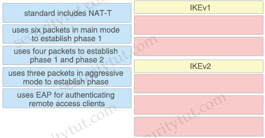

# Quiz Set 5

## 17. Security Products & Solutions

Quick summary

- StealWatch: performs security analytics by collecting network flows via NetFlow
- ESA: email security solution which protects against email threats like ransomware, business email compromise, phishing, whaling, and many other email-driven attacks
- AMP for Endpoints (AMP4E): provides malware protection on endpoints
- Umbrella: provides DNS protection by blocking malicious destinations using DNS
- Firepower Threat Defense (FTD): provides a comprehensive suite of security features such as firewall capabilities, monitoring, alerts, Intrusion Detection System (IDS) and Intrusion Prevention System (IPS).
- Cisco Cloudlock: Secure your cloud users, data, and applications with the cloud-native CASB and cloud cybersecurity platform. Cisco Cloudlock provides visibility and compliance checks, protects data against misuse and exfiltration, and provides threat protections against malware like ransomware.

**Cisco SteathWatch**

Stealthwatch is the visibility and security analytics solution that collects and analyzes network data from the existing network infrastructure. Stealthwatch analyzes industry standard NetFlow data from Cisco and other vendors Routers, Switches, Firewalls, and other network devices to detect advanced and persistent security threats such as internally spreading malware, data leakage, botnet command and control traffic and network reconnaissance.

The Cisco Identity Services Engine (ISE) solution supplements Stealthwatch NetFlowbased behavioral threat detection data with contextual information such as user identity, user authorization level, device-type, and posture. Together Stealthwatch and Cisco ISE present network security analysts with a view integrating NetFlow data and contextual information enabling the security analyst to detect and discern the potential severity of threats in a timely, efficient, and cost-effective manner.

Stealthwatch components include:
- Stealthwatch Management Console: security management system that allows network administrators to define, configure, and monitor multiple distributed Stealthwatch Flow Collectors from a single location. It uses graphical representations of network traffic, identity information, customized summary reports, and integrated security and network intelligence for comprehensive analysis.
- Flow Collector: leverages enterprise telemetry such as NetFlow, IPFIX (Internet Protocol Flow Information Export), and other types of flow data from existing infrastructure such as routers, switches, firewalls, endpoints, and other network infrastructure devices. The Flow Collector can also receive and collect telemetry from proxy data sources, which can be analyzed by the cloud-based, multilayered machine learning engine, Cognitive Intelligence, for deep visibility into both web and network traffic.
- Flow Sensor (optional): produces telemetry for segments of the switching and routing infrastructure that can’t generate NetFlow natively. It also provides visibility into the application layer data and provides additional security context to enhance the Stealthwatch security analytics. It can analyze encrypted traffic.
- UDP Director: simplifies the collection and distribution of network and security data across the enterprise. It helps reduce the processing power on network routers and switches by receiving essential network and security information from multiple locations and then forwarding it to a single data stream to one or more destinations.

<figure style="margin: 0.5em; display: flex; justify-content: center; align-items: center;">
  
</figure>

Stealthwatch offers different deployment models:
- On-premises as a hardware appliance or a virtual machine called Stealthwatch Enterprise
- Cloud-delivered as a software-as-a-service (SaaS) solution called Stealthwatch Cloud.

Cisco Stealthwatch Cloud: Available as an SaaS product offer to provide visibility and threat detection within public cloud infrastructures such as Amazon Web Services (AWS), Microsoft Azure, and Google Cloud Platform (GCP).

**Cisco Cognitive Threat Analytics** helps you quickly detect and respond to sophisticated, clandestine attacks that are already under way or are attempting to establish a presence within your environment. The solution automatically identifies and investigates suspicious or malicious web-based traffic. It identifies both potential and confirmed threats, allowing you to quickly remediate the infection and reduce the scope and damage of an attack, whether it’s a known threat campaign that has spread across multiple organizations or a unique threat you’ve never seen before.

<figure style="margin: 0.5em; display: flex; justify-content: center; align-items: center;">
  
</figure>

- Question 1

  How does Cisco Stealthwatch Cloud provide security for cloud environments?

  A. It delivers visibility and threat detection. 
  B. It prevents exfiltration of sensitive data. 
  C. It assigns Internet-based DNS protection for clients and servers. 
  D. It facilitates secure connectivity between public and private networks. 

  Answer: 
  

- Question 2

  What are two Detection and Analytics Engines of Cognitive Threat Analytics? (Choose two)

  A. data exfiltration 
  B. command and control communication 
  C. intelligent proxy 
  D. snort 
  E. URL categorization 

  Answer: 
  

- Question 3

  Which network monitoring solution uses streams and pushes operational data to provide a near real-time view of activity?

  A. SNMP 
  B. SMTP 
  C. syslog 
  D. model-driven telemetry 

  Answer: 
  

- Question 4

  What provides visibility and awareness into what is currently occurring on the network?

  A. CMX 
  B. WMI 
  C. Prime Infrastructure 
  D. Telemetry 

  Answer: 
  

- Question 5

  What can be integrated with Cisco Threat Intelligence Director to provide information about security threats, which allows the SOC to proactively automate responses to those threats?

  A. Cisco Umbrella 
  B. External Threat Feeds 
  C. Cisco Threat Grid 
  D. Cisco Stealthwatch 

  Answer: 

- Question 6

  Which solution combines Cisco IOS and IOS XE components to enable administrators to recognize applications, collect and send network metrics to Cisco Prime and other third-party management tools, and prioritize application traffic?

  A. Cisco Security Intelligence 
  B. Cisco Application Visibility and Control 
  C. Cisco Model Driven Telemetry 
  D. Cisco DNA Center 

  Answer: 

- Question 7

  Which two activities can be done using Cisco DNA Center? (Choose two)

  A. DHCP 
  B. Design 
  C. Accounting 
  D. DNS 
  E. Provision 

  Answer: 

- Question 8

  What must be used to share data between multiple security products?

  A. Cisco Rapid Threat Containment 
  B. Cisco Platform Exchange Grid 
  C. Cisco Advanced Malware Protection 
  D. Cisco Stealthwatch Cloud 

  Answer: 

- Question 9

  Which Cisco product is open, scalable, and built on IETF standards to allow multiple security products from Cisco and other vendors to share data and interoperate with each other?

  A. Advanced Malware Protection 
  B. Platform Exchange Grid 
  C. Multifactor Platform Integration 
  D. Firepower Threat Defense 

  Answer: 
  

- Question 10

  What is a feature of the open platform capabilities of Cisco DNA Center?

  A. intent-based APIs 
  B. automation adapters 
  C. domain integration 
  D. application adapters 

  Answer: 

- Question 11

  What is the function of the Context Directory Agent?

  A. maintains users’ group memberships 
  B. relays user authentication requests from Web Security Appliance to Active Directory 
  C. reads the Active Directory logs to map IP addresses to usernames 
  D. accepts user authentication requests on behalf of Web Security Appliance for user identification 

  Answer: 
  

## 18. 18. Drag Drop

- Question 1

  Drag and drop the Firepower Next Generation Intrusion Prevention System detectors from the left onto the correct definitions on the right.

  <figure style="margin: 0.5em; display: flex; justify-content: center; align-items: center;">
    
  </figure>

  Answer:
  

- Question 2

  Drag and drop the capabilities from the left onto the correct technologies on the right.

  <figure style="margin: 0.5em; display: flex; justify-content: center; align-items: center;">
    
  </figure>

  Answer:

- Question 3

  Drag and drop the descriptions from the left onto the correct protocol versions on the right.

  <figure style="margin: 0.5em; display: flex; justify-content: center; align-items: center;">
    
  </figure>

  Answer:

- Question 4

  Drag and drop the steps from the left into the correct order on the right to enable AppDynamics to monitor an EC2 instance in Amazon Web Services.

  <figure style="margin: 0.5em; display: flex; justify-content: center; align-items: center;">
    
  </figure>

  Answer:

