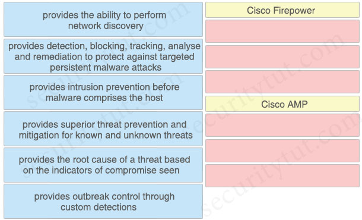
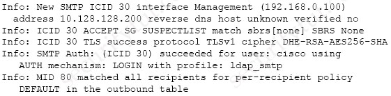
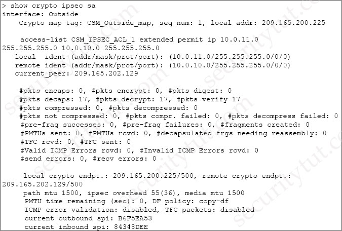
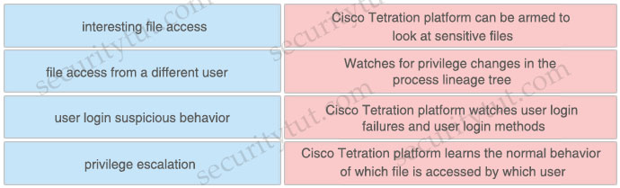
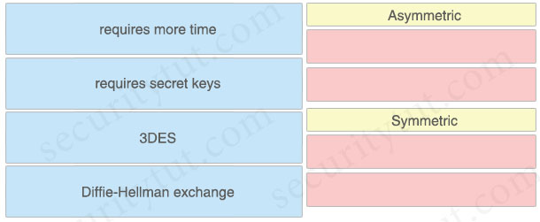
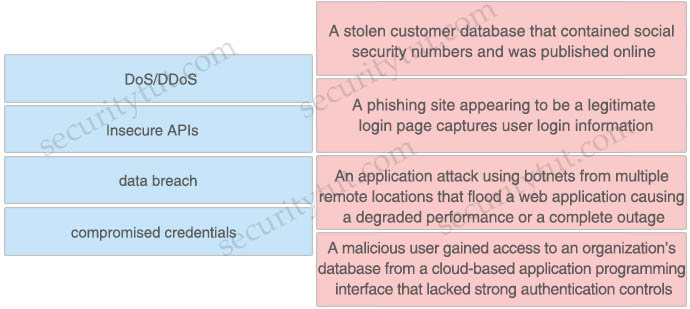
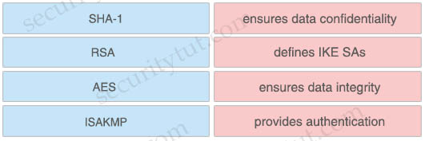

# Quiz Set 6


## 19. New Questions - Part 1


- <span style="color: blue; font-weight: bold;">Question 1</span>

  What is a characteristic of a bridge group in ASA Firewall transparent mode?

  A. It includes multiple interfaces and access rules between interfaces are customizable<br>
  B. It is a Layer 3 segment and includes one port and customizable access rules<br>
  C. It allows ARP traffic with a single access rule<br>
  D. It has an IP address on its BVI interface and is used for management traffic<br>

  Answer: 


- <span style="color: blue; font-weight: bold;">Question 2</span>

  When Cisco and other industry organizations publish and inform users of known security findings and vulnerabilities, which name is used?

  A. Common Security Exploits<br>
  B. Common Vulnerabilities and Exposures<br>
  C. Common Exploits and Vulnerabilities<br>
  D. Common Vulnerabilities, Exploits and Threats<br>

  Answer: 


- <span style="color: blue; font-weight: bold;">Question 3</span>

  Which two fields are defined in the NetFlow flow? (Choose two)

  A. type of service byte<br>
  B. class of service bits<br>
  C. Layer 4 protocol type<br>
  D. destination port<br>
  E. output logical interface<br>

  Answer: 


- <span style="color: blue; font-weight: bold;">Question 4</span>

  What provides the ability to program and monitor networks from somewhere other than the DNAC GUI?

  A. NetFlow<br>
  B. desktop client<br>
  C. ASDM<br>
  D. A<br>

  Answer: 


- <span style="color: blue; font-weight: bold;">Question 5</span>

  Drag and drop the capabilities of Cisco Firepower versus Cisco AMP from the left into the appropriate category on the right.

  <figure style="margin: 0.5em; display: flex; justify-content: center; align-items: center;">
    
  </figure>

  Answer:


- <span style="color: blue; font-weight: bold;">Question 6</span>

  An organization has two machines hosting web applications. Machine 1 is vulnerable to SQL injection while machine 2 is vulnerable to buffer overflows. What action would allow the attacker to gain access to machine 1 but not machine 2?

  A. sniffing the packets between the two hosts<br>
  B. sending continuous pings<br>
  C. overflowing the buffer’s memory<br>
  D. inserting malicious commands into the database<br>

  Answer: 


- <span style="color: blue; font-weight: bold;">Question 7</span>

  An organization is trying to improve their Defense in Depth by blocking malicious destinations prior to a connection being established. The solution must be able to block certain applications from being used within the network. Which product should be used to accomplish this goal?

  A. Cisco Firepower<br>
  B. Cisco Umbrella<br>
  C. ISE<br>
  D. AMP<br>

  Answer: 
  

- <span style="color: blue; font-weight: bold;">Question 8</span>

  A company is experiencing exfiltration of credit card numbers that are not being stored on-premise. The company needs to be able to protect sensitive data throughout the full environment. Which tool should be used to accomplish this goal?

  A. Security Manager<br>
  B. Cloudlock<br>
  C. Web Security Appliance<br>
  D. Cisco ISE<br>

  Answer: 
  

- <span style="color: blue; font-weight: bold;">Question 9</span>

  An engineer is trying to securely connect to a router and wants to prevent insecure algorithms from being used. However, the connection is failing. Which action should be taken to accomplish this goal?

  A. Disable telnet using the no ip telnet command.<br>
  B. Enable the SSH server using the ip ssh server command.<br>
  C. Configure the port using the ip ssh port 22 command.<br>
  D. Generate the RSA key using the crypto key generate rsa command.<br>

  Answer: 
  

- <span style="color: blue; font-weight: bold;">Question 10</span>

  A network administrator is using the Cisco ESA with AMP to upload files to the cloud for analysis. The network is congested and is affecting communication. How will the Cisco ESA handle any files which need analysis?

  A. AMP calculates the SHA-256 fingerprint, caches it, and periodically attempts the upload.<br>
  B. The file is queued for upload when connectivity is restored.<br>
  C. The file upload is abandoned.<br>
  D. The ESA immediately makes another attempt to upload the file.<br>

  Answer: 


- <span style="color: blue; font-weight: bold;">Question 11</span>

  Which type of algorithm provides the highest level of protection against brute-force attacks?

  A. PFS<br>
  B. HMAC<br>
  C. MD5<br>
  D. SHA<br>

  Answer: 


- <span style="color: blue; font-weight: bold;">Question 12</span>

  What must be configured in Cisco ISE to enforce reauthentication of an endpoint session when an endpoint is deleted from an identity group?

  A. posture assessment<br>
  B. CoA<br>
  C. external identity source<br>
  D. SNMP probe<br>

  Answer: 
  

- <span style="color: blue; font-weight: bold;">Question 13</span>

  A network administrator is configuring a rule in an access control policy to block certain URLs and selects the “Chat and Instant Messaging” category. Which reputation score should be selected to accomplish this goal?

  A. 1<br>
  B. 3<br>
  C. 5<br>
  D. 10<br>

  Answer:   


- <span style="color: blue; font-weight: bold;">Question 14</span>

  Which group within Cisco writes and publishes a weekly newsletter to help cybersecurity professionals remain aware of the ongoing and most prevalent threats?

  A. PSIRT<br>
  B. Talos<br>
  C. CSIRT<br>
  D. DEVNET<br>

  Answer: 
  

- <span style="color: blue; font-weight: bold;">Question 15</span>

  What are the two types of managed Intercloud Fabric deployment models? (Choose two)

  A. Service Provider managed<br>
  B. Public managed<br>
  C. Hybrid managed<br>
  D. User managed<br>
  E. Enterprise managed<br>

  Answer: 
  

- <span style="color: blue; font-weight: bold;">Question 16</span>

  What are two DDoS attack categories? (Choose two)

  A. sequential<br>
  B. protocol<br>
  C. database<br>
  D. volume-based<br>
  E. screen-based<br>

  Answer: 
  

- <span style="color: blue; font-weight: bold;">Question 17</span>

  Refer to the exhibit.

  <figure style="margin: 0.5em; display: flex; justify-content: center; align-items: center;">
    
  </figure>  

  Which type of authentication is in use?

  A. LDAP authentication for Microsoft Outlook<br>
  B. POP3 authentication<br>
  C. SMTP relay server authentication<br>
  D. external user and relay mail authentication<br>

  Answer: 
  

- <span style="color: blue; font-weight: bold;">Question 18</span>

  An organization received a large amount of SPAM messages over a short time period. In order to take action on the messages, it must be determined how harmful the messages are and this needs to happen dynamically. What must be configured to accomplish this?

  A. Configure the Cisco WSA to modify policies based on the traffic seen<br>
  B. Configure the Cisco ESA to receive real-time updates from Talos<br>
  C. Configure the Cisco WSA to receive real-time updates from Talos<br>
  D. Configure the Cisco ESA to modify policies based on the traffic seen<br>

  Answer: 
  

- <span style="color: blue; font-weight: bold;">Question 19</span>

  Which product allows Cisco FMC to push security intelligence observable to its sensors from other products?

  A. Encrypted Traffic Analytics<br>
  B. Threat Intelligence Director<br>
  C. Cognitive Threat Analytics<br>
  D. Cisco Talos Intelligence<br>

  Answer: 


- <span style="color: blue; font-weight: bold;">Question 20</span>

  What are two differences between a Cisco WSA that is running in transparent mode and one running in explicit mode? (Choose two)

  A. When the Cisco WSA is running in transparent mode, it uses the WSA’s own IP address as the HTTP request destination.<br>
  B. The Cisco WSA responds with its own IP address only if it is running in explicit mode.<br>
  C. The Cisco WSA is configured in a web browser only if it is running in transparent mode.<br>
  D. The Cisco WSA uses a Layer 3 device to redirect traffic only if it is running in transparent mode.<br>
  E. The Cisco WSA responds with its own IP address only if it is running in transparent mode.<br>

  Answer: 
  

- <span style="color: blue; font-weight: bold;">Question 21</span>

  After a recent breach, an organization determined that phishing was used to gain initial access to the network before regaining persistence. The information gained from the phishing attack was a result of users visiting known malicious websites. What must be done in order to prevent this from happening in the future?

  A. Modify an access policy<br>
  B. Modify identification profiles<br>
  C. Modify outbound malware scanning policies<br>
  D. Modify web proxy settings<br>

  Answer: 


- <span style="color: blue; font-weight: bold;">Question 22</span>

  What is the function of SDN southbound API protocols?

  A. to allow for the dynamic configuration of control plane applications<br>
  B. to enable the controller to make changes<br>
  C. to enable the controller to use REST<br>
  D. to allow for the static configuration of control plane applications<br>

  Answer: 
  

- <span style="color: blue; font-weight: bold;">Question 23</span>

  Refer to the exhibit.

  <figure style="margin: 0.5em; display: flex; justify-content: center; align-items: center;">
    
  </figure>

  Traffic is not passing through IPsec site-to-site VPN on the Firepower Threat Defense appliance. What is causing this issue?

  A. No split-tunnel policy is defined on the Firepower Threat Defense appliance.<br>
  B. The access control policy is not allowing VPN traffic in.<br>
  C. Site-to-site VPN peers are using different encryption algorithms.<br>
  D. Site-to-site VPN preshared keys are mismatched.<br>

  Answer: 


- <span style="color: blue; font-weight: bold;">Question 24</span>

  An attacker needs to perform reconnaissance on a target system to help gain access to it. The system has weak passwords, no encryption on the VPN links, and software bugs on the system’s applications. Which vulnerability allows the attacker to see the passwords being transmitted in clear text?

  A. weak passwords for authentication<br>
  B. unencrypted links for traffic<br>
  C. software bugs on applications<br>
  D. improper file security<br>

  Answer: 


- <span style="color: blue; font-weight: bold;">Question 25</span>

  Using Cisco Firepower’s Security Intelligence policies, upon which two criteria is Firepower block based? (Choose two)

  A. URLs<br>
  B. protocol IDs<br>
  C. IP addresses<br>
  D. MAC addresses<br>
  E. port numbers<br>

  Answer: 


- <span style="color: blue; font-weight: bold;">Question 26</span>

  Which Cisco platform ensures that machines that connect to organizational networks have the recommended antivirus definitions and patches to help prevent an organizational malware outbreak?

  A. Cisco WiSM<br>
  B. Cisco ESA<br>
  C. Cisco ISE<br>
  D. Cisco Prime Infrastructure<br>


  Answer: 


- <span style="color: blue; font-weight: bold;">Question 27</span>

  What are two benefits of Flexible NetFlow records? (Choose two)

  A. They allow the user to configure flow information to perform customized traffic identification<br>
  B. They provide attack prevention by dropping the traffic<br>
  C. They provide accounting and billing enhancements<br>
  D. They converge multiple accounting technologies into one accounting mechanism<br>
  E. They provide monitoring of a wider range of IP packet information from Layer 2 to 4<br>

  Answer: 
  

- <span style="color: blue; font-weight: bold;">Question 28</span>

  How does DNS Tunneling exfiltrate data?

  A. An attacker registers a domain that a client connects to based on DNS records and sends malware through that connection.<br>
  B. An attacker opens a reverse DNS shell to get into the client’s system and install malware on it.<br>
  C. An attacker uses a non-standard DNS port to gain access to the organization’s DNS servers in order to poison the resolutions.<br>
  D. An attacker sends an email to the target with hidden DNS resolvers in it to redirect them to a malicious domain.<br>

  Answer: 


- <span style="color: blue; font-weight: bold;">Question 29</span>

  A user has a device in the network that is receiving too many connection requests from multiple machines. Which type of attack is the device undergoing?

  A. phishing<br>
  B. slowloris<br>
  C. pharming<br>
  D. SYN flood<br>

  Answer: 


- <span style="color: blue; font-weight: bold;">Question 30</span>

  An organization is receiving SPAM emails from a known malicious domain. What must be configured in order to prevent the session during the initial TCP communication?

  A. Configure the Cisco ESA to drop the malicious emails<br>
  B. Configure policies to quarantine malicious emails<br>
  C. Configure policies to stop and reject communication<br>
  D. Configure the Cisco ESA to reset the TCP connection<br>

  Answer: 


- <span style="color: blue; font-weight: bold;">Question 31</span>

  A Cisco Firepower administrator needs to configure a rule to allow a new application that has never been seen on the network. Which two actions should be selected to allow the traffic to pass without inspection? (Choose two)

  A. permit<br>
  B. trust<br>
  C. reset<br>
  D. allow<br>
  E. monitor<br>

  Answer: 


- <span style="color: blue; font-weight: bold;">Question 32</span>

  An engineer needs behavioral analysis to detect malicious activity on the hosts, and is configuring the organization’s public cloud to send telemetry using the cloud provider’s mechanisms to a security device. Which mechanism should the engineer configure to accomplish this goal?

  A. mirror port<br>
  B. sFlow<br>
  C. NetFlow<br>
  D. VPC flow logs<br>

  Answer: 
  

- <span style="color: blue; font-weight: bold;">Question 33</span>

  An engineer has enabled LDAP accept queries on a listener. Malicious actors must be prevented from quickly identifying all valid recipients. What must be done on the Cisco ESA to accomplish this goal?

  A. Configure incoming content filters<br>
  B. Use Bounce Verification<br>
  C. Configure Directory Harvest Attack Prevention<br>
  D. Bypass LDAP access queries in the recipient access table<br>

  Answer: 
  

- <span style="color: blue; font-weight: bold;">Question 34</span>

  What is a feature of Cisco NetFlow Secure Event Logging for Cisco ASAs?

  A. Multiple NetFlow collectors are supported<br>
  B. Advanced NetFlow v9 templates and legacy v5 formatting are supported<br>
  C. Secure NetFlow connections are optimized for Cisco Prime Infrastructure<br>
  D. Flow-create events are delayed<br>

  Answer: 
  

- <span style="color: blue; font-weight: bold;">Question 35</span>

  An engineer is configuring 802.1X authentication on Cisco switches in the network and is using CoA as a mechanism. Which port on the firewall must be opened to allow the CoA traffic to traverse the network?

  A. TCP 6514<br>
  B. UDP 1700<br>
  C. TCP 49<br>
  D. UDP 1812<br>

  Answer: 
  

- <span style="color: blue; font-weight: bold;">Question 36</span>

  Which public cloud provider supports the Cisco Next Generation Firewall Virtual?

  A. Google Cloud Platform<br>
  B. Red Hat Enterprise Visualization<br>
  C. VMware ESXi<br>
  D. Amazon Web Services<br>

  Answer: 
  

- <span style="color: blue; font-weight: bold;">Question 37</span>

  Drag and drop the suspicious patterns for the Cisco Tetration platform from the left onto the correct definitions on the right.

  <figure style="margin: 0.5em; display: flex; justify-content: center; align-items: center;">
    
  </figure>

  Answer:


- <span style="color: blue; font-weight: bold;">Question 38</span>

  What is the purpose of the My Devices Portal in a Cisco ISE environment?

  A. to register new laptops and mobile devices<br>
  B. to request a newly provisioned mobile device<br>
  C. to provision userless and agentless systems<br>
  D. to manage and deploy antivirus definitions and patches on systems owned by the end user<br>

  Answer: 
  

- <span style="color: blue; font-weight: bold;">Question 39</span>

  Refer to the exhibit.

  ```cfg
  ip dhcp snooping
  ip dhcp snooping vlan 41,44
  !
  interface GigabitEthernet1/0/1
  description Uplink_To_Distro_Switch_g1/0/11
  switchport trunk native vlan 999
  switchport trunk allowed vlan 40,41,44
  switchport mode trunk
  ```

  An organization is using DHCP Snooping within their network. A user on VLAN 41 on a new switch is complaining that an IP address is not being obtained. Which command should be configured on the switch interface in order to provide the user with network connectivity?

  A. ip dhcp snooping verify mac-address<br>
  B. ip dhcp snooping limit 41<br>
  C. ip dhcp snooping vlan 41<br>
  D. ip dhcp snooping trust<br>

  Answer: 


- <span style="color: blue; font-weight: bold;">Question 40</span>

  What is the purpose of the certificate signing request when adding a new certificate for a server?

  A. It is the password for the certificate that is needed to install it with.<br>
  B. It provides the server information so a certificate can be created and signed<br>
  C. It provides the certificate client information so the server can authenticate against it when installing<br>
  D. It is the certificate that will be loaded onto the server<br>

  Answer: 
  

- <span style="color: blue; font-weight: bold;">Question 41</span>

  What is the Cisco API-based broker that helps reduce compromises, application risks, and data breaches in an environment that is not on-premise?

  A. Cisco Cloudlock<br>
  B. Cisco Umbrella<br>
  C. Cisco AMP<br>
  D. Cisco App Dynamics<br>

  Answer: 
  

- <span style="color: blue; font-weight: bold;">Question 42</span>

  What is managed by Cisco Security Manager?

  A. access point<br>
  B. WSA<br>
  C. ASA<br>
  D. ESA<br>

  Answer: 
  

- <span style="color: blue; font-weight: bold;">Question 43</span>

  How does Cisco Advanced Phishing Protection protect users?

  A. It validates the sender by using DKIM.<br>
  B. It determines which identities are perceived by the sender<br>
  C. It utilizes sensors that send messages securely.<br>
  D. It uses machine learning and real-time behavior analytics.<br>

  Answer: 
  

- <span style="color: blue; font-weight: bold;">Question 44</span>

  What is a benefit of using Cisco FMC over Cisco ASDM?

  A. Cisco FMC uses Java while Cisco ASDM uses HTML5.<br>
  B. Cisco FMC provides centralized management while Cisco ASDM does not.<br>
  C. Cisco FMC supports pushing configurations to devices while Cisco ASDM does not.<br>
  D. Cisco FMC supports all firewall products whereas Cisco ASDM only supports Cisco ASA devices<br>

  Answer: 
  

- <span style="color: blue; font-weight: bold;">Question 45</span>

  What is a key difference between Cisco Firepower and Cisco ASA?

  A. Cisco ASA provides access control while Cisco Firepower does not.<br>
  B. Cisco Firepower provides identity-based access control while Cisco ASA does not.<br>
  C. Cisco Firepower natively provides intrusion prevention capabilities while Cisco ASA does not.<br>
  D. Cisco ASA provides SSL inspection while Cisco Firepower does not.<br>

  Answer: 


- <span style="color: blue; font-weight: bold;">Question 46</span>

  An organization is implementing URL blocking using Cisco Umbrella. The users are able to go to some sites but other sites are not accessible due to an error. Why is the error occurring?

  A. Client computers do not have the Cisco Umbrella Root CA certificate installed.<br>
  B. IP-Layer Enforcement is not configured.<br>
  C. Client computers do not have an SSL certificate deployed from an internal CA server.<br>
  D. Intelligent proxy and SSL decryption is disabled in the policy.<br>

  Answer: 
  

- <span style="color: blue; font-weight: bold;">Question 47</span>

  Which two aspects of the cloud PaaS model are managed by the customer but not the provider?  (Choose two)

  A. virtualization<br>
  B. middleware<br>
  C. operating systems<br>
  D. applications<br>
  E. data<br>

  Answer: 


- <span style="color: blue; font-weight: bold;">Question 48</span>

  What is an attribute of the DevSecOps process?

  A. mandated security controls and check lists<br>
  B. security scanning and theoretical vulnerabilities<br>
  C. development security<br>
  D. isolated security team<br>

  Answer: 
  

- <span style="color: blue; font-weight: bold;">Question 49</span>

  An engineer notices traffic interruption on the network. Upon further investigation, it is learned that broadcast packets have been flooding the network. What must be configured, based on a predefined threshold, to address this issue?

  A. Bridge Protocol Data Unit guard<br>
  B. embedded event monitoring<br>
  C. storm control<br>
  D. access control lists<br>

  Answer: 
  

- <span style="color: blue; font-weight: bold;">Question 50</span>

  Which two cryptographic algorithms are used with IPsec? (Choose two)

  A. AES-BAC<br>
  B. AES-ABC<br>
  C. HMAC-SHA1/SHA2<br>
  D. Triple AMC-CBC<br>
  E. AES-CBC<br>

  Answer: 
  

- <span style="color: blue; font-weight: bold;">Question 51</span>

  Drag and drop the descriptions from the left onto the encryption algorithms on the right.

  <figure style="margin: 0.5em; display: flex; justify-content: center; align-items: center;">
    
  </figure>

  Answer:


- <span style="color: blue; font-weight: bold;">Question 52</span>

  In which type of attack does the attacker insert their machine between two hosts that are communicating with each other?

  A. LDAP injecti<br>on
  B. man-in-the-m<br>iddle
  C. cross-site s<br>cripting
  D. insecure API<br>

  Answer: 


========================= New Questions (added on 2nd-Jan-2021) ==============================


- <span style="color: blue; font-weight: bold;">Question 53</span>

  Which Dos attack uses fragmented packets to crash a target machine?

  A. smurf<br>
  B. MITM<br>
  C. teardrop<br>
  D. LAND<br>

  Answer: 
  

- <span style="color: blue; font-weight: bold;">Question 54</span>

  Why is it important to have logical security controls on endpoints even though the users are trained to spot security threats and the network devices already help prevent them?

  A. to prevent theft of the endpoints<br>
  B. because defense-in-depth stops at the network<br>
  C. to expose the endpoint to more threats<br>
  D. because human error or insider threats will still exist<br>

  Answer: 


- <span style="color: blue; font-weight: bold;">Question 55</span>

  Which type of API is being used when a security application notifies a controller within a software-defined network architecture about a specific security threat? (Choose two)

  A. westbound AP<br>
  B. southbound API<br>
  C. northbound API<br>
  D. eastbound API<br>

  Answer: 


- <span style="color: blue; font-weight: bold;">Question 56</span>

  Drag and drop the threats from the left onto examples of that threat on the right.

  <figure style="margin: 0.5em; display: flex; justify-content: center; align-items: center;">
    
  </figure>

  Answer:
  

- <span style="color: blue; font-weight: bold;">Question 57</span>

  When planning a VPN deployment, for which reason does an engineer opt for an active/active FlexVPN configuration as opposed to DMVPN?

  A. Multiple routers or VRFs are required.<br>
  B. Traffic is distributed statically by default.<br>
  C. Floating static routes are required.<br>
  D. HSRP is used for fallover.<br>

  Answer: 


- <span style="color: blue; font-weight: bold;">Question 58</span>

  Which algorithm provides asymmetric encryption?

  A. RC4<br>
  B. AES<br>
  C. RSA<br>
  D. 3DES<br>

  Answer: 


- <span style="color: blue; font-weight: bold;">Question 59</span>

  What are two functions of secret key cryptography? (Choose two)

  A. key selection without integer factorization<br>
  B. utilization of different keys for encryption and decryption<br>
  C. utilization of large prime number iterations<br>
  D. provides the capability to only know the key on one side<br>
  E. utilization of less memory<br>

  Answer: 


- <span style="color: blue; font-weight: bold;">Question 60</span>

  For Cisco IOS PKI, which two types of Servers are used as a distribution point for CRLs? (Choose two)

  A. SDP<br>
  B. LDAP<br>
  C. subordinate CA<br>
  D. SCP<br>
  E. HTTP<br>

  Answer: 


- <span style="color: blue; font-weight: bold;">Question 61</span>

  Which attack type attempts to shut down a machine or network so that users are not able to access it?

  A. smurf<br>
  B. bluesnarfing<br>
  C. MAC spoofing<br>
  D. IP spoofing<br>

  Answer: 
  

- <span style="color: blue; font-weight: bold;">Question 62</span>

  What is a difference between DMVPN and sVTI?

  A. DMVPN supports tunnel encryption, whereas sVTI does not.<br>
  B. DMVPN supports dynamic tunnel establishment, whereas sVTI does not.<br>
  C. DMVPN supports static tunnel establishment, whereas sVTI does not.<br>
  D. DMVPN provides interoperability with other vendors, whereas sVTI does not.<br>

  Answer: 


- <span style="color: blue; font-weight: bold;">Question 63</span>

  What features does Cisco FTDv provide over ASAv?

  A. Cisco FTDv runs on VMWare while ASAv does not<br>
  B. Cisco FTDv provides 1GB of firewall throughput while Cisco ASAv does not<br>
  C. Cisco FTDv runs on AWS while ASAv does not<br>
  D. Cisco FTDv supports URL filtering while ASAv does not<br>

  Answer: 


- <span style="color: blue; font-weight: bold;">Question 64</span>

  In which situation should an Endpoint Detection and Response solution be chosen versus an Endpoint Protection Platform?

  A. when there is a need for traditional anti-malware detection<br>
  B. when there is no need to have the solution centrally managed<br>
  C. when there is no firewall on the network<br>
  D. when there is a need to have more advanced detection capabilities<br>

  Answer: 
  

- <span style="color: blue; font-weight: bold;">Question 65</span>

  Which type of API is being used when a controller within a software-defined network architecture dynamically makes configuration changes on switches within the network?

  A. westbound AP<br>
  B. southbound API<br>
  C. northbound API<br>
  D. eastbound API<br>

  Answer: 
  

- <span style="color: blue; font-weight: bold;">Question 66</span>

  An organization has two systems in their DMZ that have an unencrypted link between them for communication. The organization does not have a defined password policy and uses several default accounts on the systems. The application used on those systems also have not gone through stringent code reviews. Which vulnerability would help an attacker brute force their way into the systems?

  A. weak passwords<br>
  B. lack of input validation<br>
  C. missing encryption<br>
  D. lack of file permission<br>

  Answer: 


- <span style="color: blue; font-weight: bold;">Question 67</span>

  What is the purpose of a Netflow version 9 template record?

  A. It specifies the data format of NetFlow processes.<br>
  B. It provides a standardized set of information about an IP flow.<br>
  C. It defines the format of data records.<br>
  D. It serves as a unique identification number to distinguish individual data records<br>

  Answer: 
  

- <span style="color: blue; font-weight: bold;">Question 68</span>

  Drag and drop the VPN functions from the left onto the description on the right.

  <figure style="margin: 0.5em; display: flex; justify-content: center; align-items: center;">
    
  </figure>

  Answer:
  

- <span style="color: blue; font-weight: bold;">Question 69</span>

  What is provided by the Secure Hash Algorithm in a VPN?

  A. integrity<br>
  B. key exchange<br>
  C. encryption<br>
  D. authentication<br>

  Answer: 
  

- <span style="color: blue; font-weight: bold;">Question 70</span>

  A network engineer is deciding whether to use stateful or stateless failover when configuring two ASAs for high availability. What is the connection status in both cases?

  A. need to be reestablished with stateful failover and preserved with stateless failover
  B. preserved with stateful failover and need to be reestablished with stateless failover
  C. preserved with both stateful and stateless failover
  D. need to be reestablished with both stateful and stateless failover

  Answer: 


- <span style="color: blue; font-weight: bold;">Question 71</span>

  Which type of protection encrypts RSA keys when they are exported and imported?

  A. file<br>
  B. passphrase<br>
  C. NGE<br>
  D. nonexportable<br>

  Answer: 


