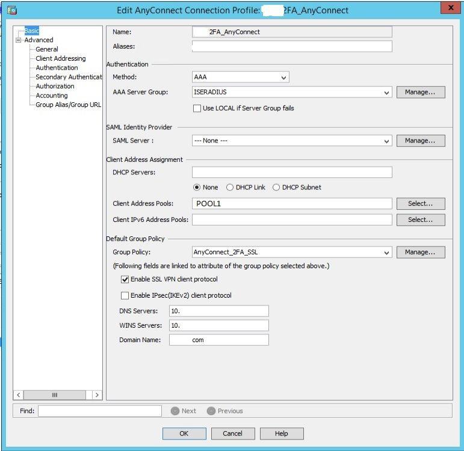
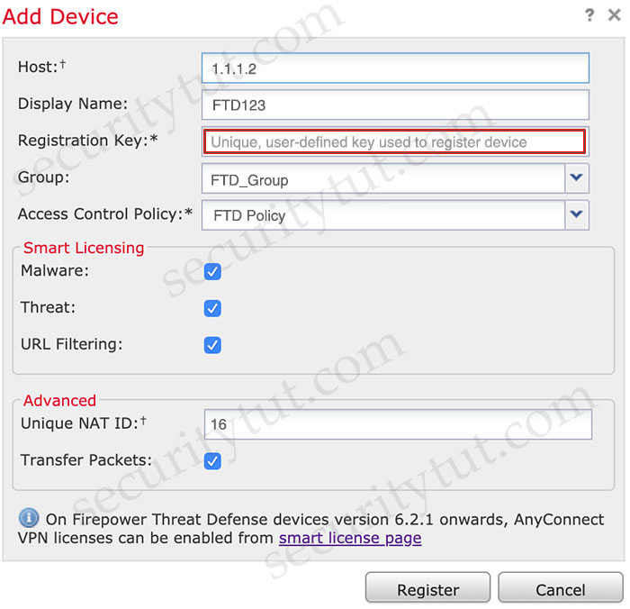

# Quiz Set 7


## 20. New Questions - Part 2


- <span style="color: #008888; font-weight: bold;">Question 1</span>

  A Cisco ESA network administrator has been tasked to use a newly installed service to help create policy based on the reputation verdict. During testing, it is discovered that the Cisco ESA is not dropping files that have an undetermined verdict. What is causing this issue?

  A. The policy was created to send a message to quarantine instead of drop<br>
  B. The file has a reputation score that is above the threshold<br>
  C. The file has a reputation score that is below the threshold<br>
  D. The policy was created to disable file analysis<br>

  Answer: <br><br> 
  

- <span style="color: #008888; font-weight: bold;">Question 2</span>

  An administrator is trying to determine which applications are being used in the network but does not want the network devices to send metadata to Cisco Firepower. Which feature should be used to accomplish this?

  A. NetFlow<br>
  B. Packet Tracer<br>
  C. Network Discovery<br>
  D. Access Control<br>

  Answer: <br><br> 


- <span style="color: #008888; font-weight: bold;">Question 3</span>

  Which attack is preventable by Cisco ESA but not by the Cisco WSA?

  A. buffer overflow<br>
  B. DoS<br>
  C. SQL injection<br>
  D. phishing<br>

  Answer: <br><br> 


- <span style="color: #008888; font-weight: bold;">Question 4</span>

  A Cisco ESA administrator has been tasked with configuring the Cisco ESA to ensure there are no viruses before quarantined emails are delivered. In addition, delivery of mail from known bad mail servers must be prevented. Which two actions must be taken in order to meet these requirements? (Choose two)

  A. Use outbreak filters from SenderBase<br>
  B. Enable a message tracking service<br>
  C. Configure a recipient access table<br>
  D. Deploy the Cisco ESA in the DMZ<br>
  E. Scan quarantined emails using AntiVirus signatures.<br>

  Answer: <br><br> 
  

- <span style="color: #008888; font-weight: bold;">Question 5</span>

  Which type of dashboard does Cisco DNA Center provide for complete control of the network?

  A. service management<br>
  B. centralized management<br>
  C. application management<br>
  D. distributed management<br>

  Answer: <br><br> 
  

- <span style="color: #008888; font-weight: bold;">Question 6</span>

  In an IaaS cloud services model, which security function is the provider responsible for managing?

  A. Internet proxy<br>
  B. firewalling virtual machines<br>
  C. CASB<br>
  D. hypervisor OS hardening<br>

  Answer: <br><br> 
  

- <span style="color: #008888; font-weight: bold;">Question 7</span>

  A network engineer has been tasked with adding a new medical device to the network. Cisco ISE is being used as the NAC server, and the new device does not have a supplicant available. What must be done in order to securely connect this device to the network?

  A. Use MAB with profiling<br>
  B. Use MAB with posture assessment.<br>
  C. Use 802.1X with posture assessment.<br>
  D. Use 802.1X with profiling.<br>

  Answer: <br><br> 
  

- <span style="color: #008888; font-weight: bold;">Question 8</span>

  An engineer is implementing NTP authentication within their network and has configured both the client and server devices with the command `ntp authentication-key 1 md5 Cisc392368270`. The server at 1.1.1.1 is attempting to authenticate to the client at 1.1.1.2, however it is unable to do so. Which command is required to enable the client to accept the server’s authentication key?

  A. `ntp peer 1.1.1.1 key 1`<br>
  B. `ntp server 1.1.1.1 key 1`<br>
  C. `ntp server 1.1.1.2 key 1`<br>
  D. `ntp peer 1.1.1.2 key 1`<br>

  Answer: <br><br> 
  

- <span style="color: #008888; font-weight: bold;">Question 9</span>

  What is the role of an endpoint in protecting a user from a phishing attack?

  A. Use Cisco Stealthwatch and Cisco ISE Integration.<br>
  B. Utilize 802.1X network security to ensure unauthorized access to resources.<br>
  C. Use machine learning models to help identify anomalies and determine expected sending behavior.<br>
  D. Ensure that antivirus and anti malware software is up to date.<br>

  Answer: <br><br> 


- <span style="color: #008888; font-weight: bold;">Question 10</span>

  Drag and drop the NetFlow export formats from the left onto the descriptions on the right.

  <figure style="margin: 0.5em; display: flex; justify-content: center; align-items: center;">
    
  </figure>

  Group 1: Version 1, 5, 8, 9 (A, B, C, D)

  Group 2:<br>
  1\. appropriate only for the main cache<br>
  2\. introduced support for aggregation caches<br>
  3\. appropriate only for legacy systems<br>
  4\. introduced extensibility<br>

  Answer: <br><br>


- <span style="color: #008888; font-weight: bold;">Question 11</span>

  An organization has noticed an increase in malicious content downloads and wants to use Cisco Umbrella to prevent this activity for suspicious domains while allowing normal web traffic. Which action will accomplish this task?

  A. Set content settings to High<br>
  B. Configure the intelligent proxy.<br>
  C. Use destination block lists.<br>
  D. Configure application block lists.<br>

  Answer: <br><br> 
  

- <span style="color: #008888; font-weight: bold;">Question 12</span>

  With which components does a southbound API within a software-defined network architecture communicate?

  A. controllers within the network<br>
  B. applications<br>
  C. appliances<br>
  D. devices such as routers and switches<br>

  Answer: <br><br> 
  

- <span style="color: #008888; font-weight: bold;">Question 13</span>

  A network administrator needs to find out what assets currently exist on the network. Third-party systems need to be able to feed host data into Cisco Firepower. What must be configured to accomplish this?

  A. a Network Discovery policy to receive data from the host<br>
  B. a Threat Intelligence policy to download the data from the host<br>
  C. a File Analysis policy to send file data into Cisco Firepower<br>
  D. a Network Analysis policy to receive NetFlow data from the host<br>

  Answer: <br><br> 
  

- <span style="color: #008888; font-weight: bold;">Question 14</span>

  When configuring ISAKMP for IKEv1 Phase1 on a Cisco IOS router, an administrator needs to input the command `crypto isakmp key cisco address 0.0.0.0`. The administrator is not sure what the IP addressing in this command issued for. What would be the effect of changing the IP address from 0.0.0.0 to 1.2.3.4?

  A. The key server that is managing the keys for the connection will be at 1.2.3.4<br>
  B. The remote connection will only be allowed from 1.2.3.4<br>
  C. The address that will be used as the crypto validation authority<br>
  D. All IP addresses other than 1.2.3.4 will be allowed<br>

  Answer: <br><br> 
  

- <span style="color: #008888; font-weight: bold;">Question 15</span>

  Which suspicious pattern enables the Cisco Tetration platform to learn the normal behavior of users?

  A. file access from a different user<br>
  B. interesting file access<br>
  C. user login suspicious behavior<br>
  D. privilege escalation<br>

  Answer: <br><br> 


- <span style="color: #008888; font-weight: bold;">Question 16</span>

  Due to a traffic storm on the network, two interfaces were error-disabled, and both interfaces sent SNMP traps. Which two actions must be taken to ensure that interfaces are put back into service? (Choose two)

  A. Have Cisco Prime Infrastructure issue an SNMP set command to re-enable the ports after the pre configured interval.<br>
  B. Use EEM to have the ports return to service automatically in less than 300 seconds.<br>
  C. Enter the shutdown and no shutdown commands on the interfaces.<br>
  D. Enable the snmp-server enable traps command and wait 300 seconds<br>
  E. Ensure that interfaces are configured with the error-disable detection and recovery feature<br>

  Answer: <br><br> 
  

- <span style="color: #008888; font-weight: bold;">Question 17</span>

  What is the difference between Cross-site Scripting and SQL Injection attacks?

  A. Cross-site Scripting is an attack where code is injected into a database, whereas SQL Injection is an attack where code is injected into a browser.<br>
  B. Cross-site Scripting is a brute force attack targeting remote sites, whereas SQL Injection is a social engineering attack.<br>
  C. Cross-site Scripting is when executives in a corporation are attacked, whereas SQL Injection is when a database is manipulated.<br>
  D. Cross-site Scripting is an attack where code is executed from the server side, whereas SQL Injection is an attack where code is executed from the client side.<br>

  Answer: <br><br> 
  

- <span style="color: #008888; font-weight: bold;">Question 18</span>

  A network administrator is configuring a switch to use Cisco ISE for 802.1X. An endpoint is failing authentication and is unable to access the network. Where should the administrator begin troubleshooting to verify the authentication details?

  A. Adaptive Network Control Policy List<br>
  B. Context Visibility<br>
  C. Accounting Reports<br>
  D. RADIUS Live Logs<br>

  Answer: <br><br> 
  

- <span style="color: #008888; font-weight: bold;">Question 19</span>

  What is a prerequisite when integrating a Cisco ISE server and an AD domain?

  A. Place the Cisco ISE server and the AD server in the same subnet<br>
  B. Configure a common administrator account<br>
  C. Configure a common DNS server<br>
  D. Synchronize the clocks of the Cisco ISE server and the AD server<br>

  Answer: <br><br> 
  

- <span style="color: #008888; font-weight: bold;">Question 20</span>

  An organization recently installed a Cisco WSA and would like to take advantage of the AVC engine to allow the organization to create a policy to control application specific activity. After enabling the AVC engine, what must be done to implement this?

  A. Use security services to configure the traffic monitor, .<br>
  B. Use URL categorization to prevent the application traffic.<br>
  C. Use an access policy group to configure application control settings.<br>
  D. Use web security reporting to validate engine functionality<br>

  Answer: <br><br> 
  

- <span style="color: #008888; font-weight: bold;">Question 21</span>

  Which method is used to deploy certificates and configure the supplicant on mobile devices to gain access to network resources?

  A. BYOD on boarding<br>
  B. Simple Certificate Enrollment Protocol<br>
  C. Client provisioning<br>
  D. MAC authentication bypass<br>

  Answer: <br><br> 
  

- <span style="color: #008888; font-weight: bold;">Question 22</span>

  Refer to the exhibit.

  ```python
  import requests
  url = https://api.amp.cisco.com/v1/computers
  headers = {
    'accept' : application/json
    'content-type' : application/json
    'authorization' : Basic API Credentials
    'cache-control' : "no cache"
  }
  response = requests.request("GET", url, headers = headers)
  print (response.txt)
  ```

  What will happen when this Python script is run?

  A. The compromised computers and malware trajectories will be received from Cisco AMP<br>
  B. The list of computers and their current vulnerabilities will be received from Cisco AMP<br>
  C. The compromised computers and what compromised them will be received from Cisco AMP<br>
  D. The list of computers, policies, and connector statuses will be received from Cisco AMP<br>

  Answer: <br><br> 
  

- <span style="color: #008888; font-weight: bold;">Question 23</span>

  An organization is trying to implement micro-segmentation on the network and wants to be able to gain visibility on the applications within the network. The solution must be able to maintain and force compliance. Which product should be used to meet these requirements?

  A. Cisco Umbrella<br>
  B. Cisco AMP<br>
  C. Cisco Stealthwatch<br>
  D. Cisco Tetration<br>

  Answer: <br><br> 
  

- <span style="color: #008888; font-weight: bold;">Question 24</span>

  Which factor must be considered when choosing the on-premise solution over the cloud-based one?

  A. With an on-premise solution, the provider is responsible for the installation and maintenance of the product, whereas with a cloud-based solution, the customer is responsible for it<br>
  B. With a cloud-based solution, the provider is responsible for the installation, but the customer is responsible for the maintenance of the product.<br>
  C. With an on-premise solution, the provider is responsible for the installation, but the customer is responsible for the maintenance of the product.<br>
  D. With an on-premise solution, the customer is responsible for the installation and maintenance of the product, whereas with a cloud-based solution, the provider is responsible for it.<br>

  Answer: <br><br> 


- <span style="color: #008888; font-weight: bold;">Question 25</span>

  Which term describes when the Cisco Firepower downloads threat intelligence updates from Cisco Talos?

  A. consumption<br>
  B. sharing<br>
  C. analysis<br>
  D. authoring<br>

  Answer: <br><br> 
  

<hr>

- <span style="color: #008888; font-weight: bold;">Question 26</span>

  An organization has a Cisco Stealthwatch Cloud deployment in their environment. Cloud logging is working as expected, but logs are not being received from the on-premise network, what action will resolve this issue?

  A. Configure security appliances to send syslogs to Cisco Stealthwatch Cloud<br>
  B. Configure security appliances to send NetFlow to Cisco Stealthwatch Cloud<br>
  C. Deploy a Cisco FTD sensor to send events to Cisco Stealthwatch Cloud<br>
  D. Deploy a Cisco Stealthwatch Cloud sensor on the network to send data to Cisco Stealthwatch Cloud<br>

  Answer: <br><br> 
  

- <span style="color: #008888; font-weight: bold;">Question 27</span>

  What does Cisco AMP for Endpoints use to help an organization detect different families of malware?

  A. Ethos Engine to perform fuzzy fingerprinting<br>
  B. Tetra Engine to detect malware when me endpoint is connected to the cloud<br>
  C. Clam AV Engine to perform email scanning<br>
  D. Spero Engine with machine learning to perform dynamic analysis<br>

  Answer: <br><br> 
  

- <span style="color: #008888; font-weight: bold;">Question 28</span>

  What are two characteristics of Cisco DNA Center APIs? (Choose two)

  A. Postman is required to utilize Cisco DNA Center API calls.<br>
  B. They do not support Python scripts.<br>
  C. They are Cisco proprietary.<br>
  D. They quickly provision new devices.<br>
  E. They view the overall health of the network<br>

  Answer: <br><br> 


- <span style="color: #008888; font-weight: bold;">Question 29

  What is a benefit of conducting device compliance checks?

  A. It indicates what type of operating system is connecting to the network.<br>
  B. It validates if anti-virus software is installed.<br>
  C. It scans endpoints to determine if malicious activity is taking place.<br>
  D. It detects email phishing attacks.<br>

  Answer: <br><br> 


- <span style="color: #008888; font-weight: bold;">Question 30</span>

  In which two ways does Easy Connect help control network access when used with Cisco TrustSec? (Choose two)

  A. It allows multiple security products to share information and work together to enhance security posture in the network.<br>
  B. It creates a dashboard in Cisco ISE that provides full visibility of all connected endpoints.<br>
  C. It allows for the assignment of Security Group Tags and does not require 802.1x to be configured on the switch or the endpoint.<br>
  D. It integrates with third-party products to provide better visibility throughout the network.<br>
  E. It allows for managed endpoints that authenticate to AD to be mapped to Security Groups (PassiveID).<br>

  Answer: <br><br> 
  

- <span style="color: #008888; font-weight: bold;">Question 31</span>

  What is the benefit of installing Cisco AMP for Endpoints on a network?

  A. It provides operating system patches on the endpoints for security.<br>
  B. It provides flow-based visibility for the endpoints network connections.<br>
  C. It enables behavioral analysis to be used for the endpoints.<br>
  D. It protects endpoint systems through application control and real-time scanning<br>

  Answer: <br><br> 


- <span style="color: #008888; font-weight: bold;">Question 32</span>

  An administrator is configuring a DHCP server to better secure their environment. They need to be able to rate-limit the traffic and ensure that legitimate requests are not dropped. How would this be accomplished?

  A. Set a trusted interface for the DHCP server<br>
  B. Set the DHCP snooping bit to 1<br>
  C. Add entries in the DHCP snooping database<br>
  D. Enable ARP inspection for the required VLAN<br>

  Answer: <br><br> 


- <span style="color: #008888; font-weight: bold;">Question 33</span>

  Refer to the exhibit.

  ```python
  import requests

  client_id = '<Client id>'
  api_key = '<API Key>'
  url = 'https://api.amp.cisco.com/v1/computers'
  response = requests.get(url, auth=(client_id, api_key))
  response_json = response.json()
  for computer in response_json[‘data’]
    hostname = computer[‘hostname’]
    print(hostname)
  ```

  What will happen when the Python script is executed?

  A. The hostname will be translated to an IP address and printed.<br>
  B. The hostname will be printed for the client in the client ID field.<br>
  C. The script will pull all computer hostnames and print them.<br>
  D. The script will translate the IP address to FODN and print it<br>

  Answer: <br><br> 


- <span style="color: #008888; font-weight: bold;">Question 34</span>

  Refer to the exhibit.

  <figure style="margin: 0.5em; display: flex; justify-content: center; align-items: center;">
    
  </figure>

  When configuring a remote access VPN solution terminating on the Cisco ASA, an administrator would like to utilize an external token authentication mechanism in conjunction with AAA authentication using machine certificates. Which configuration item must be modified to allow this?

  A. Group Policy<br>
  B. Method<br>
  C. SAML Server<br>
  D. DHCP Servers<br>

  Answer: <br><br> 
  

- <span style="color: #008888; font-weight: bold;">Question 35</span>

  An engineer has been tasked with implementing a solution that can be leveraged for securing the cloud users, data, and applications. There is a requirement to use the Cisco cloud native CASB and cloud cybersecurity platform. What should be used to meet these requirements?

  A. Cisco Umbrella<br>
  B. Cisco Cloud Email Security<br>
  C. Cisco NGFW<br>
  D. Cisco Cloudlock<br>

  Answer: <br><br> 
  

- <span style="color: #008888; font-weight: bold;">Question 36</span>

  An engineer needs a cloud solution that will monitor traffic, create incidents based on events, and integrate with other cloud solutions via an API. Which solution should be used to accomplish this goal?

  A. SIEM<br>
  B. CASB<br>
  C. Adaptive MFA<br>
  D. Cisco Cloudlock<br>

  Answer: <br><br> 
  

- <span style="color: #008888; font-weight: bold;">Question 37</span>

  Why is it important to implement MFA inside of an organization?

  A. To prevent man-the-middle attacks from being successful.<br>
  B. To prevent DoS attacks from being successful.<br>
  C. To prevent brute force attacks from being successful.<br>
  D. To prevent phishing attacks from being successful.<br>

  Answer: <br><br> 


- <span style="color: #008888; font-weight: bold;">Question 38</span>

  Drag and drop the solutions from the left onto the solution’s benefits on the right.

  <figure style="margin: 0.5em; display: flex; justify-content: center; align-items: center;">
    
  </figure>

  Group 1:<br>
  A. Cisco Stealthwatch<br>
  B. Cisco ISE<br>
  C. Cisco TrustSec<br>
  D. Cisco Umbrella<br>

  Group 2:<br>
  1\. software-defined segmentation that uses SGTs and allows administrators to quickly scale and enforce policies across the network<br>
  2\. rapidly collects and analyzes NetFlow and telemetry data to deliver in-depth visibility and understanding of network traffic<br>
  3\. secure Internet gateway in the cloud that provides a security solution that protects endpoints on and off the network against threats on the Internet by using DNS<br>
  4\. obtains contextual identity and profiles for all the users and devices connected on a network<br>

  Answer: <br><br>
  

- <span style="color: #008888; font-weight: bold;">Question 39</span>

  A network administrator is configuring SNMPv3 on a new router. The users have already been created; however, an additional configuration is needed to facilitate access to the SNMP views. What must the administrator do to accomplish this?

  A. map SNMPv3 users to SNMP views<br>
  B. set the password to be used for SNMPv3 authentication<br>
  C. define the encryption algorithm to be used by SNMPv3<br>
  D. specify the UDP port used by SNMP<br>

  Answer: <br><br> 


- <span style="color: #008888; font-weight: bold;">Question 40</span>

  An organization is using Cisco Firepower and Cisco Meraki MX for network security and needs to centrally manage cloud policies across these platforms. Which software should be used to accomplish this goal?

  A. Cisco Defense Orchestrator<br>
  B. Cisco Secureworks<br>
  C. Cisco DNA Center<br>
  D. Cisco Configuration Professional<br>

  Answer: <br><br> 
  

- <span style="color: #008888; font-weight: bold;">Question 41</span>

  What is a function of 3DES in reference to cryptography?

  A. It hashes files.<br>
  B. It creates one-time use passwords.<br>
  C. It encrypts traffic.<br>
  D. It generates private keys.<br>

  Answer: <br><br> 


- <span style="color: #008888; font-weight: bold;">Question 42</span>

  Which risk is created when using an Internet browser to access cloud-based service?

  A. misconfiguration of infrastructure, which allows unauthorized access<br>
  B. intermittent connection to the cloud connectors<br>
  C. vulnerabilities within protocol<br>
  D. insecure implementation of API<br>

  Answer: <br><br> 


  <!-- =========================== New Questions (added on 1st-Apr-2021) =========================== -->


- <span style="color: #008888; font-weight: bold;">Question 43</span>

  An organization has a Cisco ESA set up with policies and would like to customize the action assigned for violations. The organization wants a copy of the message to be delivered with a message added to flag it as a DLP violation. Which actions must be performed in order to provide this capability?

  A. deliver and send copies to other recipients<br>
  B. quarantine and send a DLP violation notification<br>
  C. quarantine and alter the subject header with a DLP violation<br>
  D. deliver and add disclaimer text<br>

  Answer: <br><br> 
  

- <span style="color: #008888; font-weight: bold;">Question 44</span>

  Drag and drop the common security threats from left onto the definitions on the right.

  <figure style="margin: 0.5em; display: flex; justify-content: center; align-items: center;">
    
  </figure>

  Group 1:<br>
  A. botnet<br>
  B. worm<br>
  C. phising<br>
  D. spam<br>

  Group 2:<br>
  1\. group of computers connected to the Internet that have been compromised by a hacker using a virus or Trojan horse<br>
  2\. a software program that copies itself from one computer to another, without human interaction<br>
  3\. fraudulent attempts by cyber criminals to obtain private information<br>
  4\. unwanted messages in an email inbox<br>

  Answer: <br><br>
  

- <span style="color: #008888; font-weight: bold;">Question 45</span>

  Refer to the exhibit.

  <figure style="margin: 0.5em; display: flex; justify-content: center; align-items: center;">
    
  </figure>

  An administrator is adding a new Cisco FTD device to their network and wants to manage it with Cisco FMC. The Cisco FTD is not behind a NAT device. Which command is needed to enable this on the Cisco FTD?

  A. `configure manager add DONTRESOLVE <registration key>`<br>
  B. `configure manager add <FMC IP address> <registration key> 16`<br>
  C. `configure manager add DONTRESOLVE <registration key> FTD123`<br>
  D. `configure manager add <FMC IP address> <registration key>`<br>

  Answer: <br><br> 
  

- <span style="color: #008888; font-weight: bold;">Question 46</span>

  A switch with Dynamic ARP Inspection enabled has received a spoofed ARP response on a trusted interface. How does the switch behave in this situation?

  A. It forwards the packet after validation by using the MAC Binding Table.<br>
  B. It drops the packet after validation by using the IP & MAC Binding Table.<br>
  C. It forwards the packet without validation.<br>
  D. It drops the packet without validation.<br>

  Answer: <br><br> 


