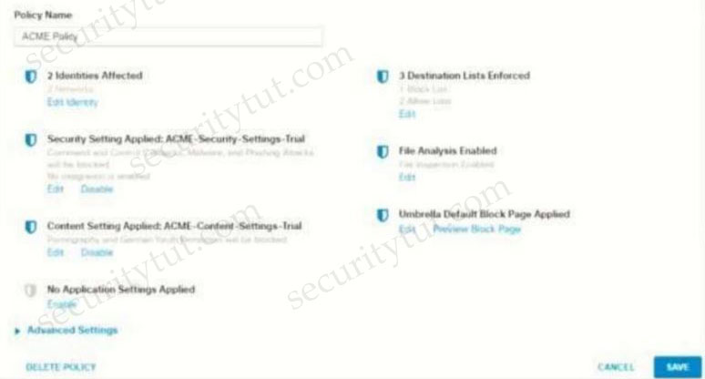
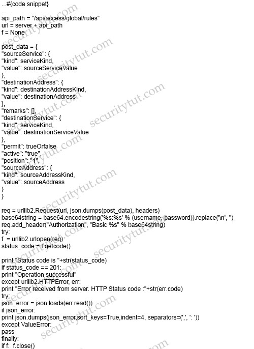
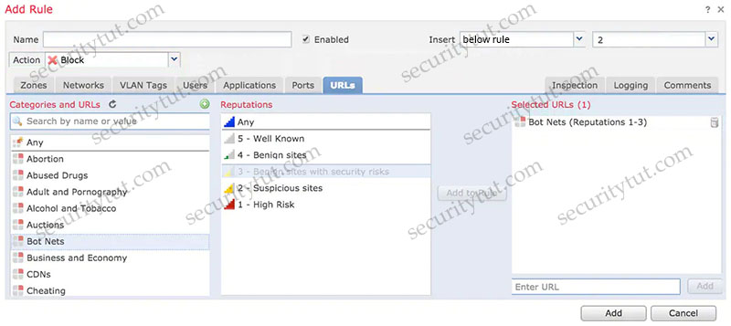
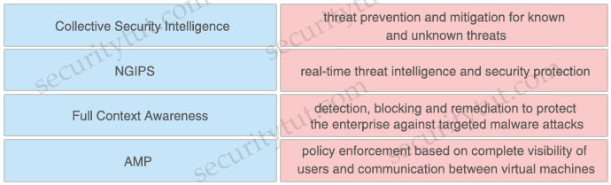

# Quiz Set 8


## 21. New Questions - Part 3

- <span style="color: #008888; font-weight: bold;">Question 1</span>

  What is a functional difference between a Cisco ASA and a Cisco IOS router with Zone-based policy firewall?

  A. The Cisco ASA denies all traffic by default whereas the Cisco IOS router with Zone-Based Policy Firewall starts out by allowing all traffic, even on untrusted interfaces.<br>
  B. The Cisco IOS router with Zone-Based Policy Firewall can be configured for high availability, whereas the Cisco ASA cannot<br>
  C. The Cisco IOS router with Zone-Based Policy Firewall denies all traffic by default, whereas the Cisco ASA starts out by allowing all traffic until rules are added<br>
  D. The Cisco ASA can be configured for high availability whereas the Cisco IOS router with Zone-Based Policy Firewall cannot<br>

  Answer: 


- <span style="color: #008888; font-weight: bold;">Question 2</span>

  What is a benefit of performing device compliance?

  A. verification of the latest OS patches<br>
  B. device classification and authorization<br>
  C. providing multi-factor authentication<br>
  D. providing attribute-driven policies<br>

  Answer: 


- <span style="color: #008888; font-weight: bold;">Question 3</span>

  Which cloud model is a collaborative effort where infrastructure is shared and jointly accessed by several organizations from a specific group?

  A. hybrid<br>
  B. community<br>
  C. private<br>
  D. public<br>

  Answer: 
  

- <span style="color: #008888; font-weight: bold;">Question 4</span>

  Which cryptographic process provides origin confidentiality, integrity, and origin authentication for packets?

  A. IKEv1<br>
  B. AH<br>
  C. ESP<br>
  D. IKEv2<br>

  Answer: 


- <span style="color: #008888; font-weight: bold;">Question 5</span>

  An organization wants to secure users, data, and applications in the cloud. The solution must be API-based and operate as a cloud-native CASB. Which solution must be used for this implementation?

  A. Cisco Cloudlock<br>
  B. Cisco Cloud Email Security<br>
  C. Cisco Firepower Next-Generation Firewall<br>
  D. Cisco Umbrella<br>

  Answer: 
  

- <span style="color: #008888; font-weight: bold;">Question 6</span>

  What are two Trojan malware attacks? (Choose two)

  A. frontdoor<br>
  B. rootkit<br>
  C. smurf<br>
  D. backdoor<br>
  E. sync<br>

  Answer: 


- <span style="color: #008888; font-weight: bold;">Question 7</span>

  What is the role of Cisco Umbrella Roaming when it is installed on an endpoint?

  A. to protect the endpoint against malicious file transfers<br>
  B. to ensure that assets are secure from malicious links on and off the corporate network<br>
  C. to establish secure VPN connectivity to the corporate network<br>
  D. to enforce posture compliance and mandatory software<br>

  Answer: 
  

- <span style="color: #008888; font-weight: bold;">Question 8</span>

  What is a capability of Cisco ASA Netflow?

  A. It filters NSEL events based on traffic.<br>
  B. It generates NSEL events even if the MPF is not configured.<br>
  C. It logs all event types only to the same collector.<br>
  D. It sends NetFlow data records from active and standby ASAs in an active standby failover pair.<br>

  Answer: 


- <span style="color: #008888; font-weight: bold;">Question 9</span>

  Which component of Cisco umbrella architecture increases reliability of the service?

  A. Anycast IP<br>
  B. AMP Threat grid<br>
  C. Cisco Talos<br>
  D. BGP route reflector<br>

  Answer: 
  

- <span style="color: #008888; font-weight: bold;">Question 10</span>

  What is the benefit of integrating Cisco ISE with a MDM solution?

  A. It provides compliance checks for access to the network<br>
  B. It provides the ability to update other applications on the mobile device<br>
  C. It provides the ability to add applications to the mobile device through Cisco ISE<br>
  D. It provides network device administration access<br>

  Answer: 
  

- <span style="color: #008888; font-weight: bold;">Question 11</span>

  An administrator configures a new destination list in Cisco Umbrella so that the organization can block specific domains for its devices. What should be done to ensure that all subdomains of domain.com are blocked?

  A. Configure the *.com address in the block list.<br>
  B. Configure the *.domain.com address in the block list<br>
  C. Configure the www.domain.com address in the block list<br>
  D. Configure the domain.com address in the block list<br>

  Answer: 


- <span style="color: #008888; font-weight: bold;">Question 12</span>

  An organization wants to provide visibility and to identify active threats in its network using a VM. The organization wants to extract metadata from network packet flow while ensuring that payloads are not retained or transferred outside the network. Which solution meets these requirements?

  A. Cisco Umbrella Cloud<br>
  B. Cisco Stealthwatch Cloud PNM<br>
  C. Cisco Stealthwatch Cloud PCM<br>
  D. Cisco Umbrella On-Premises<br>

  Answer: 
  

- <span style="color: #008888; font-weight: bold;">Question 13</span>

  An organization deploys multiple Cisco FTD appliances and wants to manage them using one centralized solution. The organization does not have a local VM but does have existing Cisco ASAs that must migrate over to Cisco FTDs. Which solution meets the needs of the organization?

  A. Cisco FMC<br>
  B. CSM<br>
  C. Cisco FDM<br>
  D. CDO<br>

  Answer: 


- <span style="color: #008888; font-weight: bold;">Question 14</span>

  An organization wants to secure data in a cloud environment. Its security model requires that all users be authenticated and authorized. Security configuration and posture must be continuously validated before access is granted or maintained to applications and data. There is also a need to allow certain application traffic and deny all other traffic by default. Which technology must be used to implement these requirements?

  A. virtual routing and forwarding<br>
  B. microsegmentation<br>
  C. access control policy<br>
  D. virtual LAN<br>

  Answer: 
  

- <span style="color: #008888; font-weight: bold;">Question 15</span>

  A Cisco FTD engineer is creating a new IKEv2 policy called s2s00123456789 for their organization to allow for additional protocols to terminate network devices with. They currently only have one policy established and need the new policy to be a backup in case some devices cannot support the stronger algorithms listed in the primary policy. What should be done in order to support this?

  A. Change the integrity algorithms to `SHA*` to support all SHA algorithms in the primary policy<br>
  B. Make the priority for the new policy 5 and the primary policy 1.<br>
  C. Change the encryption to AES* to support all AES algorithms in the primary policy<br>
  D. Make the priority for the primary policy 10 and the new policy 1<br>

  Answer: 
  

- <span style="color: #008888; font-weight: bold;">Question 16</span>

  Which type of encryption uses a public key and private key?

  A. asymmetric<br>
  B. symmetric<br>
  C. linear<br>
  D. nonlinear<br>

  Answer: 


- <span style="color: #008888; font-weight: bold;">Question 17</span>

  What are two features of NetFlow flow monitoring? (Choose two)

  A. Can track ingress and egress information<br>
  B. Include the flow record and the flow importer<br>
  C. Copies all ingress flow information to an interface<br>
  D. Does not required packet sampling on interfaces<br>
  E. Can be used to track multicast, MPLS, or bridged traffic<br>

  Answer: 
  

- <span style="color: #008888; font-weight: bold;">Question 18</span>

  A customer has various external HTTP resources available including Intranet Extranet and Internet, with a proxy configuration running in explicit mode. Which method allows the client desktop browsers to be configured to select when to connect direct or when to use the proxy?

  A. Transport mode<br>
  B. Forward file<br>
  C. PAC file<br>
  D. Bridge mode<br>

  Answer: 
  

- <span style="color: #008888; font-weight: bold;">Question 19</span>

  Which Talos reputation center allows for tracking the reputation of IP addresses for email and web traffic?

  A. IP and Domain Reputation Center<br>
  B. File Reputation Center<br>
  C. IP Slock List Center<br>
  D. AMP Reputation Center<br>

  Answer: 


- <span style="color: #008888; font-weight: bold;">Question 20</span>

  An engineer is configuring IPsec VPN and needs an authentication protocol that is reliable and supports ACK and sequence. Which protocol accomplishes this goal?

  A. AES-192<br>
  B. IKEv1<br>
  C. AES-256<br>
  D. ESP<br>

  Answer: 


- <span style="color: #008888; font-weight: bold;">Question 21</span>

  An administrator is establishing a new site-to-site VPN connection on a Cisco IOS router. The organization needs to ensure that the ISAKMP key on the hub is used only for terminating traffic from the IP address of 172.19.20.24. Which command on the hub will allow the administrator to accomplish this?

  A. crypto ca identity 172.19.20.24<br>
  B. crypto isakmp key Cisco0123456789 172.19.20.24<br>
  C. crypto enrollment peer address 172.19.20.24<br>
  D. crypto isakmp identity address 172.19.20.24<br>

  Answer: 
  

- <span style="color: #008888; font-weight: bold;">Question 22</span>

  What is a difference between an XSS attack and an SQL injection attack?

  A. SQL injection is a hacking method used to attack SQL databases, whereas XSS attacks can exist in many different types of applications<br>
  B. XSS is a hacking method used to attack SQL databases, whereas SQL injection attacks can exist in many different types of applications<br>
  C. SQL injection attacks are used to steal information from databases whereas XSS attacks are used to redirect users to websites where attackers can steal data from them<br>
  D. XSS attacks are used to steal information from databases whereas SQL injection attacks are used to redirect users to websites where attackers can steal data from them<br>

  Answer: 
  

- <span style="color: #008888; font-weight: bold;">Question 23</span>

  An engineer has been tasked with configuring a Cisco FTD to analyze protocol fields and detect anomalies in the traffic from industrial systems. What must be done to meet these requirements?

  A. Implement pre-filter policies for the CIP preprocessor<br>
  B. Enable traffic analysis in the Cisco FTD<br>
  C. Configure intrusion rules for the DNP3 preprocessor<br>
  D. Modify the access control policy to trust the industrial traffic<br>

  Answer: 
  

- <span style="color: #008888; font-weight: bold;">Question 24</span>

  Which posture assessment requirement provides options to the client for remediation and requires the remediation within a certain timeframe?

  A. Audit<br>
  B. Mandatory<br>
  C. Optional<br>
  D. Visibility<br>

  Answer: 
  

- <span style="color: #008888; font-weight: bold;">Question 25</span>

  Which attribute has the ability to change during the RADIUS CoA?

  A. NTP<br>
  B. authorization<br>
  C. accessibility<br>
  D. membership<br>

  Answer: 
  

- <span style="color: #008888; font-weight: bold;">Question 26</span>

  With Cisco AMP for Endpoints, which option shows a list of all files that have been executed in your environment?

  A. prevalence<br>
  B. file analysis<br>
  C. detections<br>
  D. vulnerable software<br>
  E. threat root cause<br>

  Answer: 
  

- <span style="color: #008888; font-weight: bold;">Question 27</span>

  A company discovered an attack propagating through their network via a file. A custom file policy was created in order to track this in the future and ensure no other endpoints execute the infected file. In addition, it was discovered during testing that the scans are not detecting the file as an indicator of compromise. What must be done in order to ensure that the created is functioning as it should?

  A. Create an IP block list for the website from which the file was downloaded<br>
  B. Block the application that the file was using to open<br>
  C. Upload the hash for the file into the policy<br>
  D. Send the file to Cisco Threat Grid for dynamic analysis<br>

  Answer: 


- <span style="color: #008888; font-weight: bold;">Question 28</span>

  A network engineer is trying to figure out whether FlexVPN or DMVPN would fit better in their environment. They have a requirement for more stringent security multiple security associations for the connections, more efficient VPN establishment as well consuming less bandwidth. Which solution would be best for this and why?

  A. DMVPN because it supports IKEv2 and FlexVPN does not.<br>
  B. FlexVPN because it supports IKEv2 and DMVPN does not.<br>
  C. FlexVPN because it uses multiple SAs and DMVPN does not.<br>
  D. DMVPN because it uses multiple SAs and FlexVPN does not.<br>

  Answer: 
  

- <span style="color: #008888; font-weight: bold;">Question 29</span>

  How does Cisco Workload Optimization Manager help mitigate application performance issues?

  A. It deploys an AWS Lambda system<br>
  B. It automates resource resizing<br>
  C. It optimizes a flow path<br>
  D. It sets up a workload forensic score<br>

  Answer: 
  

- <span style="color: #008888; font-weight: bold;">Question 30</span>

  An organization configures Cisco Umbrella to be used for its DNS services. The organization must be able to block traffic based on the subnet that the endpoint is on but it sees only the requests from its public IP address instead of each internal IP address. What must be done to resolve this issue?

  A. Set up a Cisco Umbrella virtual appliance to internally field the requests and see the traffic of each IP address<br>
  B. Use the tenant control features to identify each subnet being used and track the connections within the Cisco Umbrella dashboard<br>
  C. Install the Microsoft Active Directory Connector to give IP address information stitched to the requests in the Cisco Umbrella dashboard<br>
  D. Configure an internal domain within Cisco Umbrella to help identify each address and create policy from the domains<br>

  Answer: 
  

- <span style="color: #008888; font-weight: bold;">Question 31</span>

  What is a difference between a DoS attack and a DDoS attack?

  A. A DoS attack is where a computer is used to flood a server with TCP and UDP packets whereas a DDoS attack is where multiple systems target a single system with a DoS attack.<br>
  B. A DoS attack is where a computer is used to flood a server with TCP and UDP packets whereas a DDoS attack is where a computer is used to flood multiple servers that are distributed over a LAN<br>
  C. A DoS attack is where a computer is used to flood a server with UDP packets whereas a DDoS attack is where a computer is used to flood a server with TCP packets<br>
  D. A DoS attack is where a computer is used to flood a server with TCP packets whereas a DDoS attack is where a computer is used to flood a server with UDP packets<br>

  Answer: 


- <span style="color: #008888; font-weight: bold;">Question 32</span>

  Which two capabilities of Integration APIs are utilized with Cisco DNA center? (Choose two)

  A. Automatically deploy new virtual routers<br>
  B. Upgrade software on switches and routers<br>
  C. Application monitors for power utilization of devices and IoT sensors<br>
  D. Connect to Information Technology Service Management Platforms<br>
  E. Create new SSIDs on a wireless LAN controller<br>

  Answer: 
  

- <span style="color: #008888; font-weight: bold;">Question 33</span>

  Which kind of API that is used with Cisco DNA Center provisions SSIDs, QoS policies, and update software versions on switches?

  A. integration<br>
  B. intent<br>
  C. event<br>
  D. multivendor<br>

  Answer: 
  

- <span style="color: #008888; font-weight: bold;">Question 34</span>

  What is the purpose of CA in a PKI?

  A. to issue and revoke digital certificates.<br>
  B. to validate the authenticity of a digital certificate<br>
  C. to create the private key for a digital certificate.<br>
  D. to certify the ownership of a public key by the named subject<br>

  Answer: 
  

- <span style="color: #008888; font-weight: bold;">Question 35</span>

  Which DevSecOps implementation process gives a weekly or daily update instead of monthly or quarterly in the applications?

  A. orchestration<br>
  B. CI/CD pipeline<br>
  C. container<br>
  D. security<br>

  Answer: 
  

- <span style="color: #008888; font-weight: bold;">Question 36</span>

  Which parameter is required when configuring a Netflow exporter on a Cisco Router?

  A. DSCP value<br>
  B. source interface<br>
  C. exporter name<br>
  D. exporter description<br>

  Answer: 
  

- <span style="color: #008888; font-weight: bold;">Question 37</span>

  Which category includes Dos Attacks?

  A. virus attacks<br>
  B. trojan attacks<br>
  C. flood attacks<br>
  D. phishing attacks<br>

  Answer: 


- <span style="color: #008888; font-weight: bold;">Question 38</span>

  What are two advantages of using Cisco Any connect over DMVPN? (Choose two)

  A. It provides spoke-to-spoke communications without traversing the hub<br>
  B. It allows different routing protocols to work over the tunnel<br>
  C. It allows customization of access policies based on user identity<br>
  D. It allows multiple sites to connect to the data center<br>
  E. It enables VPN access for individual users from their machines<br>

  Answer: 


- <span style="color: #008888; font-weight: bold;">Question 39</span>

  When choosing an algorithm to us, what should be considered about Diffie Hellman and RSA for key establishment?

  A. RSA is an asymmetric key establishment algorithm intended to output symmetric keys.<br>
  B. RSA is a symmetric key establishment algorithm intended to output asymmetric keys.<br>
  C. DH is a symmetric key establishment algorithm intended to output asymmetric keys.<br>
  D. DH is on asymmetric key establishment algorithm intended to output symmetric keys.<br>

  Answer: 
  

- <span style="color: #008888; font-weight: bold;">Question 40</span>

  Which type of DNS abuse exchanges data between two computers even when there is no direct connection?

  A. malware installation<br>
  B. command-and-control communication<br>
  C. network footprinting<br>
  D. data exfiltration<br>

  Answer: 
  

- <span style="color: #008888; font-weight: bold;">Question 41</span>

  What is a difference between GETVPN and IPsec?

  A. GETVPN reduces latency and provides encryption over MPLS without the use of a central hub<br>
  B. GETVPN provides key management and security association management<br>
  C. GETVPN is based on IKEv2 and does not support IKEv1<br>
  D. GETVPN is used to build a VPN network with multiple sites without having to statically configure all devices<br>

  Answer: 
  

- <span style="color: #008888; font-weight: bold;">Question 42</span>

  What is a benefit of using telemetry over SNMP to configure new routers for monitoring purposes?

  A. Telemetry uses a pull, method which makes it more reliable than SNMP<br>
  B. Telemetry uses push and pull, which makes it more scalable than SNMP<br>
  C. Telemetry uses push and pull which makes it more secure than SNMP<br>
  D. Telemetry uses a push method which makes it faster than SNMP<br>

  Answer: 
  

- <span style="color: #008888; font-weight: bold;">Question 43</span>

  An organization wants to use Cisco FTD or Cisco ASA devices. Specific URLs must be blocked from being accessed via the firewall which requires that the administrator input the bad URL categories that the organization wants blocked into the access policy. Which solution should be used to meet this requirement?

  A. Cisco ASA because it enables URL filtering and blocks malicious URLs by default, whereas Cisco FTD does not<br>
  B. Cisco ASA because it includes URL filtering in the access control policy capabilities, whereas Cisco FTD does not<br>
  C. Cisco FTD because it includes URL filtering in the access control policy capabilities, whereas Cisco ASA does not<br>
  D. Cisco FTD because it enables URL filtering and blocks malicious URLs by default, whereas Cisco ASA does not<br>

  Answer: 


- <span style="color: #008888; font-weight: bold;">Question 44</span>

  An administrator configures a Cisco WSA to receive redirected traffic over ports 80 and 443. The organization requires that a network device with specific WSA integration capabilities be configured to send the traffic to the WSA to proxy the requests and increase visibility, while making this invisible to the users. What must be done on the Cisco WSA to support these requirements?

  A. Configure transparent traffic redirection using WCCP in the Cisco WSA and on the network device<br>
  B. Configure active traffic redirection using WPAD in the Cisco WSA and on the network device<br>
  C. Use the Layer 4 setting in the Cisco WSA to receive explicit forward requests from the network device<br>
  D. Use PAC keys to allow only the required network devices to send the traffic to the Cisco WSA<br>

  Answer: 


- <span style="color: #008888; font-weight: bold;">Question 45</span>

  An administrator configures new authorization policies within Cisco ISE and has difficulty profiling the devices. Attributes for the new Cisco IP phones that are profiled based on the RADIUS authentication are seen however the attributes for CDP or DHCP are not. What should the administrator do to address this issue?

  A. Configure the ip dhcp snooping trust command on the DHCP interfaces to get the information to Cisco ISE<br>
  B. Configure the authentication port-control auto feature within Cisco ISE to identify the devices that are trying to connect<br>
  C. Configure a service template within the switch to standardize the port configurations so that the correct information is sent to Cisco ISE<br>
  D. Configure the device sensor feature within the switch to send the appropriate protocol information<br>

  Answer: 
  

- <span style="color: #008888; font-weight: bold;">Question 46</span>

  A network engineer must monitor user and device behavior within the on-premises network. This data must be sent to the Cisco Stealthwatch Cloud analytics platform for analysis. What must be done to meet this requirement using the Ubuntu-based VM appliance deployed in a VMware-based hypervisor?

  A. Configure a Cisco FMC to send syslogs to Cisco Stealthwatch Cloud<br>
  B. Deploy the Cisco Stealthwatch Cloud PNM sensor that sends data to Cisco Stealthwatch Cloud<br>
  C. Deploy a Cisco FTD sensor to send network events to Cisco Stealthwatch Cloud<br>
  D. Configure a Cisco FMC to send NetFlow to Cisco Stealthwatch Cloud<br>

  Answer: 
  

- <span style="color: #008888; font-weight: bold;">Question 47</span>

  An organization uses Cisco FMC to centrally manage multiple Cisco FTD devices. The default management port conflicts with other communications on the network and must be changed. What must be done to ensure that all devices can communicate together?

  A. Manually change the management port on Cisco FMC and all managed Cisco FTD devices<br>
  B. Set the tunnel to go through the Cisco FTD<br>
  C. Change the management port on Cisco FMC so that it pushes the change to all managed Cisco FTD devices<br>
  D. Set the tunnel port to 8305<br>

  Answer: 
  

- <span style="color: #008888; font-weight: bold;">Question 48</span>

  Which service allows a user export application usage and performance statistics with Cisco Application Visibility and control?

  A. SNORT<br>
  B. NetFlow<br>
  C. SNMP<br>
  D. 802.1X<br>

  Answer: 
  

- <span style="color: #008888; font-weight: bold;">Question 49</span>

  An engineer adds a custom detection policy to a Cisco AMP deployment and encounters issues with the configuration. The simple detection mechanism is configured, but the dashboard indicates that the hash is not 64 characters and is non-zero. What is the issue?

  A. The engineer is attempting to upload a hash created using MD5 instead of SHA-256<br>
  B. The file being uploaded is incompatible with simple detections and must use advanced detections<br>
  C. The hash being uploaded is part of a set in an incorrect format<br>
  D. The engineer is attempting to upload a file instead of a hash<br>

  Answer: 


- <span style="color: #008888; font-weight: bold;">Question 50</span>

  Drag and drop the cloud security assessment components from the left onto the definitions on the right.

  <figure style="margin: 0.5em; display: flex; justify-content: center; align-items: center;">
    
  </figure>  

  Answer:
  

- <span style="color: #008888; font-weight: bold;">Question 51</span>

  Refer to the exhibit.

  <figure style="margin: 0.5em; display: flex; justify-content: center; align-items: center;">
    
  </figure>

  What does this python script accomplish?

  A. It lists the LDAP users from the external identity store configured on Cisco ISE<br>
  B. It authenticates to a Cisco ISE server using the username of ersad<br>
  C. It allows authentication with TLSv1 SSL protocol<br>
  D. It authenticates to a Cisco ISE with an SSH connection<br>

  Answer: 
  

- <span style="color: #008888; font-weight: bold;">Question 52</span>

  Refer to the exhibit.

  ```cfg
  ntp authentication-key 10 md5 cisco123
  ntp trusted-key 10
  ```

  A network engineer is testing NTP authentication and realizes that any device synchronizes time with this router and that NTP authentication is not enforced. What is the cause of this issue?

  A. The hashing algorithm that was used was MD5 which is unsupported.<br>
  B. The key was configured in plain text.<br>
  C. NTP authentication is not enabled.<br>
  D. The router was not rebooted after the NTP configuration updated<br>

  Answer: 
  

- <span style="color: #008888; font-weight: bold;">Question 53</span>

  Refer to the exhibit.

  <figure style="margin: 0.5em; display: flex; justify-content: center; align-items: center;">
    
  </figure>

  How does Cisco Umbrella manage traffic that is directed toward risky domains?

  A. Traffic is managed by the application settings, unhandled and allowed<br>
  B. Traffic is allowed but logged<br>
  C. Traffic is managed by the security settings and blocked<br>
  D. Traffic is proxied through the intelligent proxy<br>

  Answer: 
  

  ======================== New Questions (added on 27th-Sep-2021) ========================


- <span style="color: #008888; font-weight: bold;">Question 54</span>

  An administrator is adding a new Cisco ISE node to an existing deployment. What must be done to ensure that the addition of the node will be successful when inputting the FQDN?

  A. Change the IP address of the new Cisco ISE node to the same network as the others<br>
  B. Make the new Cisco ISE node a secondary PAN before registering it with the primary<br>
  C. Open port 8905 on the firewall between the Cisco ISE nodes<br>
  D. Add the DNS entry for the new Cisco ISE node into the DNS server<br>

  Answer: 


- <span style="color: #008888; font-weight: bold;">Question 55</span>

  Refer to the exhibit.

  crypto ikev2 name-mangler MANGLER
  dn organization-unit
  An engineer is implementing a certificate based VPN. What is the result of the existing configuration?

  A. The OU of the IKEv2 peer certificate is used as the identity when matching an IKEv2 authorization policy<br>
  B. Only an IKEv2 peer that has an OU certificate attribute set to MANGLER establishes an IKEv2 SA successfully<br>
  C. The OU of the IKEv2 peer certificate is encrypted when the OU is set to MANGLER<br>
  D. The OU of the IKEv2 peer certificate is set to MANGLER<br>

  Answer: 


- <span style="color: #008888; font-weight: bold;">Question 56</span>

  An organization wants to implement a cloud-delivered and SaaS-based solution to provide visibility and threat detection across the AWS network. The solution must be deployed without software agents and rely on AWS VPC flow logs instead. Which solution meets these requirements?

  A. Cisco Stealthwatch Cloud<br>
  B. Cisco Umbrella<br>
  C. NetFlow collectors<br>
  D. Cisco Cloudlock<br>

  Answer: 


- <span style="color: #008888; font-weight: bold;">Question 57</span>

  How is data sent out to the attacker during a DNS tunneling attack?

  A. as part of the UDP’53 packet payload<br>
  B. as part of the domain name<br>
  C. as part of the TCP/53 packet header<br>
  D. as part of the DNS response packet<br>

  Answer: 


- <span style="color: #008888; font-weight: bold;">Question 58</span>

  A network engineer must configure a Cisco ESA to prompt users to enter two forms of information before gaining access. The Cisco ESA must also join a cluster machine using preshared keys. What must be configured to meet these requirements?

  A. Enable two-factor authentication through a RADIUS server and then join the cluster by using the Cisco ESA CLI<br>
  B. Enable two-factor authentication through a RADIUS server and then join the cluster by using the Cisco ESA GUI<br>
  C. Enable two-factor authentication through a TACACS+ server and then join the cluster by using the Cisco ESA GUI<br>
  D. Enable two-factor authentication through a TACACS+ server and then join the cluster by using the Cisco ESA CLI<br>

  Answer: 


- <span style="color: #008888; font-weight: bold;">Question 59</span>

  What is the term for having information about threats and threat actors that helps mitigate harmful events that would otherwise compromise networks or systems?

  A. trusted automated exchange<br>
  B. Indicators of Compromise<br>
  C. The Exploit Database<br>
  D. threat intelligence<br>

  Answer: 
  

- <span style="color: #008888; font-weight: bold;">Question 60</span>

  Which Cisco platform processes behavior baselines, monitors for deviations, and reviews for malicious processes in data center traffic and servers while performing software vulnerability detection?

  A. Cisco Tetration<br>
  B. Cisco ISE<br>
  C. Cisco AMP for Network<br>
  D. Cisco AnyConnect<br>

  Answer: 


- <span style="color: #008888; font-weight: bold;">Question 61</span>

  Which portion of the network do EPP solutions solely focus on and EDR solutions do not?

  A. server farm<br>
  B. perimeter<br>
  C. core<br>
  D. East-West gateways<br>

  Answer: 


- <span style="color: #008888; font-weight: bold;">Question 62</span>

  What is a benefit of using Cisco CWS compared to an on-premises Cisco WSA?

  A. Cisco CWS eliminates the need to backhaul traffic through headquarters for remote workers whereas Cisco WSA does not<br>
  B. Cisco CWS minimizes the load on the internal network and security infrastructure as compared to Cisco WSA.<br>
  C. URL categories are updated more frequently on Cisco CWS than they are on Cisco WSA<br>
  D. Content scanning for SAAS cloud applications is available through Cisco CWS and not available through Cisco WSA<br>

  Answer: 


- <span style="color: #008888; font-weight: bold;">Question 63</span>

  An organization wants to improve its cybersecurity processes and to add intelligence to its data. The organization wants to utilize the most current intelligence data for URL filtering, reputations, and vulnerability information that can be integrated with the Cisco FTD and Cisco WSA. What must be done to accomplish these objectives?

  A. Create a Cisco pxGrid connection to NIST to import this information into the security products for policy use<br>
  B. Create an automated download of the Internet Storm Center intelligence feed into the Cisco FTD and Cisco WSA databases to tie to the dynamic access control policies.<br>
  C. Download the threat intelligence feed from the IETF and import it into the Cisco FTD and Cisco WSA databases<br>
  D. Configure the integrations with Talos Intelligence to take advantage of the threat intelligence that it provides<br>

  Answer: 
  

- <span style="color: #008888; font-weight: bold;">Question 64</span>

  Cisco SensorBase gathers threat information from a variety of Cisco products and services and performs analytics to find patterns on threats. Which term describes this process?

  A. deployment<br>
  B. consumption<br>
  C. authoring<br>
  D. sharing<br>

  Answer: 


- <span style="color: #008888; font-weight: bold;">Question 65</span>

  An organization has a requirement to collect full metadata information about the traffic going through their AWS cloud services. They want to use this information for behavior analytics and statistics. Which two actions must be taken to implement this requirement? (Choose two)

  A. Configure Cisco ACI to ingest AWS information<br>
  B. Configure Cisco Thousand Eyes to ingest AWS information<br>
  C. Send syslog from AWS to Cisco Stealthwatch Cloud<br>
  D. Send VPC Flow Logs to Cisco Stealthwatch Cloud<br>
  E. Configure Cisco Stealthwatch Cloud to ingest AWS information<br>

  Answer: 


- <span style="color: #008888; font-weight: bold;">Question 66</span>

  Refer to the exhibit.

  <figure style="margin: 0.5em; display: flex; justify-content: center; align-items: center;">
    
  </figure>

  What will occur when this device tries to connect to the port?

  A. 802.1X will not work, but MAB will start and allow the device on the network<br>
  B. 802.1X will not work and the device will not be allowed network access<br>
  C. 802.1X will work and the device will be allowed on the network<br>
  D. 802.1X and MAB will both be used and ISE can use policy to determine the access level<br>

  Answer: 
  

- <span style="color: #008888; font-weight: bold;">Question 67</span>

  An engineer is configuring their router to send NetfFow data to Stealthwatch which has an IP address of 1.1.1.1 using the flow record Steathwatch406397954 command. Which additional command is required to complete the flow record?

  A. `transport udp 2055`<br>
  B. `match ipv4 ttl`<br>
  C. `cache timeout active 60`<br>
  D. `destination 1.1.1.1`<br>

  Answer: 
  

- <span style="color: #008888; font-weight: bold;">Question 68</span>

  An engineer needs to add protection for data in transit and have headers in the email message. Which configuration is needed to accomplish this goal?

  A. Provision the email appliance<br>
  B. Deploy an encryption appliance<br>
  C. Map sender IP addresses to a host interface<br>
  D. Enable flagged message handling<br>

  Answer: 


- <span style="color: #008888; font-weight: bold;">Question 69</span>

  An administrator is adding a new switch onto the network and has configured AAA for network access control. When testing the configuration, the RADIUS authenticates to Cisco ISE but is being rejected. Why is the ip radius source-interface command needed for this configuration?

  A. Only requests that originate from a configured NAS IP are accepted by a RADIUS server<br>
  B. The RADIUS authentication key is transmitted only from the defined RADIUS source interface<br>
  C. RADIUS requests are generated only by a router if a RADIUS source interface is defined<br>
  D. Encrypted RADIUS authentication requires the RADIUS source interface be defined<br>

  Answer: 


- <span style="color: #008888; font-weight: bold;">Question 70</span>

  Refer to the exhibit.

  ```cfg
  interface GigabitEthernet1/0/18
  switchport access vlan 41
  switchport mode access
  switchport voice vlan 44
  device-tracking attach-policy IPDT_MAX_10
  authentication periodic
  authentication timer reauthenticate server
  access-session host-mode multi-domain
  access-session port-control auto
  dot1x pae authenticator
  dot1x timeout tx-period 7
  dot1x max-reauth-req 3
  spanning-tree portfast
  service-policy type control subscriber POLICY_Gi1/0/18
  ```

  A Cisco ISE administrator adds a new switch to an 802.1X deployment and has difficulty with some endpoints gaining access. Most PCs and IP phones can connect and authenticate using their machine certificate credentials. However printer and video cameras cannot based on the interface configuration provided. What must be to get these devices on to the network using Cisco ISE for authentication and authorization while maintaining security controls?

  A. Change the default policy in Cisco ISE to allow all devices not using machine authentication<br>
  B. Enable insecure protocols within Cisco ISE in the allowed protocols configuration<br>
  C. Configure authentication event fail retry 2 action authorize vlan 41 on the interface<br>
  D. Add mab to the interface configuration<br>

  Answer: 


- <span style="color: #008888; font-weight: bold;">Question 71</span>

  What is the function of the crypto isakmp key cisc406397954 address 0.0.0.0 0.0.0.0 command when establishing an IPsec VPN tunnel?

  A. It defines what data is going to be encrypted via the VPN<br>
  B. It configures the pre-shared authentication key<br>
  C. It prevents all IP addresses from connecting to the VPN server.<br>
  D. It configures the local address for the VPN server.<br>

  Answer: 
  

- <span style="color: #008888; font-weight: bold;">Question 72</span>

  An engineer is adding a Cisco DUO solution to the current TACACS+ deployment using Cisco ISE. The engineer wants to authenticate users using their account when they log into network devices. Which action accomplishes this task?

  A. Configure Cisco DUO with the external Active Directory connector and tie it to the policy set within Cisco ISE<br>
  B. Install and configure the Cisco DUO Authentication Proxy and configure the identity source sequence within Cisco ISE<br>
  C. Create an identity policy within Cisco ISE to send all authentication requests to Cisco DUO<br>
  D. Modify the current policy with the condition MFASourceSequence DUO=true in the authorization conditions within Cisco ISE<br>

  Answer: 
  

- <span style="color: #008888; font-weight: bold;">Question 73</span>

  An organization is selecting a cloud architecture and does not want to be responsible for patch management of the operating systems. Why should the organization select either Platform as a Service or Infrastructure as a Service for this environment?

  A. Platform as a Service because the customer manages the operating system<br>
  B. Infrastructure as a Service because the customer manages the operating system<br>
  C. Platform as a Service because the service provider manages the operating system<br>
  D. Infrastructure as a Service because the service provider manages the operating system<br>

  Answer: 


- <span style="color: #008888; font-weight: bold;">Question 74</span>

  How does a cloud access security broker function?

  A. It is an authentication broker to enable single sign-on and multi-factor authentication for a cloud solution<br>
  B. It integrates with other cloud solutions via APIs and monitors and creates incidents based on events from the cloud solution<br>
  C. It acts as a security information and event management solution and receives syslog from other cloud solutions<br>
  D. It scans other cloud solutions being used within the network and identifies vulnerabilities<br>

  Answer: 


- <span style="color: #008888; font-weight: bold;">Question 75</span>

  A Cisco AMP for Endpoints administrator configures a custom detection policy to add specific MD5 signatures. The configuration is created in the simple detection policy section, but it does not work. What is the reason for this failure?

  A. The administrator must upload the file instead of the hash for Cisco AMP to use<br>
  B. The MD5 hash uploaded to the simple detection policy is in the incorrect format<br>
  C. The APK must be uploaded for the application that the detection is intended<br>
  D. Detections for MD5 signatures must be configured in the advanced custom detection policies<br>

  Answer: 


- <span style="color: #008888; font-weight: bold;">Question 76</span>

  What is the difference between a vulnerability and an exploit?

  A. A vulnerability is a hypothetical event for an attacker to exploit<br>
  B. A vulnerability is a weakness that can be exploited by an attacker<br>
  C. An exploit is a weakness that can cause a vulnerability in the network<br>
  D. An exploit is a hypothetical event that causes a vulnerability in the network<br>

  Answer: 
  

- <span style="color: #008888; font-weight: bold;">Question 77</span>

  Which feature is leveraged by advanced antimalware capabilities to be an effective endpoint protection platform?

  A. big data<br>
  B. storm centers<br>
  C. sandboxing<br>
  D. blocklisting<br>

  Answer: 


- <span style="color: #008888; font-weight: bold;">Question 78</span>

  Which system facilitates deploying microsegmentation and multi-tenancy services with a policy-based container?

  A. SDLC<br>
  B. Docker<br>
  C. Lambda<br>
  D. Contiv<br>

  Answer: 


  ===================== New Questions (added on 29th-Sep-2021) =====================


- <span style="color: #008888; font-weight: bold;">Question 79</span>

  An engineer integrates Cisco FMC and Cisco ISE using pxGrid. Which role is assigned for Cisco FMC?

  A. client<br>
  B. server<br>
  C. publisher<br>
  D. controller<br>

  Answer: 
  

- <span style="color: #008888; font-weight: bold;">Question 80</span>

  A network security engineer must export packet captures from the Cisco FMC web browser while troubleshooting an issue. When navigating to the address https://<FMC IP>/capure/CAPI/pcap/test.pcap, an error 403: Forbidden is given instead of the PCAP file. Which action must the engineer take to resolve this issue?

  A. Disable the proxy setting on the browser<br>
  B. Disable the HTTPS server and use HTTP instead<br>
  C. Use the Cisco FTD IP address as the proxy server setting on the browser<br>
  D. Enable the HTTPS server for the device platform policy<br>

  Answer: 
  

  ======================== New questions (added on 18th-Dec-2021) ===========================


- <span style="color: #008888; font-weight: bold;">Question 81</span>

  Which security solution protects users leveraging DNS-layer security?

  A. Cisco Umbrella<br>
  B. Cisco ISE<br>
  C. Cisco ASA<br>
  D. Cisco FTD<br>

  Answer: 


- <span style="color: #008888; font-weight: bold;">Question 82</span>

  What is the result of the

  ```text
  ACME-Router(config)#login block-for 100 attempts 4 within 60
  ```

  command on a Cisco IOS router?

  A. After four unsuccessful log in attempts, the line is blocked for 100 seconds and only permit IP addresses A are permitted in ACL 60<br>
  B. After four unsuccessful log in attempts, the line is blocked for 60 seconds and only permit IP addresses C are permitted in ACL 100<br>
  C. If four log<br> in attempts fail in 100 seconds, wait for 60 seconds to next log in prompt
  D. If four fail<br>ures occur in 60 seconds, the router goes to quiet mode for 100 seconds

  Answer: 
  

- <span style="color: #008888; font-weight: bold;">Question 83</span>

  What is an advantage of network telemetry over SNMP pulls?

  A. scalability<br>
  B. security<br>
  C. encapsulation<br>
  D. accuracy<br>

  Answer: 
  

- <span style="color: #008888; font-weight: bold;">Question 84</span>

  What is a benefit of using a multifactor authentication strategy?

  A. It provides secure remote access for applications<br>
  B. It provides an easy, single sign-on experience against multiple applications<br>
  C. It protects data by enabling the use of a second validation of identity<br>
  D. It provides visibility into devices to establish device trust<br>

  Answer: C
  

- <span style="color: #008888; font-weight: bold;">Question 85</span>

  An engineer is trying to decide between using L2TP or GRE over IPsec for their site-to-site VPN implementation. What must be understood before choosing a solution?

  A. L2TP uses TCP port 47 and GRE over IPsec uses UDP port 1701.<br>
  B. GRE over IPsec cannot be used as a standalone protocol, and L2TP can.<br>
  C. GRE over IPsec adds its own header, and L2TP does not<br>
  D. L2TP is an IP packet encapsulation protocol, and GRE over IPsec is a tunneling protocol.<br>

  Answer: 
  

- <span style="color: #008888; font-weight: bold;">Question 86</span>

  What are two functionalities of northbound and southbound APIs within Cisco SDN architecture? (Choose two.)

  A. Southbound APIs are used to define how SDN controllers integrate with applications.<br>
  B. Northbound interfaces utilize OpenFlow and OpFlex to integrate with network devices.<br>
  C. Northbound APIs utilize RESTful API methods such as GET, POST, and DELETE.<br>
  D. Southbound interfaces utilize device configurations such as VLANs and IP addresses.<br>
  E. Southbound APIs utilize CLI, SNMP, and RESTCONF.<br>

  Answer: 
  

- <span style="color: #008888; font-weight: bold;">Question 87</span>

  Which two solutions help combat social engineering and phishing at the endpoint level? (Choose two)

  A. Cisco ISEN<br>
  B. Cisco Umbrella<br>
  C. Cisco DNA Center<br>
  D. Cisco TrustSec<br>
  E. Cisco Duo Security<br>

  Answer: 


- <span style="color: #008888; font-weight: bold;">Question 88</span>

  A network engineer must migrate a Cisco WSA virtual appliance from one physical host to another physical host by using VMware Motion. What is a requirement for both physical hosts?

  A. The hosts must run different versions of Cisco Asyncos<br>
  B. The hosts must run Cisco AsyncOS 10.0 or greater<br>
  C. The hosts must have access to the same defined network<br>
  D. The hosts must use a different datastore than the virtual appliance<br>

  Answer: 
  

- <span style="color: #008888; font-weight: bold;">Question 89</span>

  An engineer is implementing Cisco CES in an existing Microsoft Office 365 environment and must route inbound email to Cisco CES addresses. Which DNS record must be modified to accomplish this task?

  A. CNAME<br>
  B. МХ<br>
  C. DKIM<br>
  D. SPF<br>

  Answer: 
  

- <span style="color: #008888; font-weight: bold;">Question 90</span>

  Which method of attack is used by a hacker to send malicious code through a web application to an unsuspecting user to request that the victims web browser executes the code?

  A. buffer overflow<br>
  B. SQL injection<br>
  C. browser WGET<br>
  D. cross-site scripting<br>

  Answer: 


- <span style="color: #008888; font-weight: bold;">Question 91</span>

  What are two ways a network administrator transparently identifies users using Active Directory on the Cisco WSA? (Choose two)

  A. Create an LDAP authentication realm and disable transparent user identification<br>
  B. Deploy a separate eDirectory server, the client IP address is recorded in this server.<br>
  C. Create NTLM or Kerberos authentication realm and enable transparent user identification.<br>
  D. The eDirectory client must be installed on each client workstation<br>
  E. Deploy a separate Active Directory agent such as Cisco Context Directory Agent.<br>

  Answer: 
  

- <span style="color: #008888; font-weight: bold;">Question 92</span>

  Which endpoint solution protects a user from a phishing attack?

  A. Cisco AnyConnect with Umbrella Roaming Security module<br>
  B. Cisco AnyConnect with Network Access Manager module<br>
  C. Cisco Identity Services Engine<br>
  D. Cisco AnyConnect with ISE Posture module<br>

  Answer: 
  

- <span style="color: #008888; font-weight: bold;">Question 93</span>

  An engineer is configuring Cisco Umbrella and has an identity that references two different policies. Which action ensures that the policy that the identity must use takes precedence over the second one?

  A. Configure only the policy with the most recently changed timestamp.<br>
  B. Make the correct policy first in the policy order.<br>
  C. Configure the default policy to redirect the requests to the correct policy.<br>
  D. Place the policy with the most-specific configuration last in the policy order.<br>

  Answer: 


- <span style="color: #008888; font-weight: bold;">Question 94</span>

  Refer to the exhibit.

  <figure style="margin: 0.5em; display: flex; justify-content: center; align-items: center;">
    
  </figure>

  Which configuration item makes it possible to have the AAA session on the network?

  A. aaa authorization network default group ise<br>
  B. aaa authorization exec default ise<br>
  C. aaa authentication login console ise<br>
  D. aaa authentication enable default enable<br>

  Answer: 
  

- <span style="color: #008888; font-weight: bold;">Question 95</span>

  Refer to the exhibit.

  <figure style="margin: 0.5em; display: flex; justify-content: center; align-items: center;">
    
  </figure>

  What is the function of the Python script code snippet for the Cisco ASA REST API?

  A. deletes a global rule from policies<br>
  B. obtains the saved configuration of the Cisco ASA firewall<br>
  C. changes the hostname of the Cisco ASA<br>
  D. adds a global rule into policies<br>

  Answer: 
  

- <span style="color: #008888; font-weight: bold;">Question 96</span>

  Refer to the exhibit.

  <figure style="margin: 0.5em; display: flex; justify-content: center; align-items: center;">
    
  </figure>

  When creating an access rule for URL filtering, a network engineer adds certain categories and individual URLs to block. What is the result of the configuration?

  A. Only URLs for botnets with a reputation score of 3 will be allowed while the rest will be blocked<br>
  B. Only URLs for botnets with reputation scores of 1-3 will be blocked<br>
  C. Only URLs for botnets with reputation scores of 3-5 will be blocked<br>
  D. Only URLs for botnets with a reputation score of 3 will be blocked<br>

  Answer: 
  

- <span style="color: #008888; font-weight: bold;">Question 97</span>

  What are two functionalities of SDN Northbound APIs? (Choose two)

  A. Northbound APIs provide a programmable interface for applications to dynamically configure the network.<br>
  B. Northbound APIs form the interface between the SDN controller and business applications.<br>
  C. Northbound APIs use the NETCONF protocol to communicate with applications.<br>
  D. Northbound APIs form the interface between the SDN controller and the network switches or routers.<br>
  E. OpenFlow is a standardized northbound API protocol.<br>

  Answer: 
  

- <span style="color: #008888; font-weight: bold;">Question 98</span>

  What must be enabled to secure SaaS-based applications?

  A. two-factor authentication<br>
  B. end-to-end encryption<br>
  C. application security gateway<br>
  D. modular policy framework<br>

  Answer: 
  

- <span style="color: #008888; font-weight: bold;">Question 99</span>

  A Cisco ISE engineer configures Central Web Authentication (CWA) for wireless guest access and must have the guest endpoints redirect to the guest portal for authentication and authorization. While testing the policy, the engineer notices that the device is not redirected and instead gets full guest access. What must be done for the redirect to work?

  A. Create an advanced attribute setting of Cisco.cisco-gateway-id=guest within the authorization profile for the authorization policy line that the unauthenticated devices hit.
  B. Tag the guest portal in the CWA part of the Common Tasks section of the authorization profile for the authorization policy line that the unauthenticated devices hit.
  C. Add the DACL name for the Airespace ACL configured on the WLC in the Common Tasks section of the authorization profile for the authorization policy line that the unauthenticated devices hit
  D. Use the track movement option within the authorization profile for the authorization policy line that the unauthenticated devices hit

  Answer: 


- <span style="color: #008888; font-weight: bold;">Question 100</span>

  What is a difference between Cisco AMP for Endpoints and Cisco Umbrella?

  A. Cisco AMP for Endpoints prevents, detects, and responds to attacks before damage can be done, and Cisco Umbrella provides the first line of defense against Internet threats.<br>
  B. Cisco AMP for Endpoints prevents connections to malicious destinations, and Cisco Umbrella works at the file level to prevent the initial execution of malware.<br>
  C. Cisco AMP for Endpoints automatically researches indicators of compromise and confirms threats, and Cisco Umbrella does not<br>
  D. Cisco AMP for Endpoints is a cloud-based service, and Cisco Umbrella is not<br>

  Answer: 


- <span style="color: #008888; font-weight: bold;">Question 101</span>

  What is the intent of a basic SYN flood attack?

  A. to flush the register stack to re-initiate the buffers<br>
  B. to solicit DNS responses<br>
  C. to exceed the threshold limit of the connection queue<br>
  D. to cause the buffer to overflow<br>

  Answer: 
  

- <span style="color: #008888; font-weight: bold;">Question 102</span>

  Which open standard creates a framework for sharing threat intelligence in a machine-digestible format?

  A. OpenC2<br>
  B. OpenIoC<br>
  C. STIX<br>
  D. Cybox<br>

  Answer: 
  

- <span style="color: #008888; font-weight: bold;">Question 103</span>

  Which two methods must be used to add switches into the fabric so that administrators can control how switches are added into DCNM for private cloud management? (Choose two)

  A. PowerOn Auto Provisioning<br>
  B. Cisco Cloud Director<br>
  C. Seed IP<br>
  D. CDP AutoDiscovery<br>
  E. Cisco Prime Infrastructure<br>

  Answer: 


- <span style="color: #008888; font-weight: bold;">Question 104</span>

  Which role is a default guest type in Cisco ISE?

  A. Full-Time<br>
  B. Contractor<br>
  C. Yearly<br>
  D. Monthly<br>

  Answer: 
  

- <span style="color: #008888; font-weight: bold;">Question 105</span>

  An engineer configures new features within the Cisco Umbrella dashboard and wants to identify and proxy traffic that is categorized as risky domains and may contain safe and malicious content. Which action accomplishes these objectives?

  A. Configure intelligent proxy within Cisco Umbrella to intercept and proxy the requests for only those categories<br>
  B. Upload the threat intelligence database to Cisco Umbrella for the most current information on reputations and to have the destination lists block them.<br>
  C. Create a new site within Cisco Umbrella to block requests from those categories so they can be sent to the proxy device.<br>
  D. Configure URL filtering within Cisco Umbrella to track the URLs and proxy the requests for those categories and below.<br>

  Answer: 


- <span style="color: #008888; font-weight: bold;">Question 106</span>

  An administrator enables Cisco Threat Intelligence Director on a Cisco FMC. Which process uses STIX and allows uploads and downloads of block lists?

  A. consumption<br>
  B. editing<br>
  C. sharing<br>
  D. authoring<br>

  Answer: 


- <span style="color: #008888; font-weight: bold;">Question 107</span>

  Why is it important to have a patching strategy for endpoints?

  A. so that functionality is increased on a faster scale when it is used<br>
  B. so that known vulnerabilities are targeted and having a regular patch cycle reduces risks<br>
  C. so that patching strategies can assist with disabling nonsecure protocols in applications<br>
  D. to take advantage of new features released with patches<br>

  Answer: 


- <span style="color: #008888; font-weight: bold;">Question 108</span>

  What is a description of microsegmentation?

  A. Environments deploy a container orchestration platform, such as Kubernetes, to manage the application delivery<br>
  B. Environments apply a zero-trust model and specify how applications on different servers or containers can communicate<br>
  C. Environments implement private VLAN segmentation to group servers with similar applications<br>
  D. Environments deploy centrally managed host-based firewall rules on each server or container<br>

  Answer: 
  

- <span style="color: #008888; font-weight: bold;">Question 109</span>

  Which security product enables administrators to deploy Kubernetes clusters in air-gapped sites without needing Internet access?

  A. Cisco Container Controller<br>
  B. Cisco Container Platform<br>
  C. Cisco Cloud Platform<br>
  D. Cisco Content Platform<br>

  Answer: 
  

- <span style="color: #008888; font-weight: bold;">Question 110</span>

  What are two functions of TAXII in threat intelligence sharing? (Choose two)

  A. exchanges trusted anomaly intelligence information<br>
  B. determines how threat intelligence information is relayed<br>
  C. determines the “what” of threat intelligence<br>
  D. supports STIX information and allows users to describe threat motivations and abilities<br>

  Answer: 
  

- <span style="color: #008888; font-weight: bold;">Question 111</span>

  An engineer must modify a policy to block specific addresses using Cisco Umbrella. The policy is created already and is actively used by devices, using many of the default policy elements. What else must be done to accomplish this task?

  A. Create a destination list for addresses to be allowed or blocked<br>
  B. Use content categories to block or allow specific addresses<br>
  C. Add the specified addresses to the identities list and create a block action<br>
  D. Modify the application settings to allow only applications to connect to required addresses<br>

  Answer: 
  

- <span style="color: #008888; font-weight: bold;">Question 112</span>

  Drag and drop the descriptions from the right onto the correct positions on the left.

  <figure style="margin: 0.5em; display: flex; justify-content: center; align-items: center;">
    
  </figure>

  Answer:


  ============================ New Questions (added on 8th-Jan-2022) ============================


- <span style="color: #008888; font-weight: bold;">Question 113</span>

  Refer to the exhibit.

  <figure style="margin: 0.5em; display: flex; justify-content: center; align-items: center;">
    
  </figure>

  All servers are in the same VLAN/Subnet. DNS Server-1 and DNS Server-2 must communicate with each other, and all servers must communicate with default gateway multilayer switch. Which type of private VLAN ports should be configured to prevent communication between DNS servers and the file server?

  A. Configure GigabitEthernet0/1 as promiscuous port, GigabitEthernet0/2 as isolated port, and GigabitEthernet0/3 and GigabitEthernet0/4 as community ports.<br>
  B. Configure GigabitEthernet0/1 as community port, GigabitEthernet0/2 as promiscuous port, GigabitEthernet0/3 and GigabitEthernet0/4 as isolated ports.<br>
  C. Configure GigabitEthernet0/1 as promiscuous port, Gigabithernet0/2 as community port and GigabitEthernet0/3 and GigabitEthernet0/4 as isolated ports.<br>
  D. Configure GigabitEthernet0/1 as community port, GigabitEthernet0/2 as isolated port, and GigabitEthernet0/3 and GigabitEthernet0/4 as promiscuous ports.<br>

  Answer: 


