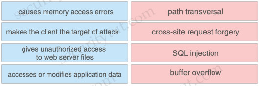

# Quiz Set 9


## 22. New SCOR Questions – Part 4

- <span style="color: #008888; font-weight: bold;">Question 1</span>

  Which function is performed by certificate authorities but is a limitation of registration authorities?

  A. CRL publishing<br>
  B. verifying user identity<br>
  C. certificate re-enrollment<br>
  D. accepts enrollment requests<br>

  <br>Answer: <br><br>


- <span style="color: #008888; font-weight: bold;">Question 2</span>

  Which encryption algorithm provides highly secure VPN communications?

  A. DES<br>
  B. 3DES<br>
  C. AES 256<br>
  D. AES 128<br>

  <br>Answer: <br><br>


- <span style="color: #008888; font-weight: bold;">Question 3</span>

  A hacker initiated a social engineering attack and stole username and passwords of some users within a company. Which product should be used as a solution to this problem?

  A. Cisco NGFW<br>
  B. Cisco AMP for Endpoints<br>
  C. Cisco Duo<br>
  D. Cisco AnyConnect<br>

  <br>Answer: <br><br>


- <span style="color: #008888; font-weight: bold;">Question 4</span>

  How does a WCCP-configured router identify if the Cisco WSA is functional?

  A. If an ICMP ping fails three consecutive times between a router and the WSA, traffic is no longer transmitted to the router.<br>
  B. If an ICMP ping fails three consecutive times between a router and the WSA, traffic is no longer transmitted to the WSA.<br>
  C. The router sends a Here-I-Am message every 10 seconds, and the WSA acknowledges with an I-See-You message.<br>
  D. The WSA sends a Here-I-Am message every 10 seconds, and the router acknowledges with an I-See-You message.<br>

  <br>Answer: <br><br>


- <span style="color: #008888; font-weight: bold;">Question 5</span>

  What is a feature of NetFlow Secure Event Logging?

  A. It exports only records that indicate significant events in a flow.<br>
  B. It supports v5 and v8 templates.<br>
  C. It filters NSEL events based on the traffic and event type through RSVP.<br>
  D. It delivers data records to NSEL collectors through NetFlow over TCP only.<br>

  <br>Answer: <br><br>


- <span style="color: #008888; font-weight: bold;">Question 6</span>

  An administrator needs to configure the Cisco ASA via ASDM such that the network management system can actively monitor the host using SNMPv3. Which two tasks must be performed for this configuration? (Choose two)

  A. Specify the SNMP manager and UDP port.<br>
  B. Specify a community string.<br>
  C. Add an SNMP USM entry.<br>
  D. Add an SNMP host access entry.<br>
  E. Specify an SNMP user group.<br>

  <br>Answer: <br><br>


- <span style="color: #008888; font-weight: bold;">Question 7</span>

  Which technology enables integration between Cisco ISE and other platforms to gather and share network and vulnerability data and SIEM and location information?

  A. pxGrid<br>
  B. SNMP<br>
  C. NetFlow<br>
  D. Cisco Talos<br>

  <br>Answer: <br><br>


- <span style="color: #008888; font-weight: bold;">Question 8</span>

  A large organization wants to deploy a security appliance in the public cloud to form a site-to-site VPN and link the public cloud environment to the private cloud in the headquarters data center. Which Cisco security appliance meets these requirements?

  A. Cisco Cloud Orchestrator<br>
  B. Cisco Stealthwatch Cloud<br>
  C. Cisco ASAv<br>
  D. Cisco WSAv<br>

  <br>Answer: <br><br>


- <span style="color: #008888; font-weight: bold;">Question 9</span>

  What is a benefit of using Cisco Tetration?

  A. It collects policy compliance data and process details.<br>
  B. It collects telemetry data from servers and then uses software sensors to analyze flow information.<br>
  C. It collects near-real time data from servers and inventories the software packages that exist on servers<br>
  D. It collects enforcement data from servers and collects interpacket variation.<br>

  <br>Answer: <br><br>


- <span style="color: #008888; font-weight: bold;">Question 10</span>

  Which standard is used to automate exchanging cyber threat information?

  A. IoC<br>
  B. TAXII<br>
  C. MITRE<br>
  D. STIX<br>

  <br>Answer: <br><br>


- <span style="color: #008888; font-weight: bold;">Question 11</span>

  Which security solution uses NetFlow to provide visibility across the network, data center, branch offices, and cloud?

  A. Cisco Encrypted Traffic Analytics<br>
  B. Cisco CTA<br>
  C. Cisco Umbrella<br>
  D. Cisco Stealthwatch<br>

  <br>Answer: <br><br>


- <span style="color: #008888; font-weight: bold;">Question 12</span>

  An email administrator is setting up a new Cisco ESA. The administrator wants to enable the blocking of greymail for the end user. Which feature must the administrator enable first?

  A. IP Reputation Filtering<br>
  B. Anti-Virus Filtering<br>
  C. File Analysis<br>
  D. Intelligent Multi-Scan<br>

  <br>Answer: <br><br>


- <span style="color: #008888; font-weight: bold;">Question 13</span>

  Drag and drop the exploits from the left onto the type of security vulnerability on the right.

  Group 1:<br>
  A. causes memory access errors<br>
  B. makes the client the target of attack<br>
  C. gives unauthorized access to web server files<br>
  D. accesses or modifies application data<br>

  Group 2: <br>
  1\. path transversal<br>
  2\. cross-site request forgery<br>
  3\. SQL injection<br>
  4\. buffer overflow<br>

  <br>Answer: <br><br>

  <!-- <figure style="margin: 0.5em; display: flex; justify-content: center; align-items: center;">
    
  </figure> -->


- <span style="color: #008888; font-weight: bold;">Question 14</span>

  Which technology provides the benefit of Layer 3 through Layer 7 innovative deep packet inspection, enabling the platform to identify and output various applications within the network traffic flows?

  A. Cisco ASAv<br>
  B. Cisco Prime Infrastructure<br>
  C. Cisco NBAR2<br>
  D. Account on Resolution<br>

  <br>Answer: <br><br>


- <span style="color: #008888; font-weight: bold;">Question 15</span>

  An organization must add new firewalls to its infrastructure and wants to use Cisco ASA or Cisco FTD. The chosen firewalls must provide methods of blocking traffic that include offering the user the option to bypass the block for certain sites after displaying a warning page and to reset the connection. Which solution should the organization choose?

  A. Cisco ASA because it has an additional module that can be installed to provide multiple blocking capabilities, whereas Cisco FTD does not.<br>
  B. Cisco FTD because it enables interactive blocking and blocking with reset natively, whereas Cisco ASA does not.<br>
  C. Cisco FTD because it supports system rate level traffic blocking, whereas Cisco ASA does not.<br>
  D. Cisco ASA because it allows for interactive blocking and blocking with reset to be configured via the GUI, whereas Cisco FTD does not.<br>

  <br>Answer: <br><br>


- <span style="color: #008888; font-weight: bold;">Question 16</span>

  An engineer is configuring web filtering for a network using Cisco Umbrella Secure Internet Gateway. The requirement is that all traffic needs to be filtered. Using the SSL decryption feature, which type of certificate should be presented to the end-user to accomplish this goal?

  A. third-party<br>
  B. SubCA<br>
  C. self-signed<br>
  D. organization owned root<br>

  <br>Answer: <br><br>


- <span style="color: #008888; font-weight: bold;">Question 17</span>

  Which two parameters are used to prevent a data breach in the cloud? (Choose two)

  A. encryption<br>
  B. complex cloud-based web proxies<br>
  C. strong user authentication<br>
  D. antispoofing programs<br>
  E. DLP solutions<br>

  <br>Answer: <br><br>


- <span style="color: #008888; font-weight: bold;">Question 18</span>

  What is the term for when an endpoint is associated to a provisioning WLAN that is shared with guest access, and the same guest portal is used as the BYOD portal?

  A. streamlined access<br>
  B. multichannel GUI<br>
  C. single-SSID BYOD<br>
  D. dual-SSID BYOD<br>

  <br>Answer: <br><br>


- <span style="color: #008888; font-weight: bold;">Question 19</span>

  What is the function of the `crypto isakmp key cisc414685095 address 192.168.50.1 255.255.255.255` command when establishing an IPsec VPN tunnel?

  A. It prevents 192.168.50.1 from connecting to the VPN server.<br>
  B. It defines that data destined to 192.168.50.1 is going to be encrypted.<br>
  C. It configures the pre-shared authentication key for host 192.168.50.1.<br>
  D. It configures the local address for the VPN server 192.168.50.1.<br>

  <br>Answer: <br><br>


- <span style="color: #008888; font-weight: bold;">Question 20</span>

  Which CLI command is used to enable URL filtering support for shortened URLs on the Cisco ESA?

  A. `outbreakconfig`<br>
  B. `websecurityadvancedconfig`<br>
  C. `webadvancedconfig`<br>
  D. `websecurityconfig`<br>

  <br>Answer: <br><br>


- <span style="color: #008888; font-weight: bold;">Question 21</span>

  Which Cisco ASA deployment model is used to filter traffic between hosts in the same IP subnet using higher-level protocols without readdressing the network?

  A. single context mode<br>
  B. routed mode<br>
  C. transparent mode<br>
  D. multiple context mode<br>

  <br>Answer: <br><br>


- <span style="color: #008888; font-weight: bold;">Question 22</span>

  Which open source tool does Cisco use to create graphical visualizations of network telemetry on Cisco IOS XE devices?

  A. SNMP<br>
  B. Splunk<br>
  C. Grafana<br>
  D. InfluxDB<br>

  <br>Answer: <br><br>


- <span style="color: #008888; font-weight: bold;">Question 23</span>

  Which Cisco DNA Center Intent API action is used to retrieve the number of devices known to a DNA Center?

  A. `GET https://fqdnOrlPofDnaCenterPlatform/dna/intent/api/v1/network-device/count`<br>
  B. `GET https://fqdnOrlPofDnaCenterPlatform/dna/intent/api/v1/network-device/startIndex/recordsToReturn`<br>
  C. `GET https://fqdnOrlPofDnaCenterPlatform/dna/intent/api/v1/network-device`<br>
  D. `GET https://fqdnOrlPofDnaCenterPlatform/dna/intent/api/v1/network-device?parameter1=value&parameter2=value&…`<br>

  <br>Answer: <br><br>


- <span style="color: #008888; font-weight: bold;">Question 24</span>

  When NetFlow is applied to an interface, which component creates the flow monitor cache that is used to collect traffic based on the key and nonkey fields in the configured record?

  A. flow sampler<br>
  B. flow exporter<br>
  C. records<br>
  D. flow monitor<br>

  <br>Answer: <br><br>


- <span style="color: #008888; font-weight: bold;">Question 25</span>

  Refer to the exhibit.

  ```text
  ASA# show service-policy sfr

  Global policy:
    Service-policy: global_policy
      Class-map: SFR
        SFR: card status Up, mode fail-open monitor-only
          packet input 0, packet output 44715478687, drop 0, reset-drop 0
  ```

  What are two indications of the Cisco Firepower Services Module configuration? (Choose two)

  A. The module is operating in IPS mode.<br>
  B. The module fails to receive redirected traffic.<br>
  C. Traffic is blocked if the module fails.<br>
  D. Traffic continues to flow if the module fails.<br>
  E. The module is operating in IDS mode.<br>

  <br>Answer: <br><br>


- <span style="color: #008888; font-weight: bold;">Question 26</span>

  Why is it important for the organization to have an endpoint patching strategy?

  A. so the organization can identify endpoint vulnerabilities<br>
  B. so the network administrator is notified when an existing bug is encountered<br>
  C. so the internal PSIRT organization is aware of the latest bugs<br>
  D. so the latest security fixes are installed on the endpoints<br>

  <br>Answer: <br><br>


- <span style="color: #008888; font-weight: bold;">Question 27</span>

  Which system is InfluxDB and Grafana be used on to pull the data and display the visualization information?

  A. Docker containers
  B. Windows Server 2019
  C. specialized Cisco Linux system
  D. Windows Server 2016

  <br>Answer: <br><br>


- <span style="color: #008888; font-weight: bold;">Question 28</span>

  Which Cisco ASA Platform mode disables the threat detection features except for Advanced Threat Statistics?

  A. routed<br>
  B. multiple context<br>
  C. cluster<br>
  D. transparent<br>

  <br>Answer: <br><br>


- <span style="color: #008888; font-weight: bold;">Question 29</span>

  Which two parameters are used for device compliance checks? (Choose two)

  A. device operating system version<br>
  B. DHCP snooping checks<br>
  C. Windows registry values<br>
  D. endpoint protection software version<br>
  E. DNS integrity checks<br>

  <br>Answer: <br><br>


- <span style="color: #008888; font-weight: bold;">Question 30</span>

  A network engineer entered the `snmp-server user asmith myv7 auth sha cisco priv aes 256 cisc0414685095` command and needs to send SNMP information to a host at `10.255.255.1`. Which command achieves this goal?

  A. `snmp-server host inside 10.255.255.1 version 3 asmith`<br>
  B. `snmp-server host inside 10.255.255.1 snmpv3 myv7`<br>
  C. `snmp-server host inside 10.255.255.1 snmpv3 asmith`<br>
  D. `snmp-server host inside 10.255.255.1 version 3 myv7`<br>

  <br>Answer: <br><br>


- <span style="color: #008888; font-weight: bold;">Question 31</span>

  An engineer is configuring Cisco WSA and needs to enable a separated email transfer flow from the Internet and from the LAN. Which deployment mode must be used to accomplish this goal?

  A. two-interface<br>
  B. single interface<br>
  C. multi-context<br>
  D. transparent<br>

  <br>Answer: <br><br>


- <span style="color: #008888; font-weight: bold;">Question 32</span>

  A small organization needs to reduce the VPN bandwidth load on their headend Cisco ASA in order to ensure that bandwidth is available for VPN users needing access to corporate resources on the `10.0.0.0/24` local HQ network. How is this accomplished without adding additional devices to the network?

  A. Configure VPN load balancing to send non-corporate traffic straight to the internet.<br>
  B. Use split tunneling to tunnel traffic for the `10.0.0.0/24` network only.<br>
  C. Configure VPN load balancing to distribute traffic for the `10.0.0.0/24` network.<br>
  D. Use split tunneling to tunnel all traffic except for the `10.0.0.0/24` network.<br>

  <br>Answer: <br><br>


- <span style="color: #008888; font-weight: bold;">Question 33</span>

  Which benefit does DMVPN provide over GETVPN?

  A. DMVPN can be used over the public Internet, and GETVPN requires a private network<br>
  B. DMVPN is a tunnel-less VPN, and GETVPN is tunnel-based.<br>
  C. DMVPN supports QoS, multicast, and routing, and GETVPN supports only QoS.<br>
  D. DMVPN supports non-IP protocols, and GETVPN supports only IP protocols.<br>

  <br>Answer: <br><br>


- <span style="color: #008888; font-weight: bold;">Question 34</span>

  Which system facilitates deploying microsegmentation and multi-tenancy services with a policy-based container?

  A. Docker<br>
  B. SDLC<br>
  C. Lambda<br>
  D. Contiv<br>

  <br>Answer: <br><br>


- <span style="color: #008888; font-weight: bold;">Question 35</span>

  An engineer needs to configure an access control policy rule to always send traffic for inspection without using the default action. Which action should be configured for this rule?

  A. monitor<br>
  B. allow<br>
  C. trust<br>
  D. block<br>

  <br>Answer: <br><br>


- <span style="color: #008888; font-weight: bold;">Question 36</span>

  Which two functions does the Cisco Advanced Phishing Protection solution perform in trying to protect from phishing attacks? (Choose two)

  A. uses a static algorithm to determine malicious<br>
  B. determines if the email messages are malicious<br>
  C. does a real-time user web browsing behavior analysis<br>
  D. blocks malicious websites and adds them to a block list<br>
  E. provides a defense for on-premises email deployments<br>


  <br>Answer: <br><br>


- <span style="color: #008888; font-weight: bold;">Question 37</span>

  What are two things to consider when using PAC files with the Cisco WSA? (Choose two)

  A. If the WSA host port is changed, the default port redirects web traffic to the correct port automatically<br>
  B. The WSA hosts PAC files on port 6001 by default.<br>
  C. PAC files use if-else statements to determine whether to use a proxy or a direct connection for traffic between the PC and the host.<br>
  D. By default, they direct traffic through a proxy when the PC and the host are on the same subnet<br>
  E. The WSA hosts PAC files on port 9001 by default.<br>

  <br>Answer: <br><br>


- <span style="color: #008888; font-weight: bold;">Question 38</span>

  When implementing transparent user identification for single sign-on with Internet Explorer, how is the redirect hostname configured?

  A. as an IP address<br>
  B. as a FQDN<br>
  C. as a distinguished name<br>
  D. as a short host name<br>

  <br>Answer: <br><br>

