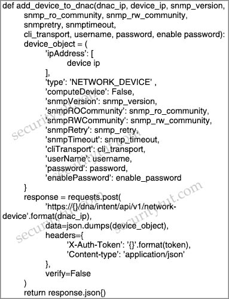
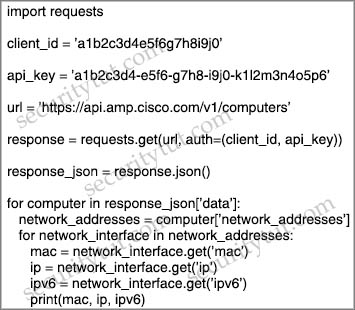
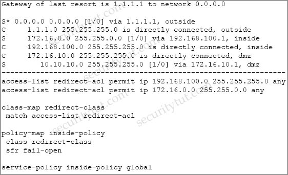
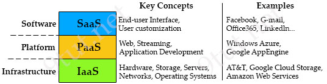

# Quiz Set 2


## 05. Python & API

- <span style="color: blue; font-weight: bold;">Question 1</span>

  Which API is used for Content Security?

  A. NX-OS API<br>
  B. IOS XR API<br>
  C. OpenVuln API<br>
  D. AsyncOS API<br>

  Answer: D


- <span style="color: blue; font-weight: bold;">Question 2</span>

  Which two request of REST API are valid on the Cisco ASA Platform? (Choose two)

  A. put<br>
  B. options<br>
  C. get<br>
  D. push<br>
  E. connect<br>

  Answer: A C

  Explanation

  The ASA REST API gives you programmatic access to managing individual ASAs through a Representational State Transfer (REST) API. The API allows external clients to perform CRUD (Create, Read, Update, Delete) operations on ASA resources; it is based on the HTTPS protocol and REST methodology.
  All API requests are sent over HTTPS to the ASA, and a response is returned.

  Request Structure

  Available request methods are:
  GET – Retrieves data from the specified object.
  PUT – Adds the supplied information to the specified object; returns a 404 Resource Not Found error if the object does not exist.
  POST – Creates the object with the supplied information.
  DELETE – Deletes the specified object.
  PATCH – Applies partial modifications to the specified object.

  Reference: https://www.cisco.com/c/en/us/td/docs/security/asa/api/qsg-asa-api.html


- <span style="color: blue; font-weight: bold;">Question 3</span>

  Refer to the exhibit.

  <figure style="margin: 0.5em; display: flex; justify-content: center; align-items: center;">
    
  </figure>

  What is the result of this Python script of the Cisco DNA Center API?

  A. adds authentication to a switch
  B. adds a switch to Cisco DNA Center
  C. receives information about a switch

  Answer: B


- <span style="color: blue; font-weight: bold;">Question 4</span>

  Refer to the exhibit.

  <figure style="margin: 0.5em; display: flex; justify-content: center; align-items: center;">
    
  </figure>

  What does the API do when connected to a Cisco security appliance?

  A. get the process and PID information from the computers in the network
  B. create an SNMP pull mechanism for managing AMP
  C. gather network telemetry information from AMP for endpoints
  D. gather the network interface information about the computers AMP sees

  Answer: D

  Explanation

  The call to API of “https://api.amp.cisco.com/v1/computers” allows us to fetch list of computers across your organization that Advanced Malware Protection (AMP) sees.

  Reference: https://api-docs.amp.cisco.com/api_actions/details?api_action=GET+%2Fv1%2Fcomputers&api_host=api.apjc.amp.cisco.com&api_resource=Computer&api_version=v1


## 06. Firewall & Intrusion Prevention

- <span style="color: blue; font-weight: bold;">Question 1</span>

  Which feature requires a network discovery policy on the Cisco Firepower Next Generation Intrusion Prevention System?

  A. Security Intelligence<br>
  B. Impact Flags<br>
  C. Health Monitoring<br>
  D. URL Filtering<br>

  Answer: B


- <span style="color: blue; font-weight: bold;">Question 2</span>

  Which two deployment model configurations are supported for Cisco FTDv in AWS? (Choose two)

  A. Cisco FTDv configured in routed mode and managed by an FMCv installed in AWS<br>
  B. Cisco FTDv with one management interface and two traffic interfaces configured<br>
  C. Cisco FTDv configured in routed mode and managed by a physical FMC appliance on premises<br>
  D. Cisco FTDv with two management interfaces and one traffic interface configured<br>
  E. Cisco FTDv configured in routed mode and IPv6 configured<br>

  Answer: A C


- <span style="color: blue; font-weight: bold;">Question 3</span>

  Which option is the main function of Cisco Firepower impact flags?

  A. They alert administrators when critical events occur.<br>
  B. They highlight known and suspected malicious IP addresses in reports.<br>
  C. They correlate data about intrusions and vulnerability.<br>
  D. They identify data that the ASA sends to the Firepower module.<br>

  Answer: C


- <span style="color: blue; font-weight: bold;">Question 4</span>

  On Cisco Firepower Management Center, which policy is used to collect health modules alerts from managed devices?

  A. health policy<br>
  B. system policy<br>
  C. correlation policy<br>
  D. access control policy<br>
  E. health awareness policy<br>

  Answer: A


- <span style="color: blue; font-weight: bold;">Question 5</span>

  Which license is required for Cisco Security Intelligence to work on the Cisco Next Generation Intrusion Prevention System?

  A. control<br>
  B. malware<br>
  C. URL filtering<br>
  D. protect<br>

  Answer: D


- <span style="color: blue; font-weight: bold;">Question 6</span>

  Which two are valid suppression types on a Cisco Next Generation Intrusion Prevention System? (Choose two)

  A. Port<br>
  B. Rule<br>
  C. Source<br>
  D. Application<br>
  E. Protocol<br>

  Answer: B C


- <span style="color: blue; font-weight: bold;">Question 7</span>

  Which feature is configured for managed devices in the device platform settings of the Firepower Management Center?

  A. quality of service<br>
  B. time synchronization<br>
  C. network address translations<br>
  D. intrusion policy<br>

  Answer: B


- <span style="color: blue; font-weight: bold;">Question 8</span>

  Which information is required when adding a device to Firepower Management Center?

  A. username and password<br>
  B. encryption method<br>
  C. device serial number<br>
  D. registration key<br>

  Answer: D


- <span style="color: blue; font-weight: bold;">Question 9</span>

  Which two deployment modes does the Cisco ASA FirePower module support? (Choose two)

  A. transparent mode<br>
  B. routed mode<br>
  C. inline mode<br>
  D. active mode<br>
  E. passive monitor-only mode<br>

  Answer: C E

  Explanation

  You can configure your ASA FirePOWER module using one of the following deployment models:

  You can configure your ASA FirePOWER module in either an inline or a monitor-only (inline tap or passive) deployment.

  Reference: https://www.cisco.com/c/en/us/td/docs/security/asa/asa92/asdm72/firewall/asa-firewall-asdm/modules-sfr.html


- <span style="color: blue; font-weight: bold;">Question 10</span>

  The Cisco ASA must support TLS proxy for encrypted Cisco Unified Communications traffic. Where must the ASA be added on the Cisco UC Manager platform?

  A. Certificate Trust List<br>
  B. Endpoint Trust List<br>
  C. Enterprise Proxy Service<br>
  D. Secured Collaboration Proxy<br>

  Answer: A


- <span style="color: blue; font-weight: bold;">Question 11</span>

  Which statement about the configuration of Cisco ASA NetFlow v9 Secure Event Logging is true?

  A. To view bandwidth usage for NetFlow records, the QoS feature must be enabled.<br>
  B. A sysopt command can be used to enable NSEL on a specific interface.<br>
  C. NSEL can be used without a collector configured.<br>
  D. A flow-export event type must be defined under a policy.<br>

  Answer: D


- <span style="color: blue; font-weight: bold;">Question 12</span>

  Which feature is supported when deploying Cisco ASAv within AWS public cloud?

  A. multiple context mode<br>
  B. user deployment of Layer 3 networks<br>
  C. IPv6<br>
  D. clustering<br>

  Answer: B

  Explanation

  The ASAv on AWS supports the following features:
  - Support for Amazon EC2 C5 instances, the next generation of the Amazon EC2 Compute Optimized instance family.
  - Deployment in the Virtual Private Cloud (VPC)
  - Enhanced networking (SR-IOV) where available
  - Deployment from Amazon Marketplace
  - Maximum of four vCPUs per instance
  - User deployment of L3 networks
  - Routed mode (default)

  Note: The Cisco Adaptive Security Virtual Appliance (ASAv) runs the same software as physical Cisco ASAs to deliver proven security functionality in a virtual form factor. The ASAv can be deployed in the public AWS cloud. It can then be configured to protect virtual and physical data center workloads that expand, contract, or shift their location over time.

  Reference: https://www.cisco.com/c/en/us/td/docs/security/asa/asa96/asav/quick-start-book/asav-96-qsg/asav-aws.html


- <span style="color: blue; font-weight: bold;">Question 13</span>

  Which statement describes a traffic profile on a Cisco Next Generation Intrusion Prevention System?

  A. It allows traffic if it does not meet the profile.<br>
  B. It defines a traffic baseline for traffic anomaly deduction.<br>
  C. It inspects hosts that meet the profile with more intrusion rules.<br>
  D. It blocks traffic if it does not meet the profile.<br>

  Answer: B


- <span style="color: blue; font-weight: bold;">Question 14</span>

  Which statement about IOS zone-based firewalls is true?

  A. An unassigned interface can communicate with assigned interfaces<br>
  B. Only one interface can be assigned to a zone.<br>
  C. An interface can be assigned to multiple zones.<br>
  D. An interface can be assigned only to one zone.<br>

  Answer: D


- <span style="color: blue; font-weight: bold;">Question 15</span>

  What is a characteristic of Cisco ASA Netflow v9 Secure Event Logging?

  A. It tracks flow-create, flow-teardown, and flow-denied events.<br>
  B. It provides stateless IP flow tracking that exports all records of a specific flow.<br>
  C. It tracks the flow continuously and provides updates every 10 seconds.<br>
  D. Its events match all traffic classes in parallel.<br>

  Answer: A

  Explanation

  The ASA and ASASM implementations of NetFlow Secure Event Logging (NSEL) provide a stateful, IP flow tracking method that exports only those records that indicate significant events in a flow.

  The significant events that are tracked include flow-create, flow-teardown, and flow-denied (excluding those flows that are denied by EtherType ACLs).

  Reference: https://www.cisco.com/c/en/us/td/docs/security/asa/asa92/configuration/general/asa-general-cli/monitor-nsel.html


- <span style="color: blue; font-weight: bold;">Question 16</span>

  Which CLI command is used to register a Cisco FirePower sensor to Firepower Management Center?

  A. configure system add `<host><key>`<br>
  B. configure manager `<key>` add host<br>
  C. configure manager delete<br>
  D. configure manager add `<host><key>`<br>

  Answer: D


- <span style="color: blue; font-weight: bold;">Question 17</span>

  Which policy is used to capture host information on the Cisco Firepower Next Generation Intrusion Prevention System?

  A. Correlation<br>
  B. Intrusion<br>
  C. Access Control<br>
  D. Network Discovery<br>

  Answer: D

  Explanation

  The Firepower System uses network discovery and identity policies to collect host, application, and user data for traffic on your network. You can use certain types of discovery and identity data to build a comprehensive map of your network assets, perform forensic analysis, behavioral profiling, access control, and mitigate and respond to the vulnerabilities and exploits to which your organization is susceptible.

  You can configure your network discovery policy to perform host and application detection.

  Reference: https://www.cisco.com/c/en/us/td/docs/security/firepower/640/configuration/guide/fpmc-config-guide-v64/introduction_to_network_discovery_and_identity.html


- <span style="color: blue; font-weight: bold;">Question 18</span>

  Which ASA deployment mode can provide separation of management on a shared appliance?

  A. DMZ multiple zone mode<br>
  B. transparent firewall mode<br>
  C. multiple context mode<br>
  D. routed mode<br>

  Answer: C


- <span style="color: blue; font-weight: bold;">Question 19</span>

  Refer to the exhibit. What is a result of the configuration?

  <figure style="margin: 0.5em; display: flex; justify-content: center; align-items: center;">
    
  </figure>

  A. Traffic from the DMZ network is redirected<br>
  B. Traffic from the inside network is redirected<br>
  C. All TCP traffic is redirected<br>
  D. Traffic from the inside and DMZ networks is redirected<br>

  Answer: D

  Explanation

  The purpose of above commands is to redirect traffic that matches the ACL “redirect-acl” to the Cisco FirePOWER (SFR) module in the inline (normal) mode. In this mode, after the undesired traffic is dropped and any other actions that are applied by policy are performed, the traffic is returned to the ASA for further processing and ultimate transmission.

  The command “service-policy global_policy global” applies the policy to all of the interfaces.

  Reference: https://www.cisco.com/c/en/us/support/docs/security/asa-firepower-services/118644-configure-firepower-00.html


- <span style="color: blue; font-weight: bold;">Question 20</span>

  Which policy represents a shared set of features or parameters that define the aspects of a managed device that are likely to be similar to other managed devices in a deployment?

  A. Group Policy<br>
  B. Access Control Policy<br>
  C. Device Management Policy<br>
  D. Platform Service Policy<br>

  Answer: D

  Explanation

  Cisco Firepower deployments can take advantage of platform settings policies. A platform settings policy is a shared set of features or parameters that define the aspects of a managed device that are likely to be similar to other managed devices in your deployment, such as time settings and external authentication. Examples of these platform settings policies are time and date settings, external authentication, and other common administrative features.

  A shared policy makes it possible to configure multiple managed devices at once, which provides consistency in your deployment and streamlines your management efforts. Any changes to a platform settings policy affects all the managed devices where you applied the policy. Even if you want different settings per device, you must create a shared policy and apply it to the desired device.

  For example, your organization’s security policies may require that your appliances have a “No Unauthorized Use” message when a user logs in. With platform settings, you can set the login banner once in a platform settings policy.

  Reference: https://www.cisco.com/c/en/us/td/docs/security/firepower/620/configuration/guide/fpmc-config-guide-v62/platform_settings_policies_for_managed_devices.html

  Therefore the answer should be “Platform Settings Policy”, not “Platform Service Policy” but it is the best answer here so we have to choose it.


- <span style="color: blue; font-weight: bold;">Question 21</span>

  Which two tasks allow NetFlow on a Cisco ASA 5500 Series firewall? (Choose two)

  A. Enable NetFlow Version 9.<br>
  B. Create an ACL to allow UDP traffic on port 9996.<br>
  C. Apply NetFlow Exporter to the outside interface in the inbound direction.<br>
  D. Create a class map to match interesting traffic.<br>
  E. Define a NetFlow collector by using the flow-export command.<br>

  Answer: D E

  Explanation

  In order to configure NetFlow on Cisco ASA 5500 Series firewall, we need the following minimum steps:

  - 1\. Configuring NSEL Collectors:
    flow-export destination interface-name ipv4-address | hostname udp-port
    For example: hostname (config)# flow-export destination inside 209.165.200.225 2002

    The destination keyword indicates that a NSEL collector is being configured. The interface-name argument is the name of the ASA and ASA Services Module interface through which the collector is reached. The ipv4-address argument is the IP address of the machine running the collector application. The hostname argument is the destination IP address or name of the collector. The udp-port argument is the UDP port number to which NetFlow packets are sent.

    (-> Therefore we only need to let the firewall know the IP address that the NetFlow “Collector” will be running on. We don’t need to apply the NetFlow Exporter to any interface -> Answer C is not correct)

  - 2\. Defines the class map that identifies traffic for which NSEL events need to be exported.
  - 3\. Defines the policy map to apply flow-export actions to the defined classes.
  - 4\. Adds or edits the service policy globally.

  An example of configuring NetFlow is shown below (using minimum configuration):

  ```text
  ASA(config)# flow-export destination inside 10.254.254.234 2055
  // Note: “inside” is the interface name of ASA through which the collector is reached
  ASA(config)# policy-map global_policy
  ASA(config-pmap)# class class-default
  ASA(config-pmap-c)# flow-export event-type all destination 10.254.254.234
  ASA(config)# service-policy global_policy global
  ```


- <span style="color: blue; font-weight: bold;">Question 22</span>

  A mall provides security services to customers with a shared appliance. The mall wants separation of management on the shared appliance. Which ASA deployment mode meets these needs?

  A. routed mode<br>
  B. transparent mode<br>
  C. multiple context mode<br>
  D. multiple zone mode<br>

  Answer: C


- <span style="color: blue; font-weight: bold;">Question 23</span>

  What is a characteristic of Firepower NGIPS inline deployment mode?

  A. ASA with Firepower module cannot be deployed.<br>
  B. It cannot take actions such as blocking traffic.<br>
  C. It is out-of-band from traffic.<br>
  D. It must have inline interface pairs configured.<br>

  Answer: D


- <span style="color: blue; font-weight: bold;">Question 24</span>

  An engineer wants to generate NetFlow records on traffic traversing the Cisco ASA. Which Cisco ASA command must be used?

  A. `flow-export destination inside 1.1.1.1 2055`<br>
  B. `ip flow monitor input`<br>
  C. `ip flow-export destination 1.1.1.1 2055`<br>
  D. `flow exporter`<br>

  Answer: A

  Explanation

  The syntax of this command is: flow-export destination interface-name ipv4-address | hostname udp-port

  This command is used on Cisco ASA to configure Network Secure Event Logging (NSEL) collector to which NetFlow packets are sent. The destination keyword indicates that a NSEL collector is being configured.

  - The interface-name argument is the name of the ASA and ASA Services Module interface through which the collector is reached.
  - The ipv4-address argument is the IP address of the machine running the collector application.
  - The hostname argument is the destination IP address or name of the collector.
  - The udp-port argument is the UDP port number to which NetFlow packets are sent.

  You can configure a maximum of five collectors. After a collector is configured, template records are automatically sent to all configured NSEL collectors.

  Reference: https://www.cisco.com/c/en/us/td/docs/security/asa/asa84/configuration/guide/asa_84_cli_config/monitor_nsel.html


- <span style="color: blue; font-weight: bold;">Question 25</span>

  How many interfaces per bridge group does an ASA bridge group deployment support?

  A. up to 2<br>
  B. up to 4<br>
  C. up to 8<br>
  D. up to 16<br>

  Answer: B

  Explanation

  Each of the ASAs interfaces need to be grouped into one or more bridge groups. Each of these groups acts as an independent transparent firewall. It is not possible for one bridge group to communicate with another bridge group without assistance from an external router.

  As of 8.4(1) upto 8 bridge groups are supported with 2-4 interface in each group. Prior to this only one bridge group was supported and only 2 interfaces.

  Up to 4 interfaces are permitted per bridge–group (inside, outside, DMZ1, DMZ2)


- <span style="color: blue; font-weight: bold;">Question 26</span>

  Which two application layer preprocessors are used by Firepower Next Generation Intrusion Prevention System? (Choose two)

  A. packet decoder<br>
  B. SIP<br>
  C. modbus<br>
  D. inline normalization<br>
  E. SSL<br>

  Answer: B E

  Explanation

  Application layer protocols can represent the same data in a variety of ways. The Firepower System provides application layer protocol decoders that normalize specific types of packet data into formats that the intrusion rules engine can analyze. Normalizing application-layer protocol encodings allows the rules engine to effectively apply the same content-related rules to packets whose data is represented differently and obtain meaningful results.

  Reference: https://www.cisco.com/c/en/us/td/docs/security/firepower/60/configuration/guide/fpmc-config-guide-v60/Application_Layer_Preprocessors.html#ID-2244-0000080c

  FirePower uses many preprocessors, including DNS, FTP/Telnet, SIP, SSL, SMTP, SSH preprocessors.


## 07. Email & Web

<span style="color: blue; font-weight: bold;">Quick summary</span>

Cisco Email Security includes advanced threat protection capabilities to detect, block, and remediate threats faster; prevent data loss; and secure important information in transit with end-to-end encryption.

With Cisco Email Security customers can:
- Detect and block more threats with superior threat intelligence from Talos.
- Combat ransomware hidden in attachments that evade initial detection with Cisco Advanced Malware Protection (AMP) and Cisco Threat Grid.
- Drop emails with risky links automatically or block access to newly infected sites with real-time URL analysis to protect against phishing and BEC.
- Prevent brand abuse and sophisticated identity-based email attacks with Cisco Domain Protection (CDP) and Cisco Advanced Phishing Protection (CAPP) services.
- Protect sensitive content in outgoing emails with Data Loss Prevention (DLP) and easy-to-use email encryption, all in one solution.
- Provide user behavior training with Cisco Security Awareness to help users work smarter and safer.
- Gain maximum deployment flexibility with a cloud, virtual, on-premises, or hybrid deployment or move to the cloud in phases.


- <span style="color: blue; font-weight: bold;">Question 1</span>

  Which two features of Cisco Email Security can protect your organization against email threats? (Choose two)

  A. Time-based one-time passwords<br>
  B. Data loss prevention<br>
  C. Heuristic-based filtering<br>
  D. Geolocation-based filtering<br>
  E. NetFlow<br>

  Answer: B D

  Explanation

  Protect sensitive content in outgoing emails with Data Loss Prevention (DLP) and easy-to-use email encryption, all in one solution.

  Cisco Email Security appliance can now handle incoming mail connections and incoming messages from specific geolocations and perform appropriate actions on them, for example:
  – Prevent email threats coming from specific geographic regions.
  – Allow or disallow emails coming from specific geographic regions.

  Reference: https://www.cisco.com/c/en/us/td/docs/security/esa/esa11-0/user_guide_fs/b_ESA_Admin_Guide_11_0/b_ESA_Admin_Guide_chapter_00.html


- <span style="color: blue; font-weight: bold;">Question 2</span>

  Why would a user choose an on-premises ESA versus the CES solution?

  A. Sensitive data must remain onsite.>br>
  B. Demand is unpredictable.>br>
  C. The server team wants to outsource this service.>br>
  D. ESA is deployed inline.>br>

  Answer: A


- <span style="color: blue; font-weight: bold;">Question 3</span>

  Which two features are used to configure Cisco ESA with a multilayer approach to fight viruses and malware? (Choose two)

  A. Sophos engine<br>
  B. white list<br>
  C. RAT<br>
  D. outbreak filters<br>
  E. DLP<br>

  Answer: A D


- <span style="color: blue; font-weight: bold;">Question 4</span>

  What is the purpose of the Decrypt for Application Detection feature within the WSA Decryption options?

  A. It decrypts HTTPS application traffic for unauthenticated users.<br>
  B. It alerts users when the WSA decrypts their traffic.<br>
  C. It decrypts HTTPS application traffic for authenticated users.<br>
  D. It provides enhanced HTTPS application detection for AsyncOS.<br>

  Answer: D


- <span style="color: blue; font-weight: bold;">Question 5</span>

  Which two statements about a Cisco WSA configured in Transparent mode are true? (Choose two)

  A. It can handle explicit HTTP requests.<br>
  B. It requires a PAC file for the client web browser.<br>
  C. It requires a proxy for the client web browser.<br>
  D. WCCP v2-enabled devices can automatically redirect traffic destined to port 80.<br>
  E. Layer 4 switches can automatically redirect traffic destined to port 80.<br>

  Answer: D E


- <span style="color: blue; font-weight: bold;">Question 6</span>

  Which action controls the amount of URI text that is stored in Cisco WSA logs files?

  A. Configure the datasecurityconfig command<br>
  B. Configure the advancedproxyconfig command with the HTTPS subcommand<br>
  C. Configure a small log-entry size.<br>
  D. Configure a maximum packet size.<br>

  Answer: B


- <span style="color: blue; font-weight: bold;">Question 7</span>

  An engineer is configuring a Cisco ESA and wants to control whether to accept or reject email messages to a recipient address. Which list contains the allowed recipient addresses?

  A. SAT<br>
  B. BAT<br>
  C. HAT<br>
  D. RAT<br>

  Answer: D


- <span style="color: blue; font-weight: bold;">Question 8</span>

  Which two services must remain as on-premises equipment when a hybrid email solution is deployed? (Choose two)

  A. DDoS<br>
  B. antispam<br>
  C. antivirus<br>
  D. encryption<br>
  E. DLP<br>

  Answer: D E

  Explanation

  Cisco Hybrid Email Security is a unique service offering that combines a cloud-based email security deployment with an appliance-based email security deployment (on premises) to provide maximum choice and control for your organization. The cloud-based infrastructure is typically used for inbound email cleansing, while the on-premises appliances provide granular control – protecting sensitive information with data loss prevention (DLP) and encryption technologies.

  Reference: https://www.cisco.com/c/dam/en/us/td/docs/security/ces/overview_guide/Cisco_Cloud_Hybrid_Email_Security_Overview_Guide.pdf


- <span style="color: blue; font-weight: bold;">Question 9</span>

  Which Talos reputation center allows you to track the reputation of IP addresses for email and web traffic?

  A. IP Blacklist Center<br>
  B. File Reputation Center<br>
  C. AMP Reputation Center<br>
  D. IP and Domain Reputation Center<br>

  Answer: D

  Explanation

  Talos’ IP and Domain Data Center is the world’s most comprehensive real-time threat detection network. The data is made up of daily security intelligence across millions of deployed web, email, firewall and IPS appliances. Talos detects and correlates threats in real time using the largest threat detection network in the world spanning web requests, emails, malware samples, open-source data sets, endpoint intelligence, and network intrusions. The Email and Web Traffic Reputation Center is able to transform some of Talos’ data into actionable threat intelligence and tools to improve your security posture.


- <span style="color: blue; font-weight: bold;">Question 10</span>

  Which proxy mode must be used on Cisco WSA to redirect TCP traffic with WCCP?

  A. transparent<br>
  B. redirection<br>
  C. forward<br>
  D. proxy gateway<br>

  Answer: A

  Explanation

  There are two possible methods to accomplish the redirection of traffic to Cisco WSA: transparent proxy mode and explicit proxy mode.

  In a transparent proxy deployment, a WCCP v2-capable network device redirects all TCP traffic with a destination of port 80 or 443 to Cisco WSA, without any configuration on the client. The transparent proxy deployment is used in this design, and the Cisco ASA firewall is used to redirect traffic to the appliance because all of the outbound web traffic passes through the device and is generally managed by the same operations staff who manage Cisco WSA.

  Reference: https://www.cisco.com/c/dam/en/us/td/docs/solutions/CVD/Aug2013/CVD-WebSecurityUsingCiscoWSADesignGuide-AUG13.pdf


- <span style="color: blue; font-weight: bold;">Question 11</span>

  After deploying a Cisco ESA on your network, you notice that some messages fail to reach their destinations. Which task can you perform to determine where each message was lost?

  A. Configure the trackingconfig command to enable message tracking.<br>
  B. Generate a system report.<br>
  C. Review the log files.<br>
  D. Perform a trace.<br>

  Answer: A

  Explanation

  Message tracking helps resolve help desk calls by giving a detailed view of message flow. For example, if a message was not delivered as expected, you can determine if it was found to contain a virus or placed in a spam quarantine — or if it is located somewhere else in the mail stream.

  Reference: https://www.cisco.com/c/en/us/td/docs/security/esa/esa12-0/user_guide/b_ESA_Admin_Guide_12_0/b_ESA_Admin_Guide_12_0_chapter_011110.html


- <span style="color: blue; font-weight: bold;">Question 12</span>

  What is the primary benefit of deploying an ESA in hybrid mode?

  A. You can fine-tune its settings to provide the optimum balance between security and performance for your environment<br>
  B. It provides the lowest total cost of ownership by reducing the need for physical appliances<br>
  C. It provides maximum protection and control of outbound messages<br>
  D. It provides email security while supporting the transition to the cloud<br>

  Answer: D

  Explanation

  Cisco Hybrid Email Security is a unique service offering that facilitates the deployment of your email security infrastructure both on premises and in the cloud. You can change the number of on-premises versus cloud users at any time throughout the term of your contract, assuming the total number of users does not change. This allows for deployment flexibility as your organization’s needs change.


- <span style="color: blue; font-weight: bold;">Question 13</span>

  What is the primary role of the Cisco Email Security Appliance?

  A. Mail Submission Agent<br>
  B. Mail Transfer Agent<br>
  C. Mail Delivery Agent<br>
  D. Mail User Agent<br>

  Answer: B

  Explanation

  Cisco Email Security Appliance (ESA) protects the email infrastructure and employees who use email at work by filtering unsolicited and malicious email before it reaches the user. Cisco ESA easily integrates into existing email infrastructures with a high degree of flexibility. It does this by acting as a Mail Transfer Agent (MTA) within the email-delivery chain. Another name for an MTA is a mail relay.

  Reference: https://www.cisco.com/c/dam/en/us/td/docs/solutions/SBA/February2013/Cisco_SBA_BN_EmailSecurityUsingCiscoESADeploymentGuide-Feb2013.pdf


- <span style="color: blue; font-weight: bold;">Question 14</span>

  Which technology is used to improve web traffic performance by proxy caching?

  A. WSA<br>
  B. Firepower<br>
  C. FireSIGHT<br>
  D. ASA<br>

  Answer: A


- <span style="color: blue; font-weight: bold;">Question 15</span>

  In which two ways does a system administrator send web traffic transparently to the Web Security Appliance? (Choose two)

  A. configure Active Directory Group Policies to push proxy settings<br>
  B. configure policy-based routing on the network infrastructure<br>
  C. reference a Proxy Auto Config file<br>
  D. configure the proxy IP address in the web-browser settings<br>
  E. use Web Cache Communication Protocol<br>

  Answer: B E


## 08. Cloud Security

<span style="color: blue; font-weight: bold;">Cloud Quick Summary</span>

<span style="color: blue;">Types of clouds</span>

There are 4 types of cloud:

- Private Cloud: cloud that is dedicated solely to one organization. Advantages of Private Clouds are high security, Regulatory compliance, Flexibility to respond to changing needs. Drawbacks of private cloud are cost, mobile difficulty,
- Public Cloud: cloud that is delivered via the Internet and shared across organizations. Examples of public clouds are Amazon Web Services, Microsoft Azure, and Google Cloud Platform. Advantages of public cloud are lower costs, Freedom from maintenance. Drawbacks of public cloud are Lack of security, minimal technical control
- Hyrid Cloud: any environment that uses both public and private clouds. Confidential operations like financial reporting, for example, can be run on a private cloud. High-volume, less sensitive workloads like web-based email – or even temporary workloads such as development and test – can run on a public cloud.
- Community Cloud: a recent variation on the private cloud model that can be only accessible by group of organizations. It shares the infrastructure between several organizations from a specific community. It may be managed internally by organizations or by the third-party.

<span style="color: blue;">Cloud services</span>

There are 3 main types of as-a-Service solutions: SaaS, PaaS and IaaS

- SaaS (Software as a Service): SaaS uses the web to deliver applications that are managed by a third-party vendor and whose interface is accessed on the clients’ side. Most SaaS applications can be run directly from a web browser without any downloads or installations required, although some require plugins.
- PaaS (Platform as a Service): are used for applications, and other development, while providing cloud components to software. What developers gain with PaaS is a framework they can build upon to develop or customize applications. PaaS makes the development, testing, and deployment of applications quick, simple, and cost-effective. With this technology, enterprise operations, or a third-party provider, can manage OSes, virtualization, servers, storage, networking, and the PaaS software itself. Developers, however, manage the applications. PaaS provides everything except applications.
- IaaS (Infrastructure as a Service): self-service models for accessing, monitoring, and managing remote datacenter infrastructures, such as compute (virtualized or bare metal), storage, networking, and networking services (e.g. firewalls). Instead of having to purchase hardware outright, users can purchase IaaS based on consumption, similar to electricity or other utility billing.

<figure style="margin: 0.5em; display: flex; justify-content: center; align-items: center;">
  
</figure>


- <span style="color: blue; font-weight: bold;">Question 1</span>

  Which technology reduces data loss by identifying sensitive information stored in public computing environments?

  A. Cisco SDA<br>
  B. Cisco Firepower<br>
  C. Cisco HyperFlex<br>
  D. Cisco Cloudlock<br>

  Answer: D


- <span style="color: blue; font-weight: bold;">Question 2</span>

  Which deployment model is the most secure when considering risks to cloud adoption?

  A. Public Cloud<br>
  B. Hybrid Cloud<br>
  C. Community Cloud<br>
  D. Private Cloud<br>

  Answer: D


- <span style="color: blue; font-weight: bold;">Question 3</span>

  In which cloud services model is the tenant responsible for virtual machine OS patching?

  A. IaaS<br>
  B. UCaaS<br>
  C. PaaS<br>
  D. SaaS<br>

  Answer: A

  Explanation

  Only in On-site (on-premises) and IaaS we (tenant) manage O/S (Operating System).

  <figure style="margin: 0.5em; display: flex; justify-content: center; align-items: center;">
    
  </figure>


- <span style="color: blue; font-weight: bold;">Question 4</span>

  Which cloud service model offers an environment for cloud consumers to develop and deploy applications without needing to manage or maintain the underlying cloud infrastructure?

  A. PaaS<br>
  B. XaaS<br>
  C. IaaS<br>
  D. SaaS<br>

  Answer: A

  Explanation

  Cloud computing can be broken into the following three basic models:

  - Infrastructure as a Service (IaaS): IaaS describes a cloud solution where you are renting infrastructure. You purchase virtual power to execute your software as needed. This is much like running a virtual server on your own equipment, except you are now running a virtual server on a virtual disk. This model is similar to a utility company model because you pay for what you use.
  - Platform as a Service (PaaS): PaaS provides everything except applications. Services provided by this model include all phases of the system development life cycle (SDLC) and can use application programming interfaces (APIs), website portals, or gateway software. These solutions tend to be proprietary, which can cause problems if the customer moves away from the provider’s platform.
  - Software as a Service (SaaS): SaaS is designed to provide a complete packaged solution. The software is rented out to the user. The service is usually provided through some type of front end or web portal. While the end user is free to use the service from anywhere, the company pays a peruse fee.

  Reference: CCNP and CCIE Security Core SCOR 350-701 Official Cert Guide


- <span style="color: blue; font-weight: bold;">Question 5</span>

  What does the Cloudlock Apps Firewall do to mitigate security concerns from an application perspective?

  A. It allows the administrator to quarantine malicious files so that the application can function, just not maliciously.<br>
  B. It discovers and controls cloud apps that are connected to a company’s corporate environment.<br>
  C. It deletes any application that does not belong in the network.<br>
  D. It sends the application information to an administrator to act on.<br>

  Answer: B


- <span style="color: blue; font-weight: bold;">Question 6</span>

  Which solution protects hybrid cloud deployment workloads with application visibility and segmentation?

  A. Nexus<br>
  B. Stealthwatch<br>
  C. Firepower<br>
  D. Tetration<br>

  Answer: D


- <span style="color: blue; font-weight: bold;">Question 7</span>

  In a PaaS model, which layer is the tenant responsible for maintaining and patching?

  A. hypervisor<br>
  B. virtual machine<br>
  C. network<br>
  D. application<br>

  Answer: D


- <span style="color: blue; font-weight: bold;">Question 8</span>

  On which part of the IT environment does DevSecOps focus?

  A. application development<br>
  B. wireless network<br>
  C. data center<br>
  D. perimeter network<br>

  Answer: A


- <span style="color: blue; font-weight: bold;">Question 9</span>

  What is the function of Cisco Cloudlock for data security?

  A. data loss prevention<br>
  B. controls malicious cloud apps<br>
  C. detects anomalies<br>
  D. user and entity behavior analytics<br>

  Answer: A


