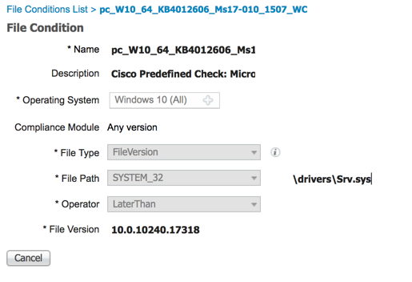
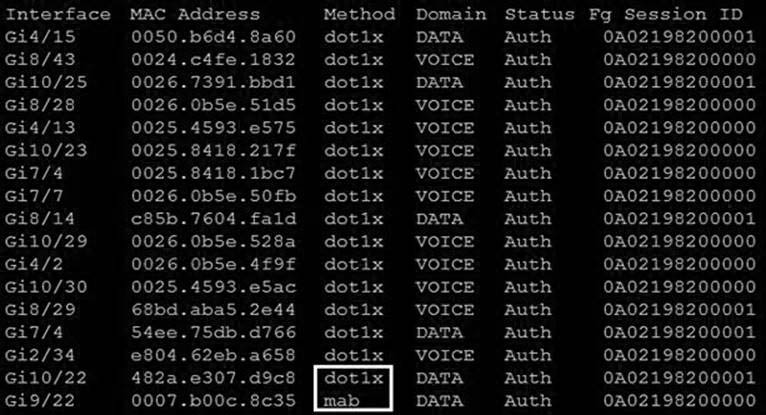
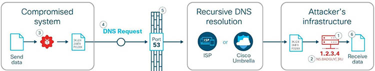

# Quiz set 3


## 09. Identity Services Engine

- <span style="color: #008888; font-weight: bold;">Question 1</span> 
  
  An administrator wants to ensure that all endpoints are compliant before users are allowed access on the corporate network. The endpoints must have the corporate antivirus application installed and be running the latest build of Windows 10. What must the administrator implement to ensure that all devices are compliant before they are allowed on the network? 
  
  A. Cisco Identity Services Engine and AnyConnect Posture module<br>
  B. Cisco Stealthwatch and Cisco Identity Services Engine integration<br>
  C. Cisco ASA firewall with Dynamic Access Policies configured<br>
  D. Cisco Identity Services Engine with PxGrid services enabled<br>
  
  Answer: A


- <span style="color: #008888; font-weight: bold;">Question 2</span>
  
  An engineer must force an endpoint to re-authenticate an already authenticated session without disrupting the endpoint to apply a new or updated policy from ISE. Which CoA type achieves this goal? 
  
  A. Port Bounce<br>
  B. CoA Terminate<br>
  C. CoA Reauth<br>
  D. CoA Session Query<br>
  
  Answer: C

  Explanation

  Choose one of the following settings to configure the CoA type:
  - No CoA (default) — You can use this option to disable the global configuration of CoA. This setting overrides any configured CoA per endpoint profiling policy. If the goal is only visibilibility, retain the default value as No CoA.
  - Port Bounce — You can use this option, if the switch port exists with only one session. If the port exists with multiple sessions, then use the Reauth option. If the goal is to immediately update the access policy based on profile changes, select the Port Bounce option, this will ensure that any clientless endpoints is reauthorized, and IP address is refreshed, if required.
  - Reauth — You can use this option to enforce reauthentication of an already authenticated endpoint when it is profiled. Select the Reauth option, if no VLAN or address change is expected following the reauthorization of the current session.

  Reference: [Cisco ISE Endpoint Profiling Policies](https://www.cisco.com/c/en/us/td/docs/security/ise/2-1/admin_guide/b_ise_admin_guide_21/b_ise_admin_guide_20_chapter_010100.html)


- <span style="color: #008888; font-weight: bold;">Question 3</span>
  
  Which two probes are configured to gather attributes of connected endpoints using Cisco Identity Services Engine? (Choose two)
  
  A. RADIUS<br>
  B. TACACS+<br>
  C. DHCP<br>
  D. sFlow<br>
  E. SMTP<br>
  
  Answer: A C

  Explanation

  An IOS sensor integration allows Cisco ISE run time and the Cisco ISE profiler to collect any or all of the attributes that are sent from the switch. You can collect DHCP, CDP, and LLDP attributes directly from the switch by using the RADIUS protocol. The attributes that are collected for DHCP, CDP, and LLDP are then parsed and mapped to attributes in the profiler dictionaries in the following location: Policy > Policy Elements > Dictionaries.

  Reference: [Cisco ISE Endpoint Profiling Policies](https://www.cisco.com/c/en/us/td/docs/security/ise/2-1/admin_guide/b_ise_admin_guide_21/b_ise_admin_guide_20_chapter_010100.html)


- <span style="color: #008888; font-weight: bold;">Question 4</span>
  
  Which ID store requires that a shadow user be created on Cisco ISE for the admin login to work?
  
  A. RSA SecureID<br>
  B. Internal Database<br>
  C. Active Directory<br>
  D. LDAP<br>
  
  Answer: C

  Explanation

  Configuring AD user as ISE GUI admin
  - Step1 Create admin user
  - Step:2 Check External check box make it a shadow user.
  - Step 3 Create user in AD
  - Step 4 Verify user shows up in MnT Admin Group.
  - Step 5 Login to ISE using AD as identity source.
  - Step 6 Access permission for Operations tab.

  Reference: [ISE Admin user authentication from AD](https://community.cisco.com/t5/security-documents/ise-admin-user-authentication-from-ad/ta-p/3159662)


- <span style="color: #008888; font-weight: bold;">Question 5</span>
  
  An engineer used a posture check on a Microsoft Windows endpoint and discovered that the MS17-010 patch was not installed, which left the endpoint vulnerable to WannaCry ransomware. Which two solutions mitigate the risk of this ransom ware infection? (Choose two)
  
  A. Configure a posture policy in Cisco Identity Services Engine to install the MS17-010 patch before allowing access on the network.<br>
  B. Set up a profiling policy in Cisco Identity Service Engine to check and endpoint patch level before allowing access on the network.<br>
  C. Configure a posture policy in Cisco Identity Services Engine to check that an endpoint patch level is met before allowing access on the network.<br>
  D. Configure endpoint firewall policies to stop the exploit traffic from being allowed to run and replicate throughout the network.<br>
  E. Set up a well-defined endpoint patching strategy to ensure that endpoints have critical vulnerabilities patched in a timely fashion.<br> 
  
  Answer: A C 
  
  Explanation
  
  A <span style="color: #bb6600;">posture policy</span> is a collection of posture requirements, which are associated with one or more identity groups, and operating systems. We can configure ISE to check for the Windows patch at Work Centers > Posture > Posture Elements > Conditions > File. 
  
  In this example, we are going to use the predefined file check to ensure that our Windows 10 clients have the critical security patch installed to prevent the Wanna Cry malware. 
  
  <figure style="margin: 0.5em; display: flex; justify-content: center; align-items: center;">
    
  </figure>
  
  Reference: [ISE Posture Prescriptive Deployment Guide](https://community.cisco.com/t5/security-documents/ise-posture-prescriptive-deployment-guide/ta-p/3680273)


- <span style="color: #008888; font-weight: bold;">Question 6</span>
  
  Which feature of Cisco ASA allows VPN users to be postured against Cisco ISE without requiring an inline posture node?
  
  A. RADIUS Change of Authorization<br>
  B. device tracking<br>
  C. DHCP snooping<br>
  D. VLAN hopping<br>
  
  Answer: A

  Explanation

  They were used as a stop gap to support posture on VPN concentrator that didn’t support url redirection for posture discovery

  They are no longer offered or supported as our vpn products support posture fully and newest use and Anyconnect no longer require url Redirection to work

  Reference: [What is inline posture node?](https://community.cisco.com/t5/network-access-control/what-is-an-inline-posture-node/td-p/3787136)


- <span style="color: #008888; font-weight: bold;">Question 7</span>
  
  What two mechanisms are used to redirect users to a web portal to authenticate to ISE for guest services? (Choose two)
  
  A. multiple factor auth<br>
  B. local web auth<br>
  C. single sign-on<br>
  D. central web auth<br>
  E. TACACS+<br>
  
  Answer: B D

  Explanation

  Web Authentication scenarios
  - local Web Authentication (LWA)
  - centralized Wen Authentication (CWA)

  Reference: [Web Authentication](https://www.ciscopress.com/articles/article.asp?p=3100059&seqNum=2)


- <span style="color: #008888; font-weight: bold;">Question 8</span>
  
  For which two conditions can an endpoint be checked using ISE posture assessment? (Choose two)
  
  A. Windows service<br>
  B. computer identity<br>
  C. user identity<br>
  D. Windows firewall<br>
  E. default browser<br>
  
  Answer: A D


- <span style="color: #008888; font-weight: bold;">Question 9</span>

  Which compliance status is shown when a configured posture policy requirement is not met?
  
  A. compliant<br>
  B. unknown<br>
  C. authorized<br>
  D. noncompliant<br>
  
  Answer: D
  
  Explanation
  
  Posture is a service in Cisco Identity Services Engine (Cisco ISE) that allows you to check the state, also known as posture, of all the endpoints that are connecting to a network for compliance with corporate security policies.
  
  A posture policy is a collection of posture requirements that are associated with one or more identity groups and operating systems.
  
  Posture-policy requirements can be set to mandatory, optional, or audit types in posture policies.
  - If a **mandatory requirement** fails, the user will be moved to **Non-Compliant** state
  - If an **optional requirement** fails, the user is allowed to skip the specified optional requirements and the user is moved to **Compliant state**

  This question did not clearly specify the type of posture policy requirement (mandatory or optional) is not met so the user can be in Non-compliant or compliant state. But “noncompliant” is the best answer here.

  Reference: [Configure Client Posture Policies](https://www.cisco.com/c/en/us/td/docs/security/ise/2-2/admin_guide/b_ise_admin_guide_22/b_ise_admin_guide_22_chapter_010111.html)


- <span style="color: #008888; font-weight: bold;">Question 10</span>
  
  Which benefit is provided by ensuring that an endpoint is compliant with a posture policy configured in Cisco ISE?
  
  A. It allows the endpoint to authenticate with 802.1x or MAB.<br>
  B. It verifies that the endpoint has the latest Microsoft security patches installed.<br>
  C. It adds endpoints to identity groups dynamically.<br>
  D. It allows CoA to be applied if the endpoint status is compliant.<br>
  
  Answer: B


## 10. Layer 2 Security

- <span style="color: #008888; font-weight: bold;">Question 1</span>

  Which IPS engine detects ARP spoofing?

  A. Atomic ARP Engine<br>
  B. Service Generic Engine<br>
  C. ARP Inspection Engine<br>
  D. AIC Engine<br>

  Answer: A


- <span style="color: #008888; font-weight: bold;">Question 2</span>

  What is a characteristic of Dynamic ARP Inspection?

  A. DAI determines the validity of an ARP packet based on valid IP to MAC address bindings from the DHCP snooping binding database.<br>
  B. In a typical network, make all ports as trusted except for the ports connecting to switches, which are untrusted<br>
  C. DAI associates a trust state with each switch.<br>
  D. DAI intercepts all ARP requests and responses on trusted ports only.<br>

  Answer: A


- <span style="color: #008888; font-weight: bold;">Question 3</span>

  What is a characteristic of traffic storm control behavior?

  A. Traffic storm control drops all broadcast and multicast traffic if the combined traffic exceeds the level within the interval.<br>
  B. Traffic storm control cannot determine if the packet is unicast or broadcast.<br>
  C. Traffic storm control monitors incoming traffic levels over a 10-second traffic storm control interval.<br>
  D. Traffic storm control uses the Individual/Group bit in the packet source address to determine if the packet is unicast or broadcast.<br>

  Answer: A

  Explanation

  A broadcast storm occurs when huge amount of broadcast, multicast, or unknown unicast packets flood the LAN, creating excessive traffic and degrading network performance. Errors in the protocol-stack implementation or in the network configuration can also cause a storm. The mechanism to prevent and control such events is known as <span style="color: #bb6600;">storm control</span> or <span style="color: #bb6600;">broadcast suppression</span>.

  Broadcast and Multicast Suppression monitors incoming traffic levels over a 1-second traffic storm control interval and, during the interval compares the traffic level with the traffic storm control level configured. The traffic storm control threshold level is a percentage of the total available bandwidth of the port. Each port has different storm control levels for broadcast, multicast, and unicast type of traffic.

  Reference: [Configuring Storm Control](https://www.cisco.com/c/dam/en/us/td/docs/ios-xml/ios/sec_data_acl/configuration/xe-3s/asr903/sec-storm-control-xe-3s-asr903-book.html)


- <span style="color: #008888; font-weight: bold;">Question 4</span>

  A malicious user gained network access by spoofing printer connections that were authorized using MAB on four different switch ports at the same time. What two catalyst switch security features will prevent further violations? (Choose two)

  A. DHCP Snooping<br>
  B. 802.1AE MacSec<br>
  C. Port security<br>
  D. IP Device track<br>
  E. Dynamic ARP inspection<br>
  F. Private VLANs<br>

  Answer: A E


- <span style="color: #008888; font-weight: bold;">Question 5</span>

  Which command enables 802.1X globally on a Cisco switch?

  A. `dot1x system-auth-control`<br>
  B. `dot1x pae authenticator`<br>
  C. `authentication port-control aut`<br>
  D. `aaa new-model`<br>

  Answer: A


- <span style="color: #008888; font-weight: bold;">Question 6</span>

  Which RADIUS attribute can you use to filter MAB requests in an 802.1 x deployment?

  A. 1<br>
  B. 2<br>
  C. 6<br>
  D. 31<br>

  Answer: C

  Explanation

  Because MAB uses the MAC address as a username and password, you should make sure that the RADIUS server can differentiate MAB requests from other types of requests for network access. This precaution will prevent other clients from attempting to use a MAC address as a valid credential. Cisco switches uniquely identify MAB requests by setting Attribute 6 (Service-Type) to 10 (Call-Check) in a MAB Access-Request message. Therefore, you can use Attribute 6 to filter MAB requests at the RADIUS server.

  Reference: [MAC Authentication Bypass Deployment Guide](https://www.cisco.com/c/en/us/td/docs/solutions/Enterprise/Security/TrustSec_1-99/MAB/MAB_Dep_Guide.html#wp392245)


- <span style="color: #008888; font-weight: bold;">Question 7</span>

  A network administrator configures Dynamic ARP Inspection on a switch. After Dynamic ARP Inspection is applied, all users on that switch are unable to communicate with any destination. The network administrator checks the interface status of all interfaces, and there is no err-disabled interface. What is causing this problem?

  A. DHCP snooping has not been enabled on all VLANs.<br>
  B. The ip arp inspection limit command is applied on all interfaces and is blocking the traffic of all users.<br>
  C. Dynamic ARP Inspection has not been enabled on all VLANs<br>
  D. The no ip arp inspection trust command is applied on all user host interfaces<br>

  Answer: A

  Explanation

  Dynamic ARP inspection (DAI) is a security feature that validates ARP packets in a network. It intercepts, logs, and discards ARP packets with invalid IP-to-MAC address bindings. This capability protects the network from certain man-in-the-middle attacks. After enabling DAI, all ports become untrusted ports.

  DHCP snooping is enabled on a per-VLAN basis. By default, the feature is inactive on all VLANs. You can enable the feature on a single VLAN or a range of VLANs.

  References: 
  - [Catalyst 6500 Release 12.2SX Software Configuration Guide](https://www.cisco.com/c/en/us/td/docs/switches/lan/catalyst6500/ios/12-2SX/configuration/guide/book/snoodhcp.html)
  - [Configuring DHCP Snooping](https://www.cisco.com/en/US/docs/general/Test/dwerblo/broken_guide/snoodhcp.html)

  For example, in order to activate DHCP snooping on VLAN 2, we use the following command:

  ```texy
  SW1(config)#ip dhcp snooping vlan 2
  ```


- <span style="color: #008888; font-weight: bold;">Question 8</span>

    Refer to the exhibit.

    ```text
    SwitchA(config)#interface gigabitethernet1/0/1
    SwitchA(config-if)#dot1x host-mode multi-host
    SwitchA(config-if)#dot1x timeout quiet-period 3
    SwitchA(config-if)#dot1x timeout tx-period 15
    SwitchA(config-if)#authentication port-control auto
    SwitchA(config-if)#switchport mode access
    SwitchA(config-if)#switchport access vlan 12
    ```

    An engineer configured wired 802.1x on the network and is unable to get a laptop to authenticate. Which port configuration is missing?

    A. `authentication open`<br>
    B. `dotlx reauthentication`<br>
    C. `cisp enable`<br>
    D. `dot1x pae authenticator`<br>

    Answer: D


## 11. Secure Network Access

- <span style="color: #008888; font-weight: bold;">Question 1</span>

  Which SNMPv3 configuration must be used to support the strongest security possible?

    A.

    ```text
    asa-host(config)#snmp-server group myv3 v3 priv
    asa-host(config)#snmp-server user andy myv3 auth sha cisco priv des ciscXXXXXXXX
    asa-host(config)#snmp-server host inside 10.255.254.1 version 3 andy
    ```

    B.

    ```text
    asa-host(config)#snmp-server group myv3 v3 noauth
    asa-host(config)#snmp-server user andy myv3 auth sha cisco priv aes 256 ciscXXXXXXXX
    asa-host(config)#snmp-server host inside 10.255.254.1 version 3 andy
    ```

    C.

    ```text
    asa-host(config)#snmpserver group myv3 v3 noauth
    asa-host(config)#snmp-server user andy myv3 auth sha cisco priv 3des ciscXXXXXXXX
    asa-host(config)#snmp-server host inside 10.255.254.1 version 3 andy
    ```

    D.
    
    ```text
    asa-host(config)#snmp-server group myv3 v3 priv
    asa-host(config)#snmp-server user andy myv3 auth sha cisco priv aes 256 ciscXXXXXXXX
    asa-host(config)#snmp-server host inside 10.255.254.1 version 3 andy
    ```

  Answer: D


- <span style="color: #008888; font-weight: bold;">Question 2</span>

  Refer to the exhibit. Which command was used to generate this output and to show which ports are authenticating with dot1x or mab?

  <figure style="margin: 0.5em; display: flex; justify-content: center; align-items: center;">
    
  </figure>

  A. `show authentication registrations`<br>
  B. `show authentication method`<br>
  C. `show dot1x all`<br>
  D. `show authentication sessions`<br>

  Answer: D


- <span style="color: #008888; font-weight: bold;">Question 3</span>

  What Cisco command shows you the status of an 802.1X connection on interface gi0/1?

  A. `show authorization status`<br>
  B. `show authen sess int gi0/1`<br>
  C. `show connection status gi0/1`<br>
  D. `show ver gi0/1`<br>

  Answer: B


- <span style="color: #008888; font-weight: bold;">Question 4</span>

  Refer to the exhibit. What does the number 15 represent in this configuration?

  ```text
  snmp-server group SNMP v3 auth access 15
  ```

  A. privilege level for an authorized user to this router<br>
  B. access list that identifies the SNMP devices that can access the router<br>
  C. interval in seconds between SNMPv3 authentication attempts<br>
  D. number of possible failed attempts until the SNMPv3 user is locked out<br>

  Answer: B

  Explanation

  The syntax of this command is shown below:

  ```cfg
  snmp-server group [group-name {v1 | v2c | v3 [auth | noauth | priv]}]
    [read read-view] [write write-view] [notify notify-view] [access access-list]
  ```

  The command above restricts which IP source addresses are allowed to access SNMP functions on the router. You could restrict SNMP access by simply applying an interface ACL to block incoming SNMP packets that don’t come from trusted servers. However, this would not be as effective as using the global SNMP commands shown in this recipe. Because you can apply this method once for the whole router, it is much simpler than applying ACLs to block SNMP on all interfaces separately. Also, using interface ACLs would block not only SNMP packets intended for this router, but also may stop SNMP packets that just happened to be passing through on their way to some other destination device.


- <span style="color: #008888; font-weight: bold;">Question 5</span>

  Under which two circumstances is a CoA issued? (Choose two)

  A. A new authentication rule was added to the policy on the Policy Service node.<br>
  B. An endpoint is deleted on the Identity Service Engine server.<br>
  C. A new Identity Source Sequence is created and referenced in the authentication policy.<br>
  D. An endpoint is profiled for the first time.<br>
  E. A new Identity Service Engine server is added to the deployment with the Administration persona<br>

  Answer: B D

  Explanation

  Cisco ISE allows a global configuration to issue a Change of Authorization (CoA) for endpoints that are already authenticated to enter your network. The global configuration of CoA in Cisco ISE enables the profiler service with more control over endpoints.

  The profiler service implements the CoA in the following cases:
  - Static assignment of an endpoint
  - An exception action is configured
  - An endpoint is profiled for the first time
  - Endpoint deleted

  Reference: [Configuring Profiler Policies](https://www.cisco.com/en/US/docs/security/ise/1.0/user_guide/ise10_prof_pol.html#wp1340649)


- <span style="color: #008888; font-weight: bold;">Question 6</span>

  Refer to the exhibit.

  ```text
  HQ_Router(config)#username admin5 privilege 5
  HQ_Router(config)#privilege interface level 5 shutdown
  HQ_Router(config)#privilege interface level 5 ip
  HQ_Router(config)#privilege interface level 5 description
  ```

  A network administrator configures command authorization for the admin5 user. What is the admin5 user able to do on HQ_Router after this configuration?

  A. set the IP address of an interface<br>
  B. complete no configurations<br>
  C. complete all configurations<br>
  D. add subinterfaces<br>

  Answer: B

  Explanation

  The user “admin5” was configured with privilege level 5. In order to allow configuration (enter global configuration mode), we must type this command:

  ```text
  (config)#privilege exec level 5 configure terminal
  ```

  Without this command, this user cannot do any configuration.

  Note: Cisco IOS supports privilege levels from 0 to 15, but the privilege levels which are used by default are privilege level 1 (user EXEC) and level privilege 15 (privilege EXEC).


- <span style="color: #008888; font-weight: bold;">Question 7</span>

  A network engineer has entered the `snmp-server user andy myv3 auth sha cisco priv aes 256 cisc0380739941` command and needs to send SNMP information to a host at 10.255.254.1. Which command achieves this goal?

  A. `snmp-server host inside 10.255.254.1 version 3 andy`<br>
  B. `snmp-server host inside 10.255.254.1 version 3 myv3`<br>
  C. `snmp-server host inside 10.255.254.1 snmpv3 andy`<br>
  D. `snmp-server host inside 10.255.254.1 snmpv3 myv3`<br>

  Answer: A

  Explanation

  The command “`snmp-server user user-name group-name [remote ip-address [udp-port port]] {v1 | v2c | v3 [encrypted] [auth {md5 | sha} auth-password]} [access access-list]`” adds a new user (in this case “andy”) to an SNMPv3 group (in this case group name “myv3”) and configures a password for the user.

  In the “`snmp-server host`” command, we need to:
  - Specify the SNMP version with key word “version {1 | 2 | 3}”
  - Specify the username (“andy”), not group name (“myv3”).

  Note: In “`snmp-server host inside …`” command, “inside” is the interface name of the ASA interface through which the NMS (located at 10.255.254.1) can be reached.


- <span style="color: #008888; font-weight: bold;">Question 8</span>

  Which telemetry data captures variations seen within the flow, such as the packets TTL, IP/TCP flags, and payload length?

  A. interpacket variation<br>
  B. software package variation<br>
  C. flow insight variation<br>
  D. process details variation<br>

  Answer: A

  Explanation

  The telemetry information consists of three types of data:
  - Flow information: This information contains details about endpoints, protocols, ports, when the flow started, how long the flow was active, etc.
  - Interpacket variation: This information captures any interpacket variations within the flow. Examples include variation in Time To Live (TTL), IP and TCP flags, payload length, etc
  - Context details: Context information is derived outside the packet header. It includes details about variation in buffer utilization, packet drops within a flow, association with tunnel endpoints, etc.

  Reference: [Cisco Nexus 9300EX Platform Switches Architecture](https://www.cisco.com/c/dam/global/en_uk/products/switches/cisco_nexus_9300_ex_platform_switches_white_paper_uki.pdf)


## 12. Exfiltration Techniques

- <span style="color: #008888; font-weight: bold;">Question 1</span>

  How is ICMP used an exfiltration technique?

  A. by flooding the destination host with unreachable packets<br>
  B. by sending large numbers of ICMP packets with a targeted hosts source IP address using an IP broadcast address<br>
  C. by encrypting the payload in an ICMP packet to carry out command and control tasks on a compromised host<br>
  D. by overwhelming a targeted host with ICMP echo-request packets<br>

  Answer: C


- <span style="color: #008888; font-weight: bold;">Question 2</span>

  Which exfiltration method does an attacker use to hide and encode data inside DNS requests and queries?

  A. DNS tunneling<br>
  B. DNSCrypt<br>
  C. DNS security<br>
  D. DNSSEC<br>

  Answer: A

  Explanation

  DNS Tunneling is a method of cyber attack that encodes the data of other programs or protocols in DNS queries and responses. DNS tunneling often includes data payloads that can be added to an attacked DNS server and used to control a remote server and applications.


- <span style="color: #008888; font-weight: bold;">Question 3</span>

  How is DNS tunneling used to exfiltrate data out of a corporate network?

  A. It corrupts DNS servers by replacing the actual IP address with a rogue address to collect information or start other attacks.<br>
  B. It encodes the payload with random characters that are broken into short strings and the DNS server rebuilds the exfiltrated data.<br>
  C. It redirects DNS requests to a malicious server used to steal user credentials, which allows further damage and theft on the network.<br>
  D. It leverages the DNS server by permitting recursive lookups to spread the attack to other DNS servers.<br>

  Answer: B

  Explanation

  Domain name system (DNS) is the protocol that translates human-friendly URLs, such as securitytut.com, into IP addresses, such as 183.33.24.13. Because DNS messages are only used as the beginning of each communication and they are not intended for data transfer, many organizations do not monitor their DNS traffic for malicious activity. As a result, DNS-based attacks can be effective if launched against their networks. DNS tunneling is one such attack.

  An example of DNS Tunneling is shown below:

  <figure style="margin: 0.5em; display: flex; justify-content: center; align-items: center;">
    
  </figure>

  - 1\. The attacker incorporates one of many open-source DNS tunneling kits into an authoritative DNS nameserver (NS) and malicious payload.
  - 2\. An IP address (e.g. 1.2.3.4) is allocated from the attacker’s infrastructure and a domain name (e.g. attackerdomain.com) is registered or reused. The registrar informs the top-level domain (.com) nameservers to refer requests for attackerdomain.com to ns.attackerdomain.com, which has a DNS record mapped to 1.2.3.4
  - 3\. The attacker compromises a system with the malicious payload. Once the desired data is obtained, the payload encodes the data as a series of 32 characters (0-9, A-Z) broken into short strings (3KJ242AIE9, P028X977W,…).
  - 4\. The payload initiates thousands of unique DNS record requests to the attacker’s domain with each string as a part of the domain name (e.g. 3KJ242AIE9.attackerdomain.com). Depending on the attacker’s patience and stealth, requests can be spaced out over days or months to avoid suspicious network activity.
  - 5\. The requests are forwarded to a recursive DNS resolver. During resolution, the requests are sent to the attacker’s authoritative DNS nameserver,
  - 6\. The tunneling kit parses the encoded strings and rebuilds the exfiltrated data.

  Reference: [Introducing Improvements in DNS Tunneling & DNS Exfiltration Detection](https://umbrella.cisco.com/blog/improvements-dns-tunneling-dns-exfiltration-detection)


- <span style="color: #008888; font-weight: bold;">Question 4</span>

  Which two characteristics of messenger protocols make data exfiltration difficult to detect and prevent? (Choose two)

  A. Outgoing traffic is allowed so users can communicate with outside organizations.<br>
  B. Malware infects the messenger application on the user endpoint to send company data.<br>
  C. Traffic is encrypted, which prevents visibility on firewalls and IPS systems.<br>
  D. An exposed API for the messaging platform is used to send large amounts of data.<br>
  E. Messenger applications cannot be segmented with standard network controls.<br>

  Answer: C E


