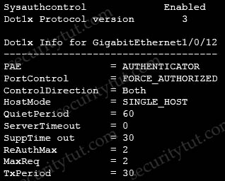
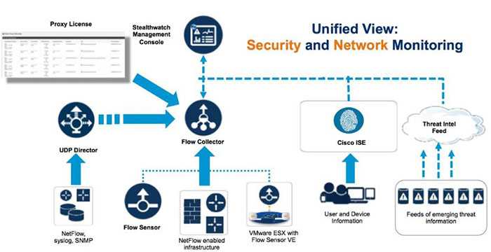
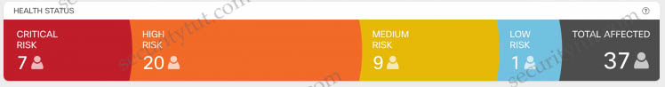
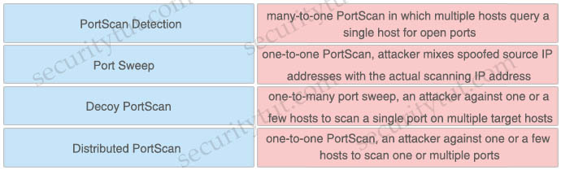
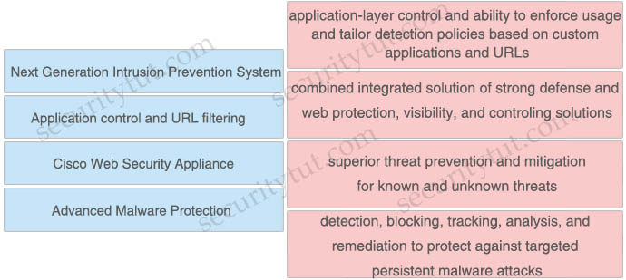
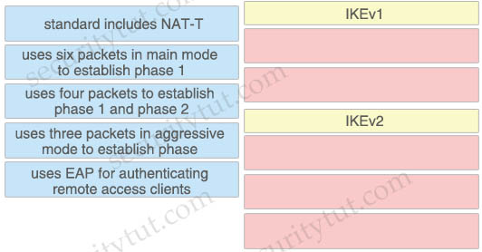
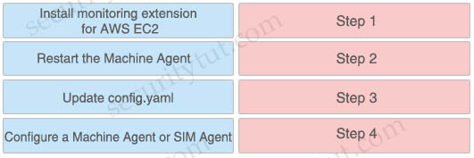

# Quiz Set 4


## 13. Malware Protection & AMP

- <span style="color: #008888; font-weight: bold;">Question 1</span>

  Which Cisco AMP file disposition valid?

  A. pristine<br>
  B. malware<br>
  C. dirty<br>
  D. non malicious<br>

  Answer: B


- <span style="color: #008888; font-weight: bold;">Question 2</span>

  When using Cisco AMP for Networks which feature copies a file to the Cisco AMP cloud for analysis?

  A. Spero analysis<br>
  B. dynamic analysis<br>
  C. sandbox analysis<br>
  D. malware analysis<br>

  Answer: B

  Explanation

  Spero analysis examines structural characteristics such as metadata and header information in executable files. After generating a Spero signature based on this information, if the file is an eligible executable file, the device submits it to the Spero heuristic engine in the AMP cloud. Based on the Spero signature, the Spero engine determines whether the file is malware.

  Reference: [Firepower Management Center Configuration Guide, Version 6.0](https://www.cisco.com/c/en/us/td/docs/security/firepower/60/configuration/guide/fpmc-config-guide-v60/Reference_a_wrapper_Chapter_topic_here.html)

  -> Spero analysis only uploads the signature of the (executable) files to the AMP cloud. It does not upload the whole file. Dynamic analysis sends files to AMP ThreatGrid.

  Dynamic Analysis submits (the whole) files to Cisco Threat Grid (formerly AMP Threat Grid). Cisco Threat Grid runs the file in a sandbox environment, analyzes the file’s behavior to determine whether the file is malicious, and returns a threat score that indicates the likelihood that a file contains malware. From the threat score, you can view a dynamic analysis summary report with the reasons for the assigned threat score. You can also look in Cisco Threat Grid to view detailed reports for files that your organization submitted, as well as scrubbed reports with limited data for files that your organization did not submit.

  Local malware analysis allows a managed device to locally inspect executables, PDFs, office documents, and other types of files for the most common types of malware, using a detection rule set provided by the Cisco Talos Security Intelligence and Research Group (Talos). Because local analysis does not query the AMP cloud, and does not run the file, local malware analysis saves time and system resources. -> Malware analysis does not upload files to anywhere, it only checks the files locally.

  There is no sandbox analysis feature, it is just a method of dynamic analysis that runs suspicious files in a virtual machine.


- <span style="color: #008888; font-weight: bold;">Question 3</span>

  Which Cisco Advanced Malware protection for Endpoints deployment architecture is designed to keep data within a network perimeter?

  A. cloud web services<br>
  B. network AMP<br>
  C. private cloud<br>
  D. public cloud<br>

  Answer: C


- <span style="color: #008888; font-weight: bold;">Question 4</span>

  Which capability is exclusive to a Cisco AMP public cloud instance as compared to a private cloud instance?

  A. RBAC<br>
  B. ETHOS detection engine<br>
  C. SPERO detection engine<br>
  D. TETRA detection engine<br>

  Answer: B


- <span style="color: #008888; font-weight: bold;">Question 5</span>

  An engineer is configuring AMP for endpoints and wants to block certain files from executing. Which outbreak control method is used to accomplish this task?

  A. device flow correlation<br>
  B. simple detections<br>
  C. application blocking list<br>
  D. advanced custom detections<br>

  Answer: C


- <span style="color: #008888; font-weight: bold;">Question 6</span>

  Which function is the primary function of Cisco AMP threat Grid?

  A. automated email encryption<br>
  B. applying a real-time URI blacklist<br>
  C. automated malware analysis<br>
  D. monitoring network traffic<br>

  Answer: C


- <span style="color: #008888; font-weight: bold;">Question 7</span>

  What are two list types within AMP for Endpoints Outbreak Control? (Choose two)

  A. blocked ports<br>
  B. simple custom detections<br>
  C. command and control<br>
  D. allowed applications<br>
  E. URL<br>

  Answer: B D

  Explanation

  Advanced Malware Protection (AMP) for Endpoints offers a variety of lists, referred to as Outbreak Control, that allow you to customize it to your needs. The main lists are: Simple Custom Detections, Blocked Applications, Allowed Applications, Advanced Custom Detections, and IP Blocked and Allowed Lists.

  A Simple Custom Detection list is similar to a blocked list. These are files that you want to detect and quarantine.

  Allowed applications lists are for files you never want to convict. Some examples are a custom application that is detected by a generic engine or a standard image that you use throughout the company

  Reference: [AMP Endpoint Security Guid](https://docs.amp.cisco.com/AMP%20for%20Endpoints%20User%20Guide.pdf)


- <span style="color: #008888; font-weight: bold;">Question 8</span>

  What is a required prerequisite to enable malware file scanning for the Secure Internet Gateway?

  A. Enable IP Layer enforcement.<br>
  B. Activate the Advanced Malware Protection license<br>
  C. Activate SSL decryption.<br>
  D. Enable Intelligent Proxy.<br>

  Answer: D


## 14. AAA

- <span style="color: #008888; font-weight: bold;">Question 1</span>

  When wired 802.1X authentication is implemented, which two components are required? (Choose two)

  A. authentication server: Cisco Identity Service Engine<br>
  B. supplicant: Cisco AnyConnect ISE Posture module<br>
  C. authenticator: Cisco Catalyst switch<br>
  D. authenticator: Cisco Identity Services Engine<br>
  E. authentication server: Cisco Prime Infrastructure<br>

  Answer: A C


- <span style="color: #008888; font-weight: bold;">Question 2</span>

  Refer to the exhibit. Which command was used to display this output?

  <figure style="margin: 0.5em; display: flex; justify-content: center; align-items: center;">
    
  </figure>

  A. show dot1x all<br>
  B. show dot1x<br>
  C. show dot1x all summary<br>
  D. show dot1x interface gi1/0/12<br>

  Answer: A


- <span style="color: #008888; font-weight: bold;">Question 3</span>

  Refer to the exhibit. Which statement about the authentication protocol used in the configuration is true?

  ```text
  aaa new-model
  radius-server host 10.0.0.12 key secret12
  ```

  A. The authentication request contains only a password<br>
  B. The authentication request contains only a username<br>
  C. The authentication and authorization requests are grouped in a single packet<br>
  D. There are separate authentication and authorization request packets<br>

  Answer: C

  Explanation

  This command uses RADIUS which combines authentication and authorization in one function (packet).


- <span style="color: #008888; font-weight: bold;">Question 4

  An engineer needs a solution for TACACS+ authentication and authorization for device administration.

  The engineer also wants to enhance wired and wireless network security by requiring users and endpoints to use 802.1X, MAB, or WebAuth. Which product meets all of these requirements?

  A. Cisco Prime Infrastructure<br>
  B. Cisco Identity Services Engine<br>
  C. Cisco Stealthwatch<br>
  D. Cisco AMP for Endpoints<br>

  Answer: B


- <span style="color: #008888; font-weight: bold;">Question 5

  Which Cisco command enables authentication, authorization, and accounting globally so that CoA is supported on the device?

  A. aaa server radius dynamic-author<br>
  B. aaa new-model<br>
  C. auth-type all<br>
  D. ip device-tracking<br>

  Answer: B


## 15. Endpoint Protection & Detection


- <span style="color: #008888; font-weight: bold;">Question 1</span>

  An MDM provides which two advantages to an organization with regards to device management? (Choose two)

  A. asset inventory management<br>
  B. allowed application management<br>
  C. Active Directory group policy management<br>
  D. network device management<br>
  E. critical device management<br>

  Answer: A B


- <span style="color: #008888; font-weight: bold;">Question 2</span>

  Which Cisco product provides proactive endpoint protection and allows administrators to centrally manage the deployment?

  A. NGFW<br>
  B. AMP<br>
  C. WSA<br>
  D. ESA<br>

  Answer: B


- <span style="color: #008888; font-weight: bold;">Question 3</span>

  Which benefit does endpoint security provide the overall security posture of an organization?

  A. It streamlines the incident response process to automatically perform digital forensics on the endpoint.<br>
  B. It allows the organization to mitigate web-based attacks as long as the user is active in the domain.<br>
  C. It allows the organization to detect and respond to threats at the edge of the network.<br>
  D. It allows the organization to detect and mitigate threats that the perimeter security devices do not detect.<br>

  Answer: D


- <span style="color: #008888; font-weight: bold;">Question 4</span>

  What are the two most commonly used authentication factors in multifactor authentication? (Choose two)

  A. biometric factor<br>
  B. time factor<br>
  C. confidentiality factor<br>
  D. knowledge factor<br>
  E. encryption factor<br>

  Answer: A D

  Explanation

  Multi-factor Authentication (MFA) is an authentication method that requires the user to provide two or more verification factors to gain access to a resource. MFA requires means of verification that unauthorized users won’t have.

  Proper multi-factor authentication uses factors from at least two different categories.

  MFA methods:
  - Knowledge – usually a password – is the most commonly used tool in MFA solutions. However, despite their simplicity, passwords have become a security problem and slow down productivity.
  - Physical factors – also called possession factors–use tokens, such as a USB dongle or a portable device, that generate a temporary QR (quick response) code. Mobile phones are commonly used, as they have the advantage of being readily available in most situations.
  - Inherent – This category includes biometrics like fingerprint, face, and retina scans. As technology advances, it may also include voice ID or other behavioral inputs like keystroke metrics. Because inherent factors are reliably unique, always present, and secure, this category shows promise.
  - Location-based and time-based – Authentication systems can use GPS coordinates, network parameters, and metadata for the network in use, and device recognition for MFA. Adaptive authentication combines these data points with historical or contextual user data.

  A time factor in conjunction with a location factor could detect an attacker attempting to authenticate in Europe when the user was last authenticated in California an hour prior, for example.

  - Time-based one-time password (TOTP) – This is generally used in 2FA but could apply to any MFA method where a second step is introduced dynamically at login upon completing a first step. The wait for a second step–in which temporary passcodes are sent by SMS or email–is usually brief, and the process is easy to use for a wide range of users and devices. This method is currently widely used.
  - Social media – In this case a user grants permission for a website to use their social media username and password for login. This provide an easy login process, and one generally available to all users.
  - Risk-based authentication – Sometimes called adaptive multi-factor authentication, this method combines adaptive authentication and algorithms that calculate risk and observe the context of specific login requests. The goal of this method is to reduce redundant logins and provide a more user-friendly workflow.
  - Push-based 2FA – Push-based 2FA improves on SMS and TOTP 2FA by adding additional layers of security while improving ease of use. It confirms a user’s identity with multiple factors of authentication that other methods cannot. Because push-based 2FA sends notifications through data networks like cellular or Wi-Fi, users must have data access on their mobile devices to use the 2FA functionality.

  Reference: [What Is Multi-Factor Authentication?](https://www.cisco.com/c/en/us/products/security/what-is-multi-factor-authentication.html)

  The two most popular authentication factors are knowledge and inherent (including biometrics like fingerprint, face, and retina scans. Biometrics is used commonly in mobile devices).


- <span style="color: #008888; font-weight: bold;">Question 5</span>

  Which two kinds of attacks are prevented by multifactor authentication? (Choose two)

  A. phishing<br>
  B. brute force<br>
  C. man-in-the-middle<br>
  D. DDOS<br>
  E. teardrop<br>

  Answer: B C


- <span style="color: #008888; font-weight: bold;">Question 6</span>

  What is the primary difference between an Endpoint Protection Platform and an Endpoint Detection and Response?

  A. EPP focuses on prevention, and EDR focuses on advanced threats that evade perimeter defenses.<br>
  B. EDR focuses on prevention, and EPP focuses on advanced threats that evade perimeter defenses.<br>
  C. EPP focuses on network security, and EDR focuses on device security.<br>
  D. EDR focuses on network security, and EPP focuses on device security.<br>

  Answer: A


- <span style="color: #008888; font-weight: bold;">Question 7</span>

  An engineer wants to automatically assign endpoints that have a specific OUI into a new endpoint group. Which probe must be enabled for this type of profiling to work?

  A. NetFlow<br>
  B. NMAP<br>
  C. SNMP<br>
  D. DHCP<br>

  Answer: B

  Explanation

  Cisco ISE can determine the type of device or endpoint connecting to the network by performing “profiling.” Profiling is done by using DHCP, SNMP, Span, NetFlow, HTTP, RADIUS, DNS, or NMAP scans to collect as much metadata as possible to learn the device fingerprint.

  NMAP (“Network Mapper”) is a popular network scanner which provides a lot of features. One of them is the OUI (Organizationally Unique Identifier) information. OUI is the first 24 bit or 6 hexadecimal value of the MAC address.

  Note: DHCP probe cannot collect OUIs of endpoints. NMAP scan probe can collect these endpoint attributes:
  - EndPointPolicy
  - LastNmapScanCount
  - NmapScanCount
  - OUI
  - Operating-system

  Reference: [ISE 2.0 - Profiling](http://www.network-node.com/blog/2016/1/2/ise-20-profiling)


- <span style="color: #008888; font-weight: bold;">Question 8</span>

  What are two reasons for implementing a multifactor authentication solution such as Duo Security provide to an organization? (Choose two)

  A. flexibility of different methods of 2FA such as phone callbacks, SMS passcodes, and push notifications<br>
  B. single sign-on access to on-premises and cloud applications<br>
  C. integration with 802.1x security using native Microsoft Windows supplicant<br>
  D. secure access to on-premises and cloud applications<br>
  E. identification and correction of application vulnerabilities before allowing access to resources<br>

  Answer: A D

  Explanation

  Two-factor authentication adds a second layer of security to your online accounts. Verifying your identity using a second factor (like your phone or other mobile device) prevents anyone but you from logging in, even if they know your password.

  Note: Single sign-on (SSO) is a property of identity and access management that enables users to securely authenticate with multiple applications and websites by logging in only once with just one set of credentials (username and password). With SSO, the application or website that the user is trying to access relies on a trusted third party to verify that users are who they say they are.


## 16. Cisco Umbrella

<span style="color: #008888; font-weight: #008888;">Cisco Umbrella Quick Summary</span>

Cisco Umbrella protects users from accessing malicious domains by proactively analyzing and blocking unsafe destinations – before a connection is ever made. Thus it can protect from phishing attacks by blocking suspicious domains when users click on the given links that an attacker sent.

When Umbrella receives a DNS request, it uses intelligence to determine if the request is safe, malicious or risky — meaning the domain contains both malicious and legitimate content. Safe and malicious requests are routed as usual or blocked, respectively. Risky requests are routed to our cloud-based proxy for deeper inspection. The Umbrella proxy uses Cisco Talos web reputation and other third-party feeds to determine if a URL is malicious.

Cisco Umbrella roaming protects your employees even when they are off the VPN.


- <span style="color: #008888; font-weight: bold;">Question 1</span>

  An engineer configured a new network identity in Cisco Umbrella but must verify that traffic is being routed through the Cisco Umbrella network. Which action tests the routing?

  A. Ensure that the client computers are pointing to the on-premises DNS servers.<br>
  B. Enable the Intelligent Proxy to validate that traffic is being routed correctly.<br>
  C. Add the public IP address that the client computers are behind to a Core Identity.<br>
  D. Browse to http://welcome.umbrella.com/ to validate that the new identity is working.<br>

  Answer: D


- <span style="color: #008888; font-weight: bold;">Question 2</span>

  Which feature within Cisco Umbrella allows for the ability to inspect secure HTTP traffic?

  A. File Analysis<br>
  B. SafeSearch<br>
  C. SSL Decryption<br>
  D. Destination Lists<br>

  Answer: C

  Explanation

  SSL Decryption is an important part of the Umbrella Intelligent Proxy. he feature allows the Intelligent Proxy to go beyond simply inspecting normal URLs and actually proxy and inspect traffic that’s sent over HTTPS. The SSL Decryption feature does require the root certificate be installed.

  Reference: [SSL Decryption in the Intelligent Proxy](https://support.umbrella.com/hc/en-us/articles/115004564126-SSL-Decryption-in-the-Intelligent-Proxy)


- <span style="color: #008888; font-weight: bold;">Question 3</span>

  How is Cisco Umbrella configured to log only security events?

  A. per policy<br>
  B. in the Reporting settings<br>
  C. in the Security Settings section<br>
  D. per network in the Deployments section<br>

  Answer: A

  Explanation

  The logging of your identities’ activities is set per-policy when you first create a policy. By default, logging is on and set to log all requests an identity makes to reach destinations. At any time after you create a policy, you can change what level of identity activity Umbrella logs.
  From the Policy wizard, log settings are:

  Log All Requests—For full logging, whether for content, security or otherwise
  Log Only Security Events—For security logging only, which gives your users more privacy—a good setting for people with the roaming client installed on personal devices
  Don’t Log Any Requests—Disables all logging. If you select this option, most reporting for identities with this policy will not be helpful as nothing is logged to report on.

  Reference: [Cisco Umbrella - Manage Your Logs](https://docs.umbrella.com/deployment-umbrella/docs/log-management)


- <span style="color: #008888; font-weight: bold;">Question 4</span>

  How does Cisco Umbrella archive logs to an enterprise owned storage?

  A. by using the Application Programming Interface to fetch the logs<br>
  B. by sending logs via syslog to an on-premises or cloud-based syslog server<br>
  C. by the system administrator downloading the logs from the Cisco Umbrella web portal<br>
  D. by being configured to send logs to a self-managed AWS S3 bucket<br>

  Answer: D

  Explanation

  The Cisco Umbrella Multi-Org console has the ability to upload, store, and archive traffic activity logs from your organizations’ Umbrella dashboards to the cloud through Amazon S3. CSV formatted Umbrella logs are compressed (gzip) and uploaded every ten minutes so that there’s a minimum of delay between traffic from the organization’s Umbrella dashboard being logged and then being available to download from an S3 bucket.
  By having your organizations’ logs uploaded to an S3 bucket, you can then download logs automatically to keep in perpetuity in backup storage.

  Reference: [Cisco Umbrella - Manage Logs](https://docs.umbrella.com/deployment-umbrella/docs/manage-logs)


- <span style="color: #008888; font-weight: bold;">Question 5</span>

  When web policies are configured in Cisco Umbrella, what provides the ability to ensure that domains are blocked when they host malware, command and control, phishing, and more threats?

  A. Application Control<br>
  B. Security Category Blocking<br>
  C. Content Category Blocking<br>
  D. File Analysis<br>

  Answer: B


- <span style="color: #008888; font-weight: bold;">Question 6</span>

  Which Cisco solution does Cisco Umbrella integrate with to determine if a URL is malicious?

  A. AMP<br>
  B. AnyConnect<br>
  C. DynDNS<br>
  D. Talos<br>

  Answer: D

  Explanation

  When Umbrella receives a DNS request, it uses intelligence to determine if the request is safe, malicious or risky — meaning the domain contains both malicious and legitimate content. Safe and malicious requests are routed as usual or blocked, respectively. Risky requests are routed to our cloud-based proxy for deeper inspection. The Umbrella proxy uses Cisco Talos web reputation and other third-party feeds to determine if a URL is malicious.


- <span style="color: #008888; font-weight: bold;">Question 7</span>

  Where are individual sites specified to be blacklisted in Cisco Umbrella?

  A. application settings<br>
  B. content categories<br>
  C. security settings<br>
  D. destination lists<br>

  Answer: D

  Explanation

  A destination list is a list of internet destinations that can be blocked or allowed based on the administrative preferences for the policies applied to the identities within your organization. A destination is an IP address (IPv4), URL, or fully qualified domain name. You can add a destination list to Umbrella at any time; however, a destination list does not come into use until it is added to a policy.

  Reference: [Cisco Umbrella - Manage Destination Lists](https://docs.umbrella.com/deployment-umbrella/docs/working-with-destination-lists)


- <span style="color: #008888; font-weight: bold;">Question 8</span>

  Which Cisco security solution protects remote users against phishing attacks when they are not connected to the VPN?

  A. Cisco Stealthwatch<br>
  B. Cisco Umbrella<br>
  C. Cisco Firepower<br>
  D. NGIPS<br>

  Answer: B

  Explanation

  Cisco Umbrella protects users from accessing malicious domains by proactively analyzing and blocking unsafe destinations – before a connection is ever made. Thus it can protect from phishing attacks by blocking suspicious domains when users click on the given links that an attacker sent. Cisco Umbrella roaming protects your employees even when they are off the VPN.


# Quiz Set 5


## 17. Security Products & Solutions

<span style="color: blue; font-weight: bold;">Quick summary</span>

- StealWatch: performs security analytics by collecting network flows via NetFlow
- ESA: email security solution which protects against email threats like ransomware, business email compromise, phishing, whaling, and many other email-driven attacks
- AMP for Endpoints (AMP4E): provides malware protection on endpoints
- Umbrella: provides DNS protection by blocking malicious destinations using DNS
- Firepower Threat Defense (FTD): provides a comprehensive suite of security features such as firewall capabilities, monitoring, alerts, Intrusion Detection System (IDS) and Intrusion Prevention System (IPS).
- Cisco Cloudlock: Secure your cloud users, data, and applications with the cloud-native CASB and cloud cybersecurity platform. Cisco Cloudlock provides visibility and compliance checks, protects data against misuse and exfiltration, and provides threat protections against malware like ransomware.

**Cisco SteathWatch**

Stealthwatch is the visibility and security analytics solution that collects and analyzes network data from the existing network infrastructure. Stealthwatch analyzes industry standard NetFlow data from Cisco and other vendors Routers, Switches, Firewalls, and other network devices to detect advanced and persistent security threats such as internally spreading malware, data leakage, botnet command and control traffic and network reconnaissance.

The Cisco Identity Services Engine (ISE) solution supplements Stealthwatch NetFlowbased behavioral threat detection data with contextual information such as user identity, user authorization level, device-type, and posture. Together Stealthwatch and Cisco ISE present network security analysts with a view integrating NetFlow data and contextual information enabling the security analyst to detect and discern the potential severity of threats in a timely, efficient, and cost-effective manner.

Stealthwatch components include:
- Stealthwatch Management Console: security management system that allows network administrators to define, configure, and monitor multiple distributed Stealthwatch Flow Collectors from a single location. It uses graphical representations of network traffic, identity information, customized summary reports, and integrated security and network intelligence for comprehensive analysis.
- Flow Collector: leverages enterprise telemetry such as NetFlow, IPFIX (Internet Protocol Flow Information Export), and other types of flow data from existing infrastructure such as routers, switches, firewalls, endpoints, and other network infrastructure devices. The Flow Collector can also receive and collect telemetry from proxy data sources, which can be analyzed by the cloud-based, multilayered machine learning engine, Cognitive Intelligence, for deep visibility into both web and network traffic.
- Flow Sensor (optional): produces telemetry for segments of the switching and routing infrastructure that can’t generate NetFlow natively. It also provides visibility into the application layer data and provides additional security context to enhance the Stealthwatch security analytics. It can analyze encrypted traffic.
- UDP Director: simplifies the collection and distribution of network and security data across the enterprise. It helps reduce the processing power on network routers and switches by receiving essential network and security information from multiple locations and then forwarding it to a single data stream to one or more destinations.

<figure style="margin: 0.5em; display: flex; justify-content: center; align-items: center;">
  
</figure>

Stealthwatch offers different deployment models:
- On-premises as a hardware appliance or a virtual machine called Stealthwatch Enterprise
- Cloud-delivered as a software-as-a-service (SaaS) solution called Stealthwatch Cloud.

Cisco Stealthwatch Cloud: Available as an SaaS product offer to provide visibility and threat detection within public cloud infrastructures such as Amazon Web Services (AWS), Microsoft Azure, and Google Cloud Platform (GCP).

**Cisco Cognitive Threat Analytics** helps you quickly detect and respond to sophisticated, clandestine attacks that are already under way or are attempting to establish a presence within your environment. The solution automatically identifies and investigates suspicious or malicious web-based traffic. It identifies both potential and confirmed threats, allowing you to quickly remediate the infection and reduce the scope and damage of an attack, whether it’s a known threat campaign that has spread across multiple organizations or a unique threat you’ve never seen before.

<figure style="margin: 0.5em; display: flex; justify-content: center; align-items: center;">
  
</figure>


- <span style="color: blue; font-weight: bold;">Question 1</span>

  How does Cisco Stealthwatch Cloud provide security for cloud environments?

  A. It delivers visibility and threat detection.<br>
  B. It prevents exfiltration of sensitive data.<br>
  C. It assigns Internet-based DNS protection for clients and servers.<br>
  D. It facilitates secure connectivity between public and private networks.<br>

  Answer: A

  Explanation

  Cisco Stealthwatch Cloud: Available as an SaaS product offer to provide visibility and threat detection within public cloud infrastructures such as Amazon Web Services (AWS), Microsoft Azure, and Google Cloud Platform (GCP).


- <span style="color: blue; font-weight: bold;">Question 2</span>

  What are two Detection and Analytics Engines of Cognitive Threat Analytics? (Choose two)

  A. data exfiltration<br>
  B. command and control communication<br>
  C. intelligent proxy<br>
  D. snort<br>
  E. URL categorization<br>

  Answer: A B

  Explanation

  Cisco Cognitive Threat Analytics helps you quickly detect and respond to sophisticated, clandestine attacks that are already under way or are attempting to establish a presence within your environment. The solution automatically identifies and investigates suspicious or malicious web-based traffic. It identifies both potential and confirmed threats, allowing you to quickly remediate the infection and reduce the scope and damage of an attack, whether it’s a known threat campaign that has spread across multiple organizations or a unique threat you’ve never seen before.

  Detection and analytics features provided in Cognitive Threat Analytics are shown below:
  - Data exfiltration: Cognitive Threat Analytics uses statistical modeling of an organization’s network to identify anomalous web traffic and pinpoint the exfiltration of sensitive data. It recognizes data exfiltration even in HTTPS-encoded traffic, without any need for you to decrypt transferred content
  - Command-and-control (C2) communication: Cognitive Threat Analytics combines a wide range of data, ranging from statistics collected on an Internet-wide level to host-specific local anomaly scores. Combining these indicators inside the statistical detection algorithms allows us to distinguish C2 communication from benign traffic and from other malicious activities. Cognitive Threat Analytics recognizes C2 even in HTTPS-encoded or anonymous traffic, including Tor, without any need to decrypt transferred content, detecting a broad range of threats
  …

  Reference: [Cisco Cognitive Threat Analytics](https://www.cisco.com/c/dam/en/us/products/collateral/security/cognitive-threat-analytics/at-a-glance-c45-736555.pdf)


- <span style="color: blue; font-weight: bold;">Question 3</span>

  Which network monitoring solution uses streams and pushes operational data to provide a near real-time view of activity?

  A. SNMP<br>
  B. SMTP<br>
  C. syslog<br>
  D. model-driven telemetry<br>

  Answer: D

  Explanation

  The traditional use of the pull model, where the client requests data from the network does not scale when what you want is near real-time data. Moreover, in some use cases, there is the need to be notified only when some data changes, like interfaces status, protocol neighbors change etc.

  Model-Driven Telemetry is a new approach for network monitoring in which data is streamed from network devices continuously using a push model and provides near real-time access to operational statistics. Applications can subscribe to specific data items they need, by using standard-based YANG data models over NETCONF-YANG. Cisco IOS XE streaming telemetry allows to push data off of the device to an external collector at a much higher frequency, more efficiently, as well as data on-change streaming.

  Reference: [Streaming Telemetry](https://developer.cisco.com/docs/ios-xe/#!streaming-telemetry-quick-start-guide)


- <span style="color: blue; font-weight: bold;">Question 4</span>

  What provides visibility and awareness into what is currently occurring on the network?

  A. CMX<br>
  B. WMI<br>
  C. Prime Infrastructure<br>
  D. Telemetry<br>

  Answer: D

  Explanation

  Telemetry – Information and/or data that provides awareness and visibility into what is occurring on the network at any given time from networking devices, appliances, applications or servers in which the core function of the device is not to generate security alerts designed to detect unwanted or malicious activity from computer networks.

  Reference: [Service Description: Cisco Active Threat Analytics – Premier](https://www.cisco.com/c/dam/en_us/about/doing_business/legal/service_descriptions/docs/active-threat-analytics-premier.pdf)


- <span style="color: blue; font-weight: bold;">Question 5</span>

  What can be integrated with Cisco Threat Intelligence Director to provide information about security threats, which allows the SOC to proactively automate responses to those threats?

  A. Cisco Umbrella<br>
  B. External Threat Feeds<br>
  C. Cisco Threat Grid<br>
  D. Cisco Stealthwatch<br>

  Answer: B

  Explanation

  Cisco Threat Intelligence Director (CTID) can be integrated with existing Threat Intelligence Platforms (ThreatQ, AlienVault, Infoblox etc) deployed by your organization to ingest threat intelligence automatically.

  Reference: [Automate Threat Intelligence Using Cisco Threat Intelligence Director](https://blogs.cisco.com/developer/automate-threat-intelligence-using-cisco-threat-intelligence-director)

  Note: ThreatQ, AlienVault, Infoblox etc are external Threat Intelligence Platforms


- <span style="color: blue; font-weight: bold;">Question 6</span>

  Which solution combines Cisco IOS and IOS XE components to enable administrators to recognize applications, collect and send network metrics to Cisco Prime and other third-party management tools, and prioritize application traffic?

  A. Cisco Security Intelligence<br>
  B. Cisco Application Visibility and Control<br>
  C. Cisco Model Driven Telemetry<br>
  D. Cisco DNA Center<br>

  Answer: B

  Explanation

  The Cisco Application Visibility and Control (AVC) solution leverages multiple technologies to recognize, analyze, and control over 1000 applications, including voice and video, email, file sharing, gaming, peer-to-peer (P2P), and cloud-based applications. AVC combines several Cisco IOS/IOS XE components, as well as communicating with external tools, to integrate the following functions into a powerful solution…

  Reference: [Cisco Application Visibility and Control User Guide](https://www.cisco.com/c/en/us/td/docs/ios/solutions_docs/avc/guide/avc-user-guide/avc_tech_overview.html)


- <span style="color: blue; font-weight: bold;">Question 7</span>

  Which two activities can be done using Cisco DNA Center? (Choose two)

  A. DHCP<br>
  B. Design<br>
  C. Accounting<br>
  D. DNS<br>
  E. Provision<br>

  Answer: B E

  Explanation

  Cisco DNA Center has four general sections aligned to IT workflows:

  Design: Design your network for consistent configurations by device and by site. Physical maps and logical topologies help provide quick visual reference. The direct import feature brings in existing maps, images, and topologies directly from Cisco Prime Infrastructure and the Cisco Application Policy Infrastructure Controller Enterprise Module (APIC-EM), making upgrades easy and quick. Device configurations by site can be consolidated in a “golden image” that can be used to automatically provision new network devices. These new devices can either be pre-staged by associating the device details and mapping to a site. Or they can be claimed upon connection and mapped to the site.

  Policy: Translate business intent into network policies and apply those policies, such as access control, traffic routing, and quality of service, consistently over the entire wired and wireless infrastructure. Policy-based access control and network segmentation is a critical function of the Cisco Software-Defined Access (SD-Access) solution built from Cisco DNA Center and Cisco Identity Services Engine (ISE). Cisco AI Network Analytics and Cisco Group-Based Policy Analytics running in the Cisco DNA Center identify endpoints, group similar endpoints, and determine group communication behavior. Cisco DNA Center then facilitates creating policies that determine the form of communication allowed between and within members of each group. ISE then activates the underlying infrastructure and segments the network creating a virtual overlay to follow these policies consistently. Such segmenting implements zero-trust security in the workplace, reduces risk, contains threats, and helps verify regulatory compliance by giving endpoints just the right level of access they need.

  Provision: Once you have created policies in Cisco DNA Center, provisioning is a simple drag-and-drop task. The profiles (called scalable group tags or “SGTs”) in the Cisco DNA Center inventory list are assigned a policy, and this policy will always follow the identity. The process is completely automated and zero-touch. New devices added to the network are assigned to an SGT based on identity—greatly facilitating remote office setups.

  Assurance: Cisco DNA Assurance, using AI/ML, enables every point on the network to become a sensor, sending continuous streaming telemetry on application performance and user connectivity in real time. The clean and simple dashboard shows detailed network health and flags issues. Then, guided remediation automates resolution to keep your network performing at its optimal with less mundane troubleshooting work. The outcome is a consistent experience and proactive optimization of your network, with less time spent on troubleshooting tasks.

  Reference: [Cisco DNA Center Solution Overview](https://www.cisco.com/c/en/us/products/collateral/cloud-systems-management/dna-center/nb-06-dna-center-so-cte-en.html)


- <span style="color: blue; font-weight: bold;">Question 8</span>

  What must be used to share data between multiple security products?

  A. Cisco Rapid Threat Containment<br>
  B. Cisco Platform Exchange Grid<br>
  C. Cisco Advanced Malware Protection<br>
  D. Cisco Stealthwatch Cloud<br>

  Answer: B


- <span style="color: blue; font-weight: bold;">Question 9</span>

  Which Cisco product is open, scalable, and built on IETF standards to allow multiple security products from Cisco and other vendors to share data and interoperate with each other?

  A. Advanced Malware Protection<br>
  B. Platform Exchange Grid<br>
  C. Multifactor Platform Integration<br>
  D. Firepower Threat Defense<br>

  Answer: B

  Explanation

  With Cisco pxGrid (Platform Exchange Grid), your multiple security products can now share data and work together. This open, scalable, and IETF standards-driven platform helps you automate security to get answers and contain threats faster.


- <span style="color: blue; font-weight: bold;">Question 10</span>

  What is a feature of the open platform capabilities of Cisco DNA Center?

  A. intent-based APIs<br>
  B. automation adapters<br>
  C. domain integration<br>
  D. application adapters<br>

  Answer: A


- <span style="color: blue; font-weight: bold;">Question 11</span>

  What is the function of the Context Directory Agent?

  A. maintains users’ group memberships<br>
  B. relays user authentication requests from Web Security Appliance to Active Directory<br>
  C. reads the Active Directory logs to map IP addresses to usernames<br>
  D. accepts user authentication requests on behalf of Web Security Appliance for user identification<br>

  Answer: C

  Explanation

  Cisco Context Directory Agent (CDA) is a mechanism that maps IP Addresses to usernames in order to allow security gateways to understand which user is using which IP Address in the network, so those security gateways can now make decisions based on those users (or the groups to which the users belong to).

  CDA runs on a Cisco Linux machine; monitors in real time a collection of Active Directory domain controller (DC) machines for authentication-related events that generally indicate user logins; learns, analyzes, and caches mappings of IP Addresses and user identities in its database; and makes the latest mappings available to its consumer devices.

  Reference: [Installation and Configuration Guide for Context Directory Agent, Release 1.0](https://www.cisco.com/c/en/us/td/docs/security/ibf/cda_10/Install_Config_guide/cda10/cda_oveviw.html)


## 18. Drag Drop

- <span style="color: blue; font-weight: bold;">Question 1</span>

  Drag and drop the Firepower Next Generation Intrusion Prevention System detectors from the left onto the correct definitions on the right.

  <figure style="margin: 0.5em; display: flex; justify-content: center; align-items: center;">
    
  </figure>

  Answer:
  - PortScan Detection: one-to-one PortScan, an attacker against one or a few hosts to scan one or multiple ports
  - Port Sweep: one-to-many port sweep, an attacker against one or a few hosts to scan a single port on multiple target hosts
  - Decoy PortScan: one-to-one PortScan, attacker mixes spoofed source IP addresses with the actual scanning IP address
  - Distributed PortScan: many-to-one PortScan in which multiple hosts query a single host for open ports


- <span style="color: blue; font-weight: bold;">Question 2</span>

  Drag and drop the capabilities from the left onto the correct technologies on the right.

  <figure style="margin: 0.5em; display: flex; justify-content: center; align-items: center;">
    
  </figure>

  Answer:
  - Next Generation Intrusion Prevention System: superior threat prevention and mitigation for known and unknown threats
  - Application control and URL filtering: application-layer control and ability to enforce usage and tailor detection policies based on custom applications and URLs
  - Cisco Web Security Appliance: combined integrated solution of strong defense and web protection, visibility, and controling solutions
  - Advanced Malware Protection: detection, blocking, tracking, analysis, and remediation to protect against targeted persistent malware attacks


- <span style="color: blue; font-weight: bold;">Question 3</span>

  Drag and drop the descriptions from the left onto the correct protocol versions on the right.

  <figure style="margin: 0.5em; display: flex; justify-content: center; align-items: center;">
    
  </figure>

  Answer:
  - IKEv1:
    - uses six packets in main mode to establish phase 1
    - uses three packets in aggressive mode to establish phase
  - IKEv2:
  - standard includes NAT-T
  - uses four packets to establish phase 1 and phase 2
  - uses EAP for authenticating remote access clients


- <span style="color: blue; font-weight: bold;">Question 4</span>

  Drag and drop the steps from the left into the correct order on the right to enable AppDynamics to monitor an EC2 instance in Amazon Web Services.

  <figure style="margin: 0.5em; display: flex; justify-content: center; align-items: center;">
    
  </figure>

  Answer:
  - Step 1: Configure a Machine Agent or SIM Agent
  - Step 2: Install monitoring extension for AWS EC2
  - Step 3: Update config.yaml
  - Step 4: Restart the Machine Agent


