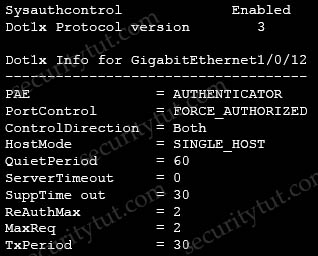

# Quiz Set 4


## 13. Malware Protection & AMP

- <span style="color: blue; font-weight: blue;">Question 1</span>

  Which Cisco AMP file disposition valid?

  A. pristine>br>
  B. malware>br>
  C. dirty>br>
  D. non malicious>br>

  Answer: B


- <span style="color: blue; font-weight: blue;">Question 2</span>

  When using Cisco AMP for Networks which feature copies a file to the Cisco AMP cloud for analysis?

  A. Spero analysis<br>
  B. dynamic analysis<br>
  C. sandbox analysis<br>
  D. malware analysis<br>

  Answer: B

  Explanation

  Spero analysis examines structural characteristics such as metadata and header information in executable files. After generating a Spero signature based on this information, if the file is an eligible executable file, the device submits it to the Spero heuristic engine in the AMP cloud. Based on the Spero signature, the Spero engine determines whether the file is malware.

  Reference: https://www.cisco.com/c/en/us/td/docs/security/firepower/60/configuration/guide/fpmc-config-guide-v60/Reference_a_wrapper_Chapter_topic_here.html

  -> Spero analysis only uploads the signature of the (executable) files to the AMP cloud. It does not upload the whole file. Dynamic analysis sends files to AMP ThreatGrid.

  Dynamic Analysis submits (the whole) files to Cisco Threat Grid (formerly AMP Threat Grid). Cisco Threat Grid runs the file in a sandbox environment, analyzes the file’s behavior to determine whether the file is malicious, and returns a threat score that indicates the likelihood that a file contains malware. From the threat score, you can view a dynamic analysis summary report with the reasons for the assigned threat score. You can also look in Cisco Threat Grid to view detailed reports for files that your organization submitted, as well as scrubbed reports with limited data for files that your organization did not submit.

  Local malware analysis allows a managed device to locally inspect executables, PDFs, office documents, and other types of files for the most common types of malware, using a detection rule set provided by the Cisco Talos Security Intelligence and Research Group (Talos). Because local analysis does not query the AMP cloud, and does not run the file, local malware analysis saves time and system resources. -> Malware analysis does not upload files to anywhere, it only checks the files locally.

  There is no sandbox analysis feature, it is just a method of dynamic analysis that runs suspicious files in a virtual machine.


- <span style="color: blue; font-weight: blue;">Question 3</span>

  Which Cisco Advanced Malware protection for Endpoints deployment architecture is designed to keep data within a network perimeter?

  A. cloud web services<br>
  B. network AMP<br>
  C. private cloud<br>
  D. public cloud<br>

  Answer: C


- <span style="color: blue; font-weight: blue;">Question 4</span>

  Which capability is exclusive to a Cisco AMP public cloud instance as compared to a private cloud instance?

  A. RBAC<br>
  B. ETHOS detection engine<br>
  C. SPERO detection engine<br>
  D. TETRA detection engine<br>

  Answer: B


- <span style="color: blue; font-weight: blue;">Question 5</span>

  An engineer is configuring AMP for endpoints and wants to block certain files from executing. Which outbreak control method is used to accomplish this task?

  A. device flow correlation<br>
  B. simple detections<br>
  C. application blocking list<br>
  D. advanced custom detections<br>

  Answer: C


- <span style="color: blue; font-weight: blue;">Question 6</span>

  Which function is the primary function of Cisco AMP threat Grid?

  A. automated email encryption<br>
  B. applying a real-time URI blacklist<br>
  C. automated malware analysis<br>
  D. monitoring network traffic<br>

  Answer: C


- <span style="color: blue; font-weight: blue;">Question 7</span>

  What are two list types within AMP for Endpoints Outbreak Control? (Choose two)

  A. blocked ports<br>
  B. simple custom detections<br>
  C. command and control<br>
  D. allowed applications<br>
  E. URL<br>

  Answer: B D

  Explanation

  Advanced Malware Protection (AMP) for Endpoints offers a variety of lists, referred to as Outbreak Control, that allow you to customize it to your needs. The main lists are: Simple Custom Detections, Blocked Applications, Allowed Applications, Advanced Custom Detections, and IP Blocked and Allowed Lists.

  A Simple Custom Detection list is similar to a blocked list. These are files that you want to detect and quarantine.

  Allowed applications lists are for files you never want to convict. Some examples are a custom application that is detected by a generic engine or a standard image that you use throughout the company

  Reference: https://docs.amp.cisco.com/AMP%20for%20Endpoints%20User%20Guide.pdf


- <span style="color: blue; font-weight: blue;">Question 8</span>

  What is a required prerequisite to enable malware file scanning for the Secure Internet Gateway?

  A. Enable IP Layer enforcement.<br>
  B. Activate the Advanced Malware Protection license<br>
  C. Activate SSL decryption.<br>
  D. Enable Intelligent Proxy.<br>

  Answer: D


## 14. AAA

- <span style="color: blue; font-weight: blue;">Question 1</span>

  When wired 802.1X authentication is implemented, which two components are required? (Choose two)

  A. authentication server: Cisco Identity Service Engine<br>
  B. supplicant: Cisco AnyConnect ISE Posture module<br>
  C. authenticator: Cisco Catalyst switch<br>
  D. authenticator: Cisco Identity Services Engine<br>
  E. authentication server: Cisco Prime Infrastructure<br>

  Answer: A C


- <span style="color: blue; font-weight: blue;">Question 2</span>

  Refer to the exhibit. Which command was used to display this output?

  <figure style="margin: 0.5em; display: flex; justify-content: center; align-items: center;">
    
  </figure>

  A. show dot1x all<br>
  B. show dot1x<br>
  C. show dot1x all summary<br>
  D. show dot1x interface gi1/0/12<br>

  Answer: A


- <span style="color: blue; font-weight: blue;">Question 3</span>

  Refer to the exhibit. Which statement about the authentication protocol used in the configuration is true?

  ```text
  aaa new-model
  radius-server host 10.0.0.12 key secret12
  ```

  A. The authentication request contains only a password<br>
  B. The authentication request contains only a username<br>
  C. The authentication and authorization requests are grouped in a single packet<br>
  D. There are separate authentication and authorization request packets<br>

  Answer: C

  Explanation

  This command uses RADIUS which combines authentication and authorization in one function (packet).


- <span style="color: blue; font-weight: blue;">Question 4

  An engineer needs a solution for TACACS+ authentication and authorization for device administration.

  The engineer also wants to enhance wired and wireless network security by requiring users and endpoints to use 802.1X, MAB, or WebAuth. Which product meets all of these requirements?

  A. Cisco Prime Infrastructure<br>
  B. Cisco Identity Services Engine<br>
  C. Cisco Stealthwatch<br>
  D. Cisco AMP for Endpoints<br>

  Answer: B


- <span style="color: blue; font-weight: blue;">Question 5

  Which Cisco command enables authentication, authorization, and accounting globally so that CoA is supported on the device?

  A. aaa server radius dynamic-author<br>
  B. aaa new-model<br>
  C. auth-type all<br>
  D. ip device-tracking<br>

  Answer: B


## 15. Endpoint Protection & Detection


- <span style="color: blue; font-weight: blue;">Question 1</span>

  An MDM provides which two advantages to an organization with regards to device management? (Choose two)

  A. asset inventory management<br>
  B. allowed application management<br>
  C. Active Directory group policy management<br>
  D. network device management<br>
  E. critical device management<br>

  Answer: A B


- <span style="color: blue; font-weight: blue;">Question 2</span>

  Which Cisco product provides proactive endpoint protection and allows administrators to centrally manage the deployment?

  A. NGFW<br>
  B. AMP<br>
  C. WSA<br>
  D. ESA<br>

  Answer: B


- <span style="color: blue; font-weight: blue;">Question 3</span>

  Which benefit does endpoint security provide the overall security posture of an organization?

  A. It streamlines the incident response process to automatically perform digital forensics on the endpoint.<br>
  B. It allows the organization to mitigate web-based attacks as long as the user is active in the domain.<br>
  C. It allows the organization to detect and respond to threats at the edge of the network.<br>
  D. It allows the organization to detect and mitigate threats that the perimeter security devices do not detect.<br>

  Answer: D


- <span style="color: blue; font-weight: blue;">Question 4</span>

  What are the two most commonly used authentication factors in multifactor authentication? (Choose two)

  A. biometric factor<br>
  B. time factor<br>
  C. confidentiality factor<br>
  D. knowledge factor<br>
  E. encryption factor<br>

  Answer: A D

  Explanation

  Multi-factor Authentication (MFA) is an authentication method that requires the user to provide two or more verification factors to gain access to a resource. MFA requires means of verification that unauthorized users won’t have.

  Proper multi-factor authentication uses factors from at least two different categories.

  MFA methods:
  - Knowledge – usually a password – is the most commonly used tool in MFA solutions. However, despite their simplicity, passwords have become a security problem and slow down productivity.
  - Physical factors – also called possession factors–use tokens, such as a USB dongle or a portable device, that generate a temporary QR (quick response) code. Mobile phones are commonly used, as they have the advantage of being readily available in most situations.
  - Inherent – This category includes biometrics like fingerprint, face, and retina scans. As technology advances, it may also include voice ID or other behavioral inputs like keystroke metrics. Because inherent factors are reliably unique, always present, and secure, this category shows promise.
  - Location-based and time-based – Authentication systems can use GPS coordinates, network parameters, and metadata for the network in use, and device recognition for MFA. Adaptive authentication combines these data points with historical or contextual user data.

  A time factor in conjunction with a location factor could detect an attacker attempting to authenticate in Europe when the user was last authenticated in California an hour prior, for example.

  - Time-based one-time password (TOTP) – This is generally used in 2FA but could apply to any MFA method where a second step is introduced dynamically at login upon completing a first step. The wait for a second step–in which temporary passcodes are sent by SMS or email–is usually brief, and the process is easy to use for a wide range of users and devices. This method is currently widely used.
  - Social media – In this case a user grants permission for a website to use their social media username and password for login. This provide an easy login process, and one generally available to all users.
  - Risk-based authentication – Sometimes called adaptive multi-factor authentication, this method combines adaptive authentication and algorithms that calculate risk and observe the context of specific login requests. The goal of this method is to reduce redundant logins and provide a more user-friendly workflow.
  - Push-based 2FA – Push-based 2FA improves on SMS and TOTP 2FA by adding additional layers of security while improving ease of use. It confirms a user’s identity with multiple factors of authentication that other methods cannot. Because push-based 2FA sends notifications through data networks like cellular or Wi-Fi, users must have data access on their mobile devices to use the 2FA functionality.

  Reference: https://www.cisco.com/c/en/us/products/security/what-is-multi-factor-authentication.html

  The two most popular authentication factors are knowledge and inherent (including biometrics like fingerprint, face, and retina scans. Biometrics is used commonly in mobile devices).


- <span style="color: blue; font-weight: blue;">Question 5</span>

  Which two kinds of attacks are prevented by multifactor authentication? (Choose two)

  A. phishing<br>
  B. brute force<br>
  C. man-in-the-middle<br>
  D. DDOS<br>
  E. teardrop<br>

  Answer: B C


- <span style="color: blue; font-weight: blue;">Question 6</span>

  What is the primary difference between an Endpoint Protection Platform and an Endpoint Detection and Response?

  A. EPP focuses on prevention, and EDR focuses on advanced threats that evade perimeter defenses.<br>
  B. EDR focuses on prevention, and EPP focuses on advanced threats that evade perimeter defenses.<br>
  C. EPP focuses on network security, and EDR focuses on device security.<br>
  D. EDR focuses on network security, and EPP focuses on device security.<br>

  Answer: A


- <span style="color: blue; font-weight: blue;">Question 7</span>

  An engineer wants to automatically assign endpoints that have a specific OUI into a new endpoint group. Which probe must be enabled for this type of profiling to work?

  A. NetFlow<br>
  B. NMAP<br>
  C. SNMP<br>
  D. DHCP<br>

  Answer: B

  Explanation

  Cisco ISE can determine the type of device or endpoint connecting to the network by performing “profiling.” Profiling is done by using DHCP, SNMP, Span, NetFlow, HTTP, RADIUS, DNS, or NMAP scans to collect as much metadata as possible to learn the device fingerprint.

  NMAP (“Network Mapper”) is a popular network scanner which provides a lot of features. One of them is the OUI (Organizationally Unique Identifier) information. OUI is the first 24 bit or 6 hexadecimal value of the MAC address.

  Note: DHCP probe cannot collect OUIs of endpoints. NMAP scan probe can collect these endpoint attributes:
  - EndPointPolicy
  - LastNmapScanCount
  - NmapScanCount
  - OUI
  - Operating-system

  Reference: http://www.network-node.com/blog/2016/1/2/ise-20-profiling


- <span style="color: blue; font-weight: blue;">Question 8</span>

  What are two reasons for implementing a multifactor authentication solution such as Duo Security provide to an organization? (Choose two)

  A. flexibility of different methods of 2FA such as phone callbacks, SMS passcodes, and push notifications<br>
  B. single sign-on access to on-premises and cloud applications<br>
  C. integration with 802.1x security using native Microsoft Windows supplicant<br>
  D. secure access to on-premises and cloud applications<br>
  E. identification and correction of application vulnerabilities before allowing access to resources<br>

  Answer: A D

  Explanation

  Two-factor authentication adds a second layer of security to your online accounts. Verifying your identity using a second factor (like your phone or other mobile device) prevents anyone but you from logging in, even if they know your password.

  Note: Single sign-on (SSO) is a property of identity and access management that enables users to securely authenticate with multiple applications and websites by logging in only once with just one set of credentials (username and password). With SSO, the application or website that the user is trying to access relies on a trusted third party to verify that users are who they say they are.


## 16. Cisco Umbrella


