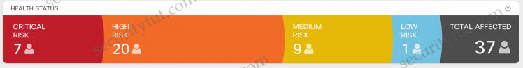
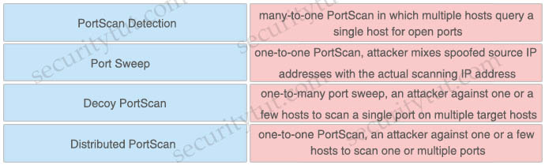
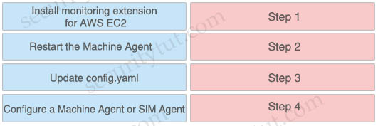

# Quiz Set 5

## 17. Security Products & Solutions

Quick summary

- StealWatch: performs security analytics by collecting network flows via NetFlow
- ESA: email security solution which protects against email threats like ransomware, business email compromise, phishing, whaling, and many other email-driven attacks
- AMP for Endpoints (AMP4E): provides malware protection on endpoints
- Umbrella: provides DNS protection by blocking malicious destinations using DNS
- Firepower Threat Defense (FTD): provides a comprehensive suite of security features such as firewall capabilities, monitoring, alerts, Intrusion Detection System (IDS) and Intrusion Prevention System (IPS).
- Cisco Cloudlock: Secure your cloud users, data, and applications with the cloud-native CASB and cloud cybersecurity platform. Cisco Cloudlock provides visibility and compliance checks, protects data against misuse and exfiltration, and provides threat protections against malware like ransomware.

**Cisco SteathWatch**

Stealthwatch is the visibility and security analytics solution that collects and analyzes network data from the existing network infrastructure. Stealthwatch analyzes industry standard NetFlow data from Cisco and other vendors Routers, Switches, Firewalls, and other network devices to detect advanced and persistent security threats such as internally spreading malware, data leakage, botnet command and control traffic and network reconnaissance.

The Cisco Identity Services Engine (ISE) solution supplements Stealthwatch NetFlowbased behavioral threat detection data with contextual information such as user identity, user authorization level, device-type, and posture. Together Stealthwatch and Cisco ISE present network security analysts with a view integrating NetFlow data and contextual information enabling the security analyst to detect and discern the potential severity of threats in a timely, efficient, and cost-effective manner.

Stealthwatch components include:
- Stealthwatch Management Console: security management system that allows network administrators to define, configure, and monitor multiple distributed Stealthwatch Flow Collectors from a single location. It uses graphical representations of network traffic, identity information, customized summary reports, and integrated security and network intelligence for comprehensive analysis.
- Flow Collector: leverages enterprise telemetry such as NetFlow, IPFIX (Internet Protocol Flow Information Export), and other types of flow data from existing infrastructure such as routers, switches, firewalls, endpoints, and other network infrastructure devices. The Flow Collector can also receive and collect telemetry from proxy data sources, which can be analyzed by the cloud-based, multilayered machine learning engine, Cognitive Intelligence, for deep visibility into both web and network traffic.
- Flow Sensor (optional): produces telemetry for segments of the switching and routing infrastructure that can’t generate NetFlow natively. It also provides visibility into the application layer data and provides additional security context to enhance the Stealthwatch security analytics. It can analyze encrypted traffic.
- UDP Director: simplifies the collection and distribution of network and security data across the enterprise. It helps reduce the processing power on network routers and switches by receiving essential network and security information from multiple locations and then forwarding it to a single data stream to one or more destinations.

<figure style="margin: 0.5em; display: flex; justify-content: center; align-items: center;">
  
</figure>

Stealthwatch offers different deployment models:
- On-premises as a hardware appliance or a virtual machine called Stealthwatch Enterprise
- Cloud-delivered as a software-as-a-service (SaaS) solution called Stealthwatch Cloud.

Cisco Stealthwatch Cloud: Available as an SaaS product offer to provide visibility and threat detection within public cloud infrastructures such as Amazon Web Services (AWS), Microsoft Azure, and Google Cloud Platform (GCP).

**Cisco Cognitive Threat Analytics** helps you quickly detect and respond to sophisticated, clandestine attacks that are already under way or are attempting to establish a presence within your environment. The solution automatically identifies and investigates suspicious or malicious web-based traffic. It identifies both potential and confirmed threats, allowing you to quickly remediate the infection and reduce the scope and damage of an attack, whether it’s a known threat campaign that has spread across multiple organizations or a unique threat you’ve never seen before.

<figure style="margin: 0.5em; display: flex; justify-content: center; align-items: center;">
  
</figure>

- Question 1

  How does Cisco Stealthwatch Cloud provide security for cloud environments?

  A. It delivers visibility and threat detection. 
  B. It prevents exfiltration of sensitive data. 
  C. It assigns Internet-based DNS protection for clients and servers. 
  D. It facilitates secure connectivity between public and private networks. 

  Answer: A

  Explanation

  Cisco Stealthwatch Cloud: Available as an SaaS product offer to provide visibility and threat detection within public cloud infrastructures such as Amazon Web Services (AWS), Microsoft Azure, and Google Cloud Platform (GCP).

- Question 2

  What are two Detection and Analytics Engines of Cognitive Threat Analytics? (Choose two)

  A. data exfiltration 
  B. command and control communication 
  C. intelligent proxy 
  D. snort 
  E. URL categorization 

  Answer: A B

  Explanation

  Cisco Cognitive Threat Analytics helps you quickly detect and respond to sophisticated, clandestine attacks that are already under way or are attempting to establish a presence within your environment. The solution automatically identifies and investigates suspicious or malicious web-based traffic. It identifies both potential and confirmed threats, allowing you to quickly remediate the infection and reduce the scope and damage of an attack, whether it’s a known threat campaign that has spread across multiple organizations or a unique threat you’ve never seen before.

  Detection and analytics features provided in Cognitive Threat Analytics are shown below:
  - Data exfiltration: Cognitive Threat Analytics uses statistical modeling of an organization’s network to identify anomalous web traffic and pinpoint the exfiltration of sensitive data. It recognizes data exfiltration even in HTTPS-encoded traffic, without any need for you to decrypt transferred content
  - Command-and-control (C2) communication: Cognitive Threat Analytics combines a wide range of data, ranging from statistics collected on an Internet-wide level to host-specific local anomaly scores. Combining these indicators inside the statistical detection algorithms allows us to distinguish C2 communication from benign traffic and from other malicious activities. Cognitive Threat Analytics recognizes C2 even in HTTPS-encoded or anonymous traffic, including Tor, without any need to decrypt transferred content, detecting a broad range of threats
  …

  Reference: https://www.cisco.com/c/dam/en/us/products/collateral/security/cognitive-threat-analytics/at-a-glance-c45-736555.pdf

- Question 3

  Which network monitoring solution uses streams and pushes operational data to provide a near real-time view of activity?

  A. SNMP 
  B. SMTP 
  C. syslog 
  D. model-driven telemetry 

  Answer: D

  Explanation

  The traditional use of the pull model, where the client requests data from the network does not scale when what you want is near real-time data. Moreover, in some use cases, there is the need to be notified only when some data changes, like interfaces status, protocol neighbors change etc.

  Model-Driven Telemetry is a new approach for network monitoring in which data is streamed from network devices continuously using a push model and provides near real-time access to operational statistics. Applications can subscribe to specific data items they need, by using standard-based YANG data models over NETCONF-YANG. Cisco IOS XE streaming telemetry allows to push data off of the device to an external collector at a much higher frequency, more efficiently, as well as data on-change streaming.

  Reference: https://developer.cisco.com/docs/ios-xe/#!streaming-telemetry-quick-start-guide

- Question 4

  What provides visibility and awareness into what is currently occurring on the network?

  A. CMX 
  B. WMI 
  C. Prime Infrastructure 
  D. Telemetry 

  Answer: D

  Explanation

  Telemetry – Information and/or data that provides awareness and visibility into what is occurring on the network at any given time from networking devices, appliances, applications or servers in which the core function of the device is not to generate security alerts designed to detect unwanted or malicious activity from computer networks.

  Reference: https://www.cisco.com/c/dam/en_us/about/doing_business/legal/service_descriptions/docs/active-threat-analytics-premier.pdf

- Question 5

  What can be integrated with Cisco Threat Intelligence Director to provide information about security threats, which allows the SOC to proactively automate responses to those threats?

  A. Cisco Umbrella 
  B. External Threat Feeds 
  C. Cisco Threat Grid 
  D. Cisco Stealthwatch 

  Answer: B

  Explanation

  Cisco Threat Intelligence Director (CTID) can be integrated with existing Threat Intelligence Platforms (ThreatQ, AlienVault, Infoblox etc) deployed by your organization to ingest threat intelligence automatically.

  Reference: https://blogs.cisco.com/developer/automate-threat-intelligence-using-cisco-threat-intelligence-director

  Note: ThreatQ, AlienVault, Infoblox etc are external Threat Intelligence Platforms

- Question 6

  Which solution combines Cisco IOS and IOS XE components to enable administrators to recognize applications, collect and send network metrics to Cisco Prime and other third-party management tools, and prioritize application traffic?

  A. Cisco Security Intelligence 
  B. Cisco Application Visibility and Control 
  C. Cisco Model Driven Telemetry 
  D. Cisco DNA Center 

  Answer: B

  Explanation

  The Cisco Application Visibility and Control (AVC) solution leverages multiple technologies to recognize, analyze, and control over 1000 applications, including voice and video, email, file sharing, gaming, peer-to-peer (P2P), and cloud-based applications. AVC combines several Cisco IOS/IOS XE components, as well as communicating with external tools, to integrate the following functions into a powerful solution…

  Reference: https://www.cisco.com/c/en/us/td/docs/ios/solutions_docs/avc/guide/avc-user-guide/avc_tech_overview.html

- Question 7

  Which two activities can be done using Cisco DNA Center? (Choose two)

  A. DHCP 
  B. Design 
  C. Accounting 
  D. DNS 
  E. Provision 

  Answer: B E

  Explanation

  Cisco DNA Center has four general sections aligned to IT workflows:

  Design: Design your network for consistent configurations by device and by site. Physical maps and logical topologies help provide quick visual reference. The direct import feature brings in existing maps, images, and topologies directly from Cisco Prime Infrastructure and the Cisco Application Policy Infrastructure Controller Enterprise Module (APIC-EM), making upgrades easy and quick. Device configurations by site can be consolidated in a “golden image” that can be used to automatically provision new network devices. These new devices can either be pre-staged by associating the device details and mapping to a site. Or they can be claimed upon connection and mapped to the site.

  Policy: Translate business intent into network policies and apply those policies, such as access control, traffic routing, and quality of service, consistently over the entire wired and wireless infrastructure. Policy-based access control and network segmentation is a critical function of the Cisco Software-Defined Access (SD-Access) solution built from Cisco DNA Center and Cisco Identity Services Engine (ISE). Cisco AI Network Analytics and Cisco Group-Based Policy Analytics running in the Cisco DNA Center identify endpoints, group similar endpoints, and determine group communication behavior. Cisco DNA Center then facilitates creating policies that determine the form of communication allowed between and within members of each group. ISE then activates the underlying infrastructure and segments the network creating a virtual overlay to follow these policies consistently. Such segmenting implements zero-trust security in the workplace, reduces risk, contains threats, and helps verify regulatory compliance by giving endpoints just the right level of access they need.

  Provision: Once you have created policies in Cisco DNA Center, provisioning is a simple drag-and-drop task. The profiles (called scalable group tags or “SGTs”) in the Cisco DNA Center inventory list are assigned a policy, and this policy will always follow the identity. The process is completely automated and zero-touch. New devices added to the network are assigned to an SGT based on identity—greatly facilitating remote office setups.

  Assurance: Cisco DNA Assurance, using AI/ML, enables every point on the network to become a sensor, sending continuous streaming telemetry on application performance and user connectivity in real time. The clean and simple dashboard shows detailed network health and flags issues. Then, guided remediation automates resolution to keep your network performing at its optimal with less mundane troubleshooting work. The outcome is a consistent experience and proactive optimization of your network, with less time spent on troubleshooting tasks.

  Reference: https://www.cisco.com/c/en/us/products/collateral/cloud-systems-management/dna-center/nb-06-dna-center-so-cte-en.html

- Question 8

  What must be used to share data between multiple security products?

  A. Cisco Rapid Threat Containment 
  B. Cisco Platform Exchange Grid 
  C. Cisco Advanced Malware Protection 
  D. Cisco Stealthwatch Cloud 

  Answer: B

- Question 9

  Which Cisco product is open, scalable, and built on IETF standards to allow multiple security products from Cisco and other vendors to share data and interoperate with each other?

  A. Advanced Malware Protection 
  B. Platform Exchange Grid 
  C. Multifactor Platform Integration 
  D. Firepower Threat Defense 

  Answer: B

  Explanation

  With Cisco pxGrid (Platform Exchange Grid), your multiple security products can now share data and work together. This open, scalable, and IETF standards-driven platform helps you automate security to get answers and contain threats faster.

- Question 10

  What is a feature of the open platform capabilities of Cisco DNA Center?

  A. intent-based APIs 
  B. automation adapters 
  C. domain integration 
  D. application adapters 

  Answer: A

- Question 11

  What is the function of the Context Directory Agent?

  A. maintains users’ group memberships 
  B. relays user authentication requests from Web Security Appliance to Active Directory 
  C. reads the Active Directory logs to map IP addresses to usernames 
  D. accepts user authentication requests on behalf of Web Security Appliance for user identification 

  Answer: C

  Explanation

  Cisco Context Directory Agent (CDA) is a mechanism that maps IP Addresses to usernames in order to allow security gateways to understand which user is using which IP Address in the network, so those security gateways can now make decisions based on those users (or the groups to which the users belong to).

  CDA runs on a Cisco Linux machine; monitors in real time a collection of Active Directory domain controller (DC) machines for authentication-related events that generally indicate user logins; learns, analyzes, and caches mappings of IP Addresses and user identities in its database; and makes the latest mappings available to its consumer devices.

  Reference: https://www.cisco.com/c/en/us/td/docs/security/ibf/cda_10/Install_Config_guide/cda10/cda_oveviw.html

## 18. Drag Drop

- Question 1

  Drag and drop the Firepower Next Generation Intrusion Prevention System detectors from the left onto the correct definitions on the right.

  <figure style="margin: 0.5em; display: flex; justify-content: center; align-items: center;">
    
  </figure>

  Answer:
  - PortScan Detection: one-to-one PortScan, an attacker against one or a few hosts to scan one or multiple ports
  - Port Sweep: one-to-many port sweep, an attacker against one or a few hosts to scan a single port on multiple target hosts
  - Decoy PortScan: one-to-one PortScan, attacker mixes spoofed source IP addresses with the actual scanning IP address
  - Distributed PortScan: many-to-one PortScan in which multiple hosts query a single host for open ports

- Question 2

  Drag and drop the capabilities from the left onto the correct technologies on the right.

  <figure style="margin: 0.5em; display: flex; justify-content: center; align-items: center;">
    
  </figure>

  Answer:
  - Next Generation Intrusion Prevention System: superior threat prevention and mitigation for known and unknown threats
  - Application control and URL filtering: application-layer control and ability to enforce usage and tailor detection policies based on custom applications and URLs
  - Cisco Web Security Appliance: combined integrated solution of strong defense and web protection, visibility, and controling solutions
  - Advanced Malware Protection: detection, blocking, tracking, analysis, and remediation to protect against targeted persistent malware attacks

- Question 3

  Drag and drop the descriptions from the left onto the correct protocol versions on the right.

  <figure style="margin: 0.5em; display: flex; justify-content: center; align-items: center;">
    
  </figure>

  Answer:
  - IKEv1:
    - uses six packets in main mode to establish phase 1
    - uses three packets in aggressive mode to establish phase
  - IKEv2:
  - standard includes NAT-T
  - uses four packets to establish phase 1 and phase 2
  - uses EAP for authenticating remote access clients

- Question 4

  Drag and drop the steps from the left into the correct order on the right to enable AppDynamics to monitor an EC2 instance in Amazon Web Services.

  <figure style="margin: 0.5em; display: flex; justify-content: center; align-items: center;">
    
  </figure>

  Answer:
  - Step 1: Configure a Machine Agent or SIM Agent
  - Step 2: Install monitoring extension for AWS EC2
  - Step 3: Update config.yaml
  - Step 4: Restart the Machine Agent

