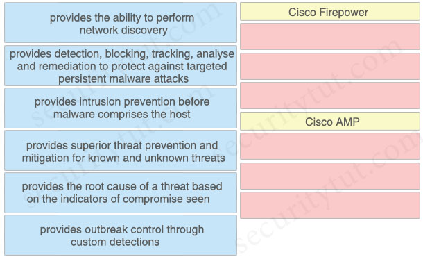
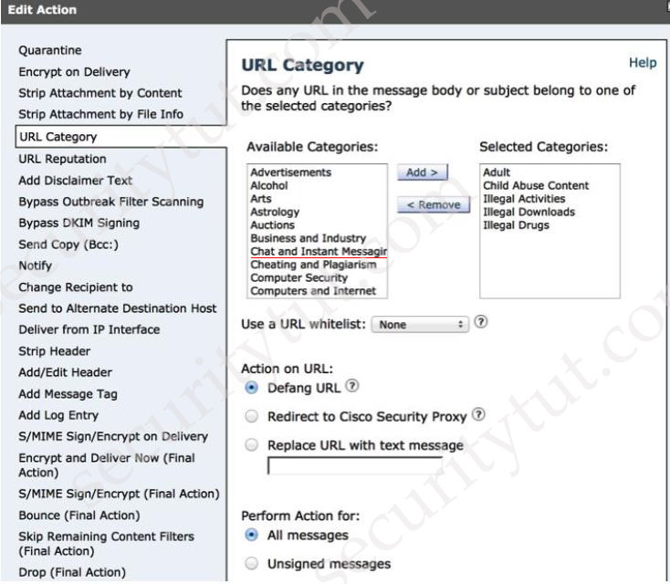
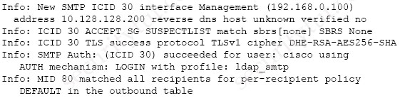
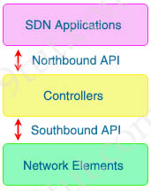
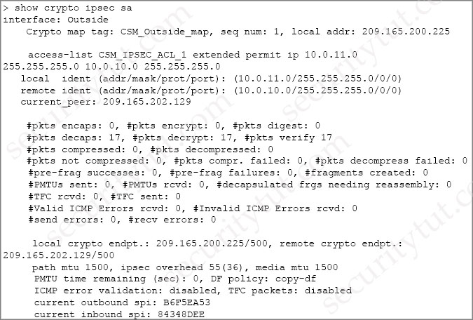
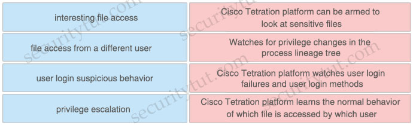
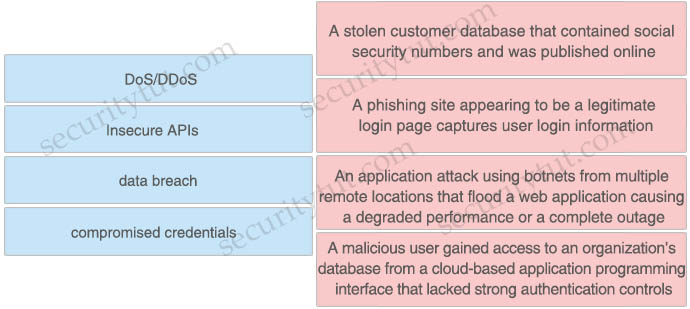
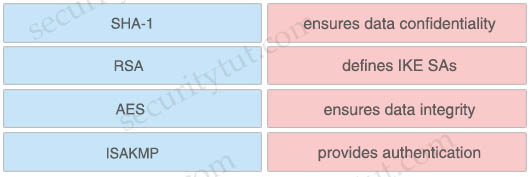

# Quiz Set 6


## 19. New Questions - Part 1


- <span style="color: #008888; font-weight: bold;">Question 1</span>

  What is a characteristic of a bridge group in ASA Firewall transparent mode?

  A. It includes multiple interfaces and access rules between interfaces are customizable<br>
  B. It is a Layer 3 segment and includes one port and customizable access rules<br>
  C. It allows ARP traffic with a single access rule<br>
  D. It has an IP address on its BVI interface and is used for management traffic<br>

  Answer: A

  Explanation

  A <span style="color: #bb6600;">bridge group</span> is a group of interfaces that the ASA bridges instead of routes. Bridge groups are only supported in Transparent Firewall Mode. Like any other firewall interfaces, access control between interfaces is controlled, and all of the usual firewall checks are in place.

  Each bridge group includes a Bridge Virtual Interface (BVI). The ASA uses the BVI IP address as the source address for packets originating from the bridge group. The BVI IP address must be on the same subnet as the bridge group member interfaces. The BVI does not support traffic on secondary networks; only traffic on the same network as the BVI IP address is supported.

  You can include multiple interfaces per bridge group. If you use more than 2 interfaces per bridge group, you can control communication between multiple segments on the same network, and not just between inside and outside. For example, if you have three inside segments that you do not want to communicate with each other, you can put each segment on a separate interface, and only allow them to communicate with the outside interface. Or you can customize the access rules between interfaces to allow only as much access as desired.

  Reference: [Cisco ASA Series General Operations CLI Configuration Guide, 9.7](https://www.cisco.com/c/en/us/td/docs/security/asa/asa97/configuration/general/asa-97-general-config/intro-fw.html#id_37129)

  Note: BVI interface is not used for management purpose. But we can add a separate Management slot/port interface that is not part of any bridge group, and that allows only management traffic to the ASA.


- <span style="color: #008888; font-weight: bold;">Question 2</span>

  When Cisco and other industry organizations publish and inform users of known security findings and vulnerabilities, which name is used?

  A. Common Security Exploits<br>
  B. Common Vulnerabilities and Exposures<br>
  C. Common Exploits and Vulnerabilities<br>
  D. Common Vulnerabilities, Exploits and Threats<br>

  Answer: B

  Explanation

  Vendors, security researchers, and vulnerability coordination centers typically assign vulnerabilities an identifier that’s disclosed to the public. This identifier is known as the Common Vulnerabilities and Exposures (CVE). CVE is an industry-wide standard. CVE is sponsored by US-CERT, the office of Cybersecurity and Communications at the U.S. Department of Homeland Security.

  The goal of CVE is to make it’s easier to share data across tools, vulnerability repositories, and security services.

  Reference: CCNP And CCIE Security Core SCOR 350-701 Official Cert Guide


- <span style="color: #008888; font-weight: bold;">Question 3</span>

  Which two fields are defined in the NetFlow flow? (Choose two)

  A. type of service byte<br>
  B. class of service bits<br>
  C. Layer 4 protocol type<br>
  D. destination port<br>
  E. output logical interface<br>

  Answer: A D

  Explanation

  Cisco standard NetFlow version 5 defines a flow as a unidirectional sequence of packets that all share seven values which define a unique key for the flow:
  - Ingress interface (SNMP ifIndex)
  - Source IP address
  - Destination IP address
  - IP protocol
  - Source port for UDP or TCP, 0 for other protocols
  - Destination port for UDP or TCP, type and code for ICMP, or 0 for other protocols
  - IP Type of Service

  Note: A flow is a unidirectional series of packets between a given source and destination.


- <span style="color: #008888; font-weight: bold;">Question 4</span>

  What provides the ability to program and monitor networks from somewhere other than the DNAC GUI?

  A. NetFlow<br>
  B. desktop client<br>
  C. ASDM<br>
  D. API<br>

  Answer: D


- <span style="color: #008888; font-weight: bold;">Question 5</span>

  Drag and drop the capabilities of Cisco Firepower versus Cisco AMP from the left into the appropriate category on the right.

  <figure style="margin: 0.5em; display: flex; justify-content: center; align-items: center;">
    
  </figure>

  Answer:
  - Cisco FirePower
    - (A) provides the ability to perform network discovery
    - (C) provides intrusion prevention before malware comprises the host
    - (D) provides superior threat prevention and mitigation for known and unknown threats
  - Cisco AMP
    - (B) provides detection, blocking, tracking, analyse and remediation to protect against targeted persistent malware attacks
    - (E) provides the root cause of a threat based on the indicators of compromise seen 
    - (F) provides outbreak control through custom detections

  Explanation

  The Firepower System uses network discovery and identity policies to collect host, application, and user data for traffic on your network. You can use certain types of discovery and identity data to build a comprehensive map of your network assets, perform forensic analysis, behavioral profiling, access control, and mitigate and respond to the vulnerabilities and exploits to which your organization is susceptible.

  The Cisco Advanced Malware Protection (AMP) solution enables you to detect and block malware, continuously analyze for malware, and get retrospective alerts. AMP for Networks delivers network-based advanced malware protection that goes beyond point-in-time detection to protect your organization across the entire attack continuum – before, during, and after an attack. Designed for Cisco Firepower network threat appliances, AMP for Networks detects, blocks, tracks, and contains malware threats across multiple threat vectors within a single system. It also provides the visibility and control necessary to protect your organization against highly sophisticated, targeted, zero‑day, and persistent advanced malware threats.

  Note:

  Before an attack, AMP uses global threat intelligence from Cisco’s Talos Security Intelligence and Research Group and Threat Grid’s threat intelligence feeds to strengthen defenses and protect against known and emerging threats.

  Detecting targeted, persistent malware attacks is a bigger problem than a single point-in-time control or product can effectively address on its own. Advanced malware protection requires an integrated set of controls and a continuous process to detect, confirm, track, analyze, and remediate these threats – before, during, and after an attack.

  Reference: [Buyer’s Criteria for Advanced Malware Protection](https://www.cisco.com/c/dam/global/shared/assets/pdf/sc/sec_amp_guide_cte_env_etmg_en.pdf)


- <span style="color: #008888; font-weight: bold;">Question 6</span>

  An organization has two machines hosting web applications. Machine 1 is vulnerable to SQL injection while machine 2 is vulnerable to buffer overflows. What action would allow the attacker to gain access to machine 1 but not machine 2?

  A. sniffing the packets between the two hosts<br>
  B. sending continuous pings<br>
  C. overflowing the buffer’s memory<br>
  D. inserting malicious commands into the database<br>

  Answer: D


- <span style="color: #008888; font-weight: bold;">Question 7</span>

  An organization is trying to improve their Defense in Depth by blocking malicious destinations prior to a connection being established. The solution must be able to block certain applications from being used within the network. Which product should be used to accomplish this goal?

  A. Cisco Firepower<br>
  B. Cisco Umbrella<br>
  C. ISE<br>
  D. AMP<br>

  Answer: B

  Explanation

  Cisco Umbrella protects users from accessing malicious domains by proactively analyzing and blocking unsafe destinations – before a connection is ever made. Thus it can protect from phishing attacks by blocking suspicious domains when users click on the given links that an attacker sent.


- <span style="color: #008888; font-weight: bold;">Question 8</span>

  A company is experiencing exfiltration of credit card numbers that are not being stored on-premise. The company needs to be able to protect sensitive data throughout the full environment. Which tool should be used to accomplish this goal?

  A. Security Manager<br>
  B. Cloudlock<br>
  C. Web Security Appliance<br>
  D. Cisco ISE<br>

  Answer: B

  Explanation

  Cisco Cloudlock is a cloud-native cloud access security broker (CASB) that helps you move to the cloud safely. It protects your cloud users, data, and apps. Cisco Cloudlock provides visibility and compliance checks, protects data against misuse and exfiltration, and provides threat protections against malware like ransomware.


- <span style="color: #008888; font-weight: bold;">Question 9</span>

  An engineer is trying to securely connect to a router and wants to prevent insecure algorithms from being used. However, the connection is failing. Which action should be taken to accomplish this goal?

  A. Disable telnet using the `no ip telnet` command.<br>
  B. Enable the SSH server using the `ip ssh server` command.<br>
  C. Configure the port using the `ip ssh port 22` command.<br>
  D. Generate the RSA key using the `crypto key generate rsa` command.<br>

  Answer: D

  Explanation

  In this question, the engineer was trying to secure the connection so maybe he was trying to allow SSH to the device. But maybe something went wrong so the connection was failing (the connection used to be good). So maybe he was missing the “`crypto key generate rsa`” command.


- <span style="color: #008888; font-weight: bold;">Question 10</span>

  A network administrator is using the Cisco ESA with AMP to upload files to the cloud for analysis. The network is congested and is affecting communication. How will the Cisco ESA handle any files which need analysis?

  A. AMP calculates the SHA-256 fingerprint, caches it, and periodically attempts the upload.<br>
  B. The file is queued for upload when connectivity is restored.<br>
  C. The file upload is abandoned.<br>
  D. The ESA immediately makes another attempt to upload the file.<br>

  Answer: C

  Explanation

  The appliance will try once to upload the file; if upload is not successful, for example because of connectivity problems, the file may not be uploaded. If the failure was because the file analysis server was overloaded, the upload will be attempted once more.

  Reference: [Verifying File Analysis Uploads on ESA](https://www.cisco.com/c/en/us/support/docs/security/email-security-appliance/118796-technote-esa-00.html)

  In this question, it stated “the network is congested” (not the file analysis server was overloaded) so the appliance will not try to upload the file again.


- <span style="color: #008888; font-weight: bold;">Question 11</span>

  Which type of algorithm provides the highest level of protection against brute-force attacks?

  A. PFS<br>
  B. HMAC<br>
  C. MD5<br>
  D. SHA<br>

  Answer: D


- <span style="color: #008888; font-weight: bold;">Question 12</span>

  What must be configured in Cisco ISE to enforce reauthentication of an endpoint session when an endpoint is deleted from an identity group?

  A. posture assessment<br>
  B. CoA<br>
  C. external identity source<br>
  D. SNMP probe<br>

  Answer: B

  Explanation

  Cisco ISE allows a global configuration to issue a Change of Authorization (CoA) in the Profiler Configuration page that enables the profiling service with more control over endpoints that are already authenticated.

  One of the settings to configure the CoA type is “Reauth”. This option is used to enforce reauthentication of an already authenticated endpoint when it is profiled.

  Reference: [Configuring Profiler Policies](https://www.cisco.com/en/US/docs/security/ise/1.0/user_guide/ise10_prof_pol.html#wp1340649)


- <span style="color: #008888; font-weight: bold;">Question 13</span>

  A network administrator is configuring a rule in an access control policy to block certain URLs and selects the “Chat and Instant Messaging” category. Which reputation score should be selected to accomplish this goal?

  A. 1<br>
  B. 3<br>
  C. 5<br>
  D. 10<br>

  Answer: D

  Explanation

  We choose “Chat and Instant Messaging” category in “URL Category”:

  <figure style="margin: 0.5em; display: flex; justify-content: center; align-items: center;">
    
  </figure>
  

  To block certain URLs we need to choose URL Reputation from 6 to 10.

  <figure style="margin: 0.5em; display: flex; justify-content: center; align-items: center;">
    
  </figure>
  


- <span style="color: #008888; font-weight: bold;">Question 14</span>

  Which group within Cisco writes and publishes a weekly newsletter to help cybersecurity professionals remain aware of the ongoing and most prevalent threats?

  A. PSIRT<br>
  B. Talos<br>
  C. CSIRT<br>
  D. DEVNET<br>

  Answer: B

  Explanation

  Talos Threat Source is a regular intelligence update from Cisco Talos, highlighting the biggest threats each week and other security news.

  Reference: [Talos Newletters](https://talosintelligence.com/newsletters)


- <span style="color: #008888; font-weight: bold;">Question 15</span>

  What are the two types of managed Intercloud Fabric deployment models? (Choose two)

  A. Service Provider managed<br>
  B. Public managed<br>
  C. Hybrid managed<br>
  D. User managed<br>
  E. Enterprise managed<br>

  Answer: A E

  Explanation

  Many enterprises prefer to deploy development workloads in the public cloud, primarily for convenience and faster deployment. This approach can cause concern for IT administrators, who must control the flow of IT traffic and spending and help ensure the security of data and intellectual property. Without the proper controls, data and intellectual property can escape this oversight. The Cisco Intercloud Fabric solution helps control this shadow IT, discovering resources deployed in the public cloud outside IT control and placing these resources under Cisco Intercloud Fabric control.

  Cisco Intercloud Fabric addresses the cloud deployment requirements appropriate for two hybrid cloud deployment models: <span style="color: #bb6600;">Enterprise Managed</span> (an enterprise manages its own cloud environments) and <span style="color: #bb6600;">Service Provider Managed</span> (the service provider administers and controls all cloud resources).

  Reference: [Cisco Intercloud Fabric: Hybrid Cloud with Choice, Consistency, Control and Compliance](https://www.cisco.com/c/en/us/td/docs/solutions/Hybrid_Cloud/Intercloud/Intercloud_Fabric.pdf)

  The Cisco Intercloud Fabric architecture provides two product configurations to address the following two consumption models:
  - Cisco Intercloud Fabric for Business
  - Cisco Intercloud Fabric for Providers

  Reference: [Cisco Intercloud Fabric: Hybrid Cloud with Choice, Consistency, Control and Compliance](https://www.cisco.com/c/en/us/td/docs/solutions/Hybrid_Cloud/Intercloud/Intercloud_Fabric/Intercloud_Fabric_2.html)


- <span style="color: #008888; font-weight: bold;">Question 16</span>

  What are two DDoS attack categories? (Choose two)

  A. sequential<br>
  B. protocol<br>
  C. database<br>
  D. volume-based<br>
  E. screen-based<br>

  Answer: B D

  Explanation

  While DDoS offer a less complicated attack mode than other forms of cyberattacks, they are growing stronger and more sophisticated. There are three basic categories of attack:
  - <span style="color: #bb6600;">volume-based attacks</span>, which use high traffic to inundate the network bandwidth
  - <span style="color: #bb6600;">protocol attacks</span>, which focus on exploiting server resources
  - <span style="color: #bb6600;">application attacks</span>, which focus on web applications and are considered the most sophisticated and serious type of attacks

  Reference: [What are the Most Common Types of DDoS Attacks?](https://www.esecurityplanet.com/networks/types-of-ddos-attacks/)


- <span style="color: #008888; font-weight: bold;">Question 17</span>

  Refer to the exhibit.

  <figure style="margin: 0.5em; display: flex; justify-content: center; align-items: center;">
    
  </figure>  

  Which type of authentication is in use?

  A. LDAP authentication for Microsoft Outlook<br>
  B. POP3 authentication<br>
  C. SMTP relay server authentication<br>
  D. external user and relay mail authentication<br>

  Answer: D

  Explanation

  The TLS connections are recorded in the mail logs, along with other significant actions that are related to messages, such as filter actions, anti-virus and anti-spam verdicts, and delivery attempts. If there is a successful TLS connection, there will be a TLS success entry in the mail logs. Likewise, a failed TLS connection produces a TLS failed entry. If a message does not have an associated TLS entry in the log file, that message was not delivered over a TLS connection.

  Reference: [Comprehensive Setup Guide for TLS on ESA](https://www.cisco.com/c/en/us/support/docs/security/email-security-appliance/118844-technote-esa-00.html)

  The exhibit in this question shows a successful TLS connection from the remote host (reception) in the mail log.


- <span style="color: #008888; font-weight: bold;">Question 18</span>

  An organization received a large amount of SPAM messages over a short time period. In order to take action on the messages, it must be determined how harmful the messages are and this needs to happen dynamically. What must be configured to accomplish this?

  A. Configure the Cisco WSA to modify policies based on the traffic seen<br>
  B. Configure the Cisco ESA to receive real-time updates from Talos<br>
  C. Configure the Cisco WSA to receive real-time updates from Talos<br>
  D. Configure the Cisco ESA to modify policies based on the traffic seen<br>

  Answer: B

  Explanation

  In order to fight spams dynamically, the best way is to configure ESA to receive real-time updates from Talos.


- <span style="color: #008888; font-weight: bold;">Question 19</span>

  Which product allows Cisco FMC to push security intelligence observable to its sensors from other products?

  A. Encrypted Traffic Analytics<br>
  B. Threat Intelligence Director<br>
  C. Cognitive Threat Analytics<br>
  D. Cisco Talos Intelligence<br>

  Answer: B

  Explanation

  The Threat Intelligence Director operationalizes threat intelligence data, helping you aggregate intelligence data, configure defensive actions, and analyze threats in your environment. This feature is intended to supplement other Firepower functionality, offering an additional line of defense against threats.

  Reference: [Firepower Management Center Configuration Guide, Version 6.2.3](https://www.cisco.com/c/en/us/td/docs/security/firepower/623/configuration/guide/fpmc-config-guide-v623/cisco_threat_intelligence_director__tid_.html)


- <span style="color: #008888; font-weight: bold;">Question 20</span>

  What are two differences between a Cisco WSA that is running in transparent mode and one running in explicit mode? (Choose two)

  A. When the Cisco WSA is running in transparent mode, it uses the WSA’s own IP address as the HTTP request destination.<br>
  B. The Cisco WSA responds with its own IP address only if it is running in explicit mode.<br>
  C. The Cisco WSA is configured in a web browser only if it is running in transparent mode.<br>
  D. The Cisco WSA uses a Layer 3 device to redirect traffic only if it is running in transparent mode.<br>
  E. The Cisco WSA responds with its own IP address only if it is running in transparent mode.<br>

  Answer: B D

  Explanation

  The Cisco Web Security Appliance (WSA) includes a web proxy, a threat analytics engine, antimalware engine, policy management, and reporting in a single physical or virtual appliance. The main use of the Cisco WSA is to protect users from accessing malicious websites and being infected by malware.

  You can deploy the Cisco WSA in two different modes:
  - Explicit forward mode
  - Transparent mode

  In explicit forward mode, the client is configured to explicitly use the proxy, subsequently sending all web traffic to the proxy. Because the client knows there is a proxy and sends all traffic to the proxy in explicit forward mode, the client does not perform a DNS lookup of the domain before requesting the URL. The Cisco WSA is responsible for DNS resolution, as well.

  <figure style="margin: 0.5em; display: flex; justify-content: center; align-items: center;">
    
  </figure>

  When you configure the Cisco WSA in explicit mode, you do not need to configure any other network infrastructure devices to redirect client requests to the Cisco WSA. However, you must configure each client to send traffic to the Cisco WSA.

  -> <span style="text-decoration: line-through;">Therefore in explicit mode, WSA only checks the traffic between client & web server. WSA does not use its own IP address to request</span> -> <span style="text-decoration: line-through;">Answer B is not correct</span>.

  When the Cisco WSA is in transparent mode, clients do not know there is a proxy deployed. Network infrastructure devices are configured to forward traffic to the Cisco WSA. In transparent mode deployments, network infrastructure devices redirect web traffic to the proxy. Web traffic redirection can be done using policy-based routing (PBR)—available on many routers —or using Cisco’s Web Cache Communication Protocol (WCCP) on Cisco ASA, Cisco routers, or switches.

  The Web Cache Communication Protocol (WCCP), developed by Cisco Systems, specifies interactions between one or more routers (or Layer 3 switches) and one or more web-caches. The purpose of the interaction is to establish and maintain the transparent redirection of selected types of traffic flowing through a group of routers.

  Reference: [Web Cache Communications Protocol (WCCP)](https://www.cisco.com/c/en/us/tech/content-networking/web-cache-communications-protocol-wccp/index.html)

  ->Therefore answer D is correct as redirection can be done on Layer 3 device only.

  In transparent mode, the client is unaware its traffic is being sent to a proxy (Cisco WSA) and, as a result, the client uses DNS to resolve the domain name in the URL and send the web request destined for the web server (not the proxy). When you configure the Cisco WSA in transparent mode, you need to identify a network choke point with a redirection device (a Cisco ASA) to redirect traffic to the proxy.

  <figure style="margin: 0.5em; display: flex; justify-content: center; align-items: center;">
    
  </figure>

  Reference: CCNP And CCIE Security Core SCOR 350-701 Official Cert Guide

  When requests are being redirected to the WSA transparently, the WSA must pretend to be the OCS (origin content server), since the client is unaware of the existence of a proxy. On the contrary, if a request is explicitly sent to the WSA, the WSA will respond with it’s own IP information.

  -> Answer B is correct

  Reference: [Difference between Transparent and Forward proxy mode](https://www.cisco.com/c/en/us/support/docs/security/web-security-appliance/117940-qa-wsa-00.html)

  Answer C is surely not correct as WSA cannot be configured in a web browser in either mode.

  Answer A seems to be correct but it is not. This answer is correct if it states “When the Cisco WSA is running in transparent mode, it uses the WSA’s own IP address as the HTTP request source” (not destination).


- <span style="color: #008888; font-weight: bold;">Question 21</span>

  After a recent breach, an organization determined that phishing was used to gain initial access to the network before regaining persistence. The information gained from the phishing attack was a result of users visiting known malicious websites. What must be done in order to prevent this from happening in the future?

  A. Modify an access policy<br>
  B. Modify identification profiles<br>
  C. Modify outbound malware scanning policies<br>
  D. Modify web proxy settings<br>

  Answer: A

  Explanation

  URL conditions in access control rules allow you to limit the websites that users on your network can access. This feature is called <span style="color: #bb6600">URL filtering</span>. There are two ways you can use access control to specify URLs you want to block (or, conversely, allow):
  - With any license, you can manually specify individual URLs, groups of URLs, and URL lists and feeds to achieve granular, custom control over web traffic.
  - With a URL Filtering license, you can also control access to websites based on the URL’s general classification, or category, and risk level, or reputation. The system displays this category and reputation data in connection logs, intrusion events, and application details.

  Using category and reputation data also simplifies policy creation and administration. It grants you assurance that the system will control web traffic as expected. Finally, because Cisco’s threat intelligence is continually updated with new URLs, as well as new categories and risks for existing URLs, you can ensure that the system uses up-to-date information to filter requested URLs. Malicious sites that represent security threats such as malware, spam, botnets, and phishing may appear and disappear faster than you can update and deploy new policies.

  Reference: [Firepower Management Center Configuration Guide, Version 6.0](https://www.cisco.com/c/en/us/td/docs/security/firepower/60/configuration/guide/fpmc-config-guide-v60/Access_Control_Rules__URL_Filtering.html)


- <span style="color: #008888; font-weight: bold;">Question 22</span>

  What is the function of SDN southbound API protocols?

  A. to allow for the dynamic configuration of control plane applications<br>
  B. to enable the controller to make changes<br>
  C. to enable the controller to use REST<br>
  D. to allow for the static configuration of control plane applications<br>

  Answer: B

  Explanation

  Southbound APIs enable SDN controllers to dynamically make changes based on real-time demands and scalability needs.

  Reference: [Software-Defined Networking Security and Network Programmability](https://www.ciscopress.com/articles/article.asp?p=3004581&seqNum=2)

  <figure style="margin: 0.5em; display: flex; justify-content: center; align-items: center;">
    
  </figure>

  Note: Southbound APIs helps us communicate with data plane (not control plane) applications.


- <span style="color: #008888; font-weight: bold;">Question 23</span>

  Refer to the exhibit.

  <figure style="margin: 0.5em; display: flex; justify-content: center; align-items: center;">
    
  </figure>

  Traffic is not passing through IPsec site-to-site VPN on the Firepower Threat Defense appliance. What is causing this issue?

  A. No split-tunnel policy is defined on the Firepower Threat Defense appliance.<br>
  B. The access control policy is not allowing VPN traffic in.<br>
  C. Site-to-site VPN peers are using different encryption algorithms.<br>
  D. Site-to-site VPN preshared keys are mismatched.<br>

  Answer: B

  Explanation

  If sysopt permit-vpn is not enabled then an access control policy must be created to allow the VPN traffic through the FTD device. If sysopt permit-vpn is enabled skip creating an access control policy.

  Reference: [Site to Site VPN Configuration on FTD Managed by FMC](https://www.cisco.com/c/en/us/support/docs/security-vpn/ipsec-negotiation-ike-protocols/215470-site-to-site-vpn-configuration-on-ftd-ma.html)


- <span style="color: #008888; font-weight: bold;">Question 24</span>

  An attacker needs to perform reconnaissance on a target system to help gain access to it. The system has weak passwords, no encryption on the VPN links, and software bugs on the system’s applications. Which vulnerability allows the attacker to see the passwords being transmitted in clear text?

  A. weak passwords for authentication<br>
  B. unencrypted links for traffic<br>
  C. software bugs on applications<br>
  D. improper file security<br>

  Answer: B


- <span style="color: #008888; font-weight: bold;">Question 25</span>

  Using Cisco Firepower’s Security Intelligence policies, upon which two criteria is Firepower block based? (Choose two)

  A. URLs<br>
  B. protocol IDs<br>
  C. IP addresses<br>
  D. MAC addresses<br>
  E. port numbers<br>

  Answer: A C

  Explanation

  Security Intelligence Sources

  …

  - Custom Block lists or feeds (or objects or groups)

    Block specific IP addresses, URLs, or domain names using a manually-created list or feed (for IP addresses, you can also use network objects or groups.)

    For example, if you become aware of malicious sites or addresses that are not yet blocked by a feed, add these sites to a custom Security Intelligence list and add this custom list to the Block list in the Security Intelligence tab of your access control policy.

  Reference: [Firepower Management Center Configuration Guide, Version 6.2.3](https://www.cisco.com/c/en/us/td/docs/security/firepower/623/configuration/guide/fpmc-config-guide-v623/security_intelligence_blacklisting.html)


<hr>
- <span style="color: #008888; font-weight: bold;">Question 26</span>

  Which Cisco platform ensures that machines that connect to organizational networks have the recommended antivirus definitions and patches to help prevent an organizational malware outbreak?

  A. Cisco WiSM<br>
  B. Cisco ESA<br>
  C. Cisco ISE<br>
  D. Cisco Prime Infrastructure<br>


  Answer: C

  Explanation

  A posture policy is a collection of posture requirements, which are associated with one or more identity groups, and operating systems. We can configure ISE to check for the Windows patch at Work Centers > Posture > Posture Elements > Conditions > File.

  In this example, we are going to use the predefined file check to ensure that our Windows 10 clients have the critical security patch installed to prevent the Wanna Cry malware; and we can also configure ISE to update the client with this patch.

  <figure style="margin: 0.5em; display: flex; justify-content: center; align-items: center;">
    
  </figure>


- <span style="color: #008888; font-weight: bold;">Question 27</span>

  What are two benefits of Flexible NetFlow records? (Choose two)

  A. They allow the user to configure flow information to perform customized traffic identification<br>
  B. They provide attack prevention by dropping the traffic<br>
  C. They provide accounting and billing enhancements<br>
  D. They converge multiple accounting technologies into one accounting mechanism<br>
  E. They provide monitoring of a wider range of IP packet information from Layer 2 to 4<br>

  Answer: A D

  Explanation

  <span style="color: #bb6600;">Flexible NetFlow</span> is the next-generation in flow technology allowing optimization of the network infrastructure, reducing operation costs, improving capacity planning and security incident detection with increased flexibility and scalability.

  Key Advantages to using Flexible NetFlow:
  - Flexibility, scalability of flow data beyond traditional NetFlow
  - The ability to monitor a wider range of packet information producing new information about network behavior not available today
  - Enhanced network anomaly and security detection
  - User configurable flow information to perform customized traffic identification and the ability to focus and monitor specific network behavior (-> Therefore answer A is correct)
  - Convergence of multiple accounting technologies into one accounting mechanism (-> Therefore answer D is correct)
  Flexible NetFlow is integral part of Cisco IOS Software that collects and measures data allowing all routers or switches in the network to become a source of telemetry and a monitoring device. Flexible NetFlow allows extremely granular and accurate traffic measurements and high-level aggregated traffic collection. Because it is part of Cisco IOS Software, Flexible NetFlow enables Cisco product-based networks to perform traffic flow analysis without purchasing external probes–making traffic analysis economical on large IP networks.

  Reference: [Cisco IOS Flexible NetFlow](https://www.cisco.com/c/en/us/products/collateral/ios-nx-os-software/flexible-netflow/product_data_sheet0900aecd804b590b.html)

  Note: Although answer C seems to be correct, but it is the benefit of traditional NetFlow:

  <span style="color: #bb6600;">NetFlow</span> is a Cisco IOS technology that provides statistics on packets flowing through the router. NetFlow is the standard for acquiring IP operational data from IP networks.

  Flexible NetFlow improves on original NetFlow by adding the capability to customize the traffic analysis parameters for your specific requirements. 

  NetFlow is typically used for several key customer applications, including the following:

  …

  Billing and accounting. NetFlow data provides fine-grained metering (for instance, flow data includes details such as IP addresses, packet and byte counts, time stamps, type of service (ToS), and application ports) for highly flexible and detailed resource utilization accounting. Service providers may use the information for billing based on time of day, bandwidth usage, application usage, quality of service, and so on. Enterprise customers may use the information for departmental charge back or cost allocation for resource utilization.

  Reference: [Flexible Netflow Overview](https://www.cisco.com/c/en/us/td/docs/ios-xml/ios/fnetflow/configuration/15-mt/fnf-15-mt-book/fnf-fnetflow.html)

  Note: Traditional NetFlow allows us to monitor from Layer 2 to 4 but Flexible NetFlow goes beyond these layers.


- <span style="color: #008888; font-weight: bold;">Question 28</span>

  How does DNS Tunneling exfiltrate data?

  A. An attacker registers a domain that a client connects to based on DNS records and sends malware through that connection.<br>
  B. An attacker opens a reverse DNS shell to get into the client’s system and install malware on it.<br>
  C. An attacker uses a non-standard DNS port to gain access to the organization’s DNS servers in order to poison the resolutions.<br>
  D. An attacker sends an email to the target with hidden DNS resolvers in it to redirect them to a malicious domain.<br>

  Answer: A


- <span style="color: #008888; font-weight: bold;">Question 29</span>

  A user has a device in the network that is receiving too many connection requests from multiple machines. Which type of attack is the device undergoing?

  A. phishing<br>
  B. slowloris<br>
  C. pharming<br>
  D. SYN flood<br>

  Answer: D


- <span style="color: #008888; font-weight: bold;">Question 30</span>

  An organization is receiving SPAM emails from a known malicious domain. What must be configured in order to prevent the session during the initial TCP communication?

  A. Configure the Cisco ESA to drop the malicious emails<br>
  B. Configure policies to quarantine malicious emails<br>
  C. Configure policies to stop and reject communication<br>
  D. Configure the Cisco ESA to reset the TCP connection<br>

  Answer: C

  Explanation

  Each Mail Flow Policy has an access rule, such as `ACCEPT`, `REJECT`, `RELAY`, `CONTINUE`, and `TCPREFUSE`. A host that attempts to establish a connection to your ESA and matches a Sender Group using a `TCPREFUSE` access rule is not allowed to connect to your ESA. From the standpoint of the sending server, it will appear as if your server is unavailable. Most Mail Transfer Agents (MTAs) will retry frequently in this case, which will create more traffic then answering once with a clear hard bounce, for example, `REJECT`.

  A host that attempts to establish a connection to your ESA and encounters a `REJECT` will receive a 554 SMTP error (hard bounce).

  Reference: [On the ESA, What is the Difference between REJECT and TCPREFUSE?](https://www.cisco.com/c/en/us/support/docs/security/email-security-appliance/118007-configure-esa-00.html)

  Note: Answer A is not correct because ESA can only drop the malicious emails after receiving them, not during the initial TCP communication.


- <span style="color: #008888; font-weight: bold;">Question 31</span>

  A Cisco Firepower administrator needs to configure a rule to allow a new application that has never been seen on the network. Which two actions should be selected to allow the traffic to pass without inspection? (Choose two)

  A. permit<br>
  B. trust<br>
  C. reset<br>
  D. allow<br>
  E. monitor<br>

  Answer: B D

  Explanation

  Each rule also has an action, which determines whether you monitor, trust, block, or allow matching traffic.

  Note: With action “trust”, Firepower does not do any more inspection on the traffic. There will be no intrusion protection and also no file-policy on this traffic.

  Traffic is evaluated as follows:
  - Rule 1: <span style="color: #bb6600;">Monitor</span> evaluates traffic first. Monitor rules track and log network traffic. The system continues to match traffic against additional rules to determine <span style="text-decoration: underline;">whether to permit or deny it</span>. (However, see an important exception and caveat at Access Control Rule Monitor Action.) -> Answer E is not correct.
  - Rule 2: <span style="color: #bb6600;">Trust</span> evaluates traffic next. Matching traffic is allowed to pass to its destination <span style="text-decoration: underline;">without further inspection</span>, though it is still subject to identity requirements and rate limiting. Traffic that does not match continues to the next rule. -> Answer B is correct.
  - Rule 3: <span style="color: #bb6600;">Block</span> evaluates traffic third. Matching traffic is blocked without further inspection. Traffic that does not match continues to the final rule.
  - Rule 4: <span style="color: #bb6600;">Allow</span> is the final rule. For this rule, matching traffic is allowed; however, prohibited files, malware, intrusions, and exploits within that traffic are detected and blocked. Remaining non-prohibited, non-malicious traffic is allowed to its destination, though it is still subject to identity requirements and rate limiting. You can configure Allow rules that perform <span style="text-decoration: underline;">only file inspection, or only intrusion inspection, or neither</span>. -> depending on configuration, might be nor inspection -> Answer D is correct
  - <span style="color: #bb6600;">Default Action</span> handles all traffic that does not match any of the rules. In this scenario, the default action performs intrusion prevention before allowing non-malicious traffic to pass. In a different deployment, you might have a default action that trusts or blocks all traffic, without further inspection. (You cannot perform file or malware inspection on traffic handled by the default action.)

  Reference: [Firepower Management Center Configuration Guide, Version 6.1](https://www.cisco.com/c/en/us/td/docs/security/firepower/610/configuration/guide/fpmc-config-guide-v61/access_control_rules.html)


- <span style="color: #008888; font-weight: bold;">Question 32</span>

  An engineer needs behavioral analysis to detect malicious activity on the hosts, and is configuring the organization’s public cloud to send telemetry using the cloud provider’s mechanisms to a security device. Which mechanism should the engineer configure to accomplish this goal?

  A. mirror port<br>
  B. sFlow<br>
  C. NetFlow<br>
  D. VPC flow logs<br>

  Answer: D

  Explanation

  When you operate your own switches and routers, you have tools like mirror ports and NetFlow data, which can be used to analyze overall security and performance. In a cloud environment, these options have not been available.

  Now there’s a new option for Amazon Web Services (AWS) customers who operate virtual private cloud (VPC) networks. AWS recently introduced VPC Flow Logs, which facilitate logging of all the IP traffic to, from, and across your network. These logs are stored as records in special Amazon CloudWatch log groups and provide the same kind of information as NetFlow data.

  Reference: [Network Monitoring in AWS Virtual Private Cloud Environments At-a-Glance](https://www.cisco.com/c/en/us/products/collateral/security/stealthwatch-cloud/at-a-glance-c45-739851.html)


- <span style="color: #008888; font-weight: bold;">Question 33</span>

  An engineer has enabled LDAP accept queries on a listener. Malicious actors must be prevented from quickly identifying all valid recipients. What must be done on the Cisco ESA to accomplish this goal?

  A. Configure incoming content filters<br>
  B. Use Bounce Verification<br>
  C. Configure Directory Harvest Attack Prevention<br>
  D. Bypass LDAP access queries in the recipient access table<br>

  Answer: C

  Explanation

  A Directory Harvest Attack (DHA) is a technique used by spammers to find valid/existent email addresses at a domain either by using Brute force or by guessing valid e-mail addresses at a domain using different permutations of common username. Its easy for attackers to get hold of a valid email address if your organization uses standard format for official e-mail alias (for example: jsmith@example.com). We can configure DHA Prevention to prevent malicious actors from quickly identifying valid recipients.

  Note: Lightweight Directory Access Protocol (LDAP) is an Internet protocol that email programs use to look up contact information from a server, such as ClickMail Central Directory. For example, here’s an LDAP search translated into plain English: “Search for all people located in Chicago who’s name contains “Fred” that have an email address. Please return their full name, email, title, and description.”


- <span style="color: #008888; font-weight: bold;">Question 34</span>

  What is a feature of Cisco NetFlow Secure Event Logging for Cisco ASAs?

  A. Multiple NetFlow collectors are supported<br>
  B. Advanced NetFlow v9 templates and legacy v5 formatting are supported<br>
  C. Secure NetFlow connections are optimized for Cisco Prime Infrastructure<br>
  D. Flow-create events are delayed<br>

  Answer: D

  Explanation

  The ASA and ASASM implementations of NetFlow Secure Event Logging (NSEL) provide the following major functions:
  - Tracks flow-create, flow-teardown, and flow-denied events, and generates appropriate NSEL data records. 
  - Triggers flow-update events and generates appropriate NSEL data  records.
  - Defines and exports  templates that describe the progression of a flow. Templates  describe the format of  the  data  records  that  are exported through NetFlow.  Each event has several record  formats or templates associated with  it.
  - Tracks configured NSEL collectors and delivers templates and data records to these configured NSEL collectors through NetFlow over UDP only.
  - Sends template information periodically to NSEL collectors.  Collectors receive template definitions, normally before receiving flow records.
  - Filters NSEL events based on the traffic and event type through Modular Policy Framework, then sends records to different collectors. Traffic is matched based on the order in which  classes are configured.
  - Delays the export of flow-create events. -> Answer D is correct.

  Reference: [NetFlow Secure Event Logging (NSEL)](https://www.cisco.com/c/en/us/td/docs/security/asa/asa92/configuration/general/asa-general-cli/monitor-nsel.pdf)


- <span style="color: #008888; font-weight: bold;">Question 35</span>

  An engineer is configuring 802.1X authentication on Cisco switches in the network and is using CoA as a mechanism. Which port on the firewall must be opened to allow the CoA traffic to traverse the network?

  A. TCP 6514<br>
  B. UDP 1700<br>
  C. TCP 49<br>
  D. UDP 1812<br>

  Answer: B

  Explanation

  CoA Messages are sent on two different udp ports depending on the platform. Cisco standardizes on UDP port 1700, while the actual RFC calls out using UDP port 3799.


- <span style="color: #008888; font-weight: bold;">Question 36</span>

  Which public cloud provider supports the Cisco Next Generation Firewall Virtual?

  A. Google Cloud Platform<br>
  B. Red Hat Enterprise Visualization<br>
  C. VMware ESXi<br>
  D. Amazon Web Services<br>

  Answer: D

  Explanation

  Cisco Firepower NGFW Virtual (NGFWv) is the virtualized version of Cisco’s Firepower next generation firewall.

  The Cisco NGFW virtual appliance is available in the AWS and Azure marketplaces. In AWS, it can be deployed in routed and passive modes. Passive mode design requires ERSPAN, the Encapsulated Remote Switched Port Analyzer, which is currently not available in Azure.

  In passive mode, NGFWv inspects packets like an Intrusion Detection System (IDS) appliance, but no action can be taken on the packet.
  In routed mode NGFWv acts as a next hop for workloads. It can inspect packets and also take action on the packet based on rule and policy definitions.

  Reference: [Introduction to the Cisco ASAv](https://www.cisco.com/c/en/us/td/docs/security/asa/asa916/asav/getting-started/asav-916-gsg/asav_intro.html)


- <span style="color: #008888; font-weight: bold;">Question 37</span>

  Drag and drop the suspicious patterns for the Cisco Tetration platform from the left onto the correct definitions on the right.

  <figure style="margin: 0.5em; display: flex; justify-content: center; align-items: center;">
    
  </figure>

  Answer:
  - Cisco Tetration platform can be armed to look at sensitive files: (A) interesting file access
  - Watches for privilege changes in the process lineage tree: (D) privilege escalation
  - Cisco Tetration platform watches user login failures and user login methods: (C) user login suspicious behavior
  - Cisco Tetration platform learns the normal behavior of which file is accessed by which user: (B) file access from a different user

  Explanation

  Cisco Tetration platform studies the behavior of the various processes and applications in the workload, measuring them against known bad behavior sequences. It also factors in the process hashes it collects. By studying various sets of malwares, the Tetration Analytics engineering team deconstructed it back into its basic building blocks. Therefore, the platform understands clear and crisp definitions of these building blocks and watches for them.

  The various suspicious patterns for which the Cisco Tetration platform looks in the current release are:
  - <span style="color: #bb6600;">Shell code execution</span>: Looks for the patterns used by shell code.
  - <span style="color: #bb6600;">Privilege escalation</span>: Watches for privilege changes from a lower privilege to a higher privilege in the process lineage tree.
  - <span style="color: #bb6600;">Side channel attacks</span>: Cisco Tetration platform watches for cache-timing attacks and page table fault bursts. Using these, it can detect Meltdown, Spectre, and other cache-timing attacks.
  - <span style="color: #bb6600;">Raw socket creation</span>: Creation of a raw socket by a nonstandard process (for example, ping).
  - <span style="color: #bb6600;">User login suspicious </span>: Cisco Tetration platform watches user login failures and user login methods.
  - <span style="color: #bb6600;">Interesting file access</span>: Cisco Tetration platform can be armed to look at sensitive files.
  - <span style="color: #bb6600;">File access from a different user</span>: Cisco Tetration platform learns the normal behavior of which file is accessed by which user.
  - <span style="color: #bb6600;">Unseen command</span>: Cisco Tetration platform learns the behavior and set of commands as well as the lineage of each command over time. Any new command or command with a different lineage triggers the interest of the Tetration Analytics platform.

  Reference: [The Goldilocks Zone: Cloud Workload Protection White Paper](https://www.cisco.com/c/en/us/products/collateral/data-center-analytics/tetration-analytics/white-paper-c11-740380.html)


- <span style="color: #008888; font-weight: bold;">Question 38</span>

  What is the purpose of the My Devices Portal in a Cisco ISE environment?

  A. to register new laptops and mobile devices<br>
  B. to request a newly provisioned mobile device<br>
  C. to provision userless and agentless systems<br>
  D. to manage and deploy antivirus definitions and patches on systems owned by the end user<br>

  Answer: A

  Explanation

  Depending on your company policy, you might be able to use your mobile phones, tablets, printers, Internet radios, and other network devices on your company’s network. You can use the My Devices portal to register and manage these devices on your company’s network.

  Reference: [My Devices Portal FAQs, Release 2.x](https://www.cisco.com/c/en/us/td/docs/security/ise/2-4/mydevices/b_mydevices_2x.html)


- <span style="color: #008888; font-weight: bold;">Question 39</span>

  Refer to the exhibit.

  ```cfg
  ip dhcp snooping
  ip dhcp snooping vlan 41,44
  !
  interface GigabitEthernet1/0/1
  description Uplink_To_Distro_Switch_g1/0/11
  switchport trunk native vlan 999
  switchport trunk allowed vlan 40,41,44
  switchport mode trunk
  ```

  An organization is using DHCP Snooping within their network. A user on VLAN 41 on a new switch is complaining that an IP address is not being obtained. Which command should be configured on the switch interface in order to provide the user with network connectivity?

  A. `ip dhcp snooping verify mac-address`<br>
  B. `ip dhcp snooping limit 41`<br>
  C. `ip dhcp snooping vlan 41`<br>
  D. `ip dhcp snooping trust`<br>

  Answer: D

  Explanation

  To understand DHCP snooping we need to learn about DHCP spoofing attack first.

  <figure style="margin: 0.5em; display: flex; justify-content: center; align-items: center;">
    
  </figure>

  DHCP spoofing is a type of attack in that the attacker listens for DHCP Requests from clients and answers them with fake DHCP Response before the authorized DHCP Response comes to the clients. The fake DHCP Response often gives its IP address as the client default gateway -> all the traffic sent from the client will go through the attacker computer, the attacker becomes a “man-in-the-middle”.

  The attacker can have some ways to make sure its fake DHCP Response arrives first. In fact, if the attacker is “closer” than the DHCP Server then he doesn’t need to do anything. Or he can DoS the DHCP Server so that it can’t send the DHCP Response.

  DHCP snooping can prevent DHCP spoofing attacks. DHCP snooping is a Cisco Catalyst feature that determines which switch ports can respond to DHCP requests. Ports are identified as trusted and untrusted.

  <figure style="margin: 0.5em; display: flex; justify-content: center; align-items: center;">
    
  </figure>

  Only ports that connect to an authorized DHCP server are trusted, and allowed to send all types of DHCP messages. All other ports on the switch are untrusted and can send only DHCP requests. If a DHCP response is seen on an untrusted port, the port is shut down.

  The port connected to a DHCP server should be configured as trusted port with the “`ip dhcp snooping trust`” command. Other ports connecting to hosts are untrusted ports by default.

  In this question, we need to configure the uplink to “trust” (under interface Gi1/0/1) as shown below.

  <figure style="margin: 0.5em; display: flex; justify-content: center; align-items: center;">
    
  </figure>


- <span style="color: #008888; font-weight: bold;">Question 40</span>

  What is the purpose of the certificate signing request when adding a new certificate for a server?

  A. It is the password for the certificate that is needed to install it with.<br>
  B. It provides the server information so a certificate can be created and signed<br>
  C. It provides the certificate client information so the server can authenticate against it when installing<br>
  D. It is the certificate that will be loaded onto the server<br>

  Answer: B

  Explanation

  A certificate signing request (CSR) is one of the first steps towards getting your own SSL Certificate. Generated on the same server you plan to install the certificate on, the CSR contains information (e.g. common name, organization, country) that the Certificate Authority (CA) will use to create your certificate. It also contains the public key that will be included in your certificate and is signed with the corresponding private key.


- <span style="color: #008888; font-weight: bold;">Question 41</span>

  What is the Cisco API-based broker that helps reduce compromises, application risks, and data breaches in an environment that is not on-premise?

  A. Cisco Cloudlock<br>
  B. Cisco Umbrella<br>
  C. Cisco AMP<br>
  D. Cisco App Dynamics<br>

  Answer: A

  Explanation

  Cisco Cloudlock is a cloud-native cloud access security broker (CASB) that helps you move to the cloud safely. It protects your cloud users, data, and apps. Cisco Cloudlock provides visibility and compliance checks, protects data against misuse and exfiltration, and provides threat protections against malware like ransomware.

  Cisco AppDynamics is an Application Performance Management (APM) solution that can help your organization make critical, strategic decisions. AppDynamics uses artificial intelligence (AI) to solve application problems and prevent them from occurring in the future, as well as enhancing the visibility into your IT architecture.


- <span style="color: #008888; font-weight: bold;">Question 42</span>

  What is managed by Cisco Security Manager?

  A. access point<br>
  B. WSA<br>
  C. ASA<br>
  D. ESA<br>

  Answer: C

  Explanation

  Cisco Security Manager provides a comprehensive management solution for:
  – Cisco ASA 5500 Series Adaptive Security Appliances
  – Cisco intrusion prevention systems 4200 and 4500 Series Sensors
  – Cisco AnyConnect Secure Mobility Client

  Reference: [Cisco Security Manager](https://www.cisco.com/c/en/us/products/security/security-manager/index.html)


- <span style="color: #008888; font-weight: bold;">Question 43</span>

  How does Cisco Advanced Phishing Protection protect users?

  A. It validates the sender by using DKIM.<br>
  B. It determines which identities are perceived by the sender<br>
  C. It utilizes sensors that send messages securely.<br>
  D. It uses machine learning and real-time behavior analytics.<br>

  Answer: D

  Explanation

  Cisco Advanced Phishing Protection provides sender authentication and BEC detection capabilities. It uses advanced machine learning techniques, real-time behavior analytics, relationship modeling, and telemetry to protect against identity deception-based threats.

  Reference: [Cisco Secure Email Phishing Defense](https://docs.ces.cisco.com/docs/advanced-phishing-protection)


- <span style="color: #008888; font-weight: bold;">Question 44</span>

  What is a benefit of using Cisco FMC over Cisco ASDM?

  A. Cisco FMC uses Java while Cisco ASDM uses HTML5.<br>
  B. Cisco FMC provides centralized management while Cisco ASDM does not.<br>
  C. Cisco FMC supports pushing configurations to devices while Cisco ASDM does not.<br>
  D. Cisco FMC supports all firewall products whereas Cisco ASDM only supports Cisco ASA devices<br>

  Answer: B

  Explanation

  Cisco FTD devices, Cisco Firepower devices, and the Cisco ASA FirePOWER modules can be managed by the Firepower Management Center (FMC), formerly known as the FireSIGHT Management Center -> Answer D is not correct

  Reference: CCNP And CCIE Security Core SCOR 350-701 Official Cert Guide

  Note: The ASA FirePOWER module runs on the separately upgraded ASA operating system

  “You cannot use an FMC to manage ASA firewall functions.”

  Reference: [Cisco Firepower Compatibility Guide](https://www.cisco.com/c/en/us/td/docs/security/firepower/compatibility/firepower-compatibility.html)

  The Cisco Secure Firewall Threat Defense Manager (Firepower Management Center) increases the effectiveness of your Cisco network security solutions by providing centralized, integrated, and streamlined management.

  Reference: [Cisco Secure Firewall Management Center (formerly Firepower Management Center) Data Sheet](https://www.cisco.com/c/en/us/products/collateral/security/firesight-management-center/datasheet-c78-736775.html)


- <span style="color: #008888; font-weight: bold;">Question 45</span>

  What is a key difference between Cisco Firepower and Cisco ASA?

  A. Cisco ASA provides access control while Cisco Firepower does not.<br>
  B. Cisco Firepower provides identity-based access control while Cisco ASA does not.<br>
  C. Cisco Firepower natively provides intrusion prevention capabilities while Cisco ASA does not.<br>
  D. Cisco ASA provides SSL inspection while Cisco Firepower does not.<br>

  Answer: C


- <span style="color: #008888; font-weight: bold;">Question 46</span>

  An organization is implementing URL blocking using Cisco Umbrella. The users are able to go to some sites but other sites are not accessible due to an error. Why is the error occurring?

  A. Client computers do not have the Cisco Umbrella Root CA certificate installed.<br>
  B. IP-Layer Enforcement is not configured.<br>
  C. Client computers do not have an SSL certificate deployed from an internal CA server.<br>
  D. Intelligent proxy and SSL decryption is disabled in the policy.<br>

  Answer: A

  Explanation

  Other features are dependent on SSL Decryption functionality, which requires the Cisco Umbrella root certificate. Having the SSL Decryption feature improves:
  Custom URL Blocking—Required to block the HTTPS version of a URL.

  …

  Umbrella’s Block Page and Block Page Bypass features present an SSL certificate to browsers that make connections to HTTPS sites. This SSL certificate matches the requested site but will be signed by the Cisco Umbrella certificate authority (CA). If the CA is not trusted by your browser, an error page may be displayed. Typical errors include “The security certificate presented by this website was not issued by a trusted certificate authority” (Internet Explorer), “The site’s security certificate is not trusted!” (Google Chrome) or “This Connection is Untrusted” (Mozilla Firefox). Although the error page is expected, the message displayed can be confusing and you may wish to prevent it from appearing.
  To avoid these error pages, install the Cisco Umbrella root certificate into your browser or the browsers of your users — if you’re a network admin.

  Reference: [Manage the Cisco Umbrella Root Certificate](https://docs.umbrella.com/deployment-umbrella/docs/rebrand-cisco-certificate-import-information)


- <span style="color: #008888; font-weight: bold;">Question 47</span>

  Which two aspects of the cloud PaaS model are managed by the customer but not the provider?  (Choose two)

  A. virtualization<br>
  B. middleware<br>
  C. operating systems<br>
  D. applications<br>
  E. data<br>

  Answer: D E

  Explanation

  Customers must manage applications and data in PaaS.

  <figure style="margin: 0.5em; display: flex; justify-content: center; align-items: center;">
    
  </figure>
  


- <span style="color: #008888; font-weight: bold;">Question 48</span>

  What is an attribute of the DevSecOps process?

  A. mandated security controls and check lists<br>
  B. security scanning and theoretical vulnerabilities<br>
  C. development security<br>
  D. isolated security team<br>

  Answer: C

  Explanation

  DevSecOps (development, security, and operations) is a concept used in recent years to describe how to move security activities to the start of the development life cycle and have built-in security practices in the continuous integration/continuous deployment (CI/CD) pipeline. Thus minimizing vulnerabilities and bringing security closer to IT and business objectives.

  Three key things make a real DevSecOps environment:
  - Security testing is done by the development team.
  - Issues found during that testing is managed by the development team.
  - Fixing those issues stays within the development team.


- <span style="color: #008888; font-weight: bold;">Question 49</span>

  An engineer notices traffic interruption on the network. Upon further investigation, it is learned that broadcast packets have been flooding the network. What must be configured, based on a predefined threshold, to address this issue?

  A. Bridge Protocol Data Unit guard<br>
  B. embedded event monitoring<br>
  C. storm control<br>
  D. access control lists<br>

  Answer: C

  Explanation

  Storm control prevents traffic on a LAN from being disrupted by a broadcast, multicast, or unicast storm on one of the physical interfaces. A LAN storm occurs when packets flood the LAN, creating excessive traffic and degrading network performance. Errors in the protocol-stack implementation, mistakes in network configurations, or users issuing a denial-of-service attack can cause a storm.

  By using the “`storm-control broadcast level [falling-threshold]`” we can limit the broadcast traffic on the switch.


- <span style="color: #008888; font-weight: bold;">Question 50</span>

  Which two cryptographic algorithms are used with IPsec? (Choose two)

  A. AES-BAC<br>
  B. AES-ABC<br>
  C. HMAC-SHA1/SHA2<br>
  D. Triple AMC-CBC<br>
  E. AES-CBC<br>

  Answer: C E

  Explanation

  Cryptographic algorithms defined for use with IPsec include:
  - HMAC-SHA1/SHA2 for integrity protection and authenticity.
  - TripleDES-CBC for confidentiality
  - AES-CBC and AES-CTR for confidentiality.
  - AES-GCM and ChaCha20-Poly1305 providing confidentiality and authentication together efficiently.


- <span style="color: #008888; font-weight: bold;">Question 51</span>

  Drag and drop the descriptions from the left onto the encryption algorithms on the right.

  <figure style="margin: 0.5em; display: flex; justify-content: center; align-items: center;">
    
  </figure>

  Answer:
  - Asymmetric:
    - (A) requires more time
    - (D) Diffie-Hellman exchange
  - Symmetric:
    - (B) requires secret keys
    - (C) 3DES

  Explanation

  Symmetric encryption uses a single key that needs to be shared among the people who need to receive the message while asymmetric encryption uses a pair of public key and a private key to encrypt and decrypt messages when communicating.

  Asymmetric encryption takes relatively more time than the symmetric encryption.

  Diffie Hellman algorithm is an asymmetric algorithm used to establish a shared secret for a symmetric key algorithm. Nowadays most of the people uses hybrid crypto system i.e, combination of symmetric and asymmetric encryption. Asymmetric Encryption is used as a technique in key exchange mechanism to share secret key and after the key is shared between sender and receiver, the communication will take place using symmetric encryption. The shared secret key will be used to encrypt the communication.

  Triple DES (3DES), a symmetric-key algorithm for the encryption of electronic data, is the successor of DES (Data Encryption Standard) and provides more secure encryption then DES.

  Note: Although “requires secret keys” option in this question is a bit unclear but it can only be assigned to Symmetric algorithm.


- <span style="color: #008888; font-weight: bold;">Question 52</span>

  In which type of attack does the attacker insert their machine between two hosts that are communicating with each other?

  A. LDAP injection<br>
  B. man-in-the-middle<br>
  C. cross-site scripting<br>
  D. insecure API<br>

  Answer: B


<!-- ========================= New Questions (added on 2nd-Jan-2021) ============================== -->


- <span style="color: #008888; font-weight: bold;">Question 53</span>

  Which Dos attack uses fragmented packets to crash a target machine?

  A. smurf<br>
  B. MITM<br>
  C. teardrop<br>
  D. LAND<br>

  Answer: C

  Explanation

  A teardrop attack is a denial-of-service (DoS) attack that involves sending fragmented packets to a target machine. Since the machine receiving such packets cannot reassemble them due to a bug in TCP/IP fragmentation reassembly, the packets overlap one another, crashing the target network device. This generally happens on older operating systems such as Windows 3.1x, Windows 95, Windows NT and versions of the Linux kernel prior to 2.1.63.


- <span style="color: #008888; font-weight: bold;">Question 54</span>

  Why is it important to have logical security controls on endpoints even though the users are trained to spot security threats and the network devices already help prevent them?

  A. to prevent theft of the endpoints<br>
  B. because defense-in-depth stops at the network<br>
  C. to expose the endpoint to more threats<br>
  D. because human error or insider threats will still exist<br>

  Answer: D


- <span style="color: #008888; font-weight: bold;">Question 55</span>

  Which type of API is being used when a security application notifies a controller within a software-defined network architecture about a specific security threat? (Choose two)

  A. westbound AP<br>
  B. southbound API<br>
  C. northbound API<br>
  D. eastbound API<br>

  Answer: B C


- <span style="color: #008888; font-weight: bold;">Question 56</span>

  Drag and drop the threats from the left onto examples of that threat on the right.

  <figure style="margin: 0.5em; display: flex; justify-content: center; align-items: center;">
    
  </figure>

  Answer:
  - A stolen customer database that contained social security numbers and was published online: data breach
  - A phishing site appearing to be a legitimate login page captures user login information: compromised credentials
  - An application attack using botnets from multiple remote locations that flood a web application causing a degraded performance or a complete outage: DoS/DDoS
  - A malicious user gained access to an organization’s database from a cloud-based application programming interface that lacked strong authentication controls: Insecure APIs

  Explanation

  A data breach is the intentional or unintentional release of secure or private/confidential information to an untrusted environment.

  When your credentials have been compromised, it means someone other than you may be in possession of your account information, such as your username and/or password.


- <span style="color: #008888; font-weight: bold;">Question 57</span>

  When planning a VPN deployment, for which reason does an engineer opt for an active/active FlexVPN configuration as opposed to DMVPN?

  A. Multiple routers or VRFs are required.<br>
  B. Traffic is distributed statically by default.<br>
  C. Floating static routes are required.<br>
  D. HSRP is used for fallover.<br>

  Answer: B


- <span style="color: #008888; font-weight: bold;">Question 58</span>

  Which algorithm provides asymmetric encryption?

  A. RC4<br>
  B. AES<br>
  C. RSA<br>
  D. 3DES<br>

  Answer: C


- <span style="color: #008888; font-weight: bold;">Question 59</span>

  What are two functions of secret key cryptography? (Choose two)

  A. key selection without integer factorization<br>
  B. utilization of different keys for encryption and decryption<br>
  C. utilization of large prime number iterations<br>
  D. provides the capability to only know the key on one side<br>
  E. utilization of less memory<br>

  Answer: B D


- <span style="color: #008888; font-weight: bold;">Question 60</span>

  For Cisco IOS PKI, which two types of Servers are used as a distribution point for CRLs? (Choose two)

  A. SDP<br>
  B. LDAP<br>
  C. subordinate CA<br>
  D. SCP<br>
  E. HTTP<br>

  Answer: B E

  Explanation

  Cisco IOS public key infrastructure (PKI) provides certificate management to support security protocols such as IP Security (IPSec), secure shell (SSH), and secure socket layer (SSL). This module identifies and describes concepts that are needed to understand, plan for, and implement a PKI.

  A PKI is composed of the following entities:
  …
  – A distribution mechanism (such as Lightweight Directory Access Protocol [LDAP] or HTTP) for certificate revocation lists (CRLs)

  Reference: https://www.cisco.com/c/en/us/td/docs/ios-xml/ios/sec_conn_pki/configuration/15-mt/sec-pki-15-mt-book/sec-pki-overview.html


- <span style="color: #008888; font-weight: bold;">Question 61</span>

  Which attack type attempts to shut down a machine or network so that users are not able to access it?

  A. smurf<br>
  B. #008888snarfing<br>
  C. MAC spoofing<br>
  D. IP spoofing<br>

  Answer: A

  Explanation

  Denial-of-service (DDoS) aims at shutting down a network or service, causing it to be inaccessible to its intended users.

  The Smurf attack is a DDoS attack in which large numbers of Internet Control Message Protocol (ICMP) packets with the intended victim’s spoofed source IP are broadcast to a computer network using an IP broadcast address.


- <span style="color: #008888; font-weight: bold;">Question 62</span>

  What is a difference between DMVPN and sVTI?

  A. DMVPN supports tunnel encryption, whereas sVTI does not.<br>
  B. DMVPN supports dynamic tunnel establishment, whereas sVTI does not.<br>
  C. DMVPN supports static tunnel establishment, whereas sVTI does not.<br>
  D. DMVPN provides interoperability with other vendors, whereas sVTI does not.<br>

  Answer: B


- <span style="color: #008888; font-weight: bold;">Question 63</span>

  What features does Cisco FTDv provide over ASAv?

  A. Cisco FTDv runs on VMWare while ASAv does not<br>
  B. Cisco FTDv provides 1GB of firewall throughput while Cisco ASAv does not<br>
  C. Cisco FTDv runs on AWS while ASAv does not<br>
  D. Cisco FTDv supports URL filtering while ASAv does not<br>

  Answer: D


- <span style="color: #008888; font-weight: bold;">Question 64</span>

  In which situation should an Endpoint Detection and Response solution be chosen versus an Endpoint Protection Platform?

  A. when there is a need for traditional anti-malware detection<br>
  B. when there is no need to have the solution centrally managed<br>
  C. when there is no firewall on the network<br>
  D. when there is a need to have more advanced detection capabilities<br>

  Answer: D

  Explanation

  Endpoint protection platforms (EPP) prevent endpoint security threats like known and unknown malware. Endpoint detection and response (EDR) solutions can detect and respond to threats that your EPP and other security tools did not catch.

  EDR and EPP have similar goals but are designed to fulfill different purposes. EPP is designed to provide device-level protection by identifying malicious files, detecting potentially malicious activity, and providing tools for incident investigation and response.

  The preventative nature of EPP complements proactive EDR. EPP acts as the first line of defense, filtering out attacks that can be detected by the organization’s deployed security solutions. EDR acts as a second layer of protection, enabling security analysts to perform threat hunting and identify more subtle threats to the endpoint.

  Effective endpoint defense requires a solution that integrates the capabilities of both EDR and EPP to provide protection against cyber threats without overwhelming an organization’s security team.


- <span style="color: #008888; font-weight: bold;">Question 65</span>

  Which type of API is being used when a controller within a software-defined network architecture dynamically makes configuration changes on switches within the network?

  A. westbound AP<br>
  B. southbound API<br>
  C. northbound API<br>
  D. eastbound API<br>

  Answer: B

  Explanation

  Southbound APIs enable SDN controllers to dynamically make changes based on real-time demands and scalability needs.

  <figure style="margin: 0.5em; display: flex; justify-content: center; align-items: center;">
    
  </figure>


- <span style="color: #008888; font-weight: bold;">Question 66</span>

  An organization has two systems in their DMZ that have an unencrypted link between them for communication. The organization does not have a defined password policy and uses several default accounts on the systems. The application used on those systems also have not gone through stringent code reviews. Which vulnerability would help an attacker brute force their way into the systems?

  A. weak passwords<br>
  B. lack of input validation<br>
  C. missing encryption<br>
  D. lack of file permission<br>

  Answer: A


- <span style="color: #008888; font-weight: bold;">Question 67</span>

  What is the purpose of a Netflow version 9 template record?

  A. It specifies the data format of NetFlow processes.<br>
  B. It provides a standardized set of information about an IP flow.<br>
  C. It defines the format of data records.<br>
  D. It serves as a unique identification number to distinguish individual data records<br>

  Answer: C

  Explanation

  The version 9 export format uses templates to provide access to observations of IP packet flows in a flexible and extensible manner. A template defines a collection of fields, with corresponding descriptions of structure and semantics.

  Reference: https://tools.ietf.org/html/rfc3954


- <span style="color: #008888; font-weight: bold;">Question 68</span>

  Drag and drop the VPN functions from the left onto the description on the right.

  <figure style="margin: 0.5em; display: flex; justify-content: center; align-items: center;">
    
  </figure>

  Answer:
  - ensures data confidentiality: AES
  - defines IKE SAs: ISAKMP
  - ensures data integrity: SHA-1
  - provides authentication: RSA

  Explanation

  The purpose of message integrity algorithms, such as Secure Hash Algorithm (SHA-1), ensures data has not been changed in transit. They use one way hash functions to determine if data has been changed.

  SHA-1, which is also known as HMAC-SHA-1 is a strong cryptographic hashing algorithm, stronger than another popular algorithm known as Message Digest 5 (MD5). SHA-1 is used to provide data integrity (to guarantee data has not been altered in transit) and authentication (to guarantee data came from the source it was supposed to come from). SHA was produced to be used with the digital signature standard.

  A VPN uses groundbreaking 256-bit AES encryption technology to secure your online connection against cyberattacks that can compromise your security. It also offers robust protocols to combat malicious attacks and reinforce your online identity.

  IKE SAs describe the security parameters between two IKE devices, the first stage in establishing IPSec.


- <span style="color: #008888; font-weight: bold;">Question 69</span>

  What is provided by the Secure Hash Algorithm in a VPN?

  A. integrity<br>
  B. key exchange<br>
  C. encryption<br>
  D. authentication<br>

  Answer: A

  Explanation

  The HMAC-SHA-1-96 (also known as HMAC-SHA-1) encryption technique is used by IPSec to ensure that a message has not been altered. (-> Therefore answer “integrity” is the best choice). HMAC-SHA-1 uses the SHA-1 specified in FIPS-190-1, combined with HMAC (as per RFC 2104), and is described in RFC 2404.

  Reference: https://www.ciscopress.com/articles/article.asp?p=24833&seqNum=4


- <span style="color: #008888; font-weight: bold;">Question 70</span>

  A network engineer is deciding whether to use stateful or stateless failover when configuring two ASAs for high availability. What is the connection status in both cases?

  A. need to be reestablished with stateful failover and preserved with stateless failover<br>
  B. preserved with stateful failover and need to be reestablished with stateless failover<br>
  C. preserved with both stateful and stateless failover<br>
  D. need to be reestablished with both stateful and stateless failover<br>

  Answer: B


- <span style="color: #008888; font-weight: bold;">Question 71</span>

  Which type of protection encrypts RSA keys when they are exported and imported?

  A. file<br>
  B. passphrase<br>
  C. NGE<br>
  D. nonexportable<br>

  Answer: B


