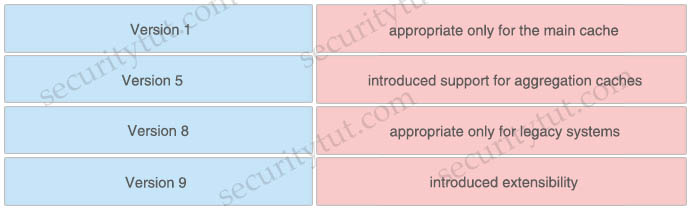
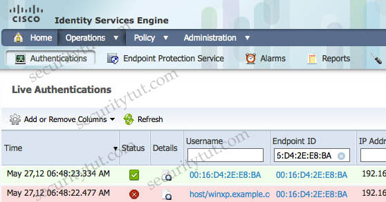
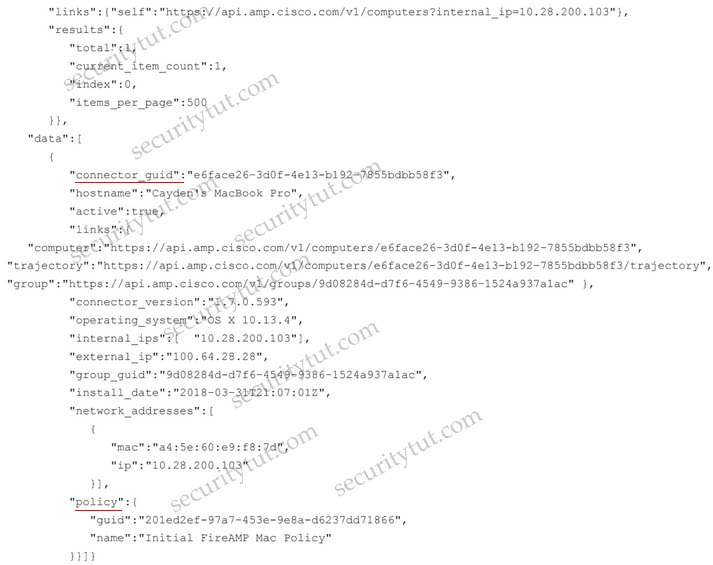
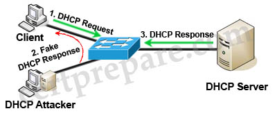
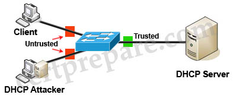
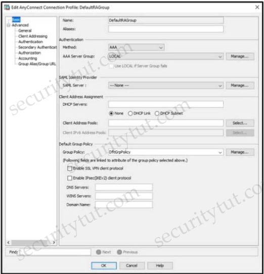
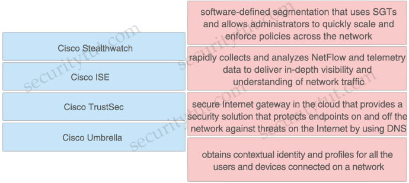
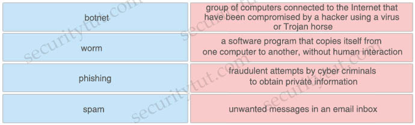
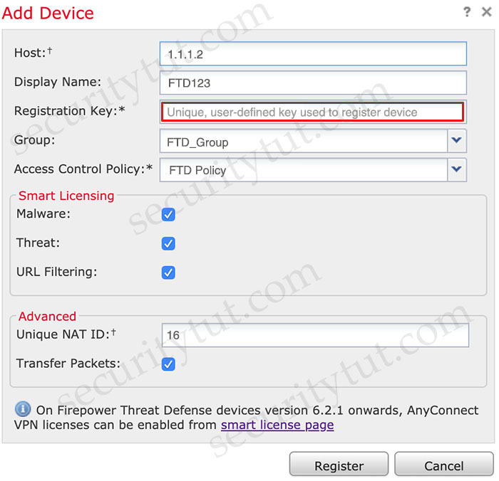

# Quiz Set 7


## 20. New Questions - Part 2


- <span style="color: #008888; font-weight: bold;">Question 1</span>

  A Cisco ESA network administrator has been tasked to use a newly installed service to help create policy based on the reputation verdict. During testing, it is discovered that the Cisco ESA is not dropping files that have an undetermined verdict. What is causing this issue?

  A. The policy was created to send a message to quarantine instead of drop<br>
  B. The file has a reputation score that is above the threshold<br>
  C. The file has a reputation score that is below the threshold<br>
  D. The policy was created to disable file analysis<br>

  Answer: C

  Explanation

  If the file is known to the reputation service but there is insufficient information for a definitive verdict, the reputation service returns a reputation score based on characteristics of the file such as threat fingerprint and behavioral analysis. If this score meets or exceeds the configured reputation threshold, the appliance applies the action that you have configured in the mail policy for files that contain malware.

  Reference: https://www.cisco.com/c/en/us/td/docs/security/esa/esa11-1/user_guide/b_ESA_Admin_Guide_11_1/b_ESA_Admin_Guide_chapter_010000.html

  From the reference we can deduce that the file reputation score is below the threshold so ESA is not dropping it.


- <span style="color: #008888; font-weight: bold;">Question 2</span>

  An administrator is trying to determine which applications are being used in the network but does not want the network devices to send metadata to Cisco Firepower. Which feature should be used to accomplish this?

  A. NetFlow<br>
  B. Packet Tracer<br>
  C. Network Discovery<br>
  D. Access Control<br>

  Answer: C

  Explanation

  NetFlow is a network protocol developed by Cisco for the collection and monitoring of network traffic flow data generated by NetFlow-enabled routers and switches. The flows do not contain actual packet data, but rather the metadata for communications. It is a standard form of session data that details who, what, when, and where of network traffic -> Answer A is not correct.

  Reference: https://www.cisco.com/c/en/us/solutions/collateral/enterprise-networks/enterprise-network-security/white-paper-c11-736595.html


- <span style="color: #008888; font-weight: bold;">Question 3</span>

  Which attack is preventable by Cisco ESA but not by the Cisco WSA?

  A. buffer overflow<br>
  B. DoS<br>
  C. SQL injection<br>
  D. phishing<br>

  Answer: D

  Explanation

  The following are the benefits of deploying Cisco Advanced Phishing Protection on the Cisco Email Security Gateway:

  Prevents the following:
  - Attacks that use compromised accounts and social engineering.
  - Phishing, ransomware, zero-day attacks and spoofing.
  - BEC with no malicious payload or URL.

  Reference: https://www.cisco.com/c/en/us/td/docs/security/esa/esa13-5/user_guide/b_ESA_Admin_Guide_13-5/m_advanced_phishing_protection.html


- <span style="color: #008888; font-weight: bold;">Question 4</span>

  A Cisco ESA administrator has been tasked with configuring the Cisco ESA to ensure there are no viruses before quarantined emails are delivered. In addition, delivery of mail from known bad mail servers must be prevented. Which two actions must be taken in order to meet these requirements? (Choose two)

  A. Use outbreak filters from SenderBase<br>
  B. Enable a message tracking service<br>
  C. Configure a recipient access table<br>
  D. Deploy the Cisco ESA in the DMZ<br>
  E. Scan quarantined emails using AntiVirus signatures.<br>

  Answer: A E

  Explanation

  We should scan emails using AntiVirus signatures to make sure there are no viruses attached in emails.
  Note: A virus signature is the fingerprint of a virus. It is a set of unique data, or bits of code, that allow it to be identified. Antivirus software uses a virus signature to find a virus in a computer file system, allowing to detect, quarantine, and remove the virus.

  SenderBase is an email reputation service designed to help email administrators research senders, identify legitimate sources of email, and block spammers. When the Cisco ESA receives messages from known or highly reputable senders, it delivers them directly to the end user without any content scanning. However, when the Cisco ESA receives email messages from unknown or less reputable senders, it performs antispam and antivirus scanning.

  Reference: https://www.cisco.com/c/en/us/td/docs/security/esa/esa12-0/user_guide/b_ESA_Admin_Guide_12_0/b_ESA_Admin_Guide_12_0_chapter_0100100.html

  -> Therefore Outbreak filters can be used to block emails from bad mail servers.

  Web servers and email gateways are generally located in the DMZ so

  Note: The recipient access table (RAT), not to be confused with remote-access Trojan (also RAT), is a Cisco ESA term that defines which recipients are accepted by a public listener.


- <span style="color: #008888; font-weight: bold;">Question 5</span>

  Which type of dashboard does Cisco DNA Center provide for complete control of the network?

  A. service management<br>
  B. centralized management<br>
  C. application management<br>
  D. distributed management<br>

  Answer: B

  Explanation

  Cisco’s DNA Center is the only centralized network management system to bring all of this functionality into a single pane of glass.

  Reference: https://www.cisco.com/c/en/us/products/collateral/cloud-systems-management/dna-center/nb-06-dna-center-faq-cte-en.html


- <span style="color: #008888; font-weight: bold;">Question 6</span>

  In an IaaS cloud services model, which security function is the provider responsible for managing?

  A. Internet proxy<br>
  B. firewalling virtual machines<br>
  C. CASB<br>
  D. hypervisor OS hardening<br>

  Answer: B

  Explanation

  In this IaaS model, cloud providers offer resources to users/machines that include computers as virtual machines, raw (block) storage, firewalls, load balancers, and network devices.

  Note: Cloud access security broker (CASB) provides visibility and compliance checks, protects data against misuse and exfiltration, and provides threat protections against malware such as ransomware.


- <span style="color: #008888; font-weight: bold;">Question 7</span>

  A network engineer has been tasked with adding a new medical device to the network. Cisco ISE is being used as the NAC server, and the new device does not have a supplicant available. What must be done in order to securely connect this device to the network?

  A. Use MAB with profiling<br>
  B. Use MAB with posture assessment.<br>
  C. Use 802.1X with posture assessment.<br>
  D. Use 802.1X with profiling.<br>

  Answer: A

  Explanation

  As the new device does not have a supplicant, we cannot use 802.1X.

  MAC Authentication Bypass (MAB) is a fallback option for devices that don’t support 802.1x. It is virtually always used in deployments in some way shape or form. MAB works by having the authenticator take the connecting device’s MAC address and send it to the authentication server as its username and password. The authentication server will check its policies and send back an Access-Accept or Access-Reject just like it would with 802.1x.

  Cisco ISE Profiling Services provides dynamic detection and classification of endpoints connected to the network. Using MAC addresses as the unique identifier, ISE collects various attributes for each network endpoint to build an internal endpoint database. The classification process matches the collected attributes to prebuilt or user-defined conditions, which are then correlated to an extensive library of profiles. These profiles include a wide range of device types, including mobile clients (iPads, Android tablets, Chromebooks, and so on), desktop operating systems (for example, Windows, Mac OS X, Linux, and others), and numerous non-user systems such as printers, phones, cameras, and game consoles.

  Once classified, endpoints can be authorized to the network and granted access based on their profile. For example, endpoints that match the IP phone profile can be placed into a voice VLAN using MAC Authentication Bypass (MAB) as the authentication method. Another example is to provide differentiated network access to users based on the device used. For example, employees can get full access when accessing the network from their corporate workstation but be granted limited network access when accessing the network from their personal iPhone.

  Reference: https://community.cisco.com/t5/security-documents/ise-profiling-design-guide/ta-p/3739456


- <span style="color: #008888; font-weight: bold;">Question 8</span>

  An engineer is implementing NTP authentication within their network and has configured both the client and server devices with the command ntp authentication-key 1 md5 Cisc392368270. The server at 1.1.1.1 is attempting to authenticate to the client at 1.1.1.2, however it is unable to do so. Which command is required to enable the client to accept the server’s authentication key?

  A. `ntp peer 1.1.1.1 key 1`<br>
  B. `ntp server 1.1.1.1 key 1`<br>
  C. `ntp server 1.1.1.2 key 1`<br>
  D. `ntp peer 1.1.1.2 key 1`<br>

  Answer: B

  Explanation

  To configure an NTP enabled router to require authentication when other devices connect to it, use the following commands:

  ```text
  NTP_Server(config)#ntp authentication-key 2 md5 securitytut
  NTP_Server(config)#ntp authenticate
  NTP_Server(config)#ntp trusted-key 2
  ```

  Then you must configure the same authentication-key on the client router:

  ```text
  NTP_Client(config)#ntp authentication-key 2 md5 securitytut
  NTP_Client(config)#ntp authenticate
  NTP_Client(config)#ntp trusted-key 2
  NTP_Client(config)#ntp server 10.10.10.1 key 2
  ```

  Note: To configure a Cisco device as a NTP client, use the command ntp server <IP address>. For example: Router(config)#ntp server 10.10.10.1. This command will instruct the router to query 10.10.10.1 for the time.


- <span style="color: #008888; font-weight: bold;">Question 9</span>

  What is the role of an endpoint in protecting a user from a phishing attack?

  A. Use Cisco Stealthwatch and Cisco ISE Integration.<br>
  B. Utilize 802.1X network security to ensure unauthorized access to resources.<br>
  C. Use machine learning models to help identify anomalies and determine expected sending behavior.<br>
  D. Ensure that antivirus and anti malware software is up to date.<br>

  Answer: C


- <span style="color: #008888; font-weight: bold;">Question 10</span>

  Drag and drop the NetFlow export formats from the left onto the descriptions on the right.

  <figure style="margin: 0.5em; display: flex; justify-content: center; align-items: center;">
    
  </figure>

  Answer:
  - appropriate only for the main cache: Version 5
  - introduced support for aggregation caches: Version 8
  - appropriate only for legacy systems: Version 1
  - introduced extensibility: Version 9

  Explanation

  The Version 1 format was the initially released version. Do not use the Version 1 format unless you are using a legacy collection system that requires it. Use Version 9 or Version 5 export format.
  Version 5 export format is suitable only for the main cache; it cannot be expanded to support new features.
  Version 8 export format is available only for aggregation caches; it cannot be expanded to support new features.

  Reference: https://www.cisco.com/c/en/us/td/docs/ios-xml/ios/netflow/configuration/15-mt/nf-15-mt-book/cfg-nflow-data-expt.html


- <span style="color: #008888; font-weight: bold;">Question 11</span>

  An organization has noticed an increase in malicious content downloads and wants to use Cisco Umbrella to prevent this activity for suspicious domains while allowing normal web traffic. Which action will accomplish this task?

  A. Set content settings to High<br>
  B. Configure the intelligent proxy.<br>
  C. Use destination block lists.<br>
  D. Configure application block lists.<br>

  Answer: B

  Explanation

  Obviously, if you allow all traffic to these risky domains, users might access malicious content, resulting in an infection or data leak. But if you block traffic, you can expect false positives, an increase in support inquiries, and thus, more headaches. By only proxying risky domains, the intelligent proxy delivers more granular visibility and control.

  The intelligent proxy bridges the gap by allowing access to most known good sites without being proxied and only proxying those that pose a potential risk. The proxy then filters and blocks against specific URLs hosting malware while allowing access to everything else.

  Reference: https://docs.umbrella.com/deployment-umbrella/docs/what-is-the-intelligent-proxy


- <span style="color: #008888; font-weight: bold;">Question 12</span>

  With which components does a southbound API within a software-defined network architecture communicate?

  A. controllers within the network<br>
  B. applications<br>
  C. appliances<br>
  D. devices such as routers and switches<br>

  Answer: D

  Explanation

  <figure style="margin: 0.5em; display: flex; justify-content: center; align-items: center;">
    
  </figure>

  The Southbound API is used to communicate between Controllers and network devices.


- <span style="color: #008888; font-weight: bold;">Question 13</span>

  A network administrator needs to find out what assets currently exist on the network. Third-party systems need to be able to feed host data into Cisco Firepower. What must be configured to accomplish this?

  A. a Network Discovery policy to receive data from the host<br>
  B. a Threat Intelligence policy to download the data from the host<br>
  C. a File Analysis policy to send file data into Cisco Firepower<br>
  D. a Network Analysis policy to receive NetFlow data from the host<br>

  Answer: A

  Explanation

  You can configure discovery rules to tailor the discovery of host and application data to your needs.

  The Firepower System can use data from NetFlow exporters to generate connection and discovery events, and to add host and application data to the network map.

  A network analysis policy governs how traffic is decoded and preprocessed so it can be further evaluated, especially for anomalous traffic that might signal an intrusion attempt -> Answer D is not correct.


- <span style="color: #008888; font-weight: bold;">Question 14</span>

  When configuring ISAKMP for IKEv1 Phase1 on a Cisco IOS router, an administrator needs to input the command crypto isakmp key cisco address 0.0.0.0. The administrator is not sure what the IP addressing in this command issued for. What would be the effect of changing the IP address from 0.0.0.0 to 1.2.3.4?

  A. The key server that is managing the keys for the connection will be at 1.2.3.4<br>
  B. The remote connection will only be allowed from 1.2.3.4<br>
  C. The address that will be used as the crypto validation authority<br>
  D. All IP addresses other than 1.2.3.4 will be allowed<br>

  Answer: B

  Explanation

  The command crypto isakmp key cisco address 1.2.3.4 authenticates the IP address of the 1.2.3.4 peer by using the key cisco. The address of “0.0.0.0” will authenticate any address with this key.


- <span style="color: #008888; font-weight: bold;">Question 15</span>

  Which suspicious pattern enables the Cisco Tetration platform to learn the normal behavior of users?

  A. file access from a different user<br>
  B. interesting file access<br>
  C. user login suspicious behavior<br>
  D. privilege escalation<br>

  Answer: A

  Explanation

  The various suspicious patterns for which the Cisco Tetration platform looks in the current release are:
  - Shell code execution: Looks for the patterns used by shell code.
  - Privilege escalation: Watches for privilege changes from a lower privilege to a higher privilege in the process lineage tree.
  - Side channel attacks: Cisco Tetration platform watches for cache-timing attacks and page table fault bursts. Using these, it can detect Meltdown, Spectre, and other cache-timing attacks.
  - Raw socket creation: Creation of a raw socket by a nonstandard process (for example, ping).
  - User login suspicious behavior: Cisco Tetration platform watches user login failures and user login methods.
  - Interesting file access: Cisco Tetration platform can be armed to look at sensitive files.
  - File access from a different user: Cisco Tetration platform learns the normal behavior of which file is accessed by which user.
  - Unseen command: Cisco Tetration platform learns the behavior and set of commands as well as the lineage of each command over time. Any new command or command with a different lineage triggers the interest of the Tetration Analytics platform.

  Reference: https://www.cisco.com/c/en/us/products/collateral/data-center-analytics/tetration-analytics/white-paper-c11-740380.html


- <span style="color: #008888; font-weight: bold;">Question 16</span>

  Due to a traffic storm on the network, two interfaces were error-disabled, and both interfaces sent SNMP traps. Which two actions must be taken to ensure that interfaces are put back into service? (Choose two)

  A. Have Cisco Prime Infrastructure issue an SNMP set command to re-enable the ports after the pre configured interval.<br>
  B. Use EEM to have the ports return to service automatically in less than 300 seconds.<br>
  C. Enter the shutdown and no shutdown commands on the interfaces.<br>
  D. Enable the snmp-server enable traps command and wait 300 seconds<br>
  E. Ensure that interfaces are configured with the error-disable detection and recovery feature<br>

  Answer: C E

  Explanation

  You can also bring up the port by using these commands:
  - The “shutdown” interface configuration command followed by the “no shutdown” interface configuration command restarts the disabled port.
  - The “errdisable recovery cause …” global configuration command enables the timer to automatically recover error-disabled state, and the “errdisable recovery interval interval” global configuration command specifies the time to recover error-disabled state.


- <span style="color: #008888; font-weight: bold;">Question 17</span>

  What is the difference between Cross-site Scripting and SQL Injection attacks?

  A. Cross-site Scripting is an attack where code is injected into a database, whereas SQL Injection is an attack where code is injected into a browser.<br>
  B. Cross-site Scripting is a brute force attack targeting remote sites, whereas SQL Injection is a social engineering attack.<br>
  C. Cross-site Scripting is when executives in a corporation are attacked, whereas SQL Injection is when a database is manipulated.<br>
  D. Cross-site Scripting is an attack where code is executed from the server side, whereas SQL Injection is an attack where code is executed from the client side.<br>

  Answer: A

  Explanation

  Answer B is not correct because Cross-site Scripting (XSS) is not a brute force attack.
  Answer C is not correct because the statement “Cross-site Scripting is when executives in a corporation are attacked” is not true. XSS is a client-side vulnerability that targets other application users.
  Answer D is not correct because the statement “Cross-site Scripting is an attack where code is executed from the server side”. In fact, XSS is a method that exploits website vulnerability by injecting scripts that will run at client’s side.

  Therefore only answer A is left. In XSS, an attacker will try to inject his malicious code (usually malicious links) into a database. When other users follow his links, their web browsers are redirected to websites where attackers can steal data from them. In a SQL Injection, an attacker will try to inject SQL code (via his browser) into forms, cookies, or HTTP headers that do not use data sanitizing or validation methods of GET/POST parameters.

  Note: The main difference between a SQL and XSS injection attack is that SQL injection attacks are used to steal information from databases whereas XSS attacks are used to redirect users to websites where attackers can steal data from them.


- <span style="color: #008888; font-weight: bold;">Question 18</span>

  A network administrator is configuring a switch to use Cisco ISE for 802.1X. An endpoint is failing authentication and is unable to access the network. Where should the administrator begin troubleshooting to verify the authentication details?

  A. Adaptive Network Control Policy List<br>
  B. Context Visibility<br>
  C. Accounting Reports<br>
  D. RADIUS Live Logs<br>

  Answer: D

  Explanation

  How To Troubleshoot ISE Failed Authentications & Authorizations

  Check the ISE Live Logs
  Login to the primary ISE Policy Administration Node (PAN).
  Go to Operations > RADIUS > Live Logs
  (Optional) If the event is not present in the RADIUS Live Logs, go to Operations > Reports > Reports > Endpoints and Users > RADIUS Authentications
  Check for Any Failed Authentication Attempts in the Log

  <figure style="margin: 0.5em; display: flex; justify-content: center; align-items: center;">
    
  </figure>

  Reference: https://community.cisco.com/t5/security-documents/how-to-troubleshoot-ise-failed-authentications-amp/ta-p/3630960


- <span style="color: #008888; font-weight: bold;">Question 19</span>

  What is a prerequisite when integrating a Cisco ISE server and an AD domain?

  A. Place the Cisco ISE server and the AD server in the same subnet<br>
  B. Configure a common administrator account<br>
  C. Configure a common DNS server<br>
  D. Synchronize the clocks of the Cisco ISE server and the AD server<br>

  Answer: D

  Explanation

  The following are the prerequisites to integrate Active Directory with Cisco ISE.
  - Use the Network Time Protocol (NTP) server settings to synchronize the time between the Cisco ISE server and Active Directory. You can configure NTP settings from Cisco ISE CLI.
  - If your Active Directory structure has multidomain forest or is divided into multiple forests, ensure that trust relationships exist between the domain to which Cisco ISE is connected and the other domains that have user and machine information to which you need access. For more information on establishing trust relationships, refer to Microsoft Active Directory documentation.

  - You must have at least one global catalog server operational and accessible by Cisco ISE, in the domain to which you are joining Cisco ISE.

  Reference: https://www.cisco.com/c/en/us/td/docs/security/ise/2-0/ise_active_directory_integration/b_ISE_AD_integration_2x.html#reference_8DC463597A644A5C9CF5D582B77BB24F


- <span style="color: #008888; font-weight: bold;">Question 20</span>

  An organization recently installed a Cisco WSA and would like to take advantage of the AVC engine to allow the organization to create a policy to control application specific activity. After enabling the AVC engine, what must be done to implement this?

  A. Use security services to configure the traffic monitor, .<br>
  B. Use URL categorization to prevent the application traffic.<br>
  C. Use an access policy group to configure application control settings.<br>
  D. Use web security reporting to validate engine functionality<br>

  Answer: C

  Explanation

  The Application Visibility and Control (AVC) engine lets you create policies to control application activity on the network without having to fully understand the underlying technology of each application. You can configure application control settings in Access Policy groups. You can block or allow applications individually or according to application type. You can also apply controls to particular application types.


- <span style="color: #008888; font-weight: bold;">Question 21</span>

  Which method is used to deploy certificates and configure the supplicant on mobile devices to gain access to network resources?

  A. BYOD on boarding<br>
  B. Simple Certificate Enrollment Protocol<br>
  C. Client provisioning<br>
  D. MAC authentication bypass<br>

  Answer: A

  Explanation

  When supporting personal devices on a corporate network, you must protect network services and enterprise data by authenticating and authorizing users (employees, contractors, and guests) and their devices. Cisco ISE provides the tools you need to allow employees to securely use personal devices on a corporate network.

  Guests can add their personal devices to the network by running the native supplicant provisioning (Network Setup Assistant), or by adding their devices to the My Devices portal.

  Because native supplicant profiles are not available for all devices, users can use the My Devices portal to add these devices manually; or you can configure Bring Your Own Device (BYOD) rules to register these devices.

  Reference: https://www.cisco.com/c/en/us/td/docs/security/ise/2-4/admin_guide/b_ISE_admin_guide_24/m_ise_devices_byod.html


- <span style="color: #008888; font-weight: bold;">Question 22</span>

  Refer to the exhibit.

  ```python
  import requests
  url = https://api.amp.cisco.com/v1/computers
  headers = {
    'accept' : application/json
    'content-type' : application/json
    'authorization' : Basic API Credentials
    'cache-control' : "no cache"
  }
  response = requests.request ("GET", url, headers = headers)
  print (response.txt)
  ```

  What will happen when this Python script is run?

  A. The compromised computers and malware trajectories will be received from Cisco AMP<br>
  B. The list of computers and their current vulnerabilities will be received from Cisco AMP<br>
  C. The compromised computers and what compromised them will be received from Cisco AMP<br>
  D. The list of computers, policies, and connector statuses will be received from Cisco AMP<br>

  Answer: D

  Explanation

  The call to API of “https://api.amp.cisco.com/v1/computers” allows us to fetch list of computers across your organization that Advanced Malware Protection (AMP) sees

  Reference: https://api-docs.amp.cisco.com/api_actions/details?api_action=GET+%2Fv1%2Fcomputers&api_host=api.apjc.amp.cisco.com&api_resource=Computer&api_version=v1

  It also lists policies and connector statuses as well. The figure below shows partial output of this script:

  <figure style="margin: 0.5em; display: flex; justify-content: center; align-items: center;">
    
  </figure>


- <span style="color: #008888; font-weight: bold;">Question 23</span>

  An organization is trying to implement micro-segmentation on the network and wants to be able to gain visibility on the applications within the network. The solution must be able to maintain and force compliance. Which product should be used to meet these requirements?

  A. Cisco Umbrella<br>
  B. Cisco AMP<br>
  C. Cisco Stealthwatch<br>
  D. Cisco Tetration<br>

  Answer: D

  Explanation

  Micro-segmentation secures applications by expressly allowing particular application traffic and, by default, denying all other traffic. Micro-segmentation is the foundation for implementing a zero-trust security model for application workloads in the data center and cloud.

  Cisco Tetration is an application workload security platform designed to secure your compute instances across any infrastructure and any cloud. To achieve this, it uses behavior and attribute-driven microsegmentation policy generation and enforcement. It enables trusted access through automated, exhaustive context from various systems to automatically adapt security policies.

  To generate accurate microsegmentation policy, Cisco Tetration performs application dependency mapping to discover the relationships between different application tiers and infrastructure services. In addition, the platform supports “what-if” policy analysis using real-time data or historical data to assist in the validation and risk assessment of policy application pre-enforcement to ensure ongoing application availability. The normalized microsegmentation policy can be enforced through the application workload itself for a consistent approach to workload microsegmentation across any environment, including virtualized, bare-metal, and container workloads running in any public cloud or any data center. Once the microsegmentation policy is enforced, Cisco Tetration continues to monitor for compliance deviations, ensuring the segmentation policy is up to date as the application behavior change.

  Reference: https://www.cisco.com/c/en/us/products/collateral/data-center-analytics/tetration-analytics/solution-overview-c22-739268.pdf


- <span style="color: #008888; font-weight: bold;">Question 24</span>

  Which factor must be considered when choosing the on-premise solution over the cloud-based one?

  A. With an on-premise solution, the provider is responsible for the installation and maintenance of the product, whereas with a cloud-based solution, the customer is responsible for it<br>
  B. With a cloud-based solution, the provider is responsible for the installation, but the customer is responsible for the maintenance of the product.<br>
  C. With an on-premise solution, the provider is responsible for the installation, but the customer is responsible for the maintenance of the product.<br>
  D. With an on-premise solution, the customer is responsible for the installation and maintenance of the product, whereas with a cloud-based solution, the provider is responsible for it.<br>

  Answer: D


- <span style="color: #008888; font-weight: bold;">Question 25</span>

  Which term describes when the Cisco Firepower downloads threat intelligence updates from Cisco Talos?

  A. consumption<br>
  B. sharing<br>
  C. analysis<br>
  D. authoring<br>

  Answer: A

  Explanation

  … we will showcase Cisco Threat Intelligence Director (CTID) an exciting feature on Cisco’s Firepower Management Center (FMC) product offering that automates the operationalization of threat intelligence. TID has the ability to consume threat intelligence via STIX over TAXII and allows uploads/downloads of STIX and simple blacklists.

  Reference: https://blogs.cisco.com/developer/automate-threat-intelligence-using-cisco-threat-intelligence-director


<hr>

- <span style="color: #008888; font-weight: bold;">Question 26</span>

  An organization has a Cisco Stealthwatch Cloud deployment in their environment. Cloud logging is working as expected, but logs are not being received from the on-premise network, what action will resolve this issue?

  A. Configure security appliances to send syslogs to Cisco Stealthwatch Cloud<br>
  B. Configure security appliances to send NetFlow to Cisco Stealthwatch Cloud<br>
  C. Deploy a Cisco FTD sensor to send events to Cisco Stealthwatch Cloud<br>
  D. Deploy a Cisco Stealthwatch Cloud sensor on the network to send data to Cisco Stealthwatch Cloud<br>

  Answer: D

  Explanation

  You can also monitor on-premises networks in your organizations using Cisco Stealthwatch Cloud. In order to do so, you need to deploy at least one Cisco Stealthwatch Cloud Sensor appliance (virtual or physical appliance).

  Reference: CCNP And CCIE Security Core SCOR 350-701 Official Cert Guide


- <span style="color: #008888; font-weight: bold;">Question 27</span>

  What does Cisco AMP for Endpoints use to help an organization detect different families of malware?

  A. Ethos Engine to perform fuzzy fingerprinting<br>
  B. Tetra Engine to detect malware when me endpoint is connected to the cloud<br>
  C. Clam AV Engine to perform email scanning<br>
  D. Spero Engine with machine learning to perform dynamic analysis<br>

  Answer: A

  Explanation

  ETHOS is the Cisco file grouping engine. It allows us to group families of files together so if we see variants of a malware, we mark the ETHOS hash as malicious and whole families of malware are instantly detected.

  Reference: https://docs.amp.cisco.com/AMP%20for%20Endpoints%20User%20Guide.pdf

  ETHOS = Fuzzy Fingerprinting using static/passive heuristics

  Reference: https://www.ciscolive.com/c/dam/r/ciscolive/emea/docs/2016/pdf/BRKSEC-2139.pdf


- <span style="color: #008888; font-weight: bold;">Question 28</span>

  What are two characteristics of Cisco DNA Center APIs? (Choose two)

  A. Postman is required to utilize Cisco DNA Center API calls.<br>
  B. They do not support Python scripts.<br>
  C. They are Cisco proprietary.<br>
  D. They quickly provision new devices.<br>
  E. They view the overall health of the network<br>

  Answer: D E


- <span style="color: #008888; font-weight: bold;">Question 29

  What is a benefit of conducting device compliance checks?

  A. It indicates what type of operating system is connecting to the network.<br>
  B. It validates if anti-virus software is installed.<br>
  C. It scans endpoints to determine if malicious activity is taking place.<br>
  D. It detects email phishing attacks.<br>

  Answer: B


- <span style="color: #008888; font-weight: bold;">Question 30</span>

  In which two ways does Easy Connect help control network access when used with Cisco TrustSec? (Choose two)

  A. It allows multiple security products to share information and work together to enhance security posture in the network.<br>
  B. It creates a dashboard in Cisco ISE that provides full visibility of all connected endpoints.<br>
  C. It allows for the assignment of Security Group Tags and does not require 802.1x to be configured on the switch or the endpoint.<br>
  D. It integrates with third-party products to provide better visibility throughout the network.<br>
  E. It allows for managed endpoints that authenticate to AD to be mapped to Security Groups (PassiveID).<br>

  Answer: C E

  Explanation

  Easy Connect simplifies network access control and segmentation by allowing the assignment of Security Group Tags to endpoints without requiring 802.1X on those endpoints, whether using wired or wireless connectivity.

  Reference: https://www.cisco.com/c/dam/en/us/solutions/collateral/enterprise-networks/trustsec/trustsec-with-easy-connect-configuration-guide.pdf


- <span style="color: #008888; font-weight: bold;">Question 31</span>

  What is the benefit of installing Cisco AMP for Endpoints on a network?

  A. It provides operating system patches on the endpoints for security.<br>
  B. It provides flow-based visibility for the endpoints network connections.<br>
  C. It enables behavioral analysis to be used for the endpoints.<br>
  D. It protects endpoint systems through application control and real-time scanning<br>

  Answer: D


- <span style="color: #008888; font-weight: bold;">Question 32</span>

  An administrator is configuring a DHCP server to better secure their environment. They need to be able to rate-limit the traffic and ensure that legitimate requests are not dropped. How would this be accomplished?

  A. Set a trusted interface for the DHCP server<br>
  B. Set the DHCP snooping bit to 1<br>
  C. Add entries in the DHCP snooping database<br>
  D. Enable ARP inspection for the required VLAN<br>

  Answer: A

  Explanation

  To understand DHCP snooping we need to learn about DHCP spoofing attack first.

  <figure style="margin: 0.5em; display: flex; justify-content: center; align-items: center;">
    
  </figure>

  DHCP spoofing is a type of attack in that the attacker listens for DHCP Requests from clients and answers them with fake DHCP Response before the authorized DHCP Response comes to the clients. The fake DHCP Response often gives its IP address as the client default gateway -> all the traffic sent from the client will go through the attacker computer, the attacker becomes a “man-in-the-middle”.

  The attacker can have some ways to make sure its fake DHCP Response arrives first. In fact, if the attacker is “closer” than the DHCP Server then he doesn’t need to do anything. Or he can DoS the DHCP Server so that it can’t send the DHCP Response.

  DHCP snooping can prevent DHCP spoofing attacks. DHCP snooping is a Cisco Catalyst feature that determines which switch ports can respond to DHCP requests. Ports are identified as trusted and untrusted.

  <figure style="margin: 0.5em; display: flex; justify-content: center; align-items: center;">
    
  </figure>

  Only ports that connect to an authorized DHCP server are trusted, and allowed to send all types of DHCP messages. All other ports on the switch are untrusted and can send only DHCP requests. If a DHCP response is seen on an untrusted port, the port is shut down.


- <span style="color: #008888; font-weight: bold;">Question 33</span>

  Refer to the exhibit.

  ```python
  import requests

  client_id = '<Client id>'
  api_key = '<API Key>'
  url = 'https://api.amp.cisco.com/v1/computers'
  response = requests.get(url, auth=(client_id, api_key))
  response_json = response.json()
  for computer in response_json[‘data’]
    hostname = computer[‘hostname’]
    print(hostname)
  ```

  What will happen when the Python script is executed?

  A. The hostname will be translated to an IP address and printed.<br>
  B. The hostname will be printed for the client in the client ID field.<br>
  C. The script will pull all computer hostnames and print them.<br>
  D. The script will translate the IP address to FODN and print it<br>

  Answer: C


- <span style="color: #008888; font-weight: bold;">Question 34</span>

  Refer to the exhibit.

  <figure style="margin: 0.5em; display: flex; justify-content: center; align-items: center;">
    
  </figure>

  When configuring a remote access VPN solution terminating on the Cisco ASA, an administrator would like to utilize an external token authentication mechanism in conjunction with AAA authentication using machine certificates. Which configuration item must be modified to allow this?

  A. Group Policy<br>
  B. Method<br>
  C. SAML Server<br>
  D. DHCP Servers<br>

  Answer: B

  Explanation

  In order to use AAA along with an external token authentication mechanism, set the “Method” as “Both” in the Authentication.


- <span style="color: #008888; font-weight: bold;">Question 35</span>

  An engineer has been tasked with implementing a solution that can be leveraged for securing the cloud users, data, and applications. There is a requirement to use the Cisco cloud native CASB and cloud cybersecurity platform. What should be used to meet these requirements?

  A. Cisco Umbrella<br>
  B. Cisco Cloud Email Security<br>
  C. Cisco NGFW<br>
  D. Cisco Cloudlock<br>

  Answer: D

  Explanation

  Cisco Cloudlock: Secure your cloud users, data, and applications with the cloud-native Cloud Access Security Broker (CASB) and cloud cybersecurity platform.

  Reference: https://www.cisco.com/c/dam/en/us/products/collateral/security/cloud-web-security/at-a-glance-c45-738565.pdf


- <span style="color: #008888; font-weight: bold;">Question 36</span>

  An engineer needs a cloud solution that will monitor traffic, create incidents based on events, and integrate with other cloud solutions via an API. Which solution should be used to accomplish this goal?

  A. SIEM<br>
  B. CASB<br>
  C. Adaptive MFA<br>
  D. Cisco Cloudlock<br>

  Answer: D

  Explanation

  - Cisco Cloudlock continuously monitors cloud environments with a cloud Data Loss Prevention (DLP) engine to identify sensitive information stored in cloud environments in violation of policy.
  - Cloudlock is API-based.
  - Incidents are a key resource in the Cisco Cloudlock application. They are triggered by the Cloudlock policy engine when a policy detection criteria result in a match in an object (document, field, folder, post, or file).

  Reference: https://docs.umbrella.com/cloudlock-documentation/docs/endpoints

  Note:

  - Security information and event management (SIEM) platforms collect log and event data from security systems, networks and computers, and turn it into actionable security insights.

  - An incident is a record of the triggering of an alerting policy. Cloud Monitoring opens an incident when a condition of an alerting policy has been met.


- <span style="color: #008888; font-weight: bold;">Question 37</span>

  Why is it important to implement MFA inside of an organization?

  A. To prevent man-the-middle attacks from being successful.<br>
  B. To prevent DoS attacks from being successful.<br>
  C. To prevent brute force attacks from being successful.<br>
  D. To prevent phishing attacks from being successful.<br>

  Answer: C


- <span style="color: #008888; font-weight: bold;">Question 38</span>

  Drag and drop the solutions from the left onto the solution’s benefits on the right.

  <figure style="margin: 0.5em; display: flex; justify-content: center; align-items: center;">
    
  </figure>

  Answer:
  - software-defined segmentation that uses SGTs and allows administrators to quickly scale and enforce policies across the network: Cisco TrustSec
  - rapidly collects and analyzes NetFlow and telemetry data to deliver in-depth visibility and understanding of network traffic: Cisco Stealthwatch
  - secure Internet gateway in the cloud that provides a security solution that protects endpoints on and off the network against threats on the Internet by using DNS: Cisco Umbrella
  - obtains contextual identity and profiles for all the users and devices connected on a network: Cisco ISE


- <span style="color: #008888; font-weight: bold;">Question 39</span>

  A network administrator is configuring SNMPv3 on a new router. The users have already been created; however, an additional configuration is needed to facilitate access to the SNMP views. What must the administrator do to accomplish this?

  A. map SNMPv3 users to SNMP views<br>
  B. set the password to be used for SNMPv3 authentication<br>
  C. define the encryption algorithm to be used by SNMPv3<br>
  D. specify the UDP port used by SNMP<br>

  Answer: B


- <span style="color: #008888; font-weight: bold;">Question 40</span>

  An organization is using Cisco Firepower and Cisco Meraki MX for network security and needs to centrally manage cloud policies across these platforms. Which software should be used to accomplish this goal?

  A. Cisco Defense Orchestrator<br>
  B. Cisco Secureworks<br>
  C. Cisco DNA Center<br>
  D. Cisco Configuration Professional<br>

  Answer: A

  Explanation

  Cisco Defense Orchestrator is a cloud-based management solution that allows you to manage security policies and device configurations with ease across multiple Cisco and cloud-native security platforms.

  Cisco Defense Orchestrator features:
  ….
  Management of hybrid environments: Managing a mix of firewalls running the ASA, FTD, and Meraki MX software is now easy, with the ability to share policy elements across platforms.

  Reference: https://www.cisco.com/c/en/us/products/collateral/security/defense-orchestrator/datasheet-c78-736847.html


- <span style="color: #008888; font-weight: bold;">Question 41</span>

  What is a function of 3DES in reference to cryptography?

  A. It hashes files.<br>
  B. It creates one-time use passwords.<br>
  C. It encrypts traffic.<br>
  D. It generates private keys.<br>

  Answer: C


- <span style="color: #008888; font-weight: bold;">Question 42</span>

  Which risk is created when using an Internet browser to access cloud-based service?

  A. misconfiguration of infrastructure, which allows unauthorized access<br>
  B. intermittent connection to the cloud connectors<br>
  C. vulnerabilities within protocol<br>
  D. insecure implementation of API<br>

  Answer: C


  =========================== New Questions (added on 1st-Apr-2021) ===========================


- <span style="color: #008888; font-weight: bold;">Question 43</span>

  An organization has a Cisco ESA set up with policies and would like to customize the action assigned for violations. The organization wants a copy of the message to be delivered with a message added to flag it as a DLP violation. Which actions must be performed in order to provide this capability?

  A. deliver and send copies to other recipients<br>
  B. quarantine and send a DLP violation notification<br>
  C. quarantine and alter the subject header with a DLP violation<br>
  D. deliver and add disclaimer text<br>

  Answer: D

  Explanation

  You specify primary and secondary actions that the appliance will take when it detects a possible DLP violation in an outgoing message. Different actions can be assigned for different violation types and severities.
  Primary actions include:
  – Deliver
  – Drop
  – Quarantine

  Secondary actions include:
  – Sending a copy to a policy quarantine if you choose to deliver the message. The copy is a perfect clone of the original, including the Message ID. Quarantining a copy allows you to test the DLP system before deployment in addition to providing another way to monitor DLP violations. When you release the copy from the quarantine, the appliance delivers the copy to the recipient, who will have already received the original message.
  – Encrypting messages. The appliance only encrypts the message body. It does not encrypt the message headers.
  – Altering the subject header of messages containing a DLP violation.
  – Adding disclaimer text to messages.
  – Sending messages to an alternate destination mailhost.
  – Sending copies (bcc) of messages to other recipients. (For example, you could copy messages with critical DLP violations to a compliance officer’s mailbox for examination.)
  – Sending a DLP violation notification message to the sender or other contacts, such as a manager or DLP compliance officer.

  Reference: https://www.cisco.com/c/en/us/td/docs/security/esa/esa12-0/user_guide/b_ESA_Admin_Guide_12_0/b_ESA_Admin_Guide_chapter_010001.html


- <span style="color: #008888; font-weight: bold;">Question 44</span>

  Drag and drop the common security threats from left onto the definitions on the right.

  <figure style="margin: 0.5em; display: flex; justify-content: center; align-items: center;">
    
  </figure>

  Answer:
  - group of computers connected to the Internet that have been compromised by a hacker using a virus or Trojan horse: botnet
  - a software program that copies itself from one computer to another, without human interaction: worm
  - fraudulent attempts by cyber criminals to obtain private information: phishing
  - unwanted messages in an email inbox: spam


- <span style="color: #008888; font-weight: bold;">Question 45</span>

  Refer to the exhibit.

  <figure style="margin: 0.5em; display: flex; justify-content: center; align-items: center;">
    
  </figure>

  An administrator is adding a new Cisco FTD device to their network and wants to manage it with Cisco FMC. The Cisco FTD is not behind a NAT device. Which command is needed to enable this on the Cisco FTD?

  A. configure manager add `DONTRESOLVE <registration key>`<br>
  B. configure manager add `<FMC IP address> <registration key> 16`<br>
  C. configure manager add `DONTRESOLVE <registration key> FTD123`<br>
  D. configure manager add `<FMC IP address> <registration key>`<br>

  Answer: D

  Explanation

  The “Add device” dialog above is from the FMC when we want to add a new FTD. To let FMC manages FTD, first we need to add manager from the FTD and assign a register key of your choice with the command configure manager add 1.1.1.1 the_registration_key_you_want, (suppose 1.1.1.1 is the IP address of the FMC). You need to use the same registration key in FMC when adding this FTD as a managed device.

  Reference: https://cyruslab.net/2019/09/03/ciscocisco-firepower-lab-setup/

  In fact this is an unclear question, please read the note below:

  Note:

  According to this Cisco reference:
  – If the FMC is behind a NAT device, enter a unique NAT ID along with the registration key, and specify DONTRESOLVE instead of the hostname, for example:

    ```text
    Example:
    > configure manager add DONTRESOLVE regk3y78 natid90
    ```

  – If the FTD is behind a NAT device, enter a unique NAT ID along with the FMC IP address or hostname, for example:

    ```text
    Example:
    > configure manager add 10.70.45.5 regk3y78 natid56
    ```

  Now return to our question. In the exhibit we see a value of 16 in the “Unique NAT ID” and the question stated that “FTD is not behind a NAT device” so we can only suppose FMC is behind a NAT device. So the correct solution should be “configure manager add DONTRESOLVE <registration key> 16” but there is no such answer. Therefore we have to suppose there are no NAT device between FMC and FTD.


- <span style="color: #008888; font-weight: bold;">Question 46</span>

  A switch with Dynamic ARP Inspection enabled has received a spoofed ARP response on a trusted interface. How does the switch behave in this situation?

  A. It forwards the packet after validation by using the MAC Binding Table.<br>
  B. It drops the packet after validation by using the IP & MAC Binding Table.<br>
  C. It forwards the packet without validation.<br>
  D. It drops the packet without validation.<br>

  Answer: C


