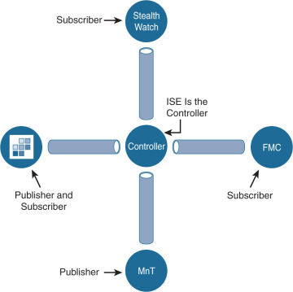

# Quiz Set 8


## 21. New Questions - Part 3

- <span style="color: #008888; font-weight: bold;">Question 1</span>

  What is a functional difference between a Cisco ASA and a Cisco IOS router with Zone-based policy firewall?

  A. The Cisco ASA denies all traffic by default whereas the Cisco IOS router with Zone-Based Policy Firewall starts out by allowing all traffic, even on untrusted interfaces.<br>
  B. The Cisco IOS router with Zone-Based Policy Firewall can be configured for high availability, whereas the Cisco ASA cannot<br>
  C. The Cisco IOS router with Zone-Based Policy Firewall denies all traffic by default, whereas the Cisco ASA starts out by allowing all traffic until rules are added<br>
  D. The Cisco ASA can be configured for high availability whereas the Cisco IOS router with Zone-Based Policy Firewall cannot<br>

  Answer: A

  Explanation

  Both Cisco ASA and Cisco IOS router with Zone-based policy firewall support High Availability (HA).
  Zone-Based Policy Firewall drops traffic if it is from a different zone by default. So we cannot say if Cisco IOS router with Zone-Based Policy Firewall allows or denies traffic by default.
  Cisco ASA drops all traffic by default.

  But we found a similar answer to this question:

  The ASA denies all traffic by default, while the IOS router starts out by allowing all traffic, even on your untrusted interfaces.

  Reference: https://www.plixer.com/blog/cisco-zone-based-firewall-reporting/

  So maybe this question wanted to say Cisco IOS router allows all traffic by default (before implementing Zone-Based Policy Firewall).


- <span style="color: #008888; font-weight: bold;">Question 2</span>

  What is a benefit of performing device compliance?

  A. verification of the latest OS patches<br>
  B. device classification and authorization<br>
  C. providing multi-factor authentication<br>
  D. providing attribute-driven policies<br>

  Answer: A


- <span style="color: #008888; font-weight: bold;">Question 3</span>

  Which cloud model is a collaborative effort where infrastructure is shared and jointly accessed by several organizations from a specific group?

  A. hybrid<br>
  B. community<br>
  C. private<br>
  D. public<br>

  Answer: B

  Explanation

  Community Cloud allows system and services to be accessible by group of organizations. It shares the infrastructure between several organizations from a specific community. It may be managed internally by organizations or by the third-party.


- <span style="color: #008888; font-weight: bold;">Question 4</span>

  Which cryptographic process provides origin confidentiality, integrity, and origin authentication for packets?

  A. IKEv1<br>
  B. AH<br>
  C. ESP<br>
  D. IKEv2<br>

  Answer: C


- <span style="color: #008888; font-weight: bold;">Question 5</span>

  An organization wants to secure users, data, and applications in the cloud. The solution must be API-based and operate as a cloud-native CASB. Which solution must be used for this implementation?

  A. Cisco Cloudlock<br>
  B. Cisco Cloud Email Security<br>
  C. Cisco Firepower Next-Generation Firewall<br>
  D. Cisco Umbrella<br>

  Answer: A

  Explanation

  Cisco Cloudlock: Secure your cloud users, data, and applications with the cloud-native Cloud Access Security Broker (CASB) and cloud cybersecurity platform.

  Reference: https://www.cisco.com/c/dam/en/us/products/collateral/security/cloud-web-security/at-a-glance-c45-738565.pdf


- <span style="color: #008888; font-weight: bold;">Question 6</span>

  What are two Trojan malware attacks? (Choose two)

  A. frontdoor<br>
  B. rootkit<br>
  C. smurf<br>
  D. backdoor<br>
  E. sync<br>

  Answer: B D


- <span style="color: #008888; font-weight: bold;">Question 7</span>

  What is the role of Cisco Umbrella Roaming when it is installed on an endpoint?

  A. to protect the endpoint against malicious file transfers<br>
  B. to ensure that assets are secure from malicious links on and off the corporate network<br>
  C. to establish secure VPN connectivity to the corporate network<br>
  D. to enforce posture compliance and mandatory software<br>

  Answer: B

  Explanation

  Umbrella Roaming is a cloud-delivered security service for Cisco’s next-generation firewall. It protects your employees even when they are off the VPN.


- <span style="color: #008888; font-weight: bold;">Question 8</span>

  What is a capability of Cisco ASA Netflow?

  A. It filters NSEL events based on traffic.<br>
  B. It generates NSEL events even if the MPF is not configured.<br>
  C. It logs all event types only to the same collector.<br>
  D. It sends NetFlow data records from active and standby ASAs in an active standby failover pair.<br>

  Answer: A


- <span style="color: #008888; font-weight: bold;">Question 9</span>

  Which component of Cisco umbrella architecture increases reliability of the service?

  A. Anycast IP<br>
  B. AMP Threat grid<br>
  C. Cisco Talos<br>
  D. BGP route reflector<br>

  Answer: A

  Explanation

  Cisco Umbrella Uses Anycast IP routing in order to provide reliability of the recursive DNS service.


- <span style="color: #008888; font-weight: bold;">Question 10</span>

  What is the benefit of integrating Cisco ISE with a MDM solution?

  A. It provides compliance checks for access to the network<br>
  B. It provides the ability to update other applications on the mobile device<br>
  C. It provides the ability to add applications to the mobile device through Cisco ISE<br>
  D. It provides network device administration access<br>

  Answer: A

  Explanation

  Mobile Device Management (MDM) software secures, monitors, manages and supports mobile devices deployed across mobile operators, service providers and enterprises. A typical MDM product consists of a policy server, a mobile device client and an optional inline enforcement point that controls the use of some applications on a mobile device (like email) in the deployed environment. However the network is the only entity that can provide granular access to endpoints (based on ACL’s, TrustSec SGT’s etc). It is envisaged that Cisco Identity Services Engine (ISE) would be an additional network based enforcement point while the MDM policy server would serve as the policy decision point. ISE expects specific data from MDM servers to provide a complete solution

  The following are the high level use cases in this solution.
  - Device registration- Non registered endpoints accessing the network on-premises will be redirected to registration page on MDM server for registration based on user role, device type, etc
  - Remediation- Non compliant endpoints will be given restricted access based on compliance state
  - Periodic compliance check – Periodically check with MDM server for compliance
  - Ability for ISE administrators to issue remote actions on the device through the MDM server (e.g.: remote wiping of the managed device)
  - Ability for end user to leverage the ISE My Devices Portal to manage personal devices, e.g. Full Wipe, Corporate Wipe and PIN Lock.

  Reference: https://community.cisco.com/t5/security-documents/cisco-ise-integration-with-mobile-device-management-mdm/ta-p/3784691

  Also in the attached PDF of above link:

  If the user device is not in compliant to the posture (compliance) policies configured on MDM, they will be notified that the device is out of compliance, reason for non-compliance and the need to be in compliance to access network resources.


- <span style="color: #008888; font-weight: bold;">Question 11</span>

  An administrator configures a new destination list in Cisco Umbrella so that the organization can block specific domains for its devices. What should be done to ensure that all subdomains of domain.com are blocked?

  A. Configure the *.com address in the block list.<br>
  B. Configure the *.domain.com address in the block list<br>
  C. Configure the www.domain.com address in the block list<br>
  D. Configure the domain.com address in the block list<br>

  Answer: D

  Explanation

  It is not possible to use an asterisk to wildcard a different part of the domain. The following will not work:
  - *.domain.com
  - subdomain.*.com
  - sub*.com
  - domain.*

  Reference: https://docs.umbrella.com/deployment-umbrella/docs/wild-cards

  By configuring domain.com address in the block list, we implied to block *.domain.com/* (all subdomains would be blocked too).


- <span style="color: #008888; font-weight: bold;">Question 12</span>

  An organization wants to provide visibility and to identify active threats in its network using a VM. The organization wants to extract metadata from network packet flow while ensuring that payloads are not retained or transferred outside the network. Which solution meets these requirements?

  A. Cisco Umbrella Cloud<br>
  B. Cisco Stealthwatch Cloud PNM<br>
  C. Cisco Stealthwatch Cloud PCM<br>
  D. Cisco Umbrella On-Premises<br>

  Answer: B

  Explanation

  Private Network Monitoring (PNM) provides visibility and threat detection for the on-premises network, delivered from the cloud as a SaaS solution. It is the perfect solution for organizations who prefer SaaS products and desire better awareness and security in their on-premises environments while reducing capital expenditure and operational overhead. It works by deploying lightweight software in a virtual machine or server that can consume a variety of native sources of telemetry or extract metadata from network packet flow. It encrypts this metadata and sends it to the Stealthwatch Cloud analytics platform for analysis. Stealthwatch Cloud consumes metadata only. The packet payloads are never retained or transferred outside the network.

  This lab focuses on how to configure a Stealthwatch Cloud Private Network Monitoring (PNM) Sensor, in order to provide visibility and effectively identify active threats, and monitors user and device behavior within on-premises networks.

  The Stealthwatch Cloud PNM Sensor is an extremely flexible piece of technology, capable of being utilized in a number of different deployment scenarios. It can be deployed as a complete Ubuntu based virtual appliance on different hypervisors (e.g. –VMware, VirtualBox). It can be deployed on hardware running a number of different Linux-based operating systems.

  Reference: https://www.ciscolive.com/c/dam/r/ciscolive/us/docs/2019/pdf/5eU6DfQV/LTRSEC-2240-LG2.pdf


- <span style="color: #008888; font-weight: bold;">Question 13</span>

  An organization deploys multiple Cisco FTD appliances and wants to manage them using one centralized solution. The organization does not have a local VM but does have existing Cisco ASAs that must migrate over to Cisco FTDs. Which solution meets the needs of the organization?

  A. Cisco FMC<br>
  B. CSM<br>
  C. Cisco FDM<br>
  D. CDO<br>

  Answer: A


- <span style="color: #008888; font-weight: bold;">Question 14</span>

  An organization wants to secure data in a cloud environment. Its security model requires that all users be authenticated and authorized. Security configuration and posture must be continuously validated before access is granted or maintained to applications and data. There is also a need to allow certain application traffic and deny all other traffic by default. Which technology must be used to implement these requirements?

  A. virtual routing and forwarding<br>
  B. microsegmentation<br>
  C. access control policy<br>
  D. virtual LAN<br>

  Answer: B

  Explanation

  Zero Trust is a security framework requiring all users, whether in or outside the organization’s network, to be authenticated, authorized, and continuously validated for security configuration and posture before being granted or keeping access to applications and data. Zero Trust assumes that there is no traditional network edge; networks can be local, in the cloud, or a combination or hybrid with resources anywhere as well as workers in any location.

  The Zero Trust model uses microsegmentation — a security technique that involves dividing perimeters into small zones to maintain separate access to every part of the network — to contain attacks.


- <span style="color: #008888; font-weight: bold;">Question 15</span>

  A Cisco FTD engineer is creating a new IKEv2 policy called s2s00123456789 for their organization to allow for additional protocols to terminate network devices with. They currently only have one policy established and need the new policy to be a backup in case some devices cannot support the stronger algorithms listed in the primary policy. What should be done in order to support this?

  A. Change the integrity algorithms to `SHA*` to support all SHA algorithms in the primary policy<br>
  B. Make the priority for the new policy 5 and the primary policy 1.<br>
  C. Change the encryption to AES* to support all AES algorithms in the primary policy<br>
  D. Make the priority for the primary policy 10 and the new policy 1<br>

  Answer: B

  Explanation

  All IKE policies on the device are sent to the remote peer regardless of what is in the selected policy section. The first IKE Policy matched by the remote peer will be selected for the VPN connection. Choose which policy is sent first using the priority field. Priority 1 will be sent first.

  Reference: https://www.cisco.com/c/en/us/support/docs/security-vpn/ipsec-negotiation-ike-protocols/215470-site-to-site-vpn-configuration-on-ftd-ma.html


- <span style="color: #008888; font-weight: bold;">Question 16</span>

  Which type of encryption uses a public key and private key?

  A. asymmetric<br>
  B. symmetric<br>
  C. linear<br>
  D. nonlinear<br>

  Answer: A


- <span style="color: #008888; font-weight: bold;">Question 17</span>

  What are two features of NetFlow flow monitoring? (Choose two)

  A. Can track ingress and egress information<br>
  B. Include the flow record and the flow importer<br>
  C. Copies all ingress flow information to an interface<br>
  D. Does not required packet sampling on interfaces<br>
  E. Can be used to track multicast, MPLS, or bridged traffic<br>

  Answer: A E

  Explanation

  The following are restrictions for Flexible NetFlow:
  - Traditional NetFlow (TNF) accounting is not supported.
  - Flexible NetFlow v5 export format is not supported, only NetFlow v9 export format is supported.
  - Both ingress and egress NetFlow accounting is supported.
  - Microflow policing feature shares the NetFlow hardware resource with FNF.
  - Only one flow monitor per interface and per direction is supported.

  Reference: https://www.cisco.com/en/US/docs/switches/lan/catalyst3850/software/release/3se/consolidated_guide/b_consolidated_3850_3se_cg_chapter_011010.html

  When configuring NetFlow, follow these guidelines and restrictions:

  - Except in PFC3A mode, NetFlow supports bridged IP traffic. PFC3A mode does not support NetFlow bridged IP traffic.
  - NetFlow supports multicast IP traffic.

  Reference: https://www.cisco.com/en/US/docs/general/Test/dwerblo/broken_guide/netflow.html

  The Flexible NetFlow – MPLS Egress NetFlow feature allows you to capture IP flow information for packets that arrive on a router as Multiprotocol Label Switching (MPLS) packets and are transmitted as IP packets. This feature allows you to capture the MPLS VPN IP flows that are traveling through the service provider backbone from one site of a VPN to another site of the same VPN

  Reference: https://www.cisco.com/c/en/us/td/docs/ios-xml/ios/netflow/configuration/15-mt/nf-15-mt-book/cfg-mpls-netflow.html


- <span style="color: #008888; font-weight: bold;">Question 18</span>

  A customer has various external HTTP resources available including Intranet Extranet and Internet, with a proxy configuration running in explicit mode. Which method allows the client desktop browsers to be configured to select when to connect direct or when to use the proxy?

  A. Transport mode<br>
  B. Forward file<br>
  C. PAC file<br>
  D. Bridge mode<br>

  Answer: C

  Explanation

  A Proxy Auto-Configuration (PAC) file is a JavaScript function definition that determines whether web browser requests (HTTP, HTTPS, and FTP) go direct to the destination or are forwarded to a web proxy server.
  PAC files are used to support explicit proxy deployments in which client browsers are explicitly configured to send traffic to the web proxy. The big advantage of PAC files is that they are usually relatively easy to create and maintain.


- <span style="color: #008888; font-weight: bold;">Question 19</span>

  Which Talos reputation center allows for tracking the reputation of IP addresses for email and web traffic?

  A. IP and Domain Reputation Center<br>
  B. File Reputation Center<br>
  C. IP Slock List Center<br>
  D. AMP Reputation Center<br>

  Answer: A


- <span style="color: #008888; font-weight: bold;">Question 20</span>

  An engineer is configuring IPsec VPN and needs an authentication protocol that is reliable and supports ACK and sequence. Which protocol accomplishes this goal?

  A. AES-192<br>
  B. IKEv1<br>
  C. AES-256<br>
  D. ESP<br>

  Answer: D


- <span style="color: #008888; font-weight: bold;">Question 21</span>

  An administrator is establishing a new site-to-site VPN connection on a Cisco IOS router. The organization needs to ensure that the ISAKMP key on the hub is used only for terminating traffic from the IP address of 172.19.20.24. Which command on the hub will allow the administrator to accomplish this?

  A. crypto ca identity 172.19.20.24<br>
  B. crypto isakmp key Cisco0123456789 172.19.20.24<br>
  C. crypto enrollment peer address 172.19.20.24<br>
  D. crypto isakmp identity address 172.19.20.24<br>

  Answer: B

  Explanation

  The command “crypto isakmp identity address 172.19.20.24” is not valid. We can only use “crypto isakmp identity {address | hostname}. The following example uses preshared keys at two peers and sets both their ISAKMP identities to the IP address.

  At the local peer (at 10.0.0.1) the ISAKMP identity is set and the preshared key is specified:
  crypto isakmp identity address
  crypto isakmp key sharedkeystring address 192.168.1.33

  At the remote peer (at 192.168.1.33) the ISAKMP identity is set and the same preshared key is specified:
  crypto isakmp identity address
  crypto isakmp key sharedkeystring address 10.0.0.1

  Reference: https://www.cisco.com/c/en/us/td/docs/ios-xml/ios/security/a1/sec-a1-cr-book/sec-cr-c4.html#wp3880782430

  The command “crypto enrollment peer address” is not valid either.

  The command “crypto ca identity …” is only used to declare a trusted CA for the router and puts you in the ca-identity configuration mode. Also it should be followed by a name, not an IP address. For example: “crypto ca identity CA-Server” -> Answer A is not correct.

  Only answer B is the best choice left.


- <span style="color: #008888; font-weight: bold;">Question 22</span>

  What is a difference between an XSS attack and an SQL injection attack?

  A. SQL injection is a hacking method used to attack SQL databases, whereas XSS attacks can exist in many different types of applications<br>
  B. XSS is a hacking method used to attack SQL databases, whereas SQL injection attacks can exist in many different types of applications<br>
  C. SQL injection attacks are used to steal information from databases whereas XSS attacks are used to redirect users to websites where attackers can steal data from them<br>
  D. XSS attacks are used to steal information from databases whereas SQL injection attacks are used to redirect users to websites where attackers can steal data from them<br>

  Answer: C

  Explanation

  In XSS, an attacker will try to inject his malicious code (usually malicious links) into a database. When other users follow his links, their web browsers are redirected to websites where attackers can steal data from them. In a SQL Injection, an attacker will try to inject SQL code (via his browser) into forms, cookies, or HTTP headers that do not use data sanitizing or validation methods of GET/POST parameters.


- <span style="color: #008888; font-weight: bold;">Question 23</span>

  An engineer has been tasked with configuring a Cisco FTD to analyze protocol fields and detect anomalies in the traffic from industrial systems. What must be done to meet these requirements?

  A. Implement pre-filter policies for the CIP preprocessor<br>
  B. Enable traffic analysis in the Cisco FTD<br>
  C. Configure intrusion rules for the DNP3 preprocessor<br>
  D. Modify the access control policy to trust the industrial traffic<br>

  Answer: A

  Explanation

  The Modbus, DNP3, and CIP SCADA preprocessors detect traffic anomalies and provide data to intrusion rules. Therefore in this question only answer A or answer C is correct.

  The DNP3 preprocessor detects anomalies in DNP3 traffic and decodes the DNP3 protocol for processing by the rules engine, which uses DNP3 keywords to access certain protocol fields.

  The Common Industrial Protocol (CIP) is a widely used application protocol that supports industrial automation applications. EtherNet/IP is an implementation of CIP that is used on Ethernet-based networks.The CIP preprocessor detects CIP and ENIP traffic running on TCP or UDP and sends it to the intrusion rules engine. You can use CIP and ENIP keywords in custom intrusion rules to detect attacks in CIP and ENIP traffic.

  Reference: https://www.cisco.com/c/en/us/td/docs/security/firepower/630/configuration/guide/fpmc-config-guide-v63/scada_preprocessors.html

  Both DNP3 and CIP preprocessors can be used to detect traffic anomalies but we choose CIP as it is widely used in industrial applications.

  Note:
  - An intrusion rule is a specified set of keywords and arguments that the system uses to detect attempts to exploit vulnerabilities in your network. As the system analyzes network traffic, it compares packets against the conditions specified in each rule, and triggers the rule if the data packet meets all the conditions specified in the rule.
  - Preprocessor rules, which are rules associated with preprocessors and packet decoder detection options in the network analysis policy. Most preprocessor rules are disabled by default.


- <span style="color: #008888; font-weight: bold;">Question 24</span>

  Which posture assessment requirement provides options to the client for remediation and requires the remediation within a certain timeframe?

  A. Audit<br>
  B. Mandatory<br>
  C. Optional<br>
  D. Visibility<br>

  Answer: B

  Explanation

  A posture requirement is a set of compound conditions with an associated remediation action that can be linked with a role and an operating system. All the clients connecting to your network must meet mandatory requirements during posture evaluation to become compliant on the network.

  Posture-policy requirements can be set to mandatory, optional, or audit types in posture policies. If requirements are optional and clients fail these requirements, then the clients have an option to continue during posture evaluation of endpoints.

  Mandatory Requirements

  During policy evaluation, the agent provides remediation options to clients who fail to meet the mandatory requirements defined in the posture policy. End users must remediate to meet the requirements within the time specified in the remediation timer settings.

  For example, you have specified a mandatory requirement with a user-defined condition to check the existence of C:\temp\text.file in the absolute path. If the file does not exist, the mandatory requirement fails and the user will be moved to Non-Compliant state.

  Reference: https://www.cisco.com/c/en/us/td/docs/security/ise/1-4/admin_guide/b_ise_admin_guide_14/b_ise_admin_guide_14_chapter_010111.html


- <span style="color: #008888; font-weight: bold;">Question 25</span>

  Which attribute has the ability to change during the RADIUS CoA?

  A. NTP<br>
  B. authorization<br>
  C. accessibility<br>
  D. membership<br>

  Answer: B

  Explanation

  The RADIUS Change of Authorization (CoA) feature provides a mechanism to change the attributes of an authentication, authorization, and accounting (AAA) session after it is authenticated.

  Reference: https://www.cisco.com/c/en/us/td/docs/ios-xml/ios/sec_usr_aaa/configuration/15-sy/sec-usr-aaa-15-sy-book/sec-rad-coa.html


<hr>

- <span style="color: #008888; font-weight: bold;">Question 26</span>

  With Cisco AMP for Endpoints, which option shows a list of all files that have been executed in your environment?

  A. prevalence<br>
  B. file analysis<br>
  C. detections<br>
  D. vulnerable software<br>
  E. threat root cause<br>

  Answer: A

  Explanation

  Prevalence allows you to view files that have been executed in your deployment.

  Note: Threat Root Cause shows how malware is getting onto your computers.

  Reference: https://docs.amp.cisco.com/en/A4E/AMP%20for%20Endpoints%20User%20Guide.pdf


- <span style="color: #008888; font-weight: bold;">Question 27</span>

  A company discovered an attack propagating through their network via a file. A custom file policy was created in order to track this in the future and ensure no other endpoints execute the infected file. In addition, it was discovered during testing that the scans are not detecting the file as an indicator of compromise. What must be done in order to ensure that the created is functioning as it should?

  A. Create an IP block list for the website from which the file was downloaded<br>
  B. Block the application that the file was using to open<br>
  C. Upload the hash for the file into the policy<br>
  D. Send the file to Cisco Threat Grid for dynamic analysis<br>

  Answer: C


- <span style="color: #008888; font-weight: bold;">Question 28</span>

  A network engineer is trying to figure out whether FlexVPN or DMVPN would fit better in their environment. They have a requirement for more stringent security multiple security associations for the connections, more efficient VPN establishment as well consuming less bandwidth. Which solution would be best for this and why?

  A. DMVPN because it supports IKEv2 and FlexVPN does not.<br>
  B. FlexVPN because it supports IKEv2 and DMVPN does not.<br>
  C. FlexVPN because it uses multiple SAs and DMVPN does not.<br>
  D. DMVPN because it uses multiple SAs and FlexVPN does not.<br>

  Answer: C

  Explanation

  FlexVPN supports IKEv2 -> Answer A is not correct.
  DMVPN supports both IKEv1 & IKEv2 -> Answer B is not correct.
  FlexVPN support multiple SAs -> Answer D is not correct.

  Therefore answer C is the best choice left.


- <span style="color: #008888; font-weight: bold;">Question 29</span>

  How does Cisco Workload Optimization Manager help mitigate application performance issues?

  A. It deploys an AWS Lambda system<br>
  B. It automates resource resizing<br>
  C. It optimizes a flow path<br>
  D. It sets up a workload forensic score<br>

  Answer: B

  Explanation

  Cisco Workload Optimization Manager provides specific real-time actions that ensure workloads get the resources they need when they need them, enabling continuous placement, resizing, and capacity decisions that can be automated, driving continuous health in the environment. You can automate the software’s decisions according to your level of comfort: recommend (view only), manual (select and apply), or automated (executed in real time by software).

  Reference: https://www.cisco.com/c/dam/en/us/solutions/collateral/data-center-virtualization/one-enterprise-suite/solution-overview-c22-739078.pdf


- <span style="color: #008888; font-weight: bold;">Question 30</span>

  An organization configures Cisco Umbrella to be used for its DNS services. The organization must be able to block traffic based on the subnet that the endpoint is on but it sees only the requests from its public IP address instead of each internal IP address. What must be done to resolve this issue?

  A. Set up a Cisco Umbrella virtual appliance to internally field the requests and see the traffic of each IP address<br>
  B. Use the tenant control features to identify each subnet being used and track the connections within the Cisco Umbrella dashboard<br>
  C. Install the Microsoft Active Directory Connector to give IP address information stitched to the requests in the Cisco Umbrella dashboard<br>
  D. Configure an internal domain within Cisco Umbrella to help identify each address and create policy from the domains<br>

  Answer: A

  Explanation

  Umbrella virtual appliances (VAs) are lightweight virtual machines that are compatible with VMWare ESX/ESXi, Windows Hyper-V, and KVM hypervisors and the Microsoft Azure, Google Cloud Platform, and Amazon Web Services cloud platforms. When utilized as conditional DNS forwarders on your network, Umbrella VAs record the internal IP address information of DNS requests for usage in reports, security enforcement, and category filtering policies.

  VAs act as conditional DNS forwarders in your network, intelligently forwarding public DNS queries to Cisco Umbrella’s global network, and local DNS queries to your existing local DNS servers and forwarders. Every public DNS query sent to Umbrella is encrypted, authenticated, and includes the client’s internal IP address.

  <figure style="margin: 0.5em; display: flex; justify-content: center; align-items: center;">
    
  </figure>

  Reference: https://docs.umbrella.com/deployment-umbrella/docs/1-introduction

  If you’re already pointing DNS to Umbrella, or plan to, all the DNS traffic visible in your Umbrella reports come from a single Network identity. The VAs provide internal IP visibility, allowing you to track down malicious or inappropriate traffic within your network to a specific IP address.

  Without Virtual Appliances
  Security and DNS traffic-related investigations cannot be traced back to an individual computer or IP address.

  <figure style="margin: 0.5em; display: flex; justify-content: center; align-items: center;">
    
  </figure>

  With Virtual Appliances
  VAs record the internal IP address of every DNS request. Security and DNS traffic-related investigations allow you to associate traffic to an individual, internal IP address.

  <figure style="margin: 0.5em; display: flex; justify-content: center; align-items: center;">
    
  </figure

  Reference: https://docs.umbrella.com/deployment-umbrella/docs/1-introduction


- <span style="color: #008888; font-weight: bold;">Question 31</span>

  What is a difference between a DoS attack and a DDoS attack?

  A. A DoS attack is where a computer is used to flood a server with TCP and UDP packets whereas a DDoS attack is where multiple systems target a single system with a DoS attack.<br>
  B. A DoS attack is where a computer is used to flood a server with TCP and UDP packets whereas a DDoS attack is where a computer is used to flood multiple servers that are distributed over a LAN<br>
  C. A DoS attack is where a computer is used to flood a server with UDP packets whereas a DDoS attack is where a computer is used to flood a server with TCP packets<br>
  D. A DoS attack is where a computer is used to flood a server with TCP packets whereas a DDoS attack is where a computer is used to flood a server with UDP packets<br>

  Answer: A


- <span style="color: #008888; font-weight: bold;">Question 32</span>

  Which two capabilities of Integration APIs are utilized with Cisco DNA center? (Choose two)

  A. Automatically deploy new virtual routers<br>
  B. Upgrade software on switches and routers<br>
  C. Application monitors for power utilization of devices and IoT sensors<br>
  D. Connect to Information Technology Service Management Platforms<br>
  E. Create new SSIDs on a wireless LAN controller<br>

  Answer: C D

  Explanation

  Integration API (Westbound)
  Integration capabilities are part of Westbound interfaces. To meet the need to scale and accelerate operations in modern data centers, IT operators require intelligent, end-to-end work flows built with open APIs. The Cisco DNA Center platform provides mechanisms for integrating Cisco DNA Assurance workflows and data with third-party IT Service Management (ITSM) solutions.

  Reference: https://developer.cisco.com/docs/dna-center/#!cisco-dna-center-platform-overview/events-and-notifications-eastbound

  -> Therefore answer D is correct.

  Westbound—Integration APIs
  Cisco DNA Center platform can power end-to-end IT processes across the value chain by integrating various domains such as ITSM, IPAM, and reporting. By leveraging the REST-based Integration Adapter APIs, bi-directional interfaces can be built to allow the exchange of contextual information between Cisco DNA Center and the external, third-party IT systems. The westbound APIs provide the capability to publish the network data, events and notifications to the external systems and consume information in Cisco DNA Center from the connected systems.

  Reference: https://blogs.cisco.com/networking/with-apis-cisco-dna-center-can-improve-your-competitive-advantage

  Therefore the most suitable choice is Integration APIs can monitor for power utilization of devices and IoT sensors -> Answer C is correct.


- <span style="color: #008888; font-weight: bold;">Question 33</span>

  Which kind of API that is used with Cisco DNA Center provisions SSIDs, QoS policies, and update software versions on switches?

  A. integration<br>
  B. intent<br>
  C. event<br>
  D. multivendor<br>

  Answer: B

  Explanation

  Northbound-Intent APIs

  Intent APIs enable developers to access Cisco DNA Center Automation and Assurance workflows. Through this access, you can simplify the process of creating workflows that consolidate multiple network actions.

  Say, for instance, you’re configuring an SSID on a wireless network. Using Cisco DNA Center and the intent APIs, you can offload the process of setting WLAN and security settings. This saves time and provides greater consistency. You can do the same for QoS policies, software images running on the network devices, and application health.

  Reference: https://www.publicnow.com/view/3057F243685FA76A88EFC1651CAAFD66B5B849FE?1603802892


- <span style="color: #008888; font-weight: bold;">Question 34</span>

  What is the purpose of CA in a PKI?

  A. to issue and revoke digital certificates.<br>
  B. to validate the authenticity of a digital certificate<br>
  C. to create the private key for a digital certificate.<br>
  D. to certify the ownership of a public key by the named subject<br>

  Answer: A

  Explanation

  A trusted CA is the only entity that can issue trusted digital certificates. This is extremely important because while PKI manages more of the encryption side of these certificates, authentication is vital to understanding which entities own what keys. Without a trusted CA, anyone can issue their own keys, authentication goes out the window and chaos ensues.

  Reference: https://cheapsslsecurity.com/blog/understanding-the-role-of-certificate-authorities-in-pki/


- <span style="color: #008888; font-weight: bold;">Question 35</span>

  Which DevSecOps implementation process gives a weekly or daily update instead of monthly or quarterly in the applications?

  A. orchestration<br>
  B. CI/CD pipeline<br>
  C. container<br>
  D. security<br>

  Answer: B

  Explanation

  Unlike the traditional software life cycle, the CI/CD implementation process gives a weekly or daily update instead of monthly or quarterly. The fun part is customers won’t even realize the update is in their applications, as they happen on the fly.

  Reference: https://devops.com/how-to-implement-an-effective-ci-cd-pipeline/


- <span style="color: #008888; font-weight: bold;">Question 36</span>

  Which parameter is required when configuring a Netflow exporter on a Cisco Router?

  A. DSCP value<br>
  B. source interface<br>
  C. exporter name<br>
  D. exporter description<br>

  Answer: C

  Explanation

  An example of configuring a NetFlow exporter is shown below:

  ```cfg
  flow exporter Exporter
  destination 192.168.100.22
  transport udp 2055
  !
  ```

- <span style="color: #008888; font-weight: bold;">Question 37</span>

  Which category includes Dos Attacks?

  A. virus attacks<br>
  B. trojan attacks<br>
  C. flood attacks<br>
  D. phishing attacks<br>

  Answer: C


- <span style="color: #008888; font-weight: bold;">Question 38</span>

  What are two advantages of using Cisco Any connect over DMVPN? (Choose two)

  A. It provides spoke-to-spoke communications without traversing the hub<br>
  B. It allows different routing protocols to work over the tunnel<br>
  C. It allows customization of access policies based on user identity<br>
  D. It allows multiple sites to connect to the data center<br>
  E. It enables VPN access for individual users from their machines<br>

  Answer: C E


- <span style="color: #008888; font-weight: bold;">Question 39</span>

  When choosing an algorithm to us, what should be considered about Diffie Hellman and RSA for key establishment?

  A. RSA is an asymmetric key establishment algorithm intended to output symmetric keys.<br>
  B. RSA is a symmetric key establishment algorithm intended to output asymmetric keys.<br>
  C. DH is a symmetric key establishment algorithm intended to output asymmetric keys.<br>
  D. DH is on asymmetric key establishment algorithm intended to output symmetric keys.<br>

  Answer: D

  Explanation

  Diffie Hellman (DH) uses a private-public key pair to establish a shared secret, typically a symmetric key. DH is not a symmetric algorithm – it is an asymmetric algorithm used to establish a shared secret for a symmetric key algorithm.


- <span style="color: #008888; font-weight: bold;">Question 40</span>

  Which type of DNS abuse exchanges data between two computers even when there is no direct connection?

  A. malware installation<br>
  B. command-and-control communication<br>
  C. network footprinting<br>
  D. data exfiltration<br>

  Answer: D

  Explanation

  Malware installation: This may be done by hijacking DNS queries and responding with malicious IP addresses.

  Command & Control communication: As part of lateral movement, after an initial compromise, DNS communications is abused to communicate with a C2 server. This typically involves making periodic DNS queries from a computer in the target network for a domain controlled by the adversary. The responses contain encoded messages that may be used to perform unauthorized actions in the target network.

  Network footprinting: Adversaries use DNS queries to build a map of the network. Attackers live off the terrain so developing a map is important to them.

  Data theft (exfiltration): Abuse of DNS to transfer data; this may be performed by tunneling other protocols like FTP, SSH through DNS queries and responses. Attackers make multiple DNS queries from a compromised computer to a domain owned by the adversary. DNS tunneling can also be used for executing commands and transferring malware into the target network.

  Reference: https://www.netsurion.com/articles/5-types-of-dns-attacks-and-how-to-detect-them


- <span style="color: #008888; font-weight: bold;">Question 41</span>

  What is a difference between GETVPN and IPsec?

  A. GETVPN reduces latency and provides encryption over MPLS without the use of a central hub<br>
  B. GETVPN provides key management and security association management<br>
  C. GETVPN is based on IKEv2 and does not support IKEv1<br>
  D. GETVPN is used to build a VPN network with multiple sites without having to statically configure all devices<br>

  Answer: A

  Explanation

  By using GETVPN together with DMVPN, the delay caused by IPsec tunnel negotiation is eliminated because connections are static.

  Reference: Network Security Technologies and Solutions (CCIE Professional Development) Book

  Moreover, GETVPN is a site-to-site VPN so it does not require a central hub.


- <span style="color: #008888; font-weight: bold;">Question 42</span>

  What is a benefit of using telemetry over SNMP to configure new routers for monitoring purposes?

  A. Telemetry uses a pull, method which makes it more reliable than SNMP<br>
  B. Telemetry uses push and pull, which makes it more scalable than SNMP<br>
  C. Telemetry uses push and pull which makes it more secure than SNMP<br>
  D. Telemetry uses a push method which makes it faster than SNMP<br>

  Answer: D

  Explanation

  SNMP polling can often be in the order of 5-10 minutes, CLIs are unstructured and prone to change which can often break scripts.
  The traditional use of the pull model, where the client requests data from the network does not scale when what you want is near real-time data.
  Moreover, in some use cases, there is the need to be notified only when some data changes, like interfaces status, protocol neighbors change etc.
  Model-Driven Telemetry is a new approach for network monitoring in which data is streamed from network devices continuously using a push model and provides near real-time access to operational statistics.

  Referfence: https://developer.cisco.com/docs/ios-xe/#!streaming-telemetry-quick-start-guide/streaming-telemetry


- <span style="color: #008888; font-weight: bold;">Question 43</span>

  An organization wants to use Cisco FTD or Cisco ASA devices. Specific URLs must be blocked from being accessed via the firewall which requires that the administrator input the bad URL categories that the organization wants blocked into the access policy. Which solution should be used to meet this requirement?

  A. Cisco ASA because it enables URL filtering and blocks malicious URLs by default, whereas Cisco FTD does not<br>
  B. Cisco ASA because it includes URL filtering in the access control policy capabilities, whereas Cisco FTD does not<br>
  C. Cisco FTD because it includes URL filtering in the access control policy capabilities, whereas Cisco ASA does not<br>
  D. Cisco FTD because it enables URL filtering and blocks malicious URLs by default, whereas Cisco ASA does not<br>

  Answer: C


- <span style="color: #008888; font-weight: bold;">Question 44</span>

  An administrator configures a Cisco WSA to receive redirected traffic over ports 80 and 443. The organization requires that a network device with specific WSA integration capabilities be configured to send the traffic to the WSA to proxy the requests and increase visibility, while making this invisible to the users. What must be done on the Cisco WSA to support these requirements?

  A. Configure transparent traffic redirection using WCCP in the Cisco WSA and on the network device<br>
  B. Configure active traffic redirection using WPAD in the Cisco WSA and on the network device<br>
  C. Use the Layer 4 setting in the Cisco WSA to receive explicit forward requests from the network device<br>
  D. Use PAC keys to allow only the required network devices to send the traffic to the Cisco WSA<br>

  Answer: A


- <span style="color: #008888; font-weight: bold;">Question 45</span>

  An administrator configures new authorization policies within Cisco ISE and has difficulty profiling the devices. Attributes for the new Cisco IP phones that are profiled based on the RADIUS authentication are seen however the attributes for CDP or DHCP are not. What should the administrator do to address this issue?

  A. Configure the ip dhcp snooping trust command on the DHCP interfaces to get the information to Cisco ISE<br>
  B. Configure the authentication port-control auto feature within Cisco ISE to identify the devices that are trying to connect<br>
  C. Configure a service template within the switch to standardize the port configurations so that the correct information is sent to Cisco ISE<br>
  D. Configure the device sensor feature within the switch to send the appropriate protocol information<br>

  Answer: D

  Explanation

  Device sensor is a feature of access devices. It allows to collect information about connected endpoints. Mostly, information collected by Device Sensor can come from the following protocols:
  - Cisco Discovery Protocol (CDP)
  - Link Layer Discovery Protocol (LLDP)
  - Dynamic Host Configuration Protocol (DHCP)

  Reference: https://www.cisco.com/c/en/us/support/docs/security/identity-services-engine/200292-Configure-Device-Sensor-for-ISE-Profilin.html


- <span style="color: #008888; font-weight: bold;">Question 46</span>

  A network engineer must monitor user and device behavior within the on-premises network. This data must be sent to the Cisco Stealthwatch Cloud analytics platform for analysis. What must be done to meet this requirement using the Ubuntu-based VM appliance deployed in a VMware-based hypervisor?

  A. Configure a Cisco FMC to send syslogs to Cisco Stealthwatch Cloud<br>
  B. Deploy the Cisco Stealthwatch Cloud PNM sensor that sends data to Cisco Stealthwatch Cloud<br>
  C. Deploy a Cisco FTD sensor to send network events to Cisco Stealthwatch Cloud<br>
  D. Configure a Cisco FMC to send NetFlow to Cisco Stealthwatch Cloud<br>

  Answer: B

  Explanation

  The Stealthwatch Cloud Private Network Monitoring (PNM) Sensor is an extremely flexible piece of technology, capable of being utilized in a number of different deployment scenarios. It can be deployed as a complete Ubuntu based virtual appliance on different hypervisors (e.g. –VMware, VirtualBox). It can be deployed on hardware running a number of different Linux-based operating systems.

  Reference: https://www.ciscolive.com/c/dam/r/ciscolive/us/docs/2019/pdf/5eU6DfQV/LTRSEC-2240-LG2.pdf


- <span style="color: #008888; font-weight: bold;">Question 47</span>

  An organization uses Cisco FMC to centrally manage multiple Cisco FTD devices. The default management port conflicts with other communications on the network and must be changed. What must be done to ensure that all devices can communicate together?

  A. Manually change the management port on Cisco FMC and all managed Cisco FTD devices<br>
  B. Set the tunnel to go through the Cisco FTD<br>
  C. Change the management port on Cisco FMC so that it pushes the change to all managed Cisco FTD devices<br>
  D. Set the tunnel port to 8305<br>

  Answer: A

  Explanation

  The FMC and managed devices communicate using a two-way, SSL-encrypted communication channel, which by default is on port 8305.

  Cisco strongly recommends that you keep the default settings for the remote management port, but if the management port conflicts with other communications on your network, you can choose a different port. If you change the management port, you must change it for all devices in your deployment that need to communicate with each other.

  Reference: https://www.cisco.com/c/en/us/td/docs/security/firepower/misc/fmc-ftd-mgmt-nw/fmc-ftd-mgmt-nw.html


- <span style="color: #008888; font-weight: bold;">Question 48</span>

  Which service allows a user export application usage and performance statistics with Cisco Application Visibility and control?

  A. SNORT<br>
  B. NetFlow<br>
  C. SNMP<br>
  D. 802.1X<br>

  Answer: B

  Explanation

  Application Visibility and control (AVC) supports NetFlow to export application usage and performance statistics. This data can be used for analytics, billing, and security policies.


- <span style="color: #008888; font-weight: bold;">Question 49</span>

  An engineer adds a custom detection policy to a Cisco AMP deployment and encounters issues with the configuration. The simple detection mechanism is configured, but the dashboard indicates that the hash is not 64 characters and is non-zero. What is the issue?

  A. The engineer is attempting to upload a hash created using MD5 instead of SHA-256<br>
  B. The file being uploaded is incompatible with simple detections and must use advanced detections<br>
  C. The hash being uploaded is part of a set in an incorrect format<br>
  D. The engineer is attempting to upload a file instead of a hash<br>

  Answer: A


- <span style="color: #008888; font-weight: bold;">Question 50</span>

  Drag and drop the cloud security assessment components from the left onto the definitions on the right.

  <figure style="margin: 0.5em; display: flex; justify-content: center; align-items: center;">
    
  </figure>  

  Answer:
  - cloud data protection assessment: understand the security posture of the data or activity taking place in public cloud deployments
  - cloud security strategy workshop: develop a cloud security strategy and roadmap aligned to business priorities
  - cloud security architecture assessment: identify strengths and areas for improvement in the current security architecture during onboarding
  - user entity behavior assessment: detect potential anomalies in user behavior that suggest malicious behavior in a Software-as-a-Service application

  Explanation

  Cloud Data Protection Assessment: We review the security posture of documents stored in one Software-as-a-Service (SaaS) instance, or review the activity taking place in an Infrastructure-as-a-Service (IaaS) deployment over a period of time.

  Cloud Data Architecture Assessment: We conduct whiteboarding sessions, interviews, and documentation reviews to assess the security architecture of your cloud environment

  Cloud User Entity Behavior Assessment: We examine how the users provisioned in a SaaS instance behave, establishes a baseline for each individual user, and monitor user activity

  Cloud Security Strategy: Our experts educate your team on cloud security as related to current and future states, as well as business priorities

  Reference: https://www.cisco.com/c/dam/en/us/products/security/security-strategy-advisory-aag.pdf


<hr>

- <span style="color: #008888; font-weight: bold;">Question 51</span>

  Refer to the exhibit.

  <figure style="margin: 0.5em; display: flex; justify-content: center; align-items: center;">
    
  </figure>

  What does this python script accomplish?

  A. It lists the LDAP users from the external identity store configured on Cisco ISE<br>
  B. It authenticates to a Cisco ISE server using the username of ersad<br>
  C. It allows authentication with TLSv1 SSL protocol<br>
  D. It authenticates to a Cisco ISE with an SSH connection<br>

  Answer: A

  Explanation

  In this question the username of “ersad” is just an example and it is in the comment section (which is started by a #) so it has no effect on the script. In fact the username will be taken from the second argument of the command. For example, suppose the file name of the above script is “Internal_user.py” then if we call the script with the command:

  python Internal_user.py 192.168.1.10 digitaltut digitaltutPassWord!
  Then the username would be “digitaltut”.

  -> Answer B is not correct.

  From the line “conn = http.client.HTTPSConnection(“{}:9060″.format(host), context=ssl.SSLContext(ssl.PROTOCOL_TLSv1_2))”, we specify we are using TLS version 1.2 as the channel encryption protocol (not TLSv1) -> Answer C is not correct.

  Also from the line above, we are using HTTPS to make a request. It is different from a SSH connection so answer D is not correct.

  -> Therefore only answer A is left.

  Note: The purpose of this Python script is used to get the guest users through ISE External RESTful Services (ERS) API. ERS is designed to allow external clients to perform CRUD (Create, Read, Update, Delete) operations on Cisco ISE resources.


- <span style="color: #008888; font-weight: bold;">Question 52</span>

  Refer to the exhibit.

  ```cfg
  ntp authentication-key 10 md5 cisco123
  ntp trusted-key 10
  ```

  A network engineer is testing NTP authentication and realizes that any device synchronizes time with this router and that NTP authentication is not enforced. What is the cause of this issue?

  A. The hashing algorithm that was used was MD5 which is unsupported.<br>
  B. The key was configured in plain text.<br>
  C. NTP authentication is not enabled.<br>
  D. The router was not rebooted after the NTP configuration updated<br>

  Answer: C

  Explanation

  In order to enable NTP, we need an additional command “ntp authenticate”.


- <span style="color: #008888; font-weight: bold;">Question 53</span>

  Refer to the exhibit.

  <figure style="margin: 0.5em; display: flex; justify-content: center; align-items: center;">
    
  </figure>

  How does Cisco Umbrella manage traffic that is directed toward risky domains?

  A. Traffic is managed by the application settings, unhandled and allowed<br>
  B. Traffic is allowed but logged<br>
  C. Traffic is managed by the security settings and blocked<br>
  D. Traffic is proxied through the intelligent proxy<br>

  Answer: C

  Explanation

  The ‘greylist’ of risky domains is compromised of domains that host both malicious and safe content—we consider these “risky” domains. These sites often allow users to upload and share content—making them difficult to police, even for the admins of the site.

  Reference: https://docs.umbrella.com/deployment-msp/docs/what-is-the-intelligent-proxy

  In order to enable intelligent proxy, we need to use “Advanced Settings”:

  <figure style="margin: 0.5em; display: flex; justify-content: center; align-items: center;">
    
  </figure>

  But in this question the “Advanced Settings” (located at the bottom of the figure) was not used -> Answer D is not correct.

  Application Settings organize applications into categories based on the type of processes or services provided; for example, shopping, education, or human resources -> It can only manage applications and it cannot filter domains -> Answer A is not correct.

  In the “Security Setting” there is a category named “Potentially Harmful Domains” and we can considered them “risky domains”. This category is disabled by default. The exhibit in this question is not clear so if we don’t see this category is enabled under Security Setting, we can deduce traffic to “Potentially Harmful Domains” is allowed.

  Note:

  - The security settings categories are, at a minimum, the ones listed below:

    <figure style="margin: 0.5em; display: flex; justify-content: center; align-items: center;">
      
    </figure>

  - “Potentially Harmful Domains” are domains that exhibit suspicious behavior and may be part of an attack. This category has a higher risk of unwanted detections.


  <!-- ======================== New Questions (added on 27th-Sep-2021) ======================== -->


- <span style="color: #008888; font-weight: bold;">Question 54</span>

  An administrator is adding a new Cisco ISE node to an existing deployment. What must be done to ensure that the addition of the node will be successful when inputting the FQDN?

  A. Change the IP address of the new Cisco ISE node to the same network as the others<br>
  B. Make the new Cisco ISE node a secondary PAN before registering it with the primary<br>
  C. Open port 8905 on the firewall between the Cisco ISE nodes<br>
  D. Add the DNS entry for the new Cisco ISE node into the DNS server<br>

  Answer: B


- <span style="color: #008888; font-weight: bold;">Question 55</span>

  Refer to the exhibit.

  crypto ikev2 name-mangler MANGLER
  dn organization-unit
  An engineer is implementing a certificate based VPN. What is the result of the existing configuration?

  A. The OU of the IKEv2 peer certificate is used as the identity when matching an IKEv2 authorization policy<br>
  B. Only an IKEv2 peer that has an OU certificate attribute set to MANGLER establishes an IKEv2 SA successfully<br>
  C. The OU of the IKEv2 peer certificate is encrypted when the OU is set to MANGLER<br>
  D. The OU of the IKEv2 peer certificate is set to MANGLER<br>

  Answer: A


- <span style="color: #008888; font-weight: bold;">Question 56</span>

  An organization wants to implement a cloud-delivered and SaaS-based solution to provide visibility and threat detection across the AWS network. The solution must be deployed without software agents and rely on AWS VPC flow logs instead. Which solution meets these requirements?

  A. Cisco Stealthwatch Cloud<br>
  B. Cisco Umbrella<br>
  C. NetFlow collectors<br>
  D. Cisco Cloudlock<br>

  Answer: A


- <span style="color: #008888; font-weight: bold;">Question 57</span>

  How is data sent out to the attacker during a DNS tunneling attack?

  A. as part of the UDP’53 packet payload<br>
  B. as part of the domain name<br>
  C. as part of the TCP/53 packet header<br>
  D. as part of the DNS response packet<br>

  Answer: B


- <span style="color: #008888; font-weight: bold;">Question 58</span>

  A network engineer must configure a Cisco ESA to prompt users to enter two forms of information before gaining access. The Cisco ESA must also join a cluster machine using preshared keys. What must be configured to meet these requirements?

  A. Enable two-factor authentication through a RADIUS server and then join the cluster by using the Cisco ESA CLI<br>
  B. Enable two-factor authentication through a RADIUS server and then join the cluster by using the Cisco ESA GUI<br>
  C. Enable two-factor authentication through a TACACS+ server and then join the cluster by using the Cisco ESA GUI<br>
  D. Enable two-factor authentication through a TACACS+ server and then join the cluster by using the Cisco ESA CLI<br>

  Answer: D


- <span style="color: #008888; font-weight: bold;">Question 59</span>

  What is the term for having information about threats and threat actors that helps mitigate harmful events that would otherwise compromise networks or systems?

  A. trusted automated exchange<br>
  B. Indicators of Compromise<br>
  C. The Exploit Database<br>
  D. threat intelligence<br>

  Answer: D

  Explanation

  Threat intelligence is referred to as the knowledge about an existing or emerging threat to assets, including networks and systems. Threat intelligence includes context, mechanisms, indicators of compromise (IoCs), implications, and actionable advice. Threat intelligence is referred to as the information about the observables, IoCs intent, and capabilities of internal and external threat actors and their attacks.

  Reference: CCNP and CCIE Security Core SCOR 350-701 Official Cert Guide.


- <span style="color: #008888; font-weight: bold;">Question 60</span>

  Which Cisco platform processes behavior baselines, monitors for deviations, and reviews for malicious processes in data center traffic and servers while performing software vulnerability detection?

  A. Cisco Tetration<br>
  B. Cisco ISE<br>
  C. Cisco AMP for Network<br>
  D. Cisco AnyConnect<br>

  Answer: A

  Explanation

  What use cases are supported by the Cisco Secure Workload platform (formerly Tetration)?
  A. The platform supports the following use cases:
  …
  - Process behavior baseline and deviation: Collect the complete process inventory along with the process hash information, baseline the behavior, and identify deviations.
  - Software inventory and vulnerability detection: Identify all the software packages and versions installed on the servers. Using the Common Vulnerabilities and Exposures (CVE) database and additional data feeds, detect if there are any associated vulnerabilities or exposures and take action to protect against active exploit.

  Reference: https://www.cisco.com/c/en/us/products/collateral/data-center-analytics/tetration-analytics/q-and-a-c67-737402.html


- <span style="color: #008888; font-weight: bold;">Question 61</span>

  Which portion of the network do EPP solutions solely focus on and EDR solutions do not?

  A. server farm<br>
  B. perimeter<br>
  C. core<br>
  D. East-West gateways<br>

  Answer: B


- <span style="color: #008888; font-weight: bold;">Question 62</span>

  What is a benefit of using Cisco CWS compared to an on-premises Cisco WSA?

  A. Cisco CWS eliminates the need to backhaul traffic through headquarters for remote workers whereas Cisco WSA does not<br>
  B. Cisco CWS minimizes the load on the internal network and security infrastructure as compared to Cisco WSA.<br>
  C. URL categories are updated more frequently on Cisco CWS than they are on Cisco WSA<br>
  D. Content scanning for SAAS cloud applications is available through Cisco CWS and not available through Cisco WSA<br>

  Answer: A

  Explanation

  Malware can enter the Cisco network when an infected user PC connects over a direct link in the office or a VPN link from a remote location. For these connections, Cisco IT uses the Cisco Web Security Appliance (WSA) to protect the network from malware intrusion. However, WSA protection is not available when a user connects to the Internet directly, without connecting via the Cisco network, such as when using a public Wi-Fi service in a coffee shop. In this case, the user’s PC can become infected with malware, which may disrupt the user’s activity, spread to other networks and devices, and present the risk of a data security or privacy breach. Cisco IT uses the Cisco Cloud Web Security (CWS) solution to help protect user PCs from these malware infections.

  The Cisco CWS solution, previously known as Cisco Scan Safe, enforces secure communication to and from the Internet. It uses the Cisco AnyConnect Secure Mobility Client 3.0 to provide remote workers the same level of security as onsite employees when using a laptop issued by Cisco.

  Reference: https://www.cisco.com/c/dam/en_us/about/ciscoitatwork/borderless_networks/docs/Cloud_Web_Security_IT_Methods.pdf

  Cisco ISR with Cloud Web Security Connector:

  …
  Eliminates the need to backhaul Internet traffic from branch offices, so offices can access the web directly, without losing control of or visibility into web usage.

  Reference: https://www.cisco.com/c/en/us/products/collateral/security/router-security/data_sheet_c78-655324.pdf


- <span style="color: #008888; font-weight: bold;">Question 63</span>

  An organization wants to improve its cybersecurity processes and to add intelligence to its data. The organization wants to utilize the most current intelligence data for URL filtering, reputations, and vulnerability information that can be integrated with the Cisco FTD and Cisco WSA. What must be done to accomplish these objectives?

  A. Create a Cisco pxGrid connection to NIST to import this information into the security products for policy use<br>
  B. Create an automated download of the Internet Storm Center intelligence feed into the Cisco FTD and Cisco WSA databases to tie to the dynamic access control policies.<br>
  C. Download the threat intelligence feed from the IETF and import it into the Cisco FTD and Cisco WSA databases<br>
  D. Configure the integrations with Talos Intelligence to take advantage of the threat intelligence that it provides<br>

  Answer: D

  Explanation

  We need an automated solution to deal with the rapid change of cybersecurity so answer A and C are not correct.

  According to the following facts about Talos, we believe answer D is the best choice:

  Cisco WSA detects and correlates threats in real time by tapping into the largest threat-detection network in the world, Cisco Talos. To discover where threats are hiding, Cisco Talos pulls massive quantities of information across multiple vectors – firewall, IPS, web, email, and VPN. Cisco Talos constantly refreshes information every 3 to 5 minutes – adding intelligence to and receiving intelligence from Cisco WSA and other network security devices. This enables Cisco WSA to deliver industry-leading defense hours and even days ahead of competitors.

  Reference: https://www.cisco.com/c/en/us/products/collateral/security/web-security-appliance/solution-overview-c22-732948.html

  Talos’ threat intelligence supports a two-way flow of telemetry and protection across market-leading security solutions including Next-Generation Intrusion Prevention System (NGIPS), Next-Generation Firewall (NGFW), Advanced Malware Protection (AMP), Email Security Appliance (ESA), Cloud Email Security (CES), Cloud Web Security (CWS), Web Security Appliance (WSA), Umbrella, and ThreatGrid, as well as numerous open-source and commercial threat protection systems.

  Reference: https://www.talosintelligence.com/docs/Talos_WhitePaper.pdf


- <span style="color: #008888; font-weight: bold;">Question 64</span>

  Cisco SensorBase gathers threat information from a variety of Cisco products and services and performs analytics to find patterns on threats. Which term describes this process?

  A. deployment<br>
  B. consumption<br>
  C. authoring<br>
  D. sharing<br>

  Answer: A


- <span style="color: #008888; font-weight: bold;">Question 65</span>

  An organization has a requirement to collect full metadata information about the traffic going through their AWS cloud services. They want to use this information for behavior analytics and statistics. Which two actions must be taken to implement this requirement? (Choose two)

  A. Configure Cisco ACI to ingest AWS information<br>
  B. Configure Cisco Thousand Eyes to ingest AWS information<br>
  C. Send syslog from AWS to Cisco Stealthwatch Cloud<br>
  D. Send VPC Flow Logs to Cisco Stealthwatch Cloud<br>
  E. Configure Cisco Stealthwatch Cloud to ingest AWS information<br>

  Answer: D E


- <span style="color: #008888; font-weight: bold;">Question 66</span>

  Refer to the exhibit.

  <figure style="margin: 0.5em; display: flex; justify-content: center; align-items: center;">
    
  </figure>

  What will occur when this device tries to connect to the port?

  A. 802.1X will not work, but MAB will start and allow the device on the network<br>
  B. 802.1X will not work and the device will not be allowed network access<br>
  C. 802.1X will work and the device will be allowed on the network<br>
  D. 802.1X and MAB will both be used and ISE can use policy to determine the access level<br>

  Answer: C

  Explanation

  In this question we don’t see “mab” command so MAC Authentication Bypass (MAB) is not enabled on the interface -> Answer A and answer D are not correct.

  In order to enable 802.1X on a port, we need two commands:
  - access-session port-control auto: enables 802.1X port-based authentication on the interface
  - dot1x pae {supplicant | authenticator | both}: sets the Port Access Entity (PAE) type. In this case “authenticator” keyword was chosen so the interface acts only as an authenticator and does not respond to any messages meant for a supplicant.+ authentication periodic: enables re-authentication on the interface

  We had both of these commands so 802.1X will work on the interface.

  Reference: https://www.cisco.com/c/en/us/td/docs/ios-xml/ios/sec_usr_8021x/configuration/xe-3se/3850/sec-user-8021x-xe-3se-3850-book/config-ieee-802x-pba.html

  Other commands are explained below:

  - authentication host-mode multi-auth: allows voice and multiple endpoints on the same physical access port
  - dot1x timeout tx-period 10: sets the retransmit period to 10 seconds
  - device-tracking attach-policy {policy-name}: applies the IP device tracking (IPDT) policy to switchport. The main task is to keep track of connected hosts (association of MAC and IP address)

  These commands enable the SNMP trap for added and removed MACs on the interface:
  - snmp trap mac-notification change added
  - snmp trap mac-notification change removed


- <span style="color: #008888; font-weight: bold;">Question 67</span>

  An engineer is configuring their router to send NetfFow data to Stealthwatch which has an IP address of 1.1.1.1 using the flow record Steathwatch406397954 command. Which additional command is required to complete the flow record?

  A. `transport udp 2055`<br>
  B. `match ipv4 ttl`<br>
  C. `cache timeout active 60`<br>
  D. `destination 1.1.1.1`<br>

  Answer: B

  Explanation

  The “transport udp …” command can only be used under flow exporter. The “cache timeout active …” command can only be used under flow monitor.

  Under flow record, we cannot type “destination 1.1.1.1”. This command can only be used under flow exporter. We can only use the “match ipv4 ttl” command under flow record in this question.

  Good reference: https://www.cisco.com/c/dam/en/us/td/docs/security/stealthwatch/netflow/config-trouble-netflow-stealth.pdf


- <span style="color: #008888; font-weight: bold;">Question 68</span>

  An engineer needs to add protection for data in transit and have headers in the email message. Which configuration is needed to accomplish this goal?

  A. Provision the email appliance<br>
  B. Deploy an encryption appliance<br>
  C. Map sender IP addresses to a host interface<br>
  D. Enable flagged message handling<br>

  Answer: B


- <span style="color: #008888; font-weight: bold;">Question 69</span>

  An administrator is adding a new switch onto the network and has configured AAA for network access control. When testing the configuration, the RADIUS authenticates to Cisco ISE but is being rejected. Why is the ip radius source-interface command needed for this configuration?

  A. Only requests that originate from a configured NAS IP are accepted by a RADIUS server<br>
  B. The RADIUS authentication key is transmitted only from the defined RADIUS source interface<br>
  C. RADIUS requests are generated only by a router if a RADIUS source interface is defined<br>
  D. Encrypted RADIUS authentication requires the RADIUS source interface be defined<br>

  Answer: A

  Explanation

  The source IP address of the RADIUS packets must match the NAS IP address configured on the RADIUS server. A mismatch leads to RADIUS packet timeout and the server gets marked “DEAD”.

  Reference: https://www.cisco.com/c/en/us/products/collateral/ios-nx-os-software/identity-based-networking-services/whitepaper_C11-731907.html


- <span style="color: #008888; font-weight: bold;">Question 70</span>

  Refer to the exhibit.

  ```cfg
  interface GigabitEthernet1/0/18
  switchport access vlan 41
  switchport mode access
  switchport voice vlan 44
  device-tracking attach-policy IPDT_MAX_10
  authentication periodic
  authentication timer reauthenticate server
  access-session host-mode multi-domain
  access-session port-control auto
  dot1x pae authenticator
  dot1x timeout tx-period 7
  dot1x max-reauth-req 3
  spanning-tree portfast
  service-policy type control subscriber POLICY_Gi1/0/18
  ```

  A Cisco ISE administrator adds a new switch to an 802.1X deployment and has difficulty with some endpoints gaining access. Most PCs and IP phones can connect and authenticate using their machine certificate credentials. However printer and video cameras cannot based on the interface configuration provided. What must be to get these devices on to the network using Cisco ISE for authentication and authorization while maintaining security controls?

  A. Change the default policy in Cisco ISE to allow all devices not using machine authentication<br>
  B. Enable insecure protocols within Cisco ISE in the allowed protocols configuration<br>
  C. Configure authentication event fail retry 2 action authorize vlan 41 on the interface<br>
  D. Add mab to the interface configuration<br>

  Answer: A


- <span style="color: #008888; font-weight: bold;">Question 71</span>

  What is the function of the crypto isakmp key cisc406397954 address 0.0.0.0 0.0.0.0 command when establishing an IPsec VPN tunnel?

  A. It defines what data is going to be encrypted via the VPN<br>
  B. It configures the pre-shared authentication key<br>
  C. It prevents all IP addresses from connecting to the VPN server.<br>
  D. It configures the local address for the VPN server.<br>

  Answer: B

  Explanation

  Note:
  - “address 0.0.0.0 0.0.0.0” means remote peer is any -> any destination can try to negotiate with this router.
  - The Phase 1 password is “cisc406397954”.


- <span style="color: #008888; font-weight: bold;">Question 72</span>

  An engineer is adding a Cisco DUO solution to the current TACACS+ deployment using Cisco ISE. The engineer wants to authenticate users using their account when they log into network devices. Which action accomplishes this task?

  A. Configure Cisco DUO with the external Active Directory connector and tie it to the policy set within Cisco ISE<br>
  B. Install and configure the Cisco DUO Authentication Proxy and configure the identity source sequence within Cisco ISE<br>
  C. Create an identity policy within Cisco ISE to send all authentication requests to Cisco DUO<br>
  D. Modify the current policy with the condition MFASourceSequence DUO=true in the authorization conditions within Cisco ISE<br>

  Answer: B

  Explanation

  Duo MFA Integration with ISE for TACACS+ Device Administration with Local/Internal (ISE) Users

  In this setup, ISE will forward the TACACS+ authentication requests to the Duo Authentication proxy. The proxy will then punt the requests back to ISE for local user authentication. This can be a little bit confusing but it is necessary for organizations that want to utilize the local user database on ISE and not relay on external identity sources such as Active Directory, LDAP, etc. If the authentication is successful, the end user/admin will be send a “DUO Push.” If the local ISE authentication fails, then the process will stop and no “Duo Push” will occur.

  - 1\. Admin user initiates a shell connection to a network device where he/she uses Active Directory based credentials
  - 2\. Network device forwards the request to the TACACS+ server (ISE)
  - 3\. ISE sends the authentication request to Duo’s Authentication Proxy
  - 4\. The proxy forwards the request back to ISE for the 1st factor authentication
  - 5\. ISE informs the Authentication Proxy if the local authentication was successful
  - 6\. Upon successful ISE authentication, the Authentication Proxy sends an authentication request to Duo cloud for 2nd factor authentication
  - 7\. Duo cloud sends a “push” to the admin user
  - 8\. Admin user “approves” the “push”
  - 9\. Duo informs the Authentication Proxy of the successful push
  - 10\. Authentication proxy informs ISE of a successful Authentication
  - 11\. ISE Authorizes the admin user

  <figure style="margin: 0.5em; display: flex; justify-content: center; align-items: center;">
    
  </figure>

  Also according to this Cisco link, we need to configure “Identity Source Sequenc” in Cisco ISE:

  <figure style="margin: 0.5em; display: flex; justify-content: center; align-items: center;">
    
  </figure>

  Therefore answer B is the best choice.


- <span style="color: #008888; font-weight: bold;">Question 73</span>

  An organization is selecting a cloud architecture and does not want to be responsible for patch management of the operating systems. Why should the organization select either Platform as a Service or Infrastructure as a Service for this environment?

  A. Platform as a Service because the customer manages the operating system<br>
  B. Infrastructure as a Service because the customer manages the operating system<br>
  C. Platform as a Service because the service provider manages the operating system<br>
  D. Infrastructure as a Service because the service provider manages the operating system<br>

  Answer: C

  Explanation

  We don’t want to manage the OS so we should choose PaaS or SaaS. But this question only wants to compare between PaaS and IaaS so we must choose PaaS.

  <figure style="margin: 0.5em; display: flex; justify-content: center; align-items: center;">
    
  </figure>


- <span style="color: #008888; font-weight: bold;">Question 74</span>

  How does a cloud access security broker function?

  A. It is an authentication broker to enable single sign-on and multi-factor authentication for a cloud solution<br>
  B. It integrates with other cloud solutions via APIs and monitors and creates incidents based on events from the cloud solution<br>
  C. It acts as a security information and event management solution and receives syslog from other cloud solutions<br>
  D. It scans other cloud solutions being used within the network and identifies vulnerabilities<br>

  Answer: B


- <span style="color: #008888; font-weight: bold;">Question 75</span>

  A Cisco AMP for Endpoints administrator configures a custom detection policy to add specific MD5 signatures. The configuration is created in the simple detection policy section, but it does not work. What is the reason for this failure?

  A. The administrator must upload the file instead of the hash for Cisco AMP to use<br>
  B. The MD5 hash uploaded to the simple detection policy is in the incorrect format<br>
  C. The APK must be uploaded for the application that the detection is intended<br>
  D. Detections for MD5 signatures must be configured in the advanced custom detection policies<br>

  Answer: D


<hr>

- <span style="color: #008888; font-weight: bold;">Question 76</span>

  What is the difference between a vulnerability and an exploit?

  A. A vulnerability is a hypothetical event for an attacker to exploit<br>
  B. A vulnerability is a weakness that can be exploited by an attacker<br>
  C. An exploit is a weakness that can cause a vulnerability in the network<br>
  D. An exploit is a hypothetical event that causes a vulnerability in the network<br>

  Answer: B

  Explanation

  A vulnerability is a weakness in a software system. And an exploit is an attack that leverages that vulnerability.


- <span style="color: #008888; font-weight: bold;">Question 77</span>

  Which feature is leveraged by advanced antimalware capabilities to be an effective endpoint protection platform?

  A. big data<br>
  B. storm centers<br>
  C. sandboxing<br>
  D. blocklisting<br>

  Answer: C


- <span style="color: #008888; font-weight: bold;">Question 78</span>

  Which system facilitates deploying microsegmentation and multi-tenancy services with a policy-based container?

  A. SDLC<br>
  B. Docker<br>
  C. Lambda<br>
  D. Contiv<br>

  Answer: D

  Explanation

  Contiv is an open source project that allows you to deploy micro-segmentation policy-based services in container environments. It offers a higher level of networking abstraction for microservices by providing a policy framework. Contiv has built-in service discovery and service routing functions to allow you to scale out services.

  Reference: https://www.ciscopress.com/articles/article.asp?p=3004581&seqNum=2


  ===================== New Questions (added on 29th-Sep-2021) =====================


- <span style="color: #008888; font-weight: bold;">Question 79</span>

  An engineer integrates Cisco FMC and Cisco ISE using pxGrid. Which role is assigned for Cisco FMC?

  A. client<br>
  B. server<br>
  C. publisher<br>
  D. controller<br>

  Answer: C

  Explanation

  pxGrid stands for Platform Exchange Grid, and it is a technology that allows integrating multiple vendors security products together and grouping them in an ecosystem domain. The main purpose of using pxGrid is to share contextual data between the integrated partners.

  pxGrid uses a built-in API in ISE and it is comprised of three main components which are the controller, publisher and the subscriber. The controller is the core component to make everything working and as said is going to be ISE. The publisher instead is the partner that has some contextual data to be shared with the other partners. And finally the subscriber is the partner that is interested in parsing some contextual data from the other partners.

  Reference: https://bluenetsec.com/fmc-pxgrid-integration-with-ise/

  In fact, according to figure 6-5 (which is posted below) of this link https://www.ciscopress.com/articles/article.asp?p=2963461&seqNum=2,

  <figure style="margin: 0.5em; display: flex; justify-content: center; align-items: center;">
    
  </figure>

  FMC is a subscriber but we have no such option so the best answer here is “publisher”.


- <span style="color: #008888; font-weight: bold;">Question 80</span>

  A network security engineer must export packet captures from the Cisco FMC web browser while troubleshooting an issue. When navigating to the address https://<FMC IP>/capure/CAPI/pcap/test.pcap, an error 403: Forbidden is given instead of the PCAP file. Which action must the engineer take to resolve this issue?

  A. Disable the proxy setting on the browser<br>
  B. Disable the HTTPS server and use HTTP instead<br>
  C. Use the Cisco FTD IP address as the proxy server setting on the browser<br>
  D. Enable the HTTPS server for the device platform policy<br>

  Answer: D

  Explanation

  When you see this HTTP RESPONSE in a packet capture (PCAP), it’s likely that proxy is denying the request.
  To verify this, get a policy trace, and look for the exact HTTP REQUEST sent by the client, and match it with the policy rules. You will find either a DENY or Denied by Exception result.
  You can then modify the rule to allow this HTTP REQUEST, if appropriate.

  Reference: https://knowledge.broadcom.com/external/article/167567/why-do-my-pcaps-show-an-http-response-fr.html

  Therefore we should modify the policy to allow HTTPS request.


  <!-- ======================== New questions (added on 18th-Dec-2021) =========================== -->


- <span style="color: #008888; font-weight: bold;">Question 81</span>

  Which security solution protects users leveraging DNS-layer security?

  A. Cisco Umbrella<br>
  B. Cisco ISE<br>
  C. Cisco ASA<br>
  D. Cisco FTD<br>

  Answer: A


- <span style="color: #008888; font-weight: bold;">Question 82</span>

  What is the result of the

  ```text
  ACME-Router(config)#login block-for 100 attempts 4 within 60
  ```

  command on a Cisco IOS router?

  A. After four unsuccessful log in attempts, the line is blocked for 100 seconds and only permit IP addresses A are permitted in ACL 60<br>
  B. After four unsuccessful log in attempts, the line is blocked for 60 seconds and only permit IP addresses C are permitted in ACL 100<br>
  C. If four log<br> in attempts fail in 100 seconds, wait for 60 seconds to next log in prompt
  D. If four fail<br>ures occur in 60 seconds, the router goes to quiet mode for 100 seconds

  Answer: D

  Explanation

  The following example shows how to configure your router to enter a 100 second quiet period if 15 failed login attempts is exceeded within 100 seconds; all login requests will be denied during the quiet period except hosts from the ACL “myacl.”

  Router(config)# login block-for 100 attempts 15 within 100
  Router(config)# login quiet-mode access-class myacl

  Reference: https://www.cisco.com/c/en/us/td/docs/ios-xml/ios/sec_usr_cfg/configuration/xe-16/sec-usr-cfg-xe-16-book/sec-login-enhance.html


- <span style="color: #008888; font-weight: bold;">Question 83</span>

  What is an advantage of network telemetry over SNMP pulls?

  A. scalability<br>
  B. security<br>
  C. encapsulation<br>
  D. accuracy<br>

  Answer: A

  Explanation

  SNMP uses the pull model when retrieving data from a switch. This model cannot scale for today’s high-density platforms, and offers very limited extensibility. The pull model is based on a client sending a request to the switch, then the switch responds to that request. On average, network operators using SNMP poll data every five to thirty minutes. But with today’s speeds and scale that’s not enough to capture important network events.

  Reference: https://blogs.cisco.com/developer/its-time-to-move-away-from-snmp-and-cli-and-use-model-driven-telemetry


- <span style="color: #008888; font-weight: bold;">Question 84</span>

  What is a benefit of using a multifactor authentication strategy?

  A. It provides secure remote access for applications<br>
  B. It provides an easy, single sign-on experience against multiple applications<br>
  C. It protects data by enabling the use of a second validation of identity<br>
  D. It provides visibility into devices to establish device trust<br>

  Answer: C

  Explanation

  Multi-factor Authentication (MFA) is an authentication method that requires the user to provide two or more verification factors to gain access to a resource. MFA requires means of verification that unauthorized users won’t have.

  Note: Single sign-on (SSO) is a property of identity and access management that enables users to securely authenticate with multiple applications and websites by logging in only once with just one set of credentials (username and password). With SSO, the application or website that the user is trying to access relies on a trusted third party to verify that users are who they say they are.


- <span style="color: #008888; font-weight: bold;">Question 85</span>

  An engineer is trying to decide between using L2TP or GRE over IPsec for their site-to-site VPN implementation. What must be understood before choosing a solution?

  A. L2TP uses TCP port 47 and GRE over IPsec uses UDP port 1701.<br>
  B. GRE over IPsec cannot be used as a standalone protocol, and L2TP can.<br>
  C. GRE over IPsec adds its own header, and L2TP does not<br>
  D. L2TP is an IP packet encapsulation protocol, and GRE over IPsec is a tunneling protocol.<br>

  Answer: C

  Explanation

  L2TP uses UDP port 1701 while GRE use IP protocol 47 -> Answer A is not correct.

  L2TP stands for Layer 2 Tunneling Protocol while GRE is a simple IP packet encapsulation protocol-> Answer D is not correct

  This Oreilly link says: “It is unlikely that you will set up L2TP as a standalone protocol, as it has no authentication and encryption on its own. The more likely scenario is setting up an L2TP/IPsec tunnel”. So we understand that L2TP can be set up as a standalone protocol, but should not -> Answer B is not correct.

  The CCNP and CCIE Security Core SCOR 350-701 Official Cert Guide book says “the GRE protocol adds its own header (4 bytes plus options) between the payload (data) and the delivery header” while the entire L2TP packet, including payload and L2TP header, is sent within a User Datagram Protocol (UDP) datagram -> Answer C is correct.


- <span style="color: #008888; font-weight: bold;">Question 86</span>

  What are two functionalities of northbound and southbound APIs within Cisco SDN architecture? (Choose two.)

  A. Southbound APIs are used to define how SDN controllers integrate with applications.<br>
  B. Northbound interfaces utilize OpenFlow and OpFlex to integrate with network devices.<br>
  C. Northbound APIs utilize RESTful API methods such as GET, POST, and DELETE.<br>
  D. Southbound interfaces utilize device configurations such as VLANs and IP addresses.<br>
  E. Southbound APIs utilize CLI, SNMP, and RESTCONF.<br>

  Answer: C E

  Explanation

  Northbound APIs are used to define how SDN controllers integrate with applications -> Answer A is not correct.

  <figure style="margin: 0.5em; display: flex; justify-content: center; align-items: center;">
    
  </figure>

  OpenFlow and OpFlex are Southbound APIs -> Answer B is not correct.

  Southbound APIs ultilize NETCONF, RESTCONF, SNMP, Telnet, SSH… -> Answer D is not correct while answer E is correct.


- <span style="color: #008888; font-weight: bold;">Question 87</span>

  Which two solutions help combat social engineering and phishing at the endpoint level? (Choose two)

  A. Cisco ISEN<br>
  B. Cisco Umbrella<br>
  C. Cisco DNA Center<br>
  D. Cisco TrustSec<br>
  E. Cisco Duo Security<br>

  Answer: B E


- <span style="color: #008888; font-weight: bold;">Question 88</span>

  A network engineer must migrate a Cisco WSA virtual appliance from one physical host to another physical host by using VMware Motion. What is a requirement for both physical hosts?

  A. The hosts must run different versions of Cisco Asyncos<br>
  B. The hosts must run Cisco AsyncOS 10.0 or greater<br>
  C. The hosts must have access to the same defined network<br>
  D. The hosts must use a different datastore than the virtual appliance<br>

  Answer: C

  Explanation

  Requirements:
  - Both physical hosts must have the same network configuration.
  - Both physical hosts must have access to the same defined network(s) to which the interfaces on the virtual appliance are mapped.
  - Both physical hosts must have access to the datastore that the virtual appliance uses. This datastore can be a storage area network (SAN) or Network-attached storage (NAS).
  - The Cisco Secure Email Virtual Gateway must have no mail in its queue.

  Reference: https://www.cisco.com/c/dam/en/us/td/docs/security/content_security/virtual_appliances/Cisco_Content_Security_Virtual_Appliance_Install_Guide.pdf


- <span style="color: #008888; font-weight: bold;">Question 89</span>

  An engineer is implementing Cisco CES in an existing Microsoft Office 365 environment and must route inbound email to Cisco CES addresses. Which DNS record must be modified to accomplish this task?

  A. CNAME<br>
  B. МХ<br>
  C. DKIM<br>
  D. SPF<br>

  Answer: B

  Explanation

  In order to route inbound email to Cisco CES addresses we must change the MX record.

  <div style="margin: 0.5em; display: flex; justify-content: center; align-items: center; flex-flow: row wrap;">
    <a href="https://www.securitytut.com/new-scor-questions/new-scor-questions-part-3-2" ismap target="_blank">
      
      
    </a>
  </div>
  
  Reference: https://www.ciscolive.com/c/dam/r/ciscolive/emea/docs/2020/pdf/BRKSEC-3433.pdf

  At this point, you are ready to cut over the domain through a Mail Exchange (MX) record change. Work with your DNS administrator to resolve your MX records to the IP addresses for your Cisco Secure Email Cloud instance as provided in your Cisco Secure Email welcome letter.

  Reference: https://www.cisco.com/c/en/us/support/docs/security/cloud-email-security/214812-configuring-office-365-microsoft-with.html


- <span style="color: #008888; font-weight: bold;">Question 90</span>

  Which method of attack is used by a hacker to send malicious code through a web application to an unsuspecting user to request that the victims web browser executes the code?

  A. buffer overflow<br>
  B. SQL injection<br>
  C. browser WGET<br>
  D. cross-site scripting<br>

  Answer: D


- <span style="color: #008888; font-weight: bold;">Question 91</span>

  What are two ways a network administrator transparently identifies users using Active Directory on the Cisco WSA? (Choose two)

  A. Create an LDAP authentication realm and disable transparent user identification<br>
  B. Deploy a separate eDirectory server, the client IP address is recorded in this server.<br>
  C. Create NTLM or Kerberos authentication realm and enable transparent user identification.<br>
  D. The eDirectory client must be installed on each client workstation<br>
  E. Deploy a separate Active Directory agent such as Cisco Context Directory Agent.<br>

  Answer: C E

  Explanation

  Consider the following when you identify users transparently using Active Directory:
  - Transparent user identification with Active Directory works with an NTLM or Kerberos authentication scheme only. You cannot use it with an LDAP authentication realm that corresponds to an Active Directory instance.
  - Transparent user identification works with the versions of Active Directory supported by an Active Directory agent.

  Reference: https://www.cisco.com/c/en/us/td/docs/security/wsa/wsa11-0/user_guide/b_WSA_UserGuide/b_WSA_UserGuide_chapter_01001.html


- <span style="color: #008888; font-weight: bold;">Question 92</span>

  Which endpoint solution protects a user from a phishing attack?

  A. Cisco AnyConnect with Umbrella Roaming Security module<br>
  B. Cisco AnyConnect with Network Access Manager module<br>
  C. Cisco Identity Services Engine<br>
  D. Cisco AnyConnect with ISE Posture module<br>

  Answer: A

  Explanation

  Umbrella Roaming is a cloud-delivered security service for Cisco’s next-generation firewall. It protects your employees even when they are off the VPN. No additional agents are required. Simply enable the Umbrella functionality in the Cisco AnyConnect client. You’ll get seamless protection against malware, phishing, and command-and-control callbacks wherever your users go.

  Reference: https://www.cisco.com/c/en/us/products/security/umbrella/umbrella-roaming.html


- <span style="color: #008888; font-weight: bold;">Question 93</span>

  An engineer is configuring Cisco Umbrella and has an identity that references two different policies. Which action ensures that the policy that the identity must use takes precedence over the second one?

  A. Configure only the policy with the most recently changed timestamp.<br>
  B. Make the correct policy first in the policy order.<br>
  C. Configure the default policy to redirect the requests to the correct policy.<br>
  D. Place the policy with the most-specific configuration last in the policy order.<br>

  Answer: B


- <span style="color: #008888; font-weight: bold;">Question 94</span>

  Refer to the exhibit.

  <figure style="margin: 0.5em; display: flex; justify-content: center; align-items: center;">
    
  </figure>

  Which configuration item makes it possible to have the AAA session on the network?

  A. aaa authorization network default group ise<br>
  B. aaa authorization exec default ise<br>
  C. aaa authentication login console ise<br>
  D. aaa authentication enable default enable<br>

  Answer: A

  Explanation

  - The exhibit in this question shows a a successful MAB authorization for the MAC address (from the line “Status: Authorized” the last line “mab Authc Success”) so we need the keyword “authorization” in our AAA command.

  - The authorized device is a Microsoft WorkStation so we need the keyword “network” in our AAA command.

  ->The command “aaa authorization network default group ise” is the correct answer. This command configures network authorization via ISE.


- <span style="color: #008888; font-weight: bold;">Question 95</span>

  Refer to the exhibit.

<!-- 
  <figure style="margin: 0.5em; display: flex; justify-content: center; align-items: center;">
    
  </figure> -->

  ```python
  ...#{code snippet}
  ...
  api+path = "/api/access/global/rules"
  url = server + api_path
  f = None

  post_data = {
    "sourceService": {
      "kind": serviceKind,
      "value": sourceServiceValue
    },
    "destinationAddress": {
      "kind": destinationAddressKind,
      "value": destinationAddress
    },
    "remarks": [],
    "destinationService": {
      "kind": serviceKind,
      "value": destinationServiceValue
    },
    "permit": trueOrfalse,
    "active": "true",
    "position": "1",
    "sourceAddress": {
      "kind": sourceAddressKind,
      "value": sourceAddress
    }
  }

  req = urllib2.Request(url, json.dumps(post_data), headers)
  base64string = base64.encodestring(
    "%s: %s" % (username, password)).replace("\n', ")
  req.add_header("Authorization", "basic %s" % base64string)
  try:
    f = urllib2.urlopen(req)
    status_code = f.getcode()

    print "Status code is " + str(status_code)
    if status == 201:
    print "Operation successful"
  except urllib2.HTTPError, err:
    print "Error received from server. HTTP Status code : "
     + str(err.coe)

  try:
    json_error = json.loads(err.read())
    if json_error:
      print json.dumps(json_error, sort_key=True, 
        indent=4, separators=(',', ': '))
  except ValueError:
    pass
  finally:
    if f: f.close()
  ```

  What is the function of the Python script code snippet for the Cisco ASA REST API?

  A. deletes a global rule from policies<br>
  B. obtains the saved configuration of the Cisco ASA firewall<br>
  C. changes the hostname of the Cisco ASA<br>
  D. adds a global rule into policies<br>

  Answer: D

  Explanation

  Reference: https://github.com/timwukp/Cisco-ASA-REST-API/blob/master/POST__api_access_global_rules_input_loop.py


- <span style="color: #008888; font-weight: bold;">Question 96</span>

  Refer to the exhibit.

  <figure style="margin: 0.5em; display: flex; justify-content: center; align-items: center;">
    
  </figure>

  When creating an access rule for URL filtering, a network engineer adds certain categories and individual URLs to block. What is the result of the configuration?

  A. Only URLs for botnets with a reputation score of 3 will be allowed while the rest will be blocked<br>
  B. Only URLs for botnets with reputation scores of 1-3 will be blocked<br>
  C. Only URLs for botnets with reputation scores of 3-5 will be blocked<br>
  D. Only URLs for botnets with a reputation score of 3 will be blocked<br>

  Answer: B

  Explanation

  When you create a rule to Block traffic based on a reputation level, selection of a reputation level also selects all of the reputation levels more severe than the level you originally selected. For example, if you configure a rule to block Benign Sites with security risks (level 3), it also automatically blocks Suspicious sites (level 2) and High risk (level 1) sites.

  Reference: https://www.cisco.com/c/en/us/support/docs/security/firesight-management-center/118852-technote-firesight-00.html


- <span style="color: #008888; font-weight: bold;">Question 97</span>

  What are two functionalities of SDN Northbound APIs? (Choose two)

  A. Northbound APIs provide a programmable interface for applications to dynamically configure the network.<br>
  B. Northbound APIs form the interface between the SDN controller and business applications.<br>
  C. Northbound APIs use the NETCONF protocol to communicate with applications.<br>
  D. Northbound APIs form the interface between the SDN controller and the network switches or routers.<br>
  E. OpenFlow is a standardized northbound API protocol.<br>

  Answer: A B

  Explanation

  Northbound APIs present an abstraction of network functions with a programmable interface for applications to consume the network services and configure the network dynamically -> Answer A is correct.

  Northbound APIs usually use RESTful APIs to communicate with applications -> Answer C is not correct.

  <figure style="margin: 0.5em; display: flex; justify-content: center; align-items: center;">
    
  </figure>

  Southbound APIs form the interface between the SDN controller and the network switches or routers -> Answer D is not correct.
  OpenFlow and NETCONF are Southbound APIs used for most SDN implementations -> Answer E is not correct.


- <span style="color: #008888; font-weight: bold;">Question 98</span>

  What must be enabled to secure SaaS-based applications?

  A. two-factor authentication<br>
  B. end-to-end encryption<br>
  C. application security gateway<br>
  D. modular policy framework<br>

  Answer: A

  Explanation

  According to this link, we can use the following to secure SaaS-based applications:
  - Set up single sign-on (SSO) integrations
  - Use multi-factor authentication (MFA) -> Answer A is correct.
  - Install and integrate an identity governance solution
  - Stay up to date


- <span style="color: #008888; font-weight: bold;">Question 99</span>

  A Cisco ISE engineer configures Central Web Authentication (CWA) for wireless guest access and must have the guest endpoints redirect to the guest portal for authentication and authorization. While testing the policy, the engineer notices that the device is not redirected and instead gets full guest access. What must be done for the redirect to work?

  A. Create an advanced attribute setting of Cisco.cisco-gateway-id=guest within the authorization profile for the authorization policy line that the unauthenticated devices hit.
  B. Tag the guest portal in the CWA part of the Common Tasks section of the authorization profile for the authorization policy line that the unauthenticated devices hit.
  C. Add the DACL name for the Airespace ACL configured on the WLC in the Common Tasks section of the authorization profile for the authorization policy line that the unauthenticated devices hit
  D. Use the track movement option within the authorization profile for the authorization policy line that the unauthenticated devices hit

  Answer: B


- <span style="color: #008888; font-weight: bold;">Question 100</span>

  What is a difference between Cisco AMP for Endpoints and Cisco Umbrella?

  A. Cisco AMP for Endpoints prevents, detects, and responds to attacks before damage can be done, and Cisco Umbrella provides the first line of defense against Internet threats.<br>
  B. Cisco AMP for Endpoints prevents connections to malicious destinations, and Cisco Umbrella works at the file level to prevent the initial execution of malware.<br>
  C. Cisco AMP for Endpoints automatically researches indicators of compromise and confirms threats, and Cisco Umbrella does not<br>
  D. Cisco AMP for Endpoints is a cloud-based service, and Cisco Umbrella is not<br>

  Answer: A


<hr>

- <span style="color: #008888; font-weight: bold;">Question 101</span>

  What is the intent of a basic SYN flood attack?

  A. to flush the register stack to re-initiate the buffers<br>
  B. to solicit DNS responses<br>
  C. to exceed the threshold limit of the connection queue<br>
  D. to cause the buffer to overflow<br>

  Answer: C

  Explanation

  A SYN flood (half-open attack) is a type of denial-of-service (DDoS) attack which aims to make a server unavailable to legitimate traffic by consuming all available server resources. By repeatedly sending initial connection request (SYN) packets, the attacker is able to overwhelm all available ports on a targeted server machine, causing the targeted device to respond to legitimate traffic sluggishly or not at all.


- <span style="color: #008888; font-weight: bold;">Question 102</span>

  Which open standard creates a framework for sharing threat intelligence in a machine-digestible format?

  A. OpenC2<br>
  B. OpenIoC<br>
  C. STIX<br>
  D. Cybox<br>

  Answer: B

  Explanation

  OpenIOC is an open framework, meant for sharing threat intelligence information in a machine-readable format. It was developed by the American cybersecurity firm MANDIANT in November 2011. It is written in eXtensible Markup Language (XML) and can be easily customized for additional intelligence so that incident responders can translate their knowledge into a standard format. Organizations can leverage this format to share threat-related latest Indicators of Compromise (IoCs) with other organizations, enabling real-time protection against the latest threats.


- <span style="color: #008888; font-weight: bold;">Question 103</span>

  Which two methods must be used to add switches into the fabric so that administrators can control how switches are added into DCNM for private cloud management? (Choose two)

  A. PowerOn Auto Provisioning<br>
  B. Cisco Cloud Director<br>
  C. Seed IP<br>
  D. CDP AutoDiscovery<br>
  E. Cisco Prime Infrastructure<br>

  Answer: A C

  Explanation

  Cisco Data Center Network Manager (DCNM) offers network management system (NMS) support for traditional or multiple-tenant LAN and SAN fabrics. Cisco DCNM uses PowerOn Auto Provisioning (POAP) to automate the process of upgrading software images and installing configuration files on Cisco Nexus switches that are being deployed in the network.

  Reference: https://www.cisco.com/c/en/us/products/collateral/cloud-systems-management/prime-data-center-network-manager/guide-c07-740626.html


- <span style="color: #008888; font-weight: bold;">Question 104</span>

  Which role is a default guest type in Cisco ISE?

  A. Full-Time<br>
  B. Contractor<br>
  C. Yearly<br>
  D. Monthly<br>

  Answer: B

  Explanation

  Each guest account must be associated with a guest type. Guest types allow a sponsor to assign different levels of access and different network connection times to a guest account. These guest types are associated with particular network access policies. Cisco ISE includes these default guest types:
  Contractor – Users who need access to the network for an extended amount of time, up to a year.
  Daily – Guests who need access to the resources on the network for just 1 to 5 days.
  Weekly – Users who need access to the network for a couple of weeks.

  Reference: https://www.cisco.com/c/en/us/td/docs/security/ise/1-3/admin_guide/b_ise_admin_guide_13/b_ise_admin_guide_sample_chapter_01111.html


- <span style="color: #008888; font-weight: bold;">Question 105</span>

  An engineer configures new features within the Cisco Umbrella dashboard and wants to identify and proxy traffic that is categorized as risky domains and may contain safe and malicious content. Which action accomplishes these objectives?

  A. Configure intelligent proxy within Cisco Umbrella to intercept and proxy the requests for only those categories<br>
  B. Upload the threat intelligence database to Cisco Umbrella for the most current information on reputations and to have the destination lists block them.<br>
  C. Create a new site within Cisco Umbrella to block requests from those categories so they can be sent to the proxy device.<br>
  D. Configure URL filtering within Cisco Umbrella to track the URLs and proxy the requests for those categories and below.<br>

  Answer: A

  Explanation

  The ‘greylist’ of risky domains is compromised of domains that host both malicious and safe content—we consider these “risky” domains. These sites often allow users to upload and share content—making them difficult to police, even for the admins of the site.

  Reference: https://docs.umbrella.com/deployment-msp/docs/what-is-the-intelligent-proxy

  In order to enable intelligent proxy, we need to use “Advanced Settings”:

  <figure style="margin: 0.5em; display: flex; justify-content: center; align-items: center;">
    
  </figure>


- <span style="color: #008888; font-weight: bold;">Question 106</span>

  An administrator enables Cisco Threat Intelligence Director on a Cisco FMC. Which process uses STIX and allows uploads and downloads of block lists?

  A. consumption<br>
  B. editing<br>
  C. sharing<br>
  D. authoring<br>

  Answer: A


- <span style="color: #008888; font-weight: bold;">Question 107</span>

  Why is it important to have a patching strategy for endpoints?

  A. so that functionality is increased on a faster scale when it is used<br>
  B. so that known vulnerabilities are targeted and having a regular patch cycle reduces risks<br>
  C. so that patching strategies can assist with disabling nonsecure protocols in applications<br>
  D. to take advantage of new features released with patches<br>

  Answer: B


- <span style="color: #008888; font-weight: bold;">Question 108</span>

  What is a description of microsegmentation?

  A. Environments deploy a container orchestration platform, such as Kubernetes, to manage the application delivery<br>
  B. Environments apply a zero-trust model and specify how applications on different servers or containers can communicate<br>
  C. Environments implement private VLAN segmentation to group servers with similar applications<br>
  D. Environments deploy centrally managed host-based firewall rules on each server or container<br>

  Answer: B

  Explanation

  Zero Trust is a security framework requiring all users, whether in or outside the organization’s network, to be authenticated, authorized, and continuously validated for security configuration and posture before being granted or keeping access to applications and data. Zero Trust assumes that there is no traditional network edge; networks can be local, in the cloud, or a combination or hybrid with resources anywhere as well as workers in any location.

  The Zero Trust model uses microsegmentation — a security technique that involves dividing perimeters into small zones to maintain separate access to every part of the network — to contain attacks.


- <span style="color: #008888; font-weight: bold;">Question 109</span>

  Which security product enables administrators to deploy Kubernetes clusters in air-gapped sites without needing Internet access?

  A. Cisco Container Controller<br>
  B. Cisco Container Platform<br>
  C. Cisco Cloud Platform<br>
  D. Cisco Content Platform<br>

  Answer: B

  Explanation

  The ability to deploy Kubernetes clusters in air-gapped sites
  Cisco Container Platform (CCP) tenant images contain all the necessary binaries and don’t need internet access to function.

  Reference: https://www.cisco.com/c/en/us/products/cloud-systems-management/container-platform/index.html#~stickynav=3


- <span style="color: #008888; font-weight: bold;">Question 110</span>

  What are two functions of TAXII in threat intelligence sharing? (Choose two)

  A. exchanges trusted anomaly intelligence information<br>
  B. determines how threat intelligence information is relayed<br>
  C. determines the “what” of threat intelligence<br>
  D. supports STIX information and allows users to describe threat motivations and abilities<br>

  Answer: A B

  Explanation

  In short, TAXII is about how parties communicate to exchange threat intelligence and STIX is about describing that threat intelligence in a structured way.

  Reference: https://logsentinel.com/blog/the-importance-of-threat-intelligence-sharing-through-taxii-and-stix/?cookie-state-change=1639912854054

  STIX states the “what” of threat intelligence, while TAXII defines “how” that information is relayed.

  Reference: https://www.anomali.com/resources/what-are-stix-taxii


- <span style="color: #008888; font-weight: bold;">Question 111</span>

  An engineer must modify a policy to block specific addresses using Cisco Umbrella. The policy is created already and is actively used by devices, using many of the default policy elements. What else must be done to accomplish this task?

  A. Create a destination list for addresses to be allowed or blocked<br>
  B. Use content categories to block or allow specific addresses<br>
  C. Add the specified addresses to the identities list and create a block action<br>
  D. Modify the application settings to allow only applications to connect to required addresses<br>

  Answer: A

  Explanation

  Content Categories – Allows you to block access to categories of websites – groupings of sites with similarly themed content. For example, sports, gambling, or astrology…, not specific addresses -> Answer B is not correct.

  Application Settings – Allows you to block access to specific applications (not specific addresses). For example, Netflix, Facebook, or Amazon -> Answer D is not correct.

  Destination Lists allows you to create a unique list of destinations (for example, domain name or URL) to which you can block or allow access -> Answer A is correct.

  Reference: https://docs.umbrella.com/deployment-umbrella/docs/customize-your-policies-1

  An identity list cannot be an address as Umbrella uses the following identities:Network, Network Device, Roaming Computers, Mobile Devices, Chrome Book, Network Tunnel and WebUsers and Groups.

  Reference: https://www.cisco.com/c/dam/en/us/solutions/collateral/enterprise/design-zone-security/umbrella-design-guide.pdf


- <span style="color: #008888; font-weight: bold;">Question 112</span>

  Drag and drop the descriptions from the right onto the correct positions on the left.

  <figure style="margin: 0.5em; display: flex; justify-content: center; align-items: center;">
    
  </figure>

  Answer:
  - threat prevention and mitigation for known and unknown threats: NGIPS
  - real-time threat intelligence and security protection: Collective Security Intelligence
  - detection, blocking and remediation to protect the enterprise against targeted malware attacks: AMP
  - policy enforcement based on complete visibility of users and communication between virtual machines: Full Context Awareness


  <!-- ============================ New Questions (added on 8th-Jan-2022) ============================ -->


- <span style="color: #008888; font-weight: bold;">Question 113</span>

  Refer to the exhibit.

  <figure style="margin: 0.5em; display: flex; justify-content: center; align-items: center;">
    
  </figure>

  All servers are in the same VLAN/Subnet. DNS Server-1 and DNS Server-2 must communicate with each other, and all servers must communicate with default gateway multilayer switch. Which type of private VLAN ports should be configured to prevent communication between DNS servers and the file server?

  A. Configure GigabitEthernet0/1 as promiscuous port, GigabitEthernet0/2 as isolated port, and GigabitEthernet0/3 and GigabitEthernet0/4 as community ports.<br>
  B. Configure GigabitEthernet0/1 as community port, GigabitEthernet0/2 as promiscuous port, GigabitEthernet0/3 and GigabitEthernet0/4 as isolated ports.<br>
  C. Configure GigabitEthernet0/1 as promiscuous port, Gigabithernet0/2 as community port and GigabitEthernet0/3 and GigabitEthernet0/4 as isolated ports.<br>
  D. Configure GigabitEthernet0/1 as community port, GigabitEthernet0/2 as isolated port, and GigabitEthernet0/3 and GigabitEthernet0/4 as promiscuous ports.<br>

  Answer: A

  Explanation
  - Isolated: only communicate with promiscuous ports. Notice that it cannot even communicate with another isolated port. Also, there can be only 1 isolated VLAN per PVLAN.
  - Promiscuous: can communicate with all other ports. The default gateway is usually connected to this port so that all devices in PVLAN can go outside.
  - Community: can communicate with other members of that community and promiscuous ports but cannot communicate with other communities. There can be multiple community VLANs per PVLAN.

  <figure style="margin: 0.5em; display: flex; justify-content: center; align-items: center;">
    
  </figure>
  


