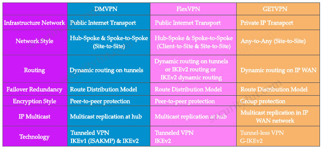
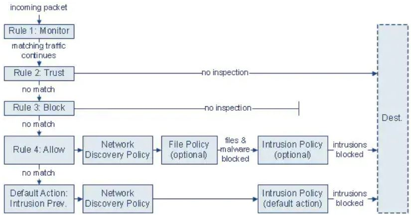

# Quiz Set 9


## 22. New Questions – Part 4

- <span style="color: #008888; font-weight: bold;">Question 1</span>

  Which function is performed by certificate authorities but is a limitation of registration authorities?

  A. CRL publishing<br>
  B. verifying user identity<br>
  C. certificate re-enrollment<br>
  D. accepts enrollment requests<br>

  <br>Answer: A

  Explanation

  A Registration Authority (RA) is an authority in a network that verifies user requests for a digital certificate and tells the Certificate Authority (CA) to issue it. RAs are part of a public key infrastructure (PKI), a networked system that enables companies and users to exchange information and money safely and securely.

  Certificate revocation list (CRL): This is a list of certificates, based on their serial numbers, that had initially been issued by a CA but have since been revoked and as a result should not be trusted.


- <span style="color: #008888; font-weight: bold;">Question 2</span>

  Which encryption algorithm provides highly secure VPN communications?

  A. DES<br>
  B. 3DES<br>
  C. AES 256<br>
  D. AES 128<br>

  <br>Answer: C


- <span style="color: #008888; font-weight: bold;">Question 3</span>

  A hacker initiated a social engineering attack and stole username and passwords of some users within a company. Which product should be used as a solution to this problem?

  A. Cisco NGFW<br>
  B. Cisco AMP for Endpoints<br>
  C. Cisco Duo<br>
  D. Cisco AnyConnect<br>

  <br>Answer: C


- <span style="color: #008888; font-weight: bold;">Question 4</span>

  How does a WCCP-configured router identify if the Cisco WSA is functional?

  A. If an ICMP ping fails three consecutive times between a router and the WSA, traffic is no longer transmitted to the router.<br>
  B. If an ICMP ping fails three consecutive times between a router and the WSA, traffic is no longer transmitted to the WSA.<br>
  C. The router sends a Here-I-Am message every 10 seconds, and the WSA acknowledges with an I-See-You message.<br>
  D. The WSA sends a Here-I-Am message every 10 seconds, and the router acknowledges with an I-See-You message.<br>

  <br>Answer: D

  Explanation

  If WCCP proxy health checking is enabled, the WSA’s WCCP daemon sends a proxy health check message (xmlrpc client request) to the xmlrpc server running on the Web proxy every 10 seconds. If the proxy is up and running, the WCCP service receives a response from the proxy and the WSA sends a WCCP "here I am" (HIA) message to the specified WCCP-enabled routers every 10 seconds. If the WCCP service doesn’t receive a reply from the proxy, then HIA messages are not sent to the WCCP routers.

  After a WCCP router misses three consecutive HIA messages, the router removes the WSA from its service group and traffic is no longer forwarded to the WSA.

  Reference: [Connect, Install, and Configure - User Guide for AsyncOS 11.0 for Cisco Web Security Appliances](https://www.cisco.com/c/en/us/td/docs/security/wsa/wsa11-0/user_guide/b_WSA_UserGuide/b_WSA_UserGuide_chapter_0111.html)


- <span style="color: #008888; font-weight: bold;">Question 5</span>

  What is a feature of NetFlow Secure Event Logging?

  A. It exports only records that indicate significant events in a flow.<br>
  B. It supports v5 and v8 templates.<br>
  C. It filters NSEL events based on the traffic and event type through RSVP.<br>
  D. It delivers data records to NSEL collectors through NetFlow over TCP only.<br>

  <br>Answer: A

  Explanation

  The ASA and ASASM implementations of NSEL provide a stateful, IP flow tracking method that exports only those records that indicate significant events in a flow -> Answer A is correct.

  The ASA and ASASM implementations of NSEL provide the following major functions:
  …
  - Tracks configured NSEL collectors and delivers templates and data records to these configured NSEL collectors through NetFlow over UDP only -> Answer D is not correct.
  - Filters NSEL events based on the traffic and event type through Modular Policy Framework, then sends records to different collectors -> Answer C is not correct.

  Reference: [Configuring  NetFlow Secure Event Logging (NSEL)](https://www.cisco.com/c/en/us/td/docs/security/asa/asa91/asdm71/general/asdm_71_general_config/monitor_nsel.pdf)

  Only NSEL version 9 supports templates -> Answer B is not correct.


- <span style="color: #008888; font-weight: bold;">Question 6</span>

  An administrator needs to configure the Cisco ASA via ASDM such that the network management system can actively monitor the host using SNMPv3. Which two tasks must be performed for this configuration? (Choose two)

  A. Specify the SNMP manager and UDP port.<br>
  B. Specify a community string.<br>
  C. Add an SNMP USM entry.<br>
  D. Add an SNMP host access entry.<br>
  E. Specify an SNMP user group.<br>

  <br>Answer: A D  (D E)

  Explanation

  This is how to configure SNMP on your Cisco ASA using ASDM:
  - The first order of business is to navigate to the screen shown below:

    <figure style="margin: 0.5em; display: flex; justify-content: center; align-items: center;">
      
    </figure>

  - Next, click on the Add button above and the window below appears:

    <figure style="margin: 0.5em; display: flex; justify-content: center; align-items: center;">
      
    </figure>

  Reference: [Setting up SNMP on the Cisco ASA using ASDM](https://www.plixer.com/blog/setting-up-snmp-on-the-cisco-asa-using-asdm/)


- <span style="color: #008888; font-weight: bold;">Question 7</span>

  Which technology enables integration between Cisco ISE and other platforms to gather and share network and vulnerability data and SIEM and location information?

  A. pxGrid<br>
  B. SNMP<br>
  C. NetFlow<br>
  D. Cisco Talos<br>

  <br>Answer: A

  Explanation

  Cisco ISE uses Cisco Platform Exchange Grid (pxGrid) technology to share contextual data with leading SIEM and TD partner solutions.

  Reference: [Cisco Identity Services Engine with Integrated Security Information and Event Management and Threat Defense Platforms At-a-Glance](https://www.cisco.com/c/en/us/products/collateral/security/identity-services-engine/at-a-glance-c45-732858.html)


- <span style="color: #008888; font-weight: bold;">Question 8</span>

  A large organization wants to deploy a security appliance in the public cloud to form a site-to-site VPN and link the public cloud environment to the private cloud in the headquarters data center. Which Cisco security appliance meets these requirements?

  A. Cisco Cloud Orchestrator<br>
  B. Cisco Stealthwatch Cloud<br>
  C. Cisco ASAv<br>
  D. Cisco WSAv<br>

  <br>Answer: C


- <span style="color: #008888; font-weight: bold;">Question 9</span>

  What is a benefit of using Cisco Tetration?

  A. It collects policy compliance data and process details.<br>
  B. It collects telemetry data from servers and then uses software sensors to analyze flow information.<br>
  C. It collects near-real time data from servers and inventories the software packages that exist on servers<br>
  D. It collects enforcement data from servers and collects interpacket variation.<br>

  <br>Answer: C

  Explanation

  Cisco Secure Workload (formerly Tetration) collects packet header metadata, process details and installed software package information. This is collected via the software sensors deployed on the workloads and made available as part of the solution. More detailed information is available in the Cisco Secure Workload product documentation. Below are the high-level details regarding the telemetry data that is collected by Cisco Secure Workload:
  - Flow information: Contains details about flow endpoints, protocols, and ports, when the flow started, how long the flow was active, etc.
  - Inter-packet variation: Captures any inter-packet variations seen within the flow, including variations in the packet's Time to Live (TTL), IP/TCP flags, packet length, etc.
  - Process details: Captures processes executed on the server, including information about process parameters, start and stop time, process binary hash, etc.
  - Software packages: Inventory of all software packages installed on the server along with the version and publisher information
  - Cisco Secure Workload forensics capability: If a customer turns on the Cisco Secure Workload forensics capability, additional Personally Identifiable Information may be collected.

  Reference: [Cisco Secure Workload as a Service](https://trustportal.cisco.com/c/dam/r/ctp/docs/privacydatasheet/security/cisco-tetration-privacy-data-sheet.pdf)


- <span style="color: #008888; font-weight: bold;">Question 10</span>

  Which standard is used to automate exchanging cyber threat information?

  A. IoC<br>
  B. TAXII<br>
  C. MITRE<br>
  D. STIX<br>

  <br>Answer: B

  Explanation

  Structured Threat Information Expression (STIX) and Trusted Automated Exchange of Intelligence Information (TAXII) are standards developed in an effort to improve the prevention and mitigation of cyber-attacks. STIX states the "what" of threat intelligence, while TAXII defines "how" that information is relayed. Unlike previous methods of sharing, STIX and TAXII are machine-readable and therefore easily automated.

  TAXII should be the best answer here because it is Trusted Automated Exchange of Intelligence Information.


- <span style="color: #008888; font-weight: bold;">Question 11</span>

  Which security solution uses NetFlow to provide visibility across the network, data center, branch offices, and cloud?

  A. Cisco Encrypted Traffic Analytics<br>
  B. Cisco CTA<br>
  C. Cisco Umbrella<br>
  D. Cisco Stealthwatch<br>

  <br>Answer: D


- <span style="color: #008888; font-weight: bold;">Question 12</span>

  An email administrator is setting up a new Cisco ESA. The administrator wants to enable the blocking of greymail for the end user. Which feature must the administrator enable first?

  A. IP Reputation Filtering<br>
  B. Anti-Virus Filtering<br>
  C. File Analysis<br>
  D. Intelligent Multi-Scan<br>

  <br>Answer: D

  Explanation

  For graymail detection, anti-spam scanning must be enabled globally. This can be either the IronPort Anti-Spam, the Intelligent Multi-Scan feature, or Outbreak Filters.

  Reference: [Managing Graymail - User Guide for AsyncOS 12.0 for Cisco Email Security Appliances - GD](https://www.cisco.com/c/en/us/td/docs/security/esa/esa12-0/user_guide/b_ESA_Admin_Guide_12_0/b_ESA_Admin_Guide_chapter_01101.html)


- <span style="color: #008888; font-weight: bold;">Question 13</span>

  Drag and drop the exploits from the left onto the type of security vulnerability on the right.

  <figure style="margin: 0.5em; display: flex; justify-content: center; align-items: center;">
    
  </figure>

  <br>Answer:
  - path transversal (1): gives unauthorized access to web server files (C)
  - cross-site request forgery (2): makes the client the target of attack (B)
  - SQL injection (3): accesses or modifies application data (D)
  - buffer overflow (4): causes memory access errors (A)

  Explanation

  The directory traversal/path traversal attack (also known as dot dot slash attack) is an HTTP exploit that allows an attacker to access restricted files, directories and commands that reside outside the web server’s root directory.


- <span style="color: #008888; font-weight: bold;">Question 14</span>

  Which technology provides the benefit of Layer 3 through Layer 7 innovative deep packet inspection, enabling the platform to identify and output various applications within the network traffic flows?

  A. Cisco ASAv<br>
  B. Cisco Prime Infrastructure<br>
  C. Cisco NBAR2<br>
  D. Account on Resolution<br>

  <br>Answer: C

  Explanation

  Operating on Cisco IOS and Cisco IOS XE, NBAR2 utilizes innovative deep packet inspection (DPI) technology to identify a wide variety of applications within the network traffic flow, using L3 to L7 data.

  Reference: [Techology Overview](https://www.cisco.com/c/en/us/td/docs/ios/solutions_docs/avc/guide/avc-user-guide/avc_tech_overview.pdf)


- <span style="color: #008888; font-weight: bold;">Question 15</span>

  An organization must add new firewalls to its infrastructure and wants to use Cisco ASA or Cisco FTD. The chosen firewalls must provide methods of blocking traffic that include offering the user the option to bypass the block for certain sites after displaying a warning page and to reset the connection. Which solution should the organization choose?

  A. Cisco ASA because it has an additional module that can be installed to provide multiple blocking capabilities, whereas Cisco FTD does not.<br>
  B. Cisco FTD because it enables interactive blocking and blocking with reset natively, whereas Cisco ASA does not.<br>
  C. Cisco FTD because it supports system rate level traffic blocking, whereas Cisco ASA does not.<br>
  D. Cisco ASA because it allows for interactive blocking and blocking with reset to be configured via the GUI, whereas Cisco FTD does not.<br>

  <br>Answer: B

  Explanation

  Interactive Block Response Page: Warns users, but also allows them to click a button (or refresh the page) to load the originally requested site. Users may have to refresh after bypassing the response page to load page elements that did not load.

  Reference: [HTTP Response Pages and Interactive Blocking - Firepower Management Center Configuration Guide](https://www.cisco.com/c/en/us/td/docs/security/firepower/620/configuration/guide/fpmc-config-guide-v62/http_response_pages_and_interactive_blocking.html)


- <span style="color: #008888; font-weight: bold;">Question 16</span>

  An engineer is configuring web filtering for a network using Cisco Umbrella Secure Internet Gateway. The requirement is that all traffic needs to be filtered. Using the SSL decryption feature, which type of certificate should be presented to the end-user to accomplish this goal?

  A. third-party<br>
  B. SubCA<br>
  C. self-signed<br>
  D. organization owned root<br>

  <br>Answer: D

  Explanation

  The SSL Decryption feature does require the root certificate be installed.

  Reference: [Cisco Umbrella Intelligent Proxy and SSL Decryption](https://community.cisco.com/t5/security-blogs/cisco-umbrella-intelligent-proxy-and-ssl-decryption/ba-p/4453056)


- <span style="color: #008888; font-weight: bold;">Question 17</span>

  Which two parameters are used to prevent a data breach in the cloud? (Choose two)

  A. encryption<br>
  B. complex cloud-based web proxies<br>
  C. strong user authentication<br>
  D. antispoofing programs<br>
  E. DLP solutions<br>

  <br>Answer: A C

  Explanation

  A data breach is a security violation or incident that leads to the theft of sensitive or critical data or its exposure to an unauthorized party. These incidents can be intentional, such as a database hack, or accidental, such as an employee emailing confidential files to the wrong recipient.

  Two-factor authentication and secure access solutions for cloud apps make it more difficult for malicious hackers or insiders to compromise users, including those who work remotely or on a contract basis -> Answer C is correct.

  Reference: [Steps that can help prevent a data breach](https://www.cisco.com/c/en/us/products/security/what-is-data-breach.html#~how-to-prevent-a-breach)

  In the Data Breaches in Cloud Computing article, encryption is one of the top five methods to prevent data breach in the cloud -> Answer A is correct.


- <span style="color: #008888; font-weight: bold;">Question 18</span>

  What is the term for when an endpoint is associated to a provisioning WLAN that is shared with guest access, and the same guest portal is used as the BYOD portal?

  A. streamlined access<br>
  B. multichannel GUI<br>
  C. single-SSID BYOD<br>
  D. dual-SSID BYOD<br>

  <br>Answer: D

  Explanation

  If guest access is utilizing one of the named guest account, then same guest portal can be used for employee BYOD portal. This flow is called Dual-SSID BYOD, where the endpoint is associated to a provisioning WLAN which is typically shared with guest access.

  Reference: [ISE BYOD: Dual vs. Single SSID Onboarding](https://community.cisco.com/t5/security-documents/ise-byod-dual-vs-single-ssid-onboarding/ta-p/3641422)


- <span style="color: #008888; font-weight: bold;">Question 19</span>

  What is the function of the `crypto isakmp key cisc414685095 address 192.168.50.1 255.255.255.255` command when establishing an IPsec VPN tunnel?

  A. It prevents 192.168.50.1 from connecting to the VPN server.<br>
  B. It defines that data destined to 192.168.50.1 is going to be encrypted.<br>
  C. It configures the pre-shared authentication key for host 192.168.50.1.<br>
  D. It configures the local address for the VPN server 192.168.50.1.<br>

  <br>Answer: C

  Explanation

  Note:
  - "address 192.168.60.1 255.255.255.255" means remote peer is host 192.168.50.1
  - The Phase 1 password is "cisc414685095".


- <span style="color: #008888; font-weight: bold;">Question 20</span>

  Which CLI command is used to enable URL filtering support for shortened URLs on the Cisco ESA?

  A. `outbreakconfig`<br>
  B. `websecurityadvancedconfig`<br>
  C. `webadvancedconfig`<br>
  D. `websecurityconfig`<br>

  <br>Answer: B

  Explanation

  Enabling URL filtering support for shortened URLs is able to be done by CLI only, using `websecurityadvancedconfig`

  Reference: [URL Filtering Configuration and Best Practices for Cisco Email Security](https://www.cisco.com/c/en/us/support/docs/security/email-security-appliance/118775-technote-esa-00.html)


- <span style="color: #008888; font-weight: bold;">Question 21</span>

  Which Cisco ASA deployment model is used to filter traffic between hosts in the same IP subnet using higher-level protocols without readdressing the network?

  A. single context mode<br>
  B. routed mode<br>
  C. transparent mode<br>
  D. multiple context mode<br>

  <br>Answer: C

  Explanation

  An ASA Firewall is capable of operating at Layer 2 when running in transparent mode. Ability to filter traffic between hosts using higher-level protocols (e.g. IP addressing and ports) without readdressing the network.

  Reference: [Cisco ASA Transparent Firewalls](https://grumpy-networkers-journal.readthedocs.io/en/latest/VENDOR/CISCO/FIREWALL/ASA/TRANSPARENTFW.html)


- <span style="color: #008888; font-weight: bold;">Question 22</span>

  Which open source tool does Cisco use to create graphical visualizations of network telemetry on Cisco IOS XE devices?

  A. SNMP<br>
  B. Splunk<br>
  C. Grafana<br>
  D. InfluxDB<br>

  <br>Answer: C

  Explanation

  Visualization with Grafana
  Grafana is the visualization engine that is used to display the telemetry data.

  Reference: [Enterprise Streaming Telemetry and You: Getting Started with Model Driven Telemetry](https://blogs.cisco.com/developer/getting-started-with-model-driven-telemetry)

  Note: InfluxDB is used to store the telemetry data.


- <span style="color: #008888; font-weight: bold;">Question 23</span>

  Which Cisco DNA Center Intent API action is used to retrieve the number of devices known to a DNA Center?

  A. `GET https://fqdnOrlPofDnaCenterPlatform/dna/intent/api/v1/network-device/count`<br>
  B. `GET https://fqdnOrlPofDnaCenterPlatform/dna/intent/api/v1/network-device/startIndex/recordsToReturn`<br>
  C. `GET https://fqdnOrlPofDnaCenterPlatform/dna/intent/api/v1/network-device`<br>
  D. `GET https://fqdnOrlPofDnaCenterPlatform/dna/intent/api/v1/network-device?parameter1=value&parameter2=value&…`<br>

  

  <br>Answer: A

  Explanation

  Once the developer has the token, it is possible to get the network devices count.

  ```python
  DEVICES_COUNT_URL = '/dna/intent/api/v1/network-device/count'
  response = requests.get(BASE_URL + DEVICES_COUNT_URL, headers = headers, verify=False)
  print(response.json())
  ```

  Reference: [Devices Count](https://developer.cisco.com/docs/dna-center/#!devices/devices-api)


- <span style="color: #008888; font-weight: bold;">Question 24</span>

  When NetFlow is applied to an interface, which component creates the flow monitor cache that is used to collect traffic based on the key and nonkey fields in the configured record?

  A. flow sampler<br>
  B. flow exporter<br>
  C. records<br>
  D. flow monitor<br>

  <br>Answer: D

  Explanation

  The Netflow flow monitor component is used to provide the actual traffic monitoring on a configured interface. When a flow monitor is applied to an interface, a flow monitor cache is created that is used to collect the traffic based on the key and nonkey fields in the configured record.

  Reference: [Flexible Netflow Concepts and Configuration](https://www.ciscopress.com/articles/article.asp?p=1730890)


- <span style="color: #008888; font-weight: bold;">Question 25</span>

  Refer to the exhibit.

  ```text
  ASA# show service-policy sfr

  Global policy:
    Service-policy: global_policy
      Class-map: SFR
        SFR: card status Up, mode fail-open monitor-only
          packet input 0, packet output 44715478687, drop 0, reset-drop 0
  ```

  What are two indications of the Cisco Firepower Services Module configuration? (Choose two)

  A. The module is operating in IPS mode.<br>
  B. The module fails to receive redirected traffic.<br>
  C. Traffic is blocked if the module fails.<br>
  D. Traffic continues to flow if the module fails.<br>
  E. The module is operating in IDS mode.<br>

  <br>Answer: D E

  Explanation

  In a passive deployment, a copy of the traffic is sent to the SFR service module, but it is not returned to the ASA. Passive mode allows you to view the actions that the SFR module would have completed in regards to the traffic. It also allows you to evaluate the content of the traffic, without an impact to the network.

  If you want to configure the SFR module in passive mode, use the monitor-only keyword (as shown in the next example). If you do not include the keyword, the traffic is sent in inline mode.

  ```text
  ciscoasa(config-pmap-c)# sfr fail-open monitor-only
  ```

  Reference: [Install and Configure a FirePOWER Services Module on an ASA Platform](https://www.cisco.com/c/en/us/support/docs/security/asa-firepower-services/118644-configure-firepower-00.html)

  -> This SFR module is configured in passive mode -> Answer E is not correct.

  In monitor-only mode, the input counters remain at zero. -> Answer B is not correct.

  The Cisco ASA 5500 security appliance is not just a plain firewall. With an add-on security module (AIP-SSM), you can transform the ASA 5500 into an IDS/IPS sensor as well.

  The Sensor operates in either "Promiscuous Mode" (IDS functionality) or "Inline Mode" (IPS functionality).

  In Promiscuous Mode, the sensor does not intervene in traffic flow, but just "sniffs" the traffic that passes through the firewall and takes appropriate actions in the event of an attack.

  -> This module is operating in IPS mode.

  Reference: [Cisco IDS/IPS Module for Cisco ASA Firewalls (AIP-SSM)](https://www.networkstraining.com/cisco-ids-ips-module-for-cisco-asa-firewalls-aip-ssm/)


- <span style="color: #008888; font-weight: bold;">Question 26</span>

  Why is it important for the organization to have an endpoint patching strategy?

  A. so the organization can identify endpoint vulnerabilities<br>
  B. so the network administrator is notified when an existing bug is encountered<br>
  C. so the internal PSIRT organization is aware of the latest bugs<br>
  D. so the latest security fixes are installed on the endpoints<br>

  <br>Answer: A


- <span style="color: #008888; font-weight: bold;">Question 27</span>

  Which system is InfluxDB and Grafana be used on to pull the data and display the visualization information?

  A. Docker containers<br>
  B. Windows Server 2019<br>
  C. specialized Cisco Linux system<br>
  D. Windows Server 2016<br>

  <br>Answer: C


- <span style="color: #008888; font-weight: bold;">Question 28</span>

  Which Cisco ASA Platform mode disables the threat detection features except for Advanced Threat Statistics?

  A. routed<br>
  B. multiple context<br>
  C. cluster<br>
  D. transparent<br>

  <br>Answer: B

  Explanation

  Cisco ASA Threat Detection does not support multiple context mode.

  Reference: [Cisco ASA Threat Detection](https://grumpy-networkers-journal.readthedocs.io/en/latest/VENDOR/CISCO/FIREWALL/ASA/THREATDETECT.html)


- <span style="color: #008888; font-weight: bold;">Question 29</span>

  Which two parameters are used for device compliance checks? (Choose two)

  A. device operating system version<br>
  B. DHCP snooping checks<br>
  C. Windows registry values<br>
  D. endpoint protection software version<br>
  E. DNS integrity checks<br>

  <br>Answer: A D (C D)


- <span style="color: #008888; font-weight: bold;">Question 30</span>

  A network engineer entered the `snmp-server user asmith myv7 auth sha cisco priv aes 256 cisc0414685095` command and needs to send SNMP information to a host at `10.255.255.1`. Which command achieves this goal?

  A. `snmp-server host inside 10.255.255.1 version 3 asmith`<br>
  B. `snmp-server host inside 10.255.255.1 snmpv3 myv7`<br>
  C. `snmp-server host inside 10.255.255.1 snmpv3 asmith`<br>
  D. `snmp-server host inside 10.255.255.1 version 3 myv7`<br>

  <br>Answer: A

  Explanation

  The command `snmp-server user asmith myv7 auth sha cisco priv aes 256 cisc0414685095` creates a user name "asmith" and he belongs to group "myv7". The password for this user is "cisco" and "cisc0414685095" is the shared secret.

  In order to send SNMP information to a remote host, we have to configure the username (not password) in the "snmp-server host …" command. So the command must include "asmith" as the username. And we configure SNMPv3 by using keyword "version 3", not "snmpv3".


- <span style="color: #008888; font-weight: bold;">Question 31</span>

  An engineer is configuring Cisco WSA and needs to enable a separated email transfer flow from the Internet and from the LAN. Which deployment mode must be used to accomplish this goal?

  A. two-interface<br>
  B. single interface<br>
  C. multi-context<br>
  D. transparent<br>

  <br>Answer: A


- <span style="color: #008888; font-weight: bold;">Question 32</span>

  A small organization needs to reduce the VPN bandwidth load on their headend Cisco ASA in order to ensure that bandwidth is available for VPN users needing access to corporate resources on the 10.0.0.0/24 local HQ network. How is this accomplished without adding additional devices to the network?

  A. Configure VPN load balancing to send non-corporate traffic straight to the internet.<br>
  B. Use split tunneling to tunnel traffic for the 10.0.0.0/24 network only.<br>
  C. Configure VPN load balancing to distribute traffic for the 10.0.0.0/24 network.<br>
  D. Use split tunneling to tunnel all traffic except for the 10.0.0.0/24 network.<br>

  <br>Answer: B


- <span style="color: #008888; font-weight: bold;">Question 33</span>

  Which benefit does DMVPN provide over GETVPN?

  A. DMVPN can be used over the public Internet, and GETVPN requires a private network<br>
  B. DMVPN is a tunnel-less VPN, and GETVPN is tunnel-based.<br>
  C. DMVPN supports QoS, multicast, and routing, and GETVPN supports only QoS.<br>
  D. DMVPN supports non-IP protocols, and GETVPN supports only IP protocols.<br>

  <br>Answer: A

  Explanation

  DMVPN, FlexVPN and GETVPN comparison:

  <figure style="margin: 0.5em; display: flex; justify-content: center; align-items: center;">
    
  </figure>
  
  Note: GETVPN is tunnel-less VPN while DMVPN is tunnel-based.


- <span style="color: #008888; font-weight: bold;">Question 34</span>

  Which system facilitates deploying microsegmentation and multi-tenancy services with a policy-based container?

  A. Docker<br>
  B. SDLC<br>
  C. Lambda<br>
  D. Contiv<br>

  <br>Answer: D


- <span style="color: #008888; font-weight: bold;">Question 35</span>

  An engineer needs to configure an access control policy rule to always send traffic for inspection without using the default action. Which action should be configured for this rule?

  A. monitor<br>
  B. allow<br>
  C. trust<br>
  D. block<br>

  <br>Answer: B

  Explanation

  Monitor evaluates traffic first. Monitor rules track and log network traffic. The system continues to match traffic against additional rules to determine whether to permit or deny it. -> Therefore monitor rule still uses other rules below, including the default action.

  For Allow rule, matching traffic is allowed; however, prohibited files, malware, intrusions, and exploits within that traffic are detected and blocked. Remaining non-prohibited, non-malicious traffic is allowed to its destination, though it is still subject to identity requirements and rate limiting. You can configure Allow rules that perform only file inspection, or only intrusion inspection, or neither.

  <figure style="margin: 0.5em; display: flex; justify-content: center; align-items: center;">
    
  </figure>

  Reference: [Firepower Management Center Configuration Guide, Version 6.1](https://www.cisco.com/c/en/us/td/docs/security/firepower/610/configuration/guide/fpmc-config-guide-v61/access_control_rules.html)


- <span style="color: #008888; font-weight: bold;">Question 36</span>

  Which two functions does the Cisco Advanced Phishing Protection solution perform in trying to protect from phishing attacks? (Choose two)

  A. uses a static algorithm to determine malicious<br>
  B. determines if the email messages are malicious<br>
  C. does a real-time user web browsing behavior analysis<br>
  D. blocks malicious websites and adds them to a block list<br>
  E. provides a defense for on-premises email deployments<br>


  <br>Answer: B E

  Explanation

  Benefits of Cisco Advanced Phishing Protection

  …

  - Provides another layer of defense to more effectively secure your email environment. -> Answer E is correct
  - Automatically remove malicious emails from the recipient’s inbox and calls out identity deception techniques to prevent wire fraud or other advanced attacks. -> Answer B is correct.

  Reference: [Integrating the Email Gateway with Cisco Advanced Phishing Protection](https://www.cisco.com/c/en/us/td/docs/security/esa/esa13-5/user_guide/b_ESA_Admin_Guide_13-5/m_advanced_phishing_protection.html)


- <span style="color: #008888; font-weight: bold;">Question 37</span>

  What are two things to consider when using PAC files with the Cisco WSA? (Choose two)

  A. If the WSA host port is changed, the default port redirects web traffic to the correct port automatically<br>
  B. The WSA hosts PAC files on port 6001 by default.<br>
  C. PAC files use if-else statements to determine whether to use a proxy or a direct connection for traffic between the PC and the host.<br>
  D. By default, they direct traffic through a proxy when the PC and the host are on the same subnet<br>
  E. The WSA hosts PAC files on port 9001 by default.<br>

  <br>Answer: C E

  Explanation

  By default, the proxy PAC file would be hosted on port 9001. When using WSA to host PAC files, by default, we need to point the browser to the following location `http://WSA_IP:9001/pacfile.pac` -> Answer B is not correct while answer E is correct.

  The PAC file checks the local IP subnet address of the PC and then makes a decision based on IF / ELSE statement/s -> Answer C is correct.

  If the default port is changed in the PAC file hosting settings, then we would need to change the port accordingly in the above URL -> Answer A is not correct.

  Reference: [What is a PAC file and where is it located on WSA?](https://www.cisco.com/c/en/us/support/docs/security/web-security-appliance/118082-qanda-wsa-00.html)


- <span style="color: #008888; font-weight: bold;">Question 38</span>

  When implementing transparent user identification for single sign-on with Internet Explorer, how is the redirect hostname configured?

  A. as an IP address<br>
  B. as a FQDN<br>
  C. as a distinguished name<br>
  D. as a short host name<br>

  <br>Answer: D

  Explanation

  Configuring Single-Sign-on
  - Obtaining credentials transparently facilitates a single-sign-on environment. Transparent user identification is an authentication realm setting.
  - For Internet Explorer, be sure the Redirect Hostname is the short host name (containing no dots) or the NetBIOS name rather than a fully qualified domain.

  Reference: [Acquire End-User Credentials - User Guide for AsyncOS 11.0 for Cisco Web Security Appliances](https://www.cisco.com/c/en/us/td/docs/security/wsa/wsa11-0/user_guide/b_WSA_UserGuide/b_WSA_UserGuide_chapter_01001.html)


