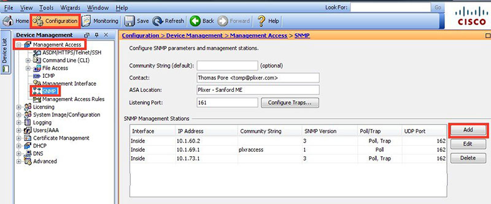
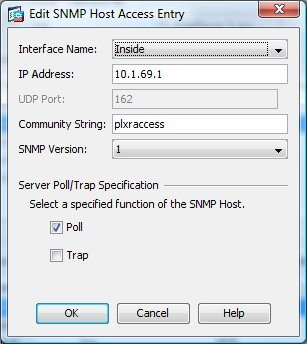

# Quiz Set 9

## New SCOR Questions – Part 4

- Question 1

  Which function is performed by certificate authorities but is a limitation of registration authorities?

  A. CRL publishing 
  B. verifying user identity 
  C. certificate re-enrollment 
  D. accepts enrollment requests 

  Answer: A

  Explanation

  A Registration Authority (RA) is an authority in a network that verifies user requests for a digital certificate and tells the Certificate Authority (CA) to issue it. RAs are part of a public key infrastructure (PKI), a networked system that enables companies and users to exchange information and money safely and securely.

  Certificate revocation list (CRL): This is a list of certificates, based on their serial numbers, that had initially been issued by a CA but have since been revoked and as a result should not be trusted.

- Question 2

  Which encryption algorithm provides highly secure VPN communications?

  A. DES 
  B. 3DES 
  C. AES 256 
  D. AES 128 

  Answer: C

- Question 3

  A hacker initiated a social engineering attack and stole username and passwords of some users within a company. Which product should be used as a solution to this problem?

  A. Cisco NGFW 
  B. Cisco AMP for Endpoints 
  C. Cisco Duo 
  D. Cisco AnyConnect 

  Answer: C

- Question 4

  How does a WCCP-configured router identify if the Cisco WSA is functional?

  A. If an ICMP ping fails three consecutive times between a router and the WSA, traffic is no longer transmitted to the router. 
  B. If an ICMP ping fails three consecutive times between a router and the WSA, traffic is no longer transmitted to the WSA. 
  C. The router sends a Here-I-Am message every 10 seconds, and the WSA acknowledges with an I-See-You message. 
  D. The WSA sends a Here-I-Am message every 10 seconds, and the router acknowledges with an I-See-You message. 

  Answer: D

  Explanation

  If WCCP proxy health checking is enabled, the WSA’s WCCP daemon sends a proxy health check message (xmlrpc client request) to the xmlrpc server running on the Web proxy every 10 seconds. If the proxy is up and running, the WCCP service receives a response from the proxy and the WSA sends a WCCP “here I am” (HIA) message to the specified WCCP-enabled routers every 10 seconds. If the WCCP service doesn’t receive a reply from the proxy, then HIA messages are not sent to the WCCP routers.

  After a WCCP router misses three consecutive HIA messages, the router removes the WSA from its service group and traffic is no longer forwarded to the WSA.

  Reference: https://www.cisco.com/c/en/us/td/docs/security/wsa/wsa11-0/user_guide/b_WSA_UserGuide/b_WSA_UserGuide_chapter_0111.html

- Question 5

  What is a feature of NetFlow Secure Event Logging?

  A. It exports only records that indicate significant events in a flow. 
  B. It supports v5 and v8 templates. 
  C. It filters NSEL events based on the traffic and event type through RSVP. 
  D. It delivers data records to NSEL collectors through NetFlow over TCP only. 

  Answer: A

  Explanation

  The ASA and ASASM implementations of NSEL provide a stateful, IP flow tracking method that exports only those records that indicate significant events in a flow -> Answer A is correct.

  The ASA and ASASM implementations of NSEL provide the following major functions:
  …
  - Tracks configured NSEL collectors and delivers templates and data records to these configured NSEL collectors through NetFlow over UDP only -> Answer D is not correct.
  - Filters NSEL events based on the traffic and event type through Modular Policy Framework, then sends records to different collectors -> Answer C is not correct.

  Reference: https://www.cisco.com/c/en/us/td/docs/security/asa/asa91/asdm71/general/asdm_71_general_config/monitor_nsel.pdf

  Only NSEL version 9 supports templates -> Answer B is not correct.

- Question 6

  An administrator needs to configure the Cisco ASA via ASDM such that the network management system can actively monitor the host using SNMPv3. Which two tasks must be performed for this configuration? (Choose two)

  A. Specify the SNMP manager and UDP port. 
  B. Specify a community string. 
  C. Add an SNMP USM entry. 
  D. Add an SNMP host access entry. 
  E. Specify an SNMP user group. 

  Answer: B D

  Explanation

  This is how to configure SNMP on your Cisco ASA using ASDM:
  The first order of business is to navigate to the screen shown below:

  <figure style="margin: 0.5em; display: flex; justify-content: center; align-items: center;">
    
  </figure>

  Next, click on the Add button above and the window below appears:

  <figure style="margin: 0.5em; display: flex; justify-content: center; align-items: center;">
    
  </figure>

  Reference: https://www.plixer.com/blog/setting-up-snmp-on-the-cisco-asa-using-asdm/

- Question 7

  Which technology enables integration between Cisco ISE and other platforms to gather and share network and vulnerability data and SIEM and location information?

  A. pxGrid 
  B. SNMP 
  C. NetFlow 
  D. Cisco Talos 

  Answer: A

  Explanation

  Cisco ISE uses Cisco Platform Exchange Grid (pxGrid) technology to share contextual data with leading SIEM and TD partner solutions.

  Reference: https://www.cisco.com/c/en/us/products/collateral/security/identity-services-engine/at-a-glance-c45-732858.html

- Question 8

  A large organization wants to deploy a security appliance in the public cloud to form a site-to-site VPN and link the public cloud environment to the private cloud in the headquarters data center. Which Cisco security appliance meets these requirements?

  A. Cisco Cloud Orchestrator 
  B. Cisco Stealthwatch Cloud 
  C. Cisco ASAv 
  D. Cisco WSAv 

  Answer: A

- Question 9

  What is a benefit of using Cisco Tetration?

  A. It collects policy compliance data and process details. 
  B. It collects telemetry data from servers and then uses software sensors to analyze flow information. 
  C. It collects near-real time data from servers and inventories the software packages that exist on servers 
  D. It collects enforcement data from servers and collects interpacket variation. 

  Answer: C

  Explanation

  Cisco Secure Workload (formerly Tetration) collects packet header metadata, process details and installed software package information. This is collected via the software sensors deployed on the workloads and made available as part of the solution. More detailed information is available in the Cisco Secure Workload product documentation. Below are the high-level details regarding the telemetry data that is collected by Cisco Secure Workload:
  - Flow information: Contains details about flow endpoints, protocols, and ports, when the flow started, how long the flow was active, etc.
  - Inter-packet variation: Captures any inter-packet variations seen within the flow, including variations in the packetʼs Time to Live (TTL), IP/TCP flags, packet length, etc.
  - Process details: Captures processes executed on the server, including information about process parameters, start and stop time, process binary hash, etc.
  - Software packages: Inventory of all software packages installed on the server along with the version and publisher information
  - Cisco Secure Workload forensics capability: If a customer turns on the Cisco Secure Workload forensics capability, additional Personally Identifiable Information may be collected.

  Reference: https://trustportal.cisco.com/c/dam/r/ctp/docs/privacydatasheet/security/cisco-tetration-privacy-data-sheet.pdf

(to be continued…)

