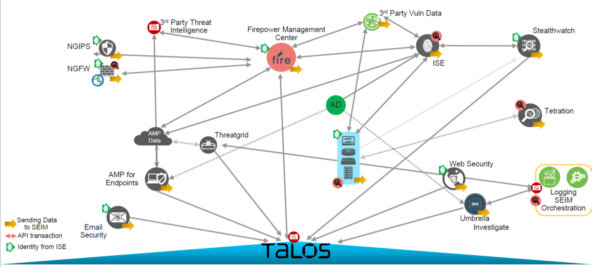

# SCOR 350-701 Notes

## Security Concepts

- Malware, exploits, and security threats
  - malware:
    - malicious software
    - any software intentionally designed to cause damage to a computer, server, client, or computer network
  - most popular types of malware
    - virus:
      - the most common type of malware
      - attach malicious code to clean code
      - wait to be run
      - gain <span style="color: #bb6600;">unauthorized access</span> to a computer system
    - ransomware: infect computer and display message demanding a fee to be paid
    - spyware:
      - secretly record everything user enter, upload, download and store on computers or mobile devices
      - keep itself hidden
  - vulnerability: a weakness in a software system
  - expolit:
    - a code taking advantage of a software a software vulnerability or security flaw
    - an attack that leverages that vulnerability
  - endpoint risks as company vulnerable: 1) <span style="color: #bb6600;">malware</span>; 2) <span style="color: #bb6600;">expolit</span>
  - Insecure APIs: a malicious user gained access to an organization's database from a <span style="color: #bb6600;">cloud-based application programming interface</span> that lacked strong authentication controls
  - data breach: a stolen customer database that contained social security numbers and was <span style="color: #bb6600;">published online</span>
  - compromised credentials: a phishing site appearing to be a legitimate login page captures <span style="color: #bb6600;">user login information</span>
  - worm: a software program that <span style="color: #bb6600;">copies itself</span> from one computer to another, without human interaction
  - spam: unwanted messages in an <span style="color: #bb6600;">email inbox</span
  - front-door attacks: require the actions of the user to allow the virus to infect the system
  - risk of Internet browser to access cloud-based service: <span style="color: #bb6600;">vulnerabilities within protocol</span>
  - vulnerability to see the password being transmitted in clear text: <span style="color: #bb6600;">unencrypted links for traffic</span>
  - <span style="color: #bb6600;">main-in-the-middle</span>: type of attack does the attacker insert their machine between two hosts that are communicating with each other
  - reason to have logical security controls on endpoints even though the users are trained to spot security threats and the network devices already help prevent them: <span style="color: #bb6600;">human error or insider threats will still exist</span>
  - vulnerability helps an attacker brute force their way into the systems: <span style="color: #bb6600;">weak passwords</span>
  - difference between a vulnerability and an exploit: <span style="color: #bb6600;">a vulnerability is a weakness that can be exploited by an attacker</span>


- Categories of attacks
  - volume-based attacks: use high traffic to inundate the network bandwidth
  - protocol attacks: focus on exploiting server resources
  - application attacks: focus on web applications and are considered the most sophisticated and serious type of attacks


- <mark style="background: #e0ffff;">SQL injection</mark>
  - <span style="color: #bb6600;">inserting malicious commands into the database</span>
  - occurred when asking a user for input
  - mitigate:
    - check parameters to ensure actual values
    - use prepared statements and parameterized queries
  - an attack where <span style="color: #bb6600;">code is injected into a browser</span>
  - inject SQL code (via his browser) into forms, cookies, or HTTP headers that do not use data sanitizing or validation methods of <span style="color: #bb6600;">PUT/POST parameters</span>
  - used to <span style="color: #bb6600;">steal information from databases</span>
  - what <span style="text-decoration:underline;">flaw</span> leveraging when exploiting SQL injection: <span style="color: #bb6600;">user input validation</span> in a web page or web application
  - prevention techniques used to mitigate SQL injection attacks
    - check integer, float, or Boolean string parameters to <span style="color: #bb6600;">ensure accurate values</span>
    - use <span style="color: #bb6600;">prepared statements and parameterized queries</span>


- <mark style="background: #e0ffff;">Cross Site Scripting (XSS)</mark>
  - web application gathering malicious data
  - usually gathered in the form of a hyperlink
  - click on this link from another website, instant message, or simply simply just reading a web board or email message
  - encode the malicious portion of the link to the site in <span style="color: #bb6600;">HEX (or other encoding methods)</span>
  - prevention: 1) sanitize user input; 2) limit use of user-provided data; 3) utilize the content security policy
  - preventive measures: 1) enable client-side scripts on a <span style="color: #bb6600;">per-domain basis</span>; 2) <span style="color: #bb6600;">contextual output encoding/escaping</span>
  - exploit website vulnerability by injecting scripts that will run at client's side.
  - a client-side vulnerability that targets other application users
  - attack by <span style="color: #bb6600;">injecting malicious code (usually malicious links) into a database</span>
  - used to <span style="color: #bb6600;">redirect users to websites</span> where attackers can steal data from them
  - send malicious code through a web application to an unsuspecting user to request that the victims web browser executes the code
  - method of attack is used by a hacker to send malicious code through a web application to an unsuspecting user to request that the victims web browser executes the code: <span style="color: #bb6600;">cross-site scripting</span>


- Trojan malware attacks
  - <span style="color: #bb6600;">back-door virus</span>
  - any form of program that grants unauthorized access to an entire system via a software or network vulnerability (Trojan malware attacks)
  - <span style="color: #bb6600;"></span>
    - Trojan malware attack
    - a type of malware that is designed to infect a target PC and allow an attacker to install a set of tools that grant him <span style="color: #bb6600;">persistent remote access</span> to the computer
    - a program providing maliciously privileged access to a computer
    - types: 1) kernel; 2) <span style="color: #bb6600;">user mode</span>; 3) <span style="color: #bb6600;">bootloader</span>; 4) Memory rootkits


- Buffer overflow
  - the volume of data exceeds the storage capacity of the memory buffer
  - write the data to the buffer overwrites adjacent memory locations
  - commonly associated w/ <span style="color: #bb6600;">C/C++</span> programming languages


- botnet
  - a collection of internet-connected devices infected by malware
  - unauthorized access
  - malicious activities including credentials leaks, unauthorized access, data theft and DDoS attacks
  - <span style="color: #bb6600;">group of computers</span> connected to the Internet that have been compromised by a hacker using a virus or Trojan horse


- <mark style="background: #e0ffff;">DoS and DDoS</mark>
  - categories of attacks: <span style="color: #bb6600;">protocol & volume-based</span>
  - common attacks: syn flood, udp flood, http flood, ping of death, smurf attack, fraggle attack, slowloris, application level attacks, NTP amplification,advanced persistent DoS (APDoS), zer-day DDoS attacks
  - DoS: <span style="color: #bb6600;">a computer</span> is used to flood a server with TCP and UDP packets
  - DDoS
    - multiple systems target a single system with a DoS attack
    - <span style="color: #bb6600;">shutting down</span> a network or service, causing it to be inaccessible to its intended users
    - an application attack using <span style="color: #bb6600;">botnet</span> from multiple remote locations that flood a web application causing a degraded performance or a complete outage
  - ping of death behavior
    - sending <span style="color: #bb6600;">malformed or oversized packets</span> w/ ping command
    - packets fragmented into <span style="color: #bb6600;">groups of 8 octets</span>
  - smurf attack
    - a DDoS attack
    - using a malware program to exploit Internet Protocol (IP) and Internet Control Message Protocol (ICMP)
    - spoof an IP address, and using ICMP, then ping IP addresses on a given network
    - large numbers of Internet Control Message Protocol (ICMP) packets with the intended victim's spoofed source IP are broadcast to a computer network using an IP broadcast address
  - sny flood:
    - receive <span style="color: #bb6600;">too many connection requests</span> from multiple machines
    - intent to <span style="color: #bb6600;">exceed the threshold limit of the connection queue</span>
  - teardrop attack
    - DoS attack
    - sending <span style="color: #bb6600;">fragmented packets</span> to a target machine
    - generally happen on older operating systems


- <mark style="background: #e0ffff;">Social engineering</mark>
  - goals: 1) <span style="color: #bb6600;">steal sensitive data or login information</span>; 2) <span style="color: #bb6600;">install malware</span>
  - phishing
    - a form of social engineering
    - fraudulent attempts by cyber criminals to obtain <span style="color: #bb6600;">private information</span>
    - sending fraudulent communications usually through email
  - types of phishing
    - <span style="color: #bb6600;">deceptive</span>: steal people's personal data or login credentials in a legitmate company
    - <span style="color: #bb6600;">spear</span>: designed to get a single recipient to respond
  - mitigation: <span style="color: #bb6600;">browser alert & email filtering</span>
  - endpoint measures used to minimize the chances
    - <span style="color: #bb6600;">spam and virus filter</span>
    - <span style="color: #bb6600;">up-to-date antimalware</span>
  - mechanisms used to control phising attacks
    - <span style="color: #bb6600;">enable browser alerts for fraudulent</span>
    - <span style="color: #bb6600;">implement email filtering techniques</span>
  - solutions to combat social engineering and phishing at the endpoint level: <span style="color: #bb6600;">Umbrella & Duo Security</span>


- <mark style="background: #e0ffff;">TAXII/STIX</mark>
  - TAXII (Trusted Automated Exchange of Indicator Information)
    - a transport mechanism (data exchange) of cyber threat intelligence information in STIX format
    - used to autho and exchange STIX documents among participants
    - capabilities: 1) push messaging; 2) <span style="color: #bb6600;">pull messaging</span>; 3) discovery <- automated <span style="color: #bb6600;">exchange</span>
    - functions of TAXII in threat intelligence sharing
      - <span style="color: #bb6600;">exchange</span> trusted anomaly intelligence information
      - determine how threat intelligence information <span style="color: #bb6600;">relayed</span>
  - STIX (Structured Threat Information eXpression)
    - a standardized language developed in a collaborative way to represent structured information about cyber threats
    - shared, stored, and otherwise used in a consistent manner
    - a language format designed to <span style="color: #bb6600;">exchange threat intelligence</span> transported over the TAXII protocol


- OpenIOC
  - an open framework, meant for sharing threat intelligence information in a machine-readable format
  - developed by the American cybersecurity firm MANDIANT in November 2011
  - in eXtensible Markup Language (XML) format
  - easily customized for additional intelligence so that incident responders can translate their knowledge into a standard format
  - leverage this format to share threat-related latest Indicators of Compromise (IoCs) with other organizations, enabling real-time protection against the latest threats
  - open standard creates a framework for sharing threat intelligence in a machine-digestible format: <span style="color: #bb6600;">OpenIoC</span>


- <span style="color: #bb6600;">Common Vulnerabilities & Exposures (CVE)</span>
  - an <span style="color: #bb6600;">identifier</span> assigned to vulnerability disclosured by vendors, security researchers, and vulnerability coordination centers
  - an industry-wide standard
  - sponsored by US-CERT, the office of Cybersecurity and Communications at the U.S. Department of Homeland Security
  - goal: <span style="color: #bb6600;">easier to share data</span> across tools, vulnerability repositories, and security services
  - industry organizations <span style="color: #bb6600;">publish and inform</span> users of known security findings and vulnerabilities


- <mark style="background: #e0ffff;">Zero Trust Model</mark>
  - a security framework requiring all users, whether in or outside the organization's network, to be <span style="color: #bb6600;">authenticated, authorized, and continuously validated for security configuration and posture</span> before being granted or keeping access to applications and data
  - assumptions
    - no traditional network edge
    - networks can be local, in the cloud, or a combination or hybrid with resources anywhere and workers in any location
  - use <span style="color: #bb6600;">microsegmentation</span> to contain attacks
  - technology to secure data in a cloud environment where 1) all users be authenticated and authorized; 2) security configuration and posture continuously validated before access is granted or maintained to applications and data; 3) allow certain application traffic and deny all other traffic by default: <span style="color: #bb6600;">microsegmentation</span>
  - microsegmentation
    - used by model
    - a security technique by dividing perimeters into small zones to maintain separate access to every part of the network
    - secure applications by expressly <span style="text-decoration: underline">allowing particular application traffic</span>
    - by default, denying all other traffic
    - the foundation of <span style="color: #bb6600;">zero-trust security model</span> for application workloads in the data center and cloud
    - monitor continuously for compliance deviations to ensure the segmentation policy up to date as the application behavior change 
    - a description of microsegmentation: environments apply a <span style="color: #bb6600;">zero-trust model</span> and specify how applications on different servers or containers can communicate
  - Contiv
    - an open source project to deploy microsegmentation policy-based services in container environments
    - offer a higher level of networking abstraction for microservices by providing a policy framework
    - built-in service discovery and service routing functions to scale out services
    - system faciltates deploying <span style="text-decoration:  underline">microsegmentation and multi-tenancy services</span> with a policy-based container: <span style="color: #bb6600;">Contiv</span>


- <mark style="background: #e0ffff;">Data exfiltration</mark>
  - ICMP exfiltration
    - encrypting the payload in an ICMP packet to carry out <span style="color: #bb6600;">command and control tasks</span> on a compromised host
  - DNS exfiltration
    - a.k.a. <span style="color: #bb6600;">DNS tunneling</span>
    - hide and encode data inside DNS requests and queries
    - encode the data of other programs or protocols in DNS queries and responses
    - often including data payloads added to an attacked DNS server and used to control a remote server and applications
    - <span style="color: #bb6600;">encode the payload with random characters</span> that are broken into short strings and the DNS server rebuilds the exfiltrated data
    - data sent out as part of the <span style="color: #bb6600;">domain name</span>
    - an attacker <span style="color: #bb6600;">registers a domain</span> that a client connects to based on DNS records and send malware through that connection
    - type of risk that DNS abuse exchanges data between two computers even when there is no direct connection: <span style="color: #bb6600;">data exfiltration</span>
  - characteristics of messenger protocol for data exflitration
    - <span style="color: #bb6600;">encrypted traffic</span> which prevents visibility on firewalls and IPS systems
    - <span style="color: #bb6600;">messenger apps unable to be segmented</span> w/ standard network controls


- Threat intelligence
  - the knowledge about an existing or emerging threat to assets including networks and systems
  - including context, mechanisms, indicators of compromise (IoCs), implications, and actionable advice
  - referred to as the information about the observables, IoCs intent, and capabilities of internal and external threat actors and their attacks
    - <span style="color: #bb6600;">information about threats and threat actors</span> to help mitigate harmful events

- Cisco security solutions

  <figure style="margin: 0.5em; display: flex; justify-content: center; align-items: center;">
    
  </figure>
  

## Integrity and Privacy

- <mark style="background: #e0ffff;">Digital Certificate & PKI</mark>
  - Trustpoint (Cisco)
    - an abstract container to hold a certificate in IOS
    - capable of storing two active certificates at any given time: 1) CA certificate; 2) ID certificate issued by CA
    - enrollment modes: 1) terminal - manual; 2) SCEP - over HTTP; 3) <span style="color: #bb6600;">profile</span> - separating authentication and enrollment actions and providing an option to specify HTTP/TFTP commands to perform file retrieval from the server
  - CA (certificate authority): <span style="color: #bb6600;">issue and revoke</span> digital certificates
  - certificate signing request (CSR)
    - one of the first steps towards getting your own SSL Certificate
    - generated on the same server you plan to install the certificate on
    - Certificate Authority (CA) using contained <span style="color: #bb6600;">server information</span> (e.g. common name, organization, country) to create your certificate
    - public key included in certificate
    - certificate signed with the corresponding private key
    - purpose of certificate signing request when adding a new certificate for a server: provide the <span style="color: #bb6600;">server information</span> so a certificate can be created and signed
    - purpose of CA in a PKI: <span style="color: #bb6600;">issue and revoke digital certificates</span>
  - Cisco IOS public key infrastructure (PKI)
    - provide certificate management to support security protocols
    - including IP Security (IPsec), secure shell (SSH), and secure socket layer (SSL)
    - entities
      - peers communicating on a secure network
      - at least one certification authority (CA) that grants and maintains certificates
      - digital certificates: containing information such as the certificate validity period, peer identity information, encryptions keys that are used for secure communications, and the signature of the issuing CA
      - optional registration authority (RA) to offload the CA by processing enrollment requests
      - a distribution mechanism (such as Lightweight Directory Access Protocol <span style="color: #bb6600;">(LDAP) or HTTP</span>) for certificate revocation lists (CRLs)
  - RSA keys
    - generate Rivest, Shamir, and Adelman (RSA) keypairs: `crypto key generate rsa`
    - export and import RSA key to encrypt and decrypt the PKCS12 file or the PEM file: <span style="color: #bb6600;">passphrase</span>
    - action to securely connect to a router and prevent insecure algorithms used: <span style="color: #bb6600;">generate the RSA key</span> using the `crypto key generate rsa` command


- <mark style="background: #e0ffff;">Cryptography</mark>
  - symmetric key cipher
    - same <span style="color: #bb6600;">secret key</span> used for both encryption and decryption
    - same secret key used by both sender and receiver
    - suited to internal encryption
    - pros: 1) faster; 2) efficient
    - Data Encryption Standard (DES)
      - encrypt and decrypt in blocks (block cipher): 64 bits block size
      - key size: 56 bits
    - Triple DES (<span style="color: #bb6600;">3DES</span>):
      - using DES 3 times
      - 2 ways: 1) 1st & 3rd w/ the same key, 2nd w/ different key; 2) 3 different keys
      - function of 3DES: <span style="color: #bb6600;">encrypt traffic</span>
    - Advanced Encryption Standard (AES)
      - highest level of protection
      - successor of DES
      - encrypt and decrypt in blocks (block cipher): <span style="color: #bb6600;">128 bits block size</span>
      - key size: 128, 192, or 256 -> AES-128, AES-192, or AES-256
      - AES-256 capability
        - secure <span style="color: #bb6600;">online connection</span> against cyberattacks that can compromise your security
        - offer robust <span style="color: #bb6600;">protocols</span> to combat malicious attacks
        - reinforce <span style="color: #bb6600;">online identity</span>
      - ensures <span style="color: #bb6600;">data confidentiality</span>
  - asymmetric key
    - public key cryptography
    - using keypairs (a private key and a public key)
    - more complex and time comsuming -> <span style="color: #bb6600;">require more time</span>
    - <span style="color: #bb6600;">Diffie-Hellman exchange</span>: an asymmetric algorithm used to establish <span style="color: #bb6600;">a shared secret for a symmetric key algorithm</span>
    - <span style="color: #bb6600;">RSA</span>: provide <span style="color: #bb6600;">authentication</spam>
    - Elliptic Curve Cryptography (ECC): smaller key sizes, faster computation, as well as memory, energy and bandwidth savings
  - functions of secret key cryptography (=? asymmetric key)
    - <span style="color: #bb6600;">different keys</span> for encryption and decryption
    - the capability to only <span style="color: #bb6600;">know one key on one side</span>


- Security issues of privacy and integrity 
  - passwords being transmitted in clear text: <span style="color: #bb6600;">unencrypted links for traffic</span>
  - Secure Hash Algorithm (SHA-1):
    - a.k.a. HMAC-SHA-1
    - ensure <span style="color: #bb6600;">data integrity</span>
    - ensures data has not been changed in transit
    - one way hash functions to determine if data has been changed
    - stronger than Message Digest 5 (MD5)
    - provide data integrity (to guarantee data has not been altered in transit) and authentication (to guarantee data came from the source it was supposed to come from)
    - used with the <span style="color: #bb6600;">digital signature standard</span>
    - used by IPsec to ensure that a message has not been altered


## Virtual Private Networks

- <mark style="background: #e0ffff;">Internet Key Exchange (IKE) framework</mark>
  - used for remote host, network access, and virtual private network (VPN) access
  - enable two parties on the Internet to communicate securely
  - a <span style="color: #bb6600;">key management protocol</span> used to set up a security association (SA) using Internet Protocol Security (IPsec)
  - IKE SA
    - describe the <span style="color: #bb6600;">security parameters</span> between two IKE devices
    - the first stage in establishing IPsec
  - IKEv1
    - Phase 1: ISAKMP
      - define <span style="color: #bb6600;">IKE SAs</span>
      - modes: <span style="color: #bb6600;">main - 6 msgs; agressive - 4 msgs</sign>
      - <span style="color: #bb6600;">preshared authentication key</span>
        - global configuration mode
        - syntax: `crypto isakmp key <keystring> address <peer-address> [mask]` or `crypto isakmp key <keystring> hostname <peer-hostname>`
        - <span style="color: #bb6600;">same command on two end devices</span>
        - debug msg: `ISAKMP:(1002): retransmitting phase 1 MM_KEY_EXCH...` -> sign of <span style="color: #bb6600;">authentication key mismatch</span>
        - example pre-shared key exchange config
          - apply to any device: `crypto isakmp key cisco address 0.0.0.0`
          - apply to exact devices: `crypto isakmp key cisco address 1.2.3.4` or `crypto isakmp key cisco address 1.2.3.4 255.255.255.255`
          - cmd `crypto isakmp key ciscXXXXXXXX address 172.16.0.0`: authenticates the IP address of the <span style="color: #bb6600;">172.16.0.0/32 peer</span> by using the key `ciscXXXXXXXX`
      - ensure that the ISAKMP key on the hub is used only for terminating traffic from the IP address of 172.19.20.24
        - define the <span style="color: #bb6600;">ISAKMP identity</span> used by the router when participating in the Internet Key Exchange (IKE) protocol: `crypto isakmp identity {address | hostname}`
        - configure a <span style="color: #bb6600;">preshared authentication key</span>: `crypto isakmp key Cisco0123456789 address 172.19.20.24`
      - function of the `crypto isakmp key cisc6397954 address 0.0.0.0 0.0.0.0` command when establishing an IPsec VPN tunnel: <span style="color: #bb6600;">configure the pre-shared authentication key</span>
    - phase 2: IPsec
  - IKEv2
    - standard  <span style="color: #bb6600;">including NAT-T</span>
    - <span style="color: #bb6600;">4 msgs</span> for both phase 1 & 2
    - using <span style="color: #bb6600;">EAP for authenticating</span> remote access clients
    - name mangler
      - offer the flexibility to perform AAA-based policy lookup for the peer based on arbitrary portions of the peer IKE identities of various types
      - referenced from the IKEv2 profile specifically from the `aaa authorization` and `keyring aaa` commands that use AAA authorization for policy lookup
      - config OU of the <span style="color: #bb6600;">IKEv2 peer certificate used as the identity</span> when matching an IKEv2 authorization policy
        - define a name mangler and enter IKEv2 name mangler config: `crypto ikev2 name-mangler MANGLER`
        - derive the name from any of the fields in the remote identity of type DN (distinguished name): `dn organization-unit`


- SSL, TLS & DTLS
  - Datagram Transport Layer Security (DTLS)
    - UDP based
    - used for delay sensitive applications (voice and video)
    - <span style="color: #bb6600;">strongest throughput performance</span>
  - successful TLS connection from <span style="color: #bb6600;">remote host</span> (reception) in mail logs

    ```text
    Info: New SMTP ICID 30 Interface Management (192.168.0.100)
      address 10.128.128.200 reverse dns host unknown verified no
    Info: ICID 30 ACCEPT SG SUSPECTLIST match sbrs[none] SBRS None
    Info: ICID 30 TLS success protocol TLSv1 cipher DHE-RSA-AES256-SHA
    Info: SMTP Auth: (ICID 30) succeeded for user: cisco using
      AUTH mechanism: LOGIN with profile: ldap_smpt
    Info: MID 80 matched all recipients for per-recipient policy
      DEFAULT in the outbound table
    ```


- <mark style="background: #e0ffff;">IP Security (IPsec)</mark>
  - Cryptographic algorithms w/ IPsec include
    - <span style="color: #bb6600;">HMAC-SHA1/SHA2</span> for integrity protection and authenticity
    - TripleDES-CBC for confidentiality
    - <span style="color: #bb6600;">AES-CBC</span> and AES-CTR for confidentiality
    - <span style="color: #bb6600;">AES-GCM</span> and ChaCha20-Poly1305 providing confidentiality (encryption) and authentication together efficiently
  - AH protocol
    - provide a mechanism for <span style="color: #bb6600;">authentication only</span>
    - provide data integrity, data origin authentication, and an optional replay protection service
  - ESP protocol
    - provide data confidentiality (encryption) and authentication (data integrity, data origin authentication, and replay protection)
    - used with confidentiality only, authentication only, or both confidentiality and authentication
    - cryptographic process provides <span style="color: #bb6600;">origin confidentiality, integrity, and origin authentication for packet</span>
    - protocol to config IPsec VPN and as an authentication protocol that is reliable and supports ACK and sequence: <span style="color: #bb6600;">ESP</span>
  - stateful failover
    - enable a router to continue processing and forwarding IPsec packets after outage occurs
    - two <span style="color: #bb6600;">identical routers</span>: same type of device; the same CPU and memory; either no encryption accelerator or identical encryption accelerators
    - <span style="color: #bb6600;">duplicate IKE and IPsec configuration</span> of active device on standby device


- Site-to-site VPN
  - access control policy used to inspect traffic coming from the users
  - decrypted traffic is subject to Access Control policy
  - enable <code style="color: #bb6600;">sysopt permit-vpn</code> option to bypass access control
    - bypass the inspection
    - VPN filter ACL and authorization ACL downloaded from AAA server are still applied to VPN traffic
  - L2TP over IPsec vs GRE over IPsec
    - L2TP: Layer 2 Tunneling Protocol
    - GRE: a simple IP packet encapsulation protocol
    - port number: L2TP UDP:1701; GRE - IP:47 
    - GRE protocol <span style="color: #bb6600;">adds its own header</span> (4 bytes plus options) between the payload (data) and the delivery header
    - L2TP packet including payload and L2TP header, sent within a User Datagram Protocol (UDP) datagram
    - fact about using L2TP or GRE over IPsec for their site-to-site VPN implementation: <span style="color: #bb6600;">GRE over IPsec adds its own header, and L2TP does not</span>
  - reason of traffic not passing through IPsec site-to-site VPN on the Fire power Threat Defense appliance
    - <span style="color: #bb6600;">access control policy</span> is not allowing VPN traffic in

    ```text
    > show crypto ipsec sa
    interface: Outside
      crypto map tag: CSM_Outside_map, seq num: 1, local addr: 200.165.200.225

      access-list CSM_IPSEC_ACL extended permit ip 10.0.11.0 255.255.255.0 10.0.10.0 255.255.255.0
      <...truncated...>
      current peer: 209.165.202.129
      <...truncated...>
    ```


- <mark style="background: #e0ffff;">DMVPN</mark>
  - full meshed connectivity
  - simple hub and spoke configuration
  - forming IPsec tunnel over dynamically/statically addresses spokes
  - tunneled VPN: <span style="color: #bb6600;">IKEv1 (ISAKMP) & IKEv2</span>
  - provide <span style="color: #bb6600;">dynamic tunnel establishment</span> but not w/ sVTI
  - NOT support multiple SAs
  - AnyConnect superior capabilities:
    - customization of <span style="color: #bb6600;">access policies based on user identity</span>
    - enable VPN access for <span style="color: #bb6600;">individual users</span> from their machines
  - advantages of using Cisco Any connect over DMVPN
    - allow customization of access policies based on <span style="color: #bb6600;">user identity</span>
    - enable VPN <span style="color: #bb6600;">access for individual users</span> from their machines


- <mark style="background: #e0ffff;">FlexVPN</mark>>
  - tunneled VPN: IKEv2
  - a standards-based solution interoperating with <span style="color: #bb6600;">non-Cisco IKEv2 implementation</span>
  - support <span style="color: #bb6600;">multivendor environment</span> and secre traffic btw sites
  - NHRP primarily used to establish spoke to spoke communication
  - spokes not register to hub
  - same as DMVPN
    - point-to-point GRE tunnels
    - spoke-to-spoke connectivity achieved with <span style="color: #bb6600;">NHRP redirect message</span>
    - IOS routers w/ the <span style="color: #bb6600;">same NHRP code</span>
    - Cisco's proprietary technologies
  - differences
    - P2P GRE tunnels: DMVPN - static; FlexVPN - <span style="color: #bb6600;">static/dynamic</span>
    - crypto: DMVPN - optional; FlexVPN - strongly tied into IPsec
    - key management protocol: DMVPN - IKEv1/IKEv2; FlexVPN – IKEv2
    - QoS: DMVPN - other protocol; FlexVPN - embedded in IKEv2
    - NHRP: DMVPN - 3 phases; FlexVPN - only one standard way
  - support <span style="color: #bb6600;">multiple SAs</span>
  - active/active FlexVPN: <span style="color: #bb6600;">traffic distributed statically by default</span>


- <mark style="background: #e0ffff;">GETVPN (Group Encrypted Transport VPN)</mark>
  - a <span style="color: #bb6600;">trunnel-less</span> VPN
  - private IP transport, such as <span style="color: #bb6600;">MPLS VPN or private WAN</span>
  - single SA for all routers in a group
  - scalable for `crypto isakmp key cisco address 1.2.3.4` any-to-any connectivity and encryption</span>
  - eliminate point-to-point tunnels and their associated overlay routing
  - group SA: group members (GMs) sharing a common security association (SA)
  - a difference between GETVPN and IPsec: GETVPN reduces latency and provides encryption over MPLS <span style="color: #bb6600;">without the use of a central hub</span>


- Comparisons of DMVPN, FlexVPN and GETVPN
  - Infrastructure Network: Public Internet Transport; Public Internet Transport; Private IP Transport
  - Network Style: Hub-Spoke and Spoke-to-Spoke (Site-to-Site); Hub-Spoke and Spoke-to-Spoke (Client-to-Site and Site-to-Site); Any-to-Any (Site-to-Site)
  - Routing: Dynamic routing on tunnels; Dynamic routing on tunnels or IKEv2 routing or IKEv2 Dynamic routing; Dynamic routing on IP WAN
  - Failover Redundancy: Route Distribution Model
  - Encryption Style: Peer-to-Peer Protection; Peer-to-Peer Protection; Group Protection
  - IP Multicast: Multicast replication at hub; Multicast replication at hub; Multicast replication in IP WAN network


## Software Defined Network (SDN)

- <mark style="background: #e0ffff;">SDN architecture</mark>
  - centralized architecture to control networking devices in one device
  - SDN controller
    - global view of the network
    - using common management protocols to monitor and configure the network devices
  - northbound interfact (NBI)
    - <span style="color: #bb6600;">intent API</span>
    - an abstraction of network functions with <span style="color: #bb6600;">a programmable interface for applications</span> to consume the network services and configure the network dynamically
    - SDN controller communicating w/ network service applications, the management solution
    - form the interface between the SDN controller and <span style="color: #bb6600;">business applications</span>
    - applications for network services, including network virtualization, dynamic virtual network provisioning, firewall monitoring, user identity management and access policy control
    - typically <span style="color: #bb6600;">RESTful APIs</span> used to communicate between the SDN controller and the services and applications running over the network
    - used for the <span style="color: #bb6600;">orchestration and automation</span> of the network components to align with the needs of different applications via SDN network programmability
    - basically the link between the applications and the SDN controller
    - applications can tell the network devices (physical or virtual) what type of resources they need
    - SDN solution can provide the necessary <span style="color: #bb6600;">resources</span> to the application
    - <span style="color: #bb6600;">provision</span> SSIDs, QoS policies, and <span style="color: #bb6600;">update</span> software versions on switches
  - southbound interface (SBI)
    - SDN controller communicating w/ network devices via API
    - usually <span style="color: #bb6600;">CLI, SNMP, OpenFlow, NETCONF and RESTCONF</span> used to communicate w/ network devices
    - enable <span style="color: #bb6600;">the controller to dynamically make changes</span> based on real-time demands and scalability needs
  - eastbound interface (EBI)
  - westbound interface (WBI)
    - <span style="color: #bb6600;">integration capabilities</span>
    - meet the need to scale and accelerate operations in modern data centers, IT operators require intelligent, end-to-end work flows built with open APIs
    - provide mechanisms for <span style="color: #bb6600;">integrating Cisco DNA Assurance workflows and data</span> with third-party IT Service Management (ITSM) solutions
    - power end-to-end IT processes across the value chain by integrating various domains such as ITSM, IPAM, and reporting
    - leverage the REST-based Integration Adapter APIs
    - bi-directional interfaces allow the <span style="color: #bb6600;">exchange of contextual information</span> between Cisco DNA Center and the external, third-party IT systems
    - provide the capability to publish the network data, events and notifications to the external systems and consume information in Cisco DNA Center from the connected systems
    - <span style="color: #bb6600;">application monitors</span> for power utilization of devices and IoT sensors
  - security application notify the controller about a specific security threats: <span style="color: #bb6600;">northbound and southbound</span>
  - <span style="color: #bb6600;">Full Context Awareness</span>: policy enforcement based on complete visibility of users and communication between virtual machines


- REST API
  - a.k.a. RESTful API
  - an application programming interface (API or web API) that conforms to the constraints of REST architectural style and allows for interaction with RESTful web services
  - request methods
    - `GET` − Provides a read only access to a resource.
    - `POST` − Used to create a new resource.
    - `DELETE` − Used to remove a resource.
    - `PUT` − Used to update a existing resource or create a new resource.
  - request methods for ASA REST API: 1) get; 2) put; 3) post; 4) delete; 5) patch


- Workload Optimization Manager
  - provide specific real-time actions that ensure workloads get the resources they need when they need them
  - enable continuous <span style="color: #bb6600;">placement, resizing, and capacity decisions</span>
  - automated, driving continuous health in the environment
  - software’s decisions according to level of comfort:
    - recommend (view only)
    - manual (select and apply)
    - automated (executed in real time by software)
  - way to mitigate application performance issue: <span style="color: #bb6600;">automate resource resizing</span>


- Python script for SDN APIs
  - <span style="color: #bb6600;">add a switch to DNA Center</span>: `requests.post( "https://{}/dna/intent/api/v1/network-device".format(dnac_ip),...)`
  - AMP API to <span style="color: #bb6600;">print network interface info</span>
    - URL: `get https://api.amp.cisco.com/v1/computers`
    - network interface info: `mac = network_interface.get('mac'); ip = network_interface('ip'); ipv6 = network_interface('ipv6')`
    - list of network interface info: `print(mac, ip , ipv6)`
  - AMP API to <span style="color: #bb6600;">print hostname</span>
    - URL: `get https://api.amp.cisco.com/v1/computers`
    - print list of computer hostname: `print(hostname)`
    - pull all computer hostnames and print them
  - make a SSL connection
    - connection w/ TLS1.2 SSL protocol, not SSH
    - username and password read from command line
    - <span style="color: #bb6600;">list the LDAP users from the external identity store</span> configured on Cisco ISE

    ```python
    user = sys.argv[2]      # "ersad"
    password = sys.argv[3]  # "password1"

    creds = str.encoder(';'.join(user, password))
    encodedAuth = bytes.decode(base64.b64encode(creds))

    conn = http.client.HTTPSConnection(
      "{}:9060".format(host), 
      context=ssl.SSLContext(ssl.PROTOCOL_TLSv1_2)
    )

    ...
    ```

  - POST data to global rules
    - <span style="color: #bb6600;">add a global rule into policies</span>

    ```python
    api_path = "/api/access/global/rules"
    ...
    post_data = {
      ...
    }
    req = urllib2.Request(url, json.dumps(post_data), headers)
    ...
    ```


## Cloud Security Concepts and Solutions

- Cisco Cloud Security Portfolio
  - Umbrella:
    - Set up the <span style="color: #bb6600;">first line of defense</span> against threats on the Internet wherever users go
    - <span style="color: #bb6600;">secure Internet gateway</span> in the cloud that provides a security solution that protects endpoints on and off the network agaist threats on the Internet by using <span style="color: #bb6600;">DNS</span>
  - Cloudlock:
    - Secure your <span style="color: #bb6600;">cloud users, data, and applications</span> with the cloud-native CASB and cloud cybersecurity platform
  - Cloud Email Security: Defend against <span style="color: #bb6600;">advanced email threats</span>
  - Stealthwatch Cloud:
    - Extend <span style="color: #bb6600;">network visibility, threat detection, and analytics</span> to your public cloud environments
    - rapidly <span style="color: #bb6600;">collects and analyzes NetFlow and telemetry data</span> to deliver in-depth visibility and understanding of network traffic
  - Next-Generation Firewall: Protect <span style="color: #bb6600;">critical infrastructure</span> in the cloud with the Cisco Firepower Next-Generation Firewall
  - Tetration
    - TrustSec: <span style="color: #bb6600;">software-defined segmentation</span> that uses SGTs and allows administrators to quickly scale and enforce policies across the network


- <mark style="background: #e0ffff;">Cloud services</mark>
  - types: 1) private 2) public; 3) hybrid; 4) community - variation of private
  - types of as-a-Service solution: (from customer/tenant view)
    - IaaS: 1) renting infrastructure; 2) purchase virtual power to execute your software as needed.; 3) like running a virtual server; 4) managing OS up to Apps
    - PaaS: 1) managing applications and data only; 2) all phases of SDLC; 3) using APIs, web portals, or gateway software; 4) developing applications
    - SaaS: 1) software rent; 2) usually access via front end or web portal
  - most secure service type: <span style="color: #bb6600;">private cloud</span>
  - responsibility for customers and service providers
    - IaaS: OS up to Apps
    - PaaS: Data & Apps
    - SaaS: none

  <figure style="margin: 0.5em; display: flex; justify-content: center; align-items: center;">
    
  </figure>

  - IaaS service
    - resources to users/machines including computers as virtual machines, raw (block) storage, firewalls, load balancers, and network devices
    - sercure responsibility of provider: <span style="color: #bb6600;">firewalling virtual machine</span>
    - tenant responsible for <span style="color: #bb6600;">virtual machine OS patching</span>
  - PaaS service
    - offer an environment for cloud consumers to <span style="color: #bb6600;">develop and deploy applications</span> without needing to manage or maintain the underlying cloud infrastructure
    - tenant responsible for <span style="color: #bb6600;">application maintaining and patching</span>
  - SaaS service:
    - provide a complete packaged solution
    - software rented out to the user
  - responsibility of the <span style="color: #bb6600;">installation and maintenance of a product</span>:
    - on-primese solution: customer
    - cloud-based solution: provider
  - secure SaaS-based applications
    - all administrative access to SaaS applications as privileged
    - set up single sign-on (SSO) integrations
    - use multi-factor authentication (MFA)
    - install and integrate an identity governance solution
    - stay up to date (patch mgmt)
  - enable to secure SaaS-based applications: <span style="color: #bb6600;">two-factor authentication</span>
  - factor to choose on-premises solution over cloud-based solution: <span style="color: #bb6600;">with an on-premises solution, the provider is responsible for the installation and maintenance of the product, whereas with a cloud-based solution, the customer is responsible for it</span>
  - cloud model is a collaborative effort where infrastructure is shared and jointly accessed by <span style="color: #bb6600;">several organizations</span> from a specific group: <span style="color: #bb6600;">community cloud</span>
  - select a cloud architecture and not be responsible for patch management of the operating systems: <span style="color: #bb6600;">Platform as a Service because the service provider manages the operating system</span>


- Cloud security assessment
  - cloud <span style="text-decoration: underline;">data protection</span> assessment: understand the <span style="color: #bb6600;">security posture of the data</span> or activity taking place in public cloud deployments
  - cloud security <span style="text-decoration: underline;">strategy</span> workshop: develop a <span style="color: #bb6600;">cloud security strategy and roadmap</span> aligned to business priorities
  - cloud security <span style="text-decoration: underline;">architecture</span> assessment: identify strengths and areas for improvement in the <span style="color: #bb6600;">current security architecture</span> during onboarding
  - user entity <span style="text-decoration: underline;">behavior</span> assessment: detect potential anomalies in <span style="color: #bb6600;">user behavior</span> that suggest malicious behavior in a Software-as-a-Service application


- DevSecOps (development, security, and operations)
  - a concept describing how to move security activities to the start of the development life cycle
  - built-in security practices in the continuous integration/continuous deployment (CI/CD) pipeline
  - minimize vulnerabilities and bringing security closer to IT and business objectives
  - attribute: <span style="color: #bb6600;">development security</span>
  - focusing on <span style="color: #bb6600;">application development</span>
  - key things make a real DevSecOps environment:
    - security testing is done by the development team
    - issues found during that testing is managed by the development team
    - fixing those issues stays within the development team
  - DevSecOps implementation process gives a weekly or daily update instead of monthly or quarterly in the applications: <span style="color: #bb6600;">CI/CD pipeline</span>


- Data Center Network Manager (DCNM)
  - manage multiple devices, while providing ready-to-use control, automation, monitoring, visualization, and troubleshooting capabilities
  - working for many switch series
  - network management system (NMS) support for traditional or multiple-tenant LAN and SAN fabrics
  - use <span style="color: #bb6600;">PowerOn Auto Provisioning (POAP)</span> to automates the process of upgrading software images and installing configuration files on Cisco Nexus switches that are being deployed in the network for the first time
  - add a LAN switch w/ Web UI
    1. Inventory > Discovery > LAN switches
    2. Add icon to add LAN
    3. select Hops from Seed Switch or Switch List
    4. enter the <span style="color: #bb6600;">Seed Switch IP </span> for the fabric
    <br>&nbsp;&nbsp; ...
  - methods must be used to add switches into the fabric so that administrators can control how switches are added into DCNM for private cloud management: <span style="color: #bb6600;">PowerOn Auto Provisioning</span> and <span style="color: #bb6600;">Seed IP</span>


- Cisco Container Platform (CCP)
  - provide authentication and authorization, security, high availability, networking, load balancing, and operational capabilities to effectively operate and manage <span style="color: #bb6600;">Kubernetes</span> clusters
  - provide a validated configuration of Kubernetes
  - integrate with underlying infrastructure components such as Cisco UCS, Cisco HyperFlex, and Cisco ACI
  - security product enables administrators to deploy Kubernetes clusters in air-gapped sites without needing Internet access: <span style="color: #bb6600;">Cisco Container Platform</span>


- Cisco Intercloud Fabric solution
  - control shadow IT
  - discovering resources deployed in the public cloud outside IT control
  - Intercloud Fabric deployment models
    - <span style="color: #bb6600;">Enterprise Managed</span> (an enterprise manages its own cloud environments) and 
    - <span style="color: #bb6600;">Service Provider Managed</span> (the service provider administers and controls all cloud resources).


- <mark style="background: #e0ffff;">Cisco DNA Center (DNAC)</mark>
  - a <span style="color: #bb6600;">central Management and Automation</span> software
  - used as a management platform for both SD (Software-Defined) Access, Intent-Based Networks and existing traditional networks
  - feature of open platform capabilities: <span style="color: #bb6600;">intent-based APIs</span>
  - the <span style="color: #bb6600;">command and control center</span> for Cisco DNA–based networks
  - helping IT to optimize network performance to dynamically meet business intent
  - features: 1) policy; 2) <span style="color: #bb6600;">automation</span>; 3) <span style="color: #bb6600;">assurance</span>
  - general sections aligned to IT workflows:
    - <span style="color: #bb6600;">design</span>: design your network for consistent configurations by device and by site
    - policy: translate business intent into network policies and apply those policies
    - <span style="color: #bb6600;">provision</span>: assigned new device to an SGT based on identity—greatly facilitating remote office setups
    - assurance: using AI/ML, enables every point on the network to become a sensor
  - characteristics of APIs
    - quickly <span style="color: #bb6600;">provision</span> new devices
    - view the <span style="color: #bb6600;">overall health</span> of the network
  - feature w/ the ability to program and monitor networks from somewhere other than the DNAC GUI: <span style="color: #bb6600;">API</span>
  - type of dashboard for complete control of the network: <span style="color: #bb6600;">centralized management</span>
  - capabilities of <span style="color: #bb6600;">Integration APIs</span> are utilized with Cisco DNA center (westbound)
    - application monitors for <span style="color: #bb6600;">power utilization</span> of devices and IoT sensors
    - connect to <span style="color: #bb6600;">Information Technology Service Management Platforms</span>
  - API used with Cisco DNA Center provisions SSIDs, QoS policies, and update software versions on switches: <span style="color: #bb6600;">intent</span>


- Cisco Context Directory Agent (CDA)
  - map IP Addresses to usernames
  - allow security gateways to understand which user is using which IP Address in the network
  - able to make decisions based on those users (or the groups to which the users belong to)
  - a Cisco Linux machin
  - monitor in real time a collection of Active Directory domain controller (DC) machines for authentication-related events that generally indicate user logins
  - learn, analyze, and cache mappings of IP Addresses and user identities in its database
  - make the latest mappings available to its consumer devices
  - read <span style="color: #bb6600;">Active Directory logs to map IP addresses to usernames</span>


- Firepower Threat Denfence Virtual (FTDv)
  - the virtualized component of the Cisco NGFW solution
  - provide next-generation firewall services, including stateful firewalling, routing, VPN, Next-Generation Intrusion Prevention System (NGIPS), Application Visibility and Control (AVC), <span style="color: #bb6600;">URL filtering</span>, and Advanced Malware Protection (AMP)
  - managing the FTDv w/ FMC (either FMCv or physical FMC)
  - register and communicate with the FMC on the Management interface
  - FTDv for AWS
    - deployment model coinfigurations in routed mode
      - managened by an <span style="color: #bb6600;">FMCv installed in AWS</span>
      - managed by a <span style="color: #bb6600;">physical FMC appliance on premises</span>
    - run as a guest in the AWS environment
    - interface requirements:
      - <span style="color: #bb6600;">management</span> interfaces: 2; one for FMC and one for diagnostics
      - <span style="color: #bb6600;">traffic</span> interface: 2 used to connect inside hosts to the public network
  - reason for FTDv over ASAv: support <span style="color: #bb6600;">URL filtering</span>


- Cisco Firepower NGFW Virtual (NGFWv)
  - the virtualized version of Cisco's Firepower next generation firewall
  - available in the AWS and Azure marketplaces
  - deployed in <span style="color: #bb6600;">routed and passive modes</span>
  - passive mode design requires ERSPAN,(Encapsulated Remote Switched Port Analyzer)
    - inspect packets like an Intrusion Detection System (IDS) appliance, only availabe in AWS
    - no action can be taken on the packet
  - routed mode 
    - act as a next hop for workloads
    - inspect packets and also take action on the packet based on rule and policy definitions
  - public cloud provider: <span style="color: #bb6600;">Amazon Web Services</span>


- ASAv on AWS
  - same software as physical Cisco ASAs
  - able to be deployed in the public AWS cloud
  - features:
    - Support for Amazon EC2 C5 instances
    - Deployment in the Virtual Private Cloud (VPC)
    - Enhanced networking (SR-IOV) where available
    - Deployment from Amazon Marketplace
    - Maximum of 4 vCPUs per instance
    - <span style="color: #bb6600;">User deployment of L3 networks</span>
    - <span style="color: #bb6600;">Routed mode (default)</span>
  - NOT supporting Multiple context mode
  - scenario: mirror port and NetFlow used in local devices
    - NO mirror port and NetFlow data in cloud environment
    - virtual private cloud (VPC) in AWS offers <span style="color: #bb6600;">VPC Flow log</span>
  - NO URL filtering feature as FTDv


- VPC Flow
  - facilitate logging of all the IP traffic to, from, and across your network
  - stored as records in special <span style="color: #bb6600;">Amazon CloudWatch log groups</span>
  - provide the same kind of information as NetFlow data
  - mechanism to configure the organization’s public cloud to send telemetry using the cloud provider’s mechanisms to a security device: <span style="color: #bb6600;">VPC flow logs</span>


- Secure Virtual Appliance
  - functions same as physical Cisco Secure Email Gateway, Cisco Secure Web Appliance, or Cisco Secure Email and Web Manager hardware appliances, with only a few minor differences
  - requirements to migrate virtual appliance to another physical host
    - same network configuration
    - same defined network(s) to which the interfaces on the virtual appliance are mapped
    - datastore that the virtual appliance uses
    - Secure Email Virtual Gateway w/o mail in its queue
  - migrate a Cisco WSA virtual appliance from one physical host to another physical host by using VMware Motion: <span style="color: #bb6600;">access to the same defined network</span>


- Cloud Web Security (CWS)
  - previously known as Cisco Scan Safe
  - enforce secure communication to and from the Internet
  - use the Cisco AnyConnect Secure Mobility Client 3.0 to provide remote workers the same level of security as onsite employees when using a laptop issued by Cisco
  - a benefit of using Cisco CWS compared to an on-premises Cisco WSA: <span style="color: #bb6600;">CWS eliminates the need to backhaul traffic through headquarters for remote workers</span>


- <mark style="background: #e0ffff;">Cloudlock</mark>
  - a cloud-based <span style="color: #bb6600;">Cloud Access Security Broker (CASB)</span> and cloud cybersecurity platform
  - helping organizations securely leverage <span style="color: #bb6600;">use of applications</span> in the cloud
  - delivering <span style="color: #bb6600;">visibility and control</span> for cloud application environments across users, data, and applications
  - able to access and use Cisco Umbrella features, including DNS monitoring, Umbrella App Discovery and Umbrella Cloud Malware
  - <span style="color: #bb6600;">integrate with other cloud solutions via API</span> and monitors and creates incidents based on events from the cloud solution
  - core functionality
    - <span style="color: #bb6600;">Data Loss Prevention (DLP)</span>: protect sensitive data throughout the full environment
    - User and Entity Behavior Analytics (UEBA)
    - Apps Firewall (Apps Firewall)
    - App Discovery (App Discovery)
  - discover and control apps connected to corporate environment
  - <span style="color: #bb6600;">monitor traffic, create incidents based on events, and integrate with other cloud solutions via an API</span>
    - utilize various techniques to surface potential threats from various categories which focus on Locations, IPs and Users Login Activity
    - continuously monitor cloud environments with a cloud Data Loss Prevention (DLP) engine to identify sensitive information stored in cloud environments in violation of policy
    - API-based
    - Incidents triggered by the Cloudlock policy engine when a policy detection criteria result in a match in an object (document, field, folder, post, or file)
  - app firewall mitigating security concerns from an application aspects: <span style="color: #bb6600;">discover and control cloud apps</span> connected to a company’s corporate environment
  - tool to protect sensitive data throughout the full environment: <span style="color: #bb6600;">Cloudluck</span>
  - API-based solution to secure users, data, and applications in the cloud and operate as a cloud-native CASB: <span style="color: #bb6600;">Cloudlock</span>
  - a cloud access security broker function: <span style="color: #bb6600;">integrate with other cloud solutions via APIs and monitors and creates incidents based on events from the cloud solution</span>


- <mark style="background: #e0ffff;">Talos</mark>
  - contributor of Cisco Collective Security Intelligence (CSI) ecosystem
    - shared across multiple security solutions and provides industry-leading security protections and efficacy
    - driven by intelligence infrastructure, product and service telemetry, public and private feeds and the open source community
    - <span style="color: #bb6600;">real-time threat intelligence</span> and security protection
  - IP and Domain Reputation Center
    - tracking the <span style="color: #bb6600;">reputation of IP addresses for email and web traffic</span>
    - the most comprehensive real-time threat detection network
    - data made up of daily security intelligence across millions of deployed web, email, firewall and IPS appliances
    - detecting and correlating threats in real time
  - Email and Web Traffic Reputation Center
    - transform some of Talos' data into <span style="color: #bb6600;">actionable threat intelligence and tools</span> to improve your security posture
  - Talos Threat Source
    - a weekly <span style="color: #bb6600;">newsletter</span> to help cybersecurity professionals remain aware of the ongoing and most prevalent threats
    - a regular intelligence update from Cisco Talos
  - support a <span style="color: #bb6600;">two-way flow of telemetry and protection</span> across market-leading security solutions
    - Next-Generation Intrusion Prevention System (NGIPS)
    - Next-Generation Firewall (NGFW)
    - Advanced Malware Protection (AMP)
    - Email Security Appliance (ESA)
    - Cloud Email Security (CES)
    - Cloud Web Security (CWS)
    - Web Security Appliance (WSA)
    - Umbrella, and ThreatGrid
    - numerous open-source and commercial threat protection systems
  - Firepower downloads threat intelligence updates from Cisco Talos: <span style="color: #bb6600;">comsumption</span>
  - information about threats and threat actors that helps mitigate harmful events that would otherwise compromise networks or systems: <span style="color: #bb6600;">threat intelligence</span>
  - solution to integrate with the Cisco FTD and Cisco WSA to improve its cybersecurity processes and to add intelligence to its data by utilizing the most current intelligence data for URL filtering, reputations, and vulnerability information: configure <span style="color: #bb6600;">the integrations with Talos Intelligence</span> to take advantage of the threat intelligence that it provides


- <mark style="background: #e0ffff;">Tetration</mark>
  - an application workload security platform designed to secure compute instances across any infrastructure and any cloud
  - protect hybrid cloud deployment <span style="color: #bb6600;">workloads w/ application visibility and segmentation</span>
  - use <span style="color: #bb6600;">behavior and attribute-driven microsegmentation policy</span> generation and enforcement
  - enable trusted access through automated, exhaustive context from various systems to automatically adapt security policies
  - offerring holistic workload protection for <span style="color: #bb6600;">multicloud data centers</span>
  - enabling a zero-trust model using <span style="color: #bb6600;">segmentation</span>
  - identifying security incidents faster, containing lateral movement, and reducing your attack surface
  - workflow
    - investigate the <span style="color: #bb6600;">behavior of the various processes and applications</span> in the workload
    - measure behavior against known bad behavior sequences
    - feedback into the basic building blocks
  - suspicious patterns in the current release
    - shell code execution: look for the patterns used by shell code
    - <span style="color: #bb6600;">privilege escalation</span>: watch for <span style="text-decoration: underline">privilege changes</span> from a lower to a higher privilege in the process lineage tree
    - side channel attacks: watche for cache-timing attacks and page table fault bursts
    - raw socket creation: creation of a raw socket by a nonstandard process (for example, ping)
    - <span style="color: #bb6600;">user login suspicious</span>: watche <span style="text-decoration: underline">user login failures and user login methods</span>
    - <span style="color: #bb6600;">interesting file access</span>: armed to look at <span style="text-decoration: underline">sensitive files</span>
    - <span style="color: #bb6600;">file access from a different user</span>: <span style="text-decoration: underline">learn the normal behavior</span> of which file is accessed by which user
    - unseen command: learn the behavior and set of commands as well as the lineage of each command over time
  - use cases
    - application behavior insight
    - automated microsegmentation policy generation
    - automated policy enforcement
    - policy compliance
    - <pan style="color: #bb6600;">process behavior baseline and deviation</span>
    - software inventory and vulnerability detection
    - forensic 
  - generating accurate microsegmentation policy
    - application dependency mapping to discover the relationships between different application tiers and infrastructure services
    - supports "what-if" policy analysis using real-time data or historical data to assist in the validation and risk assessment of policy application pre-enforcement to ensure ongoing application availability
    - normalized microsegmentation policy:
      - enforced through the application workload itself for a consistent approach to workload microsegmentation across any environment
      - including virtualized, bare-metal, and container workloads
  - implement micro-segmentation on the network, able to gain visibility on the applications within the network,and able to maintain and force compliance: <span style="color: #bb6600;">Tetration analysis</span>
  - platform processes behavior baselines, monitors for deviations, and reviews for malicious processes in data center traffic and servers while performing software vulnerability detection: <span style="color: #bb6600;">Tetration</span>


- Cisco Stealhwatch Cloud
  - available as an SaaS product offer to provide <span style="color: #bb6600">visibility and threat detection</span> within public cloud infrastructures
  - available in AWS, Azure, and GCP
  - monitor on-premises networks: at least one Cisco <span style="color: #bb6600">Stealthwatch cloud sensor appliance</span> deployed
  - Stealthwatch Cloud deploymed and Cloud logging works access as expected but logs are not being received from the on-premise network: <span style="color: #bb6600">deploy a Cisco Stealthwatch Cloud sensor on the network to send data to Cisco Stealthwatch Cloud</span>
  - solution using the Ubuntu-based VM appliance deployed in a VMware-based hypervisor to monitor user and device behavior within the on-premises network while data sent to the Cisco Stealthwatch Cloud analytics platform for analysis: deploy the Cisco <span style="color: #bb6600">Stealthwatch Cloud PNM sensor</span>
  - provide visibility and threat detection across the AWS network relying on <span style="color: #bb6600">AWS VPC flow logs</span>
  - actions to collect full metadata information about the traffic going through their AWS cloud services to use this information for behavior analytics and statistics
    - send <span style="color: #bb6600">VPC Flow Logs</span> to Cisco Stealthwatch Cloud
    - configure <span style="color: #bb6600">Cisco Stealthwatch Cloud</span> to ingest AWS information
  - a cloud-delivered and SaaS-based solution to provide visibility and threat detection across the AWS network deploy without software agents and rely on AWS VPC flow logs instead: <span style="color: #bb6600">Stealthwatch Cloud</span>


- Private Network Monitoring (PNM)
  - provide visibility and threat detection for the on-premises network
  - deliver from the cloud as a SaaS solution
  - prefer SaaS products and desire better awareness and security in their on-premises environments w/ less capital expenditure and operational overhead
  - deploy lightweight software in a virtual machine or server that can consume a variety of native sources of telemetry or extract metadata from network packet flow
  - encrypt this metadata and sends it to the Stealthwatch Cloud analytics platform for analysis
  - consume <span style="color: #bb6600">metadata only</span>, packet payloads never retained or transferred outside the network
  - solution to extract metadata from network packet flow while ensuring that payloads are not retained or transferred outside the network winthin an organization provides visibility and to identify active threats in its network using a VM: <span style="color: #bb6600">Stealthwatch Cloud PNM</span>


- <mark style="background: #e0ffff;">Umbrella - Overview</mark>
  - secure <span style="color: #bb6600;">Internet gateway</span> in the cloud that provides a security solution that protects endpoints on and off the network against threats on the Internet by using <span style="color: #bb6600;">DNS</span>
  - protect users from accessing malicious domains by proactively analyzing and blocking unsafe destinations
  - protect from <span style="color: #bb6600;">phishing attacks</span> by blocking suspicious domains when users click on the given links that an attacker sent
  - mechanism to increase reliability of the service: <span style="color: #bb6600;">Anycast IP</span> (208.67.222.222 & 208.67.220.220) routing
  - improving defense in depth by blocking malicious destinations prior to a connection being established: <span style="color: #bb6600;">Umbrella</span>
  - safe and malicious requests routed as usual or blocked, respectively
  - risky requests
    - domain contains both malicious and legitimate content
    - routed to cloud-based proxy for deeper inspection
  - Umbrella proxy using Cisco <span style="color: #bb6600;">Talos web reputation</span> and other third-party feeds to determine if a URL is malicious
  - solution integrated w/ Umbrella to determine if a URL is malicious: <span style="color: #bb6600;">Talos</span>
  - leverage DNS-layer security
  - SafeSearch: an automated filter of pornography and other offensive content 
  - security solution protects users leveraging DNS-layer security: <span style="color: #bb6600;">Umbrella</span>
  - action to ensure policy take precedence over the second one: make the <span style="color: #bb6600;">correct policy first</span> in the policy order
  - security solution protects remote users against phising attacks when not connected to the VPN: <span style="color: #bb6600;">Umbrella</span>
  - validate traffic routed to Umbrella: browse `http://welcome.umbrella.com/` or `http://welcome.opendns.com/`


- Umbrella - Policy
  - the heart of Umbrella
  - define how security and access controls are applied to identities
  - Policy wizard:
    - access control and security-related components when defining policies for your identities
    - Security Settings:
      - select which security threat categories Umbrella blocks, e.g., malware
      - <span style="color: #bb6600;">Security Categories</span>: Malware, Newly Seen Domain, Command Control Callbacks, Phishing Attacks, Dynamic DNS, Potentially Harmful Domains, DNS Tunneling VPN, Cryptomining
    - Content Categories:
      - block access to categories of <span style="color: #bb6600;">websites—groupings</span> of sites with similarly themed content
      - Content Category Settings: High, Moderate, Low, Custom
    - Application Settings: block access to specific applications, e.g., Netflix, Facebook, or Amazon
    - <span style="color: #bb6600;">Destination Lists</span>:
      - create <span style="color: #bb6600;">a unique list of destinations</span> (e.g., domain name or URL) to which you can block or allow access
      - individual sites to be blocklisted
    - Block Pages: configure the web page users see when an attempt is made to reach a blocked destination
    - <span style="color: #bb6600;">File Inspection</span>: scan and inspect files for malicious content hosted on risky domains before those files are downloaded
  - URL blocking:
    - URL Reputation from 6 to 10
    - able to go to some sites but other sites are not accessible due to an error: client computers do <span style="color: #bb6600;">not have the Cisco Umbrella Root CA certificate installed</span>
  - Block Page and Block Page Bypass features
    - present an SSL certificate to browsers that make connections to HTTPS sites
    - SSL certificate matches the requested site but will be signed by the Cisco Umbrella certificate authority (CA)
    - CA not trusted by browser -> an error page may be displayed
    - avoid these error pages, install the <span style="color: #bb6600;">Cisco Umbrella root certificate</span> into browser
  - modify a policy used by many devices to block specific addresses: create a <span style="color: #bb6600;">destination list for addresses</span> to be allowed or blocked
  - how to manage traffic that is directed toward risky domains: traffic is <span style="color: #bb6600;">managed by the security settings and blocked</span>
  - feature of web policies to ensure that domains are blocked when they host malware, command and control, phishing, and more threats: <span style="color: #bb6600;">security category blocking</span>
  - ensure that all subdomains of `domain.com` are blocked: <span style="color: #bb6600;">configure the `domain.com` address in the block list</span>


- Umbrella - Advance Settings
  - <span style="color: #bb6600;">intelligent proxy</span>
    - intercept and proxy requests for URLs, potentially malicious files, and domain names associated with certain uncategorize or "grey" domains
    - some websites have content that most users want to access while also posing a risk because of the possibility of hosting malware
    - prevent malicious content downloads from suspicious domains while allowing normal web traffic
    - config procedure to block traffic
      - Advanced Settings > '<span style="color: #bb6600;">Enable Intelligence Proxy</span>' = On
      - <span style="color: #bb6600;">Security Settings</span> > Potential Harmful Domain = On
    - prevent malicious content downloads for suspicious domains while allowing normal web traffic: <span style="color: #bb6600;">configure the intelligent proxy</span>
  - File Inspection
    - either the DNS or Web policy
    - scan files through Cisco Advanced Malware Protection (AMP) and Umbrella's antivirus
    - DNS Policies > File Analysis = On; Advanced Settings: <span style="color: #bb6600;">Enable Intelligent Proxy</span> = On > File Analysis
    - prerequisite to enable malware file scanning for the Secure Internet Gateway: <span style="color: #bb6600">enable intelligent proxy</span>
  - <span style="color: #bb6600;">SSL Decryption</span>
    - an important part of the Umbrella Intelligent Proxy
    - proxy and inspect traffic that's sent over HTTPS
    - does require the <span style="color: #bb6600;">root certificate</span> installed
    - inspect secure HTTPS traffic


- Umbrella - logging
  - set <span style="color: #bb6600;">per-policy</span> when you first create a policy
  - by default, logging = on and log all requests an identity makes to reach destinations
  - able to change what level of identity activity Umbrella logs
  - log settings in Policy wizard: 1) Log All Requests; 2) Log Only Security Events; 3) Don't Log Any Requests
  - archive logs to an enterprise owned storage: configured to <span style="color: #bb6600;">send logs to a self-managed AWS S3 bucket</span>
  - Umbrella Multi-Org console
    - upload, store, and archive traffic activity logs from local Umbrella dashboards to the cloud through <span style="color: #bb6600;">Amazon S3</span>
    - CSV formatted Umbrella logs are compressed (gzip) and uploaded every ten minutes
    - able to download from an S3 bucket
    - logs uploaded to an S3 bucket, then download logs automatically to keep in perpetuity in backup storage


- Umbrella Roaming
  - a cloud-delivered security service for Cisco's next-generation firewall
  - protect employees even when they are off the VPN
  - role to ensure that assets are secure from malicious links <span style="color: #bb6600;">on and off the corporate network</span>
  - endpoint solution protects a user from a phishing attack: <span style="color: #bb6600;">AnyConnect w/ Umbrella Roaming module</span>
  - wildcards and destination list: <span style="color: #bb6600;">asterisk (`*`) not supported</span> for wildcard


- Umbrella virtual appliances (VAs)
  - lightweight virtual machines
  - act as <span style="color: #bb6600;">conditional DNS forwarders</span>
    - record the internal IP address information of DNS requests for usage in reports, security enforcement, and category filtering policies while VA used
    - intelligently forwarding public DNS queries to Cisco Umbrella’s global network
    - local DNS queries to your existing local DNS servers and forwarders
  - config to block traffic based on the subnet that the endpoint is on but it sees only the requests from its public IP address instead of each internal IP address: <span style="color: #bb6600;">set up a Cisco Umbrella virtual appliance to internally field the requests and see the traffic of each IP address</span>


- AppDynamics
  - Application Performance Management (APM) solution
  - help your organization make critical, strategic decisions
  - use artificial intelligence (AI) to 
    - solve application problems 
    - prevent them from occurring in the future
    - enhance the visibility into your IT architecture
  - <span style="color: #bb6600;">Procedure to enable AppDynamics</span> monitoring AWS EC2 instance
    1. configure a Machine Agent or SIM Agent
    2. install monitoring extension for AWS EC2
    3. update `config.yaml`
    4. restart the Machine Agent


- Cisco Defense Orchestrator
  - a cloud-based management solution
  - manage security policies and device configurations with ease across multiple Cisco and cloud-native security platforms
  - features
    - Templates for consistent policy design
    - Optimize your existing platforms
    - CLI in Bulk
    - Audit of changes with change-log
    - ASA to FTD Transition
    - <span style="color: #bb6600;">Management of hybrid environments</span>: Managing a mix of firewalls running the ASA, FTD, and Meraki MX software
    - Management of AWS security groups
    - RAVPN Monitoring and Management 
  - software to use Cisco Firepower and Cisco Meraki MX for network security and needs to centrally manage cloud policies across these platforms: <span style="color: #bb6600;">Cisco Defense Orchestrator</span>


## Firewalls and IPS

- Cisco security solutions
  - <span style="color: #bb6600;">StealWatch</span>: performs security analytics by collecting network flows via NetFlow
  - <span style="color: #bb6600;">ESA</span>:
    - email security solution which protects against email threats
    - including ransomware, business email compromise, phishing, whaling, and many other email-driven attacks
  - <span style="color: #bb6600;">AMP for Endpoints (AMP4E)</span>: provides malware protection on endpoints
  - <span style="color: #bb6600;">Umbrella</span>: provides DNS protection by blocking malicious destinations using DNS
  - <span style="color: #bb6600;">Firepower Threat Defense (FTD)</span>
    - provide a comprehensive suite of security features
    - including firewall capabilities, monitoring, alerts, Intrusion Detection System (IDS) and Intrusion Prevention System (IPS)
  - <span style="color: #bb6600;">Cisco Cloudlock</span>
    - secure cloud users, data, and applications with the cloud-native CASB and cloud cybersecurity platform Cisco Cloudlock 
    - provide visibility and compliance checks, 
    - protect data against misuse and exfiltration
    - provides threat protections against malware like ransomware


- <mark style="background: #e0ffff;">StealthWatch</mark>
  - rapidly collects and analyzes <span style="color: #bb6600">NetFlow and telemetry data</span> to deliver in-depth visibility and understanding of network traffic
  - visibility and security analytics solution
  - collects and analyze network data from the existing network infrastructure
  - analyze industry standard NetFlow data from Cisco and other vendors Routers, Switches, Firewalls, and other network devices 
  - detect advanced and persistent security threats such as internally spreading malware, data leakage, botnet command and control traffic and network reconnaissance
  - deployment models
    - On-premises: a hardware appliance or a virtual machine called Stealthwatch Enterprise
    - Cloud-delivered: a software-as-a-service (SaaS) solution called <span style="color: #bb6600;">Stealthwatch Cloud</span>
  - way of StealthWatch Cloud provides security for cloud environment: <span style="color: #bb6600">deliver visibility and threatdetection</span>
  - components
    - <span style="color: #bb6600">Stealthwatch Management Console</span>
      - define, configure, and monitor multiple distributed Stealthwatch Flow Collectors from a single location
      - graphical representations of network traffic, identity information, customized summary reports, and integrated security and network intelligence for comprehensive analysis
    - <span style="color: #bb6600">Flow Collector</span>
      - leverages enterprise telemetry such as NetFlow, IPFIX (Internet Protocol Flow Information Export), and other types of flow data from existing infrastructure
      - receive and collect telemetry from proxy data sources
      - analyzed by the cloud-based, multilayered machine learning engine, Cognitive Intelligence, for deep visibility into both web and network traffic
    - <span style="color: #bb6600">Flow Sensor</span> (optional)
      - produce telemetry for segments of the switching and routing infrastructure that can't generate NetFlow natively
      - provide visibility into the application layer data
      - provide additional security context to enhance the Stealthwatch security analytics
      - able to analyze encrypted traffic
    - <span style="color: #bb6600">UDP Director</span>
      - simplify the collection and distribution of network and security data across the enterprise
      - reduce the processing power on network routers and switches by receiving essential network and security information from multiple locations and then 
      - forwarding it to a single data stream to one or more destinations
  - Stealthwatch + ISE
    - network security analysts with a view integrating NetFlow data and contextual information
    - enabling the security analyst to detect and discern the potential severity of threats in a timely, efficient, and cost-effective manner


- Cognitive Intelligence
  - formerly Cognitive Threat Analytics or CTA
  - quickly detect and respond to sophisticated, clandestine attacks under way or attempting to establish a presence within your environment
  - automatically identify and investigate suspicious or malicious web-based traffic
  - identify both potential and confirmed threats
  - quickly remediate the infection
  - reduce the scope ad damage of an attack
  - detection and analytics features (engines)
    - <span style="color: #bb6600">data exfiltration</span>
    - <span style="color: #bb6600">Command-and-control (C2) communications</span>
    - domain-generation algorithm (DGA)
    - exploit kit: (1) visits to an infected webpage, (2) redirects of web requests to a domain-hosting exploit kit, (3) unknowing downloads by users, (4) successful exploitations, and (5) downloads of malicious payloads.
    - tunneling through HTTP and HTTPS requests


- <mark style="background: #e0ffff;">Secure Endpoint - Overview</mark>
  - formerly Advanced Malware Protection (AMP) for Endpoints
  - logical security controls on endpoints still exist even training on staffs: <span style="color: #bb6600;">human error or inside threats still exist</span>
  - a cloud-managed endpoint security solution providing advanced protection against viruses, malware, and other cyber-threats by detecting, preventing, and responding to threats
  - <span style="color: #bb6600;">proactive endpoint protection</span> and <span style="color: #bb6600;">centralized admin management</span>
  - benefit: protect endpoint systems through <span style="color: #bb6600;">application control and real-time streaming</span>
  - Secure Endpoint Connector: the software package installed to endpoints providing protection and generating the telemetry information for the Cloud Detection Engnes
  - outbreak control: a variety of lists that allow to customize it to users' needs
  - exclusion set: a list of directories, file extensions, or threat names that users do not want Secure Endpoint connector to scan or convict
  - policy
    - combining outbreak control and exclusions sets w/ other settings
    - affect the behavior and certain settings of the connectors
    - applied to a computer via Groups
  - group: allow the computers in organization to be managed according to their function, location, or  other criteria that is determined by the administrator
  - characteristics
    - detection, blocking, tracking, analyse and remediation to protect against <span style="color: #bb6600;">targeted persistent malware attacks</span>
    - the <span style="color: #bb6600;">root cause</span> of a threat based on the indicators of compromise seen
    - <span style="color: #bb6600;">outbreak control</span> through custom detections
  - detecting targeted, persistent malware attacks
    - an integrated set of controls and a continuous process
    - to detect, confirm, track, analyze, and remediate 
  - file disposition
    - a <span style="color: #bb6600">categorization</span> from the AMP cloud that determines <span style="color: #bb6600">what actions are taken on the file download</span>
    - actions for file disposition
      - clean - the file known to be good
      - <span style="color: #bb6600;">malicious</span> - The file known to be harmful
      - unknown - insufficient data to classify the file as clean or malicious
  - importance of patching strategy for endpoint: <span style="color: #bb6600;">known vulnerabilities are targeted</span> and <span style="color: #bb6600;">having a regular patch cycle reduces risks</span>
  - risks w/o well-established patching solution for endpoints: 1) <span style="color: #bb6600;">exploits</span>; 2) <span style="color: #bb6600;">malware </span>
  - a difference between Cisco AMP for Endpoints and Cisco Umbrella: Cisco AMP for Endpoints prevents, detects, and responds to attacks <span style="color: #bb6600;">before damage can be done</span>, and Cisco Umbrella provides <span style="color: #bb6600;">the first line of defense against Internet threats.</span>
  - option to show a list of all files that have been executed w/ AMP for Endpoints: <span style="color: #bb6600;">prevalence</span>


- Secure Endpoint (AMP for Endpoints) - Outbreak control
  - Custom Detection
    - <span style="color: #bb6600">Simple</span> to convict files not yet classified
    - <span style="color: #bb6600">Advanced</span> to create signatures that will detect parts of Portable Executable (PE) file 
    - <span style="color: #bb6600">Android</span> to warn of new threats or unwanted apps
  - Application Control
    - <span style="color: #bb6600">Blocked Lists</span> to stop executable from running
    - <span style="color: #bb6600">Allowed Lists</span> to create lists of applications that will not be wrongly
  - Network
    - <span style="color: #bb6600">IP blocked and Allowed Lists</span> explicitly detect or allow connections to specified IP addresses
  - Endpoint IOC
    - <span style="color: #bb6600">Initiate Scan</span> to schedule and start IOC scans on your connectors (admin only)
    - <span style="color: #bb6600">Installed Endpoint IOCs</span> to upload new endpoint IOCs and view installed endpoint IOCs (admin only)
    - <span style="color: #bb6600">Scan Summary</span> to view the results of endpoint IOC scans
  - Automated Actions 
    - <span style="color: #bb6600">Automated Actions</span> to set actions automatically trigger when a specified event occurs on a 
  - action of a created custom file policy for discovering an attack 1) propagating through their network via a file; 2) discovered during testing that the scans are not detecting the file as an indicator of compromise; 3) tracked in the future and ensured no other endpoints execute the infected file: <span style="color: #bb6600;">block the application that the file was using to open</span>
  - custom detection policy
    - not 64 characters and none zero hash: upload a hash created <span style="color: #bb6600;">using MD5 instead of SHA-256</span>
    - config in <span style="color: #bb6600;">advanced detection policies</span> required to detect for MD5 signature
  - a custom detection policy to add specific MD5 signatures by config created in the simple detection policy section but not work: <span style="color: #bb6600;">detections for MD5 signatures must be configured in the advanced custom detection policies</span>
  - outbreak control method used to block certain files from executing: <span style="color: #bb6600">application blocking list</span>


- Secure Endpoint (AMP for Endpoints) - Cloud Deployment
  - private cloud deployment modes
    - cloud proxy mode 
      - virtual and physical appliance
      - Internet connection required to complete disposition lookups
      - traffic from endpoint connectors w/ private cloud while disposition lookup performed btw AMP private cloud and AMP public cloud
      - <span style="color: #bb6600">SHA-256 hash</span> of the file inspected from AMP public cloud
      - <span style="color: #bb6600">content and software updates automatically</span> from AMP public cloud via AMP private cloud
    - air-gap mode
      - only on the physical mode
      - no Internet connection required to complete disposition lookups
      - traffic only btw the connectors and the appliance
      - disposition queries handled by the private cloud
  - differences btw public and private cloud
    - <span style="color: #bb6600">advanced custom detection</span>: private - Windows only; public - popular OSes
    - <span style="color: #bb6600">ETHOS</span>: only available in the public cloud; generic signature engine
  - deployment architecture designed to keep data within a network perimeter: <span style="color: #bb6600">private cloud</span>
  - create a policy to block endpoint executing an infected file: <span style="color: #bb6600;">upload the hash</span> for the file to the policy


- Secure Endpoint (AMP for Endpoints) - File inspection
  - system inspects files using the following tools, in order:
    - Spero Analysis and AMP Cloud Lookup
    - Local Malware Analysis
    - Dynamic Analysis
  - Spero analysis
    - examining <span style="color: #bb6600;">structural characteristics</span> such as metadata and header information in executable files
    - generating a <span style="color: #bb6600;">Spero signature</span> based on this information
    - eligible executable file: submits file to  <span style="color: #bb6600;">the Spero heuristic engine in the AMP cloud</span>
    - determining whether the file is malware according to Spero signature
    - only upload the signature of the (executable) files to the AMP cloud
    - the Cisco machine-based learning system
    - <span style="color: #bb6600;">SPERO fingerprint</span>: features of a file
    - send SPERO fingerprint to the cloud
    - SPERO trees determine whether a file is malicious
    - disposition changes from Unknown to Malware only on positive identification of malware
  - Local malware analysis
    - a managed device locally inspecting executables, PDFs, office documents, and other types of files for the most common types of malware
    - use a  <span style="color: #bb6600;">detection rule set</span> provided by the Cisco <span style="color: #bb6600;">Talos</span> Security Intelligence and Research Group (Talos)
    - not query the AMP cloud and not run the file
    - local malware analysis saves time and system resources
    - disposition changes from Unknown to Malware only on positive identification of malware
  - Dynamic Analysis
    - submit <span style="color: #bb6600;">(the whole) files</span> to Secure Malware Analytics (formerly AMP Threat Grid)
    - run the file in a <span style="color: #bb6600;">sandbox</span> environment
    - analyze the file's behavior to determine whether the file is malicious
    - return a threat score that indicates the likelihood that a file contains malware
    - eligible files uploaded to the public cloud or an on-premises appliance
    - threat score determines maliciousness of a file
    - disposition based on the threat score threshold configured in the file policy
  - feature to copy a file from AMP for Network to AMP Cloud for analysis: <span style="color: #bb6600;">dynamic analysis</span>
  - using global threat intelligence to defense and protect against known and emerging threats w/ feeds from 
    - <span style="color: #bb6600;">Talos</span> Security Intelligence and Research Group
    - <span style="color: #bb6600;">Threat Grid's</span> threat intelligence


- Secure Malware Analytics (formerly Threat Grid)
  - combine advanced sandboxing with threat intelligence into one unified solution to protect organizations from malware
  - unified malware analysis and threat intelligence platform
  - automated static and dynamic analysis, producing human readable behavior indicators for each file submitted
  - feature leveraged by advanced antimalware capabilities to be an effective endpoint protection platform: <span style="color: #bb6600;">sandboxing</span>
  - primary function: <span style="color: #bb6600">automated malware analysis</span>


- Secure Endpoint (AMP for Endpoints) - Malwale indpection 
  - connector engine (in sequence)
    - Tetra - full blown AV
    - Cloud Lookup - based on SHA256
    - Spero - machine learning
    - Ethos - malware family
    - ClamAV - custom detections
  - ETHOS engine
    - the Cisco file grouping engine
    - group families of files together to observe variants of a malware
    - mark the ETHOS hash as malicious
    - instantly detect whole <span style="color: #bb6600;">families of malware</span>
    - perform <span style="color: #bb6600;">fuzzy fingerprinting</span> using static/passive heuristics
    - feature to detect different family of malware: <span style="color: #bb6600;">Ethos Engine to perform fuzzy fingerprinting</span>
  - offline detection engines
    - <span style="color: #bb6600;">TETRA</span>: Windows
    - <span style="color: #bb6600;">ClamAV</span>: Mac and Linux


- <mark style="background: #e0ffff;">Firepower system</mark>
  - use <span style="color: #bb6600">network discovery and identity policies</span> to collect host, application, and user data for traffic on your network
  - perform forensic analysis, behavioral profiling, access control
  - <span style="color: #bb6600;">mitigate and respond</span> to the vulnerabilities and 
  - devices
    - Classic devices run next-generation IPS (NGIPS) software: 1) Firepower 7000 & 8000; 2) NGIPSv; 3) ASA w/ Firepower services
    - Firepower Threat Defense Devices
  - features
    - appliance and System Management Features
    - features for Detecting, Preventing, and Processing Potential Threats
    - integration with External Tools
  - characteristics
    - the ability to perform <span style="color: #bb6600;">network discovery</span>
    - intrusion <span style="color: #bb6600;">prevention before</span> malware comprises the host
    - <span style="color: #bb6600;">superior threat prevention and mitigation</span> for known and unknown threats
  - difference btw Firepower and ASA: Firepower <span style="color: #bb6600;">natively provides intrusion prevention capabilities</span>


- <mark style="background: #e0ffff;">Cisco Secure Firewall Management Center (FMC)</mark>
  - provide centralized, integrated, and streamlined management
  - an integrated suite of network security and traffic management products
  - deployed either on purpose-built platforms or as a software solution
  - <span style="color: #bb6600;">centralized event and policy manager</span> for:
    - Secure Firewall with the Firewall Threat Defense (FTD) OS
    - ASA with FirePOWER Services (not traditional ASA)
    - Secure IPS (Firepower Next-Gen IPS / NGIPS)
    - FirePOWER Threat Defense for ISR
    - Malware Defense (AMP)
  - typical deployment
    - multiple traffic-sensing managed devices installed
    - monitor traffic for analysis and report to a manager:
      - Firepower Management Center
      - Firepower Device Manager
      - Adaptive Security Device Manager (ASDM)
  - network discovery & identity policies:
    - logging discovery and identity data allows you to take advantage of many features in the Firepower System
    - collect host, application, and user data for traffic on your network
  - <span style="color: #bb6600;">Network Discovery Policies</span>
    - control how the system collects data on your organization's network assets and which network segments and ports are monitored
    - <span style="color: #bb6600;">multidomain deployment</span>: each leaf domain has an independent network discovery policy
    - perform <span style="color: #bb6600;">host and application detection</span>
    - control how the system collects data on your organization's network assets and which network segments and ports are monitored
    - able to feed host data from 3rd-party systems
    - discovery rules
      - specify which networks and ports the Firepower System monitors to generate discovery data based on network data in traffic, and the zones to which the policy is deployed
      - able to configure whether hosts, <span style="color: #bb6600;">applications</span>, and non-authoritative users are discovered
    - determine which applications used in the network but not sending metadata to Cisco Firepower: <span style="color: #bb6600;">Network Discovery</span>
    - config to feed host data from 3rd-party systems into Cisco Firepower: a <span style="color: #bb6600;">Network Discovery policy</span> to receive data from the host
    - default management port conflicts w/ other communications: <span style="color: #bb6600;">manually change</span> the management port on FMC and all managed devices
  - identity policy
    - <span style="color: #bb6600;">realm</span>: connection between the FMC and the user accounts on the servers you monitor
    - A realm consists of one or more LDAP or Microsoft Active Directory servers that share the same directory credentials.
  - <span style="color: #bb6600;">health policy</span>
    - using the health monitor to create a health policy (collection of tests)
    - used to collect health modules alerts from managed devices
    - configured <span style="color: #bb6600;">health test criteria</span> for several health modules (tests)
    - control which health modules against each of your appliances
    - configure the specific limits used in the tests run by each module
  - device management policy / platform settings policy / platform service policy
    - a <span style="color: #bb6600;">shared set of features or parameters</span> that define the aspects of a managed device 
    - likely to be similar to other managed devices in your deployment, such as time settings and external authentication
    - configure multiple managed devices at once
    - feature configured for managed devices: <span style="color: #bb6600;">time schronization</span>
    - web GUI to download capture traffic file: <span style="color: #bb6600;">enable the HTTPS server</span> for the service platform policy
  - impact flag:
    - alerted w/ email, SNMP trap, or syslog when the system generates either an intrusion event
    - required for <span style="color: #bb6600;">network discovery policy</span>
    - evaluating the impact of an intrusion on your network by <span style="color: #bb6600;">correlating</span> intrusion data, network discovery data, and vulnerability information
  - [add a device to the FMC](https://bit.ly/3GrpP4t)
    - web user interface: 1) Devices > Device Management; 2) 'Add' menu > Device; 3) Host = IP address or the hostname of the device added; 4) Display Name = name for the device; 5) <span style="color: #bb6600;">Registration Key</span> = the same registration key used when you configured the device to be managed by the FMC; 6) multidomain deployment, assign the device to a leaf Domain; 7) ... 
    - CLI:
      - register the device to a FireSIGHT Management Center using the <code style="color: #bb6600;">configure manager add</code> command
      - syntax: `configure manager add {hostname | IPv4_address | IPv6_address | DONTRESOLVE} reg_key [nat_id]`
  - application layer preprocessors
    - providing application layer protocol decoders that normalize specific types of packet data into formats that the intrusion rules engine can analyze
    -preprocessors: DEC/RPC, DNS, FTP/Telnet, HTTP, Sun RPC, <span style="color: #bb6600;">SIP</span>, GTP, IMAP, POP, SMTP, SSH, <span style="color: #bb6600;">SSL</span>
  - portscan
    - a form of network reconnaissance
    - used by attackers as a prelude to an attack
    - send specially crafted packets to a targeted host
    - with host responds, the attacker determines which ports are open on the host
    - types
      - <span style="color: #bb6600;">Portscan Detection</span>: one-to-one portscan; 1/N hosts -> 1 target + N ports
      - <span style="color: #bb6600;">Port Sweep</span>: one-to-many portsweep; 1/N hosts -> N target + 1 port
      - <span style="color: #bb6600;">Decoy Portscan</span>: one-to-one portscan; mixes spoofed and real source IP addresses
      - <span style="color: #bb6600;">Distributed Portscan</span>: many-to-one portscan; N host -> 1 target + N ports
  - command used to register a Cisco FirePower sensor to FMC: <code style="color: #bb6600;">configure manager add <host> <key></code>
  - command to add a new Cisco FTD device to their network and wants to manage it with Cisco FMC: <code style="color: #bb6600;">configure manager add <FMC IP address> <registration key></code>
  - benefit using FMC over ADSM: <span style="color: #bb6600;">centralized management</span>
  - export packet captures from the Cisco FMC web browser while troubleshooting an issue but showing `403: Forbidden` instead of given instead of the PCAP file when navigating `https://<FMC IP>/capure/CAPI/pcap/test.pcap`: <span style="color: #bb6600;">enable the HTTPS server for the device platform policy</span>


- Firepower Management Conter (FMC) - Access Control Policy

  <figure style="margin: 0.5em; display: flex; justify-content: center; align-items: center;">
    
  </figure>
    
  - access control rules
    - traffic evaluation sequence: 1) monitor; 2) trust; 3) block; 4) allow; 5) default action
    - pass w/o further inspection: <span style="color: #bb6600;">trust & allow</span>
  - URL filtering
    - control access to web site based on
      - category: a general classification for the URL, e.g., Auction, Job Search
      - reputation:
        - how likely the URL is to be used for purposes that might against organization's security policy
        - level: 1 - High Risk; 2 - Suscpecious sites; 3 - Benign Sites with security risk ; 4 - Benign Sites; 5 - Well Known
        - <span style="color: #bb6600;">block all levels lower</span> than the selected level, e.g., select level 3 and then block scores 1~3
    - a feature to control the websites that users on your network can access:
      - <span style="color: #bb6600;">category and reputation-based URL filtering</span> (recommended)
      - manual URL filtering
    - under access control rule of <span style="color: #bb6600;">access control policy</span>
    - create a rule to Block traffic based on a reputation level
  - Custom Block lists or feeds (or objects or groups)
    - block specific <span style="color: #bb6600;">IP addresses, URLs, or domain names</span> using a manually-created list or feed
    - criteria of Firepower block based in Security Intelligence policies: <span style="color: #bb6600;">URLs and IP addresses</span>
    - if aware of malicious sites or addresses not yet blocked by a feed, add these sites to a custom Security Intelligence list and add this custom list to the <span style="color: #bb6600;">Block list in the Security Intelligence tab of your access control policy</span>.
  - reputation score to configure a rule in an access control policy to block certain URLs and selects the “Chat and Instant Messaging” category: <span style="color: #bb6600;">6~10</span> to clean
  - role of an endpoint in protecting a user from a phishing attack: use <span style="color: #bb6600;">machine learning models</span> to help identify anomalies and determine expected sending behavior
  - action to prevent from phising attacks originates from a malicious site: <span style="color: #bb6600;">modify an access policy</span>
  - Application Control & URL filtering: application-layer control and ability to enforce usage and tailor detection policies based on <span style="color: #bb6600;">custom applications and URLs</span>


- Firewall Threat Defense (FTD)
  - config new FTD device not behind a NAT device to be managed w/ FMC: <code style="color: #bb6600;">configure manager add <FMC IP address> <registration key></code>
  - execution order of primary and backup policy: backup policy w/ <span style="color: #bb6600;">larger number in priority</span>
    - <span style="color: #bb6600;">backup policy w/ priority 5 and primary polity w/ priority 1</span>
    - configure Cisco Umbrella and has an identity that references two different policies and ensures that the policy that the identity must use takes precedence over the second one: <span style="color: #bb6600;">make the correct policy first in the policy order</span>
  - Modbus, DNP3 and CIP SCADA preprocessors
    - analyze protocol fields and detect anomalies in the traffic from <span style="color: #bb6600;">industrial systems</span>
    - used to detect traffic anomalies
    - CIP as it is widely used in industrial applications
    - detect traffic anomalies and provide data to intrusion rules
    - DNP3 preprocessor: detect anomalies in DNP3 traffic and decodes the DNP3 protocol for processing by the rules engine
    - <span style="color: #bb6600;">Common Industrial Protocol (CIP)</span>: a widely used application protocol that supports <span style="text-decoration: underline;">industrial automation applications</span>
  - FTD over ASA: <span style="color: #bb6600;">include URL filtering in the access control policy capabilities</span>
  - solution to deploy multiple Cisco FTD appliances, manage them using one centralized solution, and migrate ASAs over to Cisco FTDs: <span style="color: #bb6600;">FMC</span>
  - configure a Cisco FTD to analyze protocol fields and detect anomalies in the traffic from industrial systems: <span style="color: #bb6600;">implement pre-filter policies for the CIP preprocessor</span>
  - solution to meet the requirement that URLs must be blocked from being accessed via the firewall which requires that the administrator input the bad URL categories that the organization wants blocked into the access policy:  <span style="color: #bb6600;">FTD because it includes URL filtering in the access control policy capabilities</span>, whereas Cisco ASA does not


- Firepower Threat Defence Devices
  - a next-generation firewall (NGFW) w/ NGIPS capabilities
  - features including site-to-site and remote access VPN, robust routing, NAT, clustering, and other optimizations in application inspection and access control


- Firepower Next-Generation IPS (NGIPS) threat appliance
  - providing network visibility, security intelligence, automation and advanced threat protection
  - operating in-line via Fail-To-Wire/Bypass network modules
  - <span style="color: #bb6600;">threat prevention and mitigation for known and unknown threats</span>
  - security intelligence
    - TALOS Security Intelligence and Research Group: collect and correlate threats in real time
    - vulnerability-focused IPS rules
    - embedded IP-, URL-, and DNS-based security intelligence
    - <span style="color: #bb6600;">protect license</span> to enable the feature
  - security automation
    - <span style="color: #bb6600;">correlate intrusion events</span> with your network's vulnerabilities
    - analyze network's weaknesses
    - recommend the appropriate security policies
  - features:
    - IPS rules: identify and block attack traffic
    - integrated defence: against advanced malware by advanced analysis of network and endpoint activity
    - sandboxing: using behavioral indicators to identify zero-day amd evasive attacks
  - suppression
    - suppressing intrusion event notification
    - useful for <span style="color: #bb6600;">eliminating false positives</span>
    - types:
      - <span style="color: #bb6600;">source</span>: a specific IP address or range of IP addresses
      - <span style="color: #bb6600;">rule</span>: a specific rule or preprocessor
  - traffic profile
    - a graph of network traffic based on connection data collected over a profiling time window (PTW)
    - presumably representing normal network traffic
    - <span style="color: #bb6600;">detecting abnormal network traffic</span> by evaluating new traffic against the profile
    - define a <span style="color: #bb6600;">traffic baseline</span> for traffic anomaly deduction
  - policy required to capture host info: <span style="color: #bb6600;">Network Discovery</span>


- Cisco ASA FirePOWER module
  - known as the ASA SFR, providing next-generation Firewall services, including
    - Next Generation Intrusion Prevention System (NGIPS)
    - Application Visibility and Control (AVC)
    - URL filtering
    - Advanced Malware Protection (AMP)
  - redirect traffic to the SFR module
    1. select the <span style="color: #bb6600;">traffic</span> to redirect w/ ACL
    2. create <span style="color: #bb6600;">class-map</span> to match the traffic
    3. specify the <span style="color: #bb6600;">deployment mode</span>: passive (monitor-only) or inline (normal)
    4. specify a <span style="color: #bb6600;">location</span> to apply the policy: `service-policy global_policy global` for global config


- Cisco Threat Intelligence Director (CTID)
  - part of FMC
  - ingest 3rd-party cyber threat intelligence (CTI)
  - the ability to consume threat intelligence via STIX over TAXII
  - process to use STIX to upload and download black lists w/ Threat Intelligence Director on a FMC: <span style="color: #bb6600;">consumption</span>
  - mechanism
    - observables published to the elements
    - the elements monitor traffic and report observations to the FMC when the system identifies observables in traffic
    - evaluate the observations against TID indicators
    - generates or updates incidents associated with the observable's parent indicator(s)
  - features
    - operationalize threat intelligence data
    - aggregate intelligence data
    - configure defensive actions
    - analyze threats
  - <span style="color: #bb6600;">supplement other Firepower functionality</span>, offering an additional line of defense against threats
  - integrated with existing Threat Intelligence Platforms (ThreatQ, AlienVault, Infoblox etc)
  - <span style="color: #bb6600;">external threat feeds</span>: provide information about security threats, which allows the SOC (Security Operations Center) to proactively automate responses to those threats
  - FMC to push security intelligence observable to its sensors from other products: <span style="color: #bb6600;">Threat Intelligence Director</span>
  - deployed by your organization to ingest threat intelligence automatically

  <figure style="margin: 0.5em; display: flex; justify-content: center; align-items: center;">
    
  </figure>


- Cisco Application Visibility and Control (AVC)
  - monitors application performance and troubleshoots issues that arise
  - leverages multiple technologies to recognize, analyze, and control applications
  - including voice and video, email, file sharing, gaming, peer-to-peer (P2P), and cloud-based applications
  - <span style="color: #bb6600;">combine several Cisco IOS/IOS XE components</span> to enable administrators to recognize applications, collect and send network metrics to Cisco Prime and other third-party management tools, and prioritize application traffic
  - communicating with external tools
  - supports <span style="color: #bb6600;">NetFlow</span> to export application usage and performance statistics
  - integrated into Prime Infrastructure and StealthWatch
  - functions
    - application recognition
    - metrics collection and exporting
    - management and response systems
    - control
  - integrating AVC to control application specific activity: configure <span style="color: #bb6600;">application control settings</span> in Access Policy groups
  - config to take advantage of the AVC engine to allow the organization to create a policy to control application specific activity w/ installed WSA: <span style="color: #bb6600;">use an access policy group to configure application control settings</span>
  - service allowing a user to export application usage and performance statistics with Cisco Application Visibility and control: <span style="color: #bb6600;">NetFlow</span>


- ASA FirePOWER module
  - next-generation firewall services, including NGIPS, AVC, URL filtering, and AMP
  - single or multiple context mode and in routed or transparent mode
  - deployment models:
    - <span style="color: #bb6600;">inline mode</span>:
      - actual traffic is sent to the ASA FirePOWER module; 
      - configure <span style="color: #bb6600;">inline interface pairs</span>
    - <span style="color: #bb6600;">monitor-only (inline tap or passive)</span>: a copy of the traffic is sent to the ASA FirePOWER module


- ASA in Cisco Unified Communications
  - Cisco UC proxy: terminate and reoriginate connections between a client and server
  - deliver a range of security functions such as traffic inspection, protocol conformance, and policy control to ensure security for the internal network
  - solutions:
    - TLS proxy:
      - decryption and inspection of Cisco Unified Communications encrypted signaling
      - store certificate trustpoints for the server and the client -> <span style="color: #bb6600;">certificate trust list</span>
    - Mobility Proxy: secure connectivity btw Cisco Unified Mobility Advantage server and Cisco Unified Mobile Communicator clients
    - Presence Federation Proxy: secure connectivity btw Cisco Unified Presence servers and Cisco/Microsoft Presence servers


- Secure Manager
  - enable consistent policy enforcement and rapid troubleshooting of security events
  - offer summarized reports across the security deployment
  - scale efficiently and manage a wide range of Cisco security devices with improved visibility
  - provide a comprehensive management solution for
    - Cisco <span style="color: #bb6600;">ASA</span> 5500 Series Adaptive Security Appliances
    - Cisco intrusion prevention systems 4200 and 4500 Series Sensors
    - Cisco AnyConnect Secure Mobility Client


- <mark style="background: #e0ffff;">ASA</mark>
  - <span style="color: #bb6600;">deny all traffic</span> by default
  - <span style="color: #bb6600;">multiple context mode</span>
    - deployment mode to seperate management on a shared appliance
    - example: separation of masnagement and customer security service in mall
  - modes: transparent and routed
  - <span style="color: #bb6600;">bridge group</span> in transprent mode
    - group interfaces together in a bridge group to maximize the use of security contexts
    - configure multiple bridge groups, one for each network
    - each bridge group requires <span style="color: #bb6600;">a management IP address</span>
    - up to <span style="color: #bb6600;">4 interfaces</span> are permitted per bridge–group (inside, outside, DMZ1, DMZ2)
    - access control <span style="color: #bb6600;">btw interfaces controlled</span>
    - all of the usual firewall checks in place
    - each bridge group w/ a Bridge Virtual Interface (BVI)
    - BVI IP address
      - as the source address for packets originating from the bridge group
      - on the <span style="color: #bb6600;">same subnet</sapn> as the bridge group member interfaces
    - BVI not supporting traffic on secondary networks
    - only traffic on the same network as the BVI IP address supported
    - BVI interface not used for management purpose</span>
    - able to add a separate Management slot/port but not part of bridge group
    - characteristics: include <span style="color: #bb6600;">multiple interfaces and access rules between interfaces are customizable</span>
  - connection status of failover w/ 2 ASAs
    - stateful: <span style="color: #bb6600;">preserve</span>
    - stateless: <span style="color: #bb6600;">reestablish</span>
  - AnyConnect Connection profile to utilize an external token authentication mechanism in conjunction with AAA authentication using machine certificates: set <span style="color: #bb6600;">Method = Both</span>


- IOS zone-based firewall
  - a zone must be configured before interfaces can be assigned to the zone
  - an interface can be assigned to <span style="color: #bb6600;">only one security zone</span>
  - allowing all traffic by default but <span style="color: #bb6600;">drop traffic from a different zone</span> by default
  - result of the confifguration: <span style="color: #bb6600;">traffic from inside and DMZ network is redirected</span>
  
    ```text
    Gateway of last resort is 1.1.1.1 to network 0.0.0.0

    S* 0.0.0. 0.0.0.0 [1/0] via 1.1.1.1, outside
    C   1.1.1.0 255.255.255.0 is directly connected, outside
    S   172.16.0.0 255.255.0.0 [1/0] via 192.168.100.1, inside
    C   192.168.100.0 255.255.255.0 is directly connected, inside
    C   172.16.10.0 255.255.255.0 is directly connected, dmz
    S      10.10.10.0 255.255.255.0 [1/0] via 172.16.10.1, dmz
    --------------------------------------------------------------
    access-list redirect-acl permit ip 192.168.100.0 255.255.255.0 any
    access-list redirect-acl permit ip 172.16.0.0 255.255.0.0 any

    class-map redirect-class
    match access-list redirect-acl

    policy map inside-policy
    class redirect-class
    sfr fail open

    service-policy inside-policy global
    ```

  - functional difference between a Cisco ASA and a Cisco IOS router with Zone-based policy firewall: ASA <span style="color: #bb6600;">denies all traffic by default</span> whereas the IOS router with Zone-Based Policy Firewall starts out by <span style="color: #bb6600;">allowing all traffic</span>, even on untrusted interfaces


- <mark style="background: #e0ffff;">NetFlow</mark>
  - a unidirectional stream of packets between a given source and destination
  - provide statistics on packets flowing through the router
  - the standard for acquiring IP operational data from IP networks
  - monitor from Layer 2 to 4
  - track <span style="color: #bb6600;">multicast, MPLS, or bridged traffic</span>
  - a flow identified as the combination of the following key fields:
    - Source IP address
    - Destination IP address
    - Source port number
    - <span style="color: #bb6600;">Destination port number</span>
    - <span style="text-decoration: underline;">Layer 3 protocol type</span>
    - <span style="color: #bb6600;">Type of service (ToS)</span>
    - Input logical interface
  - characteristics (vs telemetry)
    - <span style="color: #bb6600">pull model</span>: client requests data from the network
    - <span style="color: #bb6600">NOT scale</span> w/ near real-time data
    - notified only when some data changes, like interfaces status, protocol neighbors change etc
  - Flow Record
    - define the information that NetFlow gathers
    - including packets in the flow and the types of counters gathered per flow
    - custom flor record: specify a <span style="clor: #bb6600">series of match</span> and collect commands that tell the device what fields to include in the outgoing NetFlow PDU
    - config router to send NetFlow data to StealthWatch
      - flow record: `flow record Steathwatch406397954`
      - conditions to match: <code style="color: #bb6600;">match ipv4 ttl</code>
  - Flow Exporter 
    - define the physical or virtual Flow Collector IP Address to which NetFlow data is sent
    - define the source interface from which the Flow Exporter device will send NetFlow data, a physical or logical address
    - consider using a Loopback interface to source NetFlow data from
    - define transport protocol (TCP or UDP) and destination port
    - required parameter to config a NetFlow exporter on a router: <span style="color: #bb6600;">exporter name</span>, `flow expoter <name>`
  - Flow Monitor
    - tie all of the construct together
    - reference the Flow Exporter and the Flow Record.
  - providing a set of IP services, including network traffic accounting, usage-based network billing, network planning, security, Denial of Service monitoring capabilities, and network monitoring
  - flow not containing actual data but <span style="color: #bb6600">metadata</span> for communication
  - template of version 9
    - export format using templates to provide access to observations of IP packet flows in a flexible and extensible manner
    - define a collection of fields, with corresponding descriptions of structure and semantics
    - define the <span style="color: #bb6600">format of data records</span>
  - export formats
    - version 1: only for <span style="color: #bb6600">legacy systems</span>
    - version 5: only for <span style="color: #bb6600">main cache</span>
    - version 8: introduce <span style="color: #bb6600">aggregation caches</span>
    - version 9: introduce <span style="color: #bb6600">extensibility</span>
  - configure NetFlow on Cisco ASA 5500 Series firewall
    1. Configuring NSEL <span style="color: #bb6600">Collectors</span> w/ `flow-export destination interface-name [ipv4-address | hostname] udp-port`
    2. Defines the <span style="color: #bb6600">class map</span> that identifies traffic for which NSL events need to be exported
    3. Defines the policy map to apply flow-export actions to the defined classes
    4. Adds or edits the service policy
    - generate NetFlow records on traffic traversing the Cisco ASA:<code style="color: #bb6600">flow-export destination inside 1.1.1.1 2055</code>
  - features of NetFlow flow monitoring: <span style="color: #bb6600;">track ingress and egress info</soan> and <span style="color: #bb6600;">track multicast MPLS or bridged traffic</span>


- NetFlow Secure EveLogging (NSEL) in ASA and ASASM
  - a security logging mechanism built on <span style="color: #bb6600">NetFlow Version 9</span> technology
  - provide a stateful, IP flow tracking method that exports only those records that indicate significant events in a flow
  - flow-export actions: <code style="color: #bb6600">flow-export event-type</code> must be defined under a policy
  - significant events: <span style="color: #bb6600">flow-create, flow-teardown, and flow-denied</span> (excluding those flows denied by EtherType ACLs)
  - major functions
    - track flow-create, flow-teardown, and flow-denied events, and generates appropriate NSEL data records
    - trigger flow-update events and generate appropriate NSEL data records
    - define and exports templates that describe the progression of a flow
    - track configured NSEL collectors and deliver templates and data records to configured NSEL collectors through NetFlow over UDP only
    - send template information periodically to NSEL collectors
    - <span style="color: #bb6600;">filter NSEL events</span> based on the traffic and event type, then sends records to different collectors
    - a capability of ASA NetwFlow: <span style="color: #bb6600;">filter NSEL events based on traffic</span>
    - delay the export of flow-create events -> <span style="color: #bb6600;">flow-create events delayed</span>


- Flexible Netflow
  - the next-generation in flow technology
  - allowing optimization of the network infrastructure, reducing operation costs, improving capacity planning and security incident detection with increased flexibility and scalability
  - key advantages
    - flexibility, scalability
    - monitor a wider range of packet information
    - enhanced network anomaly and security 
    - user configurable flow information -> allow the user to configure flow information to perform <span style="color: #bb6600;">customized traffic identification</span>
    - convergence of multiple accounting technologies into <span style="color: #bb6600;">one accounting mechanism</span>
    - integral part of Cisco IOS Software allowing all routers or switches in the network to become a source of telemetry and a monitoring device
  - restrictions for Flexible NetFlow:
    - Traditional NetFlow (TNF) accounting is not supported.
    - Flexible NetFlow v5 export format is not supported, only NetFlow v9 export format is supported.
    - <span style="color: #bb6600;">Both ingress and egress NetFlow accounting</span> is supported
    - Microflow policing feature shares the NetFlow hardware resource with FNF.
    - Only one flow monitor per interface and per direction is supported.


- <mark style="background: #e0ffff;">Simple Network Management Protocol (SNMP)</mark>
  - new device to access SNMPv3 view: set the <span style="color: #bb6600;">password</span> to be used for SNMPv3 authentication
  - version 3 security level
    - `noAuthNoPriv`: authn = username; encry = none
    - `authNoPriv`: authn = MD5/SHA; encry = none
    - `authPriv`: authn = MD5/SHA, encry = DES
  - configures the SNMP server group to enable authentication for members of a specified named access list
    - syntax: <code style="color: #bb6600;">snmp-server group [<group-name> {v1 | v2c | v3 [auth | noauth | priv]}] [read <read-view>] [write <write-view>] [notify <notify-view>] [access <access-list>]</code>
    - `v1 | v2c | v3`: SNMP version
    - `auth | noauth | priv`: authenticaton packet options, `priv` encrypted authentication packet
    - `access <access-list>`: a standard ACL associated w/ the group
  - add new user to SNMP group:
    - syntax: `snmp-server user <user-name> <group-name> [remote ip-address [udp-port port]] {v1 | v2c | v3 [encrypted] [auth {md5 | sha} <auth-password>]} [access access-list]`
    - <code style="color: #bb6600;">snmp-server user andy myv3 auth sha cisco priv aes 256 cisc0380739941</code>: user-name = andy; group-name = myv3; auth-password = cisc0380739941
  - specify the recipient of a SNMP notification operation:
    - syntax: `snmp-server host {<hostname> | <ip-address>} [vrf <vrf-name> | informs | traps | version {1 | 2c | 3 [auth | noauth | priv]}] <community-string> [udp-port <port> [<notification-type>] | <notification-type>]`
    - <code style="color: #bb6600;">snmp-server host inside 10.255.254.1 version 3 andy</code>: hostname = inside (interface name); community-name (username) = andy
  - representation of `15` in `snmp-server group SNMP v3 auth access 15`: <span style="color: #bb6600;">access list</span> that identifies the SNMP devices that can access the router
  - SNMPv3 to facilitate access to the SNMP views: <span style="color: #bb6600;">set the password to be used for SNMPv3 authentication</span>
  - strongest security possibility of SNMPv3 config

    ```text
    snmp-server group myv3 v3 priv
    snmp-server user andy myv3 auth sha cisco priv aes 256 ciscXXXXXXXX
    snmp-server host inside 10.255.254.1 version 3 andy
    ```


- <mark style="background: #e0ffff;">Telemetry</mark>
  - information and/or data
  - provide <span style="color: #bb6600;">awareness and visibility</span> info what is occurring on the network at any given 
  - core function of the device not to generate security alerts designed to detect unwanted or malicious activity from computer networks
  - use a <span style="color: #bb6600;">push method</span> which makes it faster than SNMP
  - advantage over SNMP: <span style="color: #bb6600;">scalability</span>
  - types of data in telemetry info
    - flow info: endpoints, protocols, ports, when the flow started, how long the flow was active, etc.
    - <span style="color: #bb6600;">interpacket variation</span>:
      - any interpacket variations within the flow, e.g., variation in Time To Live (TTL), IP and TCP flags, payload length, etc
      - capture variations seen within the flow, such as the packets TTL, IP/TCP flags, and payload length
    - context details: derived outside the packet header, including variation in buffer utilization, packet drops within a flow, association with tunnel endpoints, etc.
  - model-driven telemetry
    - a new approach for network monitoring
    - data <span style="color: #bb6600;">streamed</span> from network devices continuously using a push model
    - provide near real-time access to operational statistics
    - apps subscribe to specific data items they need
    - use standard-based YANG data models over NETCONF-YANG
    - Cisco IOS XE streaming telemetry allows to push data off of the device to an external collector at a much higher frequency, more efficiently, as well as data on-change streaming.
  - network monitoring solution uses streams and push operational data to provide nnear real-time of activity: <span style="color: #bb6600;">model-driven telemetry</span>
  - benefit of using telemetry over SNMP to configure new routers for monitoring purposes: <span style="color: #bb6600;">telemetry uses a push method which makes it faster than SNMP</span>
  - advantage of network telemetry over SNMP pulls: <span style="color: #bb6600;">scalability</span>


## Email and Web Security

- AsyncOS operating system
  - features
    - Anti-Spam at the gateway
    - Anti-Virus at the gateway with the Sophos and McAfee Anti-Virus scanning engines
    - Outbreak Filters
    - Policy, Virus, and Outbreak Quarantines 
    - Spam Quarantine
    - Email Authentication
    - Cisco Email Encryption
    - Email Security Manager: a single, comprehensive dashboard to manage all email security services and applications on the appliance
    - On-box message tracking
    - Mail Flow Monitoring
    - Access control for inbound senders, based upon the sender's IP address, IP address range, or domain
    - Extensive message and content filtering technology allows you to enforce corporate policy and act on specific messages as they enter or leave your corporate infrastructure
    - Message encryption via secure SMTP over Transport Layer Security
    - Virtual Gateway technology
    - Protection against malicious attachments and links in email messages
  - SensorBase Network
    - a threat management database that tracks millions of domains around the world and maintains a global watch list for Internet traffic
    - provide Cisco with an assessment of reliability for known Internet domains
    - action to gather threat information from a variety of Cisco products and services and performs analytics to find patterns on threats: <span style="color: #bb6600;">deployment</span>
  - encryption header
    - add encryption settings to a message by <span style="color: #bb6600;">inserting an SMTP header</span> into a message using either a content filter or a message filter
    - override the encryption settings defined in the associated encryption profile
    - apply specified encryption features to messages
  - decryption policies
    - handling of HTTPS traffic within the web proxy
      - when to <span style="color: #bb6600;">decrypt HTTPS traffic</span>
      - how to handle requests that use <span style="color: #bb6600;">invalid or revoked security certificates</span>
    - ways to handle HTTPS traffic
      - pass through encrypted traffic
      - decrypt traffic and apply the content-based access policies defined for HTTP traffic -> make malware scanning possible -> provide <span style="color: #bb6600;">enhanced HTTPS application detection</span> for AsyncOS
      - <span style="color: #bb6600;">drop</span> the HTTPS connection
      - <span style="color: #bb6600;">monitor</span> the request as the web proxy continues to evaluate the request against policies that may lead to a final drop, pass through, or decrypt action
  - add protection for data in transit and have headers in the email message: <span style="color: #bb6600;">deploy a encryption appliance</span>
  - API for Cisco Security Management appliances
    - a representational state transfer (REST) based set of operations
    - providing secure and authenticated access to the Security Management appliance reports, report counters, tracking, quarantine, and configuration
    - a <span style="color: #bb6600;">role based system</span>: the scope of API queries defined by the role of the user
    - Cisco Content Security</span> Management Appliance -> Cisco Secure Email and Web Manager
  - API used for Content Security: <span style="color: #bb6600;">AsyncOS API</span>


- <mark style="background: #e0ffff;">Cisco Email Security Appliance (ESA)</mark>
  - features:
    - advanced threat protection capabilities to detect, block, and remediate threats faster
    - <span style="color: #bb6600;">prevent data loss (DLP)</span>
    - secure important information in transit with end-to-end encryption
  - scenario better than CES: <span style="color: #bb6600;">sensitive data remained in site</span>
  - multilayer approach to fight viruses and malware
    - 1st layer: <span style="color: #bb6600;">outbreak filters</span>, download a list bad mail servers from Cisco SenderBase
    - 2nd layer: using antivirus signatures to scan quarantined emails, e.g., <span style="color: #bb6600;">Sophos or McAfee Anti-Virus</span>
    - scan <span style="color: #bb6600;">outbond emails</span> to provide antivirus protection
  - outbreak filter: used to block emails from bad mail server
  - <span style="color: #bb6600;">Host Access Table (HAT)</span>: hosts allowed to connect to a listener 
  - <span style="color: #bb6600;">Recipient Access Table (RAT)</span>: a list of all local domains for which the email gateway will accept mail; inbound email only
  - Hybrid Secure Email
    - combining a cloud-based email security deployment with an appliance-based email security deployment (on premises)
    - cloud-based infrastructure typically used for inbound email cleaning
    - on-premise appliance providing granular control - protecting sensitive info w/ <span style="color: #bb6600;">DLP and encryption</span> technologies
    - primary benefit: provide email security while supporting the <span style="color: #bb6600;">transition to the cloud</span>
    - scenario: deployment flexibility as organization's needs  -> <span style="color: #bb6600;">transition</span>
  - <span style="color: #bb6600;">message tracking enabled w/ `trackingconfig`</span> command to provide a detailed view of message flow
  - acting as a <span style="color: #bb6600;">Mail Transfer Agent (MTA)</span> (primary role of ESA) within the email-delivery chain
  - ESA + AMP to upload file for analysis but network congestion: <span style="color: #bb6600;">file upload abandoned</span>
  - <span style="color: #bb6600;">dynamic spam protection</span>: ESA w/ real-time updates from Talso
  - Mail Flow Policy
    - access rule: `ACCEPT`, `REJECT`, `RELAY`, `CONTINUE`, and `TCPREFUSE`
    - `TCPREFUSE`
      - not allowed to connect to your ESA
      - appear as if your server is unavailable for sending server
      - most MTAs (Mail Transfer Agents) retry frequently -> more traffic
      - <code style="color: #bb6600;">REJECT</code> will receive a 554 SMTP error (hard bounce)
    - dropping malicious emails occurs after receiving and examining the mail to make the decision
  - Directory Harvest Attack (DHA)
    - a technique used by spammers to find valid/existent email addresses at a domain either by using Brute force or by guessing valid e-mail addresses at a domain using different permutations of common username
    - attackers to get hold of a valid email address if your organization uses standard format for official e-mail alias
    - <span style="color: #bb6600;">DHA Prevention</span> to prevent malicious actors from quickly identifying valid recipients
    - <span style="color: #bb6600;">Lightweight Directory Access Protocol (LDAP)</span>: an Internet protocol that email programs use to look up contact information from a server
    - prevent from quickly identifying all valid recipients as LDAP accepts queries on a listener: <span style="color: #bb6600;">config Directory Hast Attack Prevention</span>  
  - reputation service
    - insufficient info for a definitive verdict -> return a reputation score based on characteristics of the file
    - <span style="color: #bb6600;">score meets or exceeds</span> threshold -> ESA applies confiured action in the mail policy
    - reason of testing a newly installed service to help create policy based on the reputation but not dropping files that have an undetermined verdict: <span style="color: #bb6600;">file w/ a reputation score that is below the threshold</span>
  - <span style="color: #bb6600;">Advanced Phishing Protection</span> (not on WSA)
    - sensor-based solution
    - another layer of defense
    - real-time understanding of sender
    - auto remove malacious emails
    - detailed visibility into email attack activity
    - prevention: compromised accounts, social engineering, phishing, ransomware, zero-day attacks and spoofing
    - provide sender authentication and BEC detection capabilities
    - use advanced machine learning techniques, real-time behavior analytics, relationship modeling, and telemetry to protect against identity deception-based threats
    - use <span style="color: #bb6600;">machine learning and real-time behavior analytics</span>
  - scan emails using <span style="color: #bb6600;">AntiVirus signatures</span> to make sure there are no viruses attached in emails
  - <span style="color: #bb6600;">SenderBase</span>: an email reputation service designed to help email administrators research senders, identify legitimate sources of email, and block spammers
  - message main action: 1) deliver; 2) drop; 3) quarantine
  - secondary action:
    - sending a copy to a plolicy quarantine if deliver
    - encrypting messages
    - alerting the subject header w/ DLP violation
    - <span style="color: #bb6600;">adding disclaimer text to message</span>
    - sending message to alternative destination
    - sending copies (bcc) to other receipients
    - sending a DLP violation notification to sender or other contacts
  - using 2FA to access ESA and join a cluster machine using preshared keys: enable 2FA via <span style="color: #bb6600;">TACACS+</span> server and joing cluster w/ <span style="color: #bb6600;">ESA CLI</span>
  - DNS record to modify when implementing Cisco CES in an existing Microsoft Office 365 environment and must route inbound email to Cisco CES addresses: <span style="color: #bb6600;">MX record</span>
  - features to protect organization against email threats: <span style="color: #bb6600;">data loss protection</span> & <span style="color: #bb6600;">geolocation-based filtering</span>
  - action to dynamically determine how harmful the SPAM messages: config ESA to receive <span style="color: #bb6600;">real-time updates from Talos</span>
  - device to ensure that machines that connect to organizational networks have the recommended antiviruse definitions and patches to help prevent an organizational malware outbreak: <span style="color: #bb6600;">Cisco ESA</span>
  - prevent from receiving SPAM emails from a known malicious domain when a session during the initial TCP communication: <span style="color: #bb6600;">config policies to stop and reject communication</span>
  - attack preventable by Cisco ESA but not by the Cisco WSA: <span style="color: #bb6600;">phising</span>
  - config ESA to meet 1) ensure there are no viruses before quarantined emails are delivered; 2) delivery of mail from known bad mail servers must be prevented: <span style="color: #bb6600;">scan quarantined emails using AntiVirus signatures</span> and <span style="color: #bb6600;">use outbreak filters from SenderBase</span>
  - action of ESA to set up with policies and would like to customize the action assigned for violations. The organization wants a copy of the message to be delivered with a message added to flag it as a DLP violation: <span style="color: #bb6600;">deliver and add disclaimer text</span>


- <mark style="background: #e0ffff;">Web Security Appliance (WSA)</mark>
  - including a web proxy, a threat analytics engine, antimalware engine, policy management, and reporting in a single physical or virtual appliance
  - main purpose: protect users from accessing malicious websites and being infected by malware
  - combined integrated solution of strong defense and web protection, visibility, and controling solutions
  - WSA HTTP proxy obtains the client's request can be defined as one of two ways: <span style="color: #bb6600;">Transparently or Explicitly</span>.
    - Transparently
      - the existence of the proxy unknown
      - network infrastructure <span style="color: #bb6600;">devices (layer 3 switches) redirect web traffic</span> to the proxy
      - <span style="color: #bb6600;">Policy Based Routing (PBR)</span>: a <span style="color: #bb6600;">Layer 4 switch is used to redirect based on destination port 80</span>
      - <span style="color: #bb6600;">Web Cache Communications Protocol (WCCP)</span>: a <span style="color: #bb6600;">WCCP v2 enabled device</span> (typically a router, switch, PIX, or ASA) redirects port 80
      - Bridged mode: Dual NICs, virtually paired, traffic goes in one NIC and out the other (not available)
    - Explicitly
      - client knows existence of the proxy -> sending all web traffic to the proxy
      - no DNS lookup, WAS responsible for DNS resolution
      - config each client to send traffic to WSA
      - WSA responds w/ <span style="color: #bb6600;">its own IP info</span>
      - browser Configured: client browser is explicitly configured to use a proxy
      - <span style="color: #bb6600;">.PAC file configured</span>:
        - client browser is explicitly configured to us a `.PAC` file, which in turn, references the proxy
        - a JavaScript function definition that determines whether web browser requests (HTTP, HTTPS, and FTP) go direct to the destination or are forwarded to a web proxy server
        - used to support explicit proxy deployments in which client browsers are explicitly configured to send traffic to the web proxy
        - advantage: usually relatively easy to create and maintain
        - method allows the client desktop browsers to be configured to select <span style="color: #bb6600;">when to connect direct or when to use the proxy</span>
  - Web Cache Communications Protocol (WCCP)
    - specify interactions between one or more routers (or Layer 3 switches) and one or more web-caches
    - purpose: to establish and maintain the transparent redirection of selected
    - improve <span style="color: #bb6600;">web traffic performance</span> <- proxy caching
  - decryption policies same as decryption policies in AsyncOS
  - configure how much URI text is stored in the logs using the <span style="color: #bb6600;">`advancedproxyconfig` CLI command and the HTTPS subcommand</span>.
  - use the SensorBase data feeds to improve the <span style="color: #bb6600;">accuracy of Web Reputation Scores</span>
  - ways of <span style="color: #bb6600;">transparent user identification</span> using Active Directory on the Cisco WSA
    - create <span style="color: #bb6600;">NTLM or Kerberos authentication realm</span> and enable transparent user identification, NOT LDAP autehtication realm
    - deploy a separate <span style="color: #bb6600;">Active Directory agent</span> such as Cisco Context Directory Agent
  - feature to meet the requirements 1) configure a Cisco WSA to receive redirected traffic over ports 80 and 443; 2) a network device with specific WSA integration capabilities be configured to send the traffic to the WSA to proxy the requests and increase visibility; 3) make this invisible to the users: <span style="color: #bb6600;">configure transparent traffic redirection using WCCP in the Cisco WSA and on the network device</span>


## Authentication, Authorization, and Accounting (AAA)

- <mark style="background: #e0ffff;">Identity Service Engine (ISE)</mark> - Overview
  - obtain <span style="color: #bb6600;">contextual identity and profiles</span><span style="color: #bb6600;"> for all the users and devices connected on a network
  - a consolidated policy-based access control system that incorporates a superset of features available in existing Cisco policy platforms
  - key functions
    - combine <span style="color: #bb6600;">AAA, posture, and profiler</span> into one appliance
    - provide for comprehensive <span style="color: #bb6600;">guest access management</span>
    - enforce <span style="color: #bb6600;">endpoint compliance</span>
    - provide support for discovery, profiling, policy-based placement, and monitoring of endpoint devices on the network
    - enable consistent policy in centralized and distributed deployments
    - employ advanced enforcement capabilities including Trustsec
    - support scalability
    - facilitate TACACS-enabled device administration
  - features
    - Device Administration
    - Guest and Secure Wireless
    - Bring Your Own Device (BYOD)
    - Asset Visibility
    - Secure Wired Access
    - Segmentation
    - Posture or Compliance
    - Threat Containment
    - Security Ecosystem Integrations
  - integrated solution: 1) Cisco <span style="color: #bb6600;">pxGrid</span>; 2) Cisco Rapid Threat Containment
  - ISE nodes for high availability: <span style="color: #bb6600;">primary and secondary Policy Administration Node (PAN)</span>
  - action to ensure that the addition of the ISE node will be successful when inputting the FQDN: <span style="color: #bb6600;">make the new Cisco ISE node a secondary PAN before registering it with the primary</span>


- Identity Service Engine (ISE) - Endpoint Profiling
  - <span style="color: #bb6600;">endpoint profiling policy</span>
    - determine the <span style="color: #bb6600;">type of device or endpoint</span> connecting to the network
    - using DHCP, SNMP, Span, NetFlow, HTTP, RADIUS, DNS, or NMAP scans to collect as much metadata as possible to learn the <span style="color: #bb6600;">device fingerprint</span>
    - NMAP scan probe collecting the endpoint attributes: 1) EndPointPolicy; 2) LastNameScanCount; 3) NmapScanCount; 4) <span style="color: #bb6600;">OUI</span> (Organizationally Unique Identifier - 1st 6 hexadecimal value of MAC address); 5) OS
    - CoA types: 1) No CoA; 2) port bounce; 3) <span style="color: #bb6600;">reauth</span>
    - <span style="color: #bb6600;">RADIUS protocol</span>: collecting <span style="color: #bb6600;">DHCP, CDP, and LLDP attributes</span> directly from the switch
  - shadow user: able to delegate <span style="color: #bb6600;">AD user as ISE GUI admin</span> to ease admin overheads and manage network efficiently
  - Profiling Services
    - provide <span style="color: #bb6600;">dynamic detection and classification of endpoints</span> connected to the network
    - use <span style="color: #bb6600;">MAC addresses</span> as the unique identifier (same as MAB)
    - collect various attributes for each network endpoint to build an internal endpoint database
    - match the collected attributes to prebuilt or user-defined conditions for classificattion
    - endpoints can be authorized to the network and granted access based on their profile after classifying
  - troubleshoot endpoint authentication failure for 802.1X: <span style="color: #bb6600;">RADIUS live log</span>
  - prerequisites to integrate Active Directory with Cisco ISE
    - <span style="color: #bb6600;">synchronize the time</span> between the Cisco ISE server and Active Directory
    - trust relationships btw the domain connected to Cisco ISE and the other domains if using multidomain forest or is divided into multiple forests
    - at least one global catalog server operational and accessible by Cisco ISE
  - <span style="color: #bb6600;">Bring Your Own Device (BYOD) on boarding</span>
    - securely use personal devices on a corporate network
    - add personal devices to the network w/ supplicant provisioning (Network Setup Assistant) or My Devices portal
    - w/o supplicant profiles: 1) manually config <span style="color: #bb6600;">My Device portal</span>; 2) config <span style="color: #bb6600;">BYOD rules to register</span>
    - used to deploy certificates and configure the supplicant on mobile devices to gain access to network resources
  - <span style="color: #bb6600;">My Devices portal</span>: register and manage devices on your company's network, including mobile phones, tablets, printers, Internet radios, and other network devices
  - <span style="color: #bb6600;">device sensor</span> of authorization policies
    - a feature of access devices
    - allow to collect information about connected endpoints
    - information collected w/ <span style="color: #bb6600;">CDP, LLDP, DHCP</span>
  - guest types
    - associated with particular network access policies
    - deault types
      - <span style="color: #bb6600;">Contractor</span>: Users who need access to the network for an extended amount of time, up to a year.
      - Daily: Guests who need access to the resources on the network for just 1 to 5 days.
      - Weekly: Users who need access to the network for a couple of weeks.
    - role as a default guest type in Cisco ISE: <span style="color: #bb6600;">Contractor</span>
  - implemenation to ensure all devi compliant before endpoints allowed on the network: <span style="color: #bb6600;">ISE and AnyConnect Posture Module</span>
  - inline posture node
    - feature of ASA allowing users to be postured against Cisco ISE without requiring an inline posture nod: <span style="color: #bb6600;">RADIUS Change of Authorization</span>
    - used as a stop gap to support posture on VPN concentrator that didn’t support url redirection for posture discovery
    - no longer offered or supported as vpn products support posture fully and newest use and Anyconnect no longer require url Redirection to work
  - product to meet the requirements: 1) TACACS+ authn and autho for device admin; 2) enhance wired and wireless network security; 3) users and endpoints to use 802.1X, MAB, and WebAuth -><span style="color: #bb6600;">ISE</span>
  - enforce reauthentication of an endpoint session when an endpoint is deteleted from an identity group: <span style="color: #bb6600;">CoA</span
  - purpose of My Device Portal: <span style="color: #bb6600;">to register new laptop and mobile devices</span>
  - securely adding a new medical device w/o supplicant capability to the network: use <span style="color: #bb6600;">MAB with profiling</span>
  - configure new authorization policies within Cisco ISE and has difficulty profiling the devices where attributes for the new Cisco IP phones that are profiled based on the RADIUS authentication are seen however the attributes for CDP or DHCP are not: <span style="color: #bb6600;">configure the device sensor feature within the switch</span> to send the appropriate protocol information


- Identity Service Engine (ISE) - Posture service
  - <span style="color: #bb6600;">posture policy</span>
    - a collection of posture requirements
    - associated with one or more identity groups and operating systems
    - <span style="color: #bb6600;">posture agent</span>: an agent runs on the endpoint, like the AnyConnect ISE Posture Agentor, Network Admission Control (NAC) Age
    - considerations: Conditions, Remediations, Requirements, Posture Policy, Client Provisioning and Access Policy
      - conditions: a set of rule to define a compliant endpoint, inclusing include the installation of a firewall, anti-virus software, anti-malware, hotfixes, disk encryption and more
      - remediations: the methods AnyConnect will handle endpoints that are <span style="color: #bb6600;">out of compliance</span>
      - requirements: the immediate act steps taken by AnyConnect when an endpoint is out of compliance
      - provisioning policy: determine the version of AnyConnect used and the compliant module installed during the provisioning progress (methods: URL-redirect and download or a provisioning URL)
      - access policy: enable the posture policy and define that form of policy the endpoint will be subjected to if it is <span style="color: #bb6600;">compliant, non-compliant or requires provisioning</span> of AnyConnect
    - states: compliant and <span style="color: #bb6600;">non-compliant</span>
    - endpoint security provide overall security posture of an organization: detect and mitigate threats that the <span style="color: #bb6600;">perimeter security devices do not detect</span>
    - benefit to ensure as an endpoint is compliant with a posture policy configured in ISE: verify that the endpoint has the <span style="color: #bb6600;">latest Microsoft security patches installed</span>
    - <span style="color: #bb6600;">device compliance</span>
      - validate if anti-virus software installed
      - verification of the latest OS patches
    - solution for posture check on MS Windows endpoint w/o MS17-010 patch:
      - config a posture polict in ISE to <span style="color: #bb6600;">install the MS17-010 patch</span> before allowing access on the network
      - config a posture policy in ISE to <span style="color: #bb6600;">check that an endpoint patch level</span> is met before allowing access on the network
    - benefit of conducting device compliance checks: <span style="color: #bb6600;">validate if anti-virus software is installed</span>
    - a benefit of performing device compliance: <span style="color: #bb6600;">verification of the latest OS patches</span>
  - posture assessment requirements
    - a set of compound conditions with an associated remediation action that can be linked with a role and an operating system
    - all the clients connecting to your network must meet mandatory requirements during posture evaluation to become compliant on the network
    - policy requirement types
      - Mandator
        - <span style="color: #bb6600;">must remediate</span> to meet the requirements within the time specified in the remediation timer settings
        - move to <span style="color: #bb6600;">Non-Compliant</span> state if failed
      - Optional: allow to skip the specified optional requirements and move to Compliant state
      - Audit: for internal purposes and the agent does not prompt any message or input from end users
    - conditions of an endpoint to be checked: <span style="color: #bb6600;">Windows service and Windows firewall</span>
    - option to the client for remediation and requires the remediation within a certain timeframe: <span style="color: #bb6600;">Mandatory</span>


- Identity Service Engine (ISE) - Authentication
  - web authentication scenarios: <span style="color: #bb6600;">Local Web Authentication (LWA) & Centralized Web Authentication (CWA)</span>
  - Centralized Web Authentication (CWA) for wireless guest access not rediect to guest portal for authentication and authorization: <span style="color: #bb6600;">tag the guest portal in the CWA part of the Common Tasks section of the authorization profile</span> for the authorization policy line that the unauthenticated devices hit 
  - Endpoint Admission Control (EAC): access methods for authentication and authorization
    - 802.1X port-based Authentication
    - MAC Authentication Bypass (MAB)
    - Web Authentication (WebAuth)
  - Mobile Device Management (MDM)
    - secure, monitor, manage, and support mobile devices deployed across mobile operators, service providers, and enterprises
    - ISE functions with external MDM servers:
      - Manages device <span style="color: #bb6600;">registration</span>
      - Handles device <span style="color: #bb6600;">remediation</span>
      - Augments endpoint
    - corporate advantages: 1) <span style="color: #bb6600;">assest inventory</span> management; 2) <span style="color: #bb6600;">allowed application</span> management
    - high level use cases
      - device registration
      - remediation - restricted access based on compliant state
      - periodic <span style="color: #bb6600;">compliance check</span>
      - ability of ISE admin to issue remote actions on devices; e.g., <span style="color: #bb6600;">remote wiping</span>
      - ability for end user to leverage My Device Portal to manage personal devices, e.g., wipe, pin lock
    - benefit of integrating ISE and MDM solution: <span style="color: #bb6600;">provide compliance checks for access to the network</span>
  - ISE supplements Stealthwatch NetFlow-based behavioral threat detection data with contextual information such as user identity, user authorization level, device-type, and posture.
  - config AAA of network access control for a new added switch and test the RADIUS authenticates to Cisco ISE but rejected
    - command required: `ip radius source-interface`
    - reason: <span style="color: #bb6600;">only requests originated from a configured NAS IP</span> are accepted by a RADIUS server
  - Duo MFA integration w/ ISE for TACACS+ device administration w/ local/internal (ISE) users
    - ISE forwards the TACACS+ authentication requests to the Duo Authentication proxy
    - the proxy will then punt the requests back to ISE for local user authentication
    - necessary for organizations that want to utilize the local user database on ISE and not relay on external identity sources such as Active Directory, LDAP, etc.
    - success: the end user/admin will be send a "DUO Push"
    - fail: stop and no "Duo Push" will occur
    - config process
      - install and config Duo authentication proxy
      - config the identity store within ISE
    - action to authenticate users using their account when they log into network devices by adding a Cisco DUO solution to the current TACACS+ deployment using Cisco ISE: <span style="color: #bb6600;">Install and configure the Cisco DUO Authentication Proxy and configure the identity source sequence within Cisco ISE</span>


- <mark style="background: #e0ffff;">TrustSec</mark>
  - <span style="color: #bb6600;">software-defined segmentation</span> that uses <span style="color: #bb6600;">SGTs</span> and allows administrators to quickly scale and enforce policies across the network
  - controls defined simply using endpoint roles, not IP addresses
  - ecurity rules defined using these groups
  - security groups (SGs)
    - simplify firewall rules, web security appliance policies and the access control lists used in switches, WLAN controllers and routers
    - enable software-defined segmentation
    - allow segmentation patterns to be implemented
    - change w/o reconfiguring network devices or redesigning the network
  - Easy Connect
    - a <span style="color: #bb6600;">passive identity method</span>
    - simplify network access control and segmentation
    - allow the <span style="color: #bb6600;">assignment of Security Group Tags (STGs)</span> to endpoints without requiring 802.1X on those endpoints, whether using wired or wireless connectivity
    - used as a backup authentication method to 802.1X
    - ensure managed assets are classified even when an 802.1X supplicant is not correctly configure
  - Active Directory logins
    - map user information onto network connections
    - used for authorizing users on the network even as the Identity Services Engine (ISE) not involved
    - authorization method only supports devices that authenticate with a Domain Controller
    - allow for managed endpoints that <span style="color: #bb6600;">authenticate to AD to be mapped to Security Groups (PassiveID)</span>
    - prerequisit to integrate IS server and AD domain: <span style="color: #bb6600;">synchronize the clocks of the Cisco ISE server and the AD server</spa
  - ways of Easy Connect help control network access when used with Cisco TrustSec:
    - allow for the <span style="color: #bb6600;">assignment of Security Group Tags</span> and not require 802.1x to be configured on the switch or the endpoint
    - allow for managed endpoints that authenticate to AD to be mapped to <span style="color: #bb6600;">Security Groups (PassiveID)</span>


- <mark style="background: #e0ffff;">pxGrid</mark>
  - stands for <span style="color: #bb6600;">Platform Exchange Grid</span>
  - integrate multiple vendors security products together and group them in an ecosystem domain
  - purpose: <span style="color: #bb6600;">share contextual data</span> between the integrated partners
  - a highly scalable IT clearinghouse for multiple security tools to communicate automatically with each other in real time
  - provides a new WebSockets client and removes dependencies on underlying operating systems and language
  - used to share IP-to-SGT information about endpoints allowing security products to apply Security Group access control using SGTs
  - multiple security products able to share data and work together
  - open, scalable, and <span style="color: #bb6600;">IETF standards-driven</span> platform
  - automate security to get answers and contain threats faster
  - use a built-in API in ISE
  - main components: controller, publisher and subscriber
    - controller: core component to make everything working, ISE
    - publisher: partner w/ some contextual data to be shared with the other partners, e.g., FMC
    - subscriber: partner interested in parsing some contextual data from the other partners
  - role of FMC when integrating FMC and ISE wusing pxGrid: <span style="color: #bb6600;">publisher</span>


- <mark style="background: #e0ffff;">RADIUS Change of Authorization (CoA)</mark>
  - a mechanism to change the attributes of an <span style="color: #bb6600;">authentication, authorization, and accounting (AAA) session</span> after it is authenticated
  - enable AAA globally to support CoA: <code style="color: #bb6600;">aaa new-model</code>
  - main steps of CoA procedure
    1. authentication
    2. posture assessment
    3. CoA re-authorization
    4. network access authorization
  - enable the profiler service with more control over endpoints
  - CoA implementation for profiler service:
    - static assignment of an endpoint
    - an exception action configured
    - <span style="color: #bb6600;">an endpoint profiled for the 1st time</span>
    - <span style="color: #bb6600;">endpoint deleted</span> on the ISE
  - CoA Messages port number: 1) Cisco - <span style="color: #bb6600;">UDP:1700</span>; 2) RFC - UDP:3799
  - attribute w/ the ability to change during the RADIUS CoA: <span style="color: #bb6600;">authroization</span>


- <mark style="background: #e0ffff;">802.1X port-based authentication</mark>
  - roles
    - supplicant: AnyConnect ISE Posture module
    - <span style="color: #bb6600;">authenticator</span> (required): switch & WLC
    - <span style="color: #bb6600;">authentication server</span> (required): RADIUS, ISE
  - only applied to switch port
  - globally enables 802.1X port-based authentication.: <code style="color: #bb6600;">dot1x system-auth-control</code>
  - commands to <span style="color: #bb6600;">enable 802.1X on a port</span>
    - enable 802.1X port-based authentication on the interface: `access-session port-control auto`
    - set the Port Access Entity (PAE) type: `dot1x pae [supplicant | authenticator | both]`
    - missing port configuration to enable authentication on laptop: `dot1x pae authentication`
  - display information about current Auth Manager sessions:
    - syntax: <code style="color: #bb6600;">show authentication sessions</code> -> indicating interface authentication methods, including `dot1x` and `mab`
    - syntax: `show authentication sessions [ handle handle-number | interface type number | mac mac-address | method method-name interface type number | session-id session-id ]`
    - display status of an 802.1X connection on interface gi0/1: <code style="color: #bb6600;">show authen sess int gi0/1</code>
  - display the IEEE 802.1X administrative and operational status for the switch
    - syntax: `show dot1x all [details | statistics | summary]`
    - example outputs

      ```text
      Device# show dot1x all
      Sysauthcontrol             Enabled
      Dot1x Protocol Version      2
      Dot1x Info for FastEthernet1
      -----------------------------------
      PAE                 = AUTHENTICATOR
      PortControl         = AUTO
      ControlDirection    = Both 
      HostMode            = MULTI_HOST
      ReAuthentication    = Disabled
      <...truncated...>
      
      Device# show dot1x all summary

      Iface PAE  Client         Status 
      --------------------------------------
      Fa1   AUTH 000d.bcef.bfdc AUTHORIZED
      ```

  - example config
    - 802.1X will <span style="color: #bb6600;">work</span> and the device will be <span style="color: #bb6600;">allowed</span> on the network
    - no MAB config
    - allowing printers and cameras to get on the network and still maintaining security control: change the default policy in <span style="color: #bb6600;">Cisco to allow all device NOT using machine authentication</span>

    ```text
    <...truncated...>
    access-session host-mode multi-domain
    access-session port-control auto
    dot1x pae authenticator
    dot1x timeout tx-period 7
    dot1x max-reauth-req 3
    <...truncated...>
    ```

  - example config
    - the authentication and authorization requests are <span style="color: #bb6600;">grouped in a single packet</span>

    ```text
    aaa new-mod
    radius-server host 10.0.0.12 key secret12
    ```


- MAC Authentication Bypass (MAB)
  - a MAC-address-based authentication mechanism that allows clients in a network to integrate with the Cisco Identity Based Networking Services (IBNS) and Network Admission Control (NAC) strategy using the client MAC address
  - benefit:
    - visibility: linking the IP address, MAC address and port of the device
    - identity-based service: dynamically deliver customized services based on the MAC address of an endpoint
    - access control at the edge
    - fallback or standalone authentication
    - device authentication: <span style="color: #bb6600;">authenticating devices not capable of 802.1X</span>
  - MAB request attributes w/ Cisco switches
    - identifying MAB request by setting Attribute 6 (Service Type) to 10 (Call Check)
    - using <span style="color: #bb6600;">Attribute 6</span> to filter MAB requests at the RADIUS server
  - a fallback option for devices that don't support 802.1x
  - authenticator: using connecting device's MAC address as its username and password and send to the authentication server
  - authentication server: check policies and send back an `Access-Accept` or `Access-Reject`
  - command to make AAA session w/ success MAB authorization of AAA session via ISE w/ 'Status: Authorized' and 'mab Authc Succes': <code style="color: #bb6600;">aaa authorization network default group ise</code> config required
  - reasons for implementing MFA solution: 1) <span style="color: #bb6600;">flexibility of different methods of 2FA</span> such as phone callbacks, SMS passcodes, and push notifications; 2) <span style="color: #bb6600;">secure access to on-premises and cloud applications</span>


- Cisco devices basic commands and debug info
  - enable AAA service to support CoA: `aaa new-model` in global config mode
  - allow user to enter global configuration mode: <code style="color: #bb6600;">privilege exec level 5 configure terminal</code>
  - combine authentication and authorization for RADIUS`radius-server host {<hostname> | <ip-address>} [auth-port <port-number>] [acct-port <port-number>] [timeout <seconds>] [retransmit <retries>] [<key string>] [alias{hostname | ip-address}]`, e.g., `radius server host`
  - enable authentication on a port: <code style="color: #bb6600;">authentication port-control auto</code>
  - enable the various AAA functions btw the switch and Cisco ISE, including 802.1X and MAB authentication functions on switch

    ```tex
    aaa new-model
    ! Creates an 802.1X port-based authn method list
    aaa authentication dot1x default group radius
    ! Required for VLAN/ACL assignment
    aaa authorization network default group radius
    ! Authn & autho for webauth transactions
    aaa authorization auth-proxy default group radius
    ! Enables accounting for 802.1X and MAB authn
    aaa accounting dot1x default start-stop group radius
    !
    aaa session-id common
    !
    aaa accounting update periodic 5
    ! Update AAA accounting info periodically every 5 min
    aaa accounting system default start-stop group radius
    ```

  - NTP authentication 1
    - NTP server - 10.10.10.1; client - 10.10.10.2
    - NTP authentication enforcment: <code style="color: #bb6600;">ntp authenticate</code>
    - other client config:

      ```text
      ntp authentication-key 2 md5 securitytut
      ntp authenticate
      ntp trusted-key 2
      ntp server 10.10.10.1 key 2
      ```

  - NTP authentication 2
    - NTP server - 1.1.1.1; client - 1.1.1.2
    - command to enable the client to accept the server’s authentication key: <code style="color: #bb6600;">ntp server 1.1.1.1 key 1</code>
  - ACL `login block-for 100 attempts 4 within 60`: if <span style="color: #bb6600;">four failures occur in 60 seconds</span>, the router goes to quiet mode for 100 seconds
  - result of configurations w/ the authorization for the admin 5 user
    - <span style="color: #bb6600;">complete no configuration</span> w/ the config
    - add `privilege exec level 5 configure terminal` command to enable the configurations

      ```text 
      username admin5 privilege 5
      privilege interface level 5 shutdown
      privilege interface level 5 ip
      privilege interface level 5 description
      ```

  - test NTP authentication but any device synchronizes time with this router and that NTP authentication is not enforced: <span style="color: #bb6600;">NTP authentication is not enabled</span>
  - type of authentication
    - <span style="color: #bb6600;">external user</span> and relay mail authentication

    ```text
    Info: New SMTP ICID 30 Interface Management (192.168.0.100)
      address 10.128.128.200 reverse dns host unknown verified no
    Info: ICID 30 ACCEPT SG SUSPECTLIST match sbrs[none] SBRS None
    Info: ICID 30 TLS success protocol TLSv1 cipher DHE-RSA-AES256-SHA
    Info: SMTP Auth: (ICID 30) succeeded for user: cisco using
      AUTH mechanism: LOGIN with profile: ldap_smpt
    Info: MID 80 matched all recipients for per-recipient policy
      DEFAULT in the outbound table
    ```


- <mark style="background: #e0ffff;">Multi-factor Authentication (MFA)</mark>
  - authentication method two or more verification factors to gain access to a resource
  - require means of verification that unauthorized users won't 
  - prevent <span style="color: #bb6600;">brute force attacks</span> from being successful
  - proper MFA using factors from at least two different categories
  - the highest level of prtection against brute-force attacks: <span style="color: #bb6600;">SHA</span>
  - benefits
    - flexibility of different methods of 2FA such as phone callbacks, SMS passcodes, and push notifications
    - secure access to on-premises and cloud applications
  - basic MFA methods:
    - <span style="color: #bb6600;">Knowledge</span>
      - usually a password
      - the most commonly used tool in MFA solutions
    - Possession / Physical factors:
      - possession factors–use tokens, a temporary QR (quick response) code
    - <span style="color: #bb6600;">Inherent</span>
      - <span style="color: #bb6600;">biometrics</span> like fingerprint, face, and retina scans
      - possibly voice ID or other behavioral inputs like keystroke metrics
      - reliably unique, always present, and secure
      - commonly used in mobile phones
    - Location-based and time-based
      - using GPS coordinates, network parameters, and metadata for the network in use, and device recognition for MFA
      - adaptive authentication combining these data points with historical or contextual user data
  - extended MFA methods
    - Time-based one-time password (TOTP)
    - Social media
    - Risk-based authentication: a.k.a. adaptive multi-factor authentication
    - Push-based 2FA: confirm a user's identity with multiple factors of authentication that other methods cannot
  - against <span style="color: #bb6600;">phishing, social engineering and password brute-force attacks</span>
  - <span style="color: #bb6600;">SSO authentication</span>: users with MFA and sharing the authentication with multiple application
  - attacks prevented by MFA: <span style="color: #bb6600;">phishing and man-in-the-middle</span>
  - benefit of using a multifactor authentication strategy: protect data by enabling the use of a <span style="color: #bb6600;">second validation of identity</span>


- <mark style="background: #e0ffff;">EPP & EDR</mark>
  - Endpoint Protection Platform (EPP)
    - solely on prevention <span style="color: #bb66pp;">at the perimeter</span>
    - provide an integrated endpoint security solution by leveraging personal firewall, port and device control, and anti-malware capabilities
    - prevent <span style="color: #bb66pp;">endpoint security threats</span> like known and unknown malware
    - provide device-level protection by identifying malicious files, detecting potentially malicious activity, and providing tools for incident investigation and response
    - act as the first line of defense, filtering out attacks that can be detected by the organization's deployed security solutions
    - complement of EDR
  - Endpoint Detection and Response (EDR)
    - primarily on detecting advanced threats, designed to <span style="color: #bb66pp;">evade front-line defenses and successfully entered the environment</span>
    - detect threats across your environment
    - investigate the entire lifecycle of the threat
    - contain the threat at the endpoint, eliminate the threat before it can spread
    - detect and respond to threats that EPP and other security tools did not catch
    - acts as a second layer of protection, enabling security analysts to perform threat hunting and identify more subtle threats to the endpoint
    - <span style="color: #bb66pp;">more advanced detection capabilities</span>
  - difference: EPP focuses on prevention while EDR focuses on <span style="color: #bb66pp;">advanced threats that envade perimeter defences</span>
  - Endpoint Detection and Response solution versus Endpoint Protection Platform: <span style="color: #bb66pp;">a need to have more advanced detection capabilities</span>
  - portion of the network do EPP solutions solely focus on and EDR solutions do not: <span style="color: #bb66pp;">perimeter</span>


## Layer 2 Security

- Catalyst integrated security features
  - port security
  - DHCP snooping
  - Dynamic ARP Inspection (DAI)
  - IP source guard


- ARP spoofing
  - a Man in the Middle (MitM) attack that allows attackers to intercept communication between network devices
  - ARP snooping:
    - creating ARP snooping entries by using information in ARP packets
    - becoming invalid if not updated within 15 minutes
    - attack: receiving an ARP packet w/ different sender MAC address from a valid ARP snooping entry
  - <span style="color: #bb6600;">Atomic ARP engine</span>
    - define basic Layer 2 ARP signatures
    - provide more advanced detection of the ARP spoof tools `dsniff` and `ettercap`
    - IPS engine to detect ARZP spoofing


- <mark style="background: #e0ffff;">DHCP spoofing</mark>
  - an attacker attempts to respond to DHCP requests and trying to list itself (spoof) as the default gateway or DNS server
  - a type of attack in that the attacker listens for DHCP Requests from clients and answers them with fake DHCP Response before the authorized DHCP Response comes to the clients
  - fake DHCP Response often gives its IP address as the client default gateway
  - all the traffic sent from the client will go through the attacker computer, the attacker becomes a "man-in-the-middle".
  - DHCP snooping:
    - a security feature that acts like a firewall between untrusted hosts and trusted DHCP servers
    - determine which switch ports can respond to DHCP requests
    - ports identified as trusted and untrusted
    - only authorized DHCP server trusted and allowed to send all types of DHCP messages
    - all other ports are untrusted (default) and send only DHCP requests
    - <span style="color: #bb6600;">shutdown untrusted ports</span> if receiving DHCP response
    - enable trust port: <code style="color: #bb6600;">ip dhcp snooping trust</code>
    - config DHCP server to limit traffic w/ rate and ensure legitimate requests not dropped: <span style="color: #bb6600;">trusted interface</span>
    - user on VLAN 41 on a new switch no IP address obtained due to missing <code style="color: #bb6600;">ip dhcp snooping trust</code> config
    - configure a DHCP server to better secure their environment and able to rate-limit the traffic and ensure that legitimate requests are not dropped: <span style="color: #bb6600;">set a trusted interface for the DHCP server</span>
    

  - <mark style="background: #e0ffff;">Dynamic ARP Inspection (DAI)</mark>
    - a security feature validating ARP packets in a network
    - allowing a network administrator to intercept, log, and discard ARP packets with invalid MAC address to IP address bindings
    - after enabling DAI, all ports become <span style="color: #bb6600;">untrusted ports</span>
    - inactive on all VLANs
    - DHCP snooping enabled on a per-VLAN basis, e.g., `ip dhcp snooping vlan 2`
    - characteristic: determine the validity of an ARP packet based on <span style="color: #bb6600;">valid IP to MAC address bindings</span> from the DHCP snooping binding database
    - unable to communicate on switch after config DAI and w/o err-disabled interface: <span style="color: #bb6600;">DHCP snooping not enabled on all VLANS</span>
  - DAI enabled switch receiving a spoofed ARP request on a <span style="color: #bb6600;">trusted interface</span>: forward the packet w/o violation
  - catalyst switch security features to prevent futhur violations by spoofing printer connects authorized using MAB on 4 different switch ports: <span style="color: #bb6600;">DHCP Snooping and Dynamic ARP Inspection</span


- <mark style="background: #e0ffff;">Broadcast storm</mark>
  - huge amount of broadcast, multicast, or unknown unicast packets flood the LAN, creating excessive traffic and degrading network performance
  - storm control or broadcast suppression
    - monitoring incoming traffic levels over a 1-second traffic storm control interval and, during the interval compares the traffic level with the traffic storm control level configured
    - threshold level: a percentage of the total available bandwidth of the port
    - each port w/ different storm <span style="color: #bb6600;">control levels for broadcast, multicast, and unicast</span> type of traffic
  - limit the broadcast traffic on the switch: `storm-control broadcast level [falling-threshold]` in interface config mode
  - actions to <span style="color: #bb6600;">bring up errr-disabled state interfaces</span>
    - `shutdown` and then `no shutdown` the interface
    - enable detection and recover features
    - characteristic of traffic storm control behavior: <span style="color: #bb6600;">drop all broadcast and multicast traffic</spa> if the combined traffic exceeds the level within the interval


- Private VLAN port types
  - <span style="color: #bb6600;">Isolated</span>
    - only communicate with promiscuous ports
    - not even communicate with another isolated port
    - only 1 isolated VLAN per PVLAN
  - <span style="color: #bb6600;">Promiscuous</span>
    - communicate with all other ports
    - default gateway usually connected to this port so that all devices in PVLAN can go outside
  - <span style="color: #bb6600;">Community</span>
    - communicate with other members of that community and promiscuous ports
    - not communicate with other communities
    - multiple community VLANs per PVLAN


