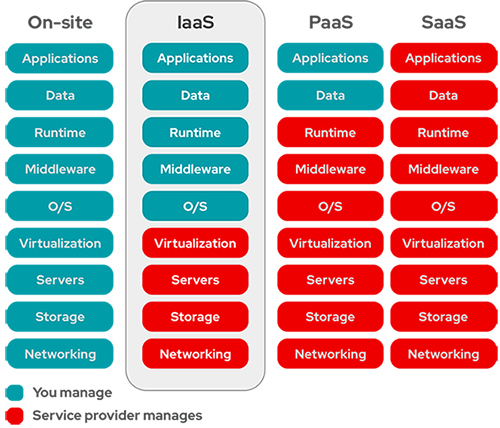

# SCOR 350-701 Notes

## Security Concepts

- Malware, exploits, and security threats
  - malware:
    - malicious software
    - any software intentionally designed to cause damage to a computer, server, client, or computer network
  - most popular types of malware
    - virus: 1) the most common type of malware; 2) attach malicious code to clean code; 3) wait to be run
    - ransomeware: infect computer and display message demanding a fee to be paid
    - spyware: 1) secretely record everything user enter, upload, download and store on computers or mobile devices; 2) keep itself hidden
  - vulnerability: a weakness in a software system
  - expolit:
    - a code taking advantage of a software a software vulnerability or security flaw
    - an attack that leverages that vulnerability
  - endpoint risks as company vulnerable: 1) malware; 2) expolit
  - Insecure APIs: a malicious user gained access to an organization's database from a <span style="color: #bb6600;">cloud-based application programming interface</span> that lacked strong authentication controls
  - compromised credentials: a phishing site appearing to be a legitimate login page captures <span style="color: #bb6600;">user login information</span>
  - data breach: a stolen customer database that contained social security numbers and was <span style="color: #bb6600;">published online</span>
  - worm: a software program that copies itself from one computer to another, without human interaction
  - spam: unwanted messages in an email inbox
  - back-door virus: any form of program that grants unauthorised access to an entire system via a software or network vulnerability (Trojan malware attacks)
  - front-door attacks: require the actions of the user to allow the virus to infect the system
  - risk of Internet browser to access cloud-based service: vulnerabilities within protocol


- Categories of attacks
  - volume-based attacks: use high traffic to inundate the network bandwidth
  - protocol attacks: focus on exploiting server resources
  - application attacks: focus on web applications and are considered the most sophisticated and serious type of attacks


- SQL injection
  - inserting malicious commands into the database
  - occurred when asking a user for input
  - mitigate: 1) check parameters to ensure actual values; 2) use prepared statements amd parameterized queries
  - an attack where code is injected into a browser
  - inject SQL code (via his browser) into forms, cookies, or HTTP headers that do not use data sanitizing or validation methods of <span style="color: #bb6600;">GET/POST parameters</span>
  - used to <span style="color: #bb6600;">steal information from databases</span>


- Cross Site Script (XSS): 
  - web application gathering malicious data
  - usually gathered in the form of a hyperlink
  - click on this link from another website, instant message, or simply simply just reading a web board or email message.
  - encode the malicious portion of the link to the site in <span style="color: #bb6600;">HEX (or other encoding methods)</span>
  - prevention: 1) sanitize user input; 2) limit use of user-provided data; 3) utilize the content security policy
  - <span style="color: #bb6600;">preventive measures</span>: 1) client-side scripts on a per-domain basis; 2) contextual output encoding/escaping
  - exploit website vulnerability by injecting scripts that will run at client's side.
  - an attack where code is injected into a database (server)
  - a client-side vulnerability that targets other application users
  - <span style="color: #bb6600;">inject malicious code</span> (usually malicious links) into a database
  - used to <span style="color: #bb6600;">redirect users</sapn> to websites where attackers can steal data from them
  - send malicious code through a web application to an unsuspecting user to request that the victims web browser executes the code


- Buffer overflow
  - the volume of data exceeds the storage capacity of the memory buffer
  - write the data to the buffer overwrites adjacent memory locations
  - commonly associated w/ <span style="color: #bb6600;">C/C++</span>


- rootkit
  - <span style="color: #bb6600;">Trojan</span> malware attack
  - a type of malware that is designed to infect a target PC and allow an attacker to install a set of tools that grant him <span style="color: #bb6600;">persistent remote access</span> to the computer
  - a program providing maliciously privileged access to a computer
  - types: 1) kernel; 2) user mode; 3) bootloader; 4) Memory rootkits


- botnet
  - a collection of internet-connected devices infected by malware
  - unauthorized access
  - malicious activities including credentials leaks, unauthorized access, data theft and DDoS attacks
  - <span style="color: #bb6600;">group of computers</span> connected to the Internet that have been compromised by a hacker using a virus or Trojan horse


- DoS and DDoS
  - categories of attacks: <span style="color: #bb6600;">protocol & volume-based</span>
  - common attacks: syn flood, udp flood, http flood, ping of death, smurf attack, fraggle attack, slowloris, application level attacks, NTP amplification,advanced persistent DoS (APDoS), zer-day DDoS attacks
  - DoS: a computer is used to flood a server with TCP and UDP packets
  - DDoS
    - multiple systems target a single system with a DoS attack
    - shutting down a network or service, causing it to be inaccessible to its intended users
    - an application attack using <span style="color: #bb6600;">botnet</span> from multiple remote locations that flood a web application causing a degraded performance or a complete outage
  - ping of death behavior: 1) sending <span style="color: #bb6600;">malformed or oversized packets</span> w/ ping command; 2) packets fragmented into <span style="color: #bb6600;">groups of 8 octets</span>
  - smurf attack
    - a DDoS attack
    - using a malware program to exploit Internet Protocol (IP) and Internet Control Message Protocol (ICMP)
    - spoof an IP address, and using ICMP, then ping IP addresses on a given network
    - large numbers of Internet Control Message Protocol (ICMP) packets with the intended victim's spoofed source IP are broadcast to a computer network using an IP broadcast address
  - sny flood:
    - too many connection requests
    - intent to <span style="color: #bb6600;">exceed the threshold limit of the connection queue </span>
  - teardrop attack
    - DoS attack
    - sending <span style="color: #bb6600;">fragmented packets</span> to a target machine
    - generally happen on older operating systems


- Social engineering
  - phishing
    - a form of social engineering
    - fraudulent attempts by cyber criminals to obtain <span style="color: #bb6600;">private information</span>
    - sending fraudulent communications usually through email
  - goals: 1) steal sensitive data or login information; 2) install malware
  - types of phishing
    - <span style="color: #bb6600;">deceptive<span>: steal people's personal data or login credentials in a legitmate company
    - <span style="color: #bb6600;">spear<span>: designed to get a single recipient to respond
  - mitigation: <span style="color: #bb6600;">browser alert & email filtering</span>
  - endpoint mitigation: 1) spam & virus filter; 2) up-to-date antimalware
  - solutions to combat social engineering and phishing at the endpoint level: <span style="color: #bb6600;">Umbrella & Duo Security</span>


- TAXII/STIX
  - TAXII (Trusted Automated Exchange of Indicator Information)
    - a transport mechanism (data exchange) of cyber threat intelligence information in STIX format
    - used to author and exchange STIX documents among participants
    - capabilities: 1) push messaging; 2) pull messaging; 3) discovery <- automated exchange
    - functions
      - <span style="color: #bb6600;">exchange</span> trusted anomaly intelligence information
      - determine how threat intelligence information <span style="color: #bb6600;">relayed</span>
  - STIX (Structured Threat Information eXpression)
    - a standardized language developed in a collaborative way to represent <span style="color: #bb6600;">structured information</span> about cyber threats
    - shared, stored, and otherwise used in a consistent manner


- OpenIOC
  - an open framework, meant for sharing threat intelligence information in a <span style="color: #bb6600;">machine-readable format</span>
  - developed by the American cybersecurity firm MANDIANT in November 2011
  - in eXtensible Markup Language (XML) format
  - easily customized for additional intelligence so that incident responders can translate their knowledge into a standard format
  - leverage this format to share threat-related latest Indicators of Compromise (IoCs) with other organizations, enabling real-time protection against the latest threats


- <span style="color: #bb6600;">Common Vulnerabilities & Exposures (CVE)</span>
  - an <span style="color: #bb6600;">identifier</span> assigned to vulnerability disclosured by vendors, security researchers, and vulnerability coordination centers
  - an industry-wide standard
  - sponsored by US-CERT, the office of Cybersecurity and Communications at the U.S. Department of Homeland Security
  - goal: <span style="color: #bb6600;">easier to share data</span> across tools, vulnerability repositories, and security services


- Zero Trust
  - a security framework requiring all users, whether in or outside the organization's network, to be <span style="color: #bb6600;">authenticated, authorized, and continuously validated for security configuration and posture</span> before being granted or keeping access to applications and data
  - assumptions
    - no traditional network edge
    - networks can be local, in the cloud, or a combination or hybrid with resources anywhere and workers in any location
  - use <span style="color: #bb6600;">microsegmentation</span> to to contain attacks


- Data exfiltration
  - ICMP exfiltration
    - encrypting the payload in an ICMP packet to carry out <span style="color: #bb6600;">command and control tasks</span> on a compromised host
  - DNS exfiltration
    - a.k.a. DNS tunneling
    - hide and encode data inside DNS requests and queries
    - encode the data of other programs or protocols in DNS queries and responses
    - often including data payloads added to an attacked DNS server and used to control a remote server and applications
    - <span style="color: #bb6600;">encode the payload with random characters</span> that are broken into short strings and the DNS server rebuilds the exfiltrated data
    - An attacker registers a domain that a client connects to based on DNS records and sends malware through that connection.
    - DNS abuse exchanges data between two computers even when there is no direct connection
    - data sent out as part of the <span style="color: #bb6600;">domain name</span>
  - characteristics of messenger protocol for data exflitration
    - <span style="color: #bb6600;">encrypted traffic</span> which prevents visibility on firewalls and IPS systems
    - <span style="color: #bb6600;">messenger apps unable to be segmented</span> w/ standard network controls


- Threat intelligence
  - the knowledge about an existing or emerging threat to assets including networks and systems
  - including context, mechanisms, indicators of compromise (IoCs), implications, and actionable advice
  - referred to as the information about the observables, IoCs intent, and capabilities of internal and external threat actors and their attacks
    - <span style="color: #bb6600;">information about threats and threat actors</span> to help mitigate harmful events


## Integrity and Privacy

- Digital Certificate & PKI
  - Trustpoint (Cisco)
    - an abstract container to hold a certificate in IOS
    - capable of storing two active certificates at any given time: 1) CA certificate; 2) ID certificate issued by CA
    - enrollment modes: 1) terminal - manual; 2) SCEP - over HTTP; 3) <span style="color: #bb6600;">profile</span> - authentication + enrollment (providing an option to specify HTTP/TFTP commands to perform file retrieval from the Server)
  - CA (certificate authority): <span style="color: #bb6600;">issue and revoke</span> digital certificates
  - certificate signing request (CSR)
    - one of the first steps towards getting your own SSL Certificate
    - generated on the same server you plan to install the certificate on
    - Certificate Authority (CA) using contained <span style="color: #bb6600;">server information</span> (e.g. common name, organization, country) to create your certificate
    - public key included in certificate
    - certificate signed with the corresponding private key
  - Cisco IOS public key infrastructure (PKI)
    - provide certificate management to support security protocols
    - including IP Security (IPSec), secure shell (SSH), and secure socket layer (SSL)
    - entities
      - peers communicating on a secure network
      - at least one certification authority (CA) that grants and maintains certificates
      - digital certificates: containing information such as the certificate validity period, peer identity information, encryptions keys that are used for secure communications, and the signature of the issuing CA
      - optional registration authority (RA) to offload the CA by processing enrollment requests
      - a distribution mechanism (such as <span style="color: #bb6600;">Lightweight Directory Access Protocol (LDAP) or HTTP</span>) for certificate revocation lists (CRLs)
  - RSA keys
    - generate Rivest, Shamir, and Adelman (RSA) keypairs: `crypto key generate rsa`
    - export and import RSA key to encrypt and decrypt the PKCS12 file or the PEM file: <span style="color: #bb6600;">passphrase</span>


- Cryptography
  - symmetric key cipher
    - same secrete key used for both encryption and decryption
    - same secrete key used by both sender and receiver
    - suited to internal encryption
    - pros: 1) faster; 2) efficient
    - Data Encryption Standard (DES)
      - encrypt and decrypt in blocks (block cipher): 64 bits block size
      - key size: 56 bits
    - <span style="color: #bb6600;">Triple DES (3DES):</span>
      - using DES 3 times
      - 2 ways: 1) 1st & 3rd w/ the same key, 2nd w/ different key; 2) 3 different keys
    - Advanced Encryption Standard (AES)
      - highest level of protection
      - successor of DES
      - encrypt and decrypt in blocks (<span style="color: #bb6600;">block cipher</span>): 128 bits block size
      - key size: 128, 192, or 256 -> AES-128, AES-192, or AES-256
      - AES-256 capability
        - secure <span style="color: #bb6600;">online connection</span> against cyberattacks that can compromise your security
        - offer robust <span style="color: #bb6600;">protocols</span> to combat malicious attacks
        - reinforce <span style="color: #bb6600;">online identity</span>
  - asymmetric key
    - public key cryptography
    - using keypairs (a private key and a public key)
    - more complex and time comsuming
    - Diffie-Hellman: an asymmetric algorithm used to establish <span style="color: #bb6600;">a shared secret</span> for a symmetric key algorithm
    - RSA
    - Elliptic Curve Cryptography (ECC): smaller key sizes, faster computation,as well as memory, energy and bandwidth savings
  - functions of secret key cryptography (=? asymmetric key)
    - different keys for encryption and decryption
    - the capability to only <span style="color: #bb6600;">know one key on one side</span>


- Security issues of privacy and integrity 
  - passwords being transmitted in clear text: <span style="color: #bb6600;">unencrypted links for traffic</span>
  - Secure Hash Algorithm (SHA-1):
    - a.k.a. HMAC-SHA-1
    - ensures data has not been changed in transit
    - one way hash functions to determine if data has been changed
    - stronger than Message Digest 5 (MD5)
    - provide data integrity (to guarantee data has not been altered in transit) and authentication (to guarantee data came from the source it was supposed to come from)
    - used with the <span style="color: #bb6600;">digital signature standard</span>
    - used by IPSec to ensure that a message has not been altered


## Virtual Private Networks

- Internet Key Exchange (IKE) framework
  - used for remote host, network access, and virtual private network (VPN) access
  - enable two parties on the Internet to communicate securely
  - a <span style="color: #bb6600;">key management protocol</span> used to set up a security association (SA) using Internet Protocol Security (IPsec)
  - IKE SA
    - describe the <span style="color: #bb6600;">security parameters</span> between two IKE devices
    - the first stage in establishing IPSec
  - IKEv1
    - Phase 1: ISAKMP
      - modes: <span style="color: #bb6600;">main - 6 msgs; agressive - 4 msgs</sign>
      - <span style="color: #bb6600;">preshared authentication key</span>
        - global configuration mode
        - syntax: `crypto isakmp key <keystring> address <peer-address> [mask]` or `crypto isakmp key <keystring> hostname <peer-hostname>`
        - same command on two end devices
        - debug msg: `ISAKMP:(1002): retransmitting phase 1 MM_KEY_EXCH...` -> sign of <span style="color: #bb6600;">key mismatch</span>
        - example pre-shared key exchange config
          - apply to any device: `crypto isakmp key cisco address 0.0.0.0`
          - apply to exact devices: `crypto isakmp key cisco address 1.2.3.4`
      - ensure that the ISAKMP key on the hub is used only for terminating traffic from the IP address of 172.19.20.24
        - define the <span style="color: #bb6600;">ISAKMP identity</span> used by the router when participating in the Internet Key Exchange (IKE) protocol: `crypto isakmp identity {address | hostname}`
        - configure a <span style="color: #bb6600;">preshared authentication key</span>: `crypto isakmp key Cisco0123456789 172.19.20.24`
    - phase 2: IPsec
  - IKEv2
    - standard including NAT-T
    - <span style="color: #bb6600;">4 msgs</span> for both phase 1 & 2
    - using <span style="color: #bb6600;">EAP for authenticating</span> remote access clients
    - name mangler
      - offer the flexibility to perform AAA-based policy lookup for the peer based on arbitrary portions of the peer IKE identities of various types
      - referenced from the IKEv2 profile specifically from the `aaa authorization` and `keyring aaa` commands that use AAA authorization for policy lookup
      - config <span style="color: #bb6600;">OU of the IKEv2 peer certificate</span> used as the identity when matching an IKEv2 authorization policy
        - define a name mangler and enter IKEv2 name mangler config: `crypto ikev2 name-mangler MANGLER`
        - derive the name from any of the fields in the remote identity of type DN (distinguished name): `dn organization-unit`
  

- IP Security (Psec)
  - Cryptographic algorithms w/ IPsec include
    - <span style="color: #bb6600;">HMAC-SHA1/SHA2</span> for integrity protection and authenticity
    - TripleDES-CBC for confidentiality
    - <span style="color: #bb6600;">AES-CBC</span> and AES-CTR for confidentiality
    - AES-GCM and ChaCha20-Poly1305 providing confidentiality and authentication together efficiently
  - AH protocol
    - provide a mechanism for <span style="color: #bb6600;">authentication only</span>
    - provide data integrity, data origin authentication, and an optional replay protection service
  - ESP protocol
    - provide data <span style="color: #bb6600;">confidentiality (encryption) and authentication (data integrity, data origin authentication, and replay protection)</span>
    - used with confidentiality only, authentication only, or both confidentiality and authentication
    - reliable authenticaton protocol and supporting <span style="color: #bb6600;">ACK and sequence</span>
  - stateful failover
    - enable a router to continue processing and forwarding IPsec packets after outage occurs
    - two <span style="color: #bb6600;">identical routers</span>: same type of device; the same CPU and memory; either no encryption accelerator or identical encryption accelerators
    - <span style="color: #bb6600;">duplicate IKE and IPsec configuration</span> on active device on standby device


- SSL, TLS & DTLS
  - DTLS
    - UDP based
    - used for delay sensitive applications (voice and video)
    - strongest throughput <span style="color: #bb6600;">performance</span>
  - successful TLS connection from <span style="color: #bb6600;">remote host</span> (reception) in mail logs

    ```text
    Info: New SMTP ICID 30 Interface Management (192.168.0.100)
      address 10.128.128.200 reverse dns host unknown verified no
    Info: ICID 30 ACCEPT SG SUSPECTLIST match sbrs[none] SBRS None
    Info: ICID 30 TLS success protocol TLSv1 cipher DHE-RSA-AES256-SHA
    Info: SMTP Auth: (ICID 30) succeeded for user: cisco using
      AUTH mechanism: LOGIN with profile: ldap_smpt
    Info: MID 80 matched all recipients for per-recipient policy
      DEFAULT in the outbound table
    ```


- Site-to-site VPN
  - access control policy used to inspect traffic coming from the users
  - decrypted traffic is subject to Access Control policy
  - enable <code style="color: #bb6600;">sysopt permit-vpn</code> option to bypass access control
    - bypass the inspection
    - VPN filter ACL and authorization ACL downloaded from AAA server are still applied to VPN traffic
  - L2TP over IPsec vs GRE over IPsec
    - L2TP: Layer 2 Tunneling Protocol
    - GRE: a simple IP packet encapsulation protocol
    - port number: L2TP UDP:1701; GRE - IP:47 
    - GRE protocol <span style="color: #bb6600;">adds its own header</span> (4 bytes plus options) between the payload (data) and the delivery header
    - L2TP packet including payload and L2TP header, sent within a User Datagram Protocol (UDP) datagram


- DMVPN
  - full meshed connectivity
  - simple hub and spoke configuration
  - forming IPsec tunnel over dynamically/statically addresses spokes
  - tunneled VPN: IKEv1 (ISAKMP) & IKEv2
  - provide <span style="color: #bb6600;">dynamic tunnel establishment</span> but not w/ sVTI
  - NOT support multiple SAs
  - AnyConnect superior capabilities:
    - customization of access policies <span style="color: #bb6600;">based on user identity</span>
    - enable VPN access for individual users from their machines


- FlexVPN
  - tunneled VPN: IKEv2
  - a standards-based solution interoperating with <span style="color: #bb6600;">non-Cisco IKEv2 implementations</span>
  - NHRP primarily used to establish spoke to spoke communication
  - spokes not register to hub
  - same as DMVPN
    - point-to-point GRE tunnels
    - spoke-to-spoke connectivity achieved with NHRP redirect message
    - IOS routers w/ the same NHRP code
    - Cisco's proprietary technologies
  - differences
    - P2P GRE tunnels: DMVPN - static; FlexVPN - <span style="color: #bb6600;">static/dynamic</span>
    - crypto: DMVPN - optional; FlexVPN - strongly tied into IPSec
    - key management protocol: DMVPN - IKEv1/IKEv2; FlexVPN – IKEv2
    - QoS: DMVPN - other protocol; FlexVPN - embedded in IKEv2
    - NHRP: DMVPN - 3 phases; FlexVPN - only one standard way
  - support <span style="color: #bb6600;">multiple SAs</span>


- GETVPN (Group Encrypted Transport VPN)
  - a <span style="color: #bb6600;">trunnel-less</span> VPN
  - private IP transport, such as <span style="color: #bb6600;">MPLS VPN or private WAN</span>
  - single SA for all routers in a group
  - scalable for any-to-any connectivity and encryption
  - eliminate point-to-point tunnels and their associated overlay routing
  - group SA: group members (GMs) sharing a common security association (SA)
  - <span style="color: #bb6600;">reduce latency and provide encryption</span> over MPLS without the use of a central hub


- Comparisons of DMVPN, FlexVPN and GETVPN
  - Infrastructure Network: Public Internet Transport; Public Internet Transport; Private IP Transport
  - Network Style: Hub-Spoke and Spoke-to-Spoke (Site-to-Site); Hub-Spoke and Spoke-to-Spoke (Client-to-Site and Site-to-Site); Any-to-Any (Site-to-Site)
  - Routing: Dynamic routing on tunnels; Dynamic routing on tunnels or IKEv2 routing or IKEv2 Dynamic routing; Dynamic routing on IP WAN
  - Failover Redundancy: Route Distribution Model
  - Encryption Style: Peer-to-Peer Protection; Peer-to-Peer Protection; Group Protection
  - IP Multicast: Multicast replication at hub; Multicast replication at hub; Multicast replication in IP WAN network


## Software Defined Network (SDN)

- SDN architecture
  - centralized architecture to control networking devices in one device
  - SDN controller
    - global view of the network
    - using common management protocols to monitor and configure the network devices
  - northbound interfact (NBI)
    - intent API
    - an abstraction of network functions with a programmable interface for <span style="color: #bb6600;">applications</span> to consume the network services and configure the network dynamically
    - SDN controller communicating w/ network service applications, the management solution
    - applications for network services, including network virtualization, dynamic virtual network provisioning, firewall monitoring, user identity management and access policy control
    - typically <span style="color: #bb6600;">RESTful APIs</span> used to communicate between the SDN controller and the services and applications running over the network
    - used for the orchestration and automation of the network components to align with the needs of different applications via SDN network programmability
    - basically the link between the applications and the SDN controller
    - applications can tell the network devices (physical or virtual) what type of resources they need
    - SDN solution can provide the necessary resources to the application
    - <span style="color: #bb6600;">provision</span> SSIDs, QoS policies, and <span style="color: #bb6600;">update</span> software versions on switches
  - southbound interface (SBI)
    - SDN controller communicating w/ network devices via API
    - usually <span style="color: #bb6600;">CLI, SNMP, OpenFlow, NETCONF and RESTCONF</span> used to communicate w/ network devices
    - enable the controller to dynamically make changes based on real-time demands and scalability needs
  - eastbound interface (EBI)
  - westbound interface (WBI)
    - integration capabilities
    - meet the need to scale and accelerate operations in modern data centers, IT operators require intelligent, end-to-end work flows built with open APIs
    - provide mechanisms for <span style="color: #bb6600;">integrating</span> Cisco DNA Assurance workflows and data with third-party IT Service Management (ITSM) solutions
    - power end-to-end IT processes across the value chain by integrating various domains such as ITSM, IPAM, and reporting
    - leverage the REST-based Integration Adapter APIs
    - bi-directional interfaces allow the exchange of contextual information between Cisco DNA Center and the external, third-party IT systems
    - provide the capability to publish the network data, events and notifications to the external systems and consume information in Cisco DNA Center from the connected systems
    - <span style="color: #bb6600;">application monitors</span> for power utilization of devices and IoT sensors
  - security application notify the controller about a specific security threats: northbound and southboun
  - <span style="color: #bb6600;">Full Context Awareness</span>: policy enforcement based on complete visibility of users and communication between virtual machines


- AsyncOS API
  - for Cisco Security Management appliances
  - a representational state transfer (REST) based set of operations
  - providing secure and authenticated access to the Security Management appliance reports, report counters, tracking, quarantine, and configuration
  - a role based system: the scope of API queries defined by the role of the user
  - Cisco Content Security Management Appliance -> Cisco Secure Email and Web Manager


- REST API
  - a.k.a. RESTful API
  - an application programming interface (API or web API) that conforms to the constraints of REST architectural style and allows for interaction with RESTful web services
  - request methods
    - `GET` − Provides a read only access to a resource.
    - `POST` − Used to create a new resource.
    - `DELETE` − Used to remove a resource.
    - `PUT` − Used to update a existing resource or create a new resource.
  - request methods for ASA REST API: 1) get; 2) put; 3) post; 4) delete; 5) patch


- Cisco device APIs
  - DNA Center API to add device: `post /dna/intent/api/v1/network-device`
  - AMP API to get computer info
    - URL: `get https://api.amp.cisco.com/v1/computers`
    - list of computers, policies, and connector statuses


- Workload Optimization Manager
  - provide specific real-time actions that ensure workloads get the resources they need when they need them
  - enable continuous <span style="color: #bb6600;">placement, resizing, and capacity decisions</span>
  - automated, driving continuous health in the environment
  - software’s decisions according to level of comfort:
    - recommend (view only)
    - manual (select and apply)
    - automated (executed in real time by software)


- Python script
  - make a SSL connection

    ```python
    user = sys.argv[2]      # "ersad"
    password = sys.argv[3]  # "password1"

    creds = str.encoder(';'.join(user, password))
    encodedAuth = bytes.decode(base64.b64encode(creds))

    conn = http.client.HTTPSConnection(
      "{}:9060".format(host), 
      context=ssl.SSLContext(ssl.PROTOCOL_TLSv1_2)
    )
    ```

    - connection w/ TLS1.2 SSL protocol
    - username and password from command line inputs
  - add a global rule into policies

    ```python
    api+path = "/api/access/global/rules"
    ...
    post_data = {
      ...
    }
    req = urllib2.Request(url, json.dumps(post_data), headers)
    ```


## Cloud Security Concepts and Solutions

- Cisco Cloud Security Portfolio
  - Umbrella: Set up the first line of defense against threats on the Internet wherever users go
  - Cloudlock: Secure your cloud users, data, and applications with the cloud-native CASB and cloud cybersecurity platform
  - Cloud Email Security: Defend against advanced email threats
  - Stealthwatch Cloud: Extend network visibility, threat detection, and analytics to your public cloud environments
  - Next-Generation Firewall: Protect critical infrastructure in the cloud with the Cisco Firepower Next-Generation Firewall


- Cloud services
  - types: private 2) public; 3) hybrid; 4) community - variation of private
  - types of as-a-Service solution: (from customer/tenant view)
    - IaaS: 1) renting infrastructure; 2) purchase virtual power to execute your software as needed.; 3) like running a virtual server; 4) managing OS up to Apps
    - PaaS: 1) managing applications and data only; 2) all phases of SDLC; 3) using APIs. wen portals, or gateway software; 4) developing applications
    - SaaS: 1) software rent; 2) usually access via front end or web portal
  - most secure service type: provate cloud
  - DecSecOps: focusing on application development
  - responsibility for customers and service providers
    - IaaS: OS up to Apps
    - PaaS: Data & Apps
    - SaaS: none

    <figure style="margin: 0.5em; display: flex; justify-content: center; align-items: center;">
      
    </figure>

  - IaaS provider
    - resources to users/machines including computers as virtual machines, raw (block) storage, firewalls, load balancers, and network devices
    - sercure responsibility: <span style="color: #bb6600;">firewalling virtual machine</span>
  - responsibility of the installation and maintenance of a product:
    - on-primese solution: customer
    - cloud-based solution: provider
  - customers no responsibility of OS patch management: PaaS
  - secure SaaS-based applications
    - all administrative access to SaaS applications as privileged
    - set up single sign-on (SSO) integrations
    - Use <span style="color: #bb6600;">multi-factor authentication (MFA)</span>
    - install and integrate an identity governance solution
    - stay up to date (patch mgmt)


- Cloud security assessment
  - cloud <span style="text-decoration: underline;">data protection</span> assessment: understand the <span style="color: #bb6600;">security posture of the data</span> or activity taking place in public cloud deployments
  - cloud security <span style="text-decoration: underline;">strategy</span> workshop: develop a <span style="color: #bb6600;">cloud security strategy and roadmap</span> aligned to business priorities
  - cloud security <span style="text-decoration: underline;">architecture</span> assessment: identify strengths and areas for improvement in the <span style="color: #bb6600;">current security architecture</span> during onboarding
  - user entity <span style="text-decoration: underline;">behavior</span> assessment: detect potential anomalies in <span style="color: #bb6600;">user behavior</span> that suggest malicious behavior in a Software-as-a-Service application


- DevSecOps (development, security, and operations)
  - a concept describing how to move security activities to the start of the development life cycle
  - built-in security practices in the continuous integration/continuous deployment (CI/CD) pipeline
  - minimize vulnerabilities and bringing security closer to IT and business objectives
  - attribute: <span style="color: #bb6600;">development security</span>
  - key things make a real DevSecOps environment:
    - security testing is done by the development team
    - issues found during that testing is managed by the development team
    - fixing those issues stays within the development team
  - <span style="color: #bb6600;">CI/CD pipeline</span>: process gives a weekly or daily update instead of monthly or quarterly in the applications


- Data Center Network Manager (DCNM)
  - manage multiple devices, while providing ready-to-use control, automation, monitoring, visualization, and troubleshooting capabilities
  - working for many switch series
  - network management system (NMS) support for traditional or multiple-tenant LAN and SAN fabrics
  - use <span style="color: #bb6600;">PowerOn Auto Provisioning (POAP)</span> to automates the process of upgrading software images and installing configuration files on Cisco Nexus switches that are being deployed in the network for the first time
  - add aLAN switch w/ Web UI
    - 1\. Inventory > Discovery > LAN switches
    - 2\. Add icon to add LAN
    - 3\. select Hops from Seed Switch or Switch List
    - 4\. enter the <span style="color: #bb6600;">Seed Switch IP </span> for the fabric
    - ...


- Cisco Container Platform (CCP)
  - provide authentication and authorization, security, high availability, networking, load balancing, and operational capabilities to effectively operate and manage <span style="color: #bb6600;">Kubernetes</span> clusters
  - provide a validated configuration of Kubernetes
  - integrate with underlying infrastructure components such as Cisco UCS, Cisco HyperFlex, and Cisco ACI


- Cisco Intercloud Fabric solution
  - control shadow IT
  - discovering resources deployed in the public cloud outside IT control
  - Intercloud Fabric deployment models
    - <span style="color: #bb6600;">Enterprise Managed</span> (an enterprise manages its own cloud environments) and 
    - <span style="color: #bb6600;">Service Provider Managed</span> (the service provider administers and controls all cloud resources).


- Cisco DNA Center (DNAC)
  - a <span style="color: #bb6600;">central Management</span> and Automation software
  - used as a management platform for both SD (Software-Defined) Access, Intent-Based Networks and existing traditional networks
  - the <span style="color: #bb6600;">command and control center</span> for Cisco DNA–based networks
  - helping IT to optimize network performance to dynamically meet business intent
  - features: 1) policy; 2) automation; 3) assurance
  - general sections aligned to IT workflows:
    - <span style="color: #bb6600;">design</span>: design your network for consistent configurations by device and by site
    - policy: translate business intent into network policies and apply those policies
    - <span style="color: #bb6600;">provision</span>: assigned new device to an SGT based on identity—greatly facilitating remote office setups
    - assurance: using AI/ML, enables every point on the network to become a sensor
  - open platform capabilities: intent-based API (Northbound API)
  - characteristics of APIs
    - quickly provision new devices
    - view the overall health of the network


- Cisco Context Directory Agent (CDA)
  - map IP Addresses to usernames
  - allow security gateways to understand which user is using which IP Address in the network
  - able to make decisions based on those users (or the groups to which the users belong to)
  - a Cisco Linux machine
  - monitor in real time a collection of <span style="color: #bb6600;">Active Directory domain controller (DC)</span> machines for authentication-related events that generally indicate user logins
  - learn, analyze, and cache mappings of IP Addresses and user identities in its database
  - make the latest mappings available to its consumer devices


- Firepower Threat Denfence Virtual (FTDv)
  - the virtualized component of the Cisco NGFW solution The FTDv 
  - providing next-generation firewall services, including stateful firewalling, routing, VPN, Next-Generation Intrusion Prevention System (NGIPS), Application Visibility and Control (AVC), <span style="color: #bb6600;">URL filtering</span>, and Advanced Malware Protection (AMP)
  - managing the FTDv w/ FMC (either FMCv or physical FMC)
  - register and communicate with the FMC on the Management interface
  - FTDv for AWS
    - run as a guest in the AWS environment
    - interface requirements:
      - management interfaces: 2; one for FMC and one for diagnostics
      - traffic interface: 2 used to connect inside hosts to the public network


- Cisco Firepower NGFW Virtual (NGFWv)
  - the virtualized version of Cisco's Firepower next generation firewall
  - available in the AWS and Azure marketplaces
  - deployed in routed and passive modes
  - passive mode design requires ERSPAN,(Encapsulated Remote Switched Port Analyzer)
    - inspect packets like an Intrusion Detection System (IDS) appliance, only availabe in AWS
    - no action can be taken on the packet
  - routed mode 
    - act as a next hop for workloads
    - inspect packets and also take action on the packet based on rule and policy definitions


- ASAv on AWS
  - same software as physical Cisco ASAs
  - able to be deployed in the public AWS cloud
  - features:
    - Support for Amazon EC2 C5 instances
    - Deployment in the Virtual Private Cloud (VPC)
    - Enhanced networking (SR-IOV) where available
    - Deployment from Amazon Marketplace
    - Maximum of 4 vCPUs per instance
    - <span style="color: #bb6600;">User deployment of L3 networks</span>
    - <span style="color: #bb6600;">Routed mode (default)</span>
  - scenario: mirror port and NetFlow used in local devices
    - no mirror port and NetFlow data in cloud environment
    - virtual private cloud (VPC) in AWS offers VPC Flow log
  - VPC Flow Logs
    - facilitate logging of all the IP traffic to, from, and across your network
    - stored as records in special Amazon CloudWatch log groups
    - provide the same kind of information as NetFlow dat
  - no URL filtering feature as FTDv


- Secure Virtual Appliance
  - functions same as physical Cisco Secure Email Gateway, Cisco Secure Web Appliance, or Cisco Secure Email and Web Manager hardware appliances, with only a few minor differences
  - requirements to migrate virtual appliance to another physical host
    - same network configuration
    - same <span style="color: #bb6600;">defined network(s)</span> to which the interfaces on the virtual appliance are mapped
    - datastore that the virtual appliance uses
    - Secure Email Virtual Gateway w/o mail in its queue
  - migrate a Cisco WSA virtual appliance from one physical host to another physical host by using VMware Motion: access to the same defined network


- Cloudlock
  - a cloud-based <span style="color: #bb6600;">Cloud Access Security Broker (CASB)</span> and cloud cybersecurity platform
  - helping organizations securely leverage <span style="color: #bb6600;">use of applications</span> in the cloud
  - delivering <span style="color: #bb6600;">visibility and control</span> for cloud application environments across users, data, and applications
  - able to access and use Cisco Umbrella features, including DNS monitoring, Umbrella App Discovery and Umbrella Cloud Malware
  - <span style="color: #bb6600;">integrate with other cloud solutions via API</span> and monitors and creates incidents based on events from the cloud solution
  - core functionality
    - <span style="color: #bb6600;">Data Loss Prevention (DLP)</span>: protect sensitive data throughout the full environment
    - User and Entity Behavior Analytics (UEBA)
    - Apps Firewall (Apps Firewall)
    - App Discovery (App Discovery)
  - discover and control apps connected to corporate environment
  - <span style="color: #bb6600;">monitor traffic, create incidents based on events, and integrate</span> with other cloud solutions via an API
    - utilize various techniques to surface potential threats from various categories which focus on Locations, IPs and Users Login Activity
    - continuously monitor cloud environments with a cloud Data Loss Prevention (DLP) engine to identify sensitive information stored in cloud environments in violation of policy
    - API-based
    - Incidents triggered by the Cloudlock policy engine when a policy detection criteria result in a match in an object (document, field, folder, post, or file)


- Cloud Web Security (CWS)
  - previously known as Cisco Scan Safe
  - enforce secure communication to and from the Internet
  - use the Cisco AnyConnect Secure Mobility Client 3.0 to provide remote workers the same level of security as onsite employees when using a laptop issued by Cisco
  - eliminate the <span style="color: #bb6600;">need to backhaul traffic</span> through headquarters for remote workers


- Talos
  - contributor of Cisco Collective Security Intelligence (CSI) ecosystem
    - shared across multiple security solutions and provides industry-leading security protections and efficacy
    - driven by intelligence infrastructure, product and service telemetry, public and private feeds and the open source community
    - <span style="color: #bb6600;">real-time threat intelligence</span> and security protection
  - <span style="color: #bb6600;">IP and Domain Data Center</span>
    - tracking the reputation of IP addresses for email and web traffic
    - the most comprehensive real-time threat detection network
    - data made up of daily security intelligence across millions of deployed web, email, firewall and IPS appliances
    - detecting and correlating threats in real time
  - Email and Web Traffic Reputation Center
    - transform some of Talos' data into <span style="color: #bb6600;">actionable threat intelligence and tools</span> to improve your security posture
  - Talos Threat Source
    - a newsletter
    - a regular intelligence update from Cisco Talos
  - support a <span style="color: #bb6600;">two-way flow of telemetry and protection</span> across market-leading security solutions
    - Next-Generation Intrusion Prevention System (NGIPS)
    - Next-Generation Firewall (NGFW)
    - Advanced Malware Protection (AMP)
    - Email Security Appliance (ESA)
    - Cloud Email Security (CES)
    - Cloud Web Security (CWS)
    - Web Security Appliance (WSA)
    - Umbrella, and ThreatGrid
    - numerous open-source and commercial threat protection systems
  - utilize the most current intelligence data for URL filtering, reputations, and vulnerability information that can be integrated with the Cisco FTD and Cisco WSA: integrations with <span style="color: #bb6600;">Talos Intelligence</span> to take advantage of the threat intelligence that it provides


- Tetration
  - an application workload security platform designed to secure compute instances across any infrastructure and any cloud
  - use behavior and attribute-driven microsegmentation policy generation and enforcement
  - enable trusted access through automated, exhaustive context from various systems to automatically adapt security policies
  - offerring holistic workload protection for <span style="color: #bb6600;">multicloud data centers</span>
  - enabling a zero-trust model using <span style="color: #bb6600;">segmentation</span>
  - identifying security incidents faster, containing lateral movement, and reducing your attack surface
  - workflow
    - investigate the behavior of the various processes and applications in the workload
    - measure behavior against known bad behavior sequences
    - feedback into the basic building blocks
  - suspicious patterns in the current release
    - shell code execution: look for the patterns used by shell code
    - <span style="color: #bb6600;">privilege escalation</span>: watche for privilege changes from a lower to a higher privilege in the process lineage tree
    - side channel attacks: watche for cache-timing attacks and page table fault bursts
    - raw socket creation: creation of a raw socket by a nonstandard process (for example, ping)
    - <span style="color: #bb6600;">user login suspicious</span>: watche user login failures and user login methods
    - <span style="color: #bb6600;">interesting file access</span>: armed to look at sensitive files
    - <span style="color: #bb6600;">file access from a different user</span>: <span style="text-decoration: underline">learn the normal behavior</span> of which file is accessed by which user
    - unseen command: learn the behavior and set of commands as well as the lineage of each command over time
  - use cases
    - application behavior insight
    - automated microsegmentation policy generation
    - automated policy enforcement
    - policy compliance
    - <span style="color: #bb6600;">process behavior baseline and deviation</span>
    - software inventory and vulnerability detection
    - forensic analysis
  - microsegmentation
    - used by Zero-Trust model
    - a security technique by dividing perimeters into small zones to maintain separate access to every part of the network
    - secure applications by expressly allowing particular application traffic
    - by default, denying all other traffic
    - the foundation of <span style="color: #bb6600;">zero-trust security model</span> for application workloads in the data center and cloud
    - monitor continuously for compliance deviations to ensure the segmentation policy up to date as the application behavior change 
    - environments apply a zero-trust model and specify how applications on different servers or containers can communicate
  - generating accurate microsegmentation policy
    - application dependency mapping to discover the relationships between different application tiers and infrastructure services
    - supports “what-if” policy analysis using real-time data or historical data to assist in the validation and risk assessment of policy application pre-enforcement to ensure ongoing application availability
    - normalized microsegmentation policy:
      - enforced through the application workload itself for a consistent approach to workload microsegmentation across any environment
      - including virtualized, bare-metal, and container workloads
  - Contiv
    - an open source project to deploy microsegmentation policy-based services in container environments
    - offer a higher level of networking abstraction for microservices by providing a policy framework
    - built-in service discovery and service routing functions to scale out services
    - deploy <span style="color: #bb6600;">microsegmentation and multi-tenancy services</span> with a policy-based container


- Secure Endpoint
  - formerly Advanced Malware Protection (AMP) for Endpoints
  - logical security controls on endpoints still exist even training on staffs: human error or inside threats still exist
  - a cloud-managed endpoint security solution providing advanced protection against viruses, malware, and other cyber-threats by detecting, preventing, and responding to threats
  - proactive endpoint protection and centralized admin management
  - <span style="color: #bb6600;">detection, blocking, tracking, analysis, and remediation</span> to protect against <span style="color: #bb6600;">targeted persistent malware attacks</span>
  - benefit: protect endpoint systems through <span style="color: #bb6600;">application control and real-time streaming</span>
  - detecting targeted, persistent malware attacks
    - an integrated set of controls and a continuous process
    - to detect, confirm, track, analyze, and remediate these threats
  - the <span style="color: #bb6600;">root cause</span> of a threat based on the indicators of compromise seen
  - <span style="color: #bb6600;">outbreak control</span> through custom detections
  - using global threat intelligence to defense and protect against known and emerging threats w/ feeds from 
    - Talos Security Intelligence and Research Group
    - Threat Grid's threat intelligence
  - file disposition:
    - a categorization from the AMP cloud that determines what actions are taken on the file download
    - actions for file disposition
      - <span style="color: #bb6600;">clean</span> - the file known to be good
      - <span style="color: #bb6600;">malicious</span> - The file known to be harmful
      - <span style="color: #bb6600;">unknown</span> - insufficient data to classify the file as clean or malicious
  - differences btw public and private cloud
    - advanced custom detection: private - Windows only; public - popular OSes
    - ETHOS: only available in the public cloud; generic signature engine
  - private cloud deployment modes
    - cloud proxy mode 
      - virtual and physical appliance
      - Internet connection required to complete disposition lookups
      - traffic from endpoint connectors w/ private cloud while disposition lookup performed btw AMP private cloud and AMP public cloud
      - SHA-256 hash of the file inspected from AMP public cloud
      - content and software updates automatically from AMP public cloud via AMP private cloud
    - air-gap mode
      - only on the physical mode
      - no Internet connection required to complete disposition lookups
      - traffic only btw the connectors and the appliance
      - disposition queries handled by the private cloud
  - system inspects files using the following tools, in order:
    - Spero Analysis and AMP Cloud Lookup
    - Local Malware Analysis
    - Dynamic Analysis
  - Spero analysis
    - examining <span style="color: #bb6600;">structural</span> characteristics such as metadata and header information in executable files
    - generating a <span style="color: #bb6600;">Spero signature</span> based on this information
    - eligible executable file: submits file to the Spero heuristic engine in the AMP cloud
    - determining whether the file is malware according to Spero signature
    - only upload the signature of the (executable) files to the AMP cloud
    - the Cisco machine-based learning system
    - SPERO fingerprint: features of a file
    - send SPERO fingerprint to the cloud
    - SPERO trees determine whether a file is malicious
  - Dynamic Analysis
    - submit <span style="color: #bb6600;">(the whole) files</span> to Cisco Threat Grid (formerly AMP Threat Grid)
    - run the file in a <span style="color: #bb6600;">sandbox</span> environment
    - analyze the file's behavior to determine whether the file is malicious
    - return a threat score that indicates the likelihood that a file contains malware
  - Local malware analysis
    - a managed device locally inspecting executables, PDFs, office documents, and other types of files for the most common types of malware
    - use a detection rule set provided by the Cisco <span style="color: #bb6600;">Talos</span> Security Intelligence and Research Group (Talos)
    - not query the AMP cloud and not run the file
    - local malware analysis saves time and system resources
  - outbreak control
    - custom detections: 1) _Simple_ to convict files not yet classified; 2) _Advanced_ to create signatures
    - application control: 1) *Blocked Lists*; 2) *Allowed Lists*
    - network control: *IP blocked and Allowed Lists*
    - endpoint IOC: 1) *Initiate Scan* - schedule and scan (admin only); 2) *Installed Endpoint IOCs* (admin only); 3) *Scan Summary*
    - automated actions: *Automated Actions* sets actions automatically triggered
    - main lists: <span style="color: #bb6600;">Simple Custom Detections</span>, <span style="color: #bb6600;">Blocked Applications</span>, <span style="color: #bb6600;">Allowed Applications</span>, Advanced Custom Detections, and IP Blocked and Allowed Lists
  - Secure Malware Analytics (formerly Threat Grid)
    - combine advanced sandboxing with threat intelligence into one unified solution to protect organizations from <span style="color: #bb6600;">malware</span>
    - unified malware analysis and threat intelligence platform
    - <span style="color: #bb6600;">automated static and dynamic analysis</span>, producing human readable behavior indicators for each file submitted
    - feature leveraged by advanced antimalware capabilities to be an effective endpoint protection platform: <span style="color: #bb6600;">sandboxing</span>
  - ETHOS engine
    - the Cisco file grouping engine
    - group families of files together to observe variants of a malware
    - mark the ETHOS hash as malicious
    - instantly detect whole <span style="color: #bb6600;">families of malware</span>
    - perform fuzzy fingerprinting using static/passive heuristics
  - offline detection engines
    - TETRA: Windows
    - ClamAV: Mac and Linux
  - connector engine (in sequence)
    - Tetra - full blown AV
    - Cloud Lookup - based on SHA256
    - Spero - machine learning
    - Ethos - malware family
    - ClamAV - custom detections
  - <span style="color: #bb6600;">prevalence</span>: a list of all files that have been executed
  - create a policy to block endpoint executing an infected file: <span style="color: #bb6600;">upload the hash</span> for the file to the policy
  - custom detection policy 
    - not 64 characters and none zero hash: upload a hash created <span style="color: #bb6600;">using MD5 instead of SHA-256</span>
    - config in <span style="color: #bb6600;">advanced detection policies</span> required to detect for MD5 signature
  - patching strategy for endpoint: known vulnerabilities are targeted and having a regular patch cycle reduces risks


- Umbrella
  - secure <span style="color: #bb6600;">Internet gateway</span> in the cloud that provides a security solution that protects endpoints on and off the network against threats on the Internet by using <span style="color: #bb6600;">DNS</span>
  - protect users from accessing malicious domains by proactively analyzing and blocking unsafe destinations
  - protect from <span style="color: #bb6600;">phishing attacks</span> by blocking suspicious domains when users click on the given links that an attacker sent
  - mechanism to increase <span style="color: #bb6600;">reliability of the service</span>: Anycast IP (208.67.222.222 & 208.67.220.220) routing
  - improving **defense in depth** by blocking malicious destinations prior to a connection being established
  - use intelligence to determine if the request is safe, malicious or risky
  - risky: domain contains both malicious and legitimate content
  - safe and malicious requests routed as usual or blocked, respectively
  - risky requests routed to our cloud-based proxy for deeper inspection
  - Umbrella proxy using Cisco <span style="color: #bb6600;">Talos web reputation</span> and other third-party feeds to determine if a URL is malicious
  - leverage DNS-layer security
  - action to ensure policy take precedence over the second one: make the <span style="color: #bb6600;">correct policy first</span> in the policy order
  - File Inspection
    - either the DNS or Web policy
    - scan files through Cisco Advanced Malware Protection (AMP) and Umbrella's antivirus
    - DNS Policies > File Analysis = On; Advanced Settings: <span style="color: #bb6600;">Enable Intelligent Proxy</span> = On > File Analysis
  - <span style="color: #bb6600;">intelligent proxy</span>
    - intercept and proxy requests for URLs, potentially malicious files, and domain names associated with certain uncategorized or "grey" domains
    - some websites have content that most users want to access while also posing a risk because of the possibility of hosting malware
    - prevent malicious content downloads from suspicious domains while allowing normal web traffic
    - config procedure
      - enable '<span style="color: #bb6600;">Enable Intelligence Proxy</span>' in Advanced Settings
      - <span style="color: #bb6600;">Security Settings</span> > Potential Harmful Domain = On -> block traffic
  - SSL Decryption
    - an important part of the Umbrella Intelligent Proxy
    - proxy and inspect traffic that's sent over HTTPS
    - does require the root certificate be installed
  - SafeSearch: an automated filter of pornography and other offensive content 
  - logging
    -set <span style="color: #bb6600;">per-policy</span> when you first create a policy
    - by default, logging = on and log all requests an identity makes to reach destinations
    - able to change what level of identity activity Umbrella logs
    - log settings in Policy wizard: 1) Log All Requests; 2) Log Only Security Events; 3) Don't Log Any Requests
  - Umbrella Multi-Org console
    - upload, store, and archive traffic activity logs from locsl Umbrella dashboards to the cloud through <span style="color: #bb6600;">Amazon S3</span>
    - CSV formatted Umbrella logs are compressed (gzip) and uploaded every ten minutes
    - able to download from an S3 bucket
    - logs uploaded to an S3 bucket, then download logs automatically to keep in perpetuity in backup storage
  - validate traffic routed to Umbrella: browse `http://welcome.umbrella.com/` or `http://welcome.opendns.com/`
  - Policy
    - the heart of Umbrella
    - define how security and access controls are applied to identities
  - Policy wizard: access control and security-related components when defining policies for your identities
    - Security Settings:
      - select which security threat categories Umbrella blocks, e.g., malware
      - <span style="color: #bb6600;">Security Categories</span>: Malware, Newly Seen Domain, Command Control Callbacks, Phishing Attacks, Dynamic DNS, Potentially Harmful Domains, DNS Tunneling VPN, Cryptomining
    - Content Categories:
      - block access to categories of <span style="color: #bb6600;">websites—groupings</span> of sites with similarly themed content
      - Content Category Settings: High, Moderate, Low, Custom
    - Application Settings: block access to specific applications, e.g., Netflix, Facebook, or Amazon
    - Destination Lists: create <span style="color: #bb6600;">a unique list of destinations</span> (e.g., domain name or URL) to which you can block or allow access
    - Block Pages: configure the web page users see when an attempt is made to reach a blocked destination
    - File Inspection: scan and inspect files for malicious content hosted on risky domains before those files are downloaded
  - blocking URLs: URL Reputation from 6 to 10
  - modify a policy used by many devices to block specific addresses: create a <span style="color: #bb6600;">destination list for addresses</span> to be allowed or blocked
  - Block Page and Block Page Bypass features
    - present an SSL certificate to browsers that make connections to HTTPS sites
    - SSL certificate matches the requested site but will be signed by the Cisco Umbrella certificate authority (CA)
    - CA not trusted by browser -> an error page may be displayed
    - avoid these error pages, install the <span style="color: #bb6600;">Cisco Umbrella root certificate</span> into browser
  - Umbrella Roaming
    - a cloud-delivered security service for Cisco's next-generation firewall
    - protect employees even when they are off the VPN
    - ensure that assets are secure from malicious links on and off the corporate network
  - protect users of endpoint solution from a phishing: <span style="color: #bb6600;">AnyConnect w/ Umbrella Roaming module</span>
  - wildcards and destination list: asterisk (`*`) not supported for wildcard
  - <span style="color: #bb6600;">Umbrella virtual appliances (VAs)</span>
    - lightweight virtual machines
    - act as <span style="color: #bb6600;">conditional DNS forwarders</span>
      - record the internal IP address information of DNS requests for usage in reports, security enforcement, and category filtering policies while VA used
      - intelligently forwarding public DNS queries to Cisco Umbrella’s global network
      - local DNS queries to your existing local DNS servers and forwarders


- AppDynamics
  - Application Performance Management (APM) solution
  - help your organization make critical, strategic decisions
  - use artificial intelligence (AI) to 
    - solve application problems 
    - prevent them from occurring in the future
    - enhance the visibility into your IT architecture
  - <span style="color: #bb6600;">Procedure to enable AppDynamics</span> monitoring AWS EC2 instance
    - 1\. configure a Machine Agent or SIM Agent
    - 2\. install monitoring extension for AWS EC2
    - 3\. update `config.yaml`
    - 4\. restart the Machine Agent


- Cisco Defense Orchestrator
  - a cloud-based management solution that allows you to 
  - manage security policies and device configurations with ease across multiple Cisco and cloud-native security platforms
  - features
    - Templates for consistent policy design
    - Optimize your existing platforms
    - CLI in Bulk
    - Audit of changes with change-log
    - ASA to FTD Transition
    - <span style="color: #bb6600;">Management of hybrid environments</span>: Managing a mix of firewalls running the ASA, FTD, and Meraki MX software
    - Management of AWS security groups
    - RAVPN Monitoring and Management 


## Firwalls and IPS

- Cisco security solutions
  - <span style="color: #bb6600; font-weight: bold;">StealWatch</span>: performs security analytics by collecting network flows via NetFlow
  - <span style="color: #bb6600; font-weight: bold;">ESA</span>:
    - email security solution which protects against email threats
    - including ransomware, business email compromise, phishing, whaling, and many other email-driven attacks
  - <span style="color: #bb6600; font-weight: bold;">AMP for Endpoints (AMP4E)</span>: provides malware protection on endpoints
  - <span style="color: #bb6600; font-weight: bold;">Umbrella</span>: provides DNS protection by blocking malicious destinations using DNS
  - <span style="color: #bb6600; font-weight: bold;">Firepower Threat Defense (FTD)</span>
    - provide a comprehensive suite of security features
    - including firewall capabilities, monitoring, alerts, Intrusion Detection System (IDS) and Intrusion Prevention System (IPS)
  - <span style="color: #bb6600; font-weight: bold;">Cisco Cloudlock</span>
    - secure cloud users, data, and applications with the cloud-native CASB and cloud cybersecurity platform Cisco Cloudlock 
    - provide visibility and compliance checks, 
    - protect data against misuse and exfiltration
    - provides threat protections against malware like ransomware


- StealthWatch
  - rapidly collects and analyzes <span style="color: #bb6600">NetFlow and telemetry data</span> to deliver in-depth visibility and understanding of network traffic
  - <span style="color: #bb6600">visibility and security analytics solution</span>
  - collects and analyze network data from the existing network infrastructure
  - analyze industry standard NetFlow data from Cisco and other vendors Routers, Switches, Firewalls, and other network devices 
  - detect advanced and persistent security threats such as internally spreading malware, data leakage, botnet command and control traffic and network reconnaissance
  - deployment models
    - On-premises: a hardware appliance or a virtual machine called Stealthwatch Enterprise
    - Cloud-delivered: a software-as-a-service (SaaS) solution called <span style="color: #bb6600;">Stealthwatch Cloud</span>
  - Stealthwatch + ISE
    - network security analysts with a view integrating NetFlow data and contextual information
    - enabling the security analyst to detect and discern the potential severity of threats in a timely, efficient, and cost-effective manner
  - components
    - <span style="color: #bb6600">Stealthwatch Management Console</span>
      - define, configure, and monitor multiple distributed Stealthwatch Flow Collectors from a single location
      - graphical representations of network traffic, identity information, customized summary reports, and integrated security and network intelligence for comprehensive analysis
    - <span style="color: #bb6600">Flow Collector</span>
      - leverages enterprise telemetry such as NetFlow, IPFIX (Internet Protocol Flow Information Export), and other types of flow data from existing infrastructure
      - receive and collect telemetry from proxy data sources
      - analyzed by the cloud-based, multilayered machine learning engine, Cognitive Intelligence, for deep visibility into both web and network traffic
    - <span style="color: #bb6600">Flow Sensor</span> (optional)
      - produce telemetry for segments of the switching and routing infrastructure that can't generate NetFlow natively
      - provide visibility into the application layer data
      - provide additional security context to enhance the Stealthwatch security analytics
      - able to analyze encrypted traffic
    - <span style="color: #bb6600">UDP Director</span>
      - simplify the collection and distribution of network and security data across the enterprise
      - reduce the processing power on network routers and switches by receiving essential network and security information from multiple locations and then 
      - forwarding it to a single data stream to one or more destinations
  - <span style="color: #bb6600">Cisco Stealthwatch Cloud</span>
    - available as an SaaS product offer to provide <span style="color: #bb6600">visibility and threat detection</span> within public cloud infrastructures
    - available in Amazon Web Services (AWS), Microsoft Azure, and Google Cloud Platform (GCP)
    - monitor on-premises networks: at least one Cisco <span style="color: #bb6600">Stealthwatch cloud sensor appliance</span> deployed
    - on-premises behavior data sent to the Cisco Stealthwatch Cloud analytics platform for analysis: deploy the Cisco <span style="color: #bb6600">Stealthwatch Cloud PNM sensor</span>
    - provide visibility and threat detection across the AWS network relying on <span style="color: #bb6600">AWS VPC flow logs</span>
    - actions to collect full metadata information about the traffic going through their AWS cloud services
      - send VPC Flow Logs to Cisco Stealthwatch Cloud
      - configure Cisco Stealthwatch Cloud to ingest AWS information
  - Private Network Monitoring (PNM)
    - provide visibility and threat detection for the on-premises network
    - deliver from the cloud as a SaaS solution
    - prefer SaaS products and desire better awareness and security in their on-premises environments w/ less capital expenditure and operational overhead
    - deploy lightweight software in a virtual machine or server that can consume a variety of native sources of telemetry or extract metadata from network packet flow
    - encrypt this metadata and sends it to the Stealthwatch Cloud analytics platform for analysis
    - consume <span style="color: #bb6600">metadata only</span>, packet payloads never retained or transferred outside the network
  - Flow Record
    - define the information that NetFlow gathers
    - including packets in the flow and the types of counters gathered per flow
    - custom flor record: specify a <span style="color: #bb6600">series of match</span> and collect commands that tell the device what fields to include in the outgoing NetFlow PDU
    - example: config router to send NetFlow data to StealthWatch
      - flow record: `flow record Steathwatch406397954`
      - conditions to match: `match ipv4 ttl`
  - Flow Exporter
    - define the physical or virtual Flow Collector IP Address to which NetFlow data is sent
    - define the source interface from which the Flow Exporter device will send NetFlow data, a physical or logical address
    - consider using a Loopback interface to source NetFlow data from
    - define transport protocol (TCP or UDP) and destination port
  - Flow Monitor
    - tie all of the construct together
    - reference the Flow Exporter and the Flow Record.


- Cognitive Intelligence
  - formerly Cognitive Threat Analytics or CTA
  - quickly detect and respond to sophisticated, clandestine attacks under way or attempting to establish a presence within your environment
  - automatically identify and investigate suspicious or malicious web-based traffic
  - identify both potential and confirmed threats
  - quickly remediate the infection
  - reduce the scope and damage of an attack
  - features to protect against
    - <span style="color: #bb6600">Data exfiltration</span>
    - <span style="color: #bb6600">Command-and-control (C2) communications</span>
    - Domain-generation algorithm (DGA)
    - Exploit kit: (1) visits to an infected webpage, (2) redirects of web requests to a domain-hosting exploit kit, (3) unknowing downloads by users, (4) successful exploitations, and (5) downloads of malicious payloads.
    - Tunneling through HTTP and HTTPS requests


- Firepower system
  - use <span style="color: #bb6600">network discovery and identity policies</span> to collect host, application, and user data for traffic on your network
  - perform forensic analysis, behavioral profiling, access control
  - <span style="color: #bb6600;">mitigate and respond</span> to the vulnerabilities and exploits
  - <span style="color: #bb6600;">superior threat prevention and mitigation</span> to known and unknown threats
  - provide <span style="color: #bb6600;">intrustion prevention capabilities natively</span>
  - devices
    - Classic devices run next-generation IPS (NGIPS) software: 1) Firepower 7000 & 8000; 2) NGIPSv; 3) ASA w/ Firepower services
    - Firepower Threat Defense Devices
  - features
    - appliance and System Management Features
    - features for Detecting, Preventing, and Processing Potential Threats
    - integration with External Tools


- Cisco ASA FirePOWER module
  - known as the ASA SFR, providing next-generation Firewall services, including
    - Next Generation Intrusion Prevention System (NGIPS)
    - Application Visibility and Control (AVC)
    - URL filtering
    - Advanced Malware Protection (AMP)
  - redirect traffic to the SFR module
    - 1\. select the traffic to redirect w/ ACL
    - 2\. create class-map to match the traffic
    - 3\. specify the deployment mode: passive (monitor-only) or inline (normal)
    - 4\. specify a location to apply the policy: `service-policy global_policy global` for global config


- Cisco Secure Firewall Management Center
  - formerly Firepower Management Center (FMC)
  - provide <span style="color: #bb6600;">centralized</span>, integrated, and streamlined management
  - an integrated suite of network security and traffic management products
  - deployed either on purpose-built platforms or as a software solution
  - <span style="color: #bb6600;">centralized event and policy manager</span> for:
    - Secure Firewall with the Firewall Threat Defense (FTD) OS
    - ASA with FirePOWER Services (not traditional ASA)
    - Secure IPS (Firepower Next-Gen IPS / NGIPS)
    - FirePOWER Threat Defense for ISR
    - Malware Defense (AMP)
  - typical deployment
    - multiple traffic-sensing managed devices installed
    - monitor traffic for analysis and report to a manager:
      - Firepower Management Center
      - Firepower Device Manager
      - Adaptive Security Device Manager (ASDM)
  - network discovery & identity policies:
    - logging discovery and identity data allows you to take advantage of many features in the Firepower System
    - collect host, application, and user data for traffic on your network
  - network discovery policy
    - control how the system collects data on your organization's network assets and which network segments and ports are monitored
    - multidomain deployment: each leaf domain has an independent network discovery policy
    - perform host and application detection
  - identity policy
    - realm: connection between the FMC and the user accounts on the servers you monitor
    - A realm consists of one or more LDAP or Microsoft Active Directory servers that share the same directory credentials.
  - impact flag: evaluating the impact of an intrusion on your network by <span style="text-decoration: underline;">correlating</span> intrusion data, network discovery data, and vulnerability information
  - health policy
    - using the health monitor to create a health policy (collection of tests)
    - configured health test criteria for several health modules (tests)
    - control which health modules against each of your appliances
    - configure the specific limits used in the tests run by each module
  - platform settings policy / platform service policy
    - a shared set of features or parameters that define the aspects of a managed device
    - likely to be similar to other managed devices in your deployment, such as time settings and external authentication
    - configure multiple managed devices at once
    - web GUI to download capture traffic file: <span style="color: #bb6600;">enable the HTTPS server</span> for the service platform policy
  - [add a device to the FMC](https://bit.ly/3GrpP4t)
    - web user interface: 1) Devices > Device Management; 2) 'Add' menu > Device; 3) Host = IP address or the hostname of the device added; 4) Display Name = name for the device; 5) <span style="color: #bb6600;">Registration Key</span> = the same registration key used when you configured the device to be managed by the FMC; 6) multidomain deployment, assign the device to a leaf Domain; 7) ... 
    - CLI:
      - register the device to a FireSIGHT Management Center using the `configure manager add` command
      - syntax: `configure manager add {hostname | IPv4_address | IPv6_address | DONTRESOLVE} reg_key [nat_id]`
  - application layer preprocessors
    - providing application layer protocol decoders that normalize specific types of packet data into formats that the intrusion rules engine can analyze
    -preprocessors: DEC/RPC, DNS, FTP/Telnet, HTTP, Sun RPC, <span style="color: #bb6600;">SIP</span>, GTP, IMAP, POP, SMTP, SSH, <span style="color: #bb6600;">SSL</span>
  - portscan
    - a form of network reconnaissance
    - used by attackers as a prelude to an attack
    - send specially crafted packets to a targeted host
    - with host responds, the attacker determines which ports are open on the host
    - types
      - Portscan Detection: one-to-one portscan; 1/N hosts -> 1 target + N ports
      - Port Sweep: one-to-many portsweep; 1/N hosts -> N target + 1 port
      - Decoy Portscan: one-to-one portscan; mixes spoofed and real source IP addresses
      - Distributed Portscan: many-to-one portscan; N host -> 1 target + N ports
  - access control rules
    - traffic evaluation sequence: 1) monitor; 2) trust; 3) block; 4) allow; 5) default action
    - pass w/o further inspection: <span style="color: #bb6600;">trust & allow</span>
  - URL filtering
    - control access to web site based on
      - category: a general classification for the URL, e.g., Auction category, Job Search category
      - reputation:
        - how likely the URL is to be used for purposes that might against orgamnizatio's security policy
        - level: 1 - High Risk; 2 - Suscpecious sites; 3 - Benign Sites with security risk ; 4 - Benign Sites; 5 - Well Known
        - block all levels lower than the selected level, e.g., select level 3 and then block scores 1~3
    - under access control rule of <span style="color: #bb6600;">access control policy</span>
    - a feature to control the websites that users on your network can access:
      - Category and reputation-based URL filtering (recommended)
      - Manual URL filtering
    - create a rule to Block traffic based on a reputation level
  - Application Control & URL filtering: application-layer control and ability to enforce usage and tailor detection policies based on custom applications and URLs
  - Custom Block lists or feeds (or objects or groups)
    - block specific <span style="color: #bb6600;">IP addresses, URLs, or domain names</span> using a manually-created list or feed
    - example: if aware of malicious sites or addresses not yet blocked by a feed, add these sites to a custom Security Intelligence list and add this custom list to the Block list in the Security Intelligence tab of your access control policy.
  - <span style="color: #bb6600;">Network Discovery Policies</span>
    - controls how the system collects data on your organization's network assets and which network segments and ports are monitored
    - able to feed host data from 3rd-party systems
    - discovery rules
      - specify which networks and ports the Firepower System monitors to generate discovery data based on network data in traffic, and the zones to which the policy is deployed
      - able to configure whether hosts, <span style="color: #bb6600;">applications</span>, and non-authoritative users are discovered


- Firewall Threat Defense (FTD)
  - config new FTD device not behind a NAT device to be managed w/ FCM: `configure manager add <FMC IP address> <registration key>`
  - execution order of primary and backup policy: backup policy w/ larger number in priority; e.g., backup policy w/ priority 5 and primary polity w/ priority 1
  - Modbus, DNP3 and CIP SCADA preprocessors
    - analyze protocol fields and detect anomalies in the traffic from <span style="color: #bb6600;">industrial systems</span>
    - used to detect traffic anomalies
    - CIP as it is widely used in industrial applications
    - detect traffic anomalies and provide data to intrusion rules
    - DNP3 preprocessor: detect anomalies in DNP3 traffic and decodes the DNP3 protocol for processing by the rules engine
    - <span style="color: #bb6600;">Common Industrial Protocol (CIP)</span>: a widely used application protocol that supports industrial automation applications
  - FTD over ASA: <span style="color: #bb6600;">include URL filtering in the access control policy capabilities</span>
  - default management port conflicts w/ other communications: <span style="color: #bb6600;">manually change</span> the management port on FMC and all managed  devices


- Firepower Next-Generation IPS (NGIPS) threat appliance
  - providing network visibility, security intelligence, automation and advanced threat protection
  - operating in-line via Fail-To-Wire/Bypass network modules
  - <span style="color: #bb6600;">threat prevention and mitigation for known and unknown threats</span>
  - security intelligence
    - TALOS Security Intelligence and Research Group:
    - vulnerability-focused IPS rules
    - embedded IP-, URL-, and DNS-based security intelligence
  - security automation
    - correlate intrusion events with your network's vulnerabilities
    - analyze network's weaknesses
    - recommends the appropriate security policies
  - features:
    - IPS rules: identify and block attack traffic
    - integrated defence: against advanced malware by advanced analysis of network and endpoint activity
    - sandboxing: using behavioral indicators to identify zero-day amd evasive attacks
  - suppression
    - suppressing intrusion event notification
    - useful for eliminating false positives
    - types: 1) a specific IP address or range of IP addresses; 2) a specific rule or preprocessor
  - traffic profile
    - a graph of network traffic based on connection data collected over a profiling time window (PTW)
    - presumably representing normal network traffic
    - detecting abnormal network traffic by evaluating new traffic against the profile 


- Firepower Threat Defence Devices
  - a next-generation firewall (NGFW) w/ NGIPS capabilities
  - features including site-to-site and remote access VPN, robust routing, NAT, clustering, and other optimizations in application inspection and access control


- Cisco Threat Intelligence Director (CTID)
  - part of FMC
  - ingest 3rd-party cyber threat intelligence (CTI)
  - the ability to consume</span> threat intelligence via STIX over TAXII
  - process to use STIX to upload and download blacklists: <span style="color: #bb6600;">consumption</span>
  - mechanism
    - observables published to the elements
    - the elements monitor traffic and report observations to the FMC when the system identifies observables in traffic
    - evaluate the observations against TID indicators
    - generates or updates incidents associated with the observable's parent indicator(s)
  - features
    - operationalize threat intelligence data
    - aggregate intelligence data
    - configure defensive actions
    - analyze threats
  - <span style="color: #bb6600;">supplement other Firepower functionality</span>, offering an additional line of defense against threats
  - integrated with existing Threat Intelligence Platforms (ThreatQ, AlienVault, Infoblox etc)
  - deployed by your organization to ingest threat intelligence automatically

  <figure style="margin: 0.5em; display: flex; justify-content: center; align-items: center;">
    
  </figure>


- Cisco Application Visibility and Control (AVC)
  - monitors application performance and troubleshoots issues that arise
  - leverages multiple technologies to recognize, analyze, and control applications
  - including voice and video, email, file sharing, gaming, peer-to-peer (P2P), and cloud-based applications
  - <span style="color: #bb6600;">combine several Cisco IOS/IOS XE components</span>
  - communicating with external tools
  - supports <span style="color: #bb6600;">NetFlow</span> to export application usage and performance statistics
  - integrated into Prime Infrastructure and StealthWatch
  - functions
    - application recognition
    - metrics collection and exporting
    - management and response systems
    - control


- ASA FirePOWER module
  - next-generation firewall services, including Next-Generation IPS (NGIPS), Application Visibility and Control (AVC), URL filtering, and Advanced Malware Protection (AMP)
  - single or multiple context mode, and in routed or transparent mode
  - deployment models:
    - inline mode: actual traffic is sent to the ASA FirePOWER module; configure **inline interface pairs**
    - monitor-only (inline tap or passive): a copy of the traffic is sent to the ASA FirePOWER module


- ASA in Cisco Unified Communications
  - Cisco UC proxy: terminate and reoriginate connections between a client and server
  - deliver a range of security functions such as traffic inspection, protocol conformance, and policy control to ensure security for the internal network
  - solutions:
    - TLS proxy:
      - decryption and inspection of Cisco Unified Communications encrypted signaling
      - store certificate trustpoints for the server and the client
    - Mobility Proxy: secure connectivity btw Cisco Unified Mobility Advantage server and Cisco Unified Mobile Communicator clients
    - Presence Federation Proxy: secure connectivity btw Cisco Unified Presence servers and Cisco/Microsoft Presence servers


- Secure Manager
  - enable consistent policy enforcement and rapid troubleshooting of security events
  - offer summarized reports across the security deployment
  - scale efficiently and manage a wide range of Cisco security devices with improved visibility
  - provide a comprehensive management solution for
    - Cisco <span style="color: #bb6600;">ASA</span> 5500 Series Adaptive Security Appliances
    - Cisco intrusion prevention systems 4200 and 4500 Series Sensors
    - Cisco AnyConnect Secure Mobility Client


- ASA
  - deny all traffic by default
  - modes: transparent and routed
  - bridge group in transprent mode
    - group interfaces together in a bridge group to maximize the use of security contexts
    - configure multiple bridge groups, one for each network
    - each bridge group requires a management IP address
    - up to 4 interfaces are permitted per bridge–group (inside, outside, DMZ1, DMZ2)
    - access control btw interfaces <span style="color: #bb6600;">controlled</span>
    - all of the usual firewall checks are in place
    - each bridge group w/ a Bridge Virtual Interface (BVI)
    - BVI IP address
      - as the source address for packets originating from the bridge group
      - on the same subnet as the bridge group member interfaces
    - BVI not supporting traffic on secondary networks
    - only traffic on the same network as the BVI IP address supported
    - BVI interface <span style="color: #bb6600;">not used for management purpose</span>
    - able to add a separate Management slot/port but not part of bridge group
  - connection status of failover w/ 2 ASAs
    - stateful: preserve
    - stateless: reestablish
  - AnyConnect Connection profile to utilize an external token authentication mechanism in conjunction with AAA authentication using machine certificates: set <span style="color: #bb6600;">Method = Both</span>


- NetFlow
  - a unidirectional stream of packets between a given source and destination
  - provide statistics on packets flowing through the router
  - the standard for acquiring IP operational data from IP networks
  - monitor from Layer 2 to 4
  - track <span style="color: #bb6600;">multicast, MPLS, or bridged traffic</span>
  - required parameter to config a NetFlow exporter on a router: <span style="color: #bb6600;">exporter name</span>, `flow expoter <name>`
  - a flow identified as the combination of the following key fields:
    - Source IP address
    - Destination IP address
    - Source port number
    - <span style="color: #bb6600;">Destination port number</span>
    - <span style="text-decoration: underline;">Layer 3 protocol type</span>
    - <span style="color: #bb6600;">Type of service (ToS)</span>
    - Input logical interface
  - characteristics (vs telemetry)
    - pull model: client requests data from the network
    - not scale w/ near real-time data
    - notified only when some data changes, like interfaces status, protocol neighbors change etc
  - providing a set of IP services, including network traffic accounting, usage-based network billing, network planning, security, Denial of Service monitoring capabilities, and network monitoring
  - flow not containing actual data but metadata for communication
  - NetFlow Secure Event Logging (NSEL) in ASA and ASASM
    - a security logging mechanism built on NetFlow Version 9 technology
    - provide a stateful, IP flow tracking method that exports only those records that indicate significant events in a flow
    - flow-export actions: `flow-export event-type`
    - significant events: flow-create, flow-teardown, and flow-denied (excluding those flows denied by EtherType ACLs)
    - major functions
      - track flow-create, flow-teardown, and flow-denied events, and generates appropriate NSEL data records
      - trigger flow-update events and generate appropriate NSEL data records
      - define and exports templates that describe the progression of a flow
      - track configured NSEL collectors and deliver templates and data records to configured NSEL collectors through NetFlow over UDP only
      - send template information periodically to NSEL collectors
      - <span style="color: #bb6600;">filter NSEL events</span> based on the traffic and event type, then sends records to different collectors
    - <span style="color: #bb6600;">delay the export of flow-create events</span>
  - template of version 9
    - export format using templates to provide access to observations of IP packet flows in a flexible and extensible manner
    - define a collection of fields, with corresponding descriptions of structure and semantics
    - format of data records
  - export formats
    - version 1: only for legacy systems
    - version 5: only for main cache
    - version 8: introduce aggregation caches
    - version 9: introduce extensibility
  - configure NetFlow on Cisco ASA 5500 Series firewall
    - 1\. Configuring NSEL **Collectors**: `flow-export destination interface-name [ipv4-address | hostname] udp-port`
    - 2\. Defines the **class map** that identifies traffic for which NSEL events need to be exported
    - 3\. Defines the **policy map** to apply flow-export actions to the defined classes
    - 4\. Adds or edits the service policy 
  - Flexible Netflow
    - the next-generation in flow technology
    - allowing optimization of the network infrastructure, reducing operation costs, improving capacity planning and security incident detection with increased flexibility and scalability
    - key advantages
      - flexibility, scalability
      - monitor a wider range of packet information
      - enhanced network anomaly and security 
      - <span style="color: #bb6600;">user configurable</span> flow information
      - convergence of multiple accounting technologies into <span style="color: #bb6600;">one accounting mechanism</span>
      - integral part of Cisco IOS Software allowing all routers or switches in the network to become a source of telemetry and a monitoring device
    - restrictions for Flexible NetFlow:
      - Traditional NetFlow (TNF) accounting is not supported.
      - Flexible NetFlow v5 export format is not supported, only NetFlow v9 export format is supported.
      - <span style="color: #bb6600;">Both ingress and egress NetFlow accounting</span> is supported
      - Microflow policing feature shares the NetFlow hardware resource with FNF.
      - Only one flow monitor per interface and per direction is supported.


- Telemetry
  - information and/or data
  - provide awareness and visibility into what is occurring on the network at any given time
  - core function of the device not to generate security alerts designed to detect unwanted or malicious activity from computer networks
  - use a <span style="color: #bb6600;">push method</span> which makes it faster than SNMP
  - advantage over SNMP: <span style="color: #bb6600;">scalability</span>
  - types of data in telemetry info
    - flow info: endpoints, protocols, ports, when the flow started, how long the flow was active, etc.
    - <span style="color: #bb6600;">interpacket variation</span>: any interpacket variations within the flow, e.g., variation in Time To Live (TTL), IP and TCP flags, payload length, etc
    - context details: derived outside the packet header, including variation in buffer utilization, packet drops within a flow, association with tunnel endpoints, etc.
  - <span style="color: #bb6600;">Model-Driven Telemetry</span>
    - a new approach for network monitoring
    - data <span style="color: #bb6600;">streamed</span> from network devices continuously using a push model
    - provide near real-time access to operational statistics
    - apps subscribe to specific data items they need
    - use standard-based YANG data models over NETCONF-YANG
    - Cisco IOS XE streaming telemetry allows to push data off of the device to an external collector at a much higher frequency, more efficiently, as well as data on-change streaming.


- IOS zone-based firewall
  - a zone must be configured before interfaces can be assigned to the zone
  - an interface can be assigned to only one security zone
  - allowing all traffic by default but drop traffic from a different zone by default


- Simple Network Management Protocol (SNMP)
  - new device to access SNMPv3 view: set the <span style="color: #bb6600;">password</span> to be used for SNMPv3 authentication
  - version 3 security level
    - `noAuthNoPriv`: authn = username; encry = none
    - `authNoPriv`: authn = MD5/SHA; encry = none
    - `authPriv`: authn = MD5/SHA, encry = DES
  - configures the SNMP server group to enable authentication for members of a specified named access list
    - syntax: `snmp-server group [group-name {v1 | v2c | v3 [auth | noauth | priv]}] [read <read-view>] [write <write-view>] [notify <notify-view>] [access <access-list>]`
    - `v1 | v2c | v3`: SNMP version
    - `auth | noauth | priv`: authenticaton packet options, `priv` encrypted authentication packet
    - `access <access-list>`: a standard ACL associated w/ the group
  - add new user to SNMP group:
    - syntax: `snmp-server user <user-name> <group-name> [remote ip-address [udp-port port]] {v1 | v2c | v3 [encrypted] [auth {md5 | sha} <auth-password>]} [access access-list]`
    - `snmp-server user andy myv3 auth sha cisco priv aes 256 cisc0380739941`: user-name = andy; group-name = myv3; auth-password = cisc0380739941
  - specify the recipient of a SNMP notification operation:
    - syntax: `snmp-server host {hostname | ip-address} [vrf vrf-name | informs | traps | version {1 | 2c | 3 [auth | noauth | priv]}] <community-string> [udp-port <port> [<notification-type>] | <notification-type>]`
    - `snmp-server host inside 10.255.254.1 version 3 andy`: hostname = inside (interface name); community-name (username) = andy


## Email and Web Security

- Cisco Email Security Appliance (ESA)
  - features:
    - advanced threat protection capabilities to detect, block, and remediate threats faster
    - <span style="color: #bb6600;">prevent data loss (DLP)</span>
    - secure important information in transit with end-to-end encryption
  - scenario better than CES: sensitive data remained in site
  - multilayer approach to fight viruses and malware
    - 1st layer: outbreak filters, download a list bad mail servers from Cisco SenderBase; Sophos engine
    - 2nd layer: using antivirus signatures to scan quarantined emails
    - scan outbond emails to provide antivirus protection
  - <span style="color: #bb6600;">Host Access Table (HAT)</span>: hosts allowed to connect to a listener 
  - <span style="color: #bb6600;">Recipient Access Table (RAT)</span>: a list of all local domains for which the email gateway will accept mail; inbound email only
  - Hybrid Secure Email
    - combining a cloud-based email security deployment with an appliance-based email security deployment (on premises)
    - cloud-based infrastructure typically used for inbound email cleaning
    - on-premise appliance providing granular control - protecting sensitive info w/ DLP and encryption technologies
    - scenario: deployment flexibility as organization's needs  -> transition
  - message tracking w/ `trackingconfig` command
  - acting as a Mail Transfer Agent (MTA) within the email-delivery chain
  - ESA + AMP to upload file for analysis but network congestion: file upload abandoned
  - dynamic spam protection: ESA w/ real-time updates from Talso
  - Mail Flow Policy
    - access rule: `ACCEPT`, `REJECT`, `RELAY`, `CONTINUE`, and `TCPREFUSE`
    - `TCPREFUSE`
      - not allowed to connect to your ESA
      - appear as if your server is unavailable for sending server
      - most MTAs (Mail Transfer Agents) retry frequently -> more traffic
      - `REJECT` will receive a 554 SMTP error (hard bounce)
    - dropping malicious emails occurs after receiving and examining the mail to make the decision
  - Directory Harvest Attack (DHA)
    - a technique used by spammers to find valid/existent email addresses at a domain either by using Brute force or by guessing valid e-mail addresses at a domain using different permutations of common username
    - attackers to get hold of a valid email address if your organization uses standard format for official e-mail alias
    - <span style="color: #bb6600;">DHA Prevention</span> to prevent malicious actors from quickly identifying valid recipients.
    - Lightweight Directory Access Protocol (LDAP): an Internet protocol that email programs use to look up contact information from a server
  - reputation service
    - insufficient info for a definitive verdict -> return a reputation score based on characteristics of the file
    - score <span style="color: #bb6600;">meets or exceeds</span> threshold -> ESA applies confiured action in the mail policy
  - <span style="color: #bb6600;">Advanced Phishing Protection</span> (not on WSA)
    - sensor-based solution
    - another layer of defense
    - real-time understanding of sender
    - auto remove malacious emails
    - detailed visibility into email attack activity
    - prevention: compromised accounts, social engineering, phishing, ransomware, zero-day attacks and spoofing
    - provide sender authentication and BEC detection capabilities
    - use advanced machine learning techniques, real-time behavior analytics, relationship modeling, and telemetry to protect against identity deception-based threats
  - scan emails using <span style="color: #bb6600;">AntiVirus signatures</span> to make sure there are no viruses attached in emails
  - <span style="color: #bb6600;">SenderBase</span>: an email reputation service designed to help email administrators research senders, identify legitimate sources of email, and block spammers
  - outbreak filter: used to block emails from bad mail server
  - message action: 1) deliver; 2) drop; 3) quarantine
  - secondary action:
    - sending a copy to a plolicy quarantine if deliver
    - encrypting messages
    - alerting the subject header w/ DLP violation
    - <span style="color: #bb6600;">adding disclaimer text to message</span>
    - sending message to alternative destination
    - sending copies (bcc) to other receipients
    - sending a DLP violation notification to sender or other contacts
  - using 2FA to access ESA and join a clustermachine using preshared keys: enable 2FA via <span style="color: #bb6600;">TACACS+</span> server and joing cluster w/ <span style="color: #bb6600;">ESA CLI</span>
  - DNS record to modify when implementing Cisco CES in an existing Microsoft Office 365 environment and must route inbound email to Cisco CES addresses: MX record


- AsyncOS operating system
  - Anti-Spam at the gateway
  - Anti-Virus at the gateway with the Sophos and McAfee Anti-Virus scanning engines
  - Outbreak Filters
  - Policy, Virus, and Outbreak Quarantines 
  - Spam Quarantine
  - Email Authentication
  - Cisco Email Encryption
  - Email Security Manager: a single, comprehensive dashboard to manage all email security services and applications on the appliance
  - On-box message tracking
  - Mail Flow Monitoring
  - Access control for inbound senders, based upon the sender's IP address, IP address range, or domain
  - Extensive message and content filtering technology allows you to enforce corporate policy and act on specific messages as they enter or leave your corporate infrastructure
  - Message encryption via secure SMTP over Transport Layer Security
  - Virtual Gateway technology
  - Protection against malicious attachments and links in email messages
  - SensorBase Network
    - a threat management database that tracks millions of domains around the world and maintains a global watch list for Internet traffic
    - provide Cisco with an assessment of reliability for known Internet domains
    - action to gather threat information from a variety of Cisco products and services and performs analytics to find patterns on threats: deployment
  - encryption header
    - add encryption settings to a message by inserting an SMTP header into a message using either a content filter or a message filter
    - override the encryption settings defined in the associated encryption profile
    - apply specified encryption features to messages
  - add protection for data in transit and have headers in the email message: <span style="color: #bb6600;">deploy a encryption appliance</span>


- Web Security Appliance (WSA)
  - including a web proxy, a threat analytics engine, antimalware engine, policy management, and reporting in a single physical or virtual appliance
  - main purpose: protect users from accessing malicious websites and being infected by malware
  - combined integrated solution of strong defense and web protection, visibility, and controling solutions
  - WSA HTTP proxy obtains the client's request can be defined as one of two ways: <span style="color: #bb6600;">Transparently or Explicitly</span>.
    - Transparently
      - the existence of the proxy unknown
      - network infrastructure devices (layer 3 switches) redirect web traffic to the proxy
      - <span style="color: #bb6600;">Policy Based Routing (PBR)</span>: a Layer 3 switch is used to redirect based on destination port 80
      - <span style="color: #bb6600;">WCCP</span>: a WCCP v2 enabled device (typically a router, switch, PIX, or ASA) redirects port 80
      - Bridged mode: Dual NICs, virtually paired, traffic goes in one NIC and out the other (not available)
    - Explicitly
      - client knows existence of the proxy -> sending all web traffic to the proxy
      - no DNS lookup, WAS responsible for DNS resolution
      - config each client to send traffic to WSA
      - WSA errsponds w/ its own IP info
      - browser Configured: client browser is explicitly configured to use a proxy
      - <span style="color: #bb6600;">.PAC file configured</span>:
        - client browser is explicitly configured to us a `.PAC` file, which in turn, references the proxy
        - a JavaScript function definition that determines whether web browser requests (HTTP, HTTPS, and FTP) go direct to the destination or are forwarded to a web proxy server
        - used to support explicit proxy deployments in which client browsers are explicitly configured to send traffic to the web proxy
        - advantage: usually relatively easy to create and maintain
  - Web Cache Communications Protocol (WCCP)
    - specify interactions between one or more routers (or Layer 3 switches) and one or more web-caches
    - purpose: to establish and maintain the transparent redirection of selected
  - decryption policies define the handling of HTTPS traffic within the web proxy:
    - when to decrypt HTTPS traffic
    - how to handle requests that use invalid or revoked security certificates
  - decryption policies to handle HTTPS traffic in the following ways
    - pass through encrypted traffic
    - decrypt traffic and apply the content-based access policies defined for HTTP traffic
    - drop the HTTPS connection
    - monitor the request as the web proxy continues to evaluate the request against policies
  - The Administrator can configure how much URI text is stored in the logs using the <span style="color: #bb6600;">`advancedproxyconfig`</span> CLI command and the <span style="color: #bb6600;">HTTPS</span> subcommand. 
  - proxy caching: improve web traffic performance
  - integrating AVC to control application specific activity: configure <span style="color: #bb6600;">application control settings</span> in Access Policy groups
  - use the SensorBase data feeds to improve the accuracy of Web Reputation Scores
  - ways of <span style="color: #bb6600;">transparent user identification</span> using Active Directory on the Cisco WSA
    - create NTLM or Kerberos authentication realm and enable transparent user identification, NOT LDAP autehtication realm
    - deploy a separate Active Directory agent such as Cisco Context Directory Agent


## Authentication, Authorization, and Accounting (AAA)

- Identity Service Engine (ISE)
  - obtain <span style="color: #bb66oo;">contextual identity and profiles</span><span style="color: #bb66oo;"> for all the users and devices connected on a network
  - a consolidated policy-based access control system that incorporates a superset of features available in existing Cisco policy platforms
  - key functions
    - combine <span style="color: #bb66oo;">AAA, posture, and profiler</span> into one appliance
    - provide for comprehensive <span style="color: #bb66oo;">guest access management</span>
    - enforce <span style="color: #bb66oo;">endpoint compliance</span>
    - provide support for discovery, profiling, policy-based placement, and monitoring of endpoint devices on the network
    - enable consistent policy in centralized and distributed deployments
    - employ advanced enforcement capabilities including Trustsec
    - support scalability
    - facilitate TACACS-enabled device administration
  - Features
    - Device Administration
    - Guest and Secure Wireless
    - Bring Your Own Device (BYOD)
    - Asset Visibility
    - Secure Wired Access
    - Segmentation
    - Posture or Compliance
    - Threat Containment
    - Security Ecosystem Integrations
  - integrated solution: 1) Cisco <span style="color: #bb66oo;">pxGrid</span>; 2) Cisco Rapid Threat Containment
  - ISE nodes for high availability: <span style="color: #bb66oo;">primary and secondary Policy Administration Node (PAN)</span>
  - <span style="color: #bb66oo;">endpoint profiling policy</span>
    - determine the type of device or endpoint connecting to the network
    - using DHCP, SNMP, Span, NetFlow, HTTP, RADIUS, DNS, or NMAP scans to collect as much metadata as possible to learn the device fingerprint
    - NMAP scan probe collecting the endpoint attributes: 1) EndPointPolicy; 2) LastNameScanCount; 3) NmapScanCount; 4) OUI (Organizationally Unique Identifier - 1st 6 hexadecimal value of MAC address); 5) OS
    - CoA types: 1) No CoA; 2) port bounce; 3) reauth
    - RADIUS protocol: collecting DHCP, CDP, and LLDP attributes directly from the switch
  - shadow user: able to delegate AD user as ISE GUI admin to ease admin overheads and manage network efficiently
  - <span style="color: #bb66oo;">posture policy</span>
    - a collection of posture requirements
    - associated with one or more identity groups and operating systems
    - posture agent: an agent runs on the endpoint, like the AnyConnect ISE Posture Agentor, Network Admission Control (NAC) Agent
    - consideration: Conditions, Remediations, Requirements, Posture Policy, Client Provisioning and Access Policy
      - conditions: a set of rule to define a compliant endpoint, inclusing include the installation of a firewall, anti-virus software, anti-malware, hotfixes, disk encryption and more
      - remediations: the methods AnyConnect will handle endpoints that are out of compliance.
      - requirements: the immediate act steps taken by AnyConnect when an endpoint is out of compliance
      - provisioning: the policy used to determine the version of AnyConnect used and the compliant module installed during ht provisioning progress (methods: URL-redirect and download or a provisioning URL)
      - access policy: enable the posture policy and define that form of policy the endpoint will be subjected to if it is <span style="color: #bb6600;">compliant, non-compliant or requires provisioning</span> of AnyConnect
    - states: compliant and non-compliant
    - security posture: <span style="color: #bb6600;">detect and mitigate threats</span> that the perimeter security devices do not detect
    - <span style="color: #bb6600;">device compliance</span>
      - validate if anti-virus software installed
      - verification of the latest OS patches
  - posture assessment requirements
    - a set of compound conditions with an associated remediation action that can be linked with a role and an operating system
    - all the clients connecting to your network must meet mandatory requirements during posture evaluation to become compliant on the network
    - policy requirement types
      - mandatory
        - <span style="color: #bb6600;">must remediate</span> to meet the requirements within the time specified in the remediation timer settings
        - move to Non-Compliant state if failed
      - optional: allow to skip the specified optional requirements and move to Compliant state
      - audit: for internal purposes and the agent does not prompt any message or input from end users
  - web authentication scenarios: 1) Local Web Authentication (LWA); 2) Centralized Web Authentication (CWA)
  - Centralized Web Authentication (CWA) for wireless guest access not rediect to guest portal for authentication and authorization: tag the guest portal in the CWA part of the <span style="color: #bb6600;">Common Tasks section of the authorization profile</span> for the authorization policy line that the unauthenticated devices hit 
  - Endpoint Admission Control (EAC): access methods for authentication and authorization
    - 802.1X port-based Authentication
    - MAC Authentication Bypass (MAB)
    - Web Authentication (WebAuth)
  - Mobile Device Management (MDM)
    - secure, monitor, manage, and support mobile devices deployed across mobile operators, service providers, and enterprises
    - ISE functions with external MDM servers:
      - Manages device registration
      - Handles device remediation
      - Augments endpoint
    - corporate advantages: 1) assest inventory management; 2) allowed application management
    - high level use cases
      - device registration
      - remediation - restricted access based on compliant state
      - periodic <span style="color: #bb6600;">compliance check</span>
      - ability of ISE admin to issue remote actions on devices; e.g., remote wiping
      - ability for end user to leverage My Device Portal to manage personal devices, e.g., wipe, pin lock
  - ISE supplements Stealthwatch NetFlow-based behavioral threat detection data with contextual information such as user identity, user authorization level, device-type, and posture.
  - Profiling Services
    - provide dynamic detection and classification of endpoints connected to the network
    - use MAC addresses as the unique identifier (same as MAB)
    - collect various attributes for each network endpoint to build an internal endpoint database
    - match the collected attributes to prebuilt or user-defined conditions for classificattion
    - endpoints can be authorized to the network and granted access based on their profile after classifying
  - troubleshoot endpoint authentication failure for 802.1X: RADIUS live log
  - prerequisites to integrate Active Directory with Cisco ISE
    - <span style="color: #bb6600;">synchronize the time</span> between the Cisco ISE server and Active Directory
    - trust relationships btw the domain connected to Cisco ISE and the other domains if using multidomain forest or is divided into multiple forests
    - at least one global catalog server operational and accessible by Cisco ISE
  - <span style="color: #bb6600;">Bring Your Own Device (BYOD) on boarding</span>
    - securely use personal devices on a corporate network
    - add personal devices to the network w/ supplicant provisioning (Network Setup Assistant) or My Devices portal
    - w/o supplicant profiles: 1) manually config My Device portal; 2) config BYOD rules to register
  - <span style="color: #bb6600;">My Devices portal</span>: register and manage devices on your company's network, including mobile phones, tablets, printers, Internet radios, and other network devices
  - <span style="color: #bb6600;">device sensor</span> of authorization policies
    - a feature of access devices
    - allow to collect information about connected endpoints
    - information collected w/
      - Cisco Discovery Protocol (CDP)
      - Link Layer Discovery Protocol (LLDP)
      - Dynamic Host Configuration Protocol (DHCP)
  - config AAA on switch for the RADIUS authenticates to Cisco ISE
    - command required: `ip radius source-interface`
    - only requests originated from a <span style="color: #bb6600;">configured NSA IP</span> are accepted by a RADIUS server
  - Duo MFA integration w/ ISE for TACACS+ device administration w/ local/internal (ISE) users
    - ISE forwards the TACACS+ authentication requests to the Duo Authentication proxy
    - the proxy will then punt the requests back to ISE for local user authentication
    - necessary for organizations that want to utilize the local user database on ISE and not relay on external identity sources such as Active Directory, LDAP, etc.
    - success: the end user/admin will be send a “DUO Push”
    - fail: stop and no “Duo Push” will occur
    - <span style="color: #bb6600;">config process</span>
      - install and config Duo authentication proxy
      - config the identity store within ISE
  - guest types
    - associated with particular network access policies
    - deault types
      - <span style="color: #bb6600;">Contractor</span>: Users who need access to the network for an extended amount of time, up to a year.
      - Daily: Guests who need access to the resources on the network for just 1 to 5 days.
      - Weekly: Users who need access to the network for a couple of weeks.


- TrustSec
  - software-defined segmentation that uses <span style="color: #bb6600;">SGTs</span> and allows administrators to quickly scale and enforce policies across the network
  - controls defined simply using endpoint roles, not IP addresses
  - ecurity rules defined using these groups
  - security groups (SGs)
    - simplify firewall rules, web security appliance policies and the access control lists used in switches, WLAN controllers and routers
    - enable software-defined segmentation
    - allow segmentation patterns to be implemented
    - change w/o reconfiguring network devices or redesigning the network
  - Easy Connect
    - a passive identity method
    - simplify network access control and segmentation
    - allow the <span style="color: #bb6600;">assignment of Security Group Tags (STGs)</span> to endpoints without requiring 802.1X on those endpoints, whether using wired or wireless connectivity
    - used as a backup authentication method to 802.1X
    - ensure managed assets are classified even when an 802.1X supplicant is not correctly configure
  - Active Directory logins
    - map user information onto network connections
    - used for authorizing users on the network even as the Identity Services Engine (ISE) not involved
    - authorization method only supports devices that authenticate with a Domain Controller
    - allow for managed endpoints that <span style="color: #bb6600;">authenticate to AD to be mapped to Security Groups (PassiveID)</span>


- pxGrid
  - stands for Platform Exchange Grid
  - integrate multiple vendors security products together and group them in an ecosystem domain
  - purpose: share contextual data between the integrated partners
  - a highly scalable IT clearinghouse for multiple security tools to communicate automatically with each other in real time
  - provides a new WebSockets client and removes dependencies on underlying operating systems and language
  - used to share IP-to-SGT information about endpoints allowing security products to apply Security Group access control using SGTs
  - multiple security products able to share data and work together
  - open, scalable, and <span style="color: #bb6600;">IETF standards-driven</span> platform
  - automate security to get answers and contain threats faster
  - use a built-in API in ISE
  - main components: controller, publisher and subscriber
    - controller: core component to make everything working, ISE
    - publisher: partner w/ some contextual data to be shared with the other partners, e.g., FMC
    - subscriber: partner interested in parsing some contextual data from the other partners


- RADIUS Change of Authorization (CoA)
  - a mechanism to change the attributes of an <span style="color: #bb6600;">authentication, authorization, and accounting (AAA) session</span> after it is authenticated
  - enable AAA globally to support CoA: `aaa new-model`
  - main steps of CoA procedure
    - authentication
    - posture assessment
    - CoA re-authorization
    - network access authorization
  - enable the profiler service with more control over endpoints
  - CoA implementation for profiler service:
    - static assignment of an endpoint
    - an exception action configured
    - <span style="color: #bb6600;">an endpoint profiled for the 1st time</span>
    - <span style="color: #bb6600;">endpoint deleted</span>
  - CoA Messages port number: 1) Cisco - <span style="color: #bb6600;">UDP:1700</span>; 2) RFC - UDP:3799


- 802.1X port-based authentication
  - roles
    - supplicant
    - authenticator (required): switch & WLC
    - authentication server (required): RADIUS, ISE
  - only applied to switch port 
  - globally enables 802.1X port-based authentication.: `dot1x system-auth-control`
  - commands to <span style="color: #bb6600;">enable 802.1X on a port</span>
    - enable 802.1X port-based authentication on the interface: `access-session port-control auto`
    - set the Port Access Entity (PAE) type: `dot1x pae [supplicant | authenticator | both]`
  - display information about current Auth Manager sessions:
    - syntax: `show authentication sessions` -> indicating interface authentication methods, including `dot1x` and `mab`
    - syntax: `show authentication sessions [ handle handle-number | interface type number | mac mac-address | method method-name interface type number | session-id session-id ]`
  - display the IEEE 802.1X administrative and operational status for the switch
    - syntax: `show dot1x all [details | statistics | summary]`
    - example outputs

      ```text
      Device# show dot1x all

      Sysauthcontrol                 Enabled
      Dot1x Protocol Version          2

      Dot1x Info for FastEthernet1
      -----------------------------------
      PAE                       = AUTHENTICATOR
      PortControl               = AUTO
      ControlDirection          = Both 
      HostMode                  = MULTI_HOST
      ReAuthentication          = Disabled
      <...truncated...>

      Device# show dot1x all summary

      Interface   PAE    Client            Status 
      ------------------------------------------------
      Fa1         AUTH    000d.bcef.bfdc   AUTHORIZED
      ```

  - sample config

    ```cfg
    <...truncated...>
    access-session host-mode multi-domain
    access-session port-control auto
    dot1x pae authenticator
    dot1x timeout tx-period 7
    dot1x max-reauth-req 3
    <...truncated...>
    ```

    - 802.1X will work and the device will be allowed on the network
    - no MAB config
    - allowing printers and cameras to get on the network and still maintaining security control: change the default policy in <span style="color: #bb6600;">Cisco ISE to allow all device not using machine authentication</span>


- MAC Authentication Bypass (MAB)
  - a MAC-address-based authentication mechanism that allows clients in a network to integrate with the Cisco Identity Based Networking Services (IBNS) and Network Admission Control (NAC) strategy using the client MAC address
  - benefit:
    - visibility: linking the IP address, MAC address and port of the device
    - identity-based service: dynamically deliver customized services based on the MAC address of an endpoint
    - Access control at the edge
    - fallback or standalone authentication
    - device authentication: authenticating devices not capable of 802.1X
  - MAB request attributes w/ Cisco switches
    - identifying MAB request by setting Attribute 6 (Service Type) to 10 (Call Check)
    - using Attribute 6 to filter MAB requests at the RADIUS server
  - a fallback option for devices that don't support 802.1x
  - authenticator: using connecting device's MAC address as its username and password and send to the authentication server
  - authentication server: check policies and send back an `Access-Accept` or `Access-Reject`
  - success MAB authorization of AAA session via ISE w/ 'Status: Authorized' and 'mab Authc Succes': `aaa authorization network default group ise` config required


- Cisco devices basic commands
  - enable AAA service: `aaa new-model` in global config mode
  - allow user to enter global configuration mode: `privilege exec level 5 configure terminal`
  - combine authentication adn authorization for RADIUS: `radius-server host {<hostname> | <ip-address>} [auth-port <port-number>] [acct-port <port-number>] [timeout <seconds>] [retransmit <retries>] [<key string>] [alias{hostname | ip-address}]`
  - enable authentication on a port: `authentication port-control auto`
  - enable the various AAA functions btw the switch and Cisco ISE, including 802.1X and MAB authentication functions on switch

    ```cfg
    aaa new-model
    ! Creates an 802.1X port-based authentication method list
    aaa authentication dot1x default group radius
    ! Required for VLAN/ACL assignment
    aaa authorization network default group radius
    ! Authentication & authorization for webauth transactions
    aaa authorization auth-proxy default group radius
    ! Enables accounting for 802.1X and MAB authentications
    aaa accounting dot1x default start-stop group radius
    !
    aaa session-id common
    !
    aaa accounting update periodic 5
    ! Update AAA accounting information periodically every 5 minutes
    aaa accounting system default start-stop group radius
    ```

  - NTP authentication
    - NTP server - 10.10.10.1; client - 10.10.10.2
    - client config:

      ```text
      ntp authentication-key 2 md5 securitytut
      ntp authenticate
      ntp trusted-key 2
      ntp server 10.10.10.1 key 2
      ```

    - NTP authentication enforcment: `ntp authenticate`
  - ACL `login block-for 100 attempts 4 within 60`: if four failures occur in 60 seconds, the router goes to quiet mode for 100 seconds


- Multi-factor Authentication (MFA)
  - authentication method two or more verification factors to gain access to a resource
  - require means of verification that unauthorized users won't have
  - protect data by enabling the use of a <span style="color: #bb6600;">second validation of identity</span>
  - prevent brute force attacks from being successful
  - proper MFA using factors from at least two different categories
  - benefits
    - flexibility of different methods of 2FA such as phone callbacks, SMS passcodes, and push notifications
    - secure access to on-premises and cloud applications
  - basic MFA methods:
    - <span style="color: #bb6600;">Knowledge</span>
      - usually a password
      - the most commonly used tool in MFA solutions
    - processing / Physical factors:
      - possession factors–use tokens, a temporary QR (quick response) code
    - <span style="color: #bb6600;">Inherent</span>
      - **biometrics** like fingerprint, face, and retina scans
      - possibly voice ID or other behavioral inputs like keystroke metrics
      - reliably unique, always present, and secure
      - commonly used in mobile phones
    - Location-based and time-based
      - using GPS coordinates, network parameters, and metadata for the network in use, and device recognition for MFA
      - adaptive authentication combining these data points with historical or contextual user data
  - extended MFA methods
    - Time-based one-time password (TOTP)
    - Social media
    - Risk-based authentication: a.k.a. adaptive multi-factor authentication
    - Push-based 2FA: confirm a user's identity with multiple factors of authentication that other methods cannot
  - against phishing, social engineering and password brute-force attacks
  - SSO authentication: users with MFA and sharing the authentication with multiple applications


- EPP & EDR
  - Endpoint Protection Platform (EPP)
    - solely on prevention at the <span style="color: #bb66pp;">perimeter</span>
    - provide an integrated endpoint security solution by leveraging personal firewall, port and device control, and anti-malware capabilities
    - prevent endpoint security threats like known and unknown malware
    - provide device-level protection by identifying malicious files, detecting potentially malicious activity, and providing tools for incident investigation and response
    - act as the first line of defense, filtering out attacks that can be detected by the organization's deployed security solutions
    - complemen of EDR
  - Endpoint Detection and Response (EDR)
    - primarily on detecting advanced threats, designed to evade front-line defenses and successfully entered the environment
    - detect threats across your environment
    - investigate the entire lifecycle of the threat
    - containing the threat at the endpoint, eliminate the threat before it can spread
    - detect and respond to threats that your EPP and other security tools did not catch
    - acts as a second layer of protection, enabling security analysts to perform threat hunting and identify more subtle threats to the endpoint
    - <span style="color: #bb66pp;">more advanced detection capabilities</span>


## Layer 2 Security

- ARP spoofing
  - a Man in the Middle (MitM) attack that allows attackers to intercept communication between network devices
  - ARP snooping:
    - creating ARP snooping entries by using information in ARP packets
    - becoming invalid if not updated within 15 minutes
    - attack: receiving an ARP packet w/ different sender MAC address from a valid ARP snooping entry
  - Atomic ARP engine
    - define basic Layer 2 ARP signatures and 
    - provides more advanced detection of the ARP spoof tools `dsniff` and `ettercap`


- DHCP spoofing
  - an attacker attempts to respond to DHCP requests and trying to list itself (spoof) as the default gateway or DNS server
  - a type of attack in that the attacker listens for DHCP Requests from clients and answers them with fake DHCP Response before the authorized DHCP Response comes to the clients
  - fake DHCP Response often gives its IP address as the client default gateway
  - all the traffic sent from the client will go through the attacker computer, the attacker becomes a “man-in-the-middle”.
  - DHCP snooping:
    - a security feature that acts like a firewall between untrusted hosts and trusted DHCP servers
    - determine which switch ports can respond to DHCP requests
    - ports identified as trusted and untrusted
    - only authorized DHCP server trusted and allowed to send all types of DHCP messages
    - all other ports are untrusted (default) and send only DHCP requests
    - shutdown untrusted ports if sending DHCP response
    - enable trust port: `ip dhcp snooping trust`
    - config DHCP server to limit traffic w/ rate and ensure legitimate requests not dropped: <span style="color: #bb6600;">trusted interface</span>
  - Dynamic ARP Inspection (DAI)
    - a security feature validating ARP packets in a network
    - allowing a network administrator to intercept, log, and discard ARP packets with invalid MAC address to IP address bindings
    - after enabling DAI, all ports become untrusted ports
    - inactive on all VLANs
    - DHCP snooping enabled on a <span style="color: #bb6600;">per-VLAN basis</span>, e.g., `ip dhcp snooping vlan 2`
  - DAI enabled switch receiving a spoofed ARP request on a <span style="color: #bb6600;">trusted interface</span>: forward the packet w/o violation


- Broadcast storm
  - huge amount of broadcast, multicast, or unknown unicast packets flood the LAN, creating excessive traffic and degrading network performance
  - storm control or broadcast suppression
    - monitoring incoming traffic levels over a 1-second traffic storm control interval and, during the interval compares the traffic level with the traffic storm control level configured
    - threshold level: a percentage of the total available bandwidth of the port
    - each port w/ different storm control levels for broadcast, multicast, and unicast type of traffic
  - limit the broadcast traffic on the switch: `storm-control broadcast level [falling-threshold]` in interface config mode
  - actions to bring up errr-disabled state interfaces
    - `shutdown` and then `no shutdown` the interface
    - enable detection and recover features


- Catalyst integrated security features
  - port security
  - DHCP snooping
  - Dynamic ARP Inspection (DAI)
  - IP source guard


- Private VLAN port types
  - Isolated
    - only communicate with promiscuous ports
    - not even communicate with another isolated port
    - only 1 isolated VLAN per PVLAN
  - Promiscuous
    - communicate with all other ports
    - default gateway usually connected to this port so that all devices in PVLAN can go outside
  - Community
    - communicate with other members of that community and promiscuous ports
    - not communicate with other communities
    - multiple community VLANs per PVLAN


